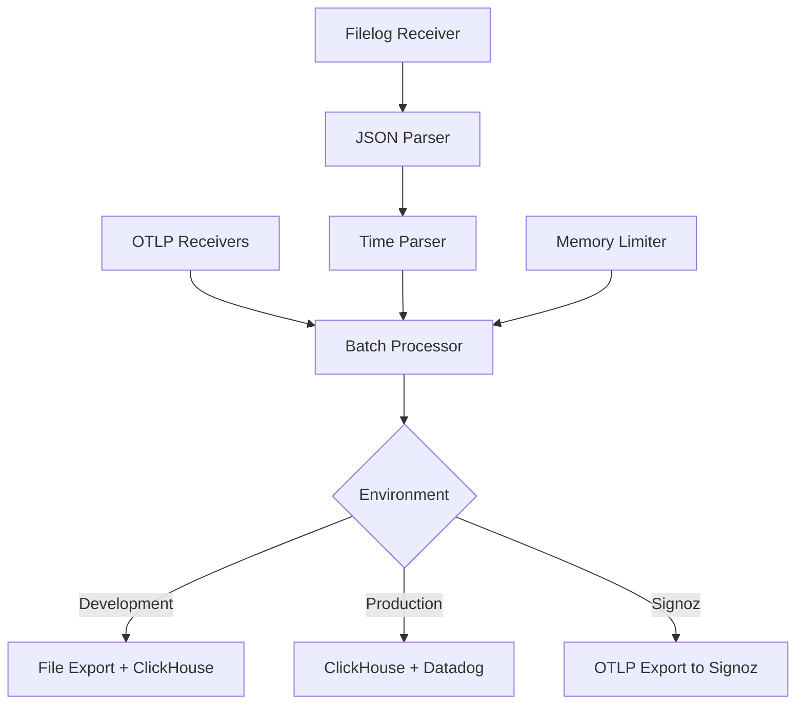
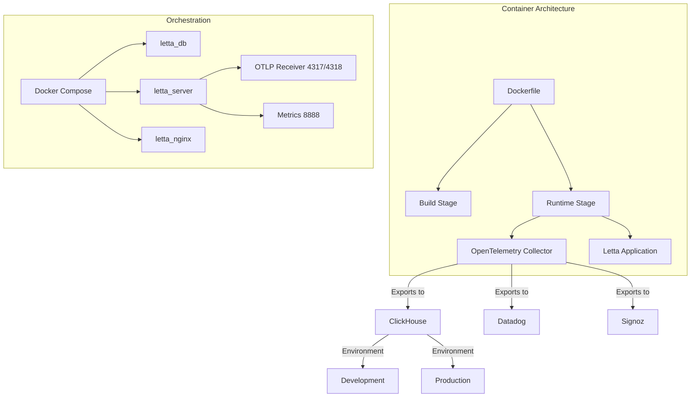
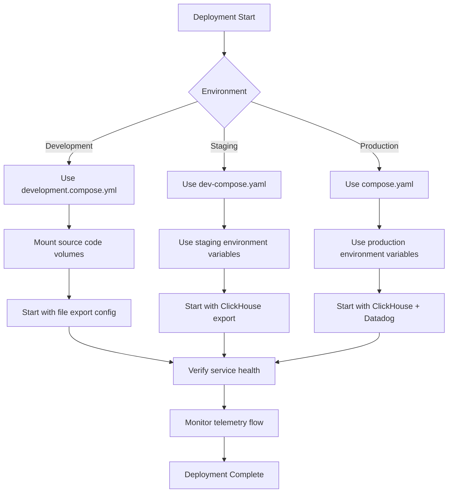

# Collector Deployment and Management

<cite>
**Referenced Files in This Document**   
- [start-otel-collector.sh](file://otel/start-otel-collector.sh)
- [otel-collector-config-clickhouse-dev.yaml](file://otel/otel-collector-config-clickhouse-dev.yaml)
- [otel-collector-config-clickhouse-prod.yaml](file://otel/otel-collector-config-clickhouse-prod.yaml)
- [otel-collector-config-clickhouse.yaml](file://otel/otel-collector-config-clickhouse.yaml)
- [otel-collector-config-file-dev.yaml](file://otel/otel-collector-config-file-dev.yaml)
- [otel-collector-config-file.yaml](file://otel/otel-collector-config-file.yaml)
- [otel-collector-config-signoz.yaml](file://otel/otel-collector-config-signoz.yaml)
- [Dockerfile](file://Dockerfile)
- [compose.yaml](file://compose.yaml)
- [dev-compose.yaml](file://dev-compose.yaml)
- [development.compose.yml](file://development.compose.yml)
- [startup.sh](file://letta/server/startup.sh)
- [scripts/docker-compose.yml](file://scripts/docker-compose.yml)
</cite>

## Table of Contents
1. [Introduction](#introduction)
2. [OpenTelemetry Collector Script Analysis](#opentelemetry-collector-script-analysis)
3. [Collector Configuration Files](#collector-configuration-files)
4. [Docker Containerization and Orchestration](#docker-containerization-and-orchestration)
5. [Deployment Workflows](#deployment-workflows)
6. [Monitoring and Health Checks](#monitoring-and-health-checks)
7. [Upgrade Procedures](#upgrade-procedures)
8. [Disaster Recovery Strategies](#disaster-recovery-strategies)
9. [Security Considerations](#security-considerations)
10. [Conclusion](#conclusion)

## Introduction
This document provides comprehensive guidance on the deployment and management of the OpenTelemetry collector within the Letta platform. It covers the operational aspects of the collector, including script functionality, containerization, orchestration, and environment-specific deployment strategies. The documentation details how telemetry data is collected, processed, and exported across different environments, with emphasis on reliability, security, and maintainability.

## OpenTelemetry Collector Script Analysis

The `start-otel-collector.sh` script provides automated installation and execution of the OpenTelemetry Collector, handling platform detection, version management, and configuration-based startup. The script ensures the collector is properly installed and running with the appropriate configuration for the current environment.

The script begins by defining configuration parameters including the collector version (0.96.0), installation directory, binary name, and Grafana URL for trace visualization. It includes functions to detect the operating system and architecture, supporting Darwin (macOS) and Linux on amd64 or arm64 architectures, while explicitly excluding Windows support.

Version management is handled through the `needs_update` function, which checks if the collector is already installed and whether the installed version matches the target version. If an update is needed or the collector is not installed, the script downloads the appropriate binary from GitHub releases, extracts it to the installation directory, and makes it executable.

The startup logic determines which configuration file to use based on environment variables. When `CLICKHOUSE_ENDPOINT` and `CLICKHOUSE_PASSWORD` are set, the collector starts with ClickHouse export configuration; otherwise, it uses file-based export for development purposes. After determining the configuration, the script displays a Grafana URL with the device ID for trace visualization and executes the collector with the selected configuration.

**Section sources**
- [start-otel-collector.sh](file://otel/start-otel-collector.sh#L1-L146)

## Collector Configuration Files

The OpenTelemetry collector is configured through multiple YAML configuration files that define receivers, processors, exporters, and service pipelines for different environments and use cases.

### Development Configuration
The `otel-collector-config-clickhouse-dev.yaml` file configures the collector for development environments with OTLP receivers on ports 4317 (gRPC) and 4318 (HTTP). It uses a batch processor with a 1-second timeout and 1024 batch size. The configuration exports traces and metrics to both ClickHouse (when credentials are provided) and local JSON files in the user's home directory with rotation settings (100MB max, 7 days, 5 backups).

### Production Configuration
The `otel-collector-config-clickhouse-prod.yaml` file provides a comprehensive production configuration that includes filelog receiver for parsing JSON logs from `/root/.letta/logs/Letta.log`. It includes JSON and time parsing operators to extract timestamp information. The configuration exports to both ClickHouse and Datadog, with the Datadog exporter configured with site and API key from environment variables and span name remappings for HTTP attributes.

### Base Configuration
The `otel-collector-config-clickhouse.yaml` file serves as a base configuration with memory limiting (1GB limit, 256MB spike) and larger batch processing (10s timeout, 8192 batch size). It includes health_check, pprof, and zpages extensions for monitoring and debugging. The service telemetry exposes metrics on port 8888.

### Alternative Export Configurations
Additional configurations include `otel-collector-config-file-dev.yaml` and `otel-collector-config-file.yaml` for file-only export (development and production respectively), and `otel-collector-config-signoz.yaml` for exporting to Signoz via OTLP with authentication headers.

**Diagram sources**
- [otel-collector-config-clickhouse-dev.yaml](file://otel/otel-collector-config-clickhouse-dev.yaml#L1-L54)
- [otel-collector-config-clickhouse-prod.yaml](file://otel/otel-collector-config-clickhouse-prod.yaml#L1-L91)
- [otel-collector-config-clickhouse.yaml](file://otel/otel-collector-config-clickhouse.yaml#L1-L82)
- [otel-collector-config-signoz.yaml](file://otel/otel-collector-config-signoz.yaml#L1-L49)

**Section sources**
- [otel-collector-config-clickhouse-dev.yaml](file://otel/otel-collector-config-clickhouse-dev.yaml#L1-L54)
- [otel-collector-config-clickhouse-prod.yaml](file://otel/otel-collector-config-clickhouse-prod.yaml#L1-L91)
- [otel-collector-config-clickhouse.yaml](file://otel/otel-collector-config-clickhouse.yaml#L1-L82)
- [otel-collector-config-file-dev.yaml](file://otel/otel-collector-config-file-dev.yaml#L1-L31)
- [otel-collector-config-file.yaml](file://otel/otel-collector-config-file.yaml#L1-L31)
- [otel-collector-config-signoz.yaml](file://otel/otel-collector-config-signoz.yaml#L1-L49)

## Docker Containerization and Orchestration

The OpenTelemetry collector is integrated into the Docker deployment architecture through the main Dockerfile and various Docker Compose configurations that define services, networks, and resource allocation.

### Dockerfile Integration
The Dockerfile includes explicit installation of the OpenTelemetry collector in the runtime stage. It downloads version 0.96.0 for Linux AMD64, extracts it to `/usr/local/bin`, and copies configuration files to `/etc/otel/` with standardized names. The collector binary is installed as `otelcol-contrib` and configured to run as part of the container startup process.

### Docker Compose Orchestration
Multiple Docker Compose files define the orchestration of services:

- `compose.yaml` defines the production setup with `letta_db`, `letta_server`, and `letta_nginx` services. The server service depends on environment variables for ClickHouse and other telemetry endpoints.
- `dev-compose.yaml` provides a development configuration with direct database connection and environment variable propagation.
- `development.compose.yml` includes volume mounting for hot-reloading during development.
- `scripts/docker-compose.yml` defines Redis and PostgreSQL services for testing.

The network configuration exposes ports 4317 and 4318 for OTLP ingestion, 8888 for metrics, and includes health checks for database services. Resource allocation is managed through Docker's default resource constraints, with memory limiting configured within the collector itself (1GB limit).

**Diagram sources**
- [Dockerfile](file://Dockerfile#L1-L89)
- [compose.yaml](file://compose.yaml#L1-L66)
- [dev-compose.yaml](file://dev-compose.yaml#L1-L49)
- [development.compose.yml](file://development.compose.yml#L1-L30)

**Section sources**
- [Dockerfile](file://Dockerfile#L1-L89)
- [compose.yaml](file://compose.yaml#L1-L66)
- [dev-compose.yaml](file://dev-compose.yaml#L1-L49)
- [development.compose.yml](file://development.compose.yml#L1-L30)
- [scripts/docker-compose.yml](file://scripts/docker-compose.yml#L1-L33)

## Deployment Workflows

The deployment workflows for different environments leverage environment-specific Docker Compose files and configuration management to ensure appropriate telemetry collection and export.

### Development Environment
The development workflow uses `development.compose.yml` with volume mounting for hot-reloading. The collector starts with file-based export configuration when ClickHouse credentials are not provided. The `startup.sh` script in the container checks for ClickHouse or Signoz environment variables and starts the collector with the appropriate configuration. Traces are exported to JSON files in the user's home directory with rotation settings.

### Staging Environment
The staging workflow uses `dev-compose.yaml` with the same image as production but potentially different environment variables. The collector can be configured to export to a staging ClickHouse instance or other staging telemetry backends. Database migrations are automatically applied during startup through the `alembic upgrade head` command in the startup script.

### Production Environment
The production workflow uses `compose.yaml` with externalized configuration through environment variables. The collector runs with the production configuration that exports to both ClickHouse and Datadog. The nginx service provides a reverse proxy for the application, and all services are configured with health checks to ensure reliability.

The deployment process follows a consistent pattern:
1. Pull the latest Docker image
2. Set environment variables (ClickHouse credentials, API keys, etc.)
3. Start services with Docker Compose
4. Verify health checks pass
5. Monitor collector startup and telemetry flow

**Section sources**
- [compose.yaml](file://compose.yaml#L1-L66)
- [dev-compose.yaml](file://dev-compose.yaml#L1-L49)
- [development.compose.yml](file://development.compose.yml#L1-L30)
- [startup.sh](file://letta/server/startup.sh#L1-L82)

## Monitoring and Health Checks

The OpenTelemetry collector and associated services include comprehensive monitoring and health check mechanisms to ensure reliability and facilitate troubleshooting.

### Collector Internal Monitoring
The collector configurations include several built-in extensions for monitoring:
- `health_check`: Provides a health endpoint for container orchestration
- `pprof`: Enables profiling for performance analysis
- `zpages`: Offers debugging pages for runtime information

The service telemetry configuration exposes metrics on port 8888, allowing external monitoring systems to scrape collector metrics. The memory_limiter processor provides built-in protection against memory exhaustion with configurable limits and spike handling.

### Container Health Checks
The Docker Compose configurations define health checks for database services:
- PostgreSQL uses `pg_isready` command to verify database readiness
- Redis uses `redis-cli ping` to verify connectivity

These health checks ensure that dependent services (like the Letta server) only start once their dependencies are fully operational, preventing startup failures due to unavailable databases.

### Application-Level Monitoring
The `startup.sh` script implements process management for the collector, capturing its process ID and setting up a cleanup trap to ensure graceful shutdown. This prevents orphaned processes and ensures proper resource cleanup during container termination.

The collector's logging level is set to "error" in all configurations, minimizing log noise while still capturing critical issues. The filelog receiver in production configurations parses application logs for structured data, enabling log-based monitoring and alerting.

**Section sources**
- [otel-collector-config-clickhouse-prod.yaml](file://otel/otel-collector-config-clickhouse-prod.yaml#L1-L91)
- [compose.yaml](file://compose.yaml#L1-L66)
- [startup.sh](file://letta/server/startup.sh#L1-L82)

## Upgrade Procedures

The upgrade procedures for the OpenTelemetry collector are designed to minimize downtime and ensure compatibility across versions.

### Automated Version Management
The `start-otel-collector.sh` script includes built-in version management that automatically detects and installs the required collector version. When executed, it checks the currently installed version against the target version (0.96.0) and downloads a new binary if:
- No collector is installed
- The installed version differs from the target version
- The version cannot be determined

This ensures that the collector is always running the expected version without manual intervention.

### Configuration Compatibility
The upgrade process maintains backward compatibility through consistent configuration file paths. The Dockerfile copies configuration files to standard locations (`/etc/otel/`), and the startup scripts reference these standard paths regardless of collector version. This decouples configuration from binary upgrades, allowing configuration changes to be managed independently.

### Zero-Downtime Upgrade Strategy
For production environments, a rolling upgrade strategy is recommended:
1. Deploy new collector version alongside existing instance
2. Gradually shift traffic using service mesh or load balancer
3. Monitor new instance for stability and performance
4. Decommission old instance after successful validation

The containerized deployment enables this strategy through Docker Compose's ability to manage multiple service versions and orchestrate traffic switching.

**Section sources**
- [start-otel-collector.sh](file://otel/start-otel-collector.sh#L1-L146)
- [Dockerfile](file://Dockerfile#L1-L89)

## Disaster Recovery Strategies

The disaster recovery strategies for the OpenTelemetry collector focus on data durability, service resilience, and rapid restoration capabilities.

### Data Persistence and Redundancy
The collector configurations include several features to prevent data loss:
- ClickHouse exporters have retry mechanisms with exponential backoff (5s initial, 30s max)
- Sending queues with configurable size (100-500 items) provide buffering during network outages
- File-based exporters include rotation policies to prevent disk exhaustion

In production environments, dual exporters (ClickHouse and Datadog) provide redundancy, ensuring telemetry data is preserved even if one backend becomes unavailable.

### Configuration Management
All collector configurations are stored in version-controlled files within the repository, enabling rapid restoration of configuration state. The use of environment variables for sensitive credentials allows secure configuration management without exposing secrets in version control.

### Backup and Restore
The disaster recovery process includes:
1. Regular backups of ClickHouse data using native backup tools
2. Version-controlled configuration files for collector setup
3. Container images stored in a registry for rapid redeployment

In the event of a failure, the recovery process involves:
1. Restoring the database from backup if needed
2. Redeploying containers using Docker Compose
3. Validating telemetry flow through the Grafana dashboard

The self-contained nature of the Docker deployment simplifies recovery, as the entire stack can be recreated from configuration files and container images.

**Section sources**
- [otel-collector-config-clickhouse-prod.yaml](file://otel/otel-collector-config-clickhouse-prod.yaml#L1-L91)
- [startup.sh](file://letta/server/startup.sh#L1-L82)
- [compose.yaml](file://compose.yaml#L1-L66)

## Security Considerations

The deployment incorporates multiple security measures for authentication, authorization, and encryption in transit.

### Authentication and Authorization
Sensitive credentials are managed through environment variables rather than hardcoded values:
- ClickHouse: `CLICKHOUSE_ENDPOINT`, `CLICKHOUSE_USERNAME`, `CLICKHOUSE_PASSWORD`
- Datadog: `DD_SITE`, `DD_API_KEY`
- Signoz: `SIGNOZ_ENDPOINT`, `SIGNOZ_INGESTION_KEY`

These environment variables are passed to containers at runtime, preventing credential exposure in configuration files or version control. The collector uses these credentials to authenticate with export backends.

### Encryption in Transit
All telemetry data transmission uses encrypted channels:
- OTLP over gRPC and HTTP uses TLS for data in transit
- ClickHouse connections are expected to use HTTPS endpoints
- Datadog and Signoz exporters use HTTPS for data transmission

The configuration files use environment variable references (e.g., `${CLICKHOUSE_ENDPOINT}`) which should be set to HTTPS URLs in production environments.

### Network Security
The deployment follows security best practices:
- Minimal port exposure (only necessary ports published)
- Internal service communication over Docker networks
- Environment-specific configurations that can restrict access

The collector listens on 0.0.0.0 for OTLP ingestion, but this is contained within the Docker network, with only the application endpoints exposed to the host. This reduces the attack surface while maintaining functionality.

**Section sources**
- [otel-collector-config-clickhouse-prod.yaml](file://otel/otel-collector-config-clickhouse-prod.yaml#L1-L91)
- [otel-collector-config-signoz.yaml](file://otel/otel-collector-config-signoz.yaml#L1-L49)
- [compose.yaml](file://compose.yaml#L1-L66)

## Conclusion
The OpenTelemetry collector deployment in the Letta platform is a robust, containerized solution that provides comprehensive telemetry collection across development, staging, and production environments. The architecture leverages Docker and Docker Compose for consistent deployment, with environment-specific configurations that adapt to different operational requirements.

Key strengths of the implementation include:
- Automated collector installation and version management
- Flexible configuration for different export backends
- Integrated monitoring and health checks
- Secure credential management
- Resilient design with retry mechanisms and redundancy

The deployment workflows are well-defined and consistent across environments, enabling reliable operations and simplifying maintenance. The disaster recovery strategies ensure data durability and rapid restoration capabilities, while security considerations address authentication, authorization, and encryption requirements.

This comprehensive approach to collector deployment and management provides a solid foundation for observability in the Letta platform, enabling effective monitoring, troubleshooting, and performance optimization.