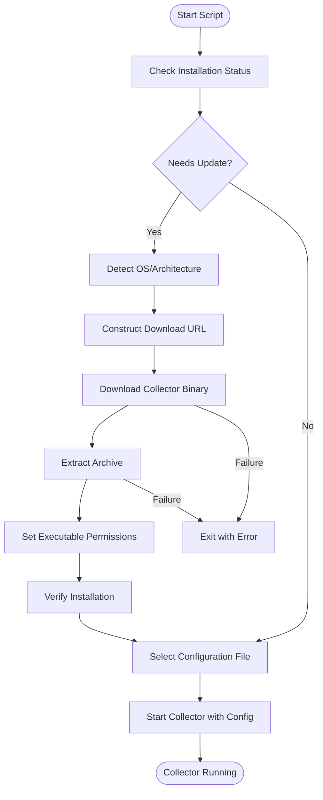
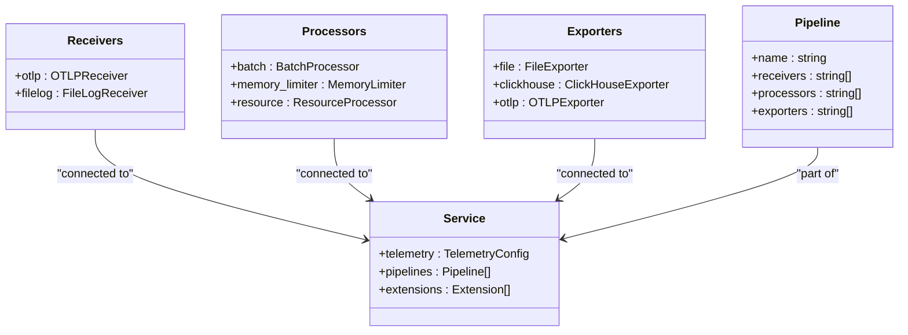
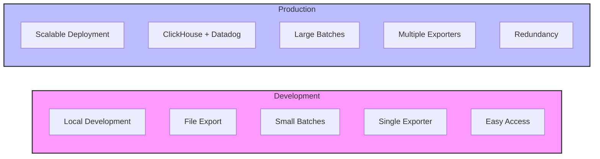
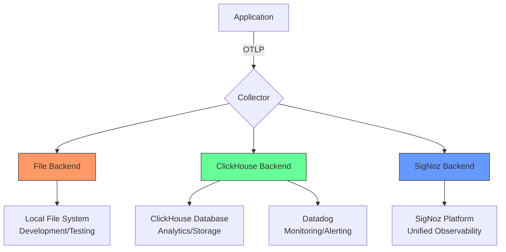
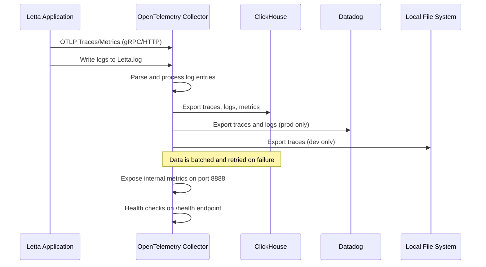
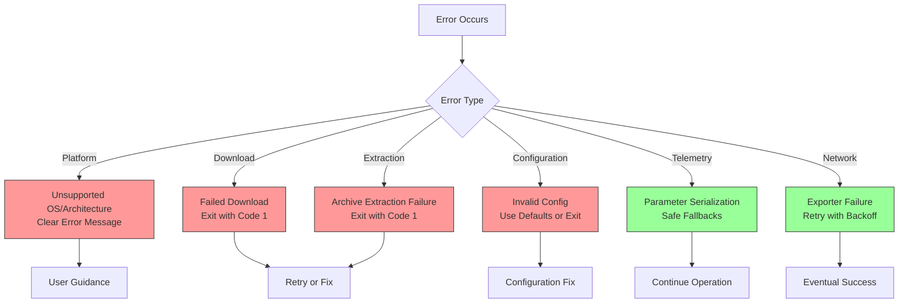
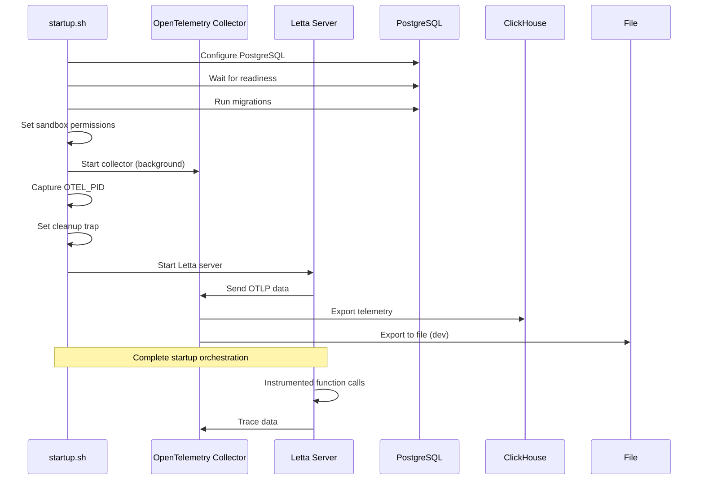

# Collector Scripting and Configuration

<cite>
**Referenced Files in This Document**   
- [start-otel-collector.sh](file://otel/start-otel-collector.sh)
- [otel-collector-config-file.yaml](file://otel/otel-collector-config-file.yaml)
- [otel-collector-config-clickhouse.yaml](file://otel/otel-collector-config-clickhouse.yaml)
- [otel-collector-config-signoz.yaml](file://otel/otel-collector-config-signoz.yaml)
- [otel-collector-config-file-dev.yaml](file://otel/otel-collector-config-file-dev.yaml)
- [otel-collector-config-clickhouse-dev.yaml](file://otel/otel-collector-config-clickhouse-dev.yaml)
- [otel-collector-config-clickhouse-prod.yaml](file://otel/otel-collector-config-clickhouse-prod.yaml)
- [startup.sh](file://letta/server/startup.sh)
- [tracing.py](file://letta/otel/tracing.py)
- [metrics.py](file://letta/otel/metrics.py)
</cite>

## Table of Contents
1. [Introduction](#introduction)
2. [OpenTelemetry Collector Script Analysis](#opentelemetry-collector-script-analysis)
3. [Configuration File Structure](#configuration-file-structure)
4. [Development vs Production Configuration](#development-vs-production-configuration)
5. [Backend-Specific Configuration](#backend-specific-configuration)
6. [Data Flow and Pipeline Architecture](#data-flow-and-pipeline-architecture)
7. [Error Handling and Logging](#error-handling-and-logging)
8. [Troubleshooting Guide](#troubleshooting-guide)
9. [Integration with Letta Server](#integration-with-letta-server)
10. [Best Practices and Recommendations](#best-practices-and-recommendations)

## Introduction

The OpenTelemetry collector scripting and configuration system in the Letta repository provides a comprehensive observability solution for monitoring, tracing, and analyzing the application's performance and behavior. This documentation details the implementation of the `start-otel-collector.sh` script, the structure and purpose of various YAML configuration files for different backends, and how these components work together to collect and export telemetry data.

The system supports multiple backend configurations including file-based storage, ClickHouse, and SigNoz, allowing for flexible deployment scenarios from development to production environments. The collector is responsible for receiving telemetry data via OTLP (OpenTelemetry Protocol), processing it through various stages, and exporting it to designated destinations for analysis and visualization.

**Section sources**
- [start-otel-collector.sh](file://otel/start-otel-collector.sh#L1-L145)
- [otel-collector-config-file.yaml](file://otel/otel-collector-config-file.yaml#L1-L30)

## OpenTelemetry Collector Script Analysis

The `start-otel-collector.sh` script serves as the primary mechanism for deploying and managing the OpenTelemetry collector in the Letta environment. This bash script handles the complete lifecycle of the collector, from installation and version management to configuration-based startup.

The script begins by defining key configuration parameters including the OpenTelemetry Collector version (0.96.0), installation directory (bin), and binary name (otelcol-contrib). It includes a robust platform detection function that identifies the operating system and architecture, supporting Darwin (macOS) and Linux on amd64 or arm64 architectures. Windows is explicitly not supported, with appropriate error messaging directing users to submit GitHub issues for support requests.

Version management is a core feature of the script, with functions to check the currently installed version and determine if an update is needed. The `needs_update()` function compares the installed version with the configured version, triggering a download and installation process when versions differ. This ensures consistent collector versions across deployments and facilitates seamless updates.

The installation process follows these steps:
1. Create the installation directory if it doesn't exist
2. Detect the platform architecture
3. Construct the appropriate download URL from GitHub releases
4. Download the collector binary archive using curl with error handling
5. Extract the archive to the installation directory
6. Set executable permissions on the binary
7. Verify the installation by checking the version

The script implements proper error handling throughout, exiting with status code 1 on any failure during download or extraction. This prevents partial or corrupted installations from being used in production environments.

After installation, the script determines the appropriate configuration file based on environment variables. When both `CLICKHOUSE_ENDPOINT` and `CLICKHOUSE_PASSWORD` are set, it uses the ClickHouse development configuration. Otherwise, it defaults to file-based export configuration. This conditional logic allows for environment-specific telemetry routing without requiring different startup scripts.

A notable feature is the generation of a device ID using the Python UUID library, which is then used to construct a direct link to Grafana for viewing traces. This provides immediate feedback and accessibility to collected telemetry data.



**Diagram sources**
- [start-otel-collector.sh](file://otel/start-otel-collector.sh#L1-L145)

**Section sources**
- [start-otel-collector.sh](file://otel/start-otel-collector.sh#L1-L145)

## Configuration File Structure

The OpenTelemetry collector configuration files follow the standard OpenTelemetry Collector format, organized into four main sections: receivers, processors, exporters, and service. Each configuration file defines how telemetry data is ingested, processed, and exported within the system.

### Receivers Configuration

Receivers define the endpoints where telemetry data is accepted. All configurations include the OTLP receiver, which supports both gRPC and HTTP protocols on standard ports 4317 and 4318 respectively. The OTLP receiver is the primary mechanism for receiving traces, metrics, and logs from the Letta application.

```yaml
receivers:
  otlp:
    protocols:
      grpc:
        endpoint: 0.0.0.0:4317
      http:
        endpoint: 0.0.0.0:4318
```

The ClickHouse configurations additionally include a filelog receiver that monitors the Letta application log file (`/root/.letta/logs/Letta.log`). This receiver includes sophisticated parsing capabilities to handle both JSON and timestamped log entries:

```yaml
receivers:
  filelog:
    include:
      - /root/.letta/logs/Letta.log
    multiline:
      line_start_pattern: '^[\{\[]|^[0-9]{4}-[0-9]{2}-[0-9]{2}'
    operators:
      - type: json_parser
        parse_from: body
        parse_to: attributes
        on_error: send
      - type: time_parser
        parse_from: attributes.timestamp
        layout_type: gotime
        layout: '2006-01-02T15:04:05.999999Z07:00'
        on_error: send
        if: 'attributes.timestamp != nil'
```

### Processors Configuration

Processors transform and enhance telemetry data as it flows through the pipeline. Different configurations employ varying processor strategies based on the target environment and backend capabilities.

The file-based configurations use a simple batch processor with aggressive batching settings suitable for development:

```yaml
processors:
  batch:
    timeout: 1s
    send_batch_size: 1024
```

Production-oriented configurations include additional processors:
- **memory_limiter**: Prevents the collector from consuming excessive memory (1GB limit with 256MB spike allowance)
- **resource**: Adds environment-specific attributes to telemetry data
- **batch**: Uses larger batch sizes and longer timeouts for improved efficiency

```yaml
processors:
  memory_limiter:
    check_interval: 1s
    limit_mib: 1024
    spike_limit_mib: 256
  batch:
    timeout: 10s
    send_batch_size: 8192
```

### Exporters Configuration

Exporters define the destinations for telemetry data. The configuration files support multiple exporter types depending on the backend:

**File Exporter**: Used in development configurations to write traces to JSON files with rotation policies:

```yaml
exporters:
  file:
    path: /root/.letta/logs/traces.json
    rotation:
      max_megabytes: 100
      max_days: 7
      max_backups: 5
```

**ClickHouse Exporter**: Used for ClickHouse backends, with configurable connection parameters and retry policies:

```yaml
exporters:
  clickhouse:
    endpoint: ${CLICKHOUSE_ENDPOINT}
    database: ${CLICKHOUSE_DATABASE}
    username: ${CLICKHOUSE_USERNAME}
    password: ${CLICKHOUSE_PASSWORD}
    timeout: 5s
    sending_queue:
      queue_size: 100
    retry_on_failure:
      enabled: true
      initial_interval: 5s
      max_interval: 30s
      max_elapsed_time: 300s
```

**OTLP Exporter**: Used for SigNoz integration, with authentication headers:

```yaml
exporters:
  otlp:
    endpoint: ${SIGNOZ_ENDPOINT}
    headers:
      "signoz-ingestion-key": "${SIGNOZ_INGESTION_KEY}"
```

### Service Configuration

The service section defines the overall behavior of the collector, including telemetry settings and pipeline definitions. All configurations include error-level logging for the collector itself:

```yaml
service:
  telemetry:
    logs:
      level: error
```

The pipelines section connects receivers, processors, and exporters into functional data processing workflows. Most configurations define separate pipelines for traces, logs, and metrics, allowing for independent processing and export strategies.



**Diagram sources**
- [otel-collector-config-file.yaml](file://otel/otel-collector-config-file.yaml#L1-L30)
- [otel-collector-config-clickhouse.yaml](file://otel/otel-collector-config-clickhouse.yaml#L1-L81)
- [otel-collector-config-signoz.yaml](file://otel/otel-collector-config-signoz.yaml#L1-L48)

**Section sources**
- [otel-collector-config-file.yaml](file://otel/otel-collector-config-file.yaml#L1-L30)
- [otel-collector-config-clickhouse.yaml](file://otel/otel-collector-config-clickhouse.yaml#L1-L81)
- [otel-collector-config-signoz.yaml](file://otel/otel-collector-config-signoz.yaml#L1-L48)

## Development vs Production Configuration

The Letta repository provides distinct configuration files for development and production environments, reflecting different requirements for observability, performance, and reliability.

### Development Configuration

The development configurations (`otel-collector-config-file-dev.yaml` and `otel-collector-config-clickhouse-dev.yaml`) are optimized for local development and debugging. Key characteristics include:

- **Local endpoints**: Using `localhost` for OTLP receivers in file-dev configuration
- **User directory paths**: Storing data in `${HOME}/.letta/logs/` for easy access
- **Smaller batch sizes**: 1024 items with 1-second timeout for faster feedback
- **Dual export capability**: Development ClickHouse configuration exports to both file and ClickHouse for local verification

The file-based development configuration is particularly useful for isolated development without external dependencies:

```yaml
receivers:
  otlp:
    protocols:
      grpc:
        endpoint: localhost:4317
      http:
        endpoint: localhost:4318

exporters:
  file:
    path: ${HOME}/.letta/logs/traces.json
    rotation:
      max_megabytes: 100
      max_days: 7
      max_backups: 5
```

This allows developers to capture and inspect telemetry data locally without requiring a ClickHouse or SigNoz instance.

### Production Configuration

The production configuration (`otel-collector-config-clickhouse-prod.yaml`) is designed for high-availability, scalable deployments with enhanced reliability features:

- **Robust error handling**: Comprehensive retry policies with exponential backoff
- **Multiple exporters**: Exporting to both ClickHouse and Datadog for redundancy and specialized analysis
- **Enhanced processing**: Memory limiting and larger batch sizes for performance optimization
- **Log ingestion**: Active collection and parsing of application logs in addition to OTLP data

The production configuration demonstrates a multi-destination strategy:

```yaml
exporters:
  clickhouse:
    # ClickHouse configuration
  datadog:
    api:
      site: ${env:DD_SITE}
      key: ${env:DD_API_KEY}
    traces:
      span_name_as_resource_name: true
      span_name_remappings:
        http.method: http.request.method
        http.status_code: http.response.status_code

service:
  pipelines:
    traces:
      exporters: [clickhouse, datadog]
    logs:
      exporters: [clickhouse, datadog]
    metrics:
      exporters: [clickhouse]
```

This approach provides several benefits:
1. **Redundancy**: Critical telemetry data is sent to multiple destinations
2. **Specialization**: Different backends can be used for different purposes (ClickHouse for long-term storage, Datadog for real-time monitoring)
3. **Migration flexibility**: Allows gradual migration between observability platforms

The production configuration also includes environment variable interpolation for the environment attribute, enabling proper tagging of telemetry data by deployment environment:

```yaml
processors:
  resource:
    attributes:
      - key: environment
        value: ${env:LETTA_ENVIRONMENT}
        action: upsert
```



**Diagram sources**
- [otel-collector-config-file-dev.yaml](file://otel/otel-collector-config-file-dev.yaml#L1-L30)
- [otel-collector-config-clickhouse-dev.yaml](file://otel/otel-collector-config-clickhouse-dev.yaml#L1-L53)
- [otel-collector-config-clickhouse-prod.yaml](file://otel/otel-collector-config-clickhouse-prod.yaml#L1-L90)

**Section sources**
- [otel-collector-config-file-dev.yaml](file://otel/otel-collector-config-file-dev.yaml#L1-L30)
- [otel-collector-config-clickhouse-dev.yaml](file://otel/otel-collector-config-clickhouse-dev.yaml#L1-L53)
- [otel-collector-config-clickhouse-prod.yaml](file://otel/otel-collector-config-clickhouse-prod.yaml#L1-L90)

## Backend-Specific Configuration

The Letta repository supports multiple backend configurations for the OpenTelemetry collector, each tailored to specific observability platforms and use cases.

### File Backend Configuration

The file backend configurations (`otel-collector-config-file.yaml` and `otel-collector-config-file-dev.yaml`) provide a simple, dependency-free option for telemetry collection. These configurations are ideal for:

- Local development and testing
- Environments without external observability infrastructure
- Temporary data capture for debugging
- Backup or fallback collection

Key features of the file backend:
- **JSON format output**: Human-readable and easily parseable
- **Automatic rotation**: Prevents unbounded log growth with size and time-based rotation
- **Simple configuration**: Minimal setup required
- **Local storage**: Data stored directly on the filesystem

The rotation policy ensures that log files are managed efficiently:
- Maximum file size: 100MB
- Maximum retention: 7 days
- Maximum backup files: 5

This prevents disk space exhaustion while maintaining a reasonable history for debugging purposes.

### ClickHouse Backend Configuration

The ClickHouse configurations (`otel-collector-config-clickhouse.yaml`, `otel-collector-config-clickhouse-dev.yaml`, and `otel-collector-config-clickhouse-prod.yaml`) leverage ClickHouse as a high-performance columnar database for telemetry storage. These configurations are designed for:

- High-volume data ingestion
- Complex analytical queries
- Long-term data retention
- Cost-effective storage

The ClickHouse exporter configuration includes several important parameters:

```yaml
exporters:
  clickhouse:
    endpoint: ${CLICKHOUSE_ENDPOINT}
    database: ${CLICKHOUSE_DATABASE}
    username: ${CLICKHOUSE_USERNAME}
    password: ${CLICKHOUSE_PASSWORD}
    timeout: 5s
    sending_queue:
      queue_size: 100
    retry_on_failure:
      enabled: true
      initial_interval: 5s
      max_interval: 30s
      max_elapsed_time: 300s
```

Key aspects:
- **Environment variable interpolation**: All connection parameters are provided via environment variables for security and flexibility
- **Retry mechanism**: Robust retry policy with exponential backoff to handle temporary connectivity issues
- **Queue management**: In-memory queue to buffer data during network outages
- **Timeout configuration**: Prevents indefinite blocking on failed requests

The production ClickHouse configuration adds Datadog as a secondary exporter, creating a hybrid observability strategy that combines the strengths of both platforms.

### SigNoz Backend Configuration

The SigNoz configuration (`otel-collector-config-signoz.yaml`) integrates with the SigNoz observability platform, which provides a complete monitoring solution including metrics, traces, and logs. This configuration is optimized for:

- Unified observability interface
- Advanced tracing capabilities
- Real-time monitoring
- Alerting and notification

```yaml
exporters:
  otlp:
    endpoint: ${SIGNOZ_ENDPOINT}
    headers:
      "signoz-ingestion-key": "${SIGNOZ_INGESTION_KEY}"
```

The configuration uses standard OTLP export to SigNoz, with authentication handled through a dedicated ingestion key header. This approach ensures secure transmission of telemetry data while maintaining compatibility with the OpenTelemetry ecosystem.

All backend configurations share a common service structure with extensions for health monitoring:

```yaml
extensions:
  health_check:
  pprof:
  zpages:

service:
  extensions: [health_check, pprof, zpages]
  telemetry:
    metrics:
      address: 0.0.0.0:8888
```

This provides:
- **Health checking**: HTTP endpoint to monitor collector status
- **Performance profiling**: pprof integration for performance analysis
- **Diagnostic pages**: zPages for runtime diagnostics
- **Metrics exposure**: Prometheus-compatible metrics on port 8888



**Diagram sources**
- [otel-collector-config-file.yaml](file://otel/otel-collector-config-file.yaml#L1-L30)
- [otel-collector-config-clickhouse.yaml](file://otel/otel-collector-config-clickhouse.yaml#L1-L81)
- [otel-collector-config-signoz.yaml](file://otel/otel-collector-config-signoz.yaml#L1-L48)

**Section sources**
- [otel-collector-config-file.yaml](file://otel/otel-collector-config-file.yaml#L1-L30)
- [otel-collector-config-clickhouse.yaml](file://otel/otel-collector-config-clickhouse.yaml#L1-L81)
- [otel-collector-config-signoz.yaml](file://otel/otel-collector-config-signoz.yaml#L1-L48)

## Data Flow and Pipeline Architecture

The OpenTelemetry collector in the Letta system implements a sophisticated data flow architecture with multiple parallel pipelines for different telemetry types. This section details the complete data flow from ingestion to export.

### Pipeline Structure

The collector defines separate pipelines for traces, logs, and metrics, allowing for independent processing and export strategies. This separation provides several advantages:

- **Independent scaling**: Each pipeline can be optimized for its specific data type
- **Fault isolation**: Issues in one pipeline don't affect others
- **Flexible routing**: Different data types can be sent to different destinations
- **Resource optimization**: Processing can be tailored to the characteristics of each data type

The standard pipeline structure follows the pattern:
```
Receivers → Processors → Exporters
```

### Trace Pipeline

The trace pipeline handles distributed tracing data from the Letta application:

```yaml
pipelines:
  traces:
    receivers: [otlp]
    processors: [memory_limiter, batch]
    exporters: [clickhouse]
```

1. **Ingestion**: OTLP receiver accepts trace data via gRPC or HTTP
2. **Processing**: 
   - Memory limiter prevents excessive memory usage
   - Batch processor aggregates spans for efficient export
3. **Export**: ClickHouse exporter writes trace data to the database

The trace data includes comprehensive information about request flows, function calls, and performance characteristics, enabling detailed analysis of application behavior.

### Log Pipeline

The log pipeline processes application log data, with configuration varying by environment:

```yaml
pipelines:
  logs:
    receivers: [filelog]
    processors: [resource, memory_limiter, batch]
    exporters: [clickhouse]
```

1. **Ingestion**: Filelog receiver monitors the Letta application log file
2. **Parsing**: 
   - JSON parser extracts structured data from JSON log entries
   - Time parser converts timestamp strings to proper time values
3. **Enrichment**: Resource processor adds environment context
4. **Processing**: Memory limiter and batch processor prepare data for export
5. **Export**: ClickHouse exporter stores logs in the database

The multiline configuration ensures proper handling of multi-line log entries, while the conditional time parsing prevents errors on non-timestamped entries.

### Metric Pipeline

The metric pipeline handles application metrics:

```yaml
pipelines:
  metrics:
    receivers: [otlp]
    processors: [memory_limiter, batch]
    exporters: [clickhouse]
```

1. **Ingestion**: OTLP receiver accepts metric data
2. **Processing**: Memory limiting and batching
3. **Export**: ClickHouse exporter stores metrics

The service configuration also exposes internal collector metrics on port 8888, allowing monitoring of the collector's own performance and health.

### Data Flow Sequence



### Integration with Application Tracing

The collector works in conjunction with application-level tracing implemented in `letta/otel/tracing.py`. This integration provides:

- **Automatic instrumentation**: Key functions are decorated with `@trace_method`
- **Parameter handling**: Large parameters are excluded or truncated to prevent memory issues
- **Error tracking**: Exceptions are recorded with full context
- **Cancellation monitoring**: Async task cancellations are tracked

The tracing system includes safeguards to prevent excessive memory usage:

```python
# Parameters to skip entirely (known to be large)
SKIP_PARAMS = {
    "agent_state",
    "messages",
    "content",
    "source_code",
    "embeddings",
    # ... others
}
```

This ensures that telemetry collection doesn't impact application performance or stability.

**Diagram sources**
- [otel-collector-config-clickhouse.yaml](file://otel/otel-collector-config-clickhouse.yaml#L62-L81)
- [otel-collector-config-clickhouse-prod.yaml](file://otel/otel-collector-config-clickhouse-prod.yaml#L71-L90)
- [tracing.py](file://letta/otel/tracing.py#L234-L251)

**Section sources**
- [otel-collector-config-clickhouse.yaml](file://otel/otel-collector-config-clickhouse.yaml#L62-L81)
- [otel-collector-config-clickhouse-prod.yaml](file://otel/otel-collector-config-clickhouse-prod.yaml#L71-L90)
- [tracing.py](file://letta/otel/tracing.py#L234-L251)

## Error Handling and Logging

The OpenTelemetry collector implementation in the Letta system includes comprehensive error handling and logging mechanisms at both the collector and application levels.

### Collector Script Error Handling

The `start-otel-collector.sh` script implements robust error handling to ensure reliable operation:

- **Immediate exit on error**: The `set -e` directive causes the script to exit immediately on any command failure
- **Platform validation**: Explicit checks for supported operating systems and architectures
- **Download verification**: Error handling around curl downloads with appropriate messaging
- **Archive extraction validation**: Verification that extraction completes successfully
- **Version verification**: Confirmation of successful installation by checking the binary version

The script provides clear error messages for common failure scenarios:
- Unsupported operating systems
- Unsupported architectures
- Download failures
- Extraction issues

These messages include guidance for resolution, such as requesting support through GitHub issues for unsupported platforms.

### Configuration-Based Error Handling

The YAML configuration files include built-in error handling mechanisms:

**Retry Policies**: The ClickHouse exporter includes comprehensive retry configuration:

```yaml
retry_on_failure:
  enabled: true
  initial_interval: 5s
  max_interval: 30s
  max_elapsed_time: 300s
```

This implements exponential backoff with a maximum retry duration of 5 minutes, preventing infinite retry loops while maintaining resilience to temporary outages.

**Queue Management**: The sending queue buffers data during connectivity issues:

```yaml
sending_queue:
  queue_size: 100
  enabled: true
```

This prevents data loss when the destination is temporarily unavailable.

**Error Tolerance in Log Processing**: The filelog receiver includes error handling for malformed entries:

```yaml
operators:
  - type: json_parser
    parse_from: body
    parse_to: attributes
    on_error: send  # Continue processing even if parsing fails
```

This ensures that a single malformed log entry doesn't disrupt the entire log processing pipeline.

### Application-Level Error Tracking

The application code in `letta/otel/tracing.py` implements sophisticated error handling for telemetry collection:

- **Serialization safeguards**: Attempts to serialize parameters with fallbacks for unserializable objects
- **Size limiting**: Truncation of large parameter values to prevent memory exhaustion
- **Exception recording**: Full exception details captured in traces
- **Cancellation tracking**: Special handling for asyncio.CancelledError

The tracing decorator includes comprehensive error handling:

```python
def _add_parameters_to_span(span, func, args, kwargs):
    try:
        # Add parameters with size limits and exclusions
        # ...
    except (TypeError, ValueError, AttributeError) as e:
        logger.debug(f"Failed to add parameters to span: {type(e).__name__}: {e}")
    except Exception as e:
        logger.debug(f"Unexpected error adding parameters to span: {type(e).__name__}: {e}")
```

This prevents telemetry collection failures from affecting application functionality.

### Logging Configuration

The collector's own logging is configured for minimal verbosity:

```yaml
service:
  telemetry:
    logs:
      level: error
```

This reduces noise from the collector itself while still capturing critical issues. The application logs are collected separately through the filelog receiver, providing a complete picture of system behavior.

The integration between OpenTelemetry and Datadog includes trace correlation:

```python
# Add OpenTelemetry trace correlation (for OTEL → Datadog integration)
try:
    from opentelemetry import trace
    span = trace.get_current_span()
    if span and span.get_span_context().is_valid:
        ctx = span.get_span_context()
        log_data["dd.trace_id"] = str(ctx.trace_id)
        log_data["dd.span_id"] = str(ctx.span_id)
except Exception:
    pass  # Fail silently if OTEL is not available
```

This enables seamless correlation between traces and logs in the monitoring backend.



**Diagram sources**
- [start-otel-collector.sh](file://otel/start-otel-collector.sh#L1-L145)
- [otel-collector-config-clickhouse.yaml](file://otel/otel-collector-config-clickhouse.yaml#L51-L54)
- [tracing.py](file://letta/otel/tracing.py#L356-L369)

**Section sources**
- [start-otel-collector.sh](file://otel/start-otel-collector.sh#L1-L145)
- [otel-collector-config-clickhouse.yaml](file://otel/otel-collector-config-clickhouse.yaml#L51-L54)
- [tracing.py](file://letta/otel/tracing.py#L356-L369)

## Troubleshooting Guide

This section provides guidance for diagnosing and resolving common issues with the OpenTelemetry collector setup in the Letta system.

### Startup Failures

**Issue**: Script fails to start with "Unsupported operating system" error
- **Cause**: Running on an unsupported platform (Windows or unsupported Linux distribution)
- **Solution**: The script explicitly does not support Windows. For other platforms, check the `detect_platform()` function and consider submitting a GitHub issue for support

**Issue**: "Failed to download OpenTelemetry Collector" error
- **Cause**: Network connectivity issues, GitHub rate limiting, or incorrect URL construction
- **Solution**: 
  - Verify internet connectivity
  - Check that the OTEL_VERSION matches an available release
  - Ensure curl is installed and accessible
  - Verify the constructed download URL is correct

**Issue**: "Cannot determine installed version" warning
- **Cause**: Corrupted or incomplete installation
- **Solution**: The script will automatically reinstall. If issues persist, manually remove the bin directory and restart

### Misconfigured Exporters

**Issue**: ClickHouse exporter fails to connect
- **Symptoms**: Data not appearing in ClickHouse, retry messages in logs
- **Diagnosis**: 
  - Verify all required environment variables are set: `CLICKHOUSE_ENDPOINT`, `CLICKHOUSE_DATABASE`, `CLICKHOUSE_USERNAME`, `CLICKHOUSE_PASSWORD`
  - Test connectivity to the ClickHouse endpoint independently
  - Check network firewall rules
- **Solution**: 
  - Verify credentials and endpoint URL
  - Ensure the ClickHouse server is running and accessible
  - Check that the database exists and the user has appropriate permissions

**Issue**: SigNoz ingestion fails
- **Symptoms**: Data not appearing in SigNoz dashboard
- **Diagnosis**:
  - Verify `SIGNOZ_ENDPOINT` and `SIGNOZ_INGESTION_KEY` environment variables
  - Check network connectivity to the SigNoz endpoint
  - Verify the ingestion key has appropriate permissions
- **Solution**:
  - Regenerate the ingestion key if necessary
  - Confirm the endpoint URL is correct
  - Check SigNoz cluster health

### Network Connectivity Issues

**Issue**: OTLP receiver not receiving data from application
- **Diagnosis**:
  - Verify the application is configured to send to the correct endpoint (0.0.0.0:4317 for gRPC, 0.0.0.0:4318 for HTTP)
  - Check firewall rules on both application and collector hosts
  - Verify network routing between application and collector
- **Solution**:
  - Use `netstat` or `ss` to verify the collector is listening on the expected ports
  - Use `telnet` or `nc` to test connectivity
  - Check application logs for OTLP export errors

**Issue**: High latency in telemetry data
- **Diagnosis**:
  - Check batch processor configuration (timeout and size)
  - Monitor network bandwidth between application and collector
  - Check collector resource usage (CPU, memory)
- **Solution**:
  - Adjust batch timeout and size for better performance
  - Scale collector resources if needed
  - Consider colocating collector with application to reduce network hops

### Data Collection Issues

**Issue**: Missing log data
- **Diagnosis**:
  - Verify the filelog receiver is configured and the log file path is correct
  - Check file permissions for the log file
  - Verify the log file is being written by the application
- **Solution**:
  - Ensure the collector has read permissions on the log file
  - Verify the file path matches the actual log location
  - Check that log entries match the multiline pattern

**Issue**: Truncated or missing parameter data in traces
- **Diagnosis**:
  - Large parameters are intentionally excluded or truncated to prevent memory issues
  - Check the `SKIP_PARAMS` list in `tracing.py`
- **Solution**:
  - This is expected behavior for large parameters like messages, agent_state, etc.
  - The system preserves IDs and metadata for observability while excluding large payloads

### Verification Steps

1. **Check collector status**:
   ```bash
   ps aux | grep otelcol-contrib
   ```

2. **Verify listening ports**:
   ```bash
   netstat -tlnp | grep 4317
   netstat -tlnp | grep 4318
   ```

3. **Check configuration file**:
   ```bash
   ./bin/otelcol-contrib --config "otel/otel-collector-config-file-dev.yaml" --dry-run
   ```

4. **Monitor logs**:
   ```bash
   tail -f /root/.letta/logs/Letta.log
   ```

5. **Test connectivity**:
   ```bash
   curl -v http://localhost:4318/v1/traces -X POST -H "Content-Type: application/json" -d '{}'
   ```

**Section sources**
- [start-otel-collector.sh](file://otel/start-otel-collector.sh#L1-L145)
- [otel-collector-config-clickhouse.yaml](file://otel/otel-collector-config-clickhouse.yaml#L42-L54)
- [tracing.py](file://letta/otel/tracing.py#L234-L251)

## Integration with Letta Server

The OpenTelemetry collector is tightly integrated with the Letta server through the `startup.sh` script, which orchestrates the complete application startup process including database initialization, migration, and collector management.

The server startup script follows this sequence:
1. Configure PostgreSQL (internal or external)
2. Wait for PostgreSQL readiness
3. Run database migrations
4. Set permissions for sandbox execution
5. Start the OpenTelemetry collector
6. Start the Letta server application

The collector is started as a background process with proper cleanup handling:

```bash
# Start OpenTelemetry Collector in the background
if [ -n "$CLICKHOUSE_ENDPOINT" ] && [ -n "$CLICKHOUSE_PASSWORD" ]; then
    echo "Starting OpenTelemetry Collector with Clickhouse export..."
    CONFIG_FILE="/etc/otel/config-clickhouse.yaml"
elif [ -n "$SIGNOZ_ENDPOINT" ] && [ -n "$SIGNOZ_INGESTION_KEY" ]; then
    echo "Starting OpenTelemetry Collector with Signoz export..."
    CONFIG_FILE="/etc/otel/config-signoz.yaml"
else
    echo "Starting OpenTelemetry Collector with file export only..."
    CONFIG_FILE="/etc/otel/config-file.yaml"
fi

/usr/local/bin/otelcol-contrib --config "$CONFIG_FILE" &
OTEL_PID=$!

# Function to cleanup processes on exit
cleanup() {
    echo "Shutting down..."
    kill $OTEL_PID
    wait $OTEL_PID
}
trap cleanup EXIT
```

This implementation ensures:
- **Proper process management**: The collector PID is captured and cleaned up on exit
- **Signal handling**: The trap ensures graceful shutdown
- **Configuration consistency**: Uses the same logic as the standalone script for configuration selection
- **Background execution**: Allows the server to start while the collector runs independently

The integration also includes application-level telemetry through the `letta/otel` package, which provides:
- **Tracing**: Function-level tracing with parameter monitoring
- **Metrics**: Endpoint latency and error tracking
- **Resource detection**: Automatic detection of service environment
- **Exception handling**: Comprehensive error reporting

The tracing system is initialized in the application code and automatically instruments key functions, providing end-to-end visibility into application behavior.



**Diagram sources**
- [startup.sh](file://letta/server/startup.sh#L56-L76)

**Section sources**
- [startup.sh](file://letta/server/startup.sh#L56-L76)
- [tracing.py](file://letta/otel/tracing.py#L127-L141)

## Best Practices and Recommendations

Based on the analysis of the OpenTelemetry collector implementation in the Letta system, the following best practices and recommendations are provided for effective observability configuration.

### Configuration Management

**Use environment-specific configurations**: Maintain separate configuration files for development, staging, and production environments, as demonstrated by the existing file structure. This allows for appropriate tuning of parameters like batch sizes, timeouts, and export destinations.

**Leverage environment variables**: Follow the pattern of using environment variables for sensitive information (passwords, API keys) and deployment-specific settings (endpoints, database names). This enhances security and deployment flexibility.

**Implement configuration validation**: Consider adding a dry-run option or configuration validation step to catch errors before startup, reducing deployment failures.

### Performance Optimization

**Tune batch processing parameters**: Adjust batch timeout and size based on your data volume and latency requirements. The production configuration's 10-second timeout and 8192-item batch size provide good throughput for high-volume environments.

**Monitor collector resources**: Implement monitoring of the collector's own resource usage (CPU, memory) to ensure it doesn't become a bottleneck. The memory_limiter processor helps prevent excessive memory consumption.

**Consider collector scaling**: For high-volume deployments, consider running multiple collector instances or implementing a collector fleet with load balancing.

### Reliability and Resilience

**Implement comprehensive retry policies**: Follow the example of the ClickHouse configuration with exponential backoff and maximum retry duration to handle temporary outages without data loss.

**Use queueing for resilience**: Enable sending queues to buffer data during network outages or destination unavailability, preventing data loss during transient failures.

**Implement health checks**: Utilize the built-in health_check extension to monitor collector status and integrate with orchestration systems.

### Security Considerations

**Protect credentials**: Ensure that environment variables containing credentials are properly secured and not exposed in logs or error messages.

**Use secure communication**: When possible, configure TLS for OTLP communication between the application and collector, and between the collector and exporters.

**Limit data exposure**: Follow the pattern of excluding or truncating sensitive or large parameters in traces to prevent excessive data collection and potential security risks.

### Monitoring and Maintenance

**Monitor collector metrics**: Expose and collect the collector's internal metrics (available on port 8888) to monitor its health and performance.

**Implement log rotation**: Use the file exporter's rotation capabilities to prevent unbounded log growth, as shown in the file configuration.

**Regular version updates**: Establish a process for regularly updating the OpenTelemetry Collector version to benefit from performance improvements, new features, and security fixes.

### Development Workflow

**Use file-based collection for development**: Leverage the file-dev configuration for local development to avoid dependency on external observability systems.

**Enable detailed tracing selectively**: During development, consider temporarily reducing parameter exclusions to gain deeper insights, but restore them before production deployment.

**Document configuration options**: Maintain clear documentation of all configuration parameters and their impact on system behavior.

By following these best practices, organizations can maximize the value of their OpenTelemetry implementation while ensuring reliability, performance, and security.

**Section sources**
- [start-otel-collector.sh](file://otel/start-otel-collector.sh#L1-L145)
- [otel-collector-config-clickhouse-prod.yaml](file://otel/otel-collector-config-clickhouse-prod.yaml#L1-L90)
- [tracing.py](file://letta/otel/tracing.py#L234-L251)