# Containerization and Orchestration

<cite>
**Referenced Files in This Document**
- [Dockerfile](file://Dockerfile)
- [compose.yaml](file://compose.yaml)
- [dev-compose.yaml](file://dev-compose.yaml)
- [development.compose.yml](file://development.compose.yml)
- [docker-compose-vllm.yaml](file://docker-compose-vllm.yaml)
- [scripts/docker-compose.yml](file://scripts/docker-compose.yml)
- [scripts/pack_docker.sh](file://scripts/pack_docker.sh)
- [scripts/wait_for_service.sh](file://scripts/wait_for_service.sh)
- [otel/otel-collector-config-file.yaml](file://otel/otel-collector-config-file.yaml)
- [otel/otel-collector-config-clickhouse.yaml](file://otel/otel-collector-config-clickhouse.yaml)
- [otel/otel-collector-config-signoz.yaml](file://otel/otel-collector-config-signoz.yaml)
- [otel/start-otel-collector.sh](file://otel/start-otel-collector.sh)
- [letta/server/startup.sh](file://letta/server/startup.sh)
- [nginx.conf](file://nginx.conf)
- [init.sql](file://init.sql)
</cite>

## Table of Contents
1. [Introduction](#introduction)
2. [Docker Image Architecture](#docker-image-architecture)
3. [OpenTelemetry Collector Configuration](#opentelemetry-collector-configuration)
4. [Docker Compose Orchestration](#docker-compose-orchestration)
5. [Production vs Development Topologies](#production-vs-development-topologies)
6. [Telemetry Data Flow](#telemetry-data-flow)
7. [Best Practices](#best-practices)
8. [Integration Points](#integration-points)
9. [Monitoring and Health Checks](#monitoring-and-health-checks)
10. [Conclusion](#conclusion)

## Introduction

The Letta project implements a comprehensive containerization and orchestration strategy centered around the OpenTelemetry (OTEL) collector for distributed tracing, metrics, and logging. This architecture enables scalable deployment across development and production environments while maintaining observability and operational excellence.

The containerization strategy employs multi-stage Docker builds, sophisticated orchestration through Docker Compose, and flexible configuration management for different deployment scenarios. The OpenTelemetry collector serves as the central telemetry hub, supporting multiple export destinations including file-based storage, ClickHouse analytics, and external monitoring platforms like Grafana and Signoz.

## Docker Image Architecture

### Multi-Stage Build Process

The Docker image follows a sophisticated multi-stage architecture designed for optimal size and security:

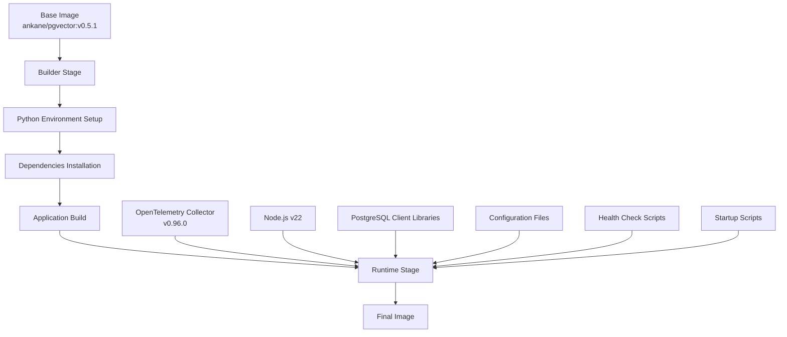

**Diagram sources**
- [Dockerfile](file://Dockerfile#L1-L89)

### Base Image Selection

The architecture utilizes `ankane/pgvector:v0.5.1` as the foundation, providing:
- Pre-configured PostgreSQL with vector extensions
- Optimized for machine learning workloads
- Production-ready database capabilities
- Vector search functionality for semantic storage

### Binary Installation Strategy

The OpenTelemetry collector is installed using a sophisticated download and extraction process:

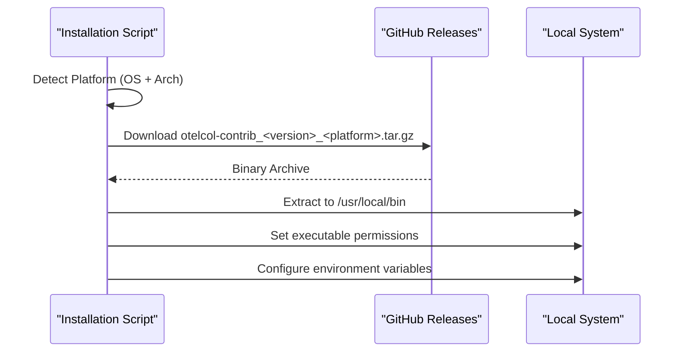

**Diagram sources**
- [otel/start-otel-collector.sh](file://otel/start-otel-collector.sh#L98-L120)

### Entrypoint Configuration

The container uses a dual-entrypoint strategy combining PostgreSQL and Letta server startup:

**Section sources**
- [Dockerfile](file://Dockerfile#L87-L89)
- [letta/server/startup.sh](file://letta/server/startup.sh#L1-L82)

## OpenTelemetry Collector Configuration

### Configuration Architecture

The OpenTelemetry collector supports multiple deployment scenarios through environment-specific configurations:

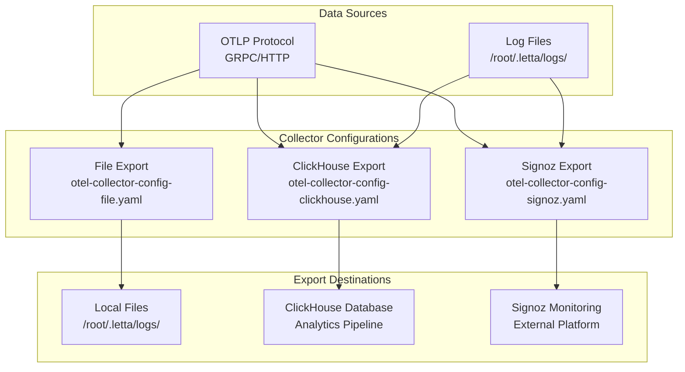

**Diagram sources**
- [otel/otel-collector-config-file.yaml](file://otel/otel-collector-config-file.yaml#L1-L31)
- [otel/otel-collector-config-clickhouse.yaml](file://otel/otel-collector-config-clickhouse.yaml#L1-L82)
- [otel/otel-collector-config-signoz.yaml](file://otel/otel-collector-config-signoz.yaml#L1-L49)

### File-Based Configuration

The default configuration focuses on local file export with rotation capabilities:

| Component | Configuration | Purpose |
|-----------|---------------|---------|
| **Receivers** | OTLP (GRPC:4317, HTTP:4318) | Collect telemetry data from applications |
| **Processors** | Batch (timeout: 1s, size: 1024) | Optimize throughput with batching |
| **Exporters** | File (rotation: 100MB, 7 days, 5 backups) | Persistent local storage |
| **Service** | Logs level: error | Minimal logging overhead |

### ClickHouse Analytics Configuration

Production deployments utilize ClickHouse for centralized analytics:

| Feature | Configuration | Benefits |
|---------|---------------|----------|
| **Memory Management** | Limit: 1024MiB, Spike: 256MiB | Prevent memory exhaustion |
| **Batch Processing** | Timeout: 10s, Size: 8192 | Optimal throughput balancing |
| **Retry Logic** | Initial: 5s, Max: 30s, Total: 300s | Handle temporary failures |
| **Queue Management** | Size: 500, Enabled | Buffer during connectivity issues |

### Environment Variable Integration

The collector dynamically selects configurations based on environment variables:

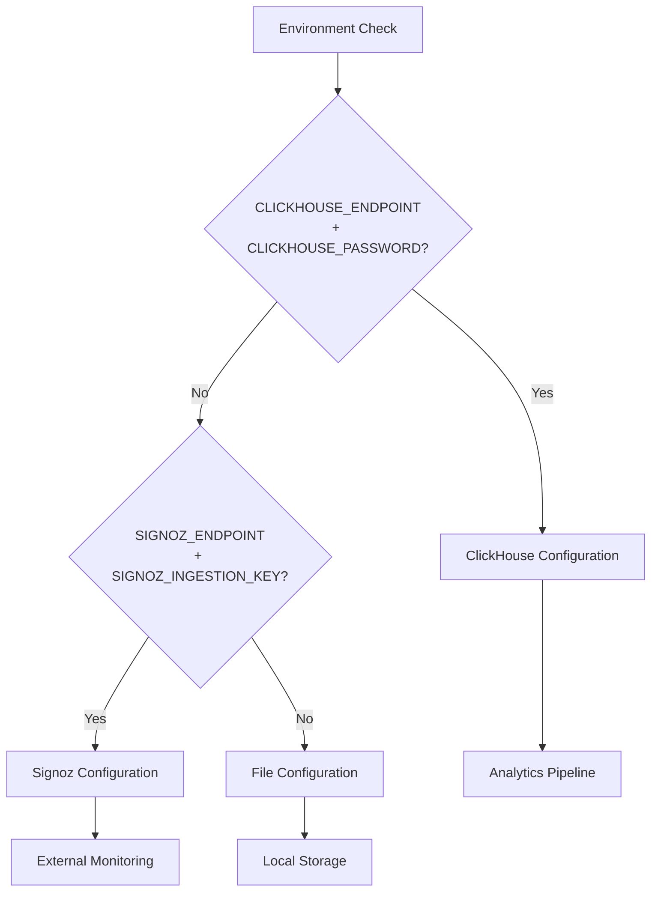

**Diagram sources**
- [otel/start-otel-collector.sh](file://otel/start-otel-collector.sh#L133-L139)
- [letta/server/startup.sh](file://letta/server/startup.sh#L57-L66)

**Section sources**
- [otel/otel-collector-config-file.yaml](file://otel/otel-collector-config-file.yaml#L1-L31)
- [otel/otel-collector-config-clickhouse.yaml](file://otel/otel-collector-config-clickhouse.yaml#L1-L82)
- [otel/otel-collector-config-signoz.yaml](file://otel/otel-collector-config-signoz.yaml#L1-L49)

## Docker Compose Orchestration

### Production Deployment Architecture

The production deployment orchestrates multiple services with careful dependency management:

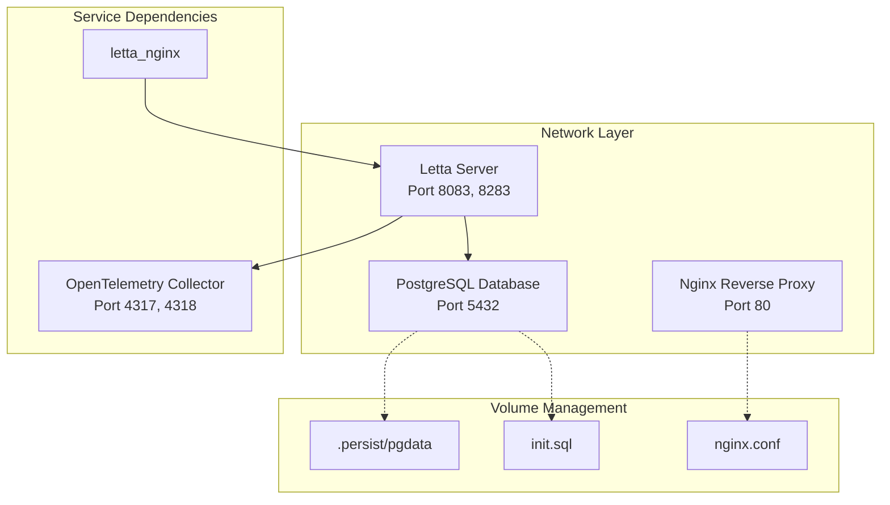

**Diagram sources**
- [compose.yaml](file://compose.yaml#L1-L66)

### Development Environment Setup

The development environment emphasizes rapid iteration and debugging capabilities:

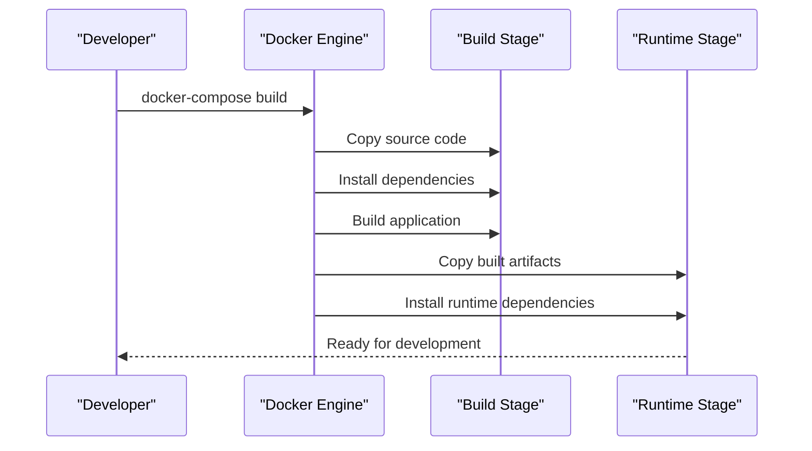

**Diagram sources**
- [dev-compose.yaml](file://dev-compose.yaml#L19-L24)
- [development.compose.yml](file://development.compose.yml#L5-L8)

### Volume Mount Strategies

Different environments employ distinct volume mounting approaches:

| Environment | Database Volume | Application Volume | Configuration Volume |
|-------------|-----------------|-------------------|---------------------|
| **Production** | Persistent `.persist/pgdata` | None (immutable) | Environment-specific configs |
| **Development** | Temporary `/var/lib/postgresql/data` | Source code bind mount | Config files in container |
| **Testing** | Test-specific data dir | None | Test configurations |

### Network Isolation

Services are organized into logical networks with alias support:

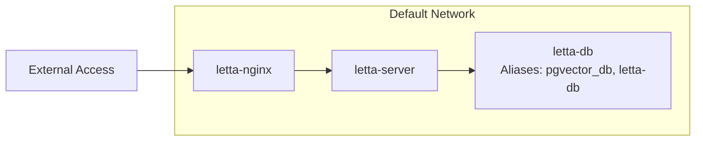

**Diagram sources**
- [compose.yaml](file://compose.yaml#L2-L8)

**Section sources**
- [compose.yaml](file://compose.yaml#L1-L66)
- [dev-compose.yaml](file://dev-compose.yaml#L1-L49)
- [development.compose.yml](file://development.compose.yml#L1-L30)

## Production vs Development Topologies

### Scaling Considerations

The architecture supports different scaling patterns for various deployment scenarios:

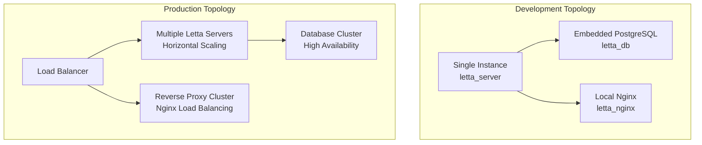

### Resource Management

Production deployments implement comprehensive resource controls:

| Resource Type | Development | Production | Rationale |
|---------------|-------------|------------|-----------|
| **CPU Limits** | No limits | CPU requests/limits | Prevent resource contention |
| **Memory Limits** | No limits | Memory requests/limits | Ensure predictable performance |
| **Storage** | Local SSD | Network storage | Data durability and backup |
| **Network** | Bridge networking | Overlay networking | Service discovery and isolation |

### Security Posture Differences

Security implementations vary significantly between environments:

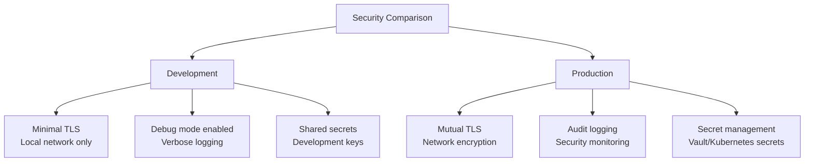

**Section sources**
- [compose.yaml](file://compose.yaml#L24-L66)
- [dev-compose.yaml](file://dev-compose.yaml#L19-L49)

## Telemetry Data Flow

### Distributed Tracing Architecture

The telemetry system implements comprehensive distributed tracing across microservices:

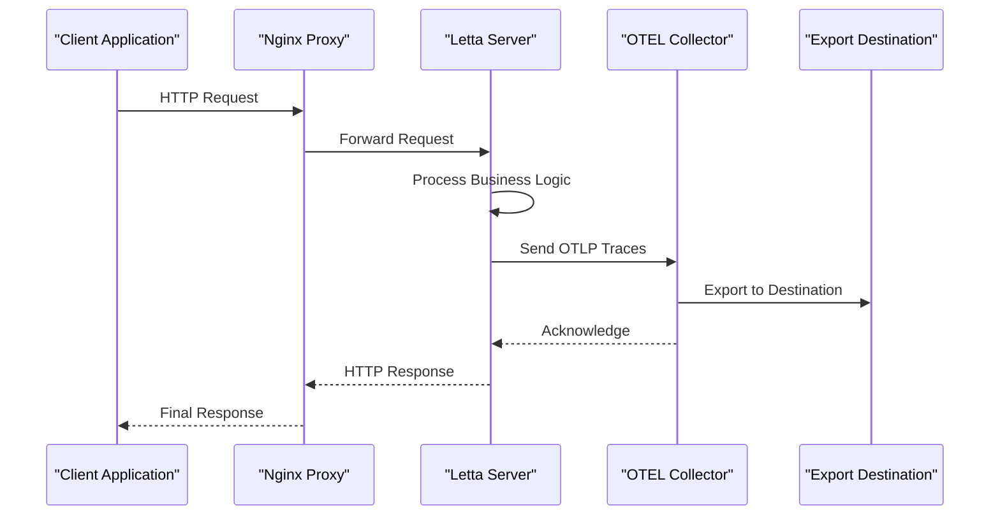

**Diagram sources**
- [nginx.conf](file://nginx.conf#L1-L29)
- [letta/server/startup.sh](file://letta/server/startup.sh#L57-L66)

### Metrics Collection Pipeline

The system captures comprehensive metrics across multiple dimensions:

| Metric Category | Data Source | Collection Method | Export Destination |
|-----------------|-------------|-------------------|-------------------|
| **Application Metrics** | Letta Server | OTLP HTTP/GRPC | ClickHouse/Signoz |
| **Infrastructure Metrics** | Docker Engine | Prometheus exporter | Central monitoring |
| **Database Metrics** | PostgreSQL | pg_stat_* views | ClickHouse |
| **System Metrics** | Host OS | Node exporter | Central monitoring |

### Log Aggregation Strategy

Multi-source log aggregation ensures comprehensive observability:

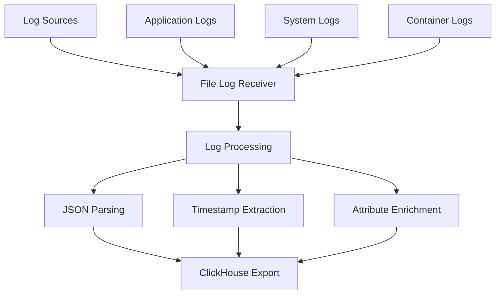

**Diagram sources**
- [otel/otel-collector-config-clickhouse.yaml](file://otel/otel-collector-config-clickhouse.yaml#L8-L25)

**Section sources**
- [letta/server/startup.sh](file://letta/server/startup.sh#L57-L66)
- [otel/otel-collector-config-clickhouse.yaml](file://otel/otel-collector-config-clickhouse.yaml#L8-L25)

## Best Practices

### Image Versioning Strategy

The containerization implements robust versioning practices:

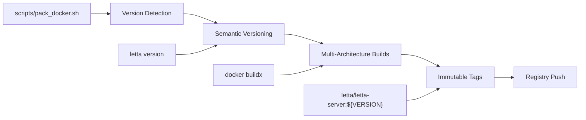

**Diagram sources**
- [scripts/pack_docker.sh](file://scripts/pack_docker.sh#L1-L4)

### Health Check Implementation

Comprehensive health checking ensures service reliability:

| Service | Health Check Type | Endpoint | Frequency | Timeout |
|---------|------------------|----------|-----------|---------|
| **PostgreSQL** | Command shell | `pg_isready` | 5s | 5s |
| **Letta Server** | HTTP endpoint | `/health` | 10s | 3s |
| **OpenTelemetry Collector** | Built-in | `:8888/health` | 15s | 5s |
| **Nginx** | TCP connection | Port 80 | 1s | 3s |

### Rolling Update Strategy

The architecture supports zero-downtime deployments:

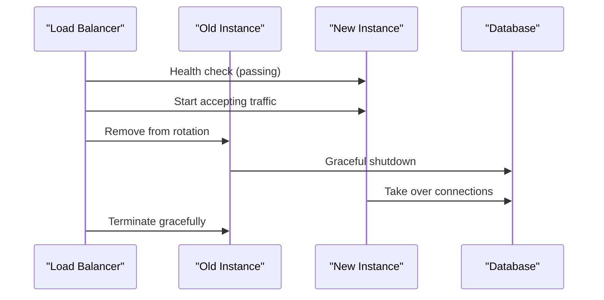

### Resource Limits and Monitoring

Production deployments implement strict resource controls:

| Resource | Development | Production | Purpose |
|----------|-------------|------------|---------|
| **CPU** | Unlimited | Requests: 500m, Limits: 2000m | Prevent CPU starvation |
| **Memory** | Unlimited | Requests: 1Gi, Limits: 4Gi | Ensure predictable allocation |
| **Storage** | Local | Persistent volumes | Data durability |
| **Network** | Bridge | Overlay networks | Service isolation |

**Section sources**
- [scripts/pack_docker.sh](file://scripts/pack_docker.sh#L1-L4)
- [compose.yaml](file://compose.yaml#L18-L22)
- [dev-compose.yaml](file://dev-compose.yaml#L17-L18)

## Integration Points

### Main Application Services

The OpenTelemetry collector integrates seamlessly with Letta's core services:

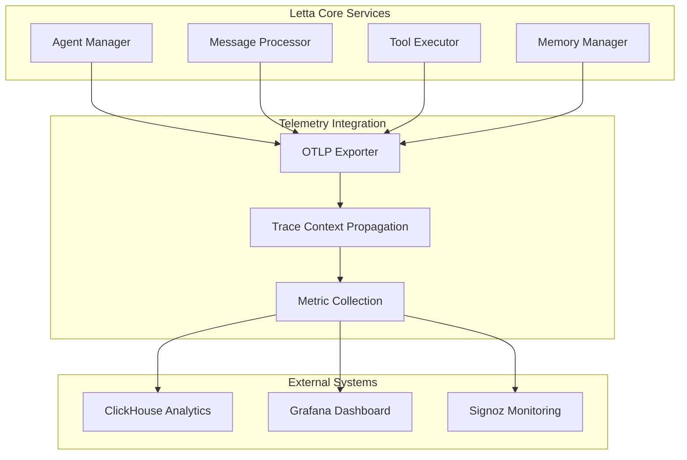

### Service Discovery Mechanisms

The architecture supports multiple service discovery approaches:

| Discovery Method | Use Case | Configuration | Benefits |
|------------------|----------|---------------|----------|
| **DNS-based** | Internal services | Container aliases | Simple, reliable |
| **Environment vars** | External services | `LETTA_PG_URI` | Flexible configuration |
| **File-based** | Secrets management | `/etc/otel/*` | Secure credential handling |

### API Gateway Integration

Nginx serves as the primary API gateway with sophisticated routing:

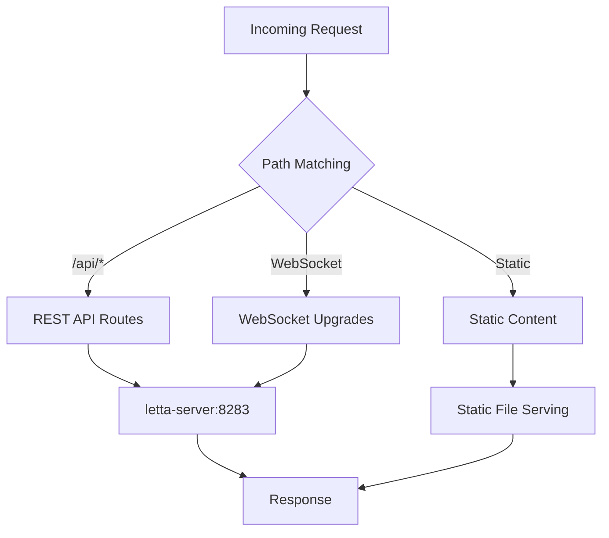

**Diagram sources**
- [nginx.conf](file://nginx.conf#L1-L29)

**Section sources**
- [nginx.conf](file://nginx.conf#L1-L29)
- [letta/server/startup.sh](file://letta/server/startup.sh#L57-L66)

## Monitoring and Health Checks

### Comprehensive Health Monitoring

The architecture implements multi-layered health monitoring:

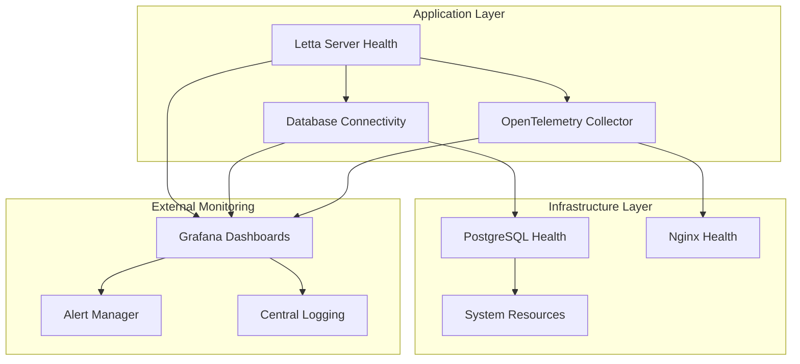

### Performance Metrics

Key performance indicators are tracked across the stack:

| Metric Category | Measurement | Threshold | Action |
|-----------------|-------------|-----------|--------|
| **Response Time** | p95 latency | < 200ms | Alert on degradation |
| **Throughput** | Requests per second | Baseline ± 20% | Scale up/down |
| **Error Rate** | HTTP 5xx percentage | < 1% | Immediate investigation |
| **Resource Utilization** | CPU/Memory usage | > 80% | Capacity planning |

### Alerting Strategy

The monitoring system implements intelligent alerting:

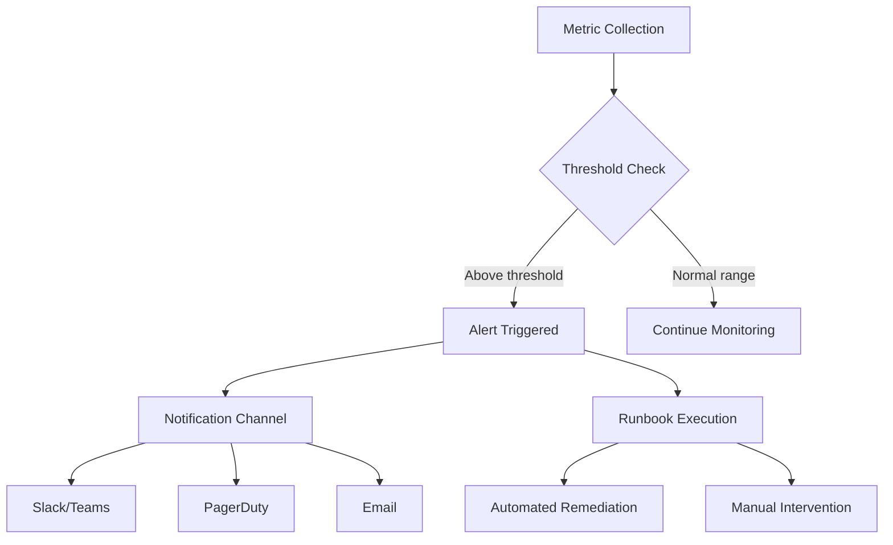

**Section sources**
- [compose.yaml](file://compose.yaml#L18-L22)
- [dev-compose.yaml](file://dev-compose.yaml#L17-L18)

## Conclusion

The Letta project's containerization and orchestration strategy demonstrates enterprise-grade observability and deployment practices. The multi-stage Docker build process ensures optimal image size and security, while the sophisticated OpenTelemetry collector configuration supports diverse deployment scenarios from local development to production analytics.

The architecture's strength lies in its flexibility and scalability, enabling seamless transitions between development and production environments while maintaining comprehensive observability. The integration of multiple export destinations (file, ClickHouse, Signoz) provides organizations with the choice of monitoring solutions that best fit their infrastructure and compliance requirements.

Key architectural benefits include:

- **Scalability**: Horizontal scaling support through load balancers and database clustering
- **Observability**: Comprehensive tracing, metrics, and logging across all services
- **Flexibility**: Multiple deployment configurations for different environments
- **Maintainability**: Automated health checks, rolling updates, and comprehensive monitoring
- **Security**: Environment-specific security postures with proper isolation

This containerization strategy positions Letta as a production-ready platform capable of handling enterprise-scale deployments while maintaining developer productivity and operational excellence.