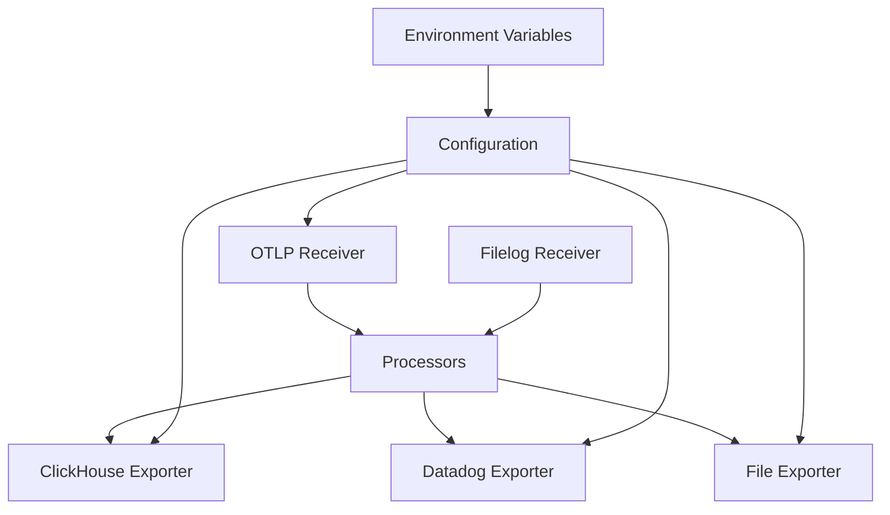

# Environment-Specific Deployment Workflows

<cite>
**Referenced Files in This Document**   
- [otel-collector-config-clickhouse-dev.yaml](file://otel/otel-collector-config-clickhouse-dev.yaml)
- [otel-collector-config-clickhouse-prod.yaml](file://otel/otel-collector-config-clickhouse-prod.yaml)
- [otel-collector-config-clickhouse.yaml](file://otel/otel-collector-config-clickhouse.yaml)
- [otel-collector-config-file-dev.yaml](file://otel/otel-collector-config-file-dev.yaml)
- [otel-collector-config-file.yaml](file://otel/otel-collector-config-file.yaml)
- [start-otel-collector.sh](file://otel/start-otel-collector.sh)
- [compose.yaml](file://compose.yaml)
- [dev-compose.yaml](file://dev-compose.yaml)
- [development.compose.yml](file://development.compose.yml)
- [Dockerfile](file://Dockerfile)
- [startup.sh](file://letta/server/startup.sh)
- [settings.py](file://letta/settings.py)
</cite>

## Table of Contents
1. [Introduction](#introduction)
2. [Configuration Overview](#configuration-overview)
3. [Environment-Specific Configurations](#environment-specific-configurations)
4. [Deployment Procedures](#deployment-procedures)
5. [Validation and Verification](#validation-and-verification)
6. [Rollback Strategies](#rollback-strategies)
7. [Version Compatibility](#version-compatibility)
8. [Security and Access Control](#security-and-access-control)
9. [Conclusion](#conclusion)

## Introduction
This document outlines the environment-specific deployment workflows for the OpenTelemetry collector in the Letta system. It details the configuration differences between development, staging, and production environments, focusing on data retention, sampling rates, and backend destinations. The document also covers the use of environment variables and compose overrides to customize behavior without modifying core configurations.

**Section sources**
- [otel-collector-config-clickhouse-dev.yaml](file://otel/otel-collector-config-clickhouse-dev.yaml)
- [otel-collector-config-clickhouse-prod.yaml](file://otel/otel-collector-config-clickhouse-prod.yaml)

## Configuration Overview
The OpenTelemetry collector is configured through YAML files that define receivers, processors, exporters, and service pipelines. The configuration files are environment-specific, allowing for tailored settings in development, staging, and production environments.

### Core Configuration Components
- **Receivers**: Define how telemetry data is collected (OTLP, filelog)
- **Processors**: Handle data processing (batching, resource attribution, memory limiting)
- **Exporters**: Specify where data is sent (ClickHouse, Datadog, file)
- **Service**: Defines pipelines that connect receivers, processors, and exporters

The configuration system uses environment variables extensively to customize behavior without changing the core configuration files. This allows for flexible deployment across different environments.

**Diagram sources**
- [otel-collector-config-clickhouse-dev.yaml](file://otel/otel-collector-config-clickhouse-dev.yaml)
- [otel-collector-config-clickhouse-prod.yaml](file://otel/otel-collector-config-clickhouse-prod.yaml)

**Section sources**
- [otel-collector-config-clickhouse-dev.yaml](file://otel/otel-collector-config-clickhouse-dev.yaml)
- [otel-collector-config-clickhouse-prod.yaml](file://otel/otel-collector-config-clickhouse-prod.yaml)

## Environment-Specific Configurations
The system employs different configuration files for various environments, each optimized for its specific use case.

### Development Environment
The development environment configuration focuses on ease of use and debugging capabilities:

- **Data Retention**: 7 days with file rotation
- **Sampling Rates**: Higher sampling for comprehensive debugging
- **Backend Destinations**: ClickHouse for development with file fallback
- **Batch Processing**: Smaller batch sizes (1024) with shorter timeouts (1s)
- **Logging**: File-based trace storage with rotation

The development configuration prioritizes developer productivity and debugging over performance and cost optimization.

### Production Environment
The production environment configuration emphasizes performance, reliability, and security:

- **Data Retention**: Extended retention with optimized storage
- **Sampling Rates**: Lower sampling to reduce data volume and costs
- **Backend Destinations**: ClickHouse with Datadog integration
- **Batch Processing**: Larger batch sizes (8192) with longer timeouts (10s)
- **Memory Management**: Memory limiter with 1GB limit and 256MB spike allowance
- **Monitoring**: Health check, pprof, and zpages extensions enabled

The production configuration includes additional processors like memory_limiter to prevent resource exhaustion and ensure system stability under load.

### Configuration Differences Summary
| Configuration Aspect | Development | Production |
|----------------------|-----------|-----------|
| Batch Timeout | 1s | 10s |
| Batch Size | 1024 | 8192 |
| Memory Limit | Not configured | 1024 MiB |
| Exporters | ClickHouse, File | ClickHouse, Datadog |
| Extensions | None | Health check, pprof, zpages |
| Log Processing | Minimal | Full filelog with JSON parsing |

**Section sources**
- [otel-collector-config-clickhouse-dev.yaml](file://otel/otel-collector-config-clickhouse-dev.yaml)
- [otel-collector-config-clickhouse-prod.yaml](file://otel/otel-collector-config-clickhouse-prod.yaml)
- [otel-collector-config-clickhouse.yaml](file://otel/otel-collector-config-clickhouse.yaml)

## Deployment Procedures
The deployment process varies by environment, leveraging different compose files and configuration overrides.

### Development Deployment
The development deployment uses the `dev-compose.yaml` file and is designed for local development:

1. Set environment variables for database connection
2. Run `docker-compose -f dev-compose.yaml up`
3. The OpenTelemetry collector starts automatically with development configuration
4. Traces are exported to ClickHouse if credentials are provided, otherwise to file

The development environment automatically detects the presence of ClickHouse credentials and adjusts the configuration accordingly.

### Production Deployment
The production deployment follows a more structured approach:

1. Set production environment variables including ClickHouse and Datadog credentials
2. Deploy using the main `compose.yaml` file
3. The OpenTelemetry collector starts with production configuration
4. Multiple exporters (ClickHouse and Datadog) receive telemetry data
5. Health checks and monitoring extensions are enabled

The production deployment includes additional security measures and monitoring capabilities not present in development.

### Environment Variable Usage
Environment variables are used extensively to customize behavior:

- `CLICKHOUSE_ENDPOINT`, `CLICKHOUSE_DATABASE`, `CLICKHOUSE_USERNAME`, `CLICKHOUSE_PASSWORD`: ClickHouse connection details
- `DD_SITE`, `DD_API_KEY`: Datadog integration credentials
- `LETTA_ENVIRONMENT`: Environment identifier used in resource attribution
- `LETTA_OTEL_EXPORTER_OTLP_ENDPOINT`: OTLP endpoint for telemetry export

These variables allow for environment-specific customization without modifying the core configuration files.

**Section sources**
- [dev-compose.yaml](file://dev-compose.yaml)
- [compose.yaml](file://compose.yaml)
- [start-otel-collector.sh](file://otel/start-otel-collector.sh)
- [startup.sh](file://letta/server/startup.sh)

## Validation and Verification
Post-deployment validation ensures the OpenTelemetry collector is functioning correctly in each environment.

### Development Verification
In development, verification focuses on basic functionality:

1. Check that the collector process is running
2. Verify traces are being written to the expected location (file or ClickHouse)
3. Confirm the Grafana URL is accessible with the device ID
4. Validate that OTLP endpoints are accepting connections on ports 4317 (gRPC) and 4318 (HTTP)

The development verification process is designed to be quick and straightforward, enabling rapid iteration.

### Production Verification
Production verification includes more comprehensive checks:

1. Validate all exporters are successfully sending data
2. Check health endpoint responses
3. Monitor memory usage against configured limits
4. Verify batch processing performance metrics
5. Confirm Datadog integration is reporting metrics
6. Test failover scenarios and retry mechanisms

The production verification process ensures system reliability and data integrity.

### Automated Validation
The system includes automated validation through:

- Health check endpoints
- Process monitoring with restart capabilities
- Error logging and alerting
- Connection verification during startup

These automated checks help maintain system stability and quickly identify issues.

**Section sources**
- [start-otel-collector.sh](file://otel/start-otel-collector.sh)
- [startup.sh](file://letta/server/startup.sh)
- [otel-collector-config-clickhouse-prod.yaml](file://otel/otel-collector-config-clickhouse-prod.yaml)

## Rollback Strategies
The deployment system includes mechanisms for rolling back to previous configurations when issues are detected.

### Configuration Rollback
The OpenTelemetry collector configuration can be rolled back by:

1. Stopping the current collector process
2. Reverting to a previous configuration file
3. Restarting the collector with the previous configuration

The use of versioned configuration files enables quick rollback to known good states.

### Container Rollback
For containerized deployments:

1. Stop the current container
2. Deploy a previous container image version
3. Restore previous environment variables
4. Start the container with the previous configuration

The Docker-based deployment system allows for easy version management and rollback.

### Data Integrity Considerations
During rollback, data integrity is maintained by:

- Ensuring exporters are properly shut down before configuration changes
- Preserving data in transit through queue mechanisms
- Maintaining consistency between configuration versions

The system's design minimizes data loss during rollback operations.

**Section sources**
- [Dockerfile](file://Dockerfile)
- [startup.sh](file://letta/server/startup.sh)

## Version Compatibility
The system maintains compatibility across different versions of the OpenTelemetry collector and related components.

### OpenTelemetry Collector Version
The current configuration specifies OpenTelemetry Collector version 0.96.0:

- This version is explicitly defined in the startup script and Dockerfile
- The version is checked during installation to ensure consistency
- Updates require explicit version changes in configuration files

### Dependency Management
Version compatibility is maintained through:

- Fixed version specifications in deployment scripts
- Consistent configuration file formats across versions
- Backward compatibility in configuration options

The system avoids automatic updates to prevent unexpected behavior changes.

### Upgrade Procedures
When upgrading the OpenTelemetry collector:

1. Test the new version in development
2. Update version references in all configuration files
3. Deploy to staging for validation
4. Roll out to production with monitoring
5. Maintain rollback capability until stability is confirmed

This phased approach ensures smooth transitions between versions.

**Section sources**
- [start-otel-collector.sh](file://otel/start-otel-collector.sh)
- [Dockerfile](file://Dockerfile)

## Security and Access Control
Security measures vary by environment, with production having more stringent controls.

### Development Security
Development environment security focuses on usability:

- File-based configuration with minimal encryption
- Local storage of traces
- Limited access controls
- Debug logging enabled

The development environment prioritizes developer convenience while maintaining basic security.

### Production Security
Production environment security is comprehensive:

- Encrypted credentials for all external services
- Secure communication between components
- Restricted access to telemetry data
- Monitoring for security events
- Regular security audits

The production environment implements defense-in-depth principles to protect sensitive data.

### Access Control
Access control mechanisms include:

- Environment-specific credentials
- Role-based access to telemetry data
- Network-level restrictions on collector endpoints
- Authentication for management interfaces

These controls ensure that only authorized personnel can access and modify the telemetry system.

**Section sources**
- [settings.py](file://letta/settings.py)
- [otel-collector-config-clickhouse-prod.yaml](file://otel/otel-collector-config-clickhouse-prod.yaml)

## Conclusion
The environment-specific deployment workflows for the OpenTelemetry collector provide a robust framework for managing telemetry across different environments. By using separate configuration files and environment variables, the system achieves flexibility without sacrificing consistency. The deployment procedures, validation steps, and rollback strategies ensure reliable operation in both development and production environments. Security and access control measures are appropriately scaled to each environment's requirements, balancing usability with protection of sensitive data.