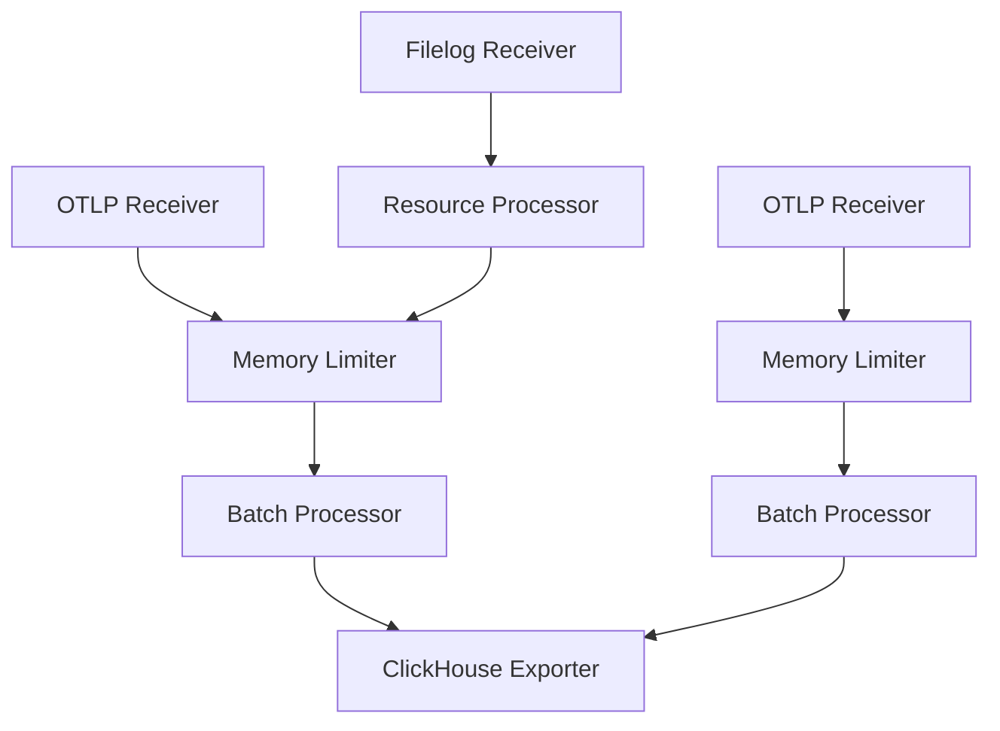
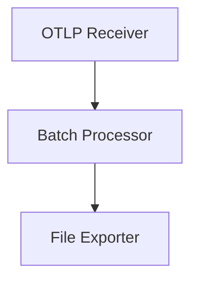
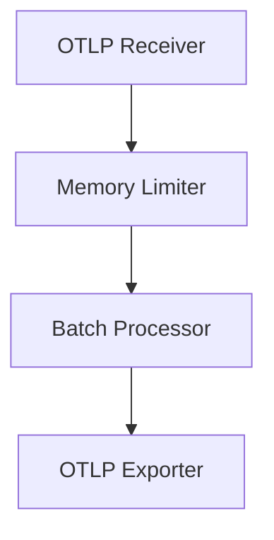
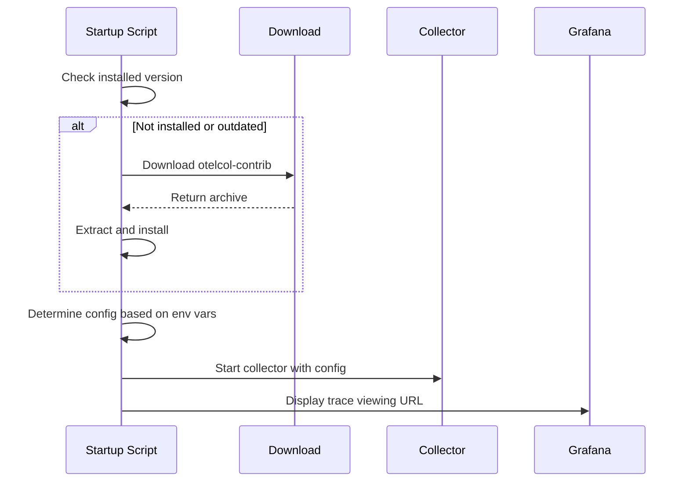
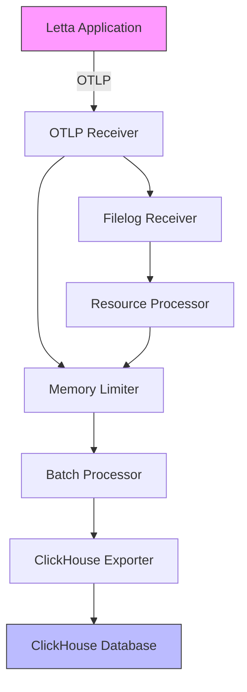

# Monitoring and Observability

<cite>
**Referenced Files in This Document**   
- [otel-collector-config-clickhouse.yaml](file://otel/otel-collector-config-clickhouse.yaml)
- [otel-collector-config-file.yaml](file://otel/otel-collector-config-file.yaml)
- [otel-collector-config-signoz.yaml](file://otel/otel-collector-config-signoz.yaml)
- [Dockerfile](file://Dockerfile)
- [start-otel-collector.sh](file://otel/start-otel-collector.sh)
- [context.py](file://letta/otel/context.py)
- [metrics.py](file://letta/otel/metrics.py)
- [resource.py](file://letta/otel/resource.py)
- [tracing.py](file://letta/otel/tracing.py)
- [telemetry_manager.py](file://letta/services/telemetry_manager.py)
- [compose.yaml](file://compose.yaml)
</cite>

## Table of Contents
1. [Introduction](#introduction)
2. [OpenTelemetry Collector Configuration](#opentelemetry-collector-configuration)
3. [Docker Integration and Deployment](#docker-integration-and-deployment)
4. [Data Flow Architecture](#data-flow-architecture)
5. [Monitoring Backend Setup](#monitoring-backend-setup)
6. [Dashboard and Alerting Configuration](#dashboard-and-alerting-configuration)
7. [Scalability and Performance Considerations](#scalability-and-performance-considerations)
8. [Log Management and Retention](#log-management-and-retention)
9. [Troubleshooting Common Issues](#troubleshooting-common-issues)
10. [Conclusion](#conclusion)

## Introduction

Letta's monitoring and observability system is built around OpenTelemetry (OTel), providing comprehensive telemetry collection for traces, metrics, and logs. The system enables detailed insights into application performance, user interactions, and system health through a flexible configuration that supports multiple backend destinations including ClickHouse, file-based storage, and SigNoz. This documentation details the complete telemetry pipeline from data collection in the Letta application to storage and analysis in various monitoring backends.

The observability framework is designed with flexibility in mind, allowing developers and operators to choose the most appropriate storage and analysis solution for their environment. The core components include the OpenTelemetry Collector configured with different pipelines for various telemetry types, integrated directly into the Docker deployment process, and instrumented throughout the application codebase to capture detailed operational data.

**Section sources**
- [otel-collector-config-clickhouse.yaml](file://otel/otel-collector-config-clickhouse.yaml)
- [otel-collector-config-file.yaml](file://otel/otel-collector-config-file.yaml)
- [otel-collector-config-signoz.yaml](file://otel/otel-collector-config-signoz.yaml)

## OpenTelemetry Collector Configuration

The OpenTelemetry Collector in Letta is configured through multiple YAML configuration files that define how telemetry data is collected, processed, and exported. These configurations support different deployment scenarios and backend storage systems, providing flexibility for development, testing, and production environments.

### ClickHouse Configuration

The `otel-collector-config-clickhouse.yaml` file defines a comprehensive configuration for exporting telemetry data to ClickHouse, a column-oriented database optimized for analytics workloads. This configuration includes three main pipelines for traces, logs, and metrics, each with specific receivers, processors, and exporters.

The configuration specifies OTLP (OpenTelemetry Protocol) receivers on ports 4317 (gRPC) and 4318 (HTTP) to receive telemetry data from the Letta application. For log collection, a filelog receiver is configured to monitor `/root/.letta/logs/Letta.log`, with JSON parsing and timestamp extraction capabilities. The filelog processor includes a JSON parser to extract structured data from log entries and a time parser to properly format timestamps according to the Go time layout.



**Diagram sources**
- [otel-collector-config-clickhouse.yaml](file://otel/otel-collector-config-clickhouse.yaml#L1-L82)

**Section sources**
- [otel-collector-config-clickhouse.yaml](file://otel/otel-collector-config-clickhouse.yaml#L1-L82)

### File-Based Configuration

The `otel-collector-config-file.yaml` provides a simpler configuration focused on file-based storage, ideal for development and debugging scenarios. This configuration includes only a traces pipeline with OTLP receivers and a file exporter that writes trace data to `/root/.letta/logs/traces.json`.

The file exporter includes rotation settings to manage log file size, with a maximum of 100MB per file, retention of up to 7 days, and a maximum of 5 backup files. This ensures that disk space is efficiently managed while maintaining a reasonable history of trace data for analysis.



**Diagram sources**
- [otel-collector-config-file.yaml](file://otel/otel-collector-config-file.yaml#L1-L31)

**Section sources**
- [otel-collector-config-file.yaml](file://otel/otel-collector-config-file.yaml#L1-L31)

### SigNoz Configuration

The `otel-collector-config-signoz.yaml` file configures the OpenTelemetry Collector to export data to SigNoz, an open-source application monitoring and observability platform. This configuration uses the OTLP exporter to send telemetry data to a SigNoz endpoint specified by the `SIGNOZ_ENDPOINT` environment variable.

The configuration includes authentication via the `signoz-ingestion-key` header, which is set from the `SIGNOZ_INGESTION_KEY` environment variable. This secure authentication mechanism ensures that only authorized collectors can send data to the SigNoz backend.



**Diagram sources**
- [otel-collector-config-signoz.yaml](file://otel/otel-collector-config-signoz.yaml#L1-L49)

**Section sources**
- [otel-collector-config-signoz.yaml](file://otel/otel-collector-config-signoz.yaml#L1-L49)

## Docker Integration and Deployment

The OpenTelemetry Collector is integrated into the Letta application through the Dockerfile, ensuring that the telemetry infrastructure is deployed alongside the application itself. This integration approach simplifies deployment and ensures consistency across different environments.

### Dockerfile Configuration

The Dockerfile installs the OpenTelemetry Collector during the build process using curl to download the otelcol-contrib binary from GitHub releases. The installation occurs in the runtime stage of the multi-stage build, where the collector is downloaded, extracted, and placed in `/usr/local/bin`.

```dockerfile
RUN curl -L https://github.com/open-telemetry/opentelemetry-collector-releases/releases/download/v0.96.0/otelcol-contrib_0.96.0_linux_amd64.tar.gz -o /tmp/otel-collector.tar.gz && \
    tar xzf /tmp/otel-collector.tar.gz -C /usr/local/bin && \
    rm /tmp/otel-collector.tar.gz && \
    mkdir -p /etc/otel
```

The configuration files are then copied to `/etc/otel` with appropriate naming:

```dockerfile
COPY otel/otel-collector-config-file.yaml /etc/otel/config-file.yaml
COPY otel/otel-collector-config-clickhouse.yaml /etc/otel/config-clickhouse.yaml
COPY otel/otel-collector-config-signoz.yaml /etc/otel/config-signoz.yaml
```

This approach ensures that all configuration options are available within the container, allowing runtime selection based on environment variables.

### Startup Script Integration

The `start-otel-collector.sh` script manages the lifecycle of the OpenTelemetry Collector, including installation, version management, and startup. The script first checks if the collector is already installed and up to date, downloading and installing it only if necessary.

The script detects the platform (OS and architecture) and constructs the appropriate download URL for the otelcol-contrib binary. It includes error handling for download failures and verifies the installation by checking the binary version.

At startup, the script selects the appropriate configuration file based on environment variables. If `CLICKHOUSE_ENDPOINT` and `CLICKHOUSE_PASSWORD` are set, it uses the ClickHouse configuration; otherwise, it falls back to the file-based configuration:

```bash
if [ -n "$CLICKHOUSE_ENDPOINT" ] && [ -n "$CLICKHOUSE_PASSWORD" ]; then
    echo "Starting OpenTelemetry Collector with Clickhouse export..."
    CONFIG_FILE="otel/otel-collector-config-clickhouse-dev.yaml"
else
    echo "Starting OpenTelemetry Collector with file export only..."
    CONFIG_FILE="otel/otel-collector-config-file-dev.yaml"
fi
```

The script also generates a device ID from the MAC address and displays a URL for viewing traces in Grafana, enhancing the developer experience by providing immediate access to telemetry data.



**Diagram sources**
- [Dockerfile](file://Dockerfile#L1-L89)
- [start-otel-collector.sh](file://otel/start-otel-collector.sh#L1-L146)

**Section sources**
- [Dockerfile](file://Dockerfile#L1-L89)
- [start-otel-collector.sh](file://otel/start-otel-collector.sh#L1-L146)

## Data Flow Architecture

The telemetry data flow in Letta follows a well-defined architecture that captures data from the application, processes it through the OpenTelemetry Collector, and exports it to various backend systems. This architecture ensures comprehensive observability while maintaining flexibility and scalability.

### Application-Level Instrumentation

The Letta application is instrumented with OpenTelemetry through the `letta/otel` package, which provides tracing and metrics functionality. The `tracing.py` module implements request middleware that automatically creates spans for HTTP requests, capturing important attributes such as HTTP method, URL, status code, and relevant headers.

The tracing system uses a decorator pattern with the `@trace_method` decorator to instrument specific methods, capturing function parameters and return values while respecting privacy and performance considerations. The decorator includes sophisticated logic to handle large parameter values, truncating them when necessary to prevent excessive data collection.

The `metrics.py` module implements endpoint-level metrics collection, tracking latency and request counts for specific API endpoints. This opt-in approach focuses on high-value endpoints such as agent message processing, providing detailed performance insights without overwhelming the metrics system.

### Collector Processing Pipeline

The OpenTelemetry Collector processes telemetry data through a series of stages: reception, processing, and export. Each stage is configurable and can be tailored to the specific requirements of the deployment environment.

The reception stage uses OTLP receivers to accept data from the Letta application. OTLP is the standard protocol for OpenTelemetry data, supporting both gRPC and HTTP transports. The collector listens on ports 4317 (gRPC) and 4318 (HTTP), allowing flexibility in how data is transmitted from the application.

The processing stage applies various transformations and optimizations to the telemetry data. Key processors include:

- **Batch processor**: Groups telemetry data into batches to improve export efficiency
- **Memory limiter**: Prevents the collector from consuming excessive memory
- **Resource processor**: Adds environment-specific attributes to telemetry data

The export stage sends processed telemetry data to the configured backend. The choice of exporter depends on the configuration file in use, with options for ClickHouse, file storage, or remote OTLP endpoints.



**Diagram sources**
- [otel-collector-config-clickhouse.yaml](file://otel/otel-collector-config-clickhouse.yaml#L1-L82)
- [tracing.py](file://letta/otel/tracing.py#L1-L446)
- [metrics.py](file://letta/otel/metrics.py#L1-L140)

**Section sources**
- [otel-collector-config-clickhouse.yaml](file://otel/otel-collector-config-clickhouse.yaml#L1-L82)
- [tracing.py](file://letta/otel/tracing.py#L1-L446)
- [metrics.py](file://letta/otel/metrics.py#L1-L140)

## Monitoring Backend Setup

Letta supports multiple monitoring backends through its flexible OpenTelemetry configuration. Each backend requires specific setup steps and configuration parameters to ensure proper data collection and analysis.

### ClickHouse Backend

To configure Letta for ClickHouse monitoring, the following environment variables must be set:

- `CLICKHOUSE_ENDPOINT`: The URL of the ClickHouse server
- `CLICKHOUSE_DATABASE`: The name of the database to use
- `CLICKHOUSE_USERNAME`: The username for authentication
- `CLICKHOUSE_PASSWORD`: The password for authentication

When these variables are present, the startup script automatically selects the ClickHouse configuration. The collector exports traces, logs, and metrics to ClickHouse, leveraging its high-performance analytics capabilities for complex queries and aggregations.

The ClickHouse configuration includes robust error handling with retry mechanisms that exponentially back off from 5 seconds to 30 seconds, with a maximum elapsed time of 300 seconds. This ensures reliable data delivery even during temporary network issues or database maintenance.

### File-Based Backend

For development and debugging, Letta can export telemetry data to local files. This configuration is activated when ClickHouse environment variables are not set. The file-based configuration writes trace data to `/root/.letta/logs/traces.json` with automatic rotation to manage disk usage.

The file exporter rotates logs when they reach 100MB, keeping up to 5 backup files for a maximum retention of 7 days. This provides a reasonable balance between storage efficiency and historical data availability for troubleshooting.

### SigNoz Backend

SigNoz provides a complete observability platform with built-in visualization and alerting capabilities. To use SigNoz as the backend, the following environment variables must be set:

- `SIGNOZ_ENDPOINT`: The URL of the SigNoz OTLP receiver
- `SIGNOZ_INGESTION_KEY`: The authentication key for the SigNoz ingestion API

The SigNoz configuration exports all telemetry types (traces, logs, and metrics) to the SigNoz platform, enabling comprehensive monitoring and analysis through its web interface.

**Section sources**
- [otel-collector-config-clickhouse.yaml](file://otel/otel-collector-config-clickhouse.yaml#L1-L82)
- [otel-collector-config-file.yaml](file://otel/otel-collector-config-file.yaml#L1-L31)
- [otel-collector-config-signoz.yaml](file://otel/otel-collector-config-signoz.yaml#L1-L49)
- [start-otel-collector.sh](file://otel/start-otel-collector.sh#L1-L146)

## Dashboard and Alerting Configuration

While the provided configuration files focus on data collection and export, effective monitoring requires proper dashboard and alerting setup. This section provides guidance on creating meaningful visualizations and alerts based on the collected telemetry data.

### Dashboard Creation

For ClickHouse backend, dashboards should focus on the following key metrics:

1. **Request Latency**: Visualize the end-to-end latency of key API endpoints using the `endpoint_e2e_ms_histogram` metric. Create percentile-based charts (P50, P90, P99) to understand latency distribution.

2. **Error Rates**: Monitor HTTP status codes to identify increasing error rates. Create alerts for 5xx error rates exceeding 1% over a 5-minute window.

3. **Throughput**: Track request volume over time to identify usage patterns and potential performance bottlenecks.

4. **Trace Analysis**: Use trace data to analyze request flows, identifying slow database queries or external API calls.

For SigNoz backend, leverage the built-in dashboard templates and create custom dashboards that correlate traces, metrics, and logs for comprehensive analysis.

### Alerting Rules

Recommended alerting rules include:

- **High Latency**: Alert when P99 latency exceeds 5 seconds for more than 5 minutes
- **Error Spikes**: Alert when error rate exceeds 5% for any endpoint
- **Service Unavailability**: Alert when no traces are received for more than 5 minutes
- **Resource Pressure**: Monitor collector memory usage and alert when approaching limits

These alerts should be configured in the respective monitoring backend (ClickHouse with external alerting tools, SigNoz with built-in alerting).

**Section sources**
- [metrics.py](file://letta/otel/metrics.py#L1-L140)
- [tracing.py](file://letta/otel/tracing.py#L1-L446)

## Scalability and Performance Considerations

The Letta telemetry system is designed with scalability in mind, but certain considerations must be addressed when deploying at scale.

### Collector Configuration

The OpenTelemetry Collector should be sized appropriately for the expected telemetry volume. Key configuration parameters that affect scalability include:

- **Batch size and timeout**: Larger batches improve efficiency but increase latency. The current configuration uses 8192 for production and 1024 for development.
- **Memory limits**: The memory limiter is configured with 1024MiB limit and 256MiB spike limit to prevent out-of-memory conditions.
- **Queue sizes**: The ClickHouse exporter uses a sending queue with 500 items capacity to buffer data during temporary outages.

For high-volume deployments, consider increasing these values based on available resources and performance requirements.

### Data Sampling

In high-traffic environments, consider implementing sampling to reduce telemetry volume while maintaining observability. The OpenTelemetry Collector supports various sampling strategies that can be configured based on service, endpoint, or other attributes.

### Horizontal Scaling

For very large deployments, consider running multiple collector instances behind a load balancer. This allows horizontal scaling of the telemetry ingestion pipeline. Each collector instance can be configured to export to the same backend, ensuring comprehensive data collection.

**Section sources**
- [otel-collector-config-clickhouse.yaml](file://otel/otel-collector-config-clickhouse.yaml#L1-L82)
- [otel-collector-config-file.yaml](file://otel/otel-collector-config-file.yaml#L1-L31)

## Log Management and Retention

Effective log management is crucial for maintaining system health and enabling troubleshooting. Letta's telemetry system includes built-in log rotation and retention policies.

### Log Rotation

The file-based exporters include rotation configuration that automatically manages log file size:

- Maximum file size: 100MB
- Maximum retention period: 7 days
- Maximum backup files: 5

This ensures that disk space is efficiently used while maintaining a reasonable history of log data for debugging purposes.

### Retention Strategy

For production environments using ClickHouse, implement a data retention strategy that balances storage costs with historical analysis needs. Recommended approaches include:

- **Hot storage**: Keep recent data (e.g., 30 days) on high-performance storage for frequent queries
- **Cold storage**: Archive older data to lower-cost storage for compliance and long-term analysis
- **Data aggregation**: Create aggregated views of historical data to reduce storage requirements while preserving key insights

ClickHouse's native partitioning and TTL features can be leveraged to automate this retention strategy.

**Section sources**
- [otel-collector-config-file.yaml](file://otel/otel-collector-config-file.yaml#L1-L31)
- [otel-collector-config-clickhouse.yaml](file://otel/otel-collector-config-clickhouse.yaml#L1-L82)

## Troubleshooting Common Issues

This section addresses common issues that may arise with the Letta telemetry system and provides guidance for resolution.

### Data Loss

Data loss can occur due to various factors. To troubleshoot:

1. **Check collector logs**: Look for errors in the collector's own logs, typically available through the collector's health check endpoint.
2. **Verify network connectivity**: Ensure that the Letta application can reach the collector on ports 4317 and 4318.
3. **Check resource limits**: Verify that the collector is not hitting memory limits, which can cause data to be dropped.
4. **Review exporter configuration**: Ensure that backend credentials and endpoints are correctly configured.

The collector's retry mechanisms should handle temporary outages, but persistent issues may require configuration adjustments.

### High Latency

High telemetry processing latency can impact application performance. To address:

1. **Increase batch sizes**: Larger batches reduce the frequency of export operations.
2. **Adjust batch timeout**: Increase the timeout to allow more data to accumulate before export.
3. **Scale collector resources**: Allocate more CPU and memory to the collector.
4. **Optimize network**: Ensure low-latency connectivity between the application and collector.

### Configuration Issues

Common configuration problems include:

- **Missing environment variables**: Ensure all required environment variables are set
- **Incorrect file paths**: Verify that log file paths in the configuration match the actual deployment
- **Permission issues**: Ensure the collector has write permissions to log directories

The startup script includes validation and will report configuration issues during startup.

**Section sources**
- [start-otel-collector.sh](file://otel/start-otel-collector.sh#L1-L146)
- [otel-collector-config-clickhouse.yaml](file://otel/otel-collector-config-clickhouse.yaml#L1-L82)
- [tracing.py](file://letta/otel/tracing.py#L1-L446)

## Conclusion

Letta's monitoring and observability system provides a comprehensive solution for collecting, processing, and analyzing telemetry data. By leveraging OpenTelemetry standards and flexible configuration options, the system supports various deployment scenarios from development to production.

The integration of the OpenTelemetry Collector directly into the Docker deployment ensures consistent telemetry infrastructure across environments. The support for multiple backends (ClickHouse, file storage, SigNoz) allows organizations to choose the most appropriate storage and analysis solution for their needs.

Key strengths of the system include:
- Comprehensive instrumentation of application code
- Flexible configuration for different deployment scenarios
- Robust error handling and retry mechanisms
- Built-in log rotation and retention
- Support for high-volume telemetry collection

By following the guidance in this documentation, operators can effectively monitor Letta deployments, troubleshoot issues, and optimize performance based on detailed telemetry data.