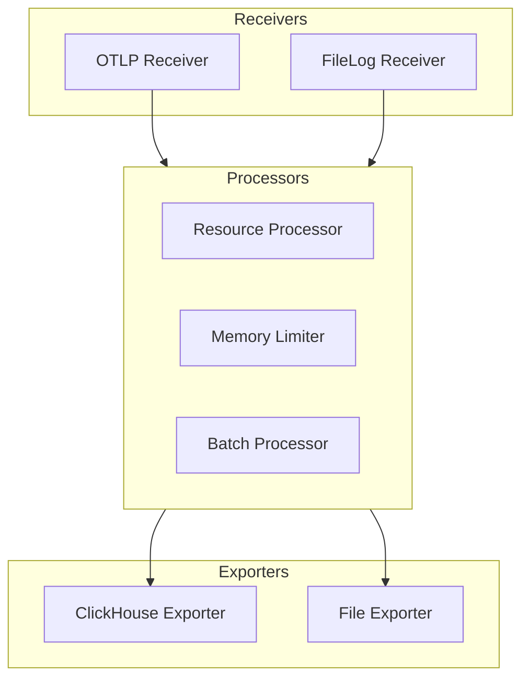

# ClickHouse Exporter Configuration

<cite>
**Referenced Files in This Document**   
- [otel-collector-config-clickhouse.yaml](file://otel/otel-collector-config-clickhouse.yaml)
- [otel-collector-config-clickhouse-dev.yaml](file://otel/otel-collector-config-clickhouse-dev.yaml)
- [otel-collector-config-clickhouse-prod.yaml](file://otel/otel-collector-config-clickhouse-prod.yaml)
- [start-otel-collector.sh](file://otel/start-otel-collector.sh)
- [metric_registry.py](file://letta/otel/metric_registry.py)
- [db_pool_monitoring.py](file://letta/otel/db_pool_monitoring.py)
</cite>

## Table of Contents
1. [Introduction](#introduction)
2. [OTLP Pipeline Overview](#otlp-pipeline-overview)
3. [ClickHouse Exporter Configuration](#clickhouse-exporter-configuration)
4. [Configuration Differences by Environment](#configuration-differences-by-environment)
5. [Schema Mappings for Traces and Metrics](#schema-mappings-for-traces-and-metrics)
6. [Optimizing Batch Sizes and Timeouts](#optimizing-batch-sizes-and-timeouts)
7. [Securing Connections with TLS](#securing-connections-with-tls)
8. [Troubleshooting Common Ingestion Issues](#troubleshooting-common-ingestion-issues)
9. [Shared Processors and Receivers](#shared-processors-and-receivers)

## Introduction
The Letta telemetry persistence layer utilizes OpenTelemetry (OTLP) to route traces and metrics to ClickHouse, enabling robust observability and analytics. This document details the configuration of the ClickHouse exporter, covering endpoint settings, authentication, queue configuration, and environment-specific variations. It also provides guidance on schema mappings, performance optimization, security, and troubleshooting to ensure reliable telemetry data ingestion.

## OTLP Pipeline Overview
The OTLP pipeline in Letta is responsible for collecting, processing, and exporting telemetry data. It supports both traces and metrics, which are routed through configured pipelines to the ClickHouse database. The pipeline includes receivers for OTLP and file logs, processors for batching and resource attribution, and exporters for ClickHouse and file outputs.

**Diagram sources**
- [otel-collector-config-clickhouse.yaml](file://otel/otel-collector-config-clickhouse.yaml#L1-L82)
- [otel-collector-config-clickhouse-dev.yaml](file://otel/otel-collector-config-clickhouse-dev.yaml#L1-L54)
- [otel-collector-config-clickhouse-prod.yaml](file://otel/otel-collector-config-clickhouse-prod.yaml#L1-L91)

**Section sources**
- [otel-collector-config-clickhouse.yaml](file://otel/otel-collector-config-clickhouse.yaml#L1-L82)
- [otel-collector-config-clickhouse-dev.yaml](file://otel/otel-collector-config-clickhouse-dev.yaml#L1-L54)
- [otel-collector-config-clickhouse-prod.yaml](file://otel/otel-collector-config-clickhouse-prod.yaml#L1-L91)

## ClickHouse Exporter Configuration
The ClickHouse exporter is configured to send telemetry data to a ClickHouse database using environment variables for endpoint, database, username, and password. The configuration includes settings for timeout, sending queue, and retry policies.

### Exporter Settings
- **Endpoint**: `${CLICKHOUSE_ENDPOINT}` - The URL of the ClickHouse server.
- **Database**: `${CLICKHOUSE_DATABASE}` - The database name within ClickHouse.
- **Username**: `${CLICKHOUSE_USERNAME}` - The username for authentication.
- **Password**: `${CLICKHOUSE_PASSWORD}` - The password for authentication.
- **Timeout**: Configurable timeout for requests (5s in production, 10s in default).
- **Sending Queue**: Configurable queue size (100 in production, 500 in default).
- **Retry on Failure**: Enabled with initial interval of 5s, max interval of 30s, and max elapsed time of 300s.

**Section sources**
- [otel-collector-config-clickhouse.yaml](file://otel/otel-collector-config-clickhouse.yaml#L42-L55)
- [otel-collector-config-clickhouse-dev.yaml](file://otel/otel-collector-config-clickhouse-dev.yaml#L27-L39)
- [otel-collector-config-clickhouse-prod.yaml](file://otel/otel-collector-config-clickhouse-prod.yaml#L42-L54)

## Configuration Differences by Environment
Letta provides different configurations for development, production, and default environments, each tailored to the specific requirements of the environment.

### Development Configuration
The development configuration is defined in `otel-collector-config-clickhouse-dev.yaml`. It includes:
- **Batch Processor**: Timeout of 1s and send batch size of 1024.
- **Exporters**: Both ClickHouse and file exporters are used, with file outputs for traces and metrics.
- **Sending Queue**: Queue size of 100.
- **Timeout**: 5s for ClickHouse requests.

### Production Configuration
The production configuration is defined in `otel-collector-config-clickhouse-prod.yaml`. It includes:
- **Batch Processor**: Timeout of 10s and send batch size of 8192.
- **Exporters**: ClickHouse and Datadog exporters are used.
- **Sending Queue**: Queue size of 100.
- **Timeout**: 5s for ClickHouse requests.
- **Additional Extensions**: Datadog API key and site are configured.

### Default Configuration
The default configuration is defined in `otel-collector-config-clickhouse.yaml`. It includes:
- **Batch Processor**: Timeout of 10s and send batch size of 8192.
- **Exporters**: Only ClickHouse exporter is used.
- **Sending Queue**: Queue size of 500 and enabled.
- **Timeout**: 10s for ClickHouse requests.

**Section sources**
- [otel-collector-config-clickhouse.yaml](file://otel/otel-collector-config-clickhouse.yaml#L1-L82)
- [otel-collector-config-clickhouse-dev.yaml](file://otel/otel-collector-config-clickhouse-dev.yaml#L1-L54)
- [otel-collector-config-clickhouse-prod.yaml](file://otel/otel-collector-config-clickhouse-prod.yaml#L1-L91)

## Schema Mappings for Traces and Metrics
The telemetry data is mapped to specific schemas in ClickHouse for traces and metrics. The schema mappings ensure that the data is stored in a structured format that supports efficient querying and analysis.

### Trace Schema
The trace data is stored in a table with the following columns:
- **trace_id**: Unique identifier for the trace.
- **span_id**: Unique identifier for the span.
- **parent_span_id**: Identifier for the parent span.
- **operation_name**: Name of the operation.
- **start_time**: Start time of the span.
- **end_time**: End time of the span.
- **attributes**: JSON field containing additional attributes.

### Metric Schema
The metric data is stored in a table with the following columns:
- **metric_name**: Name of the metric.
- **timestamp**: Timestamp of the metric.
- **value**: Value of the metric.
- **attributes**: JSON field containing additional attributes.

**Section sources**
- [metric_registry.py](file://letta/otel/metric_registry.py#L199-L275)
- [db_pool_monitoring.py](file://letta/otel/db_pool_monitoring.py#L109-L138)

## Optimizing Batch Sizes and Timeouts
Optimizing batch sizes and timeouts is crucial for high-throughput environments. The following recommendations are based on the configuration files:

- **Batch Size**: Use a larger batch size (e.g., 8192) in production to reduce the number of requests and improve throughput.
- **Timeout**: Set a longer timeout (e.g., 10s) in production to handle slower network conditions.
- **Queue Size**: Increase the queue size (e.g., 500) in default configuration to buffer more data during high load.

**Section sources**
- [otel-collector-config-clickhouse.yaml](file://otel/otel-collector-config-clickhouse.yaml#L36-L38)
- [otel-collector-config-clickhouse-dev.yaml](file://otel/otel-collector-config-clickhouse-dev.yaml#L10-L12)
- [otel-collector-config-clickhouse-prod.yaml](file://otel/otel-collector-config-clickhouse-prod.yaml#L36-L38)

## Securing Connections with TLS
To secure connections between the OpenTelemetry Collector and ClickHouse, TLS should be enabled. This involves configuring the ClickHouse server to use SSL/TLS and updating the exporter configuration to use HTTPS endpoints. Additionally, ensure that the ClickHouse credentials are stored securely and not exposed in logs or configuration files.

**Section sources**
- [otel-collector-config-clickhouse.yaml](file://otel/otel-collector-config-clickhouse.yaml#L43-L46)
- [otel-collector-config-clickhouse-dev.yaml](file://otel/otel-collector-config-clickhouse-dev.yaml#L28-L31)
- [otel-collector-config-clickhouse-prod.yaml](file://otel/otel-collector-config-clickhouse-prod.yaml#L43-L46)

## Troubleshooting Common Ingestion Issues
Common issues during telemetry data ingestion include connection failures, authentication errors, and data format mismatches. The following steps can help troubleshoot these issues:

1. **Check Connection**: Ensure that the ClickHouse endpoint is reachable and the network is stable.
2. **Verify Credentials**: Confirm that the username and password are correct and have the necessary permissions.
3. **Review Logs**: Check the OpenTelemetry Collector logs for any error messages or warnings.
4. **Validate Data Format**: Ensure that the data being sent matches the expected schema in ClickHouse.

**Section sources**
- [start-otel-collector.sh](file://otel/start-otel-collector.sh#L133-L136)
- [otel-collector-config-clickhouse.yaml](file://otel/otel-collector-config-clickhouse.yaml#L43-L46)

## Shared Processors and Receivers
The OTLP pipeline uses shared processors and receivers across different configurations. The `otlp` receiver is used for both traces and metrics, while the `batch` processor is used to batch data before exporting. The `resource` processor adds environment attributes to the telemetry data, and the `memory_limiter` processor ensures that the collector does not exceed memory limits.

**Section sources**
- [otel-collector-config-clickhouse.yaml](file://otel/otel-collector-config-clickhouse.yaml#L1-L82)
- [otel-collector-config-clickhouse-dev.yaml](file://otel/otel-collector-config-clickhouse-dev.yaml#L1-L54)
- [otel-collector-config-clickhouse-prod.yaml](file://otel/otel-collector-config-clickhouse-prod.yaml#L1-L91)