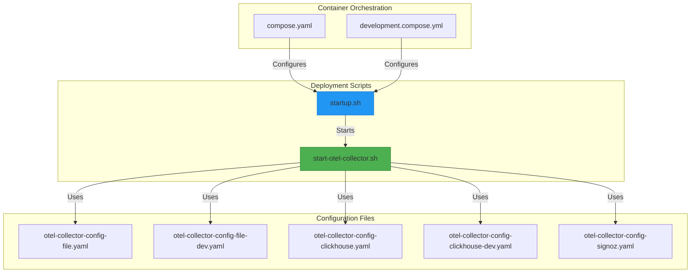
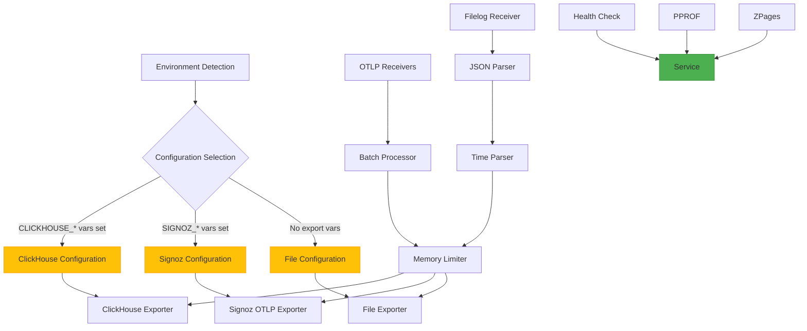
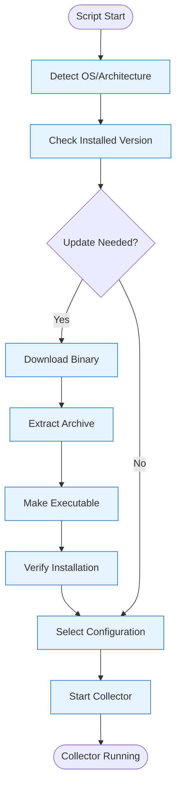
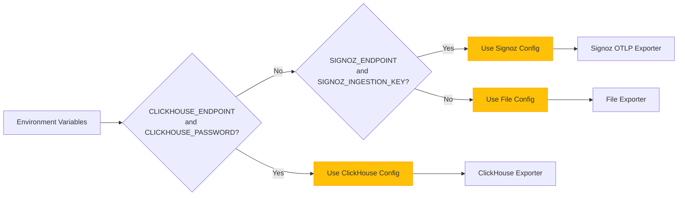
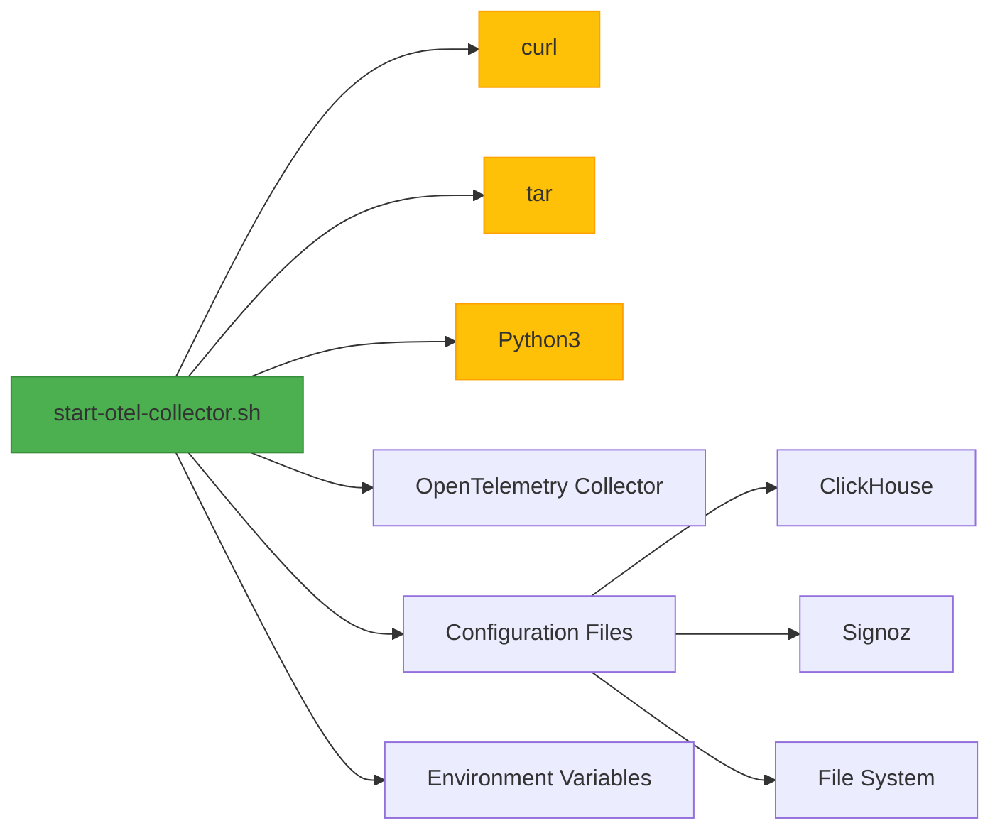

# Collector Deployment Scripts

<cite>
**Referenced Files in This Document**   
- [start-otel-collector.sh](file://otel/start-otel-collector.sh)
- [otel-collector-config-file.yaml](file://otel/otel-collector-config-file.yaml)
- [otel-collector-config-file-dev.yaml](file://otel/otel-collector-config-file-dev.yaml)
- [otel-collector-config-clickhouse.yaml](file://otel/otel-collector-config-clickhouse.yaml)
- [otel-collector-config-clickhouse-dev.yaml](file://otel/otel-collector-config-clickhouse-dev.yaml)
- [otel-collector-config-signoz.yaml](file://otel/otel-collector-config-signoz.yaml)
- [startup.sh](file://letta/server/startup.sh)
- [compose.yaml](file://compose.yaml)
- [development.compose.yml](file://development.compose.yml)
- [project.json](file://project.json)
</cite>

## Table of Contents
1. [Introduction](#introduction)
2. [Project Structure](#project-structure)
3. [Core Components](#core-components)
4. [Architecture Overview](#architecture-overview)
5. [Detailed Component Analysis](#detailed-component-analysis)
6. [Dependency Analysis](#dependency-analysis)
7. [Performance Considerations](#performance-considerations)
8. [Troubleshooting Guide](#troubleshooting-guide)
9. [Conclusion](#conclusion)

## Introduction
The OpenTelemetry Collector deployment system in Letta provides a comprehensive observability solution for monitoring application performance, traces, metrics, and logs. The deployment architecture is designed to be flexible across different environments (development, production) and supports multiple backends including ClickHouse, Signoz, and file-based storage. The core deployment script `start-otel-collector.sh` orchestrates the collector binary installation, configuration selection, and startup process based on environment variables and deployment requirements.

## Project Structure
The OpenTelemetry Collector deployment components are organized in the `otel/` directory with configuration files for different deployment scenarios and the main startup script. The system integrates with Docker and Kubernetes through compose files and server startup scripts, providing a complete observability pipeline from data collection to visualization.



**Diagram sources**
- [start-otel-collector.sh](file://otel/start-otel-collector.sh)
- [startup.sh](file://letta/server/startup.sh)
- [compose.yaml](file://compose.yaml)
- [development.compose.yml](file://development.compose.yml)

**Section sources**
- [start-otel-collector.sh](file://otel/start-otel-collector.sh)
- [compose.yaml](file://compose.yaml)
- [development.compose.yml](file://development.compose.yml)

## Core Components
The OpenTelemetry Collector deployment system consists of several core components that work together to provide observability capabilities. The main components include the startup script that handles binary management and configuration selection, multiple YAML configuration files for different deployment scenarios, and integration points with container orchestration systems.

**Section sources**
- [start-otel-collector.sh](file://otel/start-otel-collector.sh)
- [otel-collector-config-file.yaml](file://otel/otel-collector-config-file.yaml)
- [otel-collector-config-clickhouse.yaml](file://otel/otel-collector-config-clickhouse.yaml)
- [otel-collector-config-signoz.yaml](file://otel/otel-collector-config-signoz.yaml)

## Architecture Overview
The OpenTelemetry Collector deployment architecture in Letta follows a modular design that separates configuration from execution. The system automatically detects the deployment environment and selects the appropriate configuration based on available environment variables. The architecture supports multiple export backends including ClickHouse for production environments, Signoz for hosted solutions, and file-based storage for development and debugging.



**Diagram sources**
- [start-otel-collector.sh](file://otel/start-otel-collector.sh)
- [otel-collector-config-clickhouse.yaml](file://otel/otel-collector-config-clickhouse.yaml)
- [otel-collector-config-signoz.yaml](file://otel/otel-collector-config-signoz.yaml)
- [otel-collector-config-file.yaml](file://otel/otel-collector-config-file.yaml)

## Detailed Component Analysis

### Startup Process Analysis
The `start-otel-collector.sh` script implements a comprehensive startup process that ensures the OpenTelemetry Collector is properly installed and configured before execution. The script begins by checking the current installation status and determining if an update is needed based on version comparison. If an update is required, it downloads the appropriate binary for the detected platform (darwin/linux with amd64/arm64 support) and installs it in the local bin directory.



**Diagram sources**
- [start-otel-collector.sh](file://otel/start-otel-collector.sh#L10-L130)

**Section sources**
- [start-otel-collector.sh](file://otel/start-otel-collector.sh#L1-L130)

### Environment Variable Handling
The deployment script uses environment variables to determine the appropriate configuration and export backend. The primary decision logic is based on the presence of specific environment variables that indicate the desired export destination. When `CLICKHOUSE_ENDPOINT` and `CLICKHOUSE_PASSWORD` are set, the script selects the ClickHouse configuration. Otherwise, it defaults to file-based export for development environments.



**Diagram sources**
- [start-otel-collector.sh](file://otel/start-otel-collector.sh#L133-L139)
- [startup.sh](file://letta/server/startup.sh#L57-L65)

**Section sources**
- [start-otel-collector.sh](file://otel/start-otel-collector.sh#L133-L139)
- [startup.sh](file://letta/server/startup.sh#L57-L65)

### Configuration File Selection Logic
The configuration file selection logic in the OpenTelemetry Collector deployment is designed to support multiple deployment scenarios with appropriate defaults. The system uses different configuration files based on the target environment and export backend requirements. For development environments, the script uses `-dev` suffixed configuration files that are optimized for local development with appropriate endpoints and paths.

```mermaid
classDiagram
class ConfigSelector {
+detect_platform() string
+get_installed_version() string
+needs_update() bool
+main() void
}
class ConfigFile {
+name string
+description string
+environment string
+exporter string
}
class ClickHouseConfig : ConfigFile {
+endpoint string
+database string
+username string
+password string
}
class SignozConfig : ConfigFile {
+endpoint string
+ingestion_key string
}
class FileConfig : ConfigFile {
+path string
+rotation_enabled bool
}
ConfigSelector --> ConfigFile : "selects"
ConfigFile <|-- ClickHouseConfig
ConfigFile <|-- SignozConfig
ConfigFile <|-- FileConfig
note right of ConfigSelector
Selects configuration based on
environment variables and platform
end
```

**Diagram sources**
- [start-otel-collector.sh](file://otel/start-otel-collector.sh#L133-L139)
- [otel-collector-config-clickhouse-dev.yaml](file://otel/otel-collector-config-clickhouse-dev.yaml)
- [otel-collector-config-file-dev.yaml](file://otel/otel-collector-config-file-dev.yaml)

**Section sources**
- [start-otel-collector.sh](file://otel/start-otel-collector.sh#L133-L139)
- [otel-collector-config-clickhouse-dev.yaml](file://otel/otel-collector-config-clickhouse-dev.yaml)
- [otel-collector-config-file-dev.yaml](file://otel/otel-collector-config-file-dev.yaml)

### Integration with Docker and Kubernetes
The OpenTelemetry Collector deployment integrates with container orchestration systems through Docker Compose and Kubernetes manifests. The `compose.yaml` and `development.compose.yml` files define services that include the collector configuration and environment variables. The server startup script `startup.sh` also includes logic to start the collector in containerized environments with proper signal handling and process management.

```mermaid
sequenceDiagram
participant DockerCompose
participant StartupScript
participant OTelCollector
participant LettaServer
DockerCompose->>StartupScript : Start service
StartupScript->>StartupScript : Wait for PostgreSQL
StartupScript->>StartupScript : Run database migrations
StartupScript->>OTelCollector : Start in background
OTelCollector-->>StartupScript : PID
StartupScript->>LettaServer : Start main application
LettaServer-->>OTelCollector : Send telemetry
StartupScript->>OTelCollector : Cleanup on exit
note right of StartupScript
Manages lifecycle of both
collector and main application
end
```

**Diagram sources**
- [compose.yaml](file://compose.yaml)
- [development.compose.yml](file://development.compose.yml)
- [startup.sh](file://letta/server/startup.sh)

**Section sources**
- [compose.yaml](file://compose.yaml)
- [development.compose.yml](file://development.compose.yml)
- [startup.sh](file://letta/server/startup.sh)

## Dependency Analysis
The OpenTelemetry Collector deployment system has dependencies on several external components and tools. The primary dependencies include the OpenTelemetry Collector binary, curl for downloading the binary, tar for archive extraction, and Python for device ID generation. The system also depends on configuration management through environment variables and file system access for binary installation and log storage.



**Diagram sources**
- [start-otel-collector.sh](file://otel/start-otel-collector.sh)
- [project.json](file://project.json)

**Section sources**
- [start-otel-collector.sh](file://otel/start-otel-collector.sh)
- [project.json](file://project.json)

## Performance Considerations
The OpenTelemetry Collector deployment is optimized for performance with appropriate batching and memory limiting configurations. The production configurations use larger batch sizes (8192) and longer timeouts (10s) compared to development configurations (1024 batch size, 1s timeout). The system also includes memory limiting to prevent excessive resource consumption, with a 1GB limit and 256MB spike allowance.

**Section sources**
- [otel-collector-config-clickhouse.yaml](file://otel/otel-collector-config-clickhouse.yaml)
- [otel-collector-config-file.yaml](file://otel/otel-collector-config-file.yaml)

## Troubleshooting Guide
When troubleshooting the OpenTelemetry Collector deployment, check the following common issues:
- Ensure required environment variables are set for the desired export backend
- Verify network connectivity to the export destination (ClickHouse, Signoz)
- Check file system permissions for binary installation and log storage
- Validate that the collector binary is executable
- Confirm that the configuration file paths are correct

**Section sources**
- [start-otel-collector.sh](file://otel/start-otel-collector.sh)
- [startup.sh](file://letta/server/startup.sh)

## Conclusion
The OpenTelemetry Collector deployment system in Letta provides a robust and flexible observability solution that can be adapted to various deployment scenarios. The architecture supports multiple export backends, automatic binary management, and seamless integration with container orchestration systems. By following the documented best practices for environment variable management and configuration selection, users can ensure reliable telemetry collection and monitoring across development and production environments.