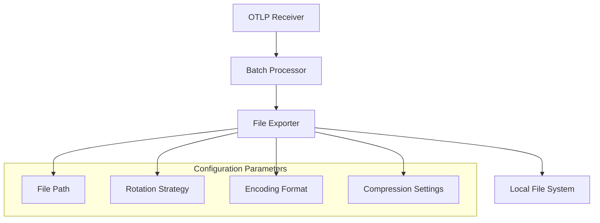
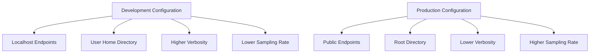
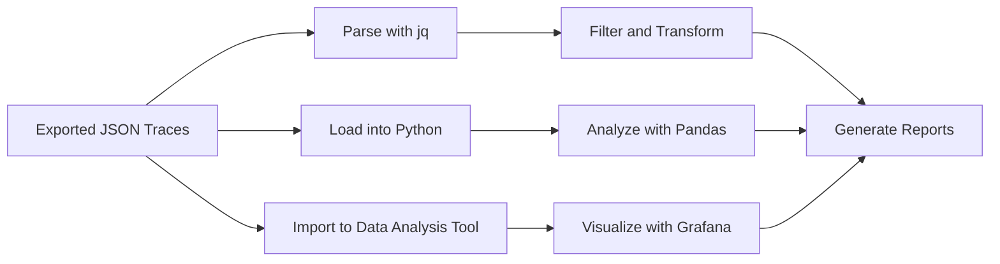
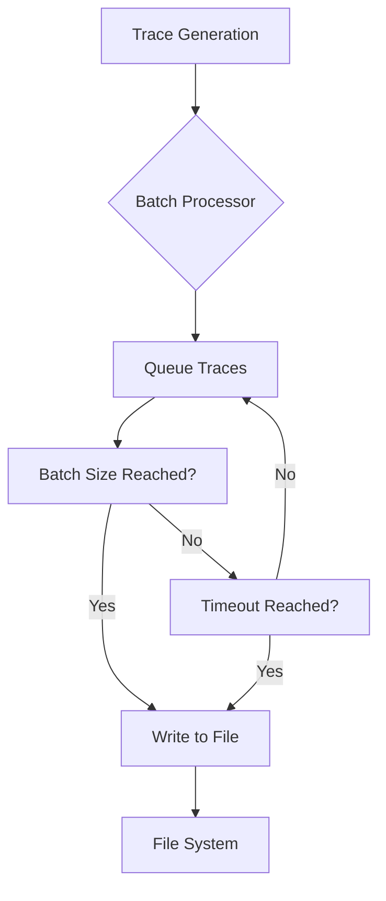
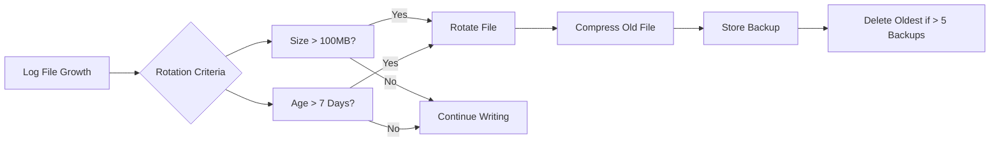

# File Exporter Configuration

<cite>
**Referenced Files in This Document**   
- [otel-collector-config-file-dev.yaml](file://otel/otel-collector-config-file-dev.yaml)
- [otel-collector-config-file.yaml](file://otel/otel-collector-config-file.yaml)
- [start-otel-collector.sh](file://otel/start-otel-collector.sh)
- [tracing.py](file://letta/otel/tracing.py)
- [log.py](file://letta/log.py)
- [settings.py](file://letta/settings.py)
- [agent_serialization_manager.py](file://letta/services/agent_serialization_manager.py)
- [agent_file_manager.py](file://letta/services/agent_file_manager.py)
- [provider_trace.py](file://letta/orm/provider_trace.py)
- [test_otel_tracing.py](file://tests/test_otel_tracing.py)
</cite>

## Table of Contents
1. [Introduction](#introduction)
2. [Configuration Structure](#configuration-structure)
3. [Development vs Default Configurations](#development-vs-default-configurations)
4. [Data Parsing and External Integration](#data-parsing-and-external-integration)
5. [Performance Implications](#performance-implications)
6. [Log Rotation Best Practices](#log-rotation-best-practices)
7. [Conclusion](#conclusion)

## Introduction

The File Exporter Configuration in Letta's observability stack enables telemetry data to be exported to local files for debugging and offline analysis. This configuration is particularly useful for developers and system administrators who need to inspect trace data without relying on external monitoring systems. The file-based exporter captures OpenTelemetry (OTLP) traces in JSON format, allowing for straightforward parsing and integration with various analysis tools.

The primary purpose of the file exporter is to provide a reliable mechanism for capturing detailed telemetry data during development and testing phases. By writing traces to disk, developers can perform offline analysis, share debugging information, and validate system behavior without requiring network connectivity to external observability platforms.

**Section sources**
- [otel-collector-config-file-dev.yaml](file://otel/otel-collector-config-file-dev.yaml#L1-L30)
- [start-otel-collector.sh](file://otel/start-otel-collector.sh#L132-L145)

## Configuration Structure

The file exporter configuration is defined in YAML files that specify the receivers, processors, exporters, and service pipelines for the OpenTelemetry Collector. The core configuration elements include file path, rotation strategy, encoding format, and compression settings.

The file path is configured in the exporter section, with different paths for development and production environments. In development, traces are written to `${HOME}/.letta/logs/traces.json`, while in production, they are written to `/root/.letta/logs/traces.json`. This separation ensures that development telemetry does not interfere with production data.

**Diagram sources**
- [otel-collector-config-file-dev.yaml](file://otel/otel-collector-config-file-dev.yaml#L15-L21)
- [otel-collector-config-file.yaml](file://otel/otel-collector-config-file.yaml#L15-L21)

The rotation strategy is configured with three key parameters: `max_megabytes`, `max_days`, and `max_backups`. These settings ensure that log files are rotated when they reach 100MB, after 7 days, or when there are more than 5 backup files, whichever comes first. This prevents unbounded growth of log files and facilitates easier management of telemetry data.

The encoding format is JSON, which provides a human-readable and machine-parsable format for trace data. While the configuration files do not explicitly specify compression settings, the JSON format itself can be compressed using external tools or integrated compression mechanisms in the file system.

**Section sources**
- [otel-collector-config-file-dev.yaml](file://otel/otel-collector-config-file-dev.yaml#L16-L21)
- [otel-collector-config-file.yaml](file://otel/otel-collector-config-file.yaml#L16-L21)

## Development vs Default Configurations

The file exporter configuration differs between development and default (production) environments, primarily in terms of log verbosity and sampling rates. These differences are designed to balance the need for detailed debugging information in development with performance considerations in production.

In development environments, the configuration uses `otel-collector-config-file-dev.yaml`, which sets up the collector to listen on localhost interfaces (127.0.0.1) for both gRPC and HTTP protocols. This restricts access to local processes, enhancing security during development. The file path uses the `${HOME}` environment variable, ensuring that traces are stored in the user's home directory.

**Diagram sources**
- [otel-collector-config-file-dev.yaml](file://otel/otel-collector-config-file-dev.yaml#L5-L7)
- [otel-collector-config-file.yaml](file://otel/otel-collector-config-file.yaml#L5-L7)

In contrast, the default production configuration in `otel-collector-config-file.yaml` binds to all interfaces (0.0.0.0), allowing external systems to send telemetry data. The file path is set to `/root/.letta/logs/traces.json`, which is more appropriate for containerized or server deployments.

The telemetry logs themselves are configured with an error-level threshold in both configurations, meaning only error messages are logged by the collector. However, the underlying tracing implementation in `tracing.py` includes sophisticated parameter handling that affects what data is captured in spans. Large parameters (over 2MB) are excluded from span attributes, while the total size of all parameters is limited to 4MB to prevent excessive memory usage.

**Section sources**
- [otel-collector-config-file-dev.yaml](file://otel/otel-collector-config-file-dev.yaml#L5-L7)
- [otel-collector-config-file.yaml](file://otel/otel-collector-config-file.yaml#L5-L7)
- [tracing.py](file://letta/otel/tracing.py#L257-L259)

## Data Parsing and External Integration

The exported trace data can be parsed and integrated with external analysis tools for deeper insights into system behavior. The JSON format of the exported traces makes them compatible with a wide range of data processing and visualization tools.

The trace data includes detailed information about spans, including start and end times, attributes, events, and links. Each span represents a unit of work in the system, such as an API call or database query. The attributes of a span can include metadata like HTTP method, URL, status code, and custom application-specific data.

**Diagram sources**
- [test_otel_tracing.py](file://tests/test_otel_tracing.py#L134-L184)
- [tracing.py](file://letta/otel/tracing.py#L220-L370)

Practical examples of parsing exported trace data include using command-line tools like `jq` to filter and transform the JSON data, or loading the data into Python for analysis with libraries like Pandas. For instance, developers can extract all spans with error status codes to identify problematic areas in the system.

Integration with external analysis tools can be achieved by importing the JSON traces into systems like Grafana, Elasticsearch, or specialized observability platforms. The structured nature of the JSON format facilitates easy mapping to the data models of these tools, enabling rich visualizations and dashboards.

The `provider_traces` table in the database schema, which stores request and response JSON data, demonstrates how similar telemetry data is structured within the application's persistence layer. This table includes fields for request_json and response_json, both stored as JSON types, indicating the importance of structured data for analysis.

**Section sources**
- [test_otel_tracing.py](file://tests/test_otel_tracing.py#L134-L184)
- [provider_trace.py](file://letta/orm/provider_trace.py#L21-L22)

## Performance Implications

The performance implications of the file exporter configuration are significant, particularly regarding synchronous vs asynchronous writing and the impact of trace data volume on system resources. The configuration and implementation include several optimizations to mitigate these performance concerns.

The OpenTelemetry Collector uses a batch processor with a 1-second timeout and a send batch size of 1024, which helps to reduce the number of write operations to disk. This batching strategy amortizes the cost of file I/O across multiple traces, improving overall throughput and reducing the overhead on the system.

**Diagram sources**
- [otel-collector-config-file-dev.yaml](file://otel/otel-collector-config-file-dev.yaml#L10-L12)
- [otel-collector-config-file.yaml](file://otel/otel-collector-config-file.yaml#L10-L12)

The tracing implementation in `tracing.py` includes several performance optimizations. Large parameters are excluded from span attributes to prevent excessive memory usage and slow serialization. The maximum parameter size is set to 2MB, and the total size of all parameters is limited to 4MB. This ensures that individual spans remain manageable in size, even when dealing with large data structures.

Synchronous writing could potentially block the main application thread, but the use of the OpenTelemetry Collector as a separate process mitigates this risk. The collector receives traces via OTLP over gRPC or HTTP and handles the file writing asynchronously, decoupling the application's performance from the telemetry export process.

The rotation strategy also contributes to performance by preventing unbounded log file growth. By limiting the size and number of backup files, the system avoids the performance degradation associated with very large files, such as slow seek times and increased backup durations.

**Section sources**
- [otel-collector-config-file-dev.yaml](file://otel/otel-collector-config-file-dev.yaml#L10-L12)
- [tracing.py](file://letta/otel/tracing.py#L257-L259)

## Log Rotation Best Practices

Best practices for log rotation in production environments are embodied in the file exporter configuration, with settings that balance data retention, disk usage, and operational efficiency. The rotation strategy is designed to prevent log files from consuming excessive disk space while maintaining sufficient historical data for troubleshooting.

The configuration uses a combination of size-based and time-based rotation criteria. Files are rotated when they reach 100MB or after 7 days, whichever comes first. This ensures that logs are rotated frequently enough to prevent very large files, while also providing a reasonable retention period for debugging purposes.

**Diagram sources**
- [otel-collector-config-file-dev.yaml](file://otel/otel-collector-config-file-dev.yaml#L18-L20)
- [otel-collector-config-file.yaml](file://otel/otel-collector-config-file.yaml#L18-L20)

The maximum number of backups is set to 5, which provides a reasonable balance between data retention and disk usage. This setting ensures that recent log data is available for troubleshooting while preventing unbounded growth of log files.

In production environments, additional best practices include monitoring disk usage and setting up alerts when available space falls below a threshold. Automated log rotation and compression can be implemented using system tools like logrotate, which can be configured to compress old log files and remove them after a specified period.

The use of JSON format for the exported traces also facilitates automated processing and analysis. JSON files can be easily parsed by scripts and tools, enabling automated extraction of key metrics and generation of reports. This automation reduces the operational burden of managing telemetry data and ensures consistent analysis across different environments.

**Section sources**
- [otel-collector-config-file-dev.yaml](file://otel/otel-collector-config-file-dev.yaml#L18-L20)
- [otel-collector-config-file.yaml](file://otel/otel-collector-config-file.yaml#L18-L20)

## Conclusion

The File Exporter Configuration in Letta's observability stack provides a robust mechanism for capturing and analyzing telemetry data. By writing traces to local files in JSON format, the configuration enables detailed debugging and offline analysis, particularly valuable in development environments. The rotation strategy ensures that log files are managed efficiently, preventing unbounded growth and facilitating easier data management.

The differences between development and default configurations reflect a thoughtful approach to balancing detailed observability with production performance. Development configurations prioritize accessibility and verbosity, while production configurations focus on security and resource efficiency. The integration with external analysis tools is straightforward due to the structured JSON format, enabling a wide range of post-processing and visualization options.

Performance implications are carefully managed through batching, parameter size limits, and asynchronous processing. The separation of the OpenTelemetry Collector from the main application ensures that telemetry export does not impact application performance. Best practices for log rotation are implemented through size and time-based criteria, with reasonable limits on backup files to balance data retention and disk usage.

Overall, the file exporter configuration demonstrates a comprehensive approach to observability, providing developers and operators with the tools they need to understand and optimize system behavior.