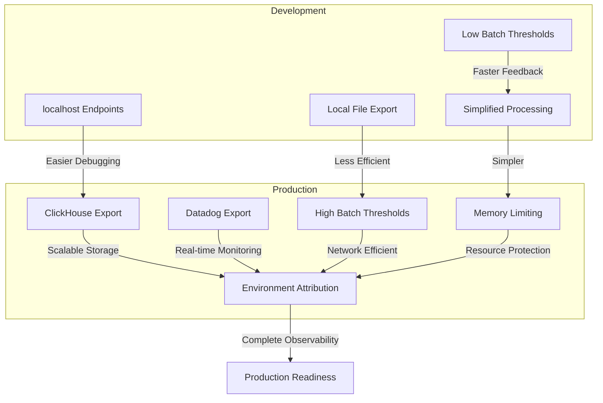
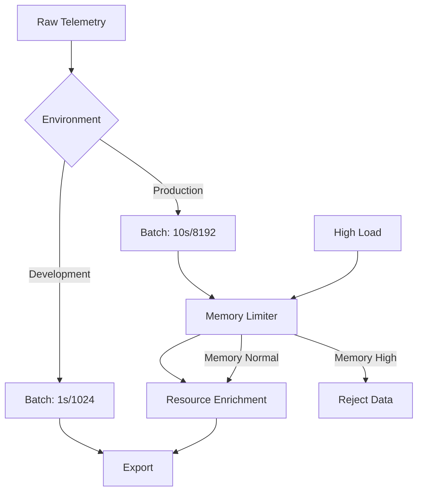
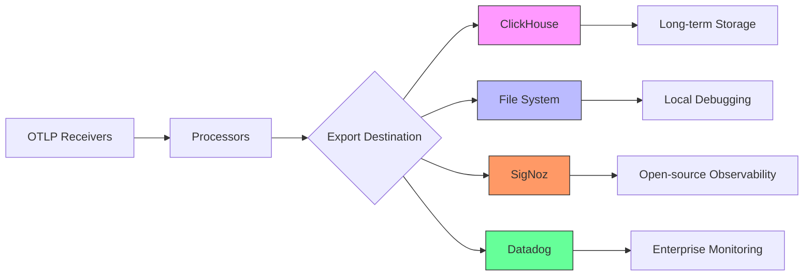
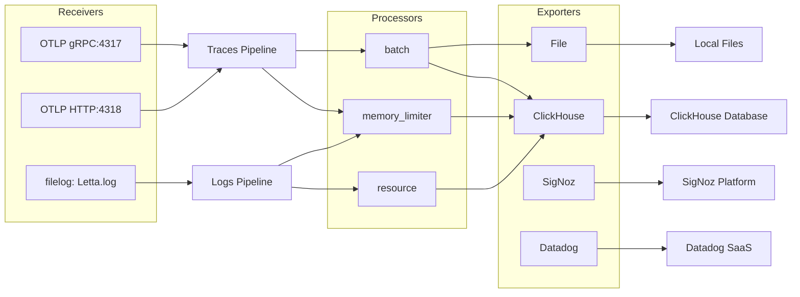
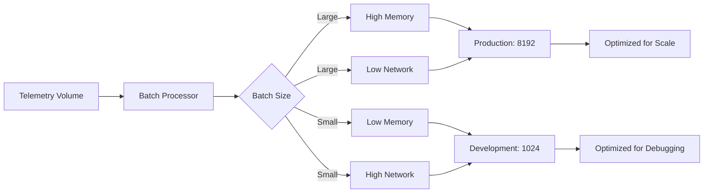
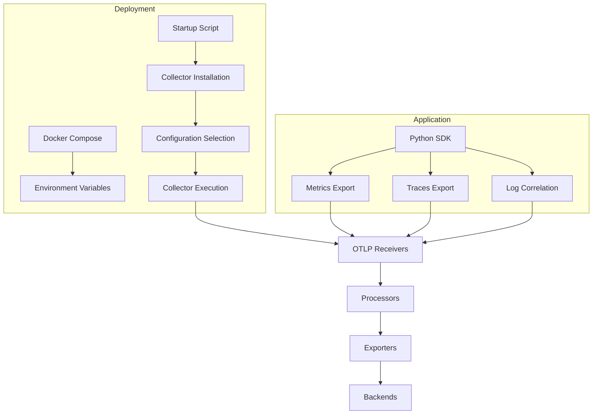

# OpenTelemetry Collector Configuration

<cite>
**Referenced Files in This Document**   
- [otel-collector-config-clickhouse-dev.yaml](file://otel/otel-collector-config-clickhouse-dev.yaml)
- [otel-collector-config-clickhouse-prod.yaml](file://otel/otel-collector-config-clickhouse-prod.yaml)
- [otel-collector-config-clickhouse.yaml](file://otel/otel-collector-config-clickhouse.yaml)
- [otel-collector-config-file-dev.yaml](file://otel/otel-collector-config-file-dev.yaml)
- [otel-collector-config-file.yaml](file://otel/otel-collector-config-file.yaml)
- [otel-collector-config-signoz.yaml](file://otel/otel-collector-config-signoz.yaml)
- [start-otel-collector.sh](file://otel/start-otel-collector.sh)
- [compose.yaml](file://compose.yaml)
- [dev-compose.yaml](file://dev-compose.yaml)
- [settings.py](file://letta/settings.py)
- [metrics.py](file://letta/otel/metrics.py)
- [tracing.py](file://letta/otel/tracing.py)
- [log.py](file://letta/log.py)
</cite>

## Table of Contents
1. [Introduction](#introduction)
2. [Configuration File Overview](#configuration-file-overview)
3. [Development vs Production Configurations](#development-vs-production-configurations)
4. [OTLP Receivers](#otlp-receivers)
5. [Processor Configuration](#processor-configuration)
6. [Exporters and Backend Integration](#exporters-and-backend-integration)
7. [Data Routing and Transformation](#data-routing-and-transformation)
8. [Customization and Sampling Strategies](#customization-and-sampling-strategies)
9. [Security and Data Transmission](#security-and-data-transmission)
10. [Performance Implications](#performance-implications)
11. [Scaling in Distributed Environments](#scaling-in-distributed-environments)
12. [Deployment and Integration](#deployment-and-integration)

## Introduction
The OpenTelemetry Collector configuration in Letta's observability pipeline provides a comprehensive telemetry framework for collecting, processing, and exporting traces, metrics, and logs. This documentation details the configuration structure, differences between development and production setups, and integration with various backends including ClickHouse, file storage, and SigNoz. The collector serves as a central component in Letta's monitoring infrastructure, enabling detailed observability of the AI agent platform's performance and behavior.

## Configuration File Overview
Letta provides multiple OpenTelemetry Collector configuration files tailored for different deployment scenarios and backend requirements. These YAML configurations define the complete telemetry pipeline from data ingestion to export.

The configuration files follow a consistent structure with four main sections:
- **receivers**: Define how telemetry data is ingested
- **processors**: Specify data transformation and processing logic
- **exporters**: Configure destinations for telemetry data
- **service**: Define pipelines that connect receivers, processors, and exporters

Each configuration file is designed for specific use cases, ranging from development environments with file-based storage to production deployments with ClickHouse and Datadog integration.

**Section sources**
- [otel-collector-config-clickhouse-dev.yaml](file://otel/otel-collector-config-clickhouse-dev.yaml#L1-L54)
- [otel-collector-config-clickhouse-prod.yaml](file://otel/otel-collector-config-clickhouse-prod.yaml#L1-L91)
- [otel-collector-config-clickhouse.yaml](file://otel/otel-collector-config-clickhouse.yaml#L1-L82)

## Development vs Production Configurations
Letta distinguishes between development and production OpenTelemetry configurations, with different performance characteristics, processing capabilities, and export destinations.

### Development Configurations
The development configurations prioritize ease of setup and local debugging over performance optimization. Key characteristics include:

- **File-based exporters**: Both `otel-collector-config-file-dev.yaml` and `otel-collector-config-clickhouse-dev.yaml` export to local files with rotation policies
- **Lower batch thresholds**: The `batch` processor uses a 1-second timeout and 1024-item batch size for faster data visibility
- **Local endpoints**: Development configurations use `localhost` endpoints for OTLP receivers
- **Simplified pipelines**: Fewer processors and simpler routing logic

The file-based development configuration (`otel-collector-config-file-dev.yaml`) is designed for environments without external observability backends, storing all telemetry data in JSON files on the local filesystem.

### Production Configurations
Production configurations are optimized for performance, reliability, and integration with enterprise observability platforms. Key differences include:

- **Higher batch thresholds**: The `batch` processor uses a 10-second timeout and 8192-item batch size to optimize network efficiency
- **Memory limiting**: Production configurations include `memory_limiter` processors to prevent resource exhaustion
- **Multiple exporters**: Production setups export to both ClickHouse and Datadog simultaneously
- **Enhanced logging**: The production configuration includes `filelog` receivers to ingest application logs
- **Resource attribution**: Production configurations add environment attributes to all telemetry data

The `otel-collector-config-clickhouse-prod.yaml` file represents the most comprehensive production setup, with integration to both ClickHouse for long-term storage and Datadog for real-time monitoring and alerting.



**Diagram sources**
- [otel-collector-config-clickhouse-dev.yaml](file://otel/otel-collector-config-clickhouse-dev.yaml#L1-L54)
- [otel-collector-config-clickhouse-prod.yaml](file://otel/otel-collector-config-clickhouse-prod.yaml#L1-L91)
- [otel-collector-config-file-dev.yaml](file://otel/otel-collector-config-file-dev.yaml#L1-L31)

**Section sources**
- [otel-collector-config-clickhouse-dev.yaml](file://otel/otel-collector-config-clickhouse-dev.yaml#L1-L54)
- [otel-collector-config-clickhouse-prod.yaml](file://otel/otel-collector-config-clickhouse-prod.yaml#L1-L91)
- [otel-collector-config-file-dev.yaml](file://otel/otel-collector-config-file-dev.yaml#L1-L31)

## OTLP Receivers
The OpenTelemetry Protocol (OTLP) receivers are configured to accept telemetry data via both gRPC and HTTP protocols, providing flexibility for different client requirements.

### Receiver Configuration
All configurations include OTLP receivers with the following endpoints:
- **gRPC endpoint**: `0.0.0.0:4317` (or `localhost:4317` in development)
- **HTTP endpoint**: `0.0.0.0:4318` (or `localhost:4318` in development)

The gRPC endpoint is the preferred method for high-volume telemetry data due to its superior performance and efficiency, while the HTTP endpoint provides compatibility with environments where gRPC is not available or practical.

### Protocol Selection
The dual-protocol approach allows clients to choose the most appropriate transport mechanism:
- **gRPC**: Recommended for production environments with high telemetry volume
- **HTTP/JSON**: Suitable for development, debugging, and environments with restrictive network policies

The configuration uses the standard OTLP ports (4317 for gRPC, 4318 for HTTP) to ensure compatibility with OpenTelemetry SDKs and other observability tools.

**Section sources**
- [otel-collector-config-clickhouse-dev.yaml](file://otel/otel-collector-config-clickhouse-dev.yaml#L1-L8)
- [otel-collector-config-clickhouse-prod.yaml](file://otel/otel-collector-config-clickhouse-prod.yaml#L1-L8)
- [otel-collector-config-signoz.yaml](file://otel/otel-collector-config-signoz.yaml#L1-L8)

## Processor Configuration
The OpenTelemetry Collector in Letta's pipeline employs several processors to transform, enrich, and optimize telemetry data before export.

### Batch Processor
The `batch` processor is a critical component in all configurations, responsible for:
- Grouping individual telemetry items into batches
- Reducing the number of export operations
- Optimizing network utilization

Configuration differences between environments:
- **Development**: 1-second timeout, 1024-item batch size
- **Production**: 10-second timeout, 8192-item batch size

The batch processor significantly improves efficiency by reducing the overhead of individual export operations, at the cost of increased latency in data visibility.

### Memory Limiter
Included in production configurations, the `memory_limiter` processor protects the collector from resource exhaustion:
- **check_interval**: 1 second
- **limit_mib**: 1024 MiB (1 GB)
- **spike_limit_mib**: 256 MiB

This processor monitors the collector's memory usage and can reject data if memory consumption exceeds safe thresholds, ensuring the collector remains stable under high load.

### Resource Processor
The `resource` processor adds environment-specific attributes to all telemetry data:
- **environment**: Populated from the `LETTA_ENVIRONMENT` environment variable
- **action**: upsert (ensures the attribute is present)

This enrichment enables filtering and analysis of telemetry data by environment (e.g., dev, staging, prod) in downstream systems.



**Diagram sources**
- [otel-collector-config-clickhouse-dev.yaml](file://otel/otel-collector-config-clickhouse-dev.yaml#L9-L13)
- [otel-collector-config-clickhouse-prod.yaml](file://otel/otel-collector-config-clickhouse-prod.yaml#L26-L39)
- [otel-collector-config-clickhouse.yaml](file://otel/otel-collector-config-clickhouse.yaml#L26-L39)

**Section sources**
- [otel-collector-config-clickhouse-dev.yaml](file://otel/otel-collector-config-clickhouse-dev.yaml#L9-L13)
- [otel-collector-config-clickhouse-prod.yaml](file://otel/otel-collector-config-clickhouse-prod.yaml#L26-L39)
- [otel-collector-config-clickhouse.yaml](file://otel/otel-collector-config-clickhouse.yaml#L26-L39)

## Exporters and Backend Integration
Letta's OpenTelemetry configuration supports multiple exporters for different observability backends, enabling flexible deployment options.

### ClickHouse Exporter
The ClickHouse exporter is configured in several files for long-term telemetry storage:
- **endpoint**: Configured via `CLICKHOUSE_ENDPOINT` environment variable
- **database**: Configured via `CLICKHOUSE_DATABASE` environment variable
- **authentication**: Username and password from environment variables
- **timeout**: 5-10 seconds depending on configuration
- **retry policy**: Enabled with exponential backoff (5s to 30s)

The ClickHouse backend provides scalable, high-performance storage for traces, metrics, and logs, making it suitable for production environments with significant telemetry volume.

### File Exporter
Used primarily in development configurations, the file exporter writes telemetry data to JSON files with rotation:
- **path**: Local filesystem path (user home directory in dev, root directory in production)
- **rotation**: Configured with maximum size (100MB), retention period (7 days), and backup count (5)

This exporter enables local debugging and analysis without requiring external observability infrastructure.

### SigNoz Exporter
The `otel-collector-config-signoz.yaml` file configures export to SigNoz, an open-source observability platform:
- **endpoint**: Configured via `SIGNOZ_ENDPOINT` environment variable
- **authentication**: Ingestion key via `SIGNOZ_INGESTION_KEY`
- **headers**: Custom header for authentication

SigNoz provides a complete observability stack including metrics, traces, and logs with a user-friendly interface.

### Datadog Exporter
Included in the production configuration, the Datadog exporter provides integration with the Datadog monitoring platform:
- **site**: Configured via `DD_SITE` environment variable
- **API key**: Configured via `DD_API_KEY` environment variable
- **span remapping**: Translates OpenTelemetry attributes to Datadog conventions



**Diagram sources**
- [otel-collector-config-clickhouse-dev.yaml](file://otel/otel-collector-config-clickhouse-dev.yaml#L14-L40)
- [otel-collector-config-signoz.yaml](file://otel/otel-collector-config-signoz.yaml#L18-L23)
- [otel-collector-config-clickhouse-prod.yaml](file://otel/otel-collector-config-clickhouse-prod.yaml#L41-L65)

**Section sources**
- [otel-collector-config-clickhouse-dev.yaml](file://otel/otel-collector-config-clickhouse-dev.yaml#L14-L40)
- [otel-collector-config-clickhouse-prod.yaml](file://otel/otel-collector-config-clickhouse-prod.yaml#L41-L65)
- [otel-collector-config-signoz.yaml](file://otel/otel-collector-config-signoz.yaml#L18-L23)
- [otel-collector-config-file-dev.yaml](file://otel/otel-collector-config-file-dev.yaml#L14-L21)

## Data Routing and Transformation
The OpenTelemetry Collector in Letta's pipeline routes and transforms different types of telemetry data through dedicated pipelines.

### Pipeline Architecture
The configuration defines separate pipelines for different telemetry types:
- **traces**: Application tracing data
- **metrics**: Performance and business metrics
- **logs**: Application log entries

Each pipeline connects specific receivers, processors, and exporters appropriate for the telemetry type.

### Trace Pipeline
The trace pipeline processes distributed tracing data:
- **Receivers**: OTLP (gRPC and HTTP)
- **Processors**: batch (and memory_limiter in production)
- **Exporters**: ClickHouse, file, or SigNoz depending on configuration

Trace data captures the flow of requests through the system, enabling performance analysis and debugging of distributed transactions.

### Metrics Pipeline
The metrics pipeline handles numerical measurements:
- **Receivers**: OTLP
- **Processors**: batch (and memory_limiter in production)
- **Exporters**: ClickHouse, file, or SigNoz

Metrics include system performance indicators (CPU, memory) and business metrics (request rates, error rates).

### Logs Pipeline
Present only in production configurations, the logs pipeline ingests and processes application logs:
- **Receivers**: filelog (reading from `/root/.letta/logs/Letta.log`)
- **Processors**: resource, memory_limiter, batch
- **Exporters**: ClickHouse and Datadog

The filelog receiver includes operators to:
- Parse JSON-formatted log entries
- Extract timestamps
- Handle multiline log entries

This enables structured analysis of application logs alongside traces and metrics.



**Diagram sources**
- [otel-collector-config-clickhouse-prod.yaml](file://otel/otel-collector-config-clickhouse-prod.yaml#L79-L86)
- [otel-collector-config-clickhouse.yaml](file://otel/otel-collector-config-clickhouse.yaml#L70-L77)
- [otel-collector-config-signoz.yaml](file://otel/otel-collector-config-signoz.yaml#L37-L48)

**Section sources**
- [otel-collector-config-clickhouse-prod.yaml](file://otel/otel-collector-config-clickhouse-prod.yaml#L79-L86)
- [otel-collector-config-clickhouse.yaml](file://otel/otel-collector-config-clickhouse.yaml#L70-L77)
- [otel-collector-config-signoz.yaml](file://otel/otel-collector-config-signoz.yaml#L37-L48)

## Customization and Sampling Strategies
Letta's OpenTelemetry configuration supports various customization options and sampling strategies to optimize telemetry collection.

### Environment-Based Configuration
The collector automatically selects the appropriate configuration based on available environment variables:
- If `CLICKHOUSE_ENDPOINT` and `CLICKHOUSE_PASSWORD` are set: Use ClickHouse configuration
- If `SIGNOZ_ENDPOINT` and `SIGNOZ_INGESTION_KEY` are set: Use SigNoz configuration
- Otherwise: Use file-based configuration

This allows seamless deployment across different environments without manual configuration changes.

### Sampling Configuration
While the provided configurations do not explicitly define sampling policies, the batch processor settings effectively implement a form of sampling:
- **Development**: High sampling rate (low batch thresholds) for comprehensive debugging data
- **Production**: Lower effective sampling rate (high batch thresholds) to reduce volume

For more granular sampling control, additional processors like `tail_sampling` could be added to the configuration.

### Custom Attribute Addition
The resource processor allows adding custom attributes to all telemetry data:
```yaml
processors:
  resource:
    attributes:
      - key: environment
        value: ${env:LETTA_ENVIRONMENT}
        action: upsert
```

Additional attributes can be added by extending this configuration, such as service version, deployment ID, or region.

**Section sources**
- [start-otel-collector.sh](file://otel/start-otel-collector.sh#L133-L139)
- [otel-collector-config-clickhouse.yaml](file://otel/otel-collector-config-clickhouse.yaml#L27-L31)
- [dev-compose.yaml](file://dev-compose.yaml#L30-L49)

## Security and Data Transmission
The OpenTelemetry Collector configuration in Letta addresses security considerations for data transmission and storage.

### Authentication and Authorization
The configurations use environment variables for sensitive credentials:
- ClickHouse: Username and password
- SigNoz: Ingestion key
- Datadog: API key

This approach keeps credentials out of version control and allows secure injection through deployment systems.

### Data Encryption
While the configurations themselves don't specify encryption settings, the use of standard OTLP endpoints implies:
- **gRPC**: Typically uses TLS for encryption in production
- **HTTP**: Should be deployed behind TLS termination

The environment variables suggest integration with secure backends that handle encryption at rest.

### Secure Deployment Practices
The `start-otel-collector.sh` script implements several security best practices:
- Validates platform compatibility
- Downloads collector from official GitHub releases
- Verifies installation integrity
- Uses environment variables for configuration

These practices help ensure the collector itself is deployed securely.

**Section sources**
- [otel-collector-config-clickhouse-dev.yaml](file://otel/otel-collector-config-clickhouse-dev.yaml#L28-L31)
- [otel-collector-config-signoz.yaml](file://otel/otel-collector-config-signoz.yaml#L21-L22)
- [start-otel-collector.sh](file://otel/start-otel-collector.sh#L1-L146)

## Performance Implications
The processor configurations in Letta's OpenTelemetry setup have significant performance implications that vary between development and production environments.

### Batch Processor Impact
The batch processor settings represent a trade-off between:
- **Latency**: Lower batch thresholds result in faster data visibility
- **Efficiency**: Higher batch thresholds reduce export overhead

| Environment | Timeout | Batch Size | Latency | Efficiency |
|-----------|---------|------------|---------|------------|
| Development | 1s | 1024 | Low | Lower |
| Production | 10s | 8192 | Higher | Higher |

### Memory Management
The `memory_limiter` processor in production configurations prevents the collector from consuming excessive memory:
- **limit_mib**: 1024 MiB total memory limit
- **spike_limit_mib**: 256 MiB allowance for memory spikes
- **check_interval**: 1 second monitoring frequency

This protects the host system from memory exhaustion while allowing temporary spikes during traffic surges.

### Resource Overhead
The collector's resource requirements scale with telemetry volume:
- **CPU**: Primarily affected by data processing and serialization
- **Memory**: Affected by batch sizes and queue depths
- **Network**: Determined by export frequency and destination

The production configuration's larger batch sizes reduce network overhead at the cost of increased memory usage.



**Diagram sources**
- [otel-collector-config-clickhouse-dev.yaml](file://otel/otel-collector-config-clickhouse-dev.yaml#L10-L12)
- [otel-collector-config-clickhouse-prod.yaml](file://otel/otel-collector-config-clickhouse-prod.yaml#L36-L38)
- [otel-collector-config-clickhouse.yaml](file://otel/otel-collector-config-clickhouse.yaml#L36-L38)

**Section sources**
- [otel-collector-config-clickhouse-dev.yaml](file://otel/otel-collector-config-clickhouse-dev.yaml#L10-L12)
- [otel-collector-config-clickhouse-prod.yaml](file://otel/otel-collector-config-clickhouse-prod.yaml#L36-L38)
- [otel-collector-config-clickhouse.yaml](file://otel/otel-collector-config-clickhouse.yaml#L36-L38)

## Scaling in Distributed Environments
The OpenTelemetry Collector configuration supports scaling in distributed environments through several mechanisms.

### Horizontal Scaling
Multiple collector instances can be deployed to handle increased telemetry volume:
- Each instance can receive data on the standard OTLP ports
- Load balancers can distribute traffic across instances
- Backends like ClickHouse can handle writes from multiple collectors

### High Availability
The retry configurations provide resilience against backend outages:
- **retry_on_failure**: Enabled in all configurations
- **initial_interval**: 5 seconds
- **max_interval**: 30 seconds
- **max_elapsed_time**: 300 seconds (5 minutes)

This ensures telemetry data is not lost during temporary backend unavailability.

### Resource Isolation
The memory limiter and batch processors help isolate the collector's resource usage:
- Prevents a single collector instance from consuming all available memory
- Limits the impact of telemetry spikes on host system performance
- Enables predictable resource allocation in containerized environments

### Configuration Management
The use of environment variables for configuration enables consistent deployment across environments:
- Same configuration files can be used in dev, staging, and prod
- Differences are managed through environment-specific variables
- Supports infrastructure-as-code deployment patterns

**Section sources**
- [otel-collector-config-clickhouse-dev.yaml](file://otel/otel-collector-config-clickhouse-dev.yaml#L33-L39)
- [otel-collector-config-clickhouse-prod.yaml](file://otel/otel-collector-config-clickhouse-prod.yaml#L49-L54)
- [otel-collector-config-clickhouse.yaml](file://otel/otel-collector-config-clickhouse.yaml#L48-L55)

## Deployment and Integration
The OpenTelemetry Collector is integrated into Letta's deployment through several mechanisms.

### Docker Compose Integration
The `compose.yaml` and `dev-compose.yaml` files configure the Letta server with environment variables for OpenTelemetry:
- `LETTA_OTEL_EXPORTER_OTLP_ENDPOINT`: OTLP endpoint for direct SDK export
- `CLICKHOUSE_ENDPOINT`, `CLICKHOUSE_DATABASE`, etc.: ClickHouse connection details

This enables both direct SDK export and collector-based export.

### Startup Script Integration
The `start-otel-collector.sh` script automates collector deployment:
- Downloads and installs the collector binary
- Verifies the installation
- Selects the appropriate configuration based on environment variables
- Starts the collector with the selected configuration

This script ensures consistent collector deployment across different environments.

### Python SDK Integration
The Letta codebase includes OpenTelemetry instrumentation:
- `letta/otel/metrics.py`: Configures metric export via OTLPMetricExporter
- `letta/otel/tracing.py`: Configures trace export via OTLPSpanExporter
- `letta/log.py`: Adds OpenTelemetry trace correlation to logs

This integration ensures comprehensive telemetry coverage across the application.



**Diagram sources**
- [compose.yaml](file://compose.yaml#L48-L52)
- [start-otel-collector.sh](file://otel/start-otel-collector.sh#L133-L145)
- [metrics.py](file://letta/otel/metrics.py#L115-L122)
- [tracing.py](file://letta/otel/tracing.py#L138)

**Section sources**
- [compose.yaml](file://compose.yaml#L48-L52)
- [dev-compose.yaml](file://dev-compose.yaml#L30-L49)
- [start-otel-collector.sh](file://otel/start-otel-collector.sh#L1-L146)
- [metrics.py](file://letta/otel/metrics.py#L113-L139)
- [tracing.py](file://letta/otel/tracing.py#L13-L138)
- [log.py](file://letta/log.py#L74-L86)