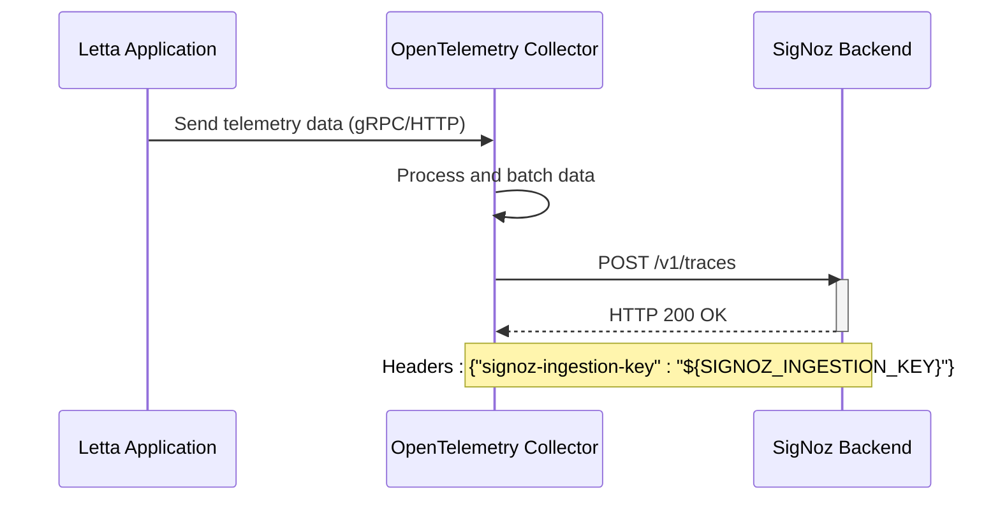
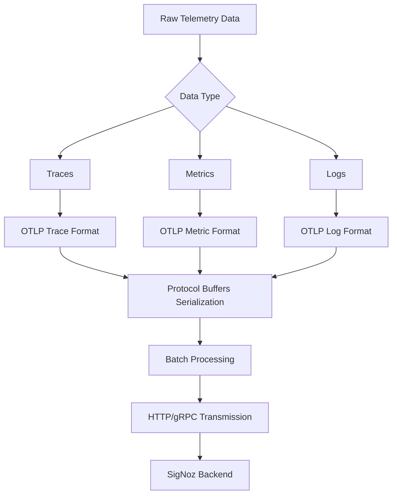
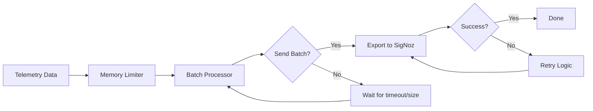

# SigNoz Exporter Configuration

<cite>
**Referenced Files in This Document**   
- [otel-collector-config-signoz.yaml](file://otel/otel-collector-config-signoz.yaml)
- [tracing.py](file://letta/otel/tracing.py)
- [metrics.py](file://letta/otel/metrics.py)
- [settings.py](file://letta/settings.py)
- [start-otel-collector.sh](file://otel/start-otel-collector.sh)
</cite>

## Table of Contents
1. [Introduction](#introduction)
2. [OTLP Endpoint Configuration](#otlp-endpoint-configuration)
3. [Headers and Authentication](#headers-and-authentication)
4. [Data Transmission Format](#data-transmission-format)
5. [Batch Processing and Retry Logic](#batch-processing-and-retry-logic)
6. [Security Considerations](#security-considerations)
7. [Troubleshooting Guide](#troubleshooting-guide)
8. [Integration with Observability Workflow](#integration-with-observability-workflow)

## Introduction
The SigNoz Exporter Configuration in Letta's monitoring ecosystem enables comprehensive observability by forwarding telemetry data to a SigNoz backend. This documentation provides detailed guidance on configuring the OpenTelemetry (OTLP) endpoint settings, headers, and authentication mechanisms required to transmit traces, metrics, and logs. The system leverages OpenTelemetry standards to collect and export telemetry data, with specific configuration for SigNoz ingestion. The exporter is designed to integrate seamlessly with Letta's agent architecture, capturing critical performance metrics, error tracking, and distributed tracing information for monitoring AI agent behavior and system health.

**Section sources**
- [otel-collector-config-signoz.yaml](file://otel/otel-collector-config-signoz.yaml#L1-L48)
- [tracing.py](file://letta/otel/tracing.py#L1-L446)
- [metrics.py](file://letta/otel/metrics.py#L1-L140)

## OTLP Endpoint Configuration
The OTLP endpoint configuration for SigNoz integration is defined in the OpenTelemetry Collector configuration file. The collector receives telemetry data via both gRPC and HTTP protocols on specific endpoints and forwards it to the SigNoz backend. The configuration specifies separate endpoints for gRPC and HTTP communication, allowing flexibility in data transmission methods. The gRPC endpoint operates on port 4317, while the HTTP endpoint uses port 4318, both bound to all network interfaces (0.0.0.0). These endpoints serve as the ingestion points for telemetry data from the Letta application before it is exported to SigNoz. The actual SigNoz backend endpoint is specified as an environment variable (${SIGNOZ_ENDPOINT}), enabling dynamic configuration without modifying the collector configuration file. This setup allows the collector to act as an intermediary, receiving data from multiple sources and forwarding it to the centralized SigNoz observability platform.

```mermaid
graph TB
subgraph "Letta Application"
A[Telemetry Data]
end
subgraph "OpenTelemetry Collector"
B[OTLP Receiver]
C[gRPC: 0.0.0.0:4317]
D[HTTP: 0.0.0.0:4318]
E[Batch Processor]
F[Memory Limiter]
end
subgraph "SigNoz Backend"
G[OTLP Exporter]
H[Endpoint: ${SIGNOZ_ENDPOINT}]
end
A --> B
C --> B
D --> B
B --> E
E --> F
F --> G
G --> H
```

**Diagram sources**
- [otel-collector-config-signoz.yaml](file://otel/otel-collector-config-signoz.yaml#L1-L8)
- [otel-collector-config-signoz.yaml](file://otel/otel-collector-config-signoz.yaml#L19-L20)

**Section sources**
- [otel-collector-config-signoz.yaml](file://otel/otel-collector-config-signoz.yaml#L1-L8)
- [otel-collector-config-signoz.yaml](file://otel/otel-collector-config-signoz.yaml#L19-L20)

## Headers and Authentication
The SigNoz exporter configuration requires specific headers for authentication and data routing. The primary authentication mechanism uses the "signoz-ingestion-key" header, which contains the ingestion key required for SigNoz to accept and process incoming telemetry data. This header value is also configured as an environment variable (${SIGNOZ_INGESTION_KEY}), allowing secure management of credentials without hardcoding them in configuration files. The OpenTelemetry Collector automatically attaches this header to all outgoing requests to the SigNoz backend. This authentication approach ensures that only authorized systems can send data to the SigNoz instance, protecting the observability platform from unauthorized access. The header-based authentication is consistent with SigNoz's security model and integrates seamlessly with Letta's existing telemetry infrastructure.



**Diagram sources**
- [otel-collector-config-signoz.yaml](file://otel/otel-collector-config-signoz.yaml#L21-L23)

**Section sources**
- [otel-collector-config-signoz.yaml](file://otel/otel-collector-config-signoz.yaml#L21-L23)

## Data Transmission Format
The SigNoz exporter transmits telemetry data in the OpenTelemetry Protocol (OTLP) format, which supports structured transmission of traces, metrics, and logs. Traces are formatted as distributed traces with spans that represent individual operations within the Letta system, including HTTP requests, database operations, and agent processing steps. Each span contains metadata such as operation name, start and end times, attributes, and events. Metrics are transmitted as time-series data with counters and histograms that track system performance, including endpoint latency and request counts. The data is serialized in Protocol Buffers format for efficient transmission. The collector processes all three telemetry signals (traces, metrics, and logs) through separate but parallel pipelines, ensuring that each type of data is handled appropriately before export to SigNoz. This standardized format enables SigNoz to correlate different telemetry types for comprehensive observability.



**Diagram sources**
- [otel-collector-config-signoz.yaml](file://otel/otel-collector-config-signoz.yaml#L37-L48)
- [tracing.py](file://letta/otel/tracing.py#L1-L446)
- [metrics.py](file://letta/otel/metrics.py#L1-L140)

**Section sources**
- [otel-collector-config-signoz.yaml](file://otel/otel-collector-config-signoz.yaml#L37-L48)
- [tracing.py](file://letta/otel/tracing.py#L1-L446)
- [metrics.py](file://letta/otel/metrics.py#L1-L140)

## Batch Processing and Retry Logic
The SigNoz exporter implements robust batch processing and retry logic to ensure reliable telemetry data transmission. The OpenTelemetry Collector uses a batch processor that aggregates telemetry data before sending it to SigNoz, reducing the number of network requests and improving efficiency. The batch processor is configured with a timeout of 10 seconds and a send batch size of 8,192 items, balancing latency and throughput. If a batch fails to send, the collector automatically retries the transmission according to the underlying OTLP exporter's retry policy. The collector also includes a memory limiter processor that monitors memory usage and prevents out-of-memory conditions during high-volume telemetry collection. This processing pipeline ensures that telemetry data is reliably delivered to SigNoz even under varying network conditions or temporary backend unavailability.



**Diagram sources**
- [otel-collector-config-signoz.yaml](file://otel/otel-collector-config-signoz.yaml#L14-L17)
- [metrics.py](file://letta/otel/metrics.py#L115-L122)
- [tracing.py](file://letta/otel/tracing.py#L139)

**Section sources**
- [otel-collector-config-signoz.yaml](file://otel/otel-collector-config-signoz.yaml#L14-L17)
- [metrics.py](file://letta/otel/metrics.py#L115-L122)
- [tracing.py](file://letta/otel/tracing.py#L139)

## Security Considerations
The SigNoz exporter configuration incorporates several security measures to protect telemetry data in transit and ensure authorized access. The primary security mechanism is the ingestion key authentication via the "signoz-ingestion-key" header, which acts as a shared secret between the OpenTelemetry Collector and the SigNoz backend. This key should be managed as a sensitive credential and injected via environment variables rather than hardcoded in configuration files. The configuration supports TLS/SSL encryption for data transmission, as the OTLP exporter uses HTTPS by default when communicating with the SigNoz endpoint. Additionally, the collector can be configured to validate TLS certificates to prevent man-in-the-middle attacks. The use of environment variables for sensitive data (${SIGNOZ_ENDPOINT} and ${SIGNOZ_INGESTION_KEY}) follows security best practices by separating configuration from code and enabling secure credential management in production environments.

**Section sources**
- [otel-collector-config-signoz.yaml](file://otel/otel-collector-config-signoz.yaml#L20-L23)
- [settings.py](file://letta/settings.py#L277-L288)

## Troubleshooting Guide
When experiencing connectivity issues or data discrepancies in the SigNoz dashboard, several troubleshooting steps can be taken. First, verify that the environment variables SIGNOZ_ENDPOINT and SIGNOZ_INGESTION_KEY are correctly set and accessible to the OpenTelemetry Collector. Check the collector logs for any connection errors or authentication failures. If data is not appearing in SigNoz, confirm that the collector is running and receiving data on ports 4317 (gRPC) and 4318 (HTTP). Network connectivity between the collector and the SigNoz backend should be verified, including firewall rules and DNS resolution. For data discrepancies, ensure that the batch processing configuration (timeout and batch size) is appropriate for the volume of telemetry data being generated. Monitoring the collector's memory usage can help identify if the memory limiter is causing data to be dropped. Finally, verify that the ingestion key has sufficient permissions in the SigNoz platform to write telemetry data.

**Section sources**
- [otel-collector-config-signoz.yaml](file://otel/otel-collector-config-signoz.yaml#L1-L48)
- [start-otel-collector.sh](file://otel/start-otel-collector.sh#L132-L145)

## Integration with Observability Workflow
The SigNoz exporter integrates with Letta's broader observability workflow by providing a centralized platform for monitoring AI agent performance and system health. When compared to other exporters, SigNoz offers advantages in distributed tracing visualization, metrics correlation, and log management within a single interface. The exporter should be used when comprehensive observability is required, particularly for debugging complex agent interactions, identifying performance bottlenecks, and monitoring system reliability. The collected telemetry data can be correlated with business metrics and used to optimize agent behavior and system configuration. This integration enables DevOps teams to maintain visibility into the AI agent ecosystem, quickly identify and resolve issues, and ensure optimal performance of the Letta platform.

**Section sources**
- [tracing.py](file://letta/otel/tracing.py#L1-L446)
- [metrics.py](file://letta/otel/metrics.py#L1-L140)
- [settings.py](file://letta/settings.py#L277-L288)