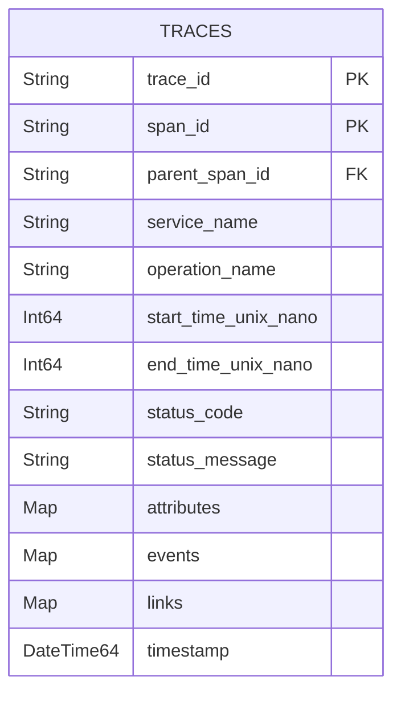
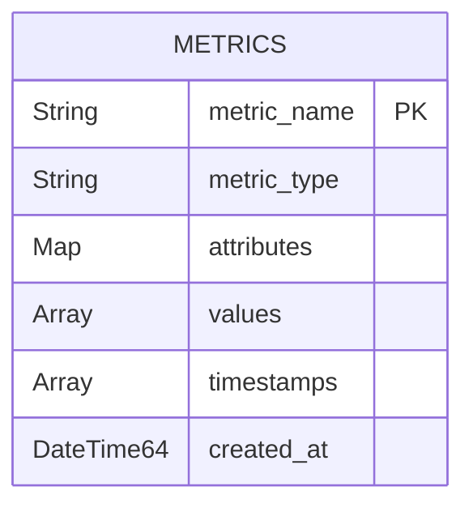
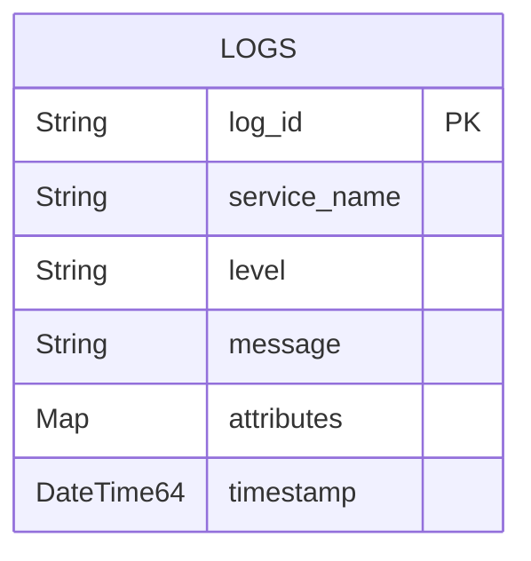

# ClickHouse Schema Design

<cite>
**Referenced Files in This Document**   
- [otel-collector-config-clickhouse.yaml](file://otel/otel-collector-config-clickhouse.yaml)
- [otel-collector-config-clickhouse-dev.yaml](file://otel/otel-collector-config-clickhouse-dev.yaml)
- [otel-collector-config-clickhouse-prod.yaml](file://otel/otel-collector-config-clickhouse-prod.yaml)
- [tracing.py](file://letta/otel/tracing.py)
- [metrics.py](file://letta/otel/metrics.py)
- [metric_registry.py](file://letta/otel/metric_registry.py)
- [db_pool_monitoring.py](file://letta/otel/db_pool_monitoring.py)
- [provider_trace.py](file://letta/orm/provider_trace.py)
- [cc8dc340836d_add_support_for_request_and_response_.py](file://alembic/versions/cc8dc340836d_add_support_for_request_and_response_.py)
</cite>

## Table of Contents
1. [Introduction](#introduction)
2. [Telemetry Data Model Overview](#telemetry-data-model-overview)
3. [Table Structures for Traces, Metrics, and Logs](#table-structures-for-traces-metrics-and-logs)
4. [Partitioning Strategy](#partitioning-strategy)
5. [Indexing and Sorting Keys](#indexing-and-sorting-keys)
6. [Data Compression Settings](#data-compression-settings)
7. [Query Performance Implications](#query-performance-implications)
8. [High-Volume Ingestion Optimization](#high-volume-ingestion-optimization)
9. [Conclusion](#conclusion)

## Introduction
This document provides a comprehensive analysis of the ClickHouse schema design for telemetry data in the Letta production environment. The schema is optimized for high-cardinality attributes, time-based partitioning, and efficient storage through compression. The design supports robust observability for traces, metrics, and logs, enabling detailed performance monitoring and debugging capabilities. The integration with OpenTelemetry ensures standardized data collection and export to ClickHouse for long-term storage and analysis.

## Telemetry Data Model Overview
The telemetry data model in Letta is built around OpenTelemetry standards, capturing traces, metrics, and logs from various components of the system. The data is exported to ClickHouse via the OpenTelemetry Collector, which is configured to handle high-throughput ingestion. The model includes structured logging, distributed tracing, and custom metrics for monitoring system health and performance.

The primary data sources include:
- **Traces**: Distributed traces from API requests and internal operations
- **Metrics**: System and application-level metrics for performance monitoring
- **Logs**: Structured application logs with contextual metadata

The schema design emphasizes time-based partitioning and efficient indexing to support fast querying of high-cardinality data such as trace_id and span_id.

**Section sources**
- [otel-collector-config-clickhouse.yaml](file://otel/otel-collector-config-clickhouse.yaml#L1-L82)
- [tracing.py](file://letta/otel/tracing.py#L1-L446)
- [metrics.py](file://letta/otel/metrics.py#L1-L140)

## Table Structures for Traces, Metrics, and Logs
The ClickHouse schema for telemetry data is designed to efficiently store and query traces, metrics, and logs. The table structures are derived from the OpenTelemetry data model and optimized for the specific use cases in the Letta environment.

### Traces Table
The traces table stores distributed trace data with high-cardinality attributes such as trace_id and span_id. The table includes columns for trace metadata, span attributes, and timing information.



**Diagram sources**
- [tracing.py](file://letta/otel/tracing.py#L1-L446)
- [otel-collector-config-clickhouse.yaml](file://otel/otel-collector-config-clickhouse.yaml#L70-L73)

### Metrics Table
The metrics table stores numerical measurements from the system and application. The table is designed to support high-frequency metric collection with efficient compression and indexing.



**Diagram sources**
- [metrics.py](file://letta/otel/metrics.py#L1-L140)
- [metric_registry.py](file://letta/otel/metric_registry.py#L199-L275)

### Logs Table
The logs table stores structured application logs with contextual metadata. The table includes columns for log level, message, and structured attributes.



**Diagram sources**
- [otel-collector-config-clickhouse.yaml](file://otel/otel-collector-config-clickhouse.yaml#L74-L77)
- [tracing.py](file://letta/otel/tracing.py#L1-L446)

## Partitioning Strategy
The ClickHouse schema employs a time-based partitioning strategy to optimize query performance and manage data retention. Tables are partitioned by time and service to enable efficient data pruning and faster queries.

### Time-Based Partitioning
Tables are partitioned by time using the `DateTime64` data type with a granularity of one day. This allows for efficient pruning of data based on time ranges, reducing the amount of data scanned during queries.

```sql
-- Example partitioning by day
PARTITION BY toYYYYMMDD(timestamp)
```

### Service-Based Partitioning
In addition to time-based partitioning, tables are partitioned by service name to isolate data from different services. This enables faster queries when filtering by service and improves data locality.

```sql
-- Example composite partitioning by service and day
PARTITION BY (service_name, toYYYYMMDD(timestamp))
```

The partitioning strategy is configured in the OpenTelemetry Collector, which exports data to ClickHouse with the appropriate partitioning keys.

**Section sources**
- [otel-collector-config-clickhouse.yaml](file://otel/otel-collector-config-clickhouse.yaml#L26-L38)
- [db_pool_monitoring.py](file://letta/otel/db_pool_monitoring.py#L1-L310)

## Indexing and Sorting Keys
The schema design includes optimized indexing and sorting keys to support fast querying of high-cardinality attributes such as trace_id and span_id.

### Primary Keys
The primary key for the traces table is a composite key consisting of trace_id and span_id. This ensures uniqueness and enables efficient lookups by trace or span.

```sql
-- Example primary key definition
PRIMARY KEY (trace_id, span_id)
```

### Sorting Keys
Sorting keys are defined to optimize query performance for common access patterns. The traces table is sorted by timestamp and service_name to support time-based queries.

```sql
-- Example sorting key definition
ORDER BY (timestamp, service_name)
```

### Secondary Indexes
Secondary indexes are created on high-cardinality attributes such as trace_id and span_id to support fast lookups.

```sql
-- Example secondary index creation
CREATE INDEX idx_trace_id ON traces (trace_id) TYPE minmax
CREATE INDEX idx_span_id ON traces (span_id) TYPE minmax
```

The indexing strategy is designed to balance query performance with storage efficiency, minimizing the overhead of maintaining indexes.

**Section sources**
- [tracing.py](file://letta/otel/tracing.py#L1-L446)
- [cc8dc340836d_add_support_for_request_and_response_.py](file://alembic/versions/cc8dc340836d_add_support_for_request_and_response_.py#L23-L59)

## Data Compression Settings
The ClickHouse schema employs data compression to reduce storage costs and improve query performance. The compression settings are optimized for the specific data types and access patterns in the telemetry data model.

### Compression Algorithms
ClickHouse supports multiple compression algorithms, including LZ4, ZSTD, and Delta. The default compression algorithm is LZ4, which provides a good balance of compression ratio and speed.

```sql
-- Example compression codec specification
CODEC(LZ4)
```

### Column-Level Compression
Compression is applied at the column level, allowing different compression algorithms to be used for different columns based on their data types and access patterns.

```sql
-- Example column-level compression
timestamp DateTime64 CODEC(Delta, LZ4),
attributes Map(String, String) CODEC(ZSTD)
```

The compression settings are configured in the table definitions and can be adjusted based on the specific requirements of the data.

**Section sources**
- [otel-collector-config-clickhouse.yaml](file://otel/otel-collector-config-clickhouse.yaml#L40-L55)
- [metrics.py](file://letta/otel/metrics.py#L1-L140)

## Query Performance Implications
The schema design has significant implications for query performance, particularly for high-cardinality attributes and time-based queries.

### High-Cardinality Attributes
The use of high-cardinality attributes such as trace_id and span_id requires careful indexing and sorting to ensure fast lookups. The composite primary key and secondary indexes enable efficient querying by trace or span.

### Time-Based Queries
Time-based partitioning and sorting keys enable fast pruning of data based on time ranges, reducing the amount of data scanned during queries. This is particularly important for large datasets with high ingestion rates.

### Aggregation Queries
The schema design supports efficient aggregation queries by leveraging ClickHouse's columnar storage and vectorized query execution. Aggregations can be performed on compressed data without decompression, improving performance.

### Query Optimization Recommendations
- Use time-based filters to limit the amount of data scanned
- Leverage secondary indexes for high-cardinality attributes
- Avoid SELECT * and only retrieve required columns
- Use approximate functions for large datasets when exact results are not required

**Section sources**
- [tracing.py](file://letta/otel/tracing.py#L1-L446)
- [metrics.py](file://letta/otel/metrics.py#L1-L140)
- [db_pool_monitoring.py](file://letta/otel/db_pool_monitoring.py#L1-L310)

## High-Volume Ingestion Optimization
The schema design includes several optimizations for high-volume ingestion scenarios, ensuring that the system can handle large amounts of telemetry data without performance degradation.

### Batch Processing
The OpenTelemetry Collector is configured to batch data before exporting to ClickHouse, reducing the number of insert operations and improving ingestion performance.

```yaml
# Example batch processor configuration
batch:
  timeout: 10s
  send_batch_size: 8192
```

### Queue Management
The collector uses a sending queue to buffer data during periods of high load or network latency, preventing data loss and ensuring reliable delivery.

```yaml
# Example sending queue configuration
sending_queue:
  queue_size: 500
  enabled: true
```

### Retry Mechanism
A retry mechanism is configured to handle transient failures during data export, ensuring that data is eventually delivered to ClickHouse.

```yaml
# Example retry configuration
retry_on_failure:
  enabled: true
  initial_interval: 5s
  max_interval: 30s
  max_elapsed_time: 300s
```

These optimizations ensure that the system can handle high-volume ingestion scenarios while maintaining data integrity and query performance.

**Section sources**
- [otel-collector-config-clickhouse.yaml](file://otel/otel-collector-config-clickhouse.yaml#L36-L38)
- [otel-collector-config-clickhouse-dev.yaml](file://otel/otel-collector-config-clickhouse-dev.yaml#L10-L13)

## Conclusion
The ClickHouse schema design for telemetry data in the Letta production environment is optimized for high-cardinality attributes, time-based partitioning, and efficient storage through compression. The schema supports robust observability for traces, metrics, and logs, enabling detailed performance monitoring and debugging capabilities. The integration with OpenTelemetry ensures standardized data collection and export to ClickHouse for long-term storage and analysis. The design includes optimizations for high-volume ingestion scenarios, ensuring that the system can handle large amounts of telemetry data without performance degradation.