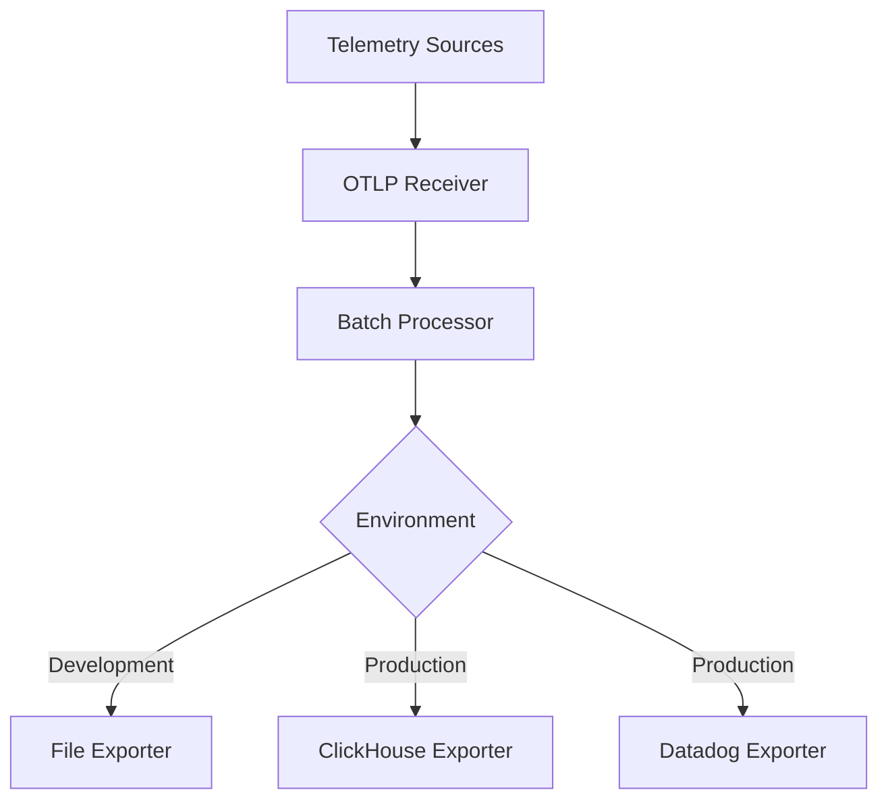
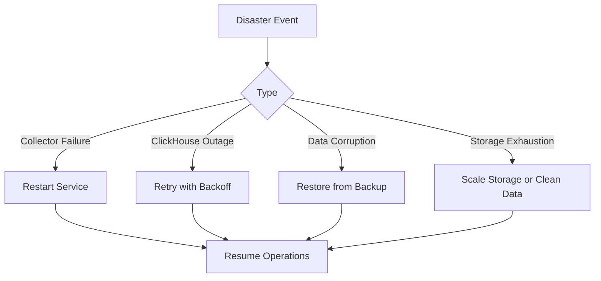
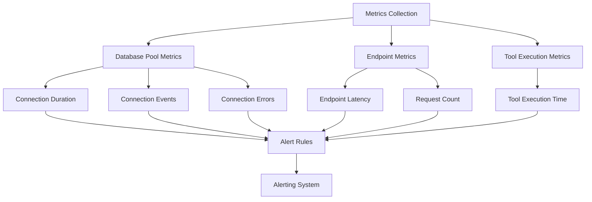
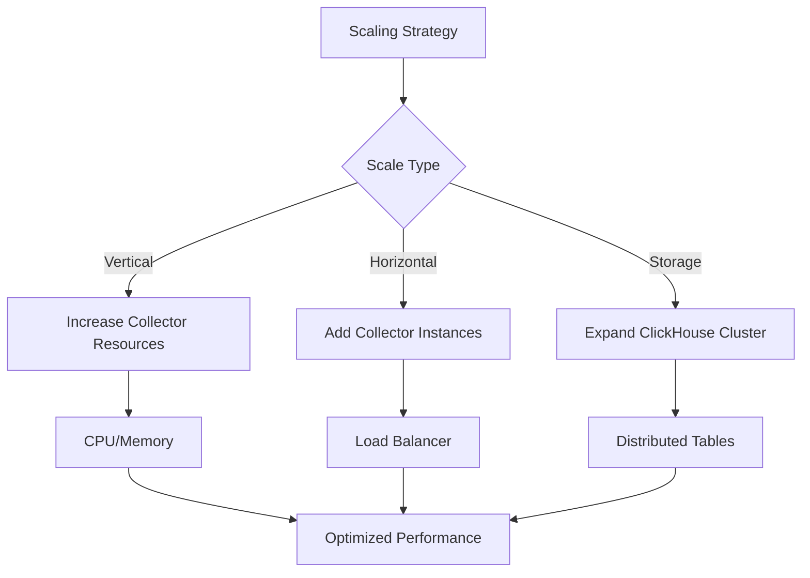

# Data Retention Policies and Operations

<cite>
**Referenced Files in This Document**   
- [otel-collector-config-clickhouse-dev.yaml](file://otel/otel-collector-config-clickhouse-dev.yaml)
- [otel-collector-config-clickhouse-prod.yaml](file://otel/otel-collector-config-clickhouse-prod.yaml)
- [otel-collector-config-file-dev.yaml](file://otel/otel-collector-config-file-dev.yaml)
- [otel-collector-config-file.yaml](file://otel/otel-collector-config-file.yaml)
- [start-otel-collector.sh](file://otel/start-otel-collector.sh)
- [settings.py](file://letta/settings.py)
- [metrics.py](file://letta/otel/metrics.py)
- [metric_registry.py](file://letta/otel/metric_registry.py)
- [db_pool_monitoring.py](file://letta/otel/db_pool_monitoring.py)
</cite>

## Table of Contents
1. [Introduction](#introduction)
2. [Retention Policies by Environment](#retention-policies-by-environment)
3. [OTEL Collector Storage Configuration](#otel-collector-storage-configuration)
4. [ClickHouse TTL Configuration](#clickhouse-ttl-configuration)
5. [Data Archival and Backup Strategies](#data-archival-and-backup-strategies)
6. [Monitoring and Alerting](#monitoring-and-alerting)
7. [Operational Procedures](#operational-procedures)
8. [Cost-Effective Scaling](#cost-effective-scaling)
9. [Configuration Examples](#configuration-examples)
10. [Conclusion](#conclusion)

## Introduction
This document outlines the data retention policies and operational procedures for telemetry data within the Letta platform. The system employs different retention strategies for development and production environments, utilizing both file-based storage for development and ClickHouse for production deployments. The OpenTelemetry (OTEL) collector serves as the central component for data ingestion, processing, and export, with configurable retention periods and rotation policies. This documentation covers the complete lifecycle management of telemetry data, from ingestion through retention, archival, and eventual expiration.

## Retention Policies by Environment

The Letta platform implements distinct data retention policies for development and production environments, reflecting the different requirements for data persistence, performance, and storage costs in each environment.

### Development Environment (File-Based)
In development environments, telemetry data is stored in JSON files with rotation-based retention policies. The file-based retention is configured with the following parameters:

- **Maximum file size**: 100MB before rotation
- **Retention period**: 7 days
- **Backup count**: 5 rotated files maintained

This configuration balances the need for accessible debugging data with reasonable disk space usage during development. The rotation mechanism ensures that no single file grows too large while maintaining a week's worth of historical data for troubleshooting and analysis.

### Production Environment (ClickHouse)
Production environments utilize ClickHouse as the primary telemetry storage backend, enabling more sophisticated data management capabilities. The retention strategy in production focuses on:

- **Long-term storage**: Extended retention periods based on data value and compliance requirements
- **Automatic expiration**: Time-to-Live (TTL) rules for automatic data cleanup
- **Hierarchical storage**: Potential tiering between hot (frequently accessed) and cold (archival) storage
- **Scalable architecture**: Distributed storage capable of handling high-volume telemetry data

The production configuration also integrates with Datadog for enhanced monitoring and visualization, providing comprehensive observability across the telemetry pipeline.

**Section sources**
- [otel-collector-config-clickhouse-dev.yaml](file://otel/otel-collector-config-clickhouse-dev.yaml#L14-L26)
- [otel-collector-config-file-dev.yaml](file://otel/otel-collector-config-file-dev.yaml#L14-L21)
- [otel-collector-config-clickhouse-prod.yaml](file://otel/otel-collector-config-clickhouse-prod.yaml#L41-L55)

## OTEL Collector Storage Configuration

The OTEL collector's storage configuration controls data persistence and rotation through a combination of receivers, processors, and exporters. This configuration determines how telemetry data is ingested, processed, and ultimately stored or forwarded to downstream systems.

### Data Ingestion Pipeline
The collector exposes OTLP (OpenTelemetry Protocol) endpoints for data ingestion via both gRPC and HTTP protocols. The configuration establishes listeners on ports 4317 (gRPC) and 4318 (HTTP), allowing flexible integration with various telemetry sources.



**Diagram sources**
- [otel-collector-config-clickhouse-dev.yaml](file://otel/otel-collector-config-clickhouse-dev.yaml#L1-L8)
- [otel-collector-config-clickhouse-prod.yaml](file://otel/otel-collector-config-clickhouse-prod.yaml#L1-L7)

### Processing and Export
The batch processor plays a critical role in data persistence by aggregating telemetry data before export. Key processing parameters include:

- **Batch timeout**: 1 second in development, 10 seconds in production
- **Send batch size**: 1,024 records in development, 8,192 records in production

These settings optimize the trade-off between data latency and export efficiency. Smaller batches in development ensure timely visibility of telemetry data, while larger batches in production improve throughput and reduce the overhead of frequent export operations.

The memory limiter processor in production environments protects against out-of-memory conditions by limiting memory usage to 1,024 MiB with a spike limit of 256 MiB, ensuring stable collector operation under varying load conditions.

**Section sources**
- [otel-collector-config-clickhouse-dev.yaml](file://otel/otel-collector-config-clickhouse-dev.yaml#L9-L13)
- [otel-collector-config-clickhouse-prod.yaml](file://otel/otel-collector-config-clickhouse-prod.yaml#L26-L39)
- [otel-collector-config-clickhouse-dev.yaml](file://otel/otel-collector-config-clickhouse-dev.yaml#L40-L53)

## ClickHouse TTL Configuration

ClickHouse provides native TTL (Time-to-Live) functionality for automatic data expiration, which is leveraged in the production telemetry configuration. While the specific TTL rules are not explicitly defined in the provided configuration files, the integration with ClickHouse enables several data lifecycle management capabilities.

### Automatic Data Expiration
The ClickHouse exporter configuration establishes the connection parameters for telemetry data export, including:

- **Endpoint**: Configured via CLICKHOUSE_ENDPOINT environment variable
- **Database**: Specified by CLICKHOUSE_DATABASE environment variable
- **Authentication**: Username and password provided via environment variables
- **Timeout**: 5 seconds for export operations

These settings enable reliable data transfer from the OTEL collector to ClickHouse, where TTL policies can be applied at the table or partition level to automatically remove expired data.

### Data Partitioning and Optimization
ClickHouse's columnar storage architecture and partitioning capabilities allow for efficient data management:

- **Time-based partitioning**: Data can be partitioned by time intervals (hourly, daily) to optimize queries and TTL operations
- **Merge tree engines**: Enable automatic compaction and deletion of expired data
- **Materialized views**: Support for derived metrics and aggregated data with independent retention policies

The retry configuration (initial interval: 5s, max interval: 30s, max elapsed time: 300s) ensures reliable data delivery even during temporary connectivity issues or ClickHouse maintenance operations.

**Section sources**
- [otel-collector-config-clickhouse-dev.yaml](file://otel/otel-collector-config-clickhouse-dev.yaml#L27-L39)
- [otel-collector-config-clickhouse-prod.yaml](file://otel/otel-collector-config-clickhouse-prod.yaml#L42-L54)

## Data Archival and Backup Strategies

The telemetry system implements comprehensive data archival and backup strategies to ensure data durability and support disaster recovery scenarios.

### Native ClickHouse Backup Tools
ClickHouse provides several native tools for data backup and restoration:

- **clickhouse-backup**: A popular open-source tool for managing ClickHouse backups
- **ALTER TABLE ... MOVE PARTITION**: Allows moving data between storage tiers or instances
- **Distributed tables**: Enable data replication across multiple nodes for high availability

While specific backup configurations are not detailed in the provided files, the production environment's integration with ClickHouse enables robust backup capabilities that can be configured according to organizational requirements.

### Disaster Recovery Scenarios
The system architecture supports multiple disaster recovery scenarios:

- **Collector failure**: The OTEL collector can be restarted with minimal data loss due to the batch processor's in-memory buffering
- **ClickHouse outage**: The retry mechanism with exponential backoff (5s to 30s) protects against temporary outages
- **Data corruption**: Regular backups allow restoration to known good states
- **Storage exhaustion**: The sending queue with a size of 100 provides buffer capacity during high load or export delays

The health check extension in the production configuration enables monitoring of the collector's operational status, facilitating rapid detection and response to potential issues.



**Diagram sources**
- [otel-collector-config-clickhouse-prod.yaml](file://otel/otel-collector-config-clickhouse-prod.yaml#L66-L70)
- [otel-collector-config-clickhouse-prod.yaml](file://otel/otel-collector-config-clickhouse-prod.yaml#L50-L54)

## Monitoring and Alerting

The system includes comprehensive monitoring capabilities to track storage growth and trigger alerts for capacity thresholds.

### Storage Growth Monitoring
Database connection pool metrics are collected to monitor resource utilization:

- **Connection duration**: Histogram tracking database connection usage in milliseconds
- **Connection events**: Counter for pool events (connect, checkout, checkin, invalidate)
- **Connection errors**: Counter for pool errors, categorized by exception type
- **Pool statistics**: Gauges for total, checked-out, available, and overflow connections

These metrics provide visibility into database resource utilization, helping to identify potential bottlenecks or configuration issues that could impact storage performance.

### Alert Configuration
The configuration supports setting up alerts for various capacity thresholds:

- **Memory pressure**: The system can detect when memory usage approaches limits
- **Connection pool saturation**: Alerts can be configured when the percentage of checked-out connections exceeds thresholds
- **Export queue depth**: Monitoring the sending queue size can indicate export performance issues
- **Disk space utilization**: File rotation parameters indirectly support disk space monitoring

The metric registry defines various histogram and counter instruments that can be used to establish alerting rules based on statistical distributions and rate of change.



**Diagram sources**
- [metric_registry.py](file://letta/otel/metric_registry.py#L185-L275)
- [db_pool_monitoring.py](file://letta/otel/db_pool_monitoring.py#L16-L310)

## Operational Procedures

Standard operational procedures ensure consistent management of telemetry data throughout its lifecycle.

### Data Lifecycle Management
Regular maintenance tasks include:

- **Log rotation**: Automatic rotation of file-based logs based on size and age
- **Data validation**: Verification of data integrity during export operations
- **Performance tuning**: Adjustment of batch sizes and timeouts based on observed load patterns
- **Capacity planning**: Analysis of storage growth trends to plan for future needs

The start-otel-collector.sh script automates the deployment and configuration of the OTEL collector, ensuring consistent setup across environments.

### Configuration Management
The system uses environment variables extensively for configuration, enabling:

- **Environment-specific settings**: Different configurations for development, staging, and production
- **Secure credential management**: Sensitive information (passwords, API keys) passed via environment variables
- **Dynamic reconfiguration**: Ability to modify settings without code changes

The script also handles version management of the OTEL collector binary, automatically downloading and updating to the specified version (0.96.0).

**Section sources**
- [start-otel-collector.sh](file://otel/start-otel-collector.sh#L1-L146)
- [settings.py](file://letta/settings.py#L277-L288)

## Cost-Effective Scaling

The telemetry infrastructure is designed for cost-effective scaling to accommodate growing data volumes.

### Horizontal Scaling
The architecture supports horizontal scaling through:

- **Distributed collectors**: Multiple collector instances can be deployed to handle increased load
- **ClickHouse clustering**: Native support for distributed tables and cluster configurations
- **Load balancing**: OTLP receivers can be placed behind load balancers to distribute incoming traffic

### Resource Optimization
Several configuration parameters optimize resource usage:

- **Batch processing**: Reduces the number of export operations and improves network efficiency
- **Memory limiting**: Prevents uncontrolled memory growth during peak loads
- **Connection pooling**: Efficient reuse of database connections to minimize overhead

The production configuration's longer batch timeout (10s vs 1s in development) reflects a tuning for throughput over latency, which is appropriate for production environments where data freshness requirements may be less stringent than in development.



**Diagram sources**
- [otel-collector-config-clickhouse-prod.yaml](file://otel/otel-collector-config-clickhouse-prod.yaml#L36-L38)
- [otel-collector-config-clickhouse-dev.yaml](file://otel/otel-collector-config-clickhouse-dev.yaml#L10-L12)

## Configuration Examples

The following examples illustrate retention policy configurations for both file-based and ClickHouse setups.

### File-Based Configuration (Development)
```yaml
exporters:
  file/traces:
    path: ${HOME}/.letta/logs/traces.json
    rotation:
      max_megabytes: 100
      max_days: 7
      max_backups: 5
  file/metrics:
    path: ${HOME}/.letta/logs/metrics.json
    rotation:
      max_megabytes: 100
      max_days: 7
      max_backups: 5
```

This configuration retains telemetry data for 7 days with daily rotation and up to 5 backup files, suitable for development and testing environments.

### ClickHouse Configuration (Production)
```yaml
exporters:
  clickhouse:
    endpoint: ${CLICKHOUSE_ENDPOINT}
    database: ${CLICKHOUSE_DATABASE}
    username: ${CLICKHOUSE_USERNAME}
    password: ${CLICKHOUSE_PASSWORD}
    timeout: 5s
    sending_queue:
      queue_size: 100
    retry_on_failure:
      enabled: true
      initial_interval: 5s
      max_interval: 30s
      max_elapsed_time: 300s
```

This production configuration establishes a reliable connection to ClickHouse with robust retry logic and queuing to handle temporary outages or performance issues.

### Collector Startup Script
The start-otel-collector.sh script demonstrates the operational logic for deploying the collector:

```bash
if [ -n "$CLICKHOUSE_ENDPOINT" ] && [ -n "$CLICKHOUSE_PASSWORD" ]; then
    echo "Starting OpenTelemetry Collector with Clickhouse export..."
    CONFIG_FILE="otel/otel-collector-config-clickhouse-dev.yaml"
else
    echo "Starting OpenTelemetry Collector with file export only..."
    CONFIG_FILE="otel/otel-collector-config-file-dev.yaml"
fi
```

This conditional logic automatically selects the appropriate configuration based on available environment variables, simplifying deployment across different environments.

**Section sources**
- [otel-collector-config-clickhouse-dev.yaml](file://otel/otel-collector-config-clickhouse-dev.yaml#L14-L26)
- [otel-collector-config-clickhouse-prod.yaml](file://otel/otel-collector-config-clickhouse-prod.yaml#L41-L55)
- [start-otel-collector.sh](file://otel/start-otel-collector.sh#L132-L139)

## Conclusion
The Letta platform's data retention policies and operations provide a comprehensive framework for managing telemetry data throughout its lifecycle. By implementing different strategies for development and production environments, the system balances the need for accessible debugging information with the requirements for scalable, reliable production monitoring. The integration of the OTEL collector with both file-based storage and ClickHouse enables flexible data management, while the comprehensive monitoring and alerting capabilities ensure operational visibility. The configuration examples and operational procedures outlined in this document provide a foundation for effective telemetry infrastructure management, supporting both current needs and future scaling requirements.