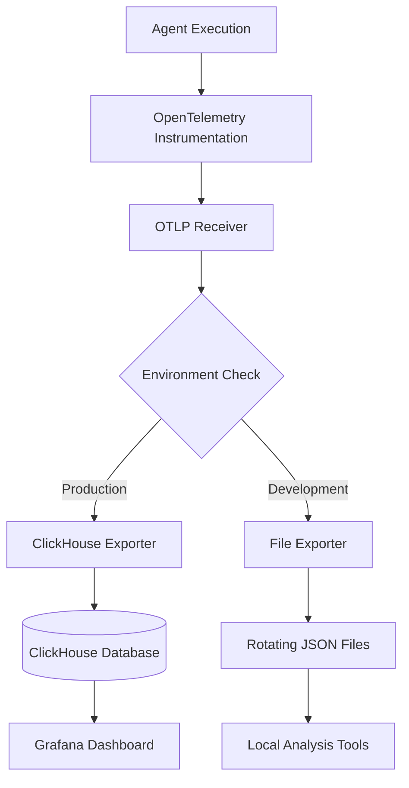
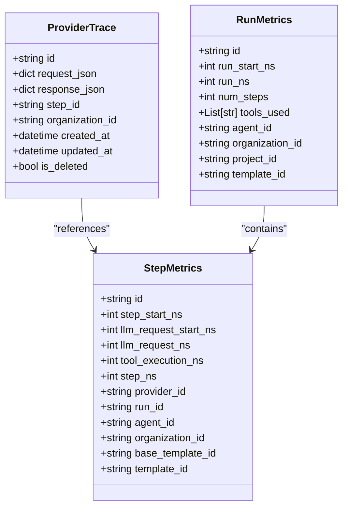
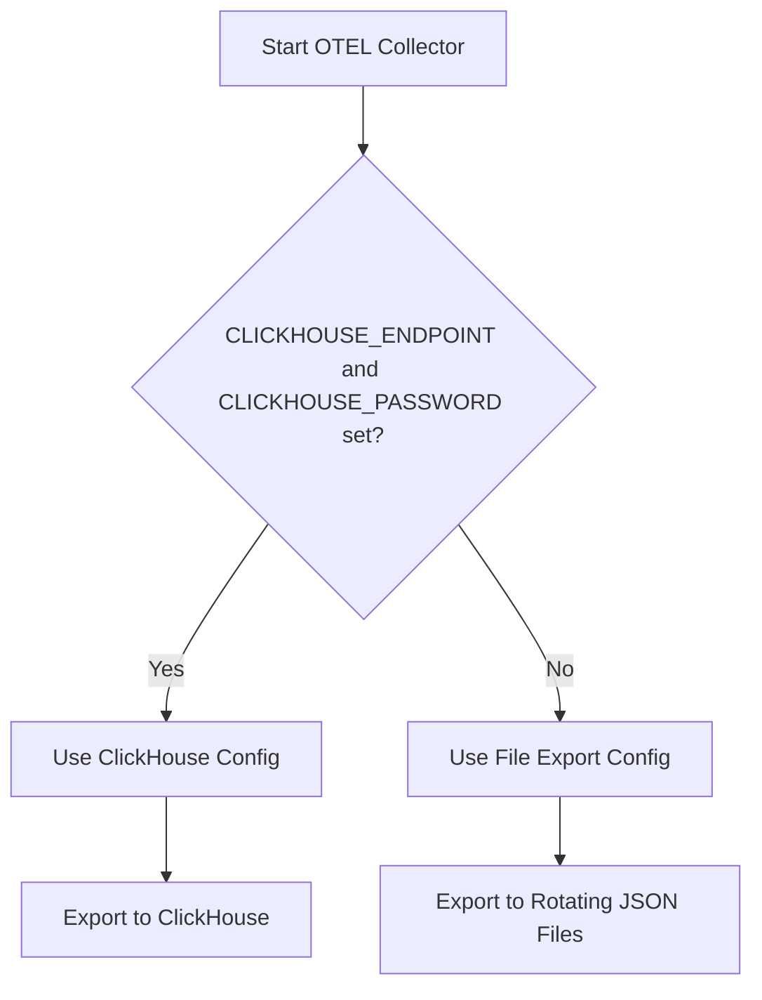
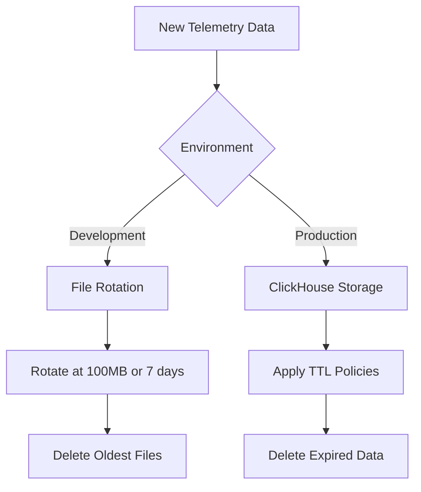

# Telemetry Data Storage and Retention

<cite>
**Referenced Files in This Document**   
- [provider_trace.py](file://letta/orm/provider_trace.py)
- [run_metrics.py](file://letta/orm/run_metrics.py)
- [step_metrics.py](file://letta/orm/step_metrics.py)
- [metric_registry.py](file://letta/otel/metric_registry.py)
- [metrics.py](file://letta/otel/metrics.py)
- [telemetry_manager.py](file://letta/services/telemetry_manager.py)
- [otel-collector-config-clickhouse.yaml](file://otel/otel-collector-config-clickhouse.yaml)
- [otel-collector-config-clickhouse-dev.yaml](file://otel/otel-collector-config-clickhouse-dev.yaml)
- [otel-collector-config-clickhouse-prod.yaml](file://otel/otel-collector-config-clickhouse-prod.yaml)
- [otel-collector-config-file.yaml](file://otel/otel-collector-config-file.yaml)
- [otel-collector-config-file-dev.yaml](file://otel/otel-collector-config-file-dev.yaml)
- [start-otel-collector.sh](file://otel/start-otel-collector.sh)
- [base.py](file://letta/orm/base.py)
</cite>

## Table of Contents
1. [Introduction](#introduction)
2. [Telemetry Architecture Overview](#telemetry-architecture-overview)
3. [ClickHouse Schema Design](#clickhouse-schema-design)
4. [File-Based Storage for Development](#file-based-storage-for-development)
5. [Data Retention Policies](#data-retention-policies)
6. [Query Performance Optimization](#query-performance-optimization)
7. [Capacity Planning and Cost Management](#capacity-planning-and-cost-management)
8. [Backup Strategies](#backup-strategies)
9. [Common Query Examples](#common-query-examples)
10. [Conclusion](#conclusion)

## Introduction

The Letta platform implements a comprehensive telemetry system for observability data collection, storage, and analysis. This documentation details the architecture and implementation of telemetry data storage and retention, focusing on the dual approach of using ClickHouse for production environments and file-based storage for development. The system captures detailed traces and metrics from agent operations, LLM interactions, and tool executions, providing valuable insights for performance monitoring, debugging, and optimization.

The telemetry infrastructure leverages OpenTelemetry standards for data collection and export, with configurable backends that support both high-performance columnar databases and simple file-based storage. This flexible design enables developers to work efficiently in local environments while ensuring production systems can handle large-scale telemetry data with optimal performance and cost efficiency.

**Section sources**
- [telemetry_manager.py](file://letta/services/telemetry_manager.py#L1-L57)
- [otel-collector-config-clickhouse.yaml](file://otel/otel-collector-config-clickhouse.yaml#L1-L82)

## Telemetry Architecture Overview

The Letta telemetry system follows a distributed collection and centralized storage architecture. Observability data is collected through OpenTelemetry instrumentation and exported to configurable backends via the OpenTelemetry Collector. The architecture supports two primary storage modes: ClickHouse for production deployments and file-based storage for development environments.

The system collects three main types of telemetry data:
- **Traces**: Detailed execution traces of agent steps, including LLM requests and tool executions
- **Metrics**: Performance metrics such as execution times, token usage, and system resource utilization
- **Logs**: Application logs with structured JSON formatting for analysis

The OpenTelemetry Collector serves as the central component, receiving data via OTLP (OpenTelemetry Protocol) over gRPC and HTTP endpoints. Based on environment configuration, the collector exports data to either ClickHouse databases or local JSON files with rotation policies.



**Diagram sources **
- [otel-collector-config-clickhouse.yaml](file://otel/otel-collector-config-clickhouse.yaml#L1-L82)
- [otel-collector-config-file.yaml](file://otel/otel-collector-config-file.yaml#L1-L30)

**Section sources**
- [otel-collector-config-clickhouse.yaml](file://otel/otel-collector-config-clickhouse.yaml#L1-L82)
- [otel-collector-config-file.yaml](file://otel/otel-collector-config-file.yaml#L1-L30)
- [start-otel-collector.sh](file://otel/start-otel-collector.sh#L1-L145)

## ClickHouse Schema Design

The ClickHouse schema design for telemetry data focuses on efficient storage and fast querying of time-series data. The system leverages ClickHouse's columnar storage, compression capabilities, and partitioning features to optimize performance for observability workloads.

### Core Data Models

The primary data models for telemetry storage are implemented as SQLAlchemy ORM classes that map to ClickHouse tables:



**Diagram sources **
- [provider_trace.py](file://letta/orm/provider_trace.py#L1-L27)
- [run_metrics.py](file://letta/orm/run_metrics.py#L1-L88)
- [step_metrics.py](file://letta/orm/step_metrics.py#L1-L121)

**Section sources**
- [provider_trace.py](file://letta/orm/provider_trace.py#L1-L27)
- [run_metrics.py](file://letta/orm/run_metrics.py#L1-L88)
- [step_metrics.py](file://letta/orm/step_metrics.py#L1-L121)

### Partitioning and Indexing Strategies

The ClickHouse implementation employs strategic partitioning and indexing to optimize query performance:

- **Time-based partitioning**: Data is partitioned by time intervals (typically daily) to improve query performance for time-range queries
- **Primary keys**: Composite primary keys are used with time-based columns as the leading component
- **Secondary indexes**: Secondary indexes are created on frequently queried attributes such as agent_id, organization_id, and step_id
- **Column compression**: ClickHouse's native compression is leveraged for JSON columns containing request and response data

The `ProviderTrace` model includes an index on the `step_id` column to enable efficient lookups of traces associated with specific execution steps. This design supports the common use case of retrieving the full provider request and response for a particular step in the agent execution flow.

## File-Based Storage for Development

For development environments, Letta provides a file-based storage option that simplifies setup and reduces infrastructure requirements. This approach stores telemetry data in JSON files with rotation policies to manage disk usage.

### Development Configuration

The file-based storage configuration is defined in `otel-collector-config-file-dev.yaml` and `otel-collector-config-clickhouse-dev.yaml`. When ClickHouse environment variables are not set, the system automatically falls back to file-based storage:



**Diagram sources **
- [start-otel-collector.sh](file://otel/start-otel-collector.sh#L133-L139)
- [otel-collector-config-file-dev.yaml](file://otel/otel-collector-config-file-dev.yaml#L1-L31)

The file-based storage includes the following features:
- **Rotation policies**: Files are rotated when they reach 100MB or after 7 days
- **Backup retention**: Up to 5 backup files are retained
- **Home directory storage**: Files are stored in the user's home directory under `.letta/logs/`
- **JSON format**: Data is stored in structured JSON format for easy inspection and analysis

This development configuration enables developers to capture and analyze telemetry data without requiring a ClickHouse database, making it easier to debug and optimize agent behavior during development.

**Section sources**
- [otel-collector-config-file-dev.yaml](file://otel/otel-collector-config-file-dev.yaml#L1-L31)
- [start-otel-collector.sh](file://otel/start-otel-collector.sh#L133-L139)

## Data Retention Policies

Letta implements configurable data retention policies to balance storage costs with the need for historical data analysis. The retention strategy differs between development and production environments.

### Development Retention

In development environments, telemetry data is retained through file rotation with the following parameters:
- Maximum file size: 100MB
- Maximum retention period: 7 days
- Maximum backup files: 5

This configuration ensures that disk space usage is controlled while providing sufficient data for debugging recent agent executions.

### Production Retention

In production environments using ClickHouse, retention policies can be configured at the database level. While specific retention settings are not defined in the provided code, ClickHouse supports:
- **TTL (Time To Live) expressions**: Automatic deletion of data older than a specified period
- **Granular retention**: Different retention periods for different types of telemetry data
- **Archival strategies**: Moving older data to cheaper storage tiers before deletion

The system also supports soft deletion through the `is_deleted` flag in the base model, allowing for data recovery if needed while maintaining referential integrity.



**Diagram sources **
- [otel-collector-config-file-dev.yaml](file://otel/otel-collector-config-file-dev.yaml#L18-L20)
- [base.py](file://letta/orm/base.py#L18)

**Section sources**
- [otel-collector-config-file-dev.yaml](file://otel/otel-collector-config-file-dev.yaml#L1-L31)
- [base.py](file://letta/orm/base.py#L1-L86)

## Query Performance Optimization

The telemetry system incorporates several optimization strategies to ensure efficient querying of large datasets, particularly in production environments using ClickHouse.

### Schema Optimization

The data models are designed with query performance in mind:
- **Time-based columns**: Nanosecond-precision timestamps enable high-resolution performance analysis
- **Foreign key relationships**: Proper indexing on foreign keys ensures efficient joins
- **Selective JSON storage**: Large JSON payloads are stored in dedicated columns to avoid bloating primary tables

### ClickHouse-Specific Optimizations

When using ClickHouse as the backend, the system benefits from:
- **Columnar storage**: Only the columns needed for a query are read from disk
- **Data compression**: Efficient compression of repetitive data patterns
- **Vectorized query execution**: Processing data in batches for improved CPU utilization
- **Parallel processing**: Distributing queries across multiple CPU cores

The `RunMetrics` and `StepMetrics` tables use foreign key constraints that also serve as primary keys, creating a natural clustering of related data. This design optimizes queries that retrieve metrics for specific runs or steps.

### Indexing Strategy

The indexing strategy focuses on the most common query patterns:
- **Time-based queries**: Optimized through partitioning and primary key design
- **Entity-based queries**: Indexes on agent_id, organization_id, and step_id
- **Composite queries**: Support for queries combining multiple criteria

These optimizations ensure that performance analysis queries can be executed efficiently even as the volume of telemetry data grows.

**Section sources**
- [run_metrics.py](file://letta/orm/run_metrics.py#L1-L88)
- [step_metrics.py](file://letta/orm/step_metrics.py#L1-L121)
- [provider_trace.py](file://letta/orm/provider_trace.py#L1-L27)

## Capacity Planning and Cost Management

Effective capacity planning and cost management are critical for large-scale telemetry data storage. The Letta system provides guidance for estimating storage requirements and optimizing costs.

### Storage Estimation

To estimate storage requirements, consider the following factors:
- **Data volume per agent execution**: Each agent run generates traces, metrics, and logs
- **Execution frequency**: Number of agent runs per day
- **Retention period**: How long data needs to be retained
- **Data compression**: ClickHouse typically achieves 5-10x compression ratios

For example, if each agent execution generates approximately 10KB of telemetry data and there are 10,000 executions per day with a 90-day retention period:
- Daily storage: 10KB × 10,000 = 100MB
- Total storage: 100MB × 90 = 9GB
- Compressed storage (8x ratio): ~1.1GB

### Cost Optimization Strategies

Several strategies can be employed to manage costs:
- **Tiered retention**: Keep detailed data for shorter periods and aggregate data for longer retention
- **Sampling**: Collect full telemetry data for a subset of executions during high-volume periods
- **Data pruning**: Remove non-essential fields from telemetry data
- **Compression optimization**: Tune ClickHouse compression settings for the specific data patterns

The dual storage approach (ClickHouse for production, file-based for development) also contributes to cost management by allowing teams to use simpler, lower-cost storage during development and testing phases.

**Section sources**
- [otel-collector-config-clickhouse.yaml](file://otel/otel-collector-config-clickhouse.yaml#L1-L82)
- [otel-collector-config-file.yaml](file://otel/otel-collector-config-file.yaml#L1-L30)

## Backup Strategies

The Letta telemetry system incorporates backup strategies appropriate for each deployment environment.

### Development Backups

In development environments, the file rotation system provides a basic backup mechanism:
- **Automatic rotation**: Creates backup files as the primary file reaches size limits
- **Multiple backups**: Retains up to 5 backup files
- **Simple recovery**: Backup files can be directly accessed for data recovery

While not a comprehensive backup solution, this approach provides protection against accidental data loss during development.

### Production Backups

For production deployments using ClickHouse, more robust backup strategies should be implemented:
- **Regular database dumps**: Scheduled exports of the telemetry database
- **Incremental backups**: Capturing only changes since the last backup
- **Offsite storage**: Storing backups in geographically distributed locations
- **Backup validation**: Regular testing of backup restoration procedures

The system's use of ClickHouse enables efficient backup operations through its native backup and restore capabilities, including:
- **Zero-copy backups**: Using filesystem snapshots for fast backups with minimal performance impact
- **Incremental backup support**: Reducing backup window and storage requirements
- **Parallel backup/restore**: Utilizing multiple threads for faster operations

Organizations should establish backup schedules and retention policies based on their data importance and recovery requirements.

**Section sources**
- [otel-collector-config-file.yaml](file://otel/otel-collector-config-file.yaml#L18-L20)
- [otel-collector-config-clickhouse.yaml](file://otel/otel-collector-config-clickhouse.yaml#L1-L82)

## Common Query Examples

The following examples demonstrate common queries for troubleshooting and performance analysis using the Letta telemetry data.

### Performance Analysis Queries

**Identify slow agent executions:**
```sql
SELECT 
    id,
    run_ns / 1e6 AS duration_ms,
    num_steps
FROM run_metrics 
WHERE run_ns > 10000000000 -- 10 seconds in nanoseconds
ORDER BY run_ns DESC
LIMIT 10;
```

**Analyze LLM request performance:**
```sql
SELECT 
    AVG(llm_request_ns / 1e6) AS avg_duration_ms,
    MIN(llm_request_ns / 1e6) AS min_duration_ms,
    MAX(llm_request_ns / 1e6) AS max_duration_ms,
    COUNT(*) AS request_count
FROM step_metrics 
WHERE llm_request_ns IS NOT NULL;
```

### Troubleshooting Queries

**Find executions with tool errors:**
```sql
SELECT 
    sm.id,
    sm.step_ns / 1e6 AS duration_ms,
    pt.request_json,
    pt.response_json
FROM step_metrics sm
JOIN provider_trace pt ON sm.id = pt.step_id
WHERE pt.response_json LIKE '%error%'
   OR pt.response_json LIKE '%exception%';
```

**Identify high-frequency agent patterns:**
```sql
SELECT 
    agent_id,
    COUNT(*) AS execution_count,
    AVG(step_ns / 1e6) AS avg_step_duration_ms
FROM step_metrics 
WHERE step_start_ns > (now() - INTERVAL 7 DAY)
GROUP BY agent_id
HAVING COUNT(*) > 100 -- Only agents with more than 100 steps
ORDER BY execution_count DESC;
```

### Capacity Monitoring Queries

**Estimate daily data volume:**
```sql
SELECT 
    toDate(toDateTime64(created_at, 3)) AS date,
    COUNT(*) AS trace_count,
    formatReadableSize(sum(length(JSONExtractString(request_json, 'content')))) AS request_data_size,
    formatReadableSize(sum(length(JSONExtractString(response_json, 'content')))) AS response_data_size
FROM provider_trace 
GROUP BY date
ORDER BY date DESC;
```

These queries can be adapted based on specific analysis needs and can be executed through ClickHouse's SQL interface or integrated into monitoring dashboards.

**Section sources**
- [provider_trace.py](file://letta/orm/provider_trace.py#L1-L27)
- [step_metrics.py](file://letta/orm/step_metrics.py#L1-L121)
- [run_metrics.py](file://letta/orm/run_metrics.py#L1-L88)

## Conclusion

The Letta telemetry data storage and retention system provides a flexible and scalable solution for observability data management. By supporting both ClickHouse for production environments and file-based storage for development, the system accommodates different deployment scenarios while maintaining consistent data models and collection mechanisms.

The ClickHouse schema design leverages time-series optimization techniques, including strategic partitioning, indexing, and compression, to ensure high performance for large-scale telemetry workloads. The system's comprehensive metrics collection enables detailed performance analysis and troubleshooting, while configurable retention policies help manage storage costs.

For production deployments, the integration with ClickHouse provides enterprise-grade capabilities for data storage, querying, and analysis. The system can be extended with additional optimization techniques such as data sampling, tiered storage, and advanced backup strategies to meet specific organizational requirements.

The telemetry infrastructure supports effective capacity planning and cost management, allowing organizations to balance the need for detailed observability data with storage and operational costs. With the provided query examples and optimization strategies, teams can effectively leverage telemetry data to improve agent performance, identify issues, and optimize system behavior.

**Section sources**
- [telemetry_manager.py](file://letta/services/telemetry_manager.py#L1-L57)
- [otel-collector-config-clickhouse.yaml](file://otel/otel-collector-config-clickhouse.yaml#L1-L82)
- [provider_trace.py](file://letta/orm/provider_trace.py#L1-L27)