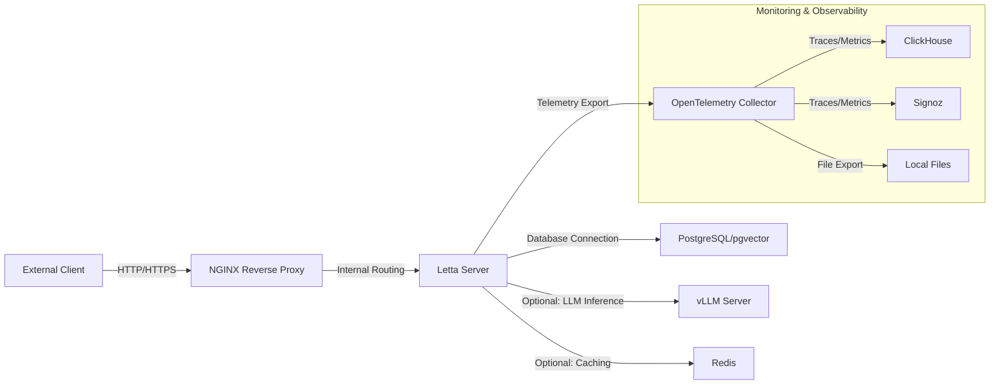
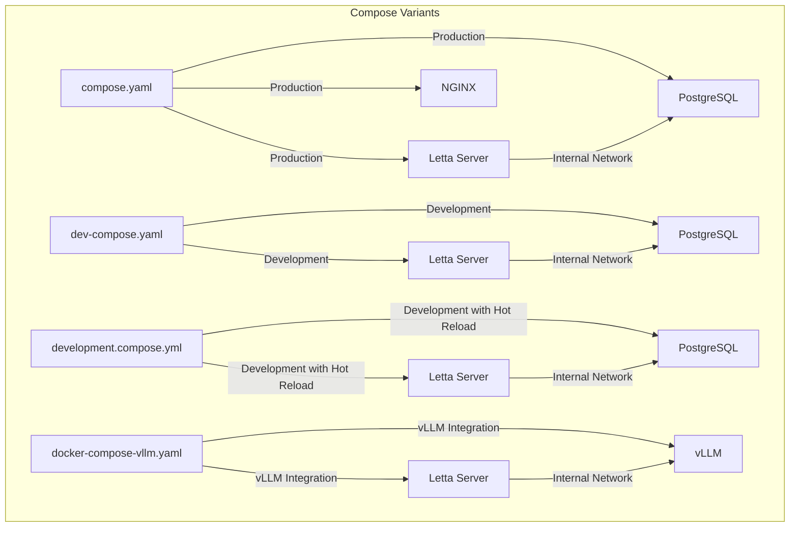
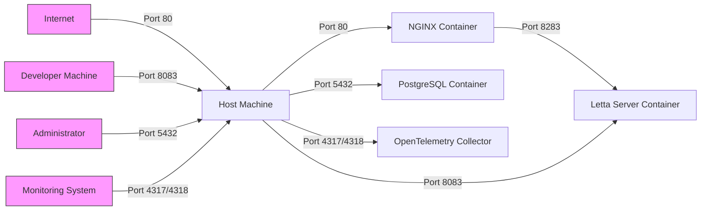
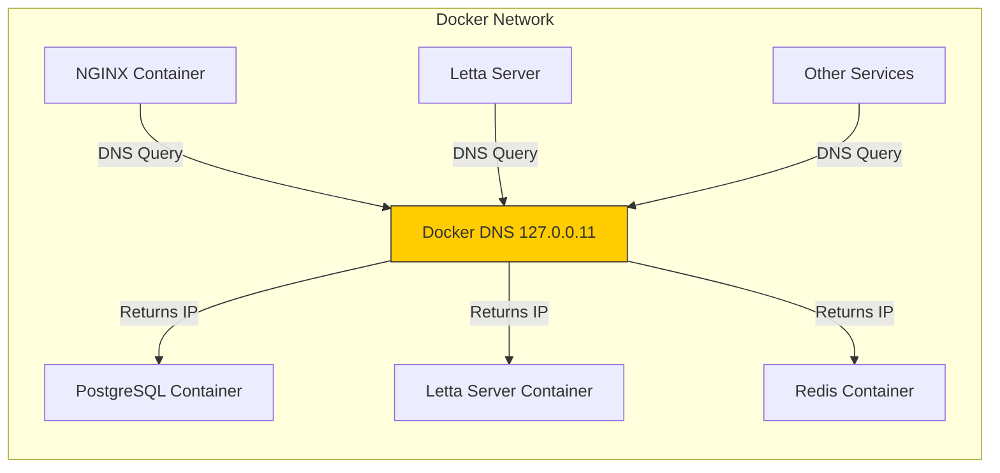
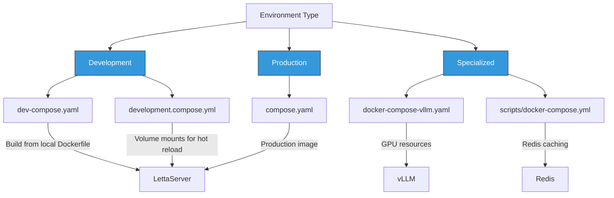
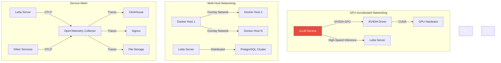
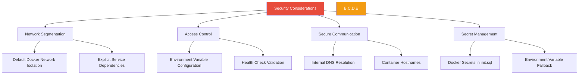

# Docker Networking

<cite>
**Referenced Files in This Document**   
- [compose.yaml](file://compose.yaml)
- [dev-compose.yaml](file://dev-compose.yaml)
- [development.compose.yml](file://development.compose.yml)
- [docker-compose-vllm.yaml](file://docker-compose-vllm.yaml)
- [Dockerfile](file://Dockerfile)
- [nginx.conf](file://nginx.conf)
- [init.sql](file://init.sql)
- [scripts/docker-compose.yml](file://scripts/docker-compose.yml)
- [letta/server/startup.sh](file://letta/server/startup.sh)
- [otel/otel-collector-config-file.yaml](file://otel/otel-collector-config-file.yaml)
- [otel/otel-collector-config-clickhouse.yaml](file://otel/otel-collector-config-clickhouse.yaml)
- [otel/otel-collector-config-signoz.yaml](file://otel/otel-collector-config-signoz.yaml)
</cite>

## Table of Contents
1. [Introduction](#introduction)
2. [Project Structure](#project-structure)
3. [Core Components](#core-components)
4. [Architecture Overview](#architecture-overview)
5. [Detailed Component Analysis](#detailed-component-analysis)
6. [Dependency Analysis](#dependency-analysis)
7. [Performance Considerations](#performance-considerations)
8. [Troubleshooting Guide](#troubleshooting-guide)
9. [Conclusion](#conclusion)

## Introduction
The Letta application utilizes Docker networking to manage communication between its various services, including the main server, database, and optional components like Redis and vector databases. This documentation provides a comprehensive overview of the Docker network configuration as defined in the various compose files, detailing service communication, network topology, and advanced networking features. The system is designed to support both development and production environments with different compose variants, enabling flexible deployment strategies and environment-specific configurations.

## Project Structure
The Letta application's Docker networking configuration is distributed across multiple compose files, each serving a specific purpose in the deployment lifecycle. The primary configuration files include compose.yaml for production deployments, dev-compose.yaml for development environments, and specialized configurations like docker-compose-vllm.yaml for specific LLM backends. The core services are organized into a cohesive network topology that facilitates seamless communication between the Letta server, PostgreSQL database with pgvector extension, and optional components like Redis. Additional infrastructure components such as NGINX for reverse proxying and OpenTelemetry for monitoring are integrated into the network design to provide enhanced functionality and observability.

```mermaid
graph TD
subgraph "Docker Network"
A[Letta Server]
B[PostgreSQL/pgvector]
C[NGINX]
D[OpenTelemetry Collector]
E[vLLM (Optional)]
F[Redis (Optional)]
end
A --> B
A --> D
C --> A
E --> A
F --> A
```

**Diagram sources**
- [compose.yaml](file://compose.yaml)
- [docker-compose-vllm.yaml](file://docker-compose-vllm.yaml)
- [scripts/docker-compose.yml](file://scripts/docker-compose.yml)

**Section sources**
- [compose.yaml](file://compose.yaml)
- [dev-compose.yaml](file://dev-compose.yaml)
- [docker-compose-vllm.yaml](file://docker-compose-vllm.yaml)

## Core Components
The Letta application's Docker networking architecture consists of several core components that work together to provide a robust and scalable system. The primary services include the Letta server, PostgreSQL database with pgvector extension for vector storage, and an NGINX reverse proxy for handling external requests. These components are configured through Docker Compose files that define their network interfaces, port mappings, and inter-service dependencies. The system also incorporates OpenTelemetry for monitoring and tracing, with configurations that enable exporting telemetry data to various backends including ClickHouse and Signoz. For specialized use cases, additional components like vLLM for high-performance LLM inference and Redis for caching can be integrated into the network topology.

**Section sources**
- [compose.yaml](file://compose.yaml#L1-L66)
- [Dockerfile](file://Dockerfile#L1-L89)
- [nginx.conf](file://nginx.conf#L1-L29)

## Architecture Overview
The Letta application employs a multi-tier architecture with clearly defined network boundaries and communication patterns between services. The architecture is designed to support both single-node deployments and distributed environments, with configuration options for different deployment scenarios. At the core of the architecture is a custom Docker network that enables service discovery through Docker's internal DNS mechanism, allowing services to communicate using container names as hostnames. The network design incorporates both external-facing endpoints for user access and internal-only connections for service-to-service communication, ensuring security and performance optimization.



**Diagram sources**
- [compose.yaml](file://compose.yaml#L1-L66)
- [nginx.conf](file://nginx.conf#L1-L29)
- [otel/otel-collector-config-clickhouse.yaml](file://otel/otel-collector-config-clickhouse.yaml#L1-L82)

## Detailed Component Analysis

### Service Communication and Network Topology
The Letta application's service communication is orchestrated through Docker Compose configurations that define the network topology and inter-service connectivity. Each service is assigned to a default Docker network with specific aliases that enable service discovery via Docker's internal DNS. The primary services—Letta server, PostgreSQL, and NGINX—are configured to communicate over this internal network, with the Letta server depending on the database service being healthy before starting. This dependency ensures that the application only attempts to connect to a fully initialized database, preventing startup failures due to premature connection attempts.

The network configuration includes health checks for critical services like PostgreSQL and Redis, which are used by Docker Compose to determine service readiness. These health checks employ service-specific commands (pg_isready for PostgreSQL and redis-cli ping for Redis) to verify that the services are not only running but also capable of handling requests. The health check results influence the startup sequence, as defined in the depends_on conditions, creating a reliable initialization process that accounts for service dependencies and readiness.

**Section sources**
- [compose.yaml](file://compose.yaml#L1-L66)
- [scripts/docker-compose.yml](file://scripts/docker-compose.yml#L1-L33)
- [dev-compose.yaml](file://dev-compose.yaml#L1-L49)

### Docker Compose Configuration Analysis
The Letta application utilizes multiple Docker Compose configuration files to support different deployment scenarios and environments. The primary compose.yaml file defines the production-ready configuration with services for the Letta server, PostgreSQL database with pgvector extension, and an NGINX reverse proxy. This configuration includes port mappings for external access, environment variable injection for configuration, and volume mounts for persistent data storage.

The dev-compose.yaml file provides a development-specific configuration that includes additional build instructions for creating the Letta server image from the local Dockerfile with a development target. This allows developers to work with a customized image that includes development tools and configurations. Similarly, the development.compose.yml file is designed for active development with volume mounts that enable live code reloading, allowing developers to see changes immediately without rebuilding the container.

For specialized use cases, the docker-compose-vllm.yaml file configures integration with the vLLM inference server, which provides high-performance LLM inference capabilities. This configuration includes GPU resource allocation through Docker's runtime and deploy directives, enabling the vLLM service to access NVIDIA GPUs for accelerated inference. The configuration also sets environment variables that direct the Letta server to use the vLLM endpoint for LLM operations, demonstrating how the network topology can be adapted for different backend requirements.



**Diagram sources**
- [compose.yaml](file://compose.yaml#L1-L66)
- [dev-compose.yaml](file://dev-compose.yaml#L1-L49)
- [development.compose.yml](file://development.compose.yml#L1-L30)
- [docker-compose-vllm.yaml](file://docker-compose-vllm.yaml#L1-L36)

**Section sources**
- [compose.yaml](file://compose.yaml#L1-L66)
- [dev-compose.yaml](file://dev-compose.yaml#L1-L49)
- [development.compose.yml](file://development.compose.yml#L1-L30)
- [docker-compose-vllm.yaml](file://docker-compose-vllm.yaml#L1-L36)

### Port Mappings and External Access
The Letta application's Docker networking configuration includes several port mappings that enable external access to the services while maintaining secure internal communication. The primary port mappings are defined in the compose files and serve different purposes for service exposure and monitoring.

The NGINX service exposes port 80 on the host, which is mapped to port 80 in the container, allowing HTTP traffic to reach the reverse proxy. This service acts as the entry point for external clients, forwarding requests to the Letta server based on the configured routing rules. The Letta server itself exposes two ports: 8083 and 8283, which are mapped from the container to the host. These ports serve different purposes in the application architecture, with 8283 being the primary API endpoint as configured in the startup script.

The PostgreSQL database exposes port 5432 on the host, mapped to the same port in the container, enabling external database access for administration and debugging purposes. This port mapping is configurable through the LETTA_PG_PORT environment variable, allowing deployment flexibility across different environments. Additionally, the OpenTelemetry Collector exposes ports 4317 and 4318 for OTLP (OpenTelemetry Protocol) gRPC and HTTP receivers respectively, enabling telemetry data ingestion from external sources.



**Diagram sources**
- [compose.yaml](file://compose.yaml#L1-L66)
- [Dockerfile](file://Dockerfile#L85-L89)
- [nginx.conf](file://nginx.conf#L5-L8)

**Section sources**
- [compose.yaml](file://compose.yaml#L1-L66)
- [Dockerfile](file://Dockerfile#L85-L89)
- [nginx.conf](file://nginx.conf#L1-L29)

### Internal Service Discovery and Docker DNS
The Letta application leverages Docker's built-in DNS-based service discovery to enable seamless communication between containers within the same network. This mechanism allows services to locate and connect to each other using container names or network aliases as hostnames, eliminating the need for hardcoded IP addresses and enhancing deployment flexibility.

In the compose configurations, services are assigned network aliases that serve as DNS names within the Docker network. For example, the PostgreSQL service is assigned the aliases "pgvector_db" and "letta-db", which can be used by other services to connect to the database. The Letta server uses these aliases in its connection string configuration, as seen in the LETTA_PG_URI environment variable that references "letta-db" as the host.

The NGINX configuration further demonstrates the use of Docker DNS, with the proxy_pass directive targeting "http://letta-server:8283", where "letta-server" is the hostname of the Letta server container. This hostname resolution is handled by Docker's internal DNS server, which runs at 127.0.0.11 as specified in the NGINX resolver configuration. This setup enables NGINX to forward requests to the Letta server without requiring knowledge of its IP address, which may change between deployments.

The service discovery mechanism also supports health-based routing, where Docker Compose waits for services to pass their health checks before considering them available for connections. This ensures that dependent services only attempt to connect to healthy instances, improving system reliability and reducing error conditions during startup and deployment.



**Diagram sources**
- [compose.yaml](file://compose.yaml#L4-L8)
- [nginx.conf](file://nginx.conf#L15-L16)
- [dev-compose.yaml](file://dev-compose.yaml#L34-L36)

**Section sources**
- [compose.yaml](file://compose.yaml#L1-L66)
- [nginx.conf](file://nginx.conf#L1-L29)
- [dev-compose.yaml](file://dev-compose.yaml#L1-L49)

### Environment-Based Network Configuration
The Letta application employs environment-based network configuration through multiple compose file variants that cater to different deployment scenarios and requirements. This approach enables the system to adapt its network topology and service configuration based on the target environment, whether it be development, testing, or production.

The primary environment variants include:
- **compose.yaml**: Production-ready configuration with optimized settings and external service dependencies
- **dev-compose.yaml**: Development configuration with local image building and simplified setup
- **development.compose.yml**: Active development configuration with hot-reloading capabilities through volume mounts
- **docker-compose-vllm.yaml**: Specialized configuration for vLLM integration with GPU support

Each variant modifies the network configuration to suit its intended environment. For example, the development.compose.yml file includes volume mounts that map local source code directories into the container, enabling live code reloading without container rebuilds. This configuration is essential for rapid development cycles but would be inappropriate for production due to potential security and performance implications.

The environment-based configuration also extends to service dependencies and startup sequences. The dev-compose.yaml file uses a simpler dependency model without health checks, while the production compose.yaml includes comprehensive health checks to ensure service readiness before startup. This difference reflects the trade-off between development convenience and production reliability.



**Diagram sources**
- [dev-compose.yaml](file://dev-compose.yaml#L1-L49)
- [development.compose.yml](file://development.compose.yml#L1-L30)
- [compose.yaml](file://compose.yaml#L1-L66)
- [docker-compose-vllm.yaml](file://docker-compose-vllm.yaml#L1-L36)

**Section sources**
- [dev-compose.yaml](file://dev-compose.yaml#L1-L49)
- [development.compose.yml](file://development.compose.yml#L1-L30)
- [compose.yaml](file://compose.yaml#L1-L66)
- [docker-compose-vllm.yaml](file://docker-compose-vllm.yaml#L1-L36)

### Dockerfile Network Configuration
The Dockerfile for the Letta application defines the network configuration at the container level, specifying the ports that the container will expose to the host and other containers. This configuration works in conjunction with the Docker Compose files to create a complete network topology that supports the application's requirements.

The Dockerfile uses the EXPOSE instruction to declare the ports that the container will listen on: 8283 for the Letta server API, 5432 for PostgreSQL, and 4317/4318 for OpenTelemetry Collector endpoints. These exposed ports are then mapped to host ports in the compose files, creating the bridge between container-internal and external network interfaces.

The Dockerfile also includes configuration for the OpenTelemetry Collector, which is installed and configured within the container. This includes copying configuration files for different export backends (file, ClickHouse, Signoz) and setting up the necessary environment variables. The collector is designed to receive telemetry data on the exposed ports and export it to the configured backend, providing observability into the application's network and performance characteristics.

Additionally, the Dockerfile sets environment variables for the PostgreSQL database connection, establishing default values that can be overridden by the compose files. This layered configuration approach allows for flexibility in deployment while providing sensible defaults for standalone operation.

```mermaid
classDiagram
class Dockerfile {
+EXPOSE 8283
+EXPOSE 5432
+EXPOSE 4317
+EXPOSE 4318
+ENV POSTGRES_USER=letta
+ENV POSTGRES_PASSWORD=letta
+ENV POSTGRES_DB=letta
+COPY otel/ configs
+ENTRYPOINT ["/usr/local/bin/docker-entrypoint.sh"]
+CMD ["./letta/server/startup.sh"]
}
class Compose {
+ports mapping
+environment variables
+volumes
+depends_on
+healthcheck
}
Dockerfile --> Compose : Configures
Compose --> Dockerfile : Overrides
note right of Dockerfile
Base configuration for container
network interfaces and services
end note
note left of Compose
Runtime configuration that
overrides Dockerfile defaults
end note
```

**Diagram sources**
- [Dockerfile](file://Dockerfile#L85-L89)
- [Dockerfile](file://Dockerfile#L66-L72)
- [Dockerfile](file://Dockerfile#L61-L64)

**Section sources**
- [Dockerfile](file://Dockerfile#L1-L89)

### Advanced Networking Features
The Letta application incorporates several advanced networking features that enhance its capabilities in complex deployment scenarios. These features include multi-container orchestration, GPU-accelerated networking for AI workloads, and distributed tracing across service boundaries.

One of the key advanced features is the integration with vLLM through the docker-compose-vllm.yaml configuration, which demonstrates GPU resource allocation in Docker. The configuration uses Docker's deploy.resources directive to reserve all available NVIDIA GPUs for the vLLM service, enabling high-performance LLM inference. This setup requires the NVIDIA Container Toolkit to be installed on the host, illustrating how Docker networking can extend to specialized hardware resources.

The application also supports multi-host networking through Docker Swarm and Kubernetes environments, although these configurations are not explicitly defined in the provided files. The compose files are designed to be compatible with these orchestration platforms, allowing the services to be deployed across multiple hosts with appropriate network overlay configurations.

Service mesh integration is facilitated through the OpenTelemetry Collector, which acts as a sidecar for observability. The collector receives telemetry data from the Letta server and other services, then exports it to various backends. This architecture supports service mesh patterns by providing distributed tracing, metrics collection, and log aggregation across service boundaries.



**Diagram sources**
- [docker-compose-vllm.yaml](file://docker-compose-vllm.yaml#L1-L36)
- [otel/otel-collector-config-clickhouse.yaml](file://otel/otel-collector-config-clickhouse.yaml#L1-L82)
- [otel/otel-collector-config-signoz.yaml](file://otel/otel-collector-config-signoz.yaml#L1-L49)

**Section sources**
- [docker-compose-vllm.yaml](file://docker-compose-vllm.yaml#L1-L36)
- [otel/otel-collector-config-clickhouse.yaml](file://otel/otel-collector-config-clickhouse.yaml#L1-L82)
- [otel/otel-collector-config-signoz.yaml](file://otel/otel-collector-config-signoz.yaml#L1-L49)

### Security Considerations
The Letta application's Docker networking configuration incorporates several security considerations to protect against common vulnerabilities and ensure secure operation in production environments. These considerations span network segmentation, access control, and secure communication patterns.

Network segmentation is achieved through the use of Docker's default network isolation, which prevents services from accessing each other unless explicitly connected through the compose configuration. This principle of least privilege ensures that only necessary service-to-service communication is permitted, reducing the attack surface.

The configuration also includes security-related environment variables and startup options, such as the SECURE flag that can be set to enable additional security features in the Letta server. While the provided files do not show encrypted overlay networks, the architecture supports such configurations through external tools and orchestration platforms.

Access to sensitive services is controlled through environment variables and configuration files. For example, database credentials are passed through environment variables rather than being hardcoded in the configuration, reducing the risk of credential leakage. The init.sql file also demonstrates a security-conscious approach by using Docker secrets when available, falling back to environment variables only when necessary.



**Diagram sources**
- [init.sql](file://init.sql#L5-L7)
- [compose.yaml](file://compose.yaml#L10-L12)
- [letta/server/startup.sh](file://letta/server/startup.sh#L52-L54)

**Section sources**
- [init.sql](file://init.sql#L1-L37)
- [compose.yaml](file://compose.yaml#L1-L66)
- [letta/server/startup.sh](file://letta/server/startup.sh#L1-L82)

## Dependency Analysis
The Letta application's services exhibit a clear dependency hierarchy that ensures proper initialization and operation. The primary dependency is between the Letta server and the PostgreSQL database, with the server requiring a healthy database connection before starting its main processes. This dependency is enforced through Docker Compose's depends_on condition with service_healthy, which waits for the database's health check to pass before starting the server.

Additional dependencies exist between the NGINX reverse proxy and the Letta server, with NGINX routing requests to the server once it's available. The OpenTelemetry Collector runs as a background process alongside the Letta server, receiving telemetry data and exporting it to the configured backend. When vLLM is used, it becomes a dependency for the Letta server, which directs LLM inference requests to the vLLM endpoint.

The dependency analysis also reveals optional components like Redis, which can be integrated for caching purposes but are not required for basic operation. This modular design allows the application to scale its capabilities based on deployment requirements without introducing unnecessary complexity in simpler setups.

```mermaid
graph TD
Postgres[PostgreSQL] --> |Required| LettaServer[Letta Server]
LettaServer --> |Required| Otel[OpenTelemetry Collector]
NGINX[NGINX] --> |Required| LettaServer
vLLM[vLLM] -.->|Optional| LettaServer
Redis[Redis] -.->|Optional| LettaServer
style Postgres fill:#3498db,color:#fff
style LettaServer fill:#3498db,color:#fff
style Otel fill:#3498db,color:#fff
style NGINX fill:#3498db,color:#fff
style vLLM fill:#95a5a6,color:#fff
style Redis fill:#95a5a6,color:#fff
note right of vLLM
Optional dependency for
high-performance LLM inference
end note
note right of Redis
Optional dependency for
caching and performance
end note
```

**Diagram sources**
- [compose.yaml](file://compose.yaml#L26-L28)
- [docker-compose-vllm.yaml](file://docker-compose-vllm.yaml#L13-L14)
- [scripts/docker-compose.yml](file://scripts/docker-compose.yml#L3-L15)

**Section sources**
- [compose.yaml](file://compose.yaml#L1-L66)
- [docker-compose-vllm.yaml](file://docker-compose-vllm.yaml#L1-L36)
- [scripts/docker-compose.yml](file://scripts/docker-compose.yml#L1-L33)

## Performance Considerations
The Docker networking configuration of the Letta application includes several performance considerations that optimize service communication and resource utilization. The network topology is designed to minimize latency between services by keeping them on the same Docker network, which uses the host's network stack for efficient communication.

The use of NGINX as a reverse proxy provides performance benefits through connection pooling, request buffering, and efficient HTTP handling. This setup allows the Letta server to focus on application logic rather than managing direct client connections, improving overall throughput and responsiveness.

For AI-intensive workloads, the vLLM integration offers significant performance improvements through GPU acceleration and optimized inference serving. The docker-compose-vllm.yaml configuration ensures that the vLLM service has exclusive access to GPU resources, maximizing inference performance for LLM operations.

The OpenTelemetry Collector is configured with batching processors that aggregate telemetry data before export, reducing the overhead of frequent network operations. This configuration balances the need for timely monitoring data with the performance impact of continuous telemetry export.

**Section sources**
- [compose.yaml](file://compose.yaml#L1-L66)
- [nginx.conf](file://nginx.conf#L1-L29)
- [docker-compose-vllm.yaml](file://docker-compose-vllm.yaml#L1-L36)
- [otel/otel-collector-config-clickhouse.yaml](file://otel/otel-collector-config-clickhouse.yaml#L36-L38)

## Troubleshooting Guide
When troubleshooting networking issues in the Letta application, several common problems and their solutions should be considered. Connectivity issues between the Letta server and PostgreSQL database are often caused by incorrect environment variables or failed health checks. Verifying the LETTA_PG_URI and related credentials in the environment configuration can resolve many database connection problems.

Port conflicts are another common issue, particularly when multiple instances of the application are running or when other services are using the same ports. Checking for port availability on the host machine and adjusting the port mappings in the compose files can resolve these conflicts.

For issues with the NGINX reverse proxy, examining the nginx.conf file and verifying that the proxy_pass directive correctly targets the Letta server container name and port is essential. DNS resolution problems within the Docker network can often be diagnosed by testing connectivity between containers using docker exec to run network diagnostic commands.

When using the vLLM integration, GPU-related issues may arise if the NVIDIA Container Toolkit is not properly installed or configured. Ensuring that the host system has the necessary GPU drivers and Docker extensions is critical for successful vLLM operation.

**Section sources**
- [compose.yaml](file://compose.yaml#L1-L66)
- [nginx.conf](file://nginx.conf#L1-L29)
- [letta/server/startup.sh](file://letta/server/startup.sh#L8-L13)
- [scripts/wait_for_service.sh](file://scripts/wait_for_service.sh#L1-L16)

## Conclusion
The Docker networking configuration of the Letta application demonstrates a well-architected approach to service communication and network topology. By leveraging Docker Compose, the system provides flexible deployment options for different environments while maintaining a consistent network model. The integration of specialized components like vLLM for AI workloads and OpenTelemetry for observability showcases the application's adaptability to complex requirements. The security considerations, performance optimizations, and modular design make the Letta application suitable for both development and production deployments, with clear pathways for scaling and enhancement.