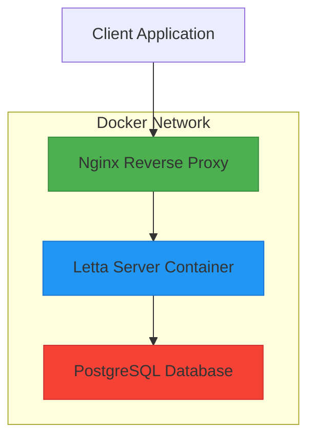
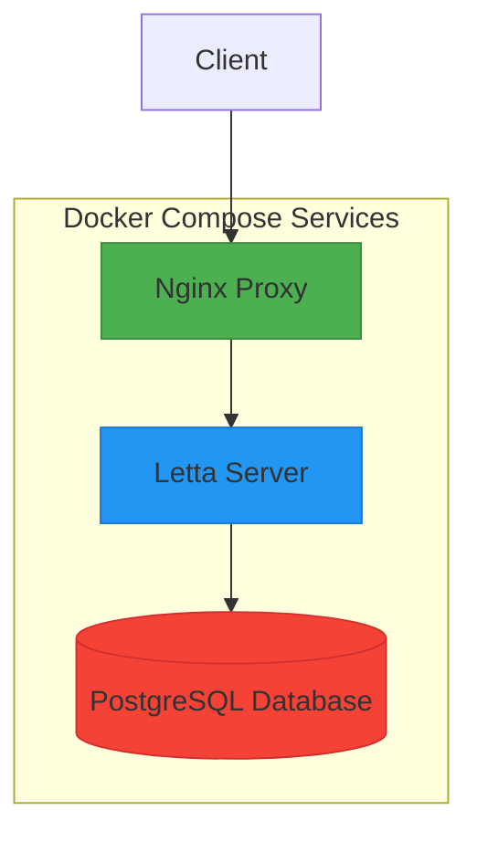
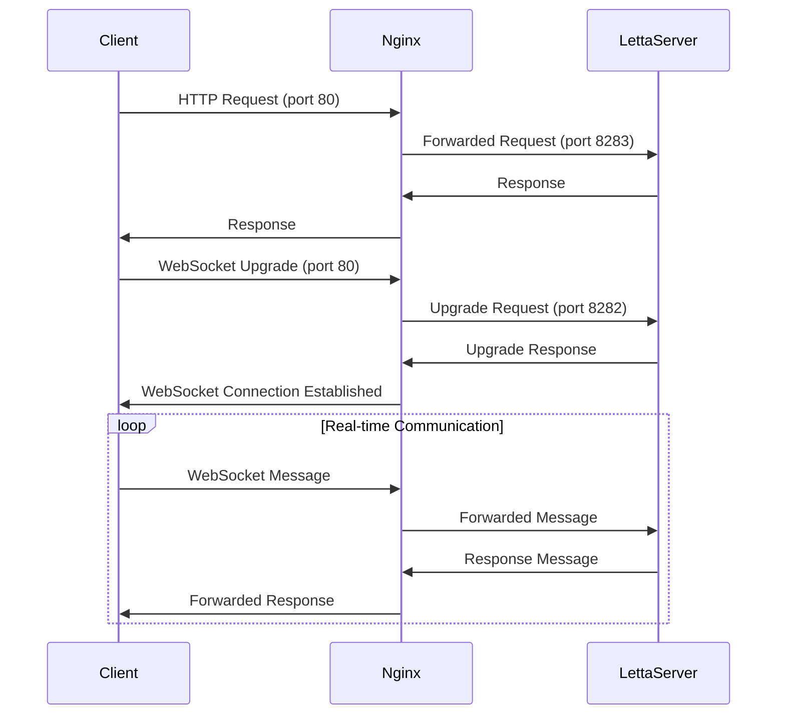
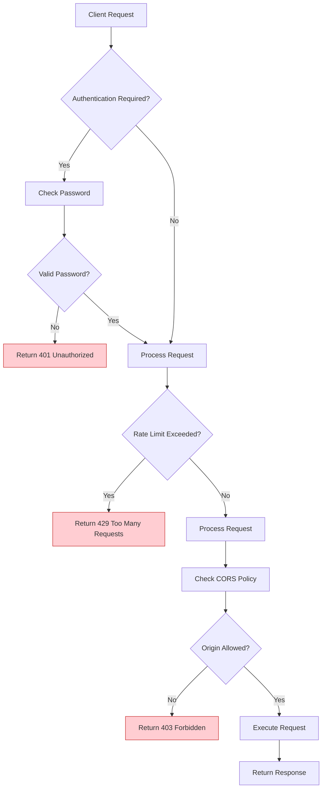

# Network Configuration

<cite>
**Referenced Files in This Document**   
- [nginx.conf](file://nginx.conf)
- [compose.yaml](file://compose.yaml)
- [development.compose.yml](file://development.compose.yml)
- [letta/server/constants.py](file://letta/server/constants.py)
- [letta/server/rest_api/app.py](file://letta/server/rest_api/app.py)
- [letta/server/ws_api/server.py](file://letta/server/ws_api/server.py)
- [letta/server/ws_api/protocol.py](file://letta/server/ws_api/protocol.py)
- [letta/server/rest_api/middleware/logging.py](file://letta/server/rest_api/middleware/logging.py)
- [letta/server/rest_api/middleware/check_password.py](file://letta/server/rest_api/middleware/check_password.py)
</cite>

## Table of Contents
1. [Introduction](#introduction)
2. [Nginx Reverse Proxy Configuration](#nginx-reverse-proxy-configuration)
3. [Docker Network Configuration](#docker-network-configuration)
4. [Integration Between Nginx and Letta Server](#integration-between-nginx-and-letta-server)
5. [SSL/TLS Configuration and Domain Setup](#ssl/tls-configuration-and-domain-setup)
6. [Security Considerations](#security-considerations)
7. [Common Networking Issues and Solutions](#common-networking-issues-and-solutions)
8. [Network Performance Optimization](#network-performance-optimization)
9. [High Availability Configurations](#high-availability-configurations)
10. [Conclusion](#conclusion)

## Introduction
The Letta platform employs a sophisticated networking architecture that combines Docker containerization, Nginx reverse proxying, and WebSocket communication to provide a robust and scalable AI agent system. This document details the network configuration of the Letta platform, focusing on the integration between the Nginx reverse proxy and the Letta server, Docker networking setup, and various networking considerations for production deployment. The architecture is designed to handle both REST API requests and real-time WebSocket connections, enabling interactive agent conversations and streaming responses.

**Section sources**
- [nginx.conf](file://nginx.conf)
- [compose.yaml](file://compose.yaml)

## Nginx Reverse Proxy Configuration

The Nginx configuration in `nginx.conf` serves as a reverse proxy that routes incoming HTTP requests to the Letta server container. The configuration consists of two server blocks: one for handling requests to the Letta application and another for catching unmatched requests.

The primary server block listens on ports 80 and 8283 for both IPv4 and IPv6 connections. It is configured with the server name `letta.localhost` and uses a variable `$api_target` to define the upstream server as `http://letta-server:8283`. This target uses Docker's internal DNS resolution to locate the Letta server container by its hostname.

The location directive `/` handles all incoming requests by forwarding them to the upstream server with appropriate proxy headers. These headers include `Host`, `X-Forwarded-For`, and `X-Forwarded-Proto`, which preserve the original request information for the backend server. The resolver is set to Docker's internal DNS at `127.0.0.11`, ensuring proper container name resolution within the Docker network.

A critical component of the configuration is the WebSocket support, implemented through the `map` directive that sets the `Connection` header based on the `Upgrade` header from the client. When a WebSocket upgrade request is detected, Nginx properly forwards the upgrade headers to enable WebSocket connections to the Letta server.

The second server block acts as a catch-all, returning a 404 response for any requests that don't match the primary server configuration, providing a clean error response for invalid domains.

**Diagram sources**
- [nginx.conf](file://nginx.conf)

**Section sources**
- [nginx.conf](file://nginx.conf)

## Docker Network Configuration

The Docker network configuration in `compose.yaml` defines a multi-container application with three primary services: `letta_db`, `letta_server`, and `letta_nginx`. These services are connected through Docker's default bridge network, enabling seamless communication between containers.

The `letta_db` service uses the `ankane/pgvector:v0.5.1` image and is configured with environment variables for PostgreSQL authentication and database initialization. It exposes port 5432 to the host machine and mounts both persistent data storage and initialization scripts. The service includes health checks to ensure database readiness before dependent services start.

The `letta_server` service runs the core Letta application and depends on the database service being healthy before startup. It exposes ports 8083 and 8283 to the host, with 8283 being the primary REST API port. The service inherits environment variables from a `.env` file and dynamically constructs the PostgreSQL connection URI using environment variables.

The `letta_nginx` service uses the official Nginx image and mounts the custom `nginx.conf` configuration file to override the default settings. It exposes port 80 to the host, serving as the entry point for all incoming HTTP requests.

The development configuration in `development.compose.yml` provides an alternative setup for development environments, building the Letta server from source with hot-reloading capabilities and mounting local directories for easier development.

**Diagram sources**
- [compose.yaml](file://compose.yaml)
- [development.compose.yml](file://development.compose.yml)

**Section sources**
- [compose.yaml](file://compose.yaml)
- [development.compose.yml](file://development.compose.yml)

## Integration Between Nginx and Letta Server

The integration between Nginx and the Letta server enables both HTTP/HTTPS termination and WebSocket support, creating a comprehensive communication layer for the application. The Letta server exposes two primary endpoints: a REST API on port 8283 and a WebSocket server on port 8282, as defined in the server constants.

HTTP/HTTPS termination is handled by Nginx, which receives incoming requests on port 80 and forwards them to the Letta server's REST API. The proxy configuration preserves important request headers, allowing the backend server to understand the original request context. This setup enables Nginx to handle SSL termination in production environments, offloading encryption/decryption from the application server.

WebSocket support is implemented through the upgrade mechanism in Nginx. When a client initiates a WebSocket connection, the `map` directive in the Nginx configuration properly sets the `Connection` and `Upgrade` headers to facilitate the WebSocket handshake. The Letta server's WebSocket interface, implemented in `ws_api/server.py`, handles incoming WebSocket connections and manages client communication through the `SyncWebSocketInterface`.

The header forwarding configuration ensures that critical information is preserved across the proxy boundary. The `Host`, `X-Forwarded-For`, and `X-Forwarded-Proto` headers allow the Letta server to identify the original client IP address, protocol scheme, and host header, which is essential for proper URL generation and security policies.

**Diagram sources**
- [nginx.conf](file://nginx.conf)
- [letta/server/constants.py](file://letta/server/constants.py)
- [letta/server/ws_api/server.py](file://letta/server/ws_api/server.py)

**Section sources**
- [nginx.conf](file://nginx.conf)
- [letta/server/constants.py](file://letta/server/constants.py)
- [letta/server/ws_api/server.py](file://letta/server/ws_api/server.py)

## SSL/TLS Configuration and Domain Setup

While the provided configuration files show HTTP-only setup, production deployments require SSL/TLS configuration for secure communication. The Letta platform supports SSL/TLS through environment variables and can be configured to serve over HTTPS.

The `certs` directory contains documentation for setting up localhost HTTPS connections using mkcert, a tool for generating locally-trusted development certificates. By setting the `LOCAL_HTTPS=true` environment variable, the server can be configured to use SSL certificates for secure local development.

For production domain setup, the Nginx configuration can be extended to include SSL termination with proper certificates from a certificate authority or Let's Encrypt. The server_name directive in the Nginx configuration would be updated to the production domain, and SSL certificates would be mounted into the container.

The Docker compose configuration supports environment variable overrides for database connection details and API keys, allowing for flexible configuration across different environments. This enables seamless transition from development to production with appropriate security settings.

**Section sources**
- [certs/README.md](file://certs/README.md)
- [compose.yaml](file://compose.yaml)

## Security Considerations

The Letta platform incorporates several security measures in its network configuration. The REST API includes CORS (Cross-Origin Resource Sharing) middleware that allows configurable origins, with a default setting that includes `https://app.letta.com`. This prevents unauthorized domains from making requests to the API while allowing legitimate clients.

Rate limiting is implemented at the LLM API level, with retry mechanisms and exponential backoff for handling rate limit errors from external LLM providers. The system logs retry attempts and raises appropriate exceptions when maximum retries are exceeded, preventing infinite retry loops.

The platform includes a password protection middleware that can be enabled with the `LETTA_SERVER_SECURE` environment variable. This adds an additional authentication layer to the API, requiring clients to provide a randomly generated password for access.

DDoS protection is partially addressed through the use of connection timeouts and proper error handling. The WebSocket server includes timeout settings, and the REST API has appropriate timeout configurations to prevent resource exhaustion from slow clients.

The Docker configuration follows security best practices by using official images, mounting only necessary volumes, and isolating services through Docker's network segmentation.

**Diagram sources**
- [letta/server/rest_api/app.py](file://letta/server/rest_api/app.py)
- [letta/server/rest_api/middleware/check_password.py](file://letta/server/rest_api/middleware/check_password.py)

**Section sources**
- [letta/server/rest_api/app.py](file://letta/server/rest_api/app.py)
- [letta/server/rest_api/middleware/check_password.py](file://letta/server/rest_api/middleware/check_password.py)

## Common Networking Issues and Solutions

Several common networking issues may arise when deploying the Letta platform, along with their solutions:

**Connection Timeouts**: These can occur due to slow LLM responses or network latency. The system addresses this with configurable timeout settings in both the WebSocket server (30 seconds by default) and the REST API. Solutions include increasing timeout values or optimizing LLM provider connections.

**WebSocket Handshake Failures**: These typically result from incorrect proxy configuration. The Nginx configuration must properly forward the `Upgrade` and `Connection` headers. Ensuring the `map` directive is correctly configured and that the WebSocket port (8282) is accessible resolves most handshake issues.

**DNS Resolution Problems**: In Docker environments, containers must be able to resolve each other by hostname. The configuration uses Docker's internal DNS (127.0.0.11) and proper service naming (`letta-server`) to ensure reliable DNS resolution. Using the correct service names in the Docker compose file and Nginx configuration prevents these issues.

**Port Conflicts**: Running multiple instances requires careful port management. The configuration exposes ports 80, 8083, and 8283 on the host, which must not conflict with other services. Using Docker's port mapping allows running multiple instances on different host ports.

**CORS Errors**: These occur when clients from unauthorized domains attempt to access the API. The solution is to properly configure the `cors_origins` setting in the environment variables to include all legitimate client domains.

**Section sources**
- [nginx.conf](file://nginx.conf)
- [letta/server/constants.py](file://letta/server/constants.py)
- [letta/server/ws_api/server.py](file://letta/server/ws_api/server.py)

## Network Performance Optimization

Optimizing network performance for the Letta platform involves several strategies:

**Connection Pooling**: The database connection is managed through connection pooling to reduce the overhead of establishing new connections for each request. This improves response times and reduces database load.

**Keep-Alive Settings**: The REST API server includes timeout keep-alive settings to maintain persistent connections, reducing the overhead of TCP connection establishment for sequential requests.

**Asynchronous Processing**: The WebSocket interface uses asynchronous processing with dedicated event loops, allowing the server to handle multiple concurrent connections efficiently without blocking.

**Efficient Header Handling**: The proxy configuration minimizes header processing overhead by forwarding only essential headers and using efficient variable substitution.

**Resource Monitoring**: The platform includes OpenTelemetry integration for monitoring network performance metrics, including request latency and error rates, enabling proactive optimization.

**Section sources**
- [letta/server/rest_api/app.py](file://letta/server/rest_api/app.py)
- [letta/server/ws_api/server.py](file://letta/server/ws_api/server.py)
- [letta/otel/metrics.py](file://letta/otel/metrics.py)

## High Availability Configurations

For high availability deployments, the Letta platform can be configured with multiple instances behind a load balancer. While the current configuration shows a single instance, it can be extended to support multiple replicas.

Load balancing can be implemented at the Nginx level by configuring upstream servers with multiple Letta server instances. Session persistence may be required for WebSocket connections to ensure clients maintain connections to the same server instance throughout a session.

Database high availability can be achieved by configuring PostgreSQL with replication and failover capabilities, ensuring data persistence across server failures.

Health checks are already implemented for the database service and can be extended to the application server to ensure only healthy instances receive traffic.

The modular Docker architecture facilitates scaling individual components independently based on resource requirements.

**Section sources**
- [compose.yaml](file://compose.yaml)
- [letta/server/db.py](file://letta/server/db.py)

## Conclusion

The Letta platform's network configuration provides a robust foundation for deploying AI agents with both REST API and real-time WebSocket capabilities. The integration of Nginx as a reverse proxy, Docker for containerization, and proper WebSocket support creates a scalable architecture suitable for both development and production environments. Security considerations, performance optimization, and high availability configurations can be implemented through configuration changes without modifying the core application. The modular design allows for flexible deployment options and easy scaling as requirements evolve.