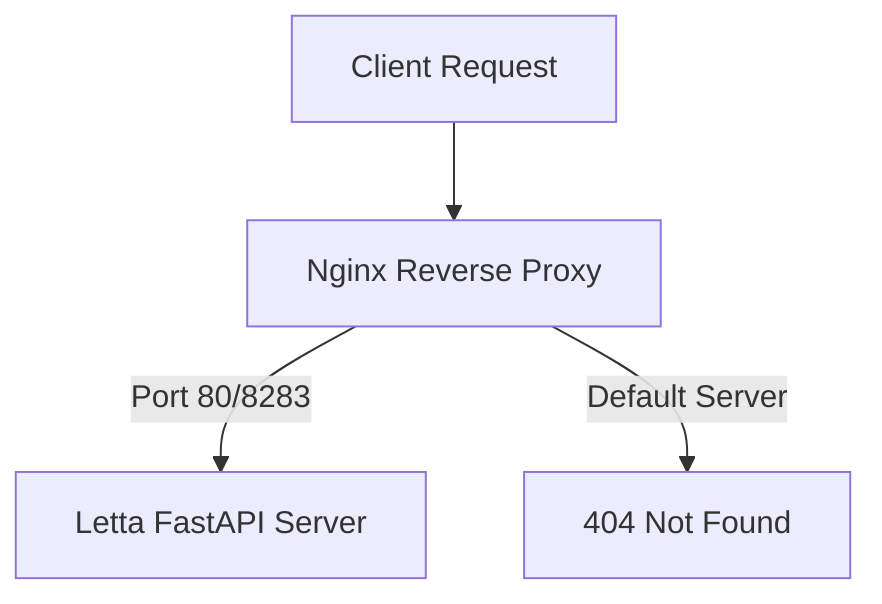
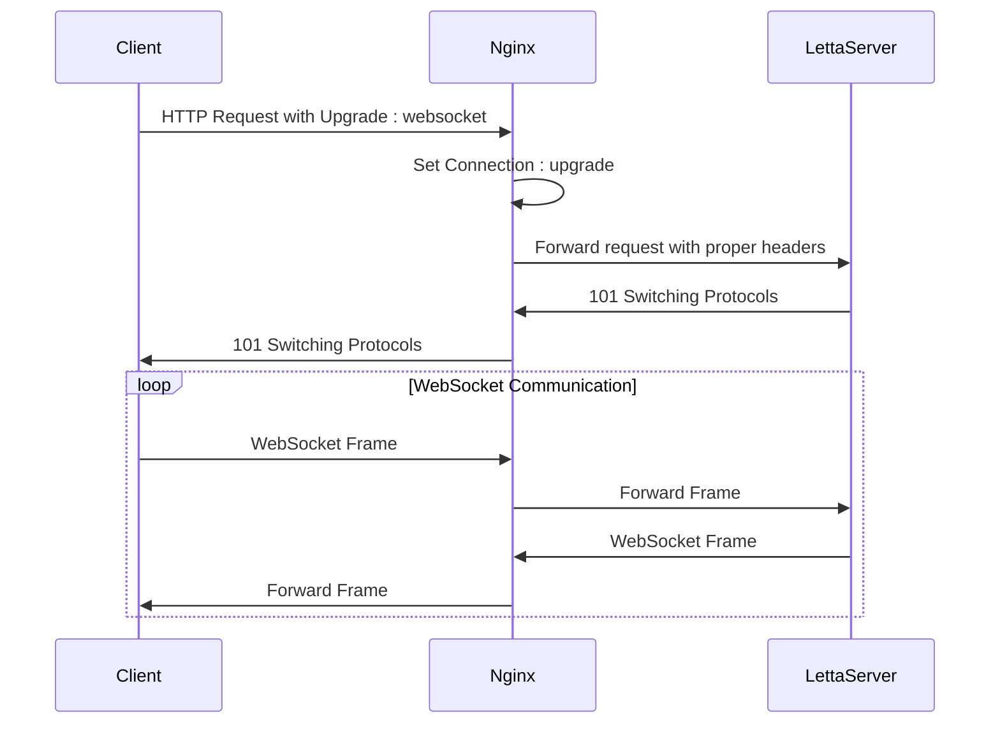

# Reverse Proxy Configuration

<cite>
**Referenced Files in This Document**   
- [nginx.conf](file://nginx.conf)
- [certs/README.md](file://certs/README.md)
- [letta/server/rest_api/app.py](file://letta/server/rest_api/app.py)
- [letta/server/constants.py](file://letta/server/constants.py)
- [letta/server/ws_api/server.py](file://letta/server/ws_api/server.py)
- [letta/settings.py](file://letta/settings.py)
</cite>

## Table of Contents
1. [Introduction](#introduction)
2. [Nginx Configuration Overview](#nginx-configuration-overview)
3. [HTTP/HTTPS Termination Setup](#httphttps-termination-setup)
4. [WebSocket Proxying Configuration](#websocket-proxying-configuration)
5. [Static File Serving and Location Directives](#static-file-serving-and-location-directives)
6. [Proxy Headers and Client Information](#proxy-headers-and-client-information)
7. [Performance Tuning Parameters](#performance-tuning-parameters)
8. [CORS and Security Configuration](#cors-and-security-configuration)
9. [Troubleshooting Common Issues](#troubleshooting-common-issues)
10. [Configuration Examples](#configuration-examples)

## Introduction
This document provides comprehensive guidance on configuring Nginx as a reverse proxy for the Letta FastAPI server. The reverse proxy serves as an intermediary between clients and the Letta application, handling HTTP/HTTPS termination, WebSocket connections, static file serving, and various performance and security optimizations. The configuration is designed to work within a Docker-based deployment environment, where Nginx routes requests to the Letta server container while providing additional layers of functionality and protection.

**Section sources**
- [nginx.conf](file://nginx.conf)

## Nginx Configuration Overview
The Nginx configuration in the Letta repository defines a reverse proxy setup that routes incoming requests to the FastAPI backend server. The configuration consists of two server blocks: one for handling requests to the Letta application and another for catching unmatched requests.

The primary server block listens on ports 80 and 8283 for both IPv4 and IPv6 connections, with the server name set to "letta.localhost". It uses a variable `$api_target` to define the upstream server as "http://letta-server:8283", which corresponds to the Docker service name and port. The location directive at the root path ("/") proxies all incoming requests to this target while preserving important headers.

A second server block acts as a catch-all, returning a 404 error for any requests that don't match the defined server names. This prevents unintended access to the service through alternative hostnames.



**Diagram sources**
- [nginx.conf](file://nginx.conf#L4-L27)

**Section sources**
- [nginx.conf](file://nginx.conf#L3-L28)

## HTTP/HTTPS Termination Setup
The Letta repository includes support for HTTPS termination through the use of locally generated SSL certificates. When the environment variable `LOCAL_HTTPS=true` is set, the system utilizes certificates from the certs/ directory to establish secure connections. These certificates are intended for development purposes and are created using the mkcert tool, which generates locally-trusted development certificates.

The SSL configuration allows developers to test the application over HTTPS in a local environment, simulating production-like security conditions. The certificates enable secure communication between the client and the Nginx reverse proxy, with the proxy then communicating with the backend FastAPI server over HTTP within the Docker network.

To set up HTTPS locally, users must install mkcert, run `mkcert -install` to configure the local CA, and then start Letta with the `LOCAL_HTTPS=true` environment variable. This triggers the use of the locally generated certificates for SSL termination at the Nginx layer.

**Section sources**
- [certs/README.md](file://certs/README.md)
- [nginx.conf](file://nginx.conf)

## WebSocket Proxying Configuration
The Nginx configuration includes specific directives to support WebSocket connections, which are essential for real-time communication with the Letta application. The configuration uses a map directive to properly handle the Upgrade and Connection headers required for WebSocket handshake negotiation.

The map block `map $http_upgrade $connection_upgrade` sets the connection upgrade value based on the presence of the Upgrade header. When the Upgrade header is present (indicating a WebSocket handshake attempt), the connection upgrade value is set to "upgrade"; otherwise, it's set to "close". This ensures proper protocol switching from HTTP to WebSocket.

The WebSocket API in Letta operates on a separate port (8282) from the REST API (8283), allowing for dedicated handling of real-time communication. The reverse proxy configuration ensures that WebSocket upgrade requests are properly forwarded to the backend server, maintaining the persistent connections required for streaming responses and real-time agent interactions.



**Diagram sources**
- [nginx.conf](file://nginx.conf#L19-L22)
- [letta/server/constants.py](file://letta/server/constants.py#L1-L2)
- [letta/server/ws_api/server.py](file://letta/server/ws_api/server.py)

**Section sources**
- [nginx.conf](file://nginx.conf#L19-L22)
- [letta/server/constants.py](file://letta/server/constants.py)

## Static File Serving and Location Directives
The Nginx configuration works in conjunction with the FastAPI application to serve static files and handle various location-based routing. While the primary location directive in nginx.conf proxies all requests to the backend server, the actual static file serving is handled by the FastAPI application through its static file mounting mechanism.

The FastAPI server mounts a static files directory that contains the frontend assets, including HTML, CSS, JavaScript, and image files. When requests are proxied through Nginx, they reach the FastAPI server which then serves the appropriate static content. The SPAStaticFiles class implements a single-page application pattern, where unmatched routes return the index.html file, enabling client-side routing.

This architecture allows Nginx to focus on its strengths as a reverse proxy and load balancer, while delegating static file serving to the application server. The separation of concerns ensures that both components can be optimized for their specific roles in the overall system architecture.

**Section sources**
- [letta/server/rest_api/static_files.py](file://letta/server/rest_api/static_files.py)
- [nginx.conf](file://nginx.conf)

## Proxy Headers and Client Information
The Nginx configuration includes several proxy_set_header directives that preserve important client information as requests are forwarded to the backend server. These headers ensure that the FastAPI application receives accurate information about the original client request, even though it's being proxied through Nginx.

The configuration sets three critical headers: Host, X-Forwarded-For, and X-Forwarded-Proto. The Host header is set to $host, preserving the original host requested by the client. The X-Forwarded-For header is set to $remote_addr, which contains the client's IP address, allowing the backend to identify the original requester. The X-Forwarded-Proto header is set to $scheme, indicating whether the original request was made over HTTP or HTTPS.

Additionally, the configuration includes a resolver directive pointing to 127.0.0.11, which is the Docker DNS server. This enables Nginx to resolve the hostname "letta-server" to the appropriate container IP address within the Docker network, facilitating service discovery in the containerized environment.

**Section sources**
- [nginx.conf](file://nginx.conf#L12-L16)

## Performance Tuning Parameters
While the current nginx.conf file doesn't explicitly define advanced performance tuning parameters, the architecture supports various optimization strategies that can be implemented. The reverse proxy setup inherently provides performance benefits by offloading SSL termination, connection management, and static file serving from the application server.

In a production environment, additional performance tuning parameters could be implemented, such as keepalive connections to reduce connection overhead, gzip compression to reduce payload sizes, and appropriate client_max_body_size settings to handle large file uploads. The configuration could also include caching directives to improve response times for frequently accessed resources.

The current setup focuses on reliability and correctness, ensuring that all requests are properly forwarded to the backend server with the necessary headers and protocol support. Performance optimizations can be added based on specific deployment requirements and traffic patterns.

**Section sources**
- [nginx.conf](file://nginx.conf)

## CORS and Security Configuration
The Letta application implements CORS (Cross-Origin Resource Sharing) through FastAPI's CORSMiddleware, which works in conjunction with the Nginx reverse proxy. The CORS configuration is managed through the settings.py file, where acceptable origins are defined and can be extended via environment variables.

The FastAPI application includes CORSMiddleware with origins specified in the settings, allowing controlled access from designated domains. This is particularly important for the web interface, which may need to make API requests from different domains or subdomains. The configuration can be extended by setting the ACCEPTABLE_ORIGINS environment variable, which allows for flexible deployment scenarios.

Security is further enhanced by the reverse proxy architecture, which hides the internal server structure from external clients. The Nginx configuration acts as a first line of defense, filtering and normalizing requests before they reach the application server. Additional security measures, such as rate limiting and request validation, can be implemented at the proxy level to protect against various types of attacks.

**Section sources**
- [letta/server/rest_api/app.py](file://letta/server/rest_api/app.py#L24)
- [letta/settings.py](file://letta/settings.py)

## Troubleshooting Common Issues
When working with the Nginx reverse proxy configuration for Letta, several common issues may arise that require troubleshooting. Understanding these issues and their solutions is essential for maintaining a reliable deployment.

**502 Bad Gateway Errors**: These typically occur when Nginx cannot connect to the upstream server. Verify that the letta-server container is running and accessible at port 8283. Check the Docker network configuration and ensure that the service name "letta-server" is resolvable by Nginx.

**WebSocket Handshake Failures**: If WebSocket connections are failing, ensure that the Upgrade and Connection headers are properly configured in the Nginx configuration. Verify that the map directive for $connection_upgrade is correctly set and that the WebSocket server is running on the expected port (8282).

**Stalled Requests**: These may occur due to buffering issues or timeout settings. Check that the proxy configuration properly handles streaming responses from the FastAPI server, particularly for endpoints that return Server-Sent Events (SSE) or other streaming data.

**SSL/TLS Issues**: When using HTTPS with locally generated certificates, ensure that mkcert is properly installed and configured. Verify that the LOCAL_HTTPS environment variable is set correctly and that the certificates are available in the expected location.

**CORS Errors**: If encountering CORS-related issues, verify that the ACCEPTABLE_ORIGINS environment variable includes the domains from which requests are being made. Check the browser's developer console for specific CORS error messages and adjust the CORS configuration accordingly.

**Section sources**
- [nginx.conf](file://nginx.conf)
- [certs/README.md](file://certs/README.md)
- [letta/server/rest_api/app.py](file://letta/server/rest_api/app.py)

## Configuration Examples
The following examples illustrate common configuration patterns for the Letta reverse proxy setup:

**Domain Routing**: To route requests from a specific domain to the Letta application, modify the server_name directive:
```
server_name app.letta.com;
```

**Subdirectory Deployment**: For deploying Letta under a subdirectory, use a location block:
```
location /letta/ {
    proxy_pass http://letta-server:8283/;
    proxy_set_header Host $host;
    proxy_set_header X-Forwarded-For $remote_addr;
}
```

**CORS Header Injection**: The FastAPI application automatically handles CORS through middleware, but additional headers can be added at the proxy level if needed:
```
add_header Access-Control-Allow-Origin "https://app.letta.com";
add_header Access-Control-Allow-Credentials "true";
```

These examples demonstrate the flexibility of the Nginx configuration in adapting to different deployment scenarios while maintaining the core functionality of the reverse proxy.

**Section sources**
- [nginx.conf](file://nginx.conf)
- [letta/server/rest_api/app.py](file://letta/server/rest_api/app.py)