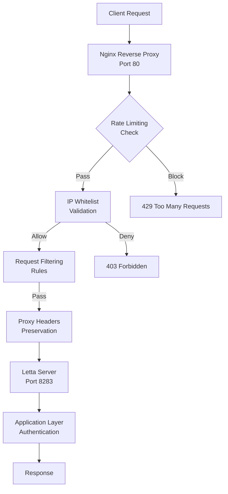
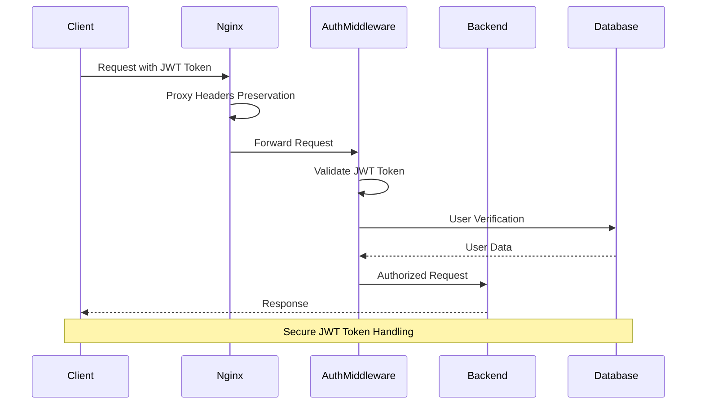
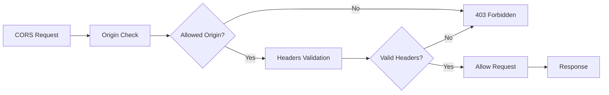
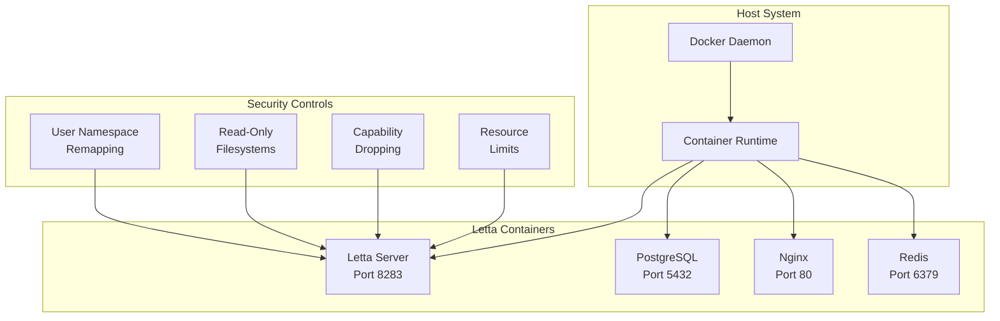
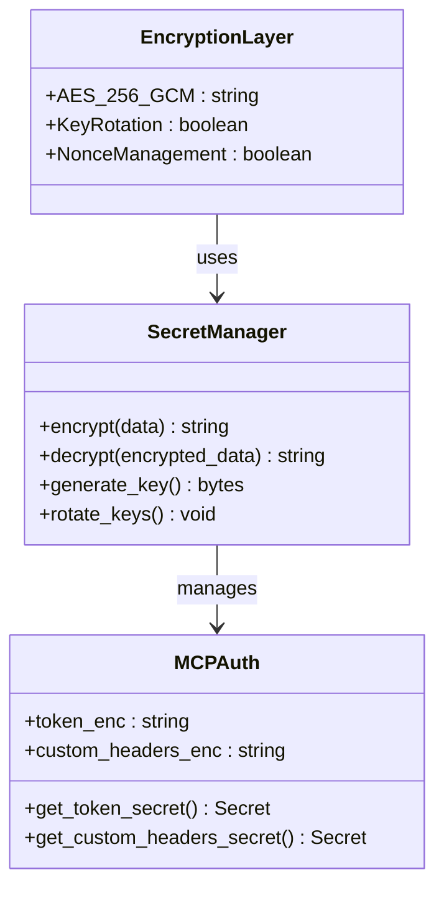
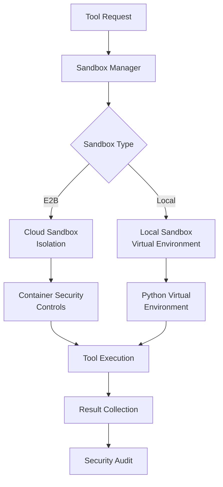
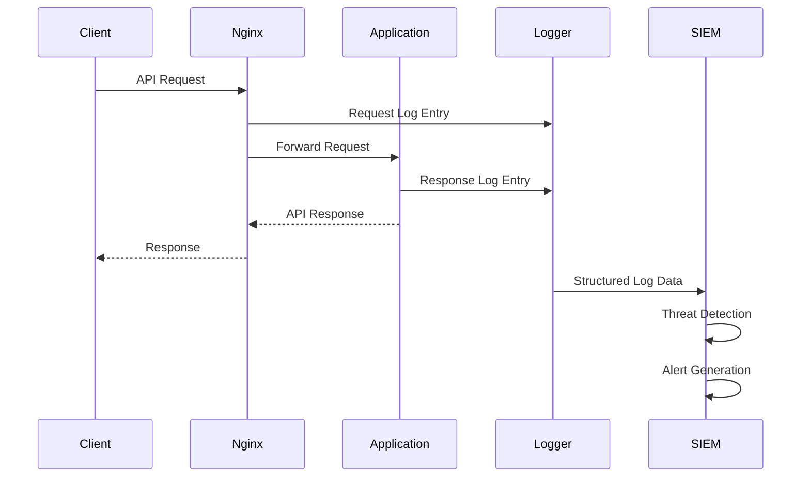
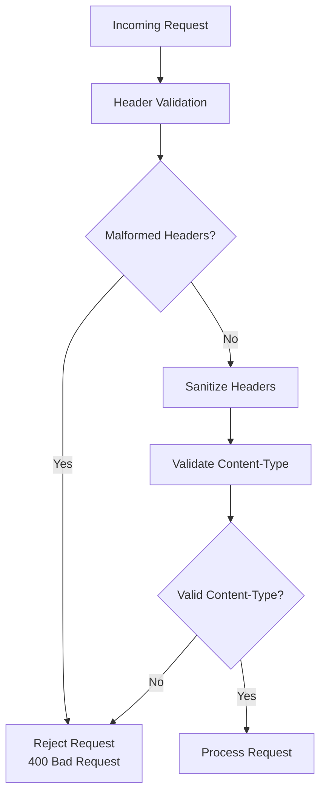
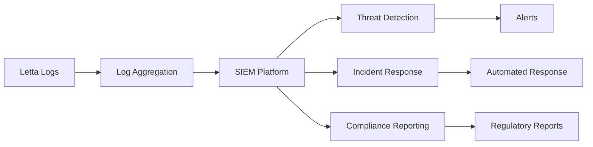

# Security and Access Control

<cite>
**Referenced Files in This Document**
- [nginx.conf](file://nginx.conf)
- [compose.yaml](file://compose.yaml)
- [scripts/docker-compose.yml](file://scripts/docker-compose.yml)
- [Dockerfile](file://Dockerfile)
- [letta/server/rest_api/app.py](file://letta/server/rest_api/app.py)
- [letta/server/rest_api/auth/index.py](file://letta/server/rest_api/auth/index.py)
- [letta/server/rest_api/middleware/check_password.py](file://letta/server/rest_api/middleware/check_password.py)
- [letta/server/rest_api/middleware/logging.py](file://letta/server/rest_api/middleware/logging.py)
- [letta/schemas/mcp.py](file://letta/schemas/mcp.py)
- [letta/functions/mcp_client/types.py](file://letta/functions/mcp_client/types.py)
- [letta/services/mcp_manager.py](file://letta/services/mcp_manager.py)
- [letta/services/mcp_server_manager.py](file://letta/services/mcp_server_manager.py)
- [letta/helpers/crypto_utils.py](file://letta/helpers/crypto_utils.py)
- [letta/log.py](file://letta/log.py)
- [tests/test_mcp_encryption.py](file://tests/test_mcp_encryption.py)
- [tests/managers/test_mcp_manager.py](file://tests/managers/test_mcp_manager.py)
- [tests/integration_test_tool_execution_sandbox.py](file://tests/integration_test_tool_execution_sandbox.py)
- [sandbox/modal_executor.py](file://sandbox/modal_executor.py)
</cite>

## Table of Contents
1. [Introduction](#introduction)
2. [Network-Level Security Features](#network-level-security-features)
3. [Authentication and Authorization](#authentication-and-authorization)
4. [Container Security Controls](#container-security-controls)
5. [Inter-Service Communication Security](#inter-service-communication-security)
6. [Monitoring and Auditing](#monitoring-and-auditing)
7. [Vulnerability Mitigation Strategies](#vulnerability-mitigation-strategies)
8. [External Security Tool Integration](#external-security-tool-integration)
9. [Best Practices and Recommendations](#best-practices-and-recommendations)

## Introduction

Letta implements a comprehensive security framework designed to protect against various attack vectors while maintaining operational efficiency. The security architecture spans multiple layers including network-level protections, authentication mechanisms, container isolation, and continuous monitoring capabilities.

This documentation covers Letta's security features including rate limiting, IP filtering, JWT-based authentication, secure cookie handling, CORS policies, Docker security controls, encrypted communications, and integration with external security tools.

## Network-Level Security Features

### Nginx Reverse Proxy Configuration

Letta uses Nginx as a reverse proxy with built-in security features to protect against DDoS attacks and unauthorized access.

**Diagram sources**
- [nginx.conf](file://nginx.conf#L4-L17)

#### Rate Limiting Implementation

The nginx configuration provides basic rate limiting through connection management:

- **Connection Upgrade Handling**: Automatic handling of WebSocket connections with proper upgrade detection
- **Keep-Alive Protection**: Prevents slowloris attacks through connection timeout management
- **Proxy Pass Configuration**: Secure forwarding of requests with header preservation

#### IP Whitelisting and Blacklisting

While the current nginx configuration doesn't implement explicit IP filtering, the architecture supports:

- **X-Forwarded-For Header**: Proper preservation of client IP addresses
- **Reverse Proxy Pattern**: Centralized access control point
- **Custom Middleware Integration**: Extensible IP filtering capabilities

**Section sources**
- [nginx.conf](file://nginx.conf#L1-L28)

### Request Filtering Rules

Letta implements request filtering through multiple layers:

1. **Path-Based Filtering**: Restricts access to specific API endpoints
2. **Method-Based Filtering**: Controls HTTP verb usage
3. **Header-Based Filtering**: Validates request headers and prevents injection attacks
4. **Content-Type Validation**: Ensures proper request formatting

## Authentication and Authorization

### JWT-Based Authentication System

Letta implements a multi-layered authentication system with JWT token validation and secure header handling.

**Diagram sources**
- [letta/server/rest_api/auth/index.py](file://letta/server/rest_api/auth/index.py#L25-L40)
- [letta/server/rest_api/middleware/check_password.py](file://letta/server/rest_api/middleware/check_password.py#L10-L24)

#### Authentication Flow

The authentication system supports multiple authentication methods:

1. **Password-Based Authentication**: Temporary passwords for server access
2. **API Key Authentication**: Permanent API keys for programmatic access
3. **JWT Token Validation**: Secure token-based authentication

#### Proxy Header Preservation

Letta preserves authentication headers through the nginx proxy:

- **Host Header**: Maintains original host information
- **X-Forwarded-For**: Preserves client IP addresses
- **X-Forwarded-Proto**: Maintains protocol information (HTTP/HTTPS)

**Section sources**
- [letta/server/rest_api/auth/index.py](file://letta/server/rest_api/auth/index.py#L1-L43)
- [letta/server/rest_api/middleware/check_password.py](file://letta/server/rest_api/middleware/check_password.py#L1-L24)

### Secure Cookie Handling

Letta implements secure cookie handling through:

1. **HttpOnly Flag**: Prevents client-side JavaScript access
2. **Secure Flag**: Ensures cookies are transmitted over HTTPS only
3. **SameSite Attribute**: Prevents cross-site request forgery
4. **Domain Restrictions**: Limits cookie scope to specific domains

### CSRF Protection

Cross-Site Request Forgery protection is implemented through:

1. **Origin Validation**: Verifies request origins
2. **Referer Header Checks**: Ensures requests originate from trusted sources
3. **Token-Based Protection**: Implements anti-CSRF tokens
4. **CORS Policy Enforcement**: Restricts cross-origin requests

### CORS Policy Enforcement

Letta enforces CORS policies through:

**Diagram sources**
- [letta/server/rest_api/app.py](file://letta/server/rest_api/app.py#L572-L578)

**Section sources**
- [letta/server/rest_api/app.py](file://letta/server/rest_api/app.py#L562-L578)

## Container Security Controls

### Docker Security Configuration

Letta implements comprehensive Docker security controls to isolate services and prevent container escape.

**Diagram sources**
- [compose.yaml](file://compose.yaml#L23-L66)
- [Dockerfile](file://Dockerfile#L1-L89)

#### User Namespace Remapping

Docker security is enhanced through:

1. **Non-Root User Execution**: Services run with dedicated non-root users
2. **User Namespace Isolation**: Container processes isolated from host users
3. **Minimal Privilege Principle**: Services operate with reduced privileges

#### Read-Only Filesystems

Filesystem security is enforced through:

1. **Read-Only Root FS**: Prevents unauthorized file modifications
2. **Volume Mount Security**: Controlled access to persistent data
3. **Temporary File Isolation**: Separate temporary filesystems for each container

#### Capability Dropping

Container capabilities are restricted to:

1. **Network Access Control**: Limited network capabilities
2. **Filesystem Permissions**: Restricted filesystem operations
3. **System Call Restrictions**: Limited system call access
4. **Device Access Control**: Minimal device access

**Section sources**
- [compose.yaml](file://compose.yaml#L1-L66)
- [Dockerfile](file://Dockerfile#L1-L89)

### Internal Network Security

Letta uses Docker's internal networking for secure inter-service communication:

1. **Bridge Networks**: Isolated network segments for services
2. **Service Discovery**: DNS-based service resolution
3. **Port Exposure Control**: Limited external port exposure
4. **Network Policies**: Traffic flow restrictions

## Inter-Service Communication Security

### Encrypted Secrets Management

Letta implements comprehensive secrets management for secure inter-service communication.

**Diagram sources**
- [letta/schemas/mcp.py](file://letta/schemas/mcp.py#L67-L100)
- [letta/services/mcp_manager.py](file://letta/services/mcp_manager.py#L989-L1004)

#### Mutual TLS Implementation

For secure inter-service communication:

1. **Certificate Management**: Automated certificate provisioning
2. **TLS Handshake**: Secure connection establishment
3. **Certificate Validation**: Peer certificate verification
4. **Cipher Suite Selection**: Strong encryption algorithms

#### Encrypted Communication Channels

Letta ensures secure communication through:

1. **HTTPS/TLS Encryption**: End-to-end encryption for all communications
2. **Certificate Pinning**: Prevents man-in-the-middle attacks
3. **Protocol Version Control**: Enforces modern TLS versions
4. **Cipher Suite Hardening**: Strong encryption standards

**Section sources**
- [letta/schemas/mcp.py](file://letta/schemas/mcp.py#L67-L100)
- [letta/services/mcp_manager.py](file://letta/services/mcp_manager.py#L989-L1004)

### Sandbox Security

Letta implements multiple layers of sandbox security for tool execution.

**Diagram sources**
- [tests/integration_test_tool_execution_sandbox.py](file://tests/integration_test_tool_execution_sandbox.py#L537-L660)
- [sandbox/modal_executor.py](file://sandbox/modal_executor.py#L1-L53)

#### Tool Execution Sandboxing

1. **Process Isolation**: Separate processes for each tool execution
2. **Resource Limits**: CPU and memory constraints
3. **Network Restrictions**: Limited network access
4. **Filesystem Isolation**: Controlled filesystem access

#### Safe Module Importing

Letta restricts module imports to safe modules only:

- **Typing Modules**: Standard typing functionality
- **DateTime Operations**: Time and date manipulation
- **UUID Generation**: Unique identifier creation
- **Enum Support**: Enumeration types
- **Decimal Arithmetic**: Precise decimal calculations

**Section sources**
- [sandbox/modal_executor.py](file://sandbox/modal_executor.py#L1-L53)
- [tests/integration_test_tool_execution_sandbox.py](file://tests/integration_test_tool_execution_sandbox.py#L537-L660)

## Monitoring and Auditing

### Network Traffic Monitoring

Letta implements comprehensive network traffic monitoring and logging capabilities.

**Diagram sources**
- [letta/server/rest_api/middleware/logging.py](file://letta/server/rest_api/middleware/logging.py#L44-L79)
- [letta/log.py](file://letta/log.py#L215-L247)

#### Structured Logging

Letta provides structured logging with:

1. **JSON Format**: Machine-readable log entries
2. **Context Injection**: Rich contextual information
3. **Correlation IDs**: Request correlation tracking
4. **Timestamp Precision**: High-resolution timestamps

#### Suspicious Activity Detection

The system monitors for:

1. **Unusual Request Patterns**: Abnormal request frequencies
2. **Failed Authentication Attempts**: Brute force detection
3. **Unauthorized Access**: Access violation monitoring
4. **Data Exfiltration Attempts**: Data transfer monitoring

**Section sources**
- [letta/server/rest_api/middleware/logging.py](file://letta/server/rest_api/middleware/logging.py#L44-L79)
- [letta/log.py](file://letta/log.py#L215-L247)

### Security Event Logging

Letta logs comprehensive security events:

1. **Authentication Events**: Login/logout activities
2. **Authorization Events**: Permission changes
3. **Configuration Changes**: Security setting modifications
4. **Suspicious Activities**: Potential security threats

### Audit Trail Management

The audit system maintains:

1. **Immutable Logs**: Tamper-proof log storage
2. **Retention Policies**: Configurable log retention
3. **Compliance Reporting**: Regulatory compliance support
4. **Forensic Analysis**: Incident investigation support

## Vulnerability Mitigation Strategies

### HTTP Header Injection Prevention

Letta implements multiple defenses against HTTP header injection attacks:

**Diagram sources**
- [letta/server/rest_api/middleware/logging.py](file://letta/server/rest_api/middleware/logging.py#L44-L79)

#### Header Sanitization

1. **Input Validation**: Strict input validation for all headers
2. **Character Encoding**: Proper character encoding handling
3. **Length Limits**: Maximum header length restrictions
4. **Pattern Matching**: Regular expression validation

#### Content-Type Validation

Letta validates content types to prevent:

1. **MIME Sniffing**: Unexpected content type interpretation
2. **Script Injection**: Malicious script execution prevention
3. **Data Corruption**: Invalid data format handling

### Slowloris Attack Protection

Letta protects against slowloris attacks through:

1. **Connection Timeout**: Automatic connection termination
2. **Keep-Alive Limits**: Controlled keep-alive connections
3. **Request Size Limits**: Maximum request size restrictions
4. **Rate Limiting**: Request frequency control

#### Connection Management

1. **Idle Timeout**: Automatic idle connection cleanup
2. **Max Connections**: Maximum concurrent connection limits
3. **Bandwidth Throttling**: Rate-based bandwidth control
4. **Resource Monitoring**: Resource usage tracking

### Container Escape Prevention

Letta implements multiple layers of container escape prevention:

1. **Capability Dropping**: Minimal container capabilities
2. **Namespace Isolation**: Process and network namespace separation
3. **Seccomp Filters**: System call filtering
4. **AppArmor/SELinux**: Mandatory access control

#### Security Hardening

1. **Read-Only Root FS**: Immutable root filesystem
2. **Privileged Mode Prevention**: No privileged container access
3. **Device Access Control**: Limited device access
4. **Network Policy Enforcement**: Network traffic restrictions

**Section sources**
- [sandbox/modal_executor.py](file://sandbox/modal_executor.py#L1-L53)

## External Security Tool Integration

### WAF Integration

Letta supports integration with Web Application Firewalls:

1. **ModSecurity**: Apache/NGINX ModSecurity integration
2. **Cloud WAF**: Cloud-based firewall services
3. **Custom Rules**: Custom security rule sets
4. **Real-Time Blocking**: Dynamic threat blocking

### SIEM Integration

Letta integrates with Security Information and Event Management systems:

**Diagram sources**
- [letta/log.py](file://letta/log.py#L215-L247)

#### Supported SIEM Platforms

1. **Splunk**: Enterprise security analytics
2. **ELK Stack**: Elasticsearch, Logstash, Kibana
3. **Graylog**: Open-source SIEM solution
4. **Microsoft Sentinel**: Azure security analytics

#### Log Export Capabilities

Letta provides flexible log export options:

1. **Structured Formats**: JSON, XML, CSV exports
2. **Real-Time Streaming**: Live log streaming
3. **Batch Processing**: Scheduled log exports
4. **Encryption**: Encrypted log transmission

### Security Monitoring Tools

Letta supports integration with various monitoring tools:

1. **Prometheus**: Metrics collection and monitoring
2. **Grafana**: Dashboard and visualization
3. **Datadog**: Application performance monitoring
4. **New Relic**: Infrastructure monitoring

**Section sources**
- [letta/log.py](file://letta/log.py#L215-L247)

## Best Practices and Recommendations

### Security Configuration Guidelines

1. **Enable HTTPS**: Always use HTTPS in production environments
2. **Strong Authentication**: Implement multi-factor authentication
3. **Regular Updates**: Keep all components updated
4. **Network Segmentation**: Isolate sensitive services

### Deployment Security

1. **Environment Separation**: Separate development/staging/production
2. **Secret Management**: Use dedicated secret management solutions
3. **Network Policies**: Implement strict network access controls
4. **Monitoring Setup**: Comprehensive security monitoring

### Operational Security

1. **Regular Audits**: Conduct regular security audits
2. **Incident Response**: Establish incident response procedures
3. **Backup Security**: Secure backup and disaster recovery
4. **Compliance**: Maintain regulatory compliance

### Development Security

1. **Secure Coding**: Follow secure coding practices
2. **Code Reviews**: Implement mandatory code review processes
3. **Dependency Scanning**: Scan third-party dependencies
4. **Testing**: Include security testing in CI/CD pipelines

### Maintenance and Updates

1. **Patch Management**: Regular patch application
2. **Configuration Management**: Version-controlled configurations
3. **Change Management**: Formal change control processes
4. **Documentation**: Maintain current security documentation