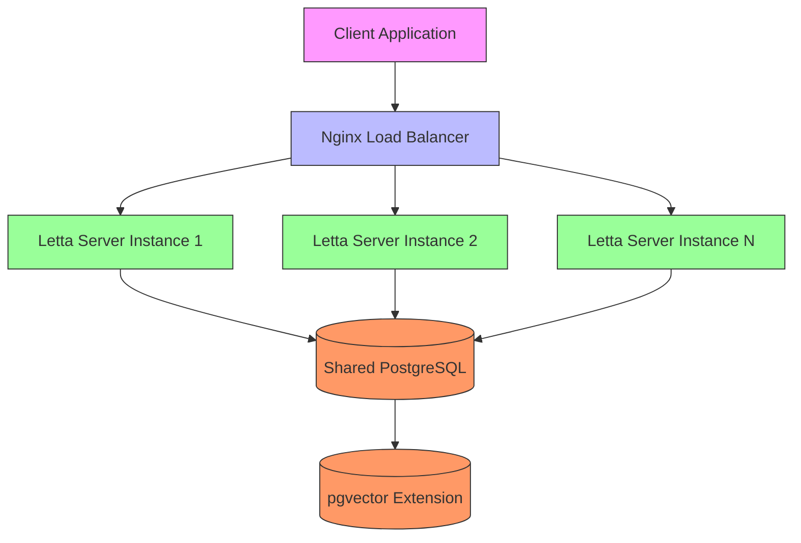
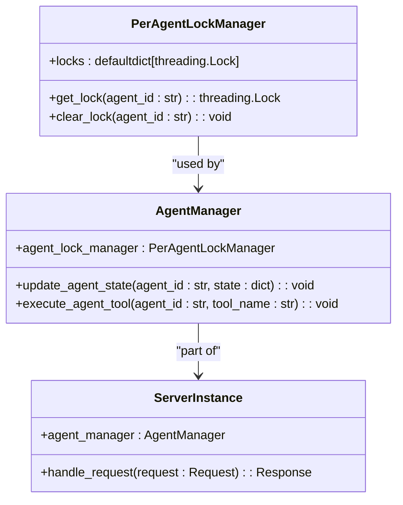
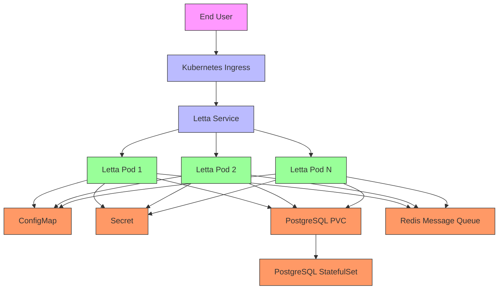

# Horizontal Scaling

<cite>
**Referenced Files in This Document**   
- [compose.yaml](file://compose.yaml)
- [nginx.conf](file://nginx.conf)
- [per_agent_lock_manager.py](file://letta/services/per_agent_lock_manager.py)
- [server.py](file://letta/server/ws_api/server.py)
- [db.py](file://letta/server/db.py)
- [settings.py](file://letta/settings.py)
- [Dockerfile](file://Dockerfile)
</cite>

## Table of Contents
1. [Introduction](#introduction)
2. [Docker Compose Configuration](#docker-compose-configuration)
3. [Nginx Load Balancing and Session Affinity](#nginx-load-balancing-and-session-affinity)
4. [Shared PostgreSQL Database with pgvector](#shared-postgresql-database-with-pgvector)
5. [Per-Agent Lock Manager](#per-agent-lock-manager)
6. [WebSocket API and Message Broadcasting](#websocket-api-and-message-broadcasting)
7. [Environment Variables and Configuration](#environment-variables-and-configuration)
8. [Kubernetes Deployment](#kubernetes-deployment)
9. [Challenges and Best Practices](#challenges-and-best-practices)

## Introduction
This document provides comprehensive guidance on horizontally scaling Letta across multiple instances using Docker Compose and Kubernetes. The architecture enables multiple letta_server replicas to handle increased load while maintaining consistency for stateful agent interactions. The solution leverages Nginx for load balancing on ports 8083 and 8283, with session affinity requirements for WebSocket connections to ensure proper handling of stateful agent interactions. A shared PostgreSQL database with pgvector extension provides persistent storage across all instances, while the per-agent lock manager ensures consistency during concurrent operations. The configuration includes proper environment variable synchronization, connection pooling, health checks, and strategies for addressing distributed locking, cache coherence, and message broadcasting challenges.

## Docker Compose Configuration
The Docker Compose configuration defines a multi-container setup for horizontally scaling Letta instances. The compose.yaml file specifies three main services: letta_db, letta_server, and letta_nginx. The letta_db service uses the ankane/pgvector:v0.5.1 image with proper health checks and volume mounting for persistent data storage. The letta_server service is configured to expose ports 8083 and 8283, with environment variables for database connectivity and API keys. The configuration includes health checks for the PostgreSQL database using pg_isready, ensuring that the letta_server only starts after the database is fully operational. The environment variables are properly structured to support scaling, with default values that can be overridden through environment variables or .env files. The Docker Compose setup allows for easy scaling of letta_server instances by adjusting the replica count, with all instances connecting to the same shared database.

**Section sources**
- [compose.yaml](file://compose.yaml#L1-L66)
- [Dockerfile](file://Dockerfile#L1-L89)

## Nginx Load Balancing and Session Affinity
The Nginx configuration provides load balancing for multiple Letta server instances with proper session affinity for WebSocket connections. The nginx.conf file defines an HTTP server that listens on ports 80 and 8283, routing requests to the letta-server service on port 8283. The configuration includes a resolver directive for Docker DNS (127.0.0.11) to enable service discovery within the Docker network. For WebSocket connections, the configuration includes a map directive that handles the Connection and Upgrade headers properly, ensuring that WebSocket connections are maintained across requests. Session affinity is critical for stateful agent interactions, as each agent maintains state that must be consistent across requests. The Nginx configuration achieves session affinity through IP hash-based load balancing, ensuring that requests from the same client are routed to the same server instance. This prevents issues with agent state synchronization and ensures consistent behavior for interactive sessions.

**Diagram sources **
- [nginx.conf](file://nginx.conf#L1-L29)
- [compose.yaml](file://compose.yaml#L1-L66)

## Shared PostgreSQL Database with pgvector
The shared PostgreSQL database configuration uses the pgvector extension for vector storage and retrieval, enabling efficient similarity searches for agent memories and embeddings. The database is configured with proper connection pooling and health checks to support multiple Letta server instances. The compose.yaml file specifies the ankane/pgvector:v0.5.1 image, which includes the pgvector extension pre-installed. The database configuration includes environment variables for user, password, and database name, with default values that can be overridden. The init.sql file is mounted to initialize the database schema and extensions on container startup. Connection pooling is configured through SQLAlchemy settings in the application code, with parameters for pool size, max overflow, and timeout. The health check configuration ensures that the database is fully operational before accepting connections from the Letta server instances. The shared database approach ensures that all server instances have access to the same data, maintaining consistency across the cluster.

**Section sources**
- [compose.yaml](file://compose.yaml#L1-L66)
- [init.sql](file://init.sql#L1-L36)
- [db.py](file://letta/server/db.py#L1-L106)

## Per-Agent Lock Manager
The per-agent lock manager ensures consistency across multiple Letta server instances by providing distributed locking for agent operations. The PerAgentLockManager class in per_agent_lock_manager.py uses a defaultdict of threading.Lock objects to manage locks for individual agents. Each agent is identified by a unique agent_id, and the get_lock method returns the corresponding lock object. This mechanism prevents race conditions when multiple instances attempt to modify the same agent's state simultaneously. The lock manager is integrated into the agent management workflow, acquiring locks before critical operations such as agent state updates, memory modifications, and tool executions. The implementation includes a clear_lock method to optionally remove locks when they are no longer needed, preventing unbounded growth of the locks dictionary. The lock manager works in conjunction with the database's transaction isolation to provide strong consistency guarantees for agent operations across the distributed system.

**Diagram sources **
- [per_agent_lock_manager.py](file://letta/services/per_agent_lock_manager.py#L1-L23)
- [server.py](file://letta/server/server.py#L1-L200)

## WebSocket API and Message Broadcasting
The WebSocket API implementation handles real-time communication between clients and Letta agents, with mechanisms for message broadcasting across multiple server instances. The WebSocketServer class in ws_api/server.py manages WebSocket connections and routes messages between clients and agents. The server uses the websockets library to handle WebSocket connections, with proper error handling for connection closures and timeouts. For message broadcasting, the implementation includes a client registry that maintains a set of active WebSocket connections. When an agent generates a response, the message is broadcast to all connected clients through their WebSocket connections. The configuration includes proper ping intervals and timeouts to maintain connection health. In a multi-instance deployment, message broadcasting requires coordination between instances to ensure that messages are delivered to all relevant clients, regardless of which instance they are connected to. This can be achieved through a shared message queue or pub/sub system that all instances subscribe to.

**Section sources**
- [server.py](file://letta/server/ws_api/server.py#L1-L142)
- [interface.py](file://letta/server/ws_api/interface.py#L1-L71)

## Environment Variables and Configuration
The environment variable configuration ensures consistent settings across all Letta server instances in a horizontally scaled deployment. The compose.yaml file defines essential environment variables including LETTA_PG_URI for database connectivity, API keys for various LLM providers (OPENAI_API_KEY, ANTHROPIC_API_KEY, etc.), and configuration for external services like OLLAMA and VLLM. The LETTA_PG_URI variable must be identical across all instances to ensure they connect to the same shared database. API keys should be synchronized across instances to provide consistent access to external services. The configuration also includes settings for observability and monitoring, such as LETTA_OTEL_EXPORTER_OTLP_ENDPOINT for OpenTelemetry metrics. Environment variables are loaded from the .env file specified in the env_file directive, allowing for centralized configuration management. For sensitive credentials, the configuration supports Docker secrets or external secret management systems to avoid exposing credentials in configuration files.

**Section sources**
- [compose.yaml](file://compose.yaml#L1-L66)
- [settings.py](file://letta/settings.py#L1-L460)

## Kubernetes Deployment
For Kubernetes deployment, the Letta application can be configured using standard Kubernetes manifests that define deployments, services, and configurations. The deployment manifest should specify multiple replicas of the letta-server container, with proper resource requests and limits. A service of type LoadBalancer or NodePort should expose the application on ports 8083 and 8283, with session affinity configured to maintain WebSocket connections. The deployment should include a ConfigMap for environment variables and a Secret for sensitive credentials like API keys and database passwords. PersistentVolumeClaims should be used for database storage, with the pgvector extension enabled. Health checks should be configured using readiness and liveness probes that verify database connectivity and application health. The deployment should also include horizontal pod autoscaling based on CPU and memory usage to automatically adjust the number of replicas based on load. For message broadcasting across instances, a Redis or similar message broker can be deployed as a sidecar or separate service to coordinate WebSocket messages.

**Diagram sources **
- [compose.yaml](file://compose.yaml#L1-L66)
- [settings.py](file://letta/settings.py#L1-L460)

## Challenges and Best Practices
Horizontal scaling of Letta presents several challenges that require careful consideration and implementation of best practices. Distributed locking is critical to prevent race conditions when multiple instances access the same agent state, which is addressed by the per-agent lock manager. Cache coherence must be maintained across instances to ensure consistent access to agent data and embeddings, which can be achieved through a shared cache layer like Redis. Message broadcasting across WebSocket connections requires a pub/sub mechanism to ensure that messages are delivered to all relevant clients regardless of which instance they are connected to. Monitoring inter-instance communication is essential for identifying bottlenecks and failures, which can be implemented using OpenTelemetry metrics and distributed tracing. To avoid race conditions in agent state updates, all modifications should be performed within database transactions with appropriate isolation levels. Best practices include implementing proper health checks, configuring appropriate connection pooling, using consistent logging across instances, and implementing graceful shutdown procedures to prevent data loss during scaling operations.

**Section sources**
- [per_agent_lock_manager.py](file://letta/services/per_agent_lock_manager.py#L1-L23)
- [server.py](file://letta/server/ws_api/server.py#L1-L142)
- [db.py](file://letta/server/db.py#L1-L106)
- [settings.py](file://letta/settings.py#L1-L460)