# Performance Optimization

<cite>
**Referenced Files in This Document**
- [per_agent_lock_manager.py](file://letta/services/per_agent_lock_manager.py)
- [server.py](file://letta/server/server.py)
- [db_pool_monitoring.py](file://letta/otel/db_pool_monitoring.py)
- [sqlalchemy_instrumentation.py](file://letta/otel/sqlalchemy_instrumentation.py)
- [tracing.py](file://letta/otel/tracing.py)
- [streaming_response.py](file://letta/server/rest_api/streaming_response.py)
- [tool_execution_manager.py](file://letta/services/tool_executor/tool_execution_manager.py)
- [message_manager.py](file://letta/services/message_manager.py)
- [decorators.py](file://letta/helpers/decorators.py)
- [metric_registry.py](file://letta/otel/metric_registry.py)
- [tool_execution_helper.py](file://letta/helpers/tool_execution_helper.py)
- [base.py](file://letta/services/tool_sandbox/base.py)
</cite>

## Table of Contents
1. [Introduction](#introduction)
2. [Database Optimization](#database-optimization)
3. [Per-Agent Lock Management](#per-agent-lock-management)
4. [API Server Optimizations](#api-server-optimizations)
5. [Caching Strategies](#caching-strategies)
6. [Vector Database Operations](#vector-database-operations)
7. [Tool Execution Optimization](#tool-execution-optimization)
8. [Monitoring and Profiling](#monitoring-and-profiling)
9. [Performance Testing](#performance-testing)
10. [Best Practices](#best-practices)

## Introduction

Letta implements comprehensive performance optimization strategies across multiple layers of the system, from database operations to tool execution and API responses. This document covers the key performance optimization techniques, monitoring capabilities, and best practices for maximizing Letta's efficiency under load.

The performance optimization framework includes:
- PostgreSQL indexing strategies and connection pooling
- Per-agent locking mechanisms to prevent race conditions
- Request batching and response streaming
- Multi-level caching systems
- Vector database optimizations
- Tool execution parallelization
- Comprehensive monitoring with OpenTelemetry

## Database Optimization

### PostgreSQL Indexing Strategies

Letta employs sophisticated PostgreSQL indexing strategies to optimize high-frequency operations. The database schema includes numerous indexes designed for optimal query performance:

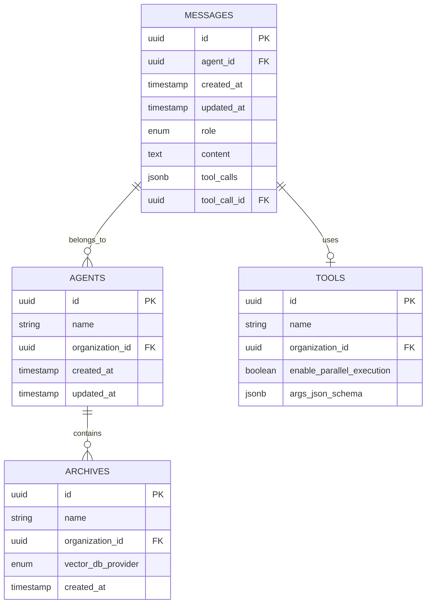

**Diagram sources**
- [message_manager.py](file://letta/services/message_manager.py#L1-L50)
- [agent_manager.py](file://letta/services/agent_manager.py)

#### Key Indexes and Their Performance Implications

| Index Type | Purpose | Performance Benefit |
|------------|---------|-------------------|
| `agent_id` | Message retrieval by agent | O(log n) lookup for agent-specific queries |
| `created_at` | Time-series data analysis | Efficient chronological queries |
| `tool_calls` | Tool execution tracking | Fast tool invocation lookups |
| `vector_db_provider` | Vector database routing | Optimal vector DB selection |

### Connection Pooling Configuration

Letta implements sophisticated connection pool monitoring and management:

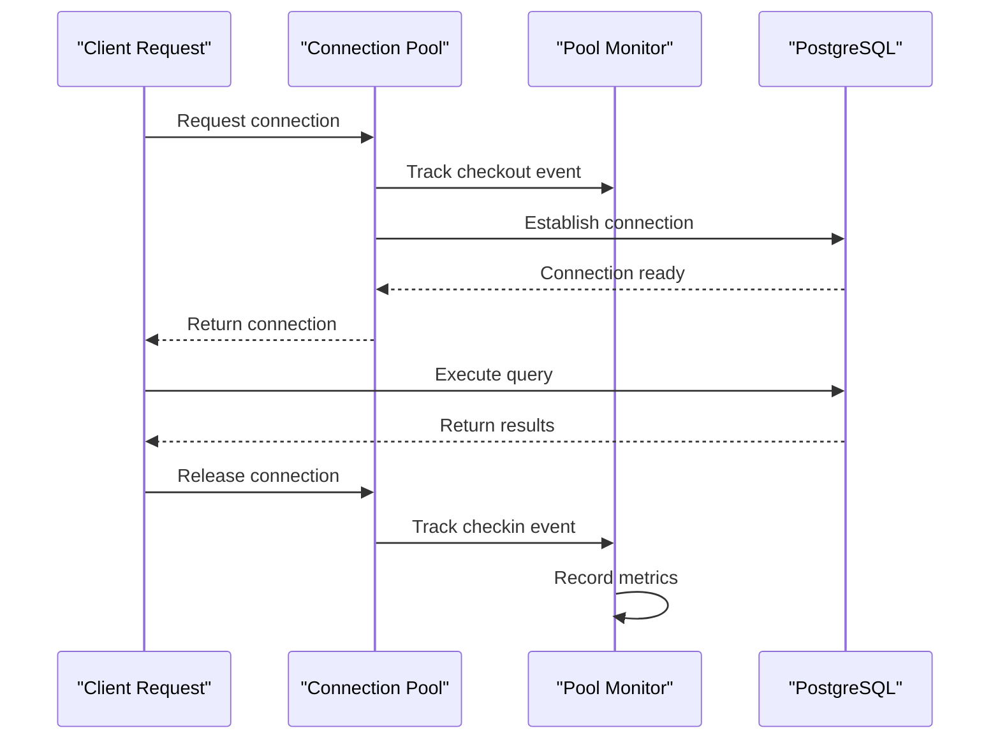

**Diagram sources**
- [db_pool_monitoring.py](file://letta/otel/db_pool_monitoring.py#L35-L150)

**Section sources**
- [db_pool_monitoring.py](file://letta/otel/db_pool_monitoring.py#L16-L310)

### Query Optimization for High-Frequency Operations

The system implements several query optimization techniques:

1. **Batch Operations**: Multiple message creations use batch processing
2. **Lazy Loading**: SQLAlchemy loader strategies minimize unnecessary joins
3. **Connection Reuse**: HTTPX client pools reduce SSL context creation
4. **Index-Only Scans**: Strategic index placement enables fast lookups

**Section sources**
- [message_manager.py](file://letta/services/message_manager.py#L444-L545)
- [server.py](file://letta/server/server.py#L187-L198)

## Per-Agent Lock Management

### Design and Implementation

The per-agent lock manager prevents race conditions during concurrent agent access through a thread-safe locking mechanism:

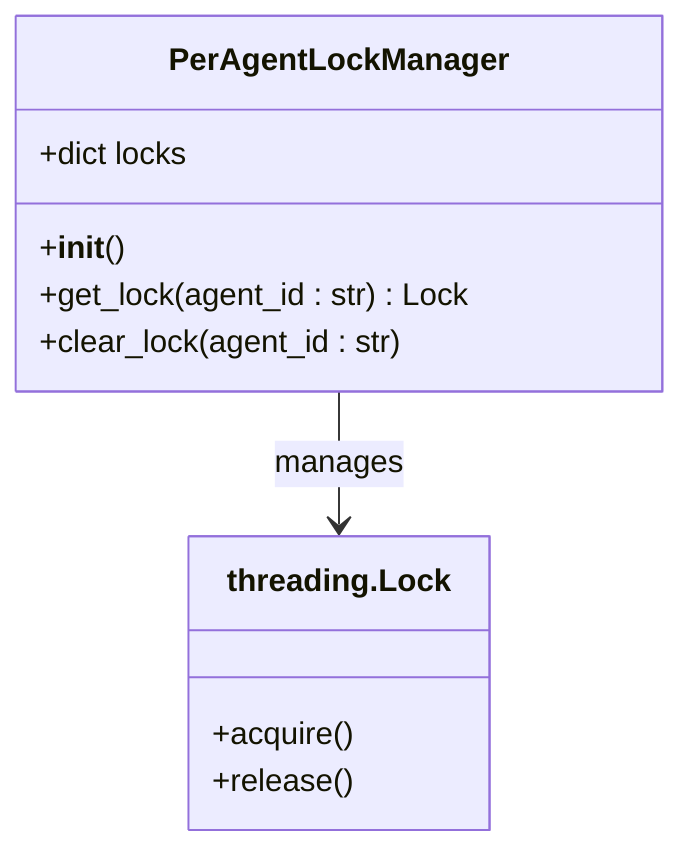

**Diagram sources**
- [per_agent_lock_manager.py](file://letta/services/per_agent_lock_manager.py#L7-L23)

### Lock Management Strategy

The lock manager uses a `defaultdict(threading.Lock)` approach for efficient memory usage and automatic lock creation:

| Operation | Complexity | Description |
|-----------|------------|-------------|
| Lock Acquisition | O(1) | Direct dictionary lookup |
| Lock Release | O(1) | Dictionary deletion |
| Memory Growth | O(n) | Linear with active agents |
| Thread Safety | O(1) | Built-in threading primitives |

### Performance Implications

1. **Race Condition Prevention**: Ensures atomic operations on agent state
2. **Memory Efficiency**: Automatic cleanup prevents unbounded growth
3. **Scalability**: Thread-safe design supports concurrent access
4. **Debugging**: Tracing integration aids performance analysis

**Section sources**
- [per_agent_lock_manager.py](file://letta/services/per_agent_lock_manager.py#L1-L23)

## API Server Optimizations

### Request Batching and Response Streaming

Letta implements sophisticated streaming and batching mechanisms for optimal performance:

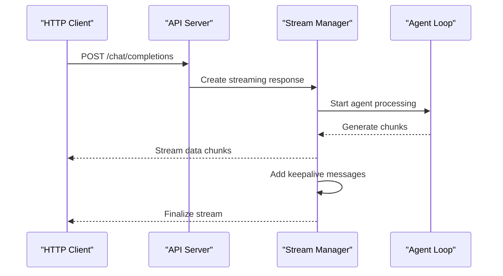

**Diagram sources**
- [streaming_response.py](file://letta/server/rest_api/streaming_response.py#L37-L170)

### Streaming Response Implementation

The streaming response system includes several performance optimizations:

| Feature | Implementation | Performance Benefit |
|---------|----------------|-------------------|
| Keepalive Messages | Periodic pings every 30s | Prevents connection timeouts |
| Cancellation Awareness | Real-time cancellation checks | Graceful termination |
| Buffer Management | Bounded queues prevent memory leaks | Controlled memory usage |
| Async Processing | Non-blocking I/O operations | Higher throughput |

### Memory Management Strategies

1. **Bounded Queues**: Prevent unbounded memory growth
2. **Async Task Management**: Proper cleanup of background tasks
3. **Connection Pooling**: Reuse HTTP connections
4. **Streaming Buffers**: Efficient data transmission

**Section sources**
- [streaming_response.py](file://letta/server/rest_api/streaming_response.py#L1-L349)
- [server.py](file://letta/server/server.py#L187-L198)

## Caching Strategies

### Multi-Level Caching Architecture

Letta implements a comprehensive caching system with multiple levels:

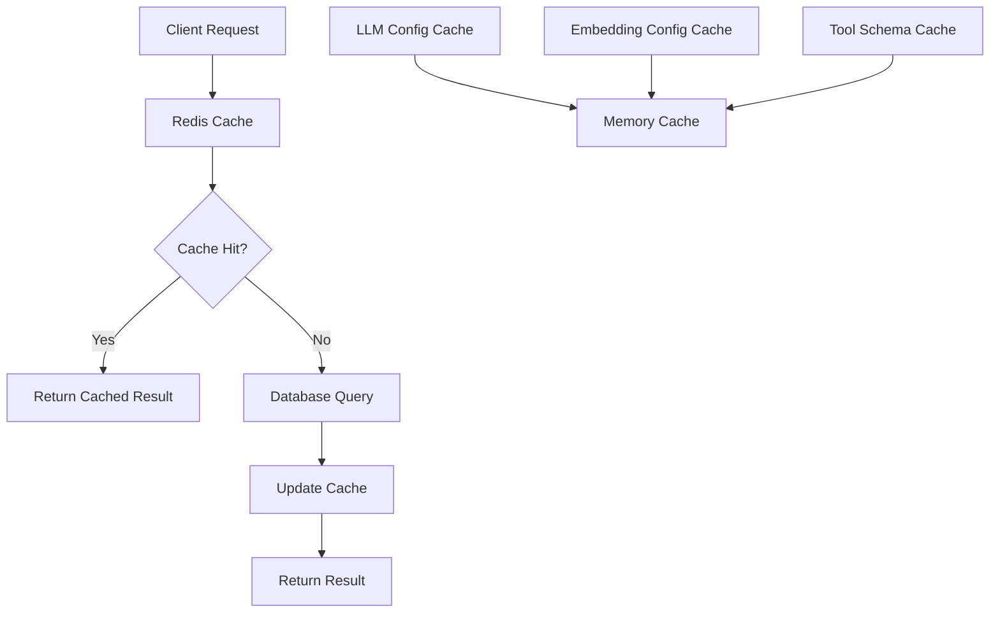

**Diagram sources**
- [decorators.py](file://letta/helpers/decorators.py#L90-L160)

### Cache Implementation Details

The caching system uses Redis for distributed caching with sophisticated key management:

| Cache Type | TTL | Key Strategy | Performance Impact |
|------------|-----|--------------|-------------------|
| LLM Config | 600s | Hash-based keys | Reduced config lookups |
| Embedding Config | 600s | Hash-based keys | Faster embedding operations |
| Tool Results | 300s | Function signature | Avoid repeated executions |
| User Sessions | 1800s | User ID prefix | Persistent user data |

### Cache Statistics and Monitoring

The system tracks cache performance metrics:

```python
@dataclass
class CacheStats:
    hits: int = 0
    misses: int = 0
    invalidations: int = 0
```

**Section sources**
- [decorators.py](file://letta/helpers/decorators.py#L78-L161)

## Vector Database Operations

### Vector Database Selection and Optimization

Letta supports multiple vector database providers with optimized query patterns:

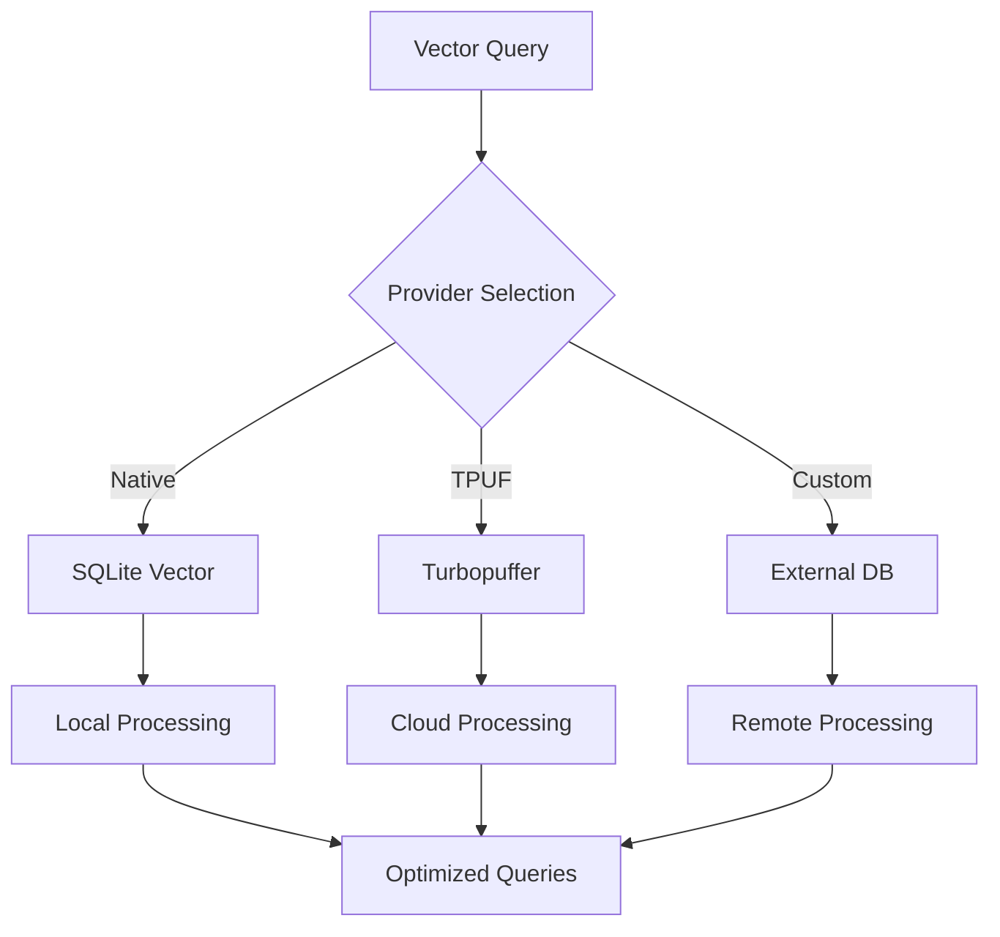

**Diagram sources**
- [sqlite_functions.py](file://letta/orm/sqlite_functions.py#L131-L189)

### Performance Optimization Techniques

1. **Cosine Distance Calculation**: Native SQLite vector operations
2. **Index Optimization**: Strategic vector indexing
3. **Batch Processing**: Bulk vector operations
4. **Provider Abstraction**: Optimal provider selection

### Vector Database Configuration

| Provider | Use Case | Performance Characteristics |
|----------|----------|---------------------------|
| NATIVE | Development/Small datasets | Low latency, local storage |
| TPUF | Production/High volume | Scalable, cloud-native |
| Custom | Enterprise solutions | Custom optimization |

**Section sources**
- [sqlite_functions.py](file://letta/orm/sqlite_functions.py#L131-L189)

## Tool Execution Optimization

### Parallel Tool Execution

Letta implements sophisticated parallel tool execution with intelligent scheduling:

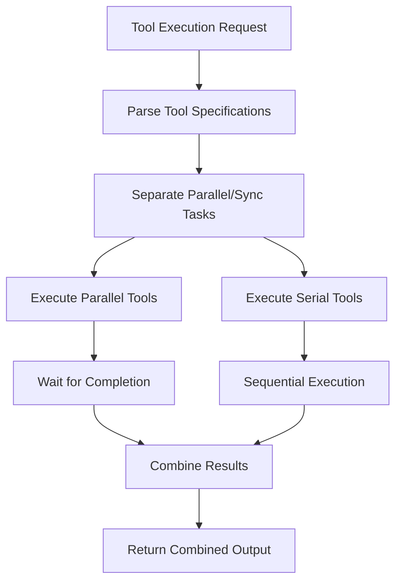

**Diagram sources**
- [letta_agent_v3.py](file://letta/agents/letta_agent_v3.py#L1028-L1049)

### Tool Sandbox Optimization

The tool execution system includes several performance optimizations:

| Optimization | Implementation | Benefit |
|--------------|----------------|---------|
| Async Detection | AST parsing for async functions | Optimal execution strategy |
| Environment Isolation | Sandboxed execution | Security and stability |
| Result Serialization | Pickle + Base64 encoding | Efficient result transmission |
| Resource Management | Automatic cleanup | Prevents resource leaks |

### Tool Execution Metrics

The system tracks comprehensive tool execution metrics:

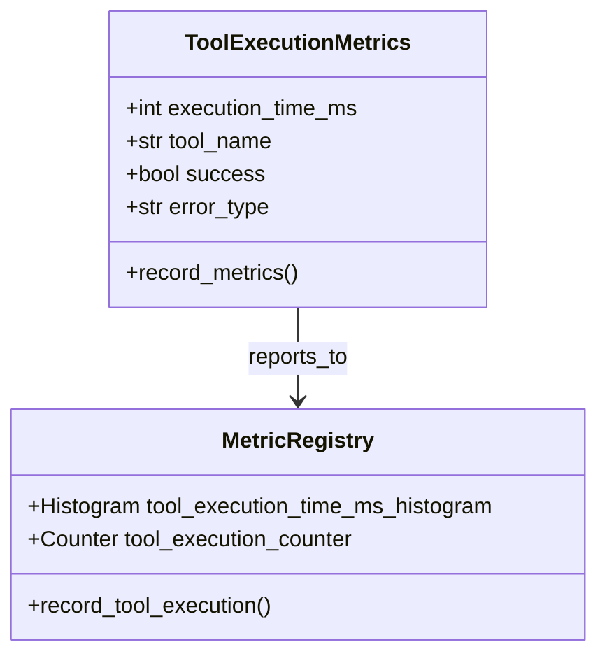

**Diagram sources**
- [tool_execution_manager.py](file://letta/services/tool_executor/tool_execution_manager.py#L95-L162)

**Section sources**
- [tool_execution_manager.py](file://letta/services/tool_executor/tool_execution_manager.py#L1-L162)
- [base.py](file://letta/services/tool_sandbox/base.py#L1-L398)

## Monitoring and Profiling

### OpenTelemetry Integration

Letta implements comprehensive monitoring using OpenTelemetry for performance analysis:

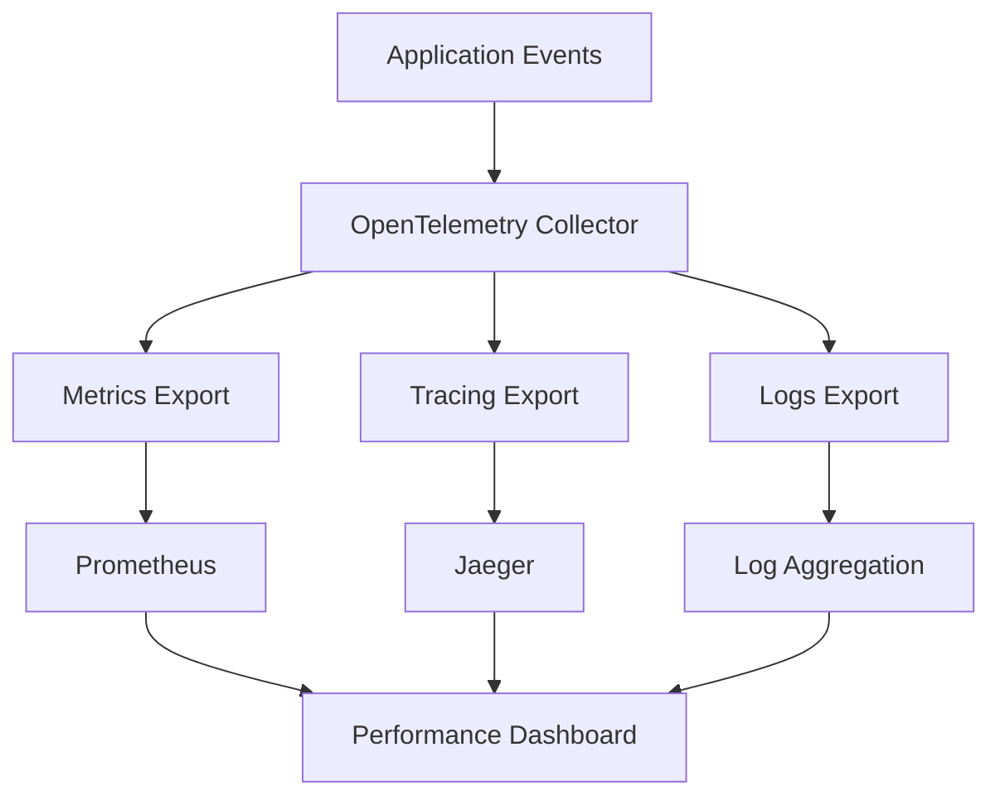

**Diagram sources**
- [tracing.py](file://letta/otel/tracing.py#L127-L208)

### Database Pool Monitoring

The database pool monitoring system tracks connection lifecycle events:

| Event Type | Metric | Performance Insight |
|------------|--------|-------------------|
| connect | Connection count | Pool utilization |
| checkout | Active connections | Request pressure |
| checkin | Available connections | Resource availability |
| invalidate | Error rate | Connection health |

### Performance Metrics Registry

Letta maintains a comprehensive metrics registry:

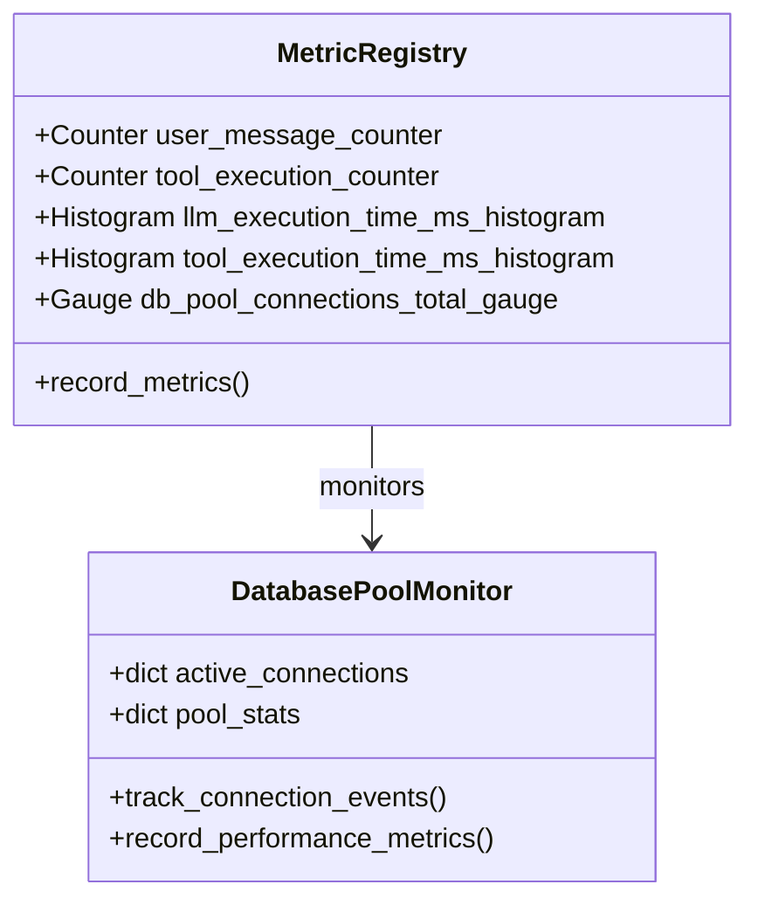

**Diagram sources**
- [metric_registry.py](file://letta/otel/metric_registry.py#L12-L276)

**Section sources**
- [db_pool_monitoring.py](file://letta/otel/db_pool_monitoring.py#L16-L310)
- [metric_registry.py](file://letta/otel/metric_registry.py#L1-L276)
- [tracing.py](file://letta/otel/tracing.py#L127-L446)

## Performance Testing

### Benchmarking Methodologies

Letta includes comprehensive performance testing frameworks:

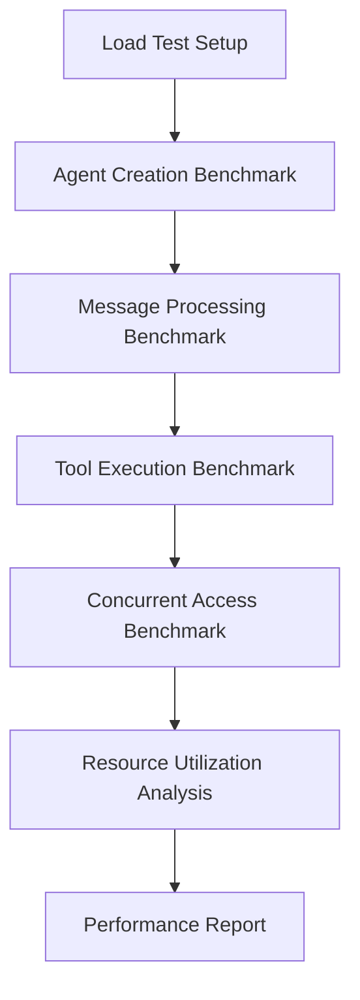

### Load Testing Patterns

| Test Type | Scenario | Performance Metric |
|-----------|----------|-------------------|
| Mass Agent Creation | Simultaneous agent creation | Throughput, latency |
| High-Volume Messaging | Concurrent message processing | QPS, memory usage |
| Tool Execution Stress | Parallel tool invocations | Execution time, error rate |
| Concurrent Access | Multiple users accessing same agent | Response time, contention |

### Bottleneck Identification

Common performance bottlenecks and their mitigation strategies:

1. **File Processing**: Asynchronous processing with progress tracking
2. **Tool Execution**: Parallel execution with resource limits
3. **Message Handling**: Streaming responses with buffering
4. **Vector Operations**: Indexed queries with batch processing

**Section sources**
- [test_agent_mass_update.py](file://tests/performance_tests/test_agent_mass_update.py#L90-L125)

## Best Practices

### Deployment Optimization

1. **Connection Pool Tuning**: Configure pool sizes based on workload
2. **Caching Strategy**: Implement multi-level caching for frequently accessed data
3. **Database Indexing**: Create indexes for frequently queried columns
4. **Monitoring Setup**: Deploy comprehensive monitoring with alerting

### Development Guidelines

1. **Async Programming**: Use async/await consistently for I/O operations
2. **Resource Management**: Implement proper cleanup for connections and sessions
3. **Error Handling**: Include retry logic for transient failures
4. **Performance Testing**: Regular load testing with realistic scenarios

### Production Considerations

1. **Horizontal Scaling**: Design for horizontal scaling across multiple instances
2. **Resource Limits**: Implement rate limiting and resource quotas
3. **Backup Strategies**: Regular backups with point-in-time recovery
4. **Security Hardening**: Secure configurations and access controls

### Monitoring and Alerting

1. **Key Metrics**: Track connection pool utilization, query performance, and error rates
2. **Alert Thresholds**: Set appropriate thresholds for performance degradation
3. **Capacity Planning**: Monitor trends to predict capacity requirements
4. **Incident Response**: Automated alerts with escalation procedures