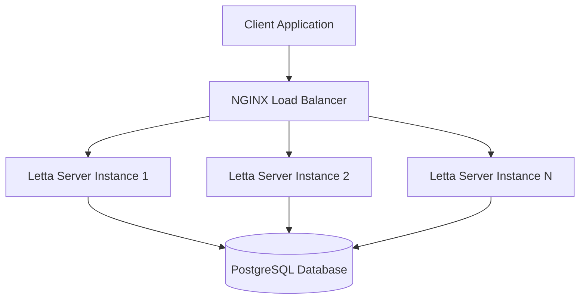
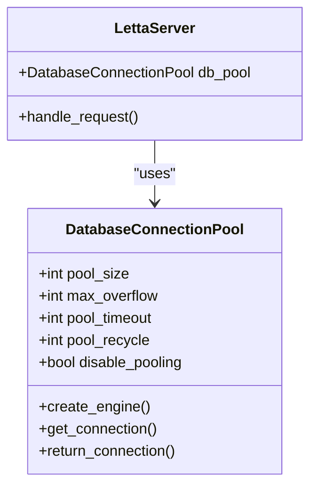
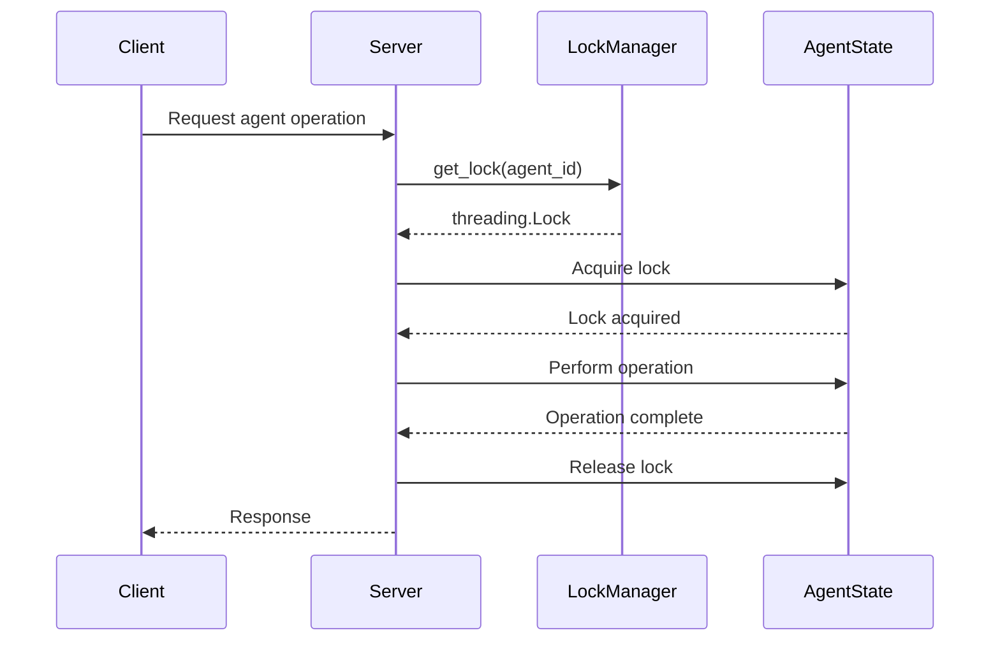

# Scaling Strategy

<cite>
**Referenced Files in This Document**   
- [Dockerfile](file://Dockerfile)
- [compose.yaml](file://compose.yaml)
- [dev-compose.yaml](file://dev-compose.yaml)
- [scripts/docker-compose.yml](file://scripts/docker-compose.yml)
- [nginx.conf](file://nginx.conf)
- [letta/server/server.py](file://letta/server/server.py)
- [letta/services/per_agent_lock_manager.py](file://letta/services/per_agent_lock_manager.py)
- [letta/settings.py](file://letta/settings.py)
- [letta/config.py](file://letta/config.py)
- [letta/server/db.py](file://letta/server/db.py)
</cite>

## Table of Contents
1. [Introduction](#introduction)
2. [Horizontal Scaling](#horizontal-scaling)
3. [Database Scaling](#database-scaling)
4. [Resource Allocation](#resource-allocation)
5. [Stateful Agent Architecture](#stateful-agent-architecture)
6. [Performance Benchmarks and Capacity Planning](#performance-benchmarks-and-capacity-planning)
7. [Auto-Scaling and Cost Optimization](#auto-scaling-and-cost-optimization)
8. [Common Scaling Challenges](#common-scaling-challenges)
9. [Conclusion](#conclusion)

## Introduction
Letta is a platform for creating stateful agents with persistent memory and context management. This document outlines comprehensive scaling strategies for Letta deployments, focusing on horizontal and vertical scaling approaches. The strategies cover API server scaling through Docker Compose and Kubernetes, database scaling options, resource allocation settings, and considerations for Letta's stateful agent architecture. The document also provides performance benchmarks, capacity planning guidelines, auto-scaling strategies, and solutions to common scaling challenges.

**Section sources**
- [README.md](file://README.md#L128-L135)

## Horizontal Scaling

### API Server Scaling with Docker Compose
Letta provides Docker Compose configurations for deploying and scaling API servers. The primary configuration file `compose.yaml` defines three services: `letta_db`, `letta_server`, and `letta_nginx`. The `letta_server` service is configured to run on ports 8083 and 8283, with environment variables for various LLM providers and telemetry endpoints.

The `dev-compose.yaml` file provides a development configuration that builds the Letta server from the Dockerfile with the `runtime` target. This configuration exposes the same ports and includes environment variables for debugging and LLM provider authentication.

For Redis integration, the `scripts/docker-compose.yml` file includes a Redis service that can be used for caching and session management. This configuration uses the `redis:alpine` image and exposes port 6379, with a data volume mounted at `./data/redis`.

### Load Balancing Configuration
The `nginx.conf` file configures NGINX as a reverse proxy and load balancer for the Letta API server. It listens on ports 80 and 8283, forwarding requests to the `letta-server` container on port 8283. The configuration includes settings for handling WebSocket upgrades and sets appropriate headers for forwarded requests.

**Diagram sources**
- [compose.yaml](file://compose.yaml#L1-L66)
- [nginx.conf](file://nginx.conf#L1-L29)

### Session Management Considerations
When scaling Letta horizontally, session management is critical due to the stateful nature of agents. The per-agent lock manager ensures that concurrent requests for the same agent are properly serialized. This prevents race conditions when multiple requests attempt to modify an agent's state simultaneously.

The `PerAgentLockManager` class in `letta/services/per_agent_lock_manager.py` uses a defaultdict of threading locks to manage locks for each agent. This ensures that operations on a specific agent are atomic and thread-safe.

**Section sources**
- [letta/services/per_agent_lock_manager.py](file://letta/services/per_agent_lock_manager.py#L1-L23)
- [nginx.conf](file://nginx.conf#L1-L29)

## Database Scaling

### Connection Pooling
Letta uses SQLAlchemy with asyncpg for PostgreSQL database connections. The connection pooling configuration is defined in `letta/settings.py` and `letta/server/db.py`. Key settings include:

- `pg_pool_size`: Number of concurrent connections (default: 25)
- `pg_max_overflow`: Overflow limit for connections (default: 10)
- `pg_pool_timeout`: Seconds to wait for a connection (default: 30)
- `pg_pool_recycle`: When to recycle connections (default: 1800 seconds)

The `disable_sqlalchemy_pooling` setting can be used to disable connection pooling, which may be necessary in certain deployment scenarios.

**Diagram sources**
- [letta/settings.py](file://letta/settings.py#L256-L263)
- [letta/server/db.py](file://letta/server/db.py#L26-L37)

### Read Replicas
While the current configuration does not explicitly define read replicas, the architecture supports read-write splitting through SQLAlchemy's routing capabilities. For high-read workloads, PostgreSQL read replicas can be configured by modifying the database URI settings to route read queries to replica instances.

### Sharding Strategies
Letta's data model is designed to support sharding by organization or project. The database schema includes organization_id and project_id fields on most entities, enabling horizontal partitioning of data. For large-scale deployments, data can be sharded across multiple PostgreSQL instances based on organization or project boundaries.

**Section sources**
- [letta/settings.py](file://letta/settings.py#L250-L263)
- [letta/server/db.py](file://letta/server/db.py#L16-L46)

## Resource Allocation

### Dockerfile Configuration
The `Dockerfile` defines a multi-stage build process for the Letta application. The builder stage installs Python and required packages, while the runtime stage includes Node.js, OpenTelemetry Collector, and other dependencies. Key resource-related configurations include:

- Python virtual environment setup
- Node.js installation (version 22 by default)
- OpenTelemetry Collector installation
- Environment variables for PostgreSQL connection

The Dockerfile exposes ports 8283 (API), 5432 (PostgreSQL), and 4317/4318 (OpenTelemetry).

### Docker Compose Resource Settings
Resource allocation in Docker Compose is configured through environment variables in the `compose.yaml` file. Key settings include:

- CPU and memory limits can be set using Docker Compose's resource constraints
- Environment variables for LLM providers (OpenAI, Anthropic, etc.)
- PostgreSQL connection settings
- OpenTelemetry endpoint configuration

For production deployments, resource limits should be set based on workload requirements and performance benchmarks.

**Section sources**
- [Dockerfile](file://Dockerfile#L1-L89)
- [compose.yaml](file://compose.yaml#L1-L66)

## Stateful Agent Architecture

### Per-Agent Lock Manager
The per-agent lock manager is a critical component for ensuring data consistency in a scaled environment. The `PerAgentLockManager` class provides thread-safe locks for each agent, preventing concurrent modifications to agent state.

When an agent is accessed, the lock manager retrieves or creates a lock for that agent ID. This ensures that operations on a specific agent are serialized, preventing race conditions and data corruption.

**Diagram sources**
- [letta/services/per_agent_lock_manager.py](file://letta/services/per_agent_lock_manager.py#L1-L23)

### Memory Management
Letta's memory management system handles both in-context and out-of-context memory. The core memory has character limits defined in `letta/constants.py`:

- `CORE_MEMORY_PERSONA_CHAR_LIMIT`: 20,000 characters
- `CORE_MEMORY_HUMAN_CHAR_LIMIT`: 20,000 characters
- `CORE_MEMORY_BLOCK_CHAR_LIMIT`: 20,000 characters

Archival memory has a token limit of 8,192 tokens, defined in `letta/settings.py` as `archival_memory_token_limit`. This limit prevents excessive memory usage and ensures performance.

**Section sources**
- [letta/services/per_agent_lock_manager.py](file://letta/services/per_agent_lock_manager.py#L1-L23)
- [letta/constants.py](file://letta/constants.py#L382-L384)
- [letta/settings.py](file://letta/settings.py#L353)

## Performance Benchmarks and Capacity Planning

### Benchmark Methodology
Performance benchmarks for Letta should measure key metrics including:

- Request latency (p50, p95, p99)
- Throughput (requests per second)
- Database connection pool utilization
- Memory usage per agent
- CPU utilization

The `tests/performance_tests/test_insert_archival_memory.py` file contains performance test code that measures the time to insert archival memory, providing a baseline for capacity planning.

### Capacity Planning Guidelines
Based on the configuration and architecture, the following capacity planning guidelines are recommended:

- **Small deployments (1-10 agents)**: Single server instance with 4GB RAM and 2 CPU cores
- **Medium deployments (10-100 agents)**: Two server instances with 8GB RAM and 4 CPU cores each, with a dedicated PostgreSQL instance
- **Large deployments (100+ agents)**: Multiple server instances with auto-scaling, read replicas for PostgreSQL, and Redis for caching

Database connection pool size should be adjusted based on the number of concurrent users and agents. The default pool size of 25 connections may need to be increased for high-concurrency scenarios.

**Section sources**
- [letta/settings.py](file://letta/settings.py#L256-L263)
- [tests/performance_tests/test_insert_archival_memory.py](file://tests/performance_tests/test_insert_archival_memory.py#L100-L185)

## Auto-Scaling and Cost Optimization

### Auto-Scaling Based on Load Metrics
Auto-scaling strategies for Letta should consider the following metrics:

- API request rate
- Database connection pool utilization
- Memory pressure
- CPU utilization
- Queue length for agent operations

Kubernetes Horizontal Pod Autoscaler (HPA) can be configured to scale Letta server instances based on these metrics. Custom metrics from OpenTelemetry can also be used to trigger scaling events.

### Cost Optimization Techniques
Cost optimization for Letta deployments includes:

- Right-sizing instances based on actual usage patterns
- Using spot instances for non-critical workloads
- Implementing connection pooling to reduce database costs
- Caching frequently accessed data in Redis
- Using read replicas to distribute read load and reduce primary database costs

The OpenTelemetry integration in Letta provides detailed metrics that can be used to identify cost optimization opportunities.

**Section sources**
- [letta/settings.py](file://letta/settings.py#L277-L288)
- [otel/](file://otel/)

## Common Scaling Challenges

### Database Bottlenecks
Common database bottlenecks in Letta deployments include:

- Connection pool exhaustion
- Slow queries on large agent histories
- Lock contention on frequently accessed agents
- Index fragmentation

Solutions include:
- Increasing connection pool size
- Adding database indexes on frequently queried fields
- Implementing query optimization
- Using read replicas for read-heavy workloads

### Memory Pressure
Memory pressure can occur due to:
- Large agent contexts
- High concurrency of agent operations
- Inefficient memory management

Solutions include:
- Implementing memory limits per agent
- Using efficient data structures
- Regularly monitoring memory usage
- Scaling vertically or horizontally as needed

**Section sources**
- [letta/settings.py](file://letta/settings.py#L256-L263)
- [letta/constants.py](file://letta/constants.py#L353)

## Conclusion
Scaling Letta deployments requires careful consideration of both horizontal and vertical scaling strategies. The platform's stateful agent architecture necessitates proper session management and locking mechanisms to ensure data consistency. Database scaling through connection pooling, read replicas, and sharding enables handling of large datasets and high concurrency. Resource allocation should be based on workload requirements and performance benchmarks, with auto-scaling and cost optimization techniques applied to maintain efficiency. By addressing common scaling challenges such as database bottlenecks and memory pressure, organizations can deploy Letta at scale while maintaining performance and reliability.