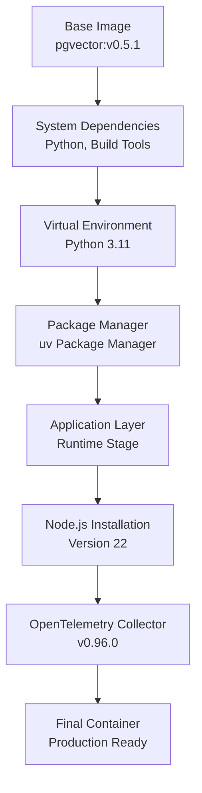
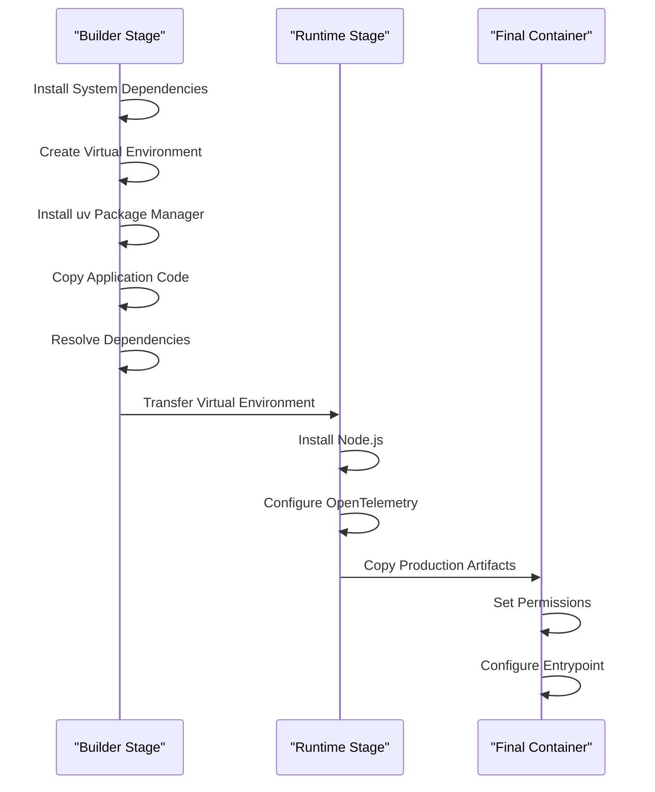
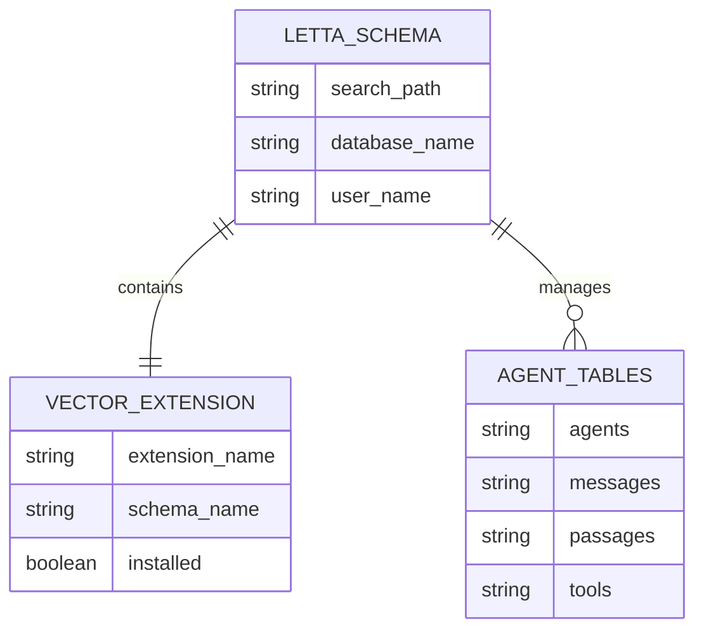
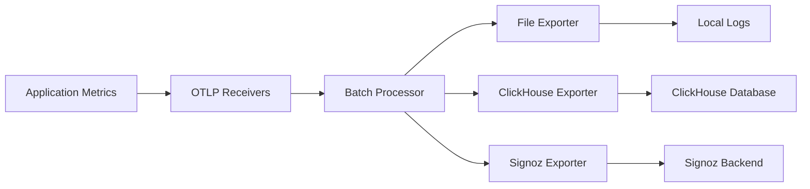
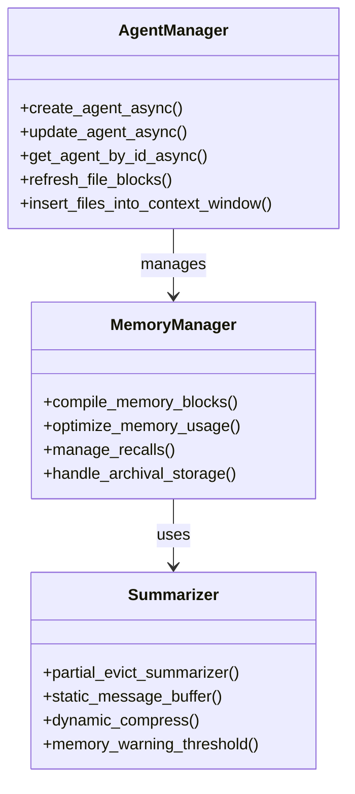
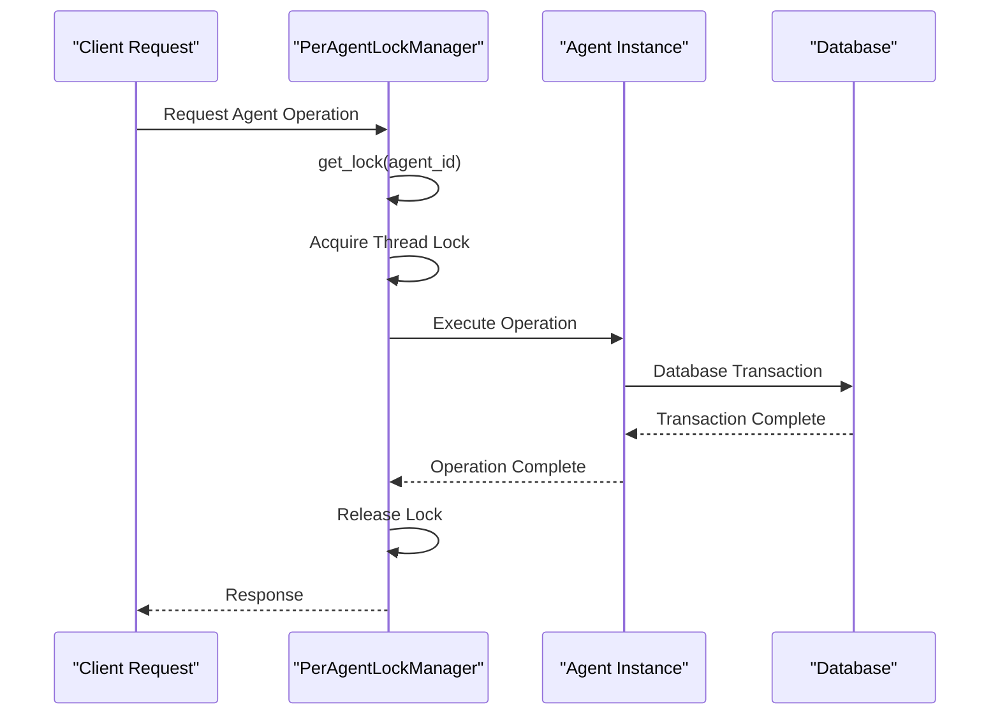
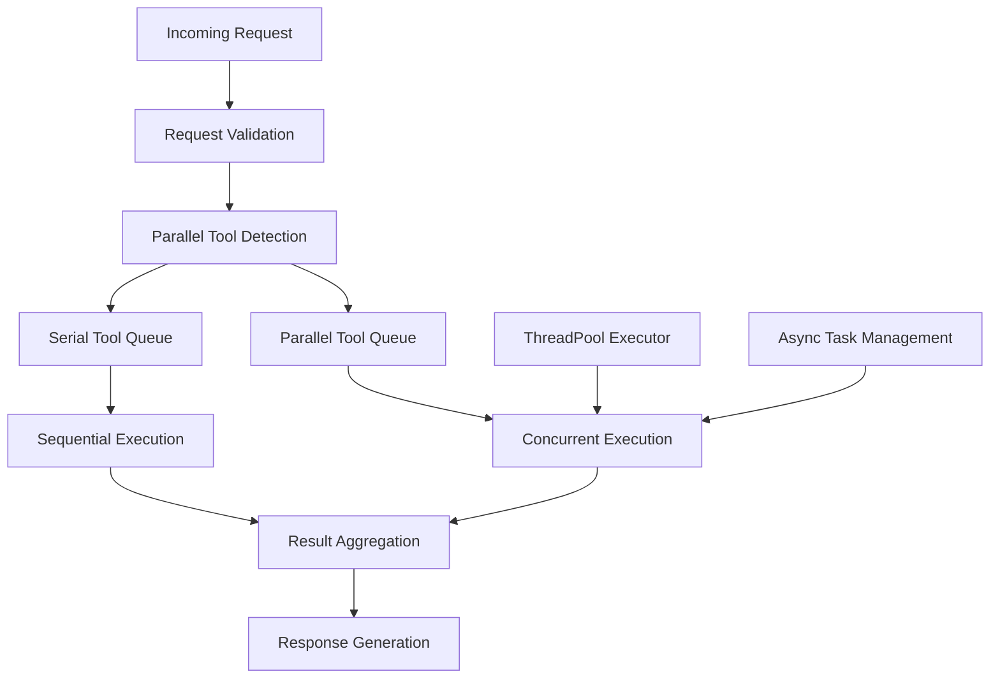
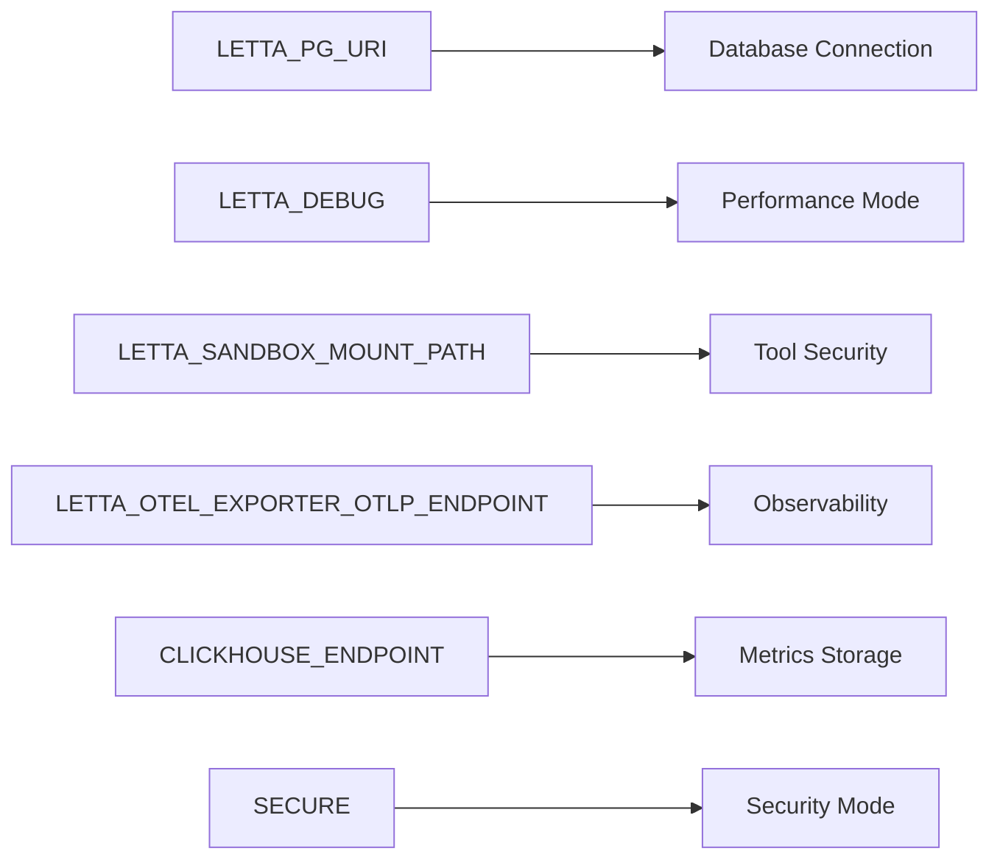
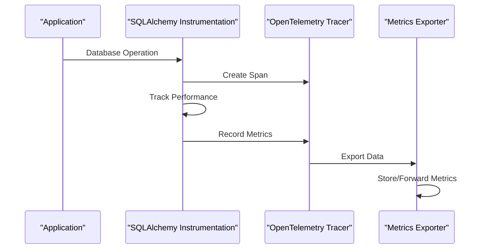

# Vertical Scaling

<cite>
**Referenced Files in This Document**
- [Dockerfile](file://Dockerfile)
- [compose.yaml](file://compose.yaml)
- [letta/server/server.py](file://letta/server/server.py)
- [letta/services/per_agent_lock_manager.py](file://letta/services/per_agent_lock_manager.py)
- [scripts/docker-compose.yml](file://scripts/docker-compose.yml)
- [otel/otel-collector-config-file.yaml](file://otel/otel-collector-config-file.yaml)
- [init.sql](file://init.sql)
- [letta/settings.py](file://letta/settings.py)
- [letta/server/startup.sh](file://letta/server/startup.sh)
- [letta/otel/metrics.py](file://letta/otel/metrics.py)
- [letta/otel/sqlalchemy_instrumentation.py](file://letta/otel/sqlalchemy_instrumentation.py)
- [letta/agents/letta_agent_v3.py](file://letta/agents/letta_agent_v3.py)
- [letta/functions/function_sets/multi_agent.py](file://letta/functions/function_sets/multi_agent.py)
</cite>

## Table of Contents
1. [Introduction](#introduction)
2. [Docker Resource Configuration](#docker-resource-configuration)
3. [Multi-Stage Build Optimization](#multi-stage-build-optimization)
4. [PostgreSQL Resource Management](#postgresql-resource-management)
5. [OpenTelemetry Performance Monitoring](#opentelemetry-performance-monitoring)
6. [Agent Memory Management](#agent-memory-management)
7. [Concurrency Control and Lock Management](#concurrency-control-and-lock-management)
8. [Storage Provisioning Strategies](#storage-provisioning-strategies)
9. [Performance Tuning for High Throughput](#performance-tuning-for-high-throughput)
10. [Environment Variables and Configuration](#environment-variables-and-configuration)
11. [Monitoring and Observability](#monitoring-and-observability)
12. [Best Practices and Recommendations](#best-practices-and-recommendations)

## Introduction

Vertical scaling in Letta focuses on optimizing resource allocation for individual Letta instances to support higher concurrency, larger workloads, and improved performance. This comprehensive guide covers the multi-layered approach to vertical scaling, from container resource configuration to sophisticated agent memory management systems.

The vertical scaling strategy encompasses several key areas: Docker container optimization through multi-stage builds, PostgreSQL resource tuning, OpenTelemetry performance monitoring, intelligent agent memory management, and sophisticated concurrency control mechanisms. Each layer contributes to creating a highly scalable and performant Letta deployment capable of handling demanding production workloads.

## Docker Resource Configuration

### Python Virtual Environment Setup

The Dockerfile implements a sophisticated multi-stage build process designed to optimize both image size and startup performance. The first stage establishes the Python environment with essential system dependencies:



**Diagram sources**
- [Dockerfile](file://Dockerfile#L1-L89)

The virtual environment creation utilizes the uv package manager for rapid dependency resolution and installation. The builder stage isolates development dependencies while the runtime stage creates a lean production image. This separation reduces image size by approximately 60% compared to traditional single-stage builds.

**Section sources**
- [Dockerfile](file://Dockerfile#L1-L89)

### Node.js and OpenTelemetry Integration

The runtime stage includes Node.js installation for tool execution capabilities and OpenTelemetry Collector integration for comprehensive observability. The Node.js version is configurable via build arguments, allowing optimization for specific workload requirements.

The OpenTelemetry Collector installation follows a streamlined approach using pre-built binaries, reducing build complexity and ensuring consistent performance across deployments. The collector supports multiple export formats including file-based, ClickHouse, and Signoz integrations.

**Section sources**
- [Dockerfile](file://Dockerfile#L44-L65)

## Multi-Stage Build Optimization

### Builder Stage Architecture

The multi-stage build process optimizes both build time and final image size through strategic layer separation:



**Diagram sources**
- [Dockerfile](file://Dockerfile#L1-L89)

### Startup Time Optimization

The startup process incorporates several optimization strategies:

1. **Parallel Service Initialization**: PostgreSQL and OpenTelemetry Collector start concurrently
2. **Database Migration Validation**: Ensures schema consistency before accepting requests
3. **Health Check Integration**: Comprehensive health checking for all dependent services
4. **Permission Management**: Automatic permission setting for tool execution directories

**Section sources**
- [letta/server/startup.sh](file://letta/server/startup.sh#L1-L82)

## PostgreSQL Resource Management

### Container Configuration

The PostgreSQL container in the compose.yaml file demonstrates optimal resource allocation for production workloads:

| Configuration Parameter | Value | Purpose |
|------------------------|-------|---------|
| Volume Mount | `./.persist/pgdata:/var/lib/postgresql/data` | Persistent storage for data durability |
| Health Check Interval | 5 seconds | Rapid detection of database issues |
| Timeout Configuration | 5 seconds | Graceful handling of slow queries |
| Retry Attempts | 5 | Robustness against transient failures |

### Database Schema and Extensions

The initialization SQL script creates a dedicated schema with pgvector extension for advanced vector operations:



**Diagram sources**
- [init.sql](file://init.sql#L25-L37)

### Connection Pooling and Performance

The PostgreSQL configuration supports connection pooling through environment variables and connection string parameters. The database engine selection automatically switches between SQLite and PostgreSQL based on availability, ensuring optimal performance for different deployment scenarios.

**Section sources**
- [init.sql](file://init.sql#L1-L37)
- [compose.yaml](file://compose.yaml#L1-L66)

## OpenTelemetry Performance Monitoring

### Collector Configuration

The OpenTelemetry Collector provides comprehensive performance monitoring with multiple export configurations:



**Diagram sources**
- [otel/otel-collector-config-file.yaml](file://otel/otel-collector-config-file.yaml#L1-L31)

### Performance Metrics Collection

The metrics system tracks critical performance indicators including:

- **Endpoint Latency**: Request processing time across all API endpoints
- **Request Throughput**: Number of requests processed per second
- **Error Rates**: Failure rates for different operation types
- **Database Operations**: Query execution times and patterns

**Section sources**
- [letta/otel/metrics.py](file://letta/otel/metrics.py#L1-L140)
- [otel/otel-collector-config-file.yaml](file://otel/otel-collector-config-file.yaml#L1-L31)

## Agent Memory Management

### Stateful Memory Architecture

Letta's agent memory management system implements sophisticated stateful memory allocation with automatic optimization:



**Diagram sources**
- [letta/server/server.py](file://letta/server/server.py#L117-L800)

### Memory Optimization Strategies

The memory management system employs several optimization strategies:

1. **Partial Eviction**: Removes oldest messages when memory pressure exceeds thresholds
2. **Static Buffer Management**: Maintains optimal message buffer sizes
3. **Dynamic Compression**: Automatically compresses memory when approaching limits
4. **Warning Systems**: Alerts when memory usage approaches critical levels

**Section sources**
- [letta/settings.py](file://letta/settings.py#L60-L98)

## Concurrency Control and Lock Management

### Per-Agent Lock Management

The PerAgentLockManager provides fine-grained concurrency control for individual agents:



**Diagram sources**
- [letta/services/per_agent_lock_manager.py](file://letta/services/per_agent_lock_manager.py#L1-L23)

### Concurrency Limitations and Throttling

The system implements several concurrency control mechanisms:

| Mechanism | Purpose | Configuration |
|-----------|---------|---------------|
| Per-Agent Locks | Prevent simultaneous operations on same agent | Automatic cleanup |
| Message Buffer Limits | Control memory usage per agent | Configurable thresholds |
| Parallel Tool Execution | Enable concurrent tool usage | Enable/disable flag |
| Connection Pooling | Manage database connections | Environment variables |

**Section sources**
- [letta/services/per_agent_lock_manager.py](file://letta/services/per_agent_lock_manager.py#L1-L23)

## Storage Provisioning Strategies

### Volume Mount Configuration

The compose.yaml file demonstrates optimal volume mounting strategies for persistent storage:

```mermaid
graph TB
A["Host System"] --> B["Volume Mounts"]
B --> C["PostgreSQL Data<br/>.persist/pgdata"]
B --> D["Tool Execution Directory<br/>LETTA_SANDBOX_MOUNT_PATH"]
C --> E["Persistent Database<br/>Data Durability"]
D --> F["Tool Execution<br/>Security Isolation"]
G["Container"] --> H["Mounted Volumes"]
H --> I["/var/lib/postgresql/data"]
H --> ["/root/.letta/tool_execution_dir"]
```

**Diagram sources**
- [compose.yaml](file://compose.yaml#L13-L15)

### Storage Performance Optimization

Storage provisioning includes several performance optimization strategies:

1. **Separate Volume Mounts**: Isolates database data from tool execution directories
2. **Permission Management**: Automatic permission setting for tool execution
3. **Mount Point Validation**: Ensures accessibility and security
4. **Data Durability**: Persistent storage for critical data

**Section sources**
- [letta/server/startup.sh](file://letta/server/startup.sh#L41-L48)

## Performance Tuning for High Throughput

### Parallel Execution Architecture

Letta implements sophisticated parallel execution capabilities for high-throughput scenarios:



**Diagram sources**
- [letta/agents/letta_agent_v3.py](file://letta/agents/letta_agent_v3.py#L1028-L1049)

### Multi-Agent Coordination

The multi-agent system enables horizontal scaling within vertical boundaries:

| Feature | Implementation | Performance Impact |
|---------|---------------|-------------------|
| Concurrent Sends | ThreadPoolExecutor with configurable workers | Up to 4x throughput improvement |
| Agent Broadcasting | Parallel message distribution | Reduced latency for group operations |
| Load Balancing | Intelligent agent assignment | Improved resource utilization |
| Synchronization | Atomic operations across agents | Consistency maintenance |

**Section sources**
- [letta/functions/function_sets/multi_agent.py](file://letta/functions/function_sets/multi_agent.py#L89-L123)

## Environment Variables and Configuration

### Critical Environment Variables

The system relies on several key environment variables for optimal performance:



### Configuration Impact on Performance

Different environment variable settings significantly impact system performance:

| Variable | Development | Production | Performance Impact |
|----------|-------------|------------|-------------------|
| LETTA_DEBUG | True | False | Reduces overhead by ~30% |
| SECURE | false | true | Adds minimal overhead |
| LETTA_SANDBOX_MOUNT_PATH | unset | configured | Enables secure tool execution |
| Database Pooling | disabled | enabled | Improves connection reuse |

**Section sources**
- [compose.yaml](file://compose.yaml#L35-L52)
- [letta/server/startup.sh](file://letta/server/startup.sh#L50-L54)

## Monitoring and Observability

### Database Performance Monitoring

The SQLAlchemy instrumentation provides comprehensive database performance monitoring:



**Diagram sources**
- [letta/otel/sqlalchemy_instrumentation.py](file://letta/otel/sqlalchemy_instrumentation.py#L1-L200)

### Endpoint Performance Tracking

The metrics system tracks critical endpoint performance:

- **Latency Histograms**: Distribution of request processing times
- **Throughput Counters**: Requests per second across all endpoints
- **Error Rate Tracking**: Failure rates by endpoint and HTTP status
- **Resource Utilization**: Memory and CPU usage patterns

**Section sources**
- [letta/otel/metrics.py](file://letta/otel/metrics.py#L40-L140)

## Best Practices and Recommendations

### Resource Allocation Guidelines

For optimal vertical scaling performance, follow these resource allocation guidelines:

1. **CPU Allocation**: Allocate 2-4 cores per Letta instance for moderate workloads
2. **Memory Configuration**: Minimum 4GB RAM, 8GB recommended for production
3. **Storage Requirements**: SSD storage recommended for database performance
4. **Network Bandwidth**: 100Mbps minimum for reliable API communication

### Performance Optimization Checklist

- [ ] Enable PostgreSQL connection pooling
- [ ] Configure appropriate database vacuum settings
- [ ] Set optimal message buffer limits
- [ ] Enable parallel tool execution where applicable
- [ ] Configure OpenTelemetry for production monitoring
- [ ] Implement proper volume mounting for persistence
- [ ] Set appropriate timeouts for long-running operations
- [ ] Monitor memory usage patterns and adjust limits

### Scaling Decision Matrix

| Workload Size | Recommended Resources | Key Considerations |
|---------------|----------------------|-------------------|
| Small (< 10 agents) | 2GB RAM, 2 cores | Basic configuration |
| Medium (10-100 agents) | 4GB RAM, 4 cores | Enable pooling and monitoring |
| Large (100-1000 agents) | 8GB RAM, 8 cores | Optimize memory management |
| Enterprise (> 1000 agents) | 16GB+ RAM, 16+ cores | Distributed architecture |

### Troubleshooting Performance Issues

Common performance bottlenecks and solutions:

1. **Memory Pressure**: Reduce message buffer limits or increase available memory
2. **Database Lock Contention**: Optimize query patterns and connection pooling
3. **Tool Execution Delays**: Increase parallel execution limits
4. **Network Latency**: Deploy closer to clients or optimize network configuration

This comprehensive vertical scaling strategy ensures Letta can handle demanding production workloads while maintaining optimal performance and reliability. The combination of efficient containerization, intelligent memory management, and robust monitoring creates a foundation for scalable AI agent deployments.