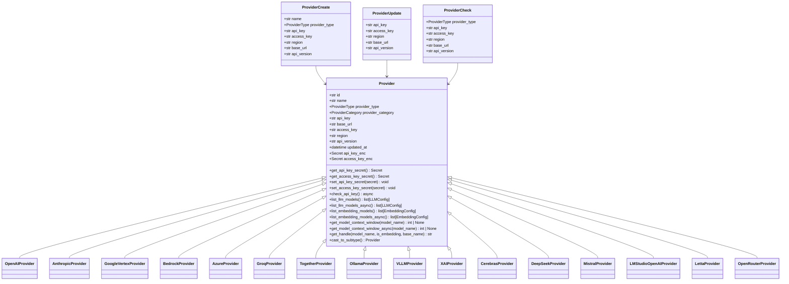
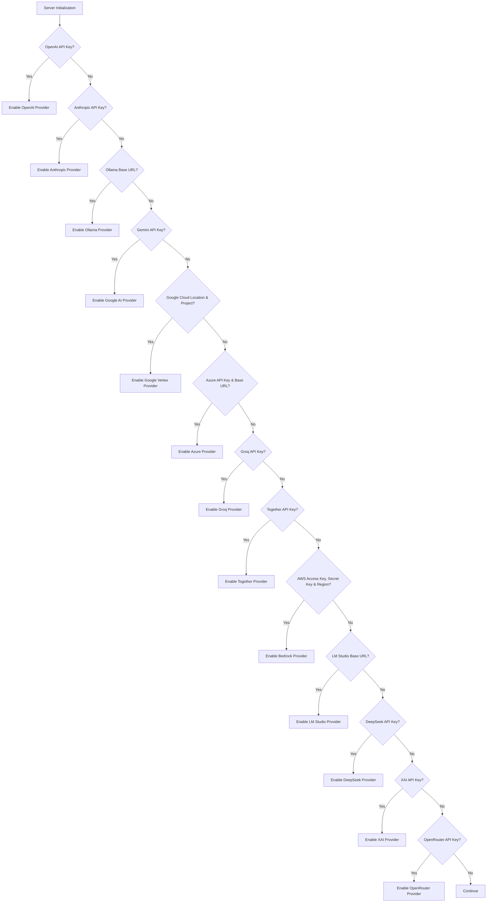
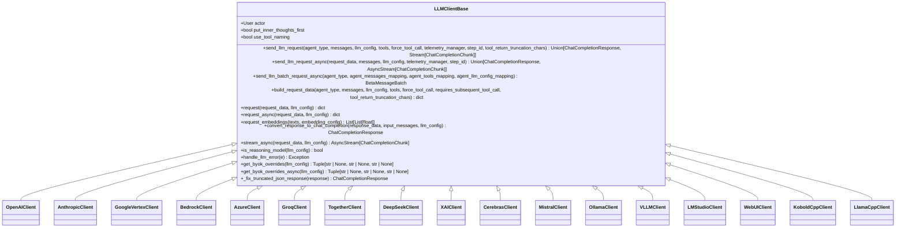
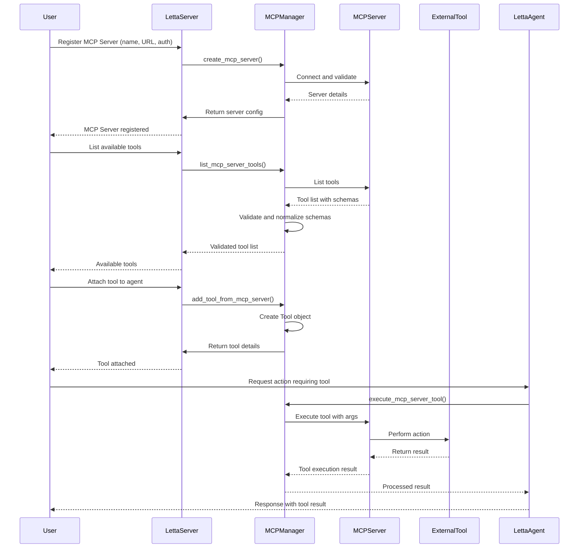
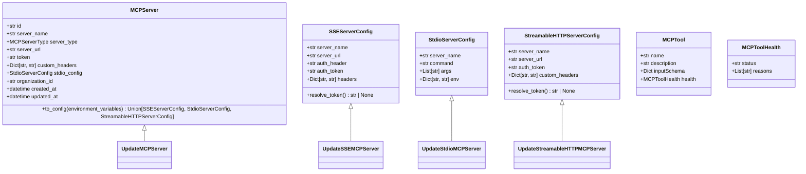
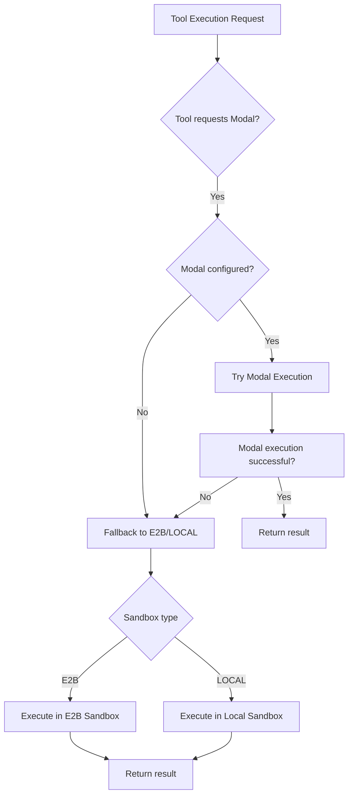
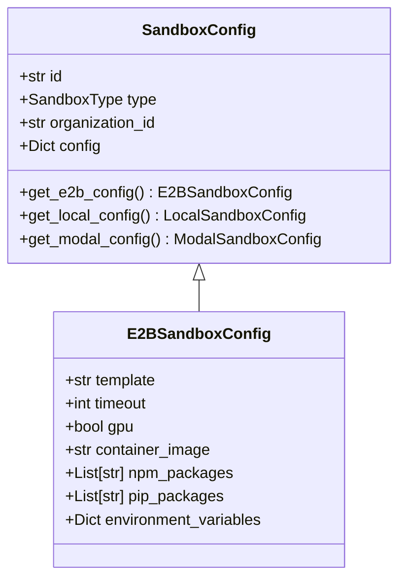

# External Integrations

<cite>
**Referenced Files in This Document**   
- [provider.py](file://letta/schemas/providers/base.py)
- [llm_client_base.py](file://letta/llm_api/llm_client_base.py)
- [openai_client.py](file://letta/llm_api/openai_client.py)
- [anthropic_client.py](file://letta/llm_api/anthropic_client.py)
- [bedrock_client.py](file://letta/llm_api/bedrock_client.py)
- [mcp_manager.py](file://letta/services/mcp_manager.py)
- [sandbox_config_manager.py](file://letta/services/sandbox_config_manager.py)
- [e2b_sandbox.py](file://letta/services/tool_sandbox/e2b_sandbox.py)
- [modal_sandbox.py](file://letta/services/tool_sandbox/modal_sandbox.py)
- [sandbox_tool_executor.py](file://letta/services/tool_executor/sandbox_tool_executor.py)
- [server.py](file://letta/server/server.py)
</cite>

## Table of Contents
1. [Introduction](#introduction)
2. [Provider Abstraction Layer](#provider-abstraction-layer)
3. [LLM Provider Integration](#llm-provider-integration)
4. [MCP Server Integration](#mcp-server-integration)
5. [Sandbox Environments](#sandbox-environments)
6. [Reliability and Error Handling](#reliability-and-error-handling)
7. [Configuration and Extensibility](#configuration-and-extensibility)

## Introduction
Letta provides a comprehensive external integration framework that enables seamless connectivity with various LLM providers, external tools through MCP (Model Context Protocol), and secure tool execution via sandbox environments. This architecture is designed to offer flexibility, security, and reliability while abstracting the complexities of different service providers. The system supports multiple LLM providers including OpenAI, Anthropic, Google Vertex AI, and AWS Bedrock, each with standardized interaction patterns. The MCP server integration allows agents to extend their capabilities by connecting to external tools and services, while sandbox environments provide isolated compute resources for secure tool execution. This documentation details the integration patterns, authentication mechanisms, request/response handling, and the provider abstraction layer that standardizes interactions across different services.

## Provider Abstraction Layer

The provider abstraction layer in Letta standardizes interactions across different LLM services through a consistent interface. This layer is implemented through the `Provider` base class and its concrete implementations for each provider type. The abstraction handles authentication, rate limiting, and request/response processing uniformly across providers while allowing for provider-specific configurations.

The core of the abstraction is the `Provider` class defined in `letta.schemas.providers.base.Provider`, which establishes a common interface for all providers. Each provider implementation inherits from this base class and implements provider-specific logic while maintaining the same external interface. The system supports both base providers (pre-configured) and BYOK (Bring Your Own Key) providers, allowing users to configure custom integrations.



**Diagram sources**
- [base.py](file://letta/schemas/providers/base.py#L19-L228)

**Section sources**
- [base.py](file://letta/schemas/providers/base.py#L1-L256)

## LLM Provider Integration

### Integration Patterns
Letta supports integration with multiple LLM providers through a standardized client interface. Each provider has a dedicated implementation that handles provider-specific authentication, request formatting, and response parsing. The integration follows a consistent pattern across providers, with variations to accommodate each provider's unique requirements.

The system automatically enables providers based on configuration settings. In the server initialization code, providers are enabled when their corresponding API keys or configuration values are present:



**Diagram sources**
- [server.py](file://letta/server/server.py#L209-L315)

### Authentication
Authentication is handled through provider-specific mechanisms, with credentials securely stored and managed. The system supports various authentication methods:

- **OpenAI**: API key authentication with optional custom base URL for proxy services
- **Anthropic**: API key authentication
- **Google Vertex AI**: Google Cloud credentials with project and location specification
- **AWS Bedrock**: AWS access key, secret key, and region configuration
- **Azure**: API key, base URL, and API version
- **Groq, Together, DeepSeek, xAI**: API key authentication
- **Ollama, LM Studio, VLLM**: Base URL configuration for local or self-hosted models

The provider base class includes encrypted fields for sensitive credentials (`api_key_enc` and `access_key_enc`), ensuring secure storage. The system prioritizes encrypted credentials but maintains plaintext fields during migration for backward compatibility.

### Rate Limiting and Request Handling
Each provider implementation includes built-in handling for rate limiting and request throttling. The system uses the provider's native rate limiting mechanisms and implements retry strategies for rate-limited requests. For example, the Anthropic client includes configurable retry settings through the `anthropic_max_retries` setting.

Request handling is standardized through the `LLMClientBase` abstract class, which defines the interface for sending requests, handling streaming responses, and processing embeddings. Each provider client implements this interface while adding provider-specific request formatting:



**Diagram sources**
- [llm_client_base.py](file://letta/llm_api/llm_client_base.py#L24-L270)

### Response Handling
Response handling is standardized across providers through the `convert_response_to_chat_completion` method, which transforms provider-specific responses into a common `ChatCompletionResponse` format. This ensures consistent processing regardless of the underlying provider. The system handles various response types including:

- Standard text responses
- Tool calls with function parameters
- Streaming responses with incremental content
- Batch processing results
- Error responses with standardized error types

The response conversion process includes handling of special cases such as truncated JSON responses, which are automatically fixed by the `_fix_truncated_json_response` method in the base client.

**Section sources**
- [llm_client_base.py](file://letta/llm_api/llm_client_base.py#L24-L270)
- [openai_client.py](file://letta/llm_api/openai_client.py#L552-L705)
- [anthropic_client.py](file://letta/llm_api/anthropic_client.py#L728-L777)

## MCP Server Integration

### Architecture and Workflow
The MCP (Model Context Protocol) server integration enables Letta agents to extend their capabilities by connecting to external tools and services. The architecture follows a client-server model where Letta acts as the MCP client, connecting to external MCP servers that expose tools for agent use.

The integration workflow consists of several key steps:
1. MCP server registration and configuration
2. Tool discovery and schema validation
3. Tool attachment to agents
4. Secure execution of tool calls
5. Response processing and integration



**Diagram sources**
- [mcp_manager.py](file://letta/services/mcp_manager.py#L67-L138)
- [mcp_manager.py](file://letta/services/mcp_manager.py#L103-L134)

### Configuration and Management
MCP servers are managed through the `MCPManager` class, which handles the lifecycle of MCP server connections and tool management. The system supports multiple transport methods for MCP servers:

- **SSE (Server-Sent Events)**: For web-based MCP servers
- **Stdio**: For local processes that communicate via standard input/output
- **Streamable HTTP**: For HTTP-based MCP servers with streaming support

Configuration can be provided through API calls or a configuration file (`~/.letta/mcp_config.json`). The configuration supports various authentication methods including bearer tokens and custom headers:



**Diagram sources**
- [mcp_manager.py](file://letta/services/mcp_manager.py#L30-L40)
- [mcp_manager.py](file://letta/services/mcp_manager.py#L314-L344)

### Tool Schema Validation
The system includes robust tool schema validation to ensure compatibility and security. When discovering tools from an MCP server, the system performs the following validation steps:

1. Schema normalization to fix common formatting issues
2. JSON schema validation against the MCP specification
3. Health status assignment (VALID, INVALID, or UNKNOWN)
4. Warning generation for invalid schemas with detailed reasons

The validation process attempts to normalize invalid schemas before rejecting them, increasing compatibility with imperfect implementations:

```python
# Schema validation and normalization process
if mcp_tool.health and mcp_tool.health.status == "INVALID":
    logger.info(f"Attempting to normalize INVALID schema for tool {mcp_tool_name}")
    normalized_schema = normalize_mcp_schema(mcp_tool.inputSchema)
    health_status, health_reasons = validate_complete_json_schema(normalized_schema)
    
    if health_status.value != "INVALID":
        logger.info(f"✓ MCP tool {mcp_tool_name} schema normalized successfully")
        mcp_tool.inputSchema = normalized_schema
        mcp_tool.health.status = health_status.value
        mcp_tool.health.reasons = health_reasons
    else:
        logger.warning(f"MCP tool {mcp_tool_name} still INVALID after normalization")
```

Tools with invalid schemas are not automatically attached but can be manually added with a warning, giving users control over risk tolerance.

**Section sources**
- [mcp_manager.py](file://letta/services/mcp_manager.py#L140-L190)
- [mcp_manager.py](file://letta/services/mcp_manager.py#L192-L301)

## Sandbox Environments

### Architecture Overview
Letta provides secure sandbox environments for executing external tools with isolated compute resources. The sandbox architecture supports multiple execution backends, including E2B, Modal, and local execution, allowing users to choose the appropriate isolation level and performance characteristics for their use case.

The sandbox system is managed through the `SandboxConfigManager` and specific sandbox executor classes. The architecture follows a factory pattern where the appropriate sandbox type is selected based on configuration and tool requirements:



**Diagram sources**
- [sandbox_tool_executor.py](file://letta/services/tool_executor/sandbox_tool_executor.py#L69-L103)

### E2B Sandbox
The E2B sandbox provides cloud-based isolation with full Linux environment capabilities. It offers persistent storage, network access, and support for various programming languages and packages. The E2B integration is configured through the `E2BSandboxConfig` class, which extends the base `SandboxConfig` with E2B-specific settings:



**Diagram sources**
- [sandbox_config.py](file://letta/schemas/sandbox_config.py#L97-L112)

The E2B sandbox supports environment variable injection for secure credential management and per-agent environment isolation. Environment variables can be configured at the sandbox level or per-agent, with agent-specific variables taking precedence.

### Modal Sandbox
The Modal sandbox provides serverless function execution with automatic scaling and cost optimization. It is particularly suitable for bursty workloads and tools that benefit from rapid scaling. The Modal integration is configured through the `ModalSandboxConfig` class, which extends the base `SandboxConfig` with Modal-specific settings.

Modal execution is prioritized when both conditions are met:
1. Modal credentials are configured
2. The tool explicitly requests Modal execution via metadata

This allows fine-grained control over execution environment selection based on tool requirements and performance characteristics.

### Local Sandbox
The local sandbox executes tools in a restricted environment on the host machine. It provides the lowest latency but with reduced isolation compared to cloud-based options. The local sandbox is configured through the `LocalSandboxConfig` class, which specifies the execution directory and other local execution parameters.

The local sandbox is suitable for development and testing, or for tools that require direct access to local resources. It supports the same environment variable injection and per-agent isolation features as the cloud-based sandboxes.

**Section sources**
- [sandbox_config.py](file://letta/schemas/sandbox_config.py#L88-L112)
- [e2b_sandbox.py](file://letta/services/tool_sandbox/e2b_sandbox.py#L42-L68)
- [modal_sandbox.py](file://letta/services/tool_sandbox/modal_sandbox.py)
- [sandbox_tool_executor.py](file://letta/services/tool_executor/sandbox_tool_executor.py#L61-L103)

## Reliability and Error Handling

### Retry Mechanisms
Letta implements comprehensive retry mechanisms to handle transient failures and improve reliability. The retry strategies are provider-specific and configured to align with each provider's rate limiting policies and error characteristics.

For OpenAI embeddings, the system implements a sophisticated retry strategy that prioritizes reducing batch size before reducing chunk size to maintain retrieval quality:

```python
# OpenAI embeddings retry strategy
initial_batch_size = 2048
while chunks_to_process:
    tasks = []
    task_metadata = []
    
    for start_idx, chunk_inputs, current_batch_size in chunks_to_process:
        try:
            # Attempt request with current batch size
            response = await client.embeddings.create(
                input=chunk_inputs,
                model=embedding_config.embedding_model
            )
            results.extend(response.data)
        except Exception as e:
            # On failure, halve batch size
            if current_batch_size > 1:
                new_batch_size = current_batch_size // 2
                # Split chunk and retry with smaller batch
                mid_point = len(chunk_inputs) // 2
                new_chunks = [
                    (start_idx, chunk_inputs[:mid_point], new_batch_size),
                    (start_idx + mid_point, chunk_inputs[mid_point:], new_batch_size)
                ]
                chunks_to_process.extend(new_chunks)
            else:
                # Only reduce chunk size for very large individual texts
                if can_reduce_chunk_size:
                    reduce_chunk_size_and_retry()
```

Other providers have similar retry mechanisms configured through their respective client settings, such as `anthropic_max_retries` for the Anthropic client.

### Timeout Handling
The system implements comprehensive timeout handling at multiple levels:

1. **Request timeouts**: Individual API requests have configurable timeouts
2. **Connection timeouts**: Network connections have timeout limits
3. **Processing timeouts**: Long-running operations have execution time limits
4. **Streaming timeouts**: Streaming responses have heartbeat and inactivity timeouts

The timeout values are provider-specific and can be configured through environment variables or API settings. For example, the E2B sandbox has a configurable timeout setting that determines how long a sandbox instance remains active after use.

### Fallback Strategies
Letta implements intelligent fallback strategies to maintain availability when primary services are unavailable:

1. **Provider fallback**: When a provider is unavailable, the system can fall back to alternative providers if configured
2. **Execution environment fallback**: For tool execution, the system tries Modal first (if configured and requested), then falls back to E2B or local execution
3. **Schema normalization fallback**: When tool schemas are invalid, the system attempts to normalize them before rejecting
4. **Authentication fallback**: The system supports multiple authentication methods and can fall back between them

The fallback logic is implemented in the `SandboxToolExecutor` class, which attempts Modal execution first and falls back to E2B or local execution if Modal fails:

```python
# Fallback strategy in sandbox tool execution
tool_requests_modal = tool.metadata_ and tool.metadata_.get("sandbox") == "modal"
modal_configured = tool_settings.modal_sandbox_enabled

if tool_requests_modal and modal_configured:
    try:
        # Try Modal execution
        tool_execution_result = await modal_sandbox.run()
    except Exception as e:
        logger.warning(f"Modal execution failed: {e}. Falling back to {tool_settings.sandbox_type.value}")
        tool_execution_result = None

# Fallback to E2B or LOCAL if Modal wasn't tried or failed
if tool_execution_result is None:
    if tool_settings.sandbox_type == SandboxType.E2B:
        tool_execution_result = await e2b_sandbox.run()
    else:
        tool_execution_result = await local_sandbox.run()
```

**Section sources**
- [openai_client.py](file://letta/llm_api/openai_client.py#L740-L800)
- [anthropic_client.py](file://letta/llm_api/anthropic_client.py#L619-L723)
- [sandbox_tool_executor.py](file://letta/services/tool_executor/sandbox_tool_executor.py#L69-L103)

## Configuration and Extensibility

### Configuration Options
Letta provides extensive configuration options for external integrations through environment variables, API settings, and configuration files. The key configuration categories include:

**API Keys and Authentication**
- `OPENAI_API_KEY`: OpenAI API key
- `ANTHROPIC_API_KEY`: Anthropic API key
- `GEMINI_API_KEY`: Google Gemini API key
- `AZURE_API_KEY`: Azure API key
- `GROQ_API_KEY`: Groq API key
- `TOGETHER_API_KEY`: Together AI API key
- `AWS_ACCESS_KEY_ID` and `AWS_SECRET_ACCESS_KEY`: AWS credentials for Bedrock

**Endpoints and Regional Settings**
- `OPENAI_API_BASE`: Custom OpenAI endpoint (for proxies)
- `OLLAMA_BASE_URL`: Ollama server URL
- `LMSTUDIO_BASE_URL`: LM Studio server URL
- `GOOGLE_CLOUD_PROJECT` and `GOOGLE_CLOUD_LOCATION`: Google Cloud project and location
- `AZURE_API_VERSION`: Azure API version
- `AZURE_BASE_URL`: Azure API endpoint

**Sandbox Configuration**
- `E2B_API_KEY`: E2B sandbox API key
- `MODAL_TOKEN_ID` and `MODAL_TOKEN_SECRET`: Modal credentials
- `SANDBOX_TYPE`: Default sandbox type (e2b, local)
- `E2B_SANDBOX_TEMPLATE_ID`: E2B sandbox template ID

**Provider-Specific Settings**
- `ANTHROPIC_SONNET_1M`: Enable 1M context for Sonnet 4/4.5
- `ANTHROPIC_MAX_RETRIES`: Maximum retries for Anthropic API
- `OPENROUTER_API_KEY`: OpenRouter API key
- `OPENROUTER_REFERER` and `OPENROUTER_TITLE`: OpenRouter referral settings

### Adding New Provider Integrations
The provider abstraction layer is designed to be extensible, allowing for the addition of new LLM providers with minimal code changes. To add a new provider integration, follow these steps:

1. **Create a provider schema**: Extend the `Provider` base class with provider-specific fields
2. **Implement the LLM client**: Create a client class that inherits from `LLMClientBase` and implements the required methods
3. **Register the provider**: Add the provider to the provider registry and schema imports
4. **Implement error handling**: Map provider-specific errors to the common LLMError types
5. **Add configuration support**: Update the server initialization to detect and enable the provider based on configuration

The process is streamlined through the use of Python's type hints and abstract base classes, ensuring that all required methods are implemented and properly typed.

### Extending Adapter Patterns
The adapter patterns in Letta can be extended to support new integration types and protocols. The key extension points include:

1. **New MCP transport methods**: Implement new transport protocols for MCP servers by extending the `AsyncBaseMCPClient` class
2. **Additional sandbox backends**: Add support for new sandbox providers by implementing the sandbox executor interface
3. **Custom tool adapters**: Create adapters for specific tool types or APIs that require special handling
4. **Enhanced authentication methods**: Support additional authentication schemes such as OAuth, JWT, or certificate-based authentication

The modular design ensures that extensions can be added without modifying existing code, following the open/closed principle of software design.

**Section sources**
- [base.py](file://letta/schemas/providers/base.py)
- [llm_client_base.py](file://letta/llm_api/llm_client_base.py)
- [server.py](file://letta/server/server.py#L209-L315)
- [mcp_manager.py](file://letta/services/mcp_manager.py#L45-L48)
- [sandbox_tool_executor.py](file://letta/services/tool_executor/sandbox_tool_executor.py#L14-L35)