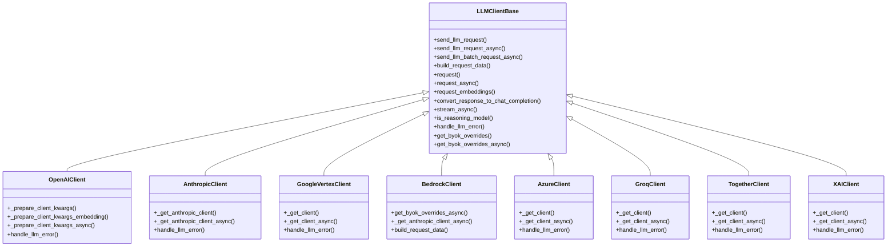
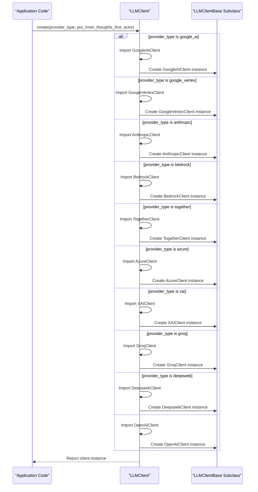
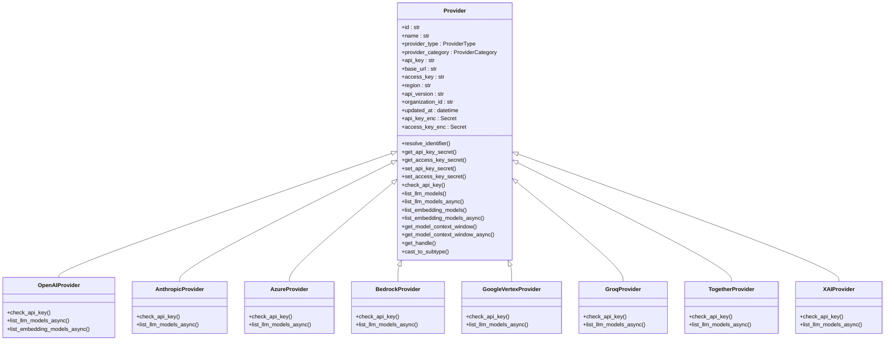
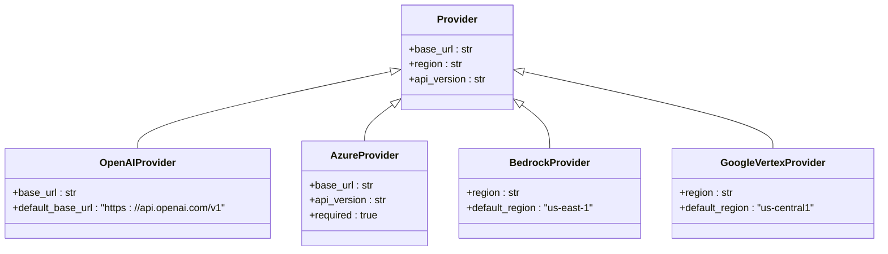
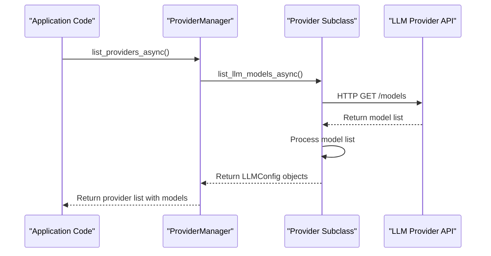
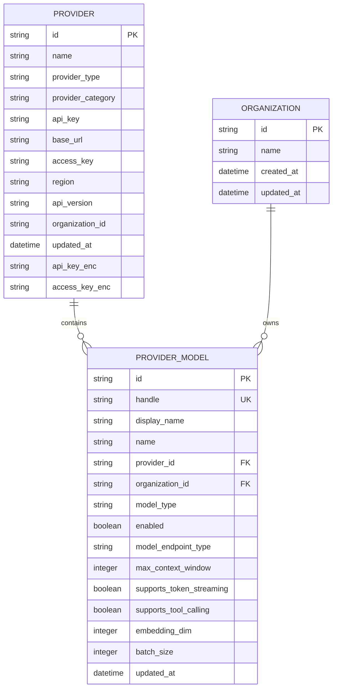
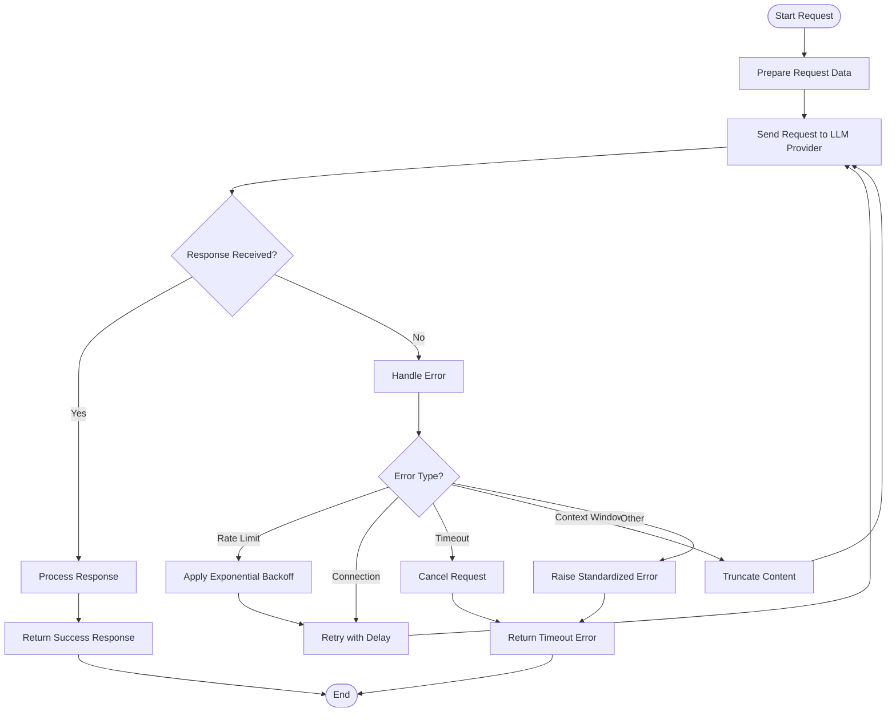
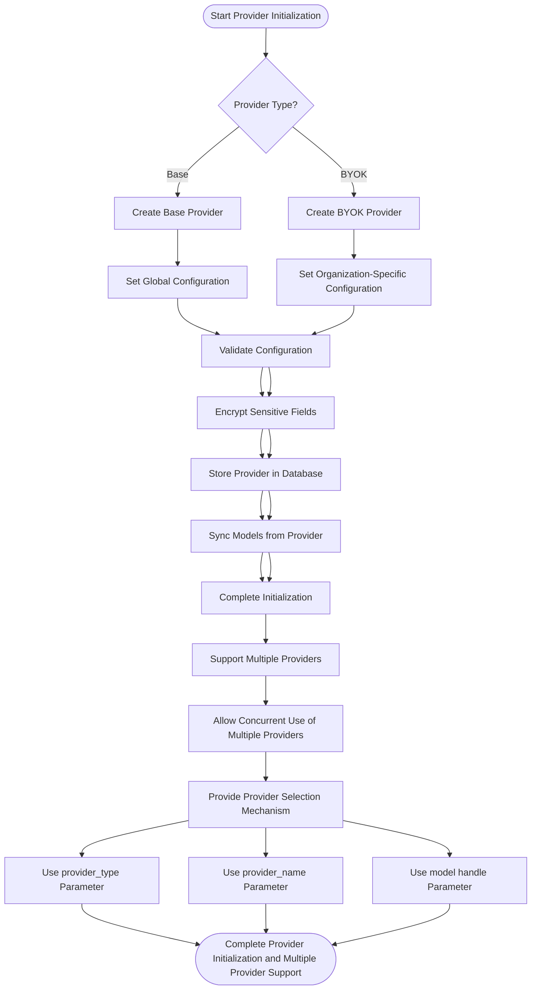

# LLM Providers

<cite>
**Referenced Files in This Document**   
- [llm_client.py](file://letta/llm_api/llm_client.py)
- [llm_client_base.py](file://letta/llm_api/llm_client_base.py)
- [base.py](file://letta/schemas/providers/base.py)
- [enums.py](file://letta/schemas/enums.py)
- [provider_manager.py](file://letta/services/provider_manager.py)
- [openai_client.py](file://letta/llm_api/openai_client.py)
- [anthropic_client.py](file://letta/llm_api/anthropic_client.py)
- [bedrock_client.py](file://letta/llm_api/bedrock_client.py)
- [google_vertex_client.py](file://letta/llm_api/google_vertex_client.py)
- [xai_client.py](file://letta/llm_api/xai_client.py)
- [azure_client.py](file://letta/llm_api/azure_client.py)
- [groq_client.py](file://letta/llm_api/groq_client.py)
- [together_client.py](file://letta/llm_api/together_client.py)
- [openai.py](file://letta/schemas/providers/openai.py)
- [anthropic.py](file://letta/schemas/providers/anthropic.py)
- [azure.py](file://letta/schemas/providers/azure.py)
- [bedrock.py](file://letta/schemas/providers/bedrock.py)
- [google_vertex.py](file://letta/schemas/providers/google_vertex.py)
- [xai.py](file://letta/schemas/providers/xai.py)
- [providers.py](file://letta/schemas/providers/__init__.py)
</cite>

## Table of Contents
1. [Introduction](#introduction)
2. [Provider Abstraction Layer](#provider-abstraction-layer)
3. [Factory Pattern Implementation](#factory-pattern-implementation)
4. [Authentication Mechanisms](#authentication-mechanisms)
5. [Configuration Options](#configuration-options)
6. [Provider Capabilities Discovery](#provider-capabilities-discovery)
7. [Model Metadata Management](#model-metadata-management)
8. [Reliability Features](#reliability-features)
9. [Adding New Provider Integrations](#adding-new-provider-integrations)
10. [Provider Initialization and Multiple Provider Support](#provider-initialization-and-multiple-provider-support)

## Introduction
The Letta framework provides a comprehensive abstraction layer for integrating various Large Language Model (LLM) providers, enabling seamless interaction with services such as OpenAI, Anthropic, Google Vertex AI, AWS Bedrock, Azure, Groq, Together, and XAI. This documentation details the architecture and implementation of the LLM provider system, focusing on the provider abstraction layer, factory pattern for client instantiation, authentication mechanisms, configuration options, capability discovery, and reliability features. The system is designed to standardize interactions across different LLM services while providing flexibility for customization and extension.

## Provider Abstraction Layer
The LLM provider system in Letta is built around an abstraction layer that standardizes interactions with different LLM services. This layer is implemented through a base class `LLMClientBase` that defines the common interface for all provider-specific clients. The abstraction layer handles request formatting, response parsing, error handling, and telemetry integration, ensuring consistent behavior across different providers.

The core of the abstraction layer is the `LLMClientBase` class, which provides methods for sending LLM requests, handling streaming responses, generating embeddings, and converting responses to a standardized format. Each provider-specific client extends this base class and implements the provider-specific logic for request and response handling. This design allows for consistent error handling and telemetry collection across all providers while enabling provider-specific optimizations and features.

The abstraction layer also includes support for different agent types, tool calling, and structured outputs, allowing the system to adapt to the capabilities of each provider. The layer is designed to be extensible, making it easy to add support for new providers by implementing the required methods in the base class.

**Diagram sources**
- [llm_client_base.py](file://letta/llm_api/llm_client_base.py#L24-L270)
- [openai_client.py](file://letta/llm_api/openai_client.py#L161-L200)
- [anthropic_client.py](file://letta/llm_api/anthropic_client.py#L55-L88)
- [google_vertex_client.py](file://letta/llm_api/google_vertex_client.py#L27-L50)
- [bedrock_client.py](file://letta/llm_api/bedrock_client.py#L18-L81)
- [azure_client.py](file://letta/llm_api/azure_client.py#L20-L43)
- [groq_client.py](file://letta/llm_api/groq_client.py#L19-L42)
- [together_client.py](file://letta/llm_api/together_client.py#L19-L42)
- [xai_client.py](file://letta/llm_api/xai_client.py#L19-L42)

**Section sources**
- [llm_client_base.py](file://letta/llm_api/llm_client_base.py#L24-L270)

## Factory Pattern Implementation
The LLM client instantiation in Letta follows the factory pattern, implemented through the `LLMClient` class. This pattern provides a centralized mechanism for creating provider-specific client instances based on the model endpoint type, abstracting away the complexity of client creation from the rest of the system.

The factory class `LLMClient` contains a static `create` method that takes a `provider_type` parameter of type `ProviderType` and returns an instance of the appropriate `LLMClientBase` subclass. The method uses a match statement to determine which provider-specific client to instantiate based on the provider type. This approach ensures type safety and makes it easy to add support for new providers by simply extending the match statement.

The factory pattern implementation supports all major LLM providers including OpenAI, Anthropic, Google Vertex AI, AWS Bedrock, Azure, Groq, Together, and XAI. For each provider, the factory imports the corresponding client class and creates an instance with the required parameters such as `put_inner_thoughts_first` and `actor`. The default case in the match statement creates an `OpenAIClient` instance, ensuring that there is always a fallback provider available.

This design provides several benefits:
- **Decoupling**: The code that uses LLM clients doesn't need to know about the specific implementation details of each provider.
- **Extensibility**: Adding support for a new provider only requires creating a new client class and adding a case to the factory method.
- **Consistency**: All clients are created with the same parameters and follow the same initialization pattern.
- **Maintainability**: Changes to client creation logic can be made in a single location.

**Diagram sources**
- [llm_client.py](file://letta/llm_api/llm_client.py#L10-L103)

**Section sources**
- [llm_client.py](file://letta/llm_api/llm_client.py#L10-L103)

## Authentication Mechanisms
The Letta framework implements a comprehensive authentication system for LLM providers that supports multiple authentication methods and the BYOK (Bring Your Own Key) override pattern. The system is designed to handle API keys, access keys, and other authentication credentials securely while providing flexibility for different provider requirements.

The authentication mechanism is centered around the `Provider` schema, which includes fields for `api_key`, `access_key`, and other provider-specific credentials. To ensure security, these fields are stored in encrypted form using the `Secret` class, which handles encryption and decryption automatically. The schema also includes encrypted versions of these fields (`api_key_enc` and `access_key_enc`) for backward compatibility during migration.

The BYOK override pattern allows users to provide their own API keys for specific providers, overriding the default keys configured in the system. This is implemented through the `get_byok_overrides` and `get_byok_overrides_async` methods in the `LLMClientBase` class, which check if the provider category is `byok` and retrieve the override key from the `ProviderManager`. For AWS Bedrock, the system also supports access key and region overrides.

Different providers have specific authentication requirements:
- **OpenAI**: Uses API key authentication with optional base URL override
- **Anthropic**: Uses API key authentication
- **Google Vertex AI**: Uses service account authentication with JSON key file
- **AWS Bedrock**: Uses AWS access key ID, secret access key, and region
- **Azure**: Uses API key, base URL, and API version
- **Groq**: Uses API key authentication
- **Together**: Uses API key authentication
- **XAI**: Uses API key authentication

The system also includes a `check_api_key` method in the `Provider` base class that can be implemented by provider-specific subclasses to validate the provided credentials before use.

**Diagram sources**
- [base.py](file://letta/schemas/providers/base.py#L19-L229)
- [openai.py](file://letta/schemas/providers/openai.py#L19-L247)
- [anthropic.py](file://letta/schemas/providers/anthropic.py#L104-L205)
- [azure.py](file://letta/schemas/providers/azure.py)
- [bedrock.py](file://letta/schemas/providers/bedrock.py)
- [google_vertex.py](file://letta/schemas/providers/google_vertex.py)
- [groq.py](file://letta/schemas/providers/groq.py)
- [together.py](file://letta/schemas/providers/together.py)
- [xai.py](file://letta/schemas/providers/xai.py)

**Section sources**
- [base.py](file://letta/schemas/providers/base.py#L19-L229)

## Configuration Options
The Letta framework provides extensive configuration options for LLM providers, allowing users to customize the behavior of each provider through various parameters. These configuration options include base URLs, regions, API versions, and other provider-specific settings that can be specified when creating or updating a provider.

The configuration system is implemented through the `Provider` schema, which includes fields for `base_url`, `region`, `api_version`, and other provider-specific configuration options. These fields allow users to customize the endpoint and behavior of each provider. For example, users can specify a custom base URL for OpenAI-compatible APIs, a specific region for AWS Bedrock, or an API version for Azure.

The configuration options are validated and processed by the provider-specific subclasses of the `Provider` base class. Each subclass can implement additional validation and default value logic for its specific configuration options. For example, the `OpenAIProvider` class sets a default base URL of "https://api.openai.com/v1" if none is provided, while the `AzureProvider` class requires an API version to be specified.

The system also supports configuration overrides through environment variables and server settings, allowing for flexible deployment scenarios. For example, the OpenAI API key can be specified through the `OPENAI_API_KEY` environment variable, while the AWS credentials can be specified through the `AWS_ACCESS_KEY_ID` and `AWS_SECRET_ACCESS_KEY` environment variables.

The configuration system is designed to be extensible, making it easy to add support for new configuration options as needed. When adding a new provider, developers can extend the `Provider` schema with provider-specific configuration fields and implement the appropriate validation and default value logic in the provider-specific subclass.

**Diagram sources**
- [base.py](file://letta/schemas/providers/base.py#L29-L32)
- [openai.py](file://letta/schemas/providers/openai.py#L23)
- [azure.py](file://letta/schemas/providers/azure.py)
- [bedrock.py](file://letta/schemas/providers/bedrock.py)
- [google_vertex.py](file://letta/schemas/providers/google_vertex.py)

**Section sources**
- [base.py](file://letta/schemas/providers/base.py#L29-L32)

## Provider Capabilities Discovery
The Letta framework includes a comprehensive system for discovering the capabilities of LLM providers through the `list_models_async` methods. This system allows the framework to automatically detect the available models, their capabilities, and their metadata, enabling dynamic configuration and optimization based on the provider's capabilities.

The capabilities discovery system is implemented through the `list_llm_models_async` and `list_embedding_models_async` methods in the `Provider` base class and its provider-specific subclasses. These methods query the provider's API to retrieve a list of available models and their metadata, including context window size, streaming support, tool calling capabilities, and other relevant information.

Each provider-specific subclass implements its own version of these methods to handle the specific API format and capabilities of that provider. For example:
- **OpenAI**: Queries the `/models` endpoint and filters the results to include only models that support tool calling
- **Anthropic**: Queries the `/models` endpoint and uses a hardcoded list to determine context window sizes
- **Google Vertex AI**: Queries the `/publishers/google/models` endpoint and extracts model information from the response
- **AWS Bedrock**: Queries the `/foundationModels` endpoint and extracts model information from the response
- **Azure**: Uses a hardcoded list of models since the API does not provide a model listing endpoint
- **Groq**: Queries the `/chat/completions/models` endpoint and extracts model information from the response
- **Together**: Queries the `/models` endpoint and extracts model information from the response
- **XAI**: Queries the `/models` endpoint and extracts model information from the response

The discovered model information is used to populate the `LLMConfig` and `EmbeddingConfig` objects, which are stored in the database and used to configure the LLM clients. This allows the system to automatically adapt to the capabilities of each provider and optimize its behavior accordingly.

**Diagram sources**
- [base.py](file://letta/schemas/providers/base.py#L114-L115)
- [openai.py](file://letta/schemas/providers/openai.py#L57-L129)
- [anthropic.py](file://letta/schemas/providers/anthropic.py#L124-L143)
- [google_vertex.py](file://letta/schemas/providers/google_vertex.py)
- [bedrock.py](file://letta/schemas/providers/bedrock.py)
- [azure.py](file://letta/schemas/providers/azure.py)
- [groq.py](file://letta/schemas/providers/groq.py)
- [together.py](file://letta/schemas/providers/together.py)
- [xai.py](file://letta/schemas/providers/xai.py)

**Section sources**
- [base.py](file://letta/schemas/providers/base.py#L114-L115)

## Model Metadata Management
The Letta framework stores detailed metadata about LLM models in the database, including context window size, streaming support, tool calling capabilities, and other relevant information. This metadata is used to optimize the behavior of the LLM clients and ensure compatibility with the capabilities of each model.

The model metadata is stored in the `provider_models` table, which contains fields for `handle`, `display_name`, `name`, `provider_id`, `organization_id`, `model_type`, `enabled`, `model_endpoint_type`, `max_context_window`, `supports_token_streaming`, and `supports_tool_calling`. The `handle` field is a unique identifier for the model that combines the provider name and model name, ensuring that models from different providers can be distinguished even if they have the same name.

The metadata is populated through the `sync_provider_models_async` method in the `ProviderManager` class, which synchronizes the models from a provider to the database. This method adds new models, removes old models, and updates existing models as needed. The synchronization process is triggered automatically when a new BYOK provider is created, ensuring that the database always contains up-to-date information about the available models.

The model metadata is used by the LLM clients to optimize their behavior based on the capabilities of each model. For example, the clients can use the `supports_token_streaming` field to determine whether to use streaming mode, and the `supports_tool_calling` field to determine whether to include tool definitions in the request. The `max_context_window` field is used to enforce context window limits and prevent requests that would exceed the model's capacity.

The metadata system is designed to be extensible, allowing for the addition of new fields as needed to support new capabilities or optimization strategies. When adding support for a new provider, developers can extend the metadata schema with provider-specific fields and update the synchronization logic to populate these fields from the provider's API.

**Diagram sources**
- [orm.py](file://letta/orm/provider.py)
- [orm.py](file://letta/orm/provider_model.py)
- [user.py](file://letta/orm/user.py)

**Section sources**
- [provider_manager.py](file://letta/services/provider_manager.py#L525-L695)

## Reliability Features
The Letta framework includes comprehensive reliability features for LLM interactions, including error handling through the `handle_llm_error` method, retry mechanisms, and timeout handling. These features ensure that the system can gracefully handle various types of failures and maintain robust operation even in the face of network issues or provider outages.

The error handling system is implemented through the `handle_llm_error` method in the `LLMClientBase` class, which is overridden by each provider-specific client to translate provider-specific errors into common `LLMError` types. This method catches exceptions from the underlying provider API and converts them into standardized error types such as `LLMConnectionError`, `LLMTimeoutError`, `LLMRateLimitError`, and `ContextWindowExceededError`. This allows the rest of the system to handle errors in a consistent manner regardless of the underlying provider.

The retry mechanism is implemented through decorators and wrapper functions that automatically retry failed requests based on the type of error. For example, rate limit errors trigger exponential backoff with jitter, while connection errors trigger retries with increasing delays. The retry logic is configurable through settings such as `max_retries`, `exponential_base`, and `jitter`, allowing users to customize the retry behavior based on their requirements.

Timeout handling is implemented through the use of async timeouts and cancellation tokens, ensuring that requests do not hang indefinitely. The system uses configurable timeout values for different types of requests, with shorter timeouts for non-critical operations and longer timeouts for complex operations that may take more time to complete.

The reliability features also include telemetry integration, which logs detailed information about each request and response, including timing, error details, and retry attempts. This information is used for monitoring, debugging, and performance optimization.

**Diagram sources**
- [llm_client_base.py](file://letta/llm_api/llm_client_base.py#L207-L218)
- [llm_api_tools.py](file://letta/llm_api/llm_api_tools.py#L68-L118)
- [agent.py](file://letta/agent.py#L408-L430)
- [openai_client.py](file://letta/llm_api/openai_client.py#L889-L913)
- [anthropic_client.py](file://letta/llm_api/anthropic_client.py#L619-L655)
- [google_vertex_client.py](file://letta/llm_api/google_vertex_client.py#L109-L126)

**Section sources**
- [llm_client_base.py](file://letta/llm_api/llm_client_base.py#L207-L218)

## Adding New Provider Integrations
Adding new provider integrations to the Letta framework involves extending the `LLMClientBase` class and registering the provider type in the schema system. This process is designed to be straightforward and consistent, allowing developers to add support for new LLM providers with minimal effort.

To add a new provider integration, developers need to:
1. Create a new provider-specific client class that extends `LLMClientBase`
2. Implement the required abstract methods such as `build_request_data`, `request`, `request_async`, `request_embeddings`, `convert_response_to_chat_completion`, `stream_async`, `is_reasoning_model`, and `handle_llm_error`
3. Create a new provider schema class that extends the `Provider` base class
4. Register the provider type in the `ProviderType` enum
5. Add a case for the new provider in the `LLMClient.create` method
6. Implement the `list_llm_models_async` and `list_embedding_models_async` methods in the provider schema class
7. Add any provider-specific configuration options to the provider schema class

The process is designed to be modular and extensible, with clear separation of concerns between the client implementation, schema definition, and factory pattern. This allows developers to focus on the provider-specific logic without needing to modify the core framework code.

When implementing the provider-specific client, developers should follow the patterns established by the existing providers, such as using async methods for network operations, implementing proper error handling, and supporting the full range of LLM capabilities including tool calling, streaming, and structured outputs.

The schema system provides a consistent way to define provider-specific configuration options and validation rules. The provider schema class should include all the necessary fields for authentication and configuration, and implement the `check_api_key` method to validate the provided credentials.

```mermaid
flowchart TD
Start([Start New Provider Integration]) --> CreateClientClass["Create Provider-Specific Client Class"]
CreateClientClass --> ExtendLLMClientBase["Extend LLMClientBase"]
ExtendLLMClientBase --> ImplementAbstractMethods["Implement Abstract Methods"]
ImplementAbstractMethods --> BuildRequestData["build_request_data()"]
ImplementAbstractMethods --> Request["request()"]
ImplementAbstractMethods --> RequestAsync["request_async()"]
ImplementAbstractMethods --> RequestEmbeddings["request_embeddings()"]
ImplementAbstractMethods --> ConvertResponse["convert_response_to_chat_completion()"]
ImplementAbstractMethods --> StreamAsync["stream_async()"]
ImplementAbstractMethods --> IsReasoningModel["is_reasoning_model()"]
ImplementAbstractMethods --> HandleLLMError["handle_llm_error()"]
Start --> CreateProviderSchema["Create Provider Schema Class"]
CreateProviderSchema --> ExtendProviderBase["Extend Provider Base Class"]
ExtendProviderBase --> AddConfigFields["Add Configuration Fields"]
AddConfigFields --> AddAPIKey["api_key"]
AddConfigFields --> AddBaseURL["base_url"]
AddConfigFields --> AddRegion["region"]
AddConfigFields --> AddAPIVersion["api_version"]
ExtendProviderBase --> ImplementListModels["Implement list_llm_models_async()"]
ExtendProviderBase --> ImplementListEmbeddingModels["Implement list_embedding_models_async()"]
ExtendProviderBase --> ImplementCheckAPIKey["Implement check_api_key()"]
Start --> RegisterProviderType["Register Provider Type"]
RegisterProviderType --> AddToEnum["Add to ProviderType Enum"]
RegisterProviderType --> AddToFactory["Add to LLMClient.create()"]
BuildRequestData --> End
Request --> End
RequestAsync --> End
RequestEmbeddings --> End
ConvertResponse --> End
StreamAsync --> End
IsReasoningModel --> End
HandleLLMError --> End
AddAPIKey --> End
AddBaseURL --> End
AddRegion --> End
AddAPIVersion --> End
ImplementListModels --> End
ImplementListEmbeddingModels --> End
ImplementCheckAPIKey --> End
AddToEnum --> End
AddToFactory --> End
End([Complete New Provider Integration])
```

**Diagram sources**
- [llm_client_base.py](file://letta/llm_api/llm_client_base.py#L131-L197)
- [base.py](file://letta/schemas/providers/base.py#L19-L229)
- [enums.py](file://letta/schemas/enums.py#L52-L69)
- [llm_client.py](file://letta/llm_api/llm_client.py#L32-L96)

**Section sources**
- [llm_client_base.py](file://letta/llm_api/llm_client_base.py#L131-L197)

## Provider Initialization and Multiple Provider Support
The Letta framework supports initializing providers from server settings and enables multiple providers to be enabled simultaneously. This allows users to configure multiple LLM providers and switch between them as needed, providing flexibility and redundancy.

Provider initialization is handled through the `ProviderManager` class, which provides methods for creating, updating, and deleting providers. When a provider is created, the system validates the provided configuration, encrypts sensitive fields, and stores the provider in the database. The initialization process also includes syncing the available models from the provider to the database, ensuring that the system has up-to-date information about the available models.

Multiple provider support is implemented through the use of provider categories (`base` and `byok`) and organization-specific providers. Base providers are globally accessible and configured through environment variables or server settings, while BYOK providers are organization-specific and allow users to bring their own API keys. This design allows organizations to have their own providers while still being able to use the global base providers.

The system supports multiple providers simultaneously by allowing users to specify which provider to use for each operation. This is done through the `provider_type` parameter in the `LLMClient.create` method, which determines which provider-specific client to instantiate. Users can also specify a provider by name when creating an agent or configuring a model, allowing for fine-grained control over which provider is used for each operation.

The provider initialization and multiple provider support system is designed to be secure, scalable, and easy to use. The use of encrypted fields ensures that sensitive information such as API keys is protected, while the organization-specific providers allow for multi-tenancy and isolation between organizations. The system also includes validation and error handling to ensure that providers are configured correctly and that operations fail gracefully if a provider is unavailable.

**Diagram sources**
- [provider_manager.py](file://letta/services/provider_manager.py#L21-L81)
- [base.py](file://letta/schemas/providers/base.py#L27-L28)
- [llm_client.py](file://letta/llm_api/llm_client.py#L15-L16)

**Section sources**
- [provider_manager.py](file://letta/services/provider_manager.py#L21-L81)