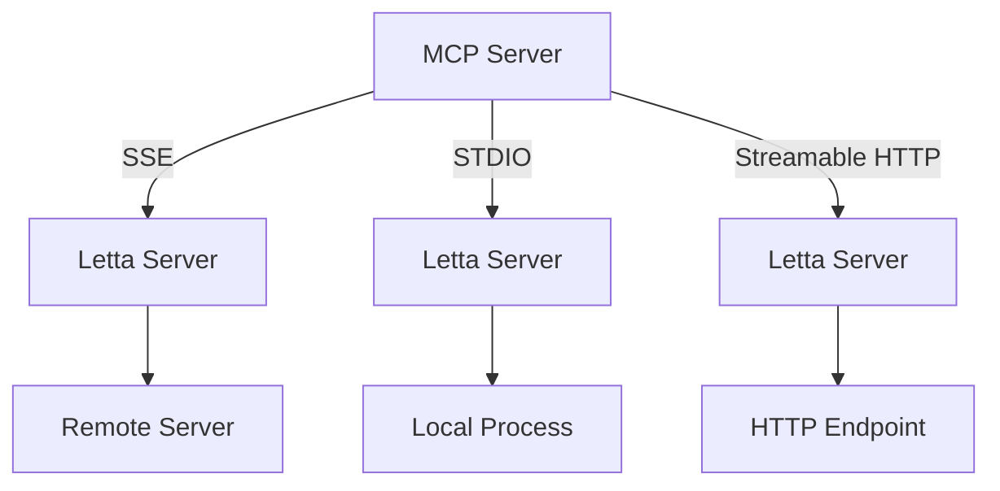
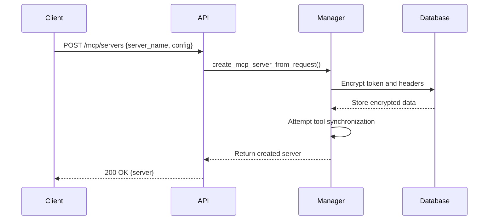
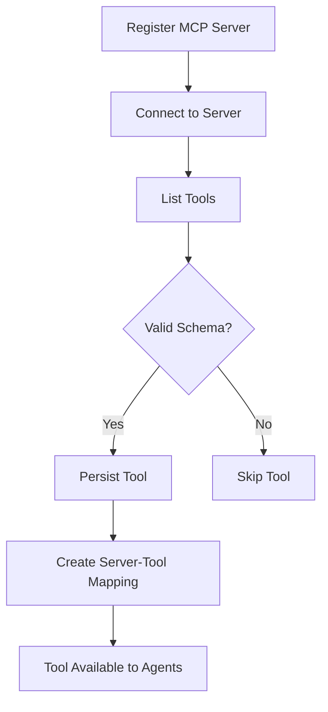
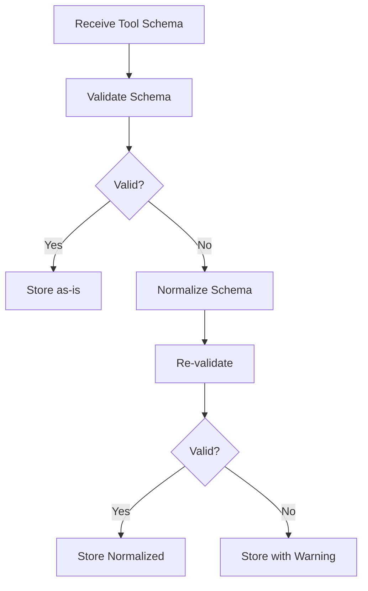
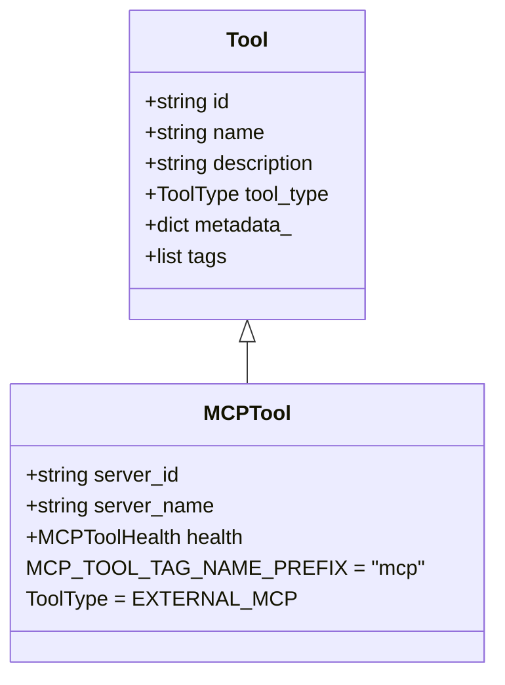
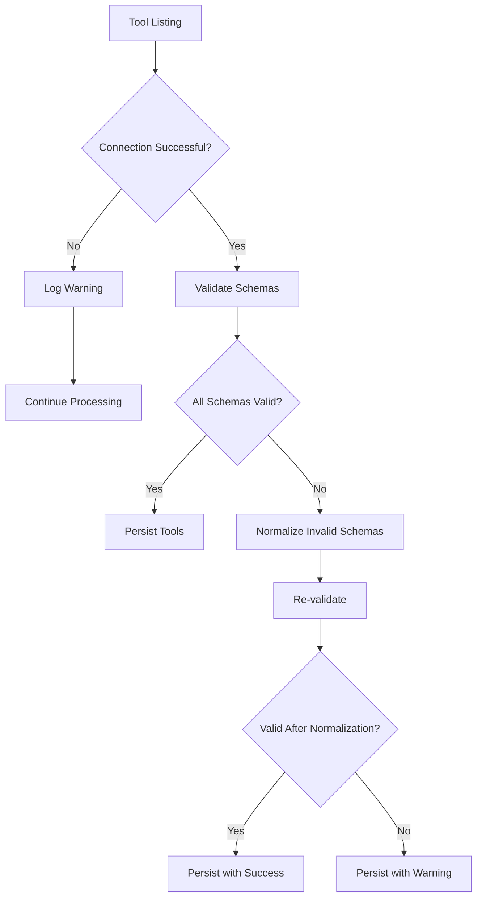
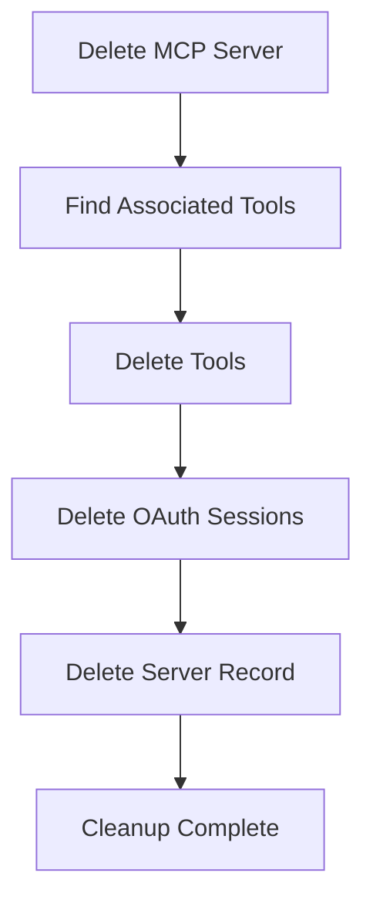

# MCP Servers

<cite>
**Referenced Files in This Document**   
- [mcp_server.py](file://letta/orm/mcp_server.py)
- [mcp_server_manager.py](file://letta/services/mcp_server_manager.py)
- [mcp_manager.py](file://letta/services/mcp_manager.py)
- [mcp.py](file://letta/schemas/mcp.py)
- [mcp_server.py](file://letta/schemas/mcp_server.py)
- [base_client.py](file://letta/services/mcp/base_client.py)
- [sse_client.py](file://letta/services/mcp/sse_client.py)
- [stdio_client.py](file://letta/services/mcp/stdio_client.py)
- [streamable_http_client.py](file://letta/services/mcp/streamable_http_client.py)
- [schema_generator.py](file://letta/functions/schema_generator.py)
- [schema_validator.py](file://letta/functions/schema_validator.py)
- [constants.py](file://letta/constants.py)
- [tool.py](file://letta/schemas/tool.py)
- [tool_manager.py](file://letta/services/tool_manager.py)
- [v1/mcp_servers.py](file://letta/server/rest_api/routers/v1/mcp_servers.py)
- [v1/tools.py](file://letta/server/rest_api/routers/v1/tools.py)
</cite>

## Table of Contents
1. [Introduction](#introduction)
2. [MCP Server Connection Types](#mcp-server-connection-types)
3. [MCP Server Registration](#mcp-server-registration)
4. [Tool Synchronization and Management](#tool-synchronization-and-management)
5. [Tool Normalization and Schema Validation](#tool-normalization-and-schema-validation)
6. [Metadata Tagging and Security Model](#metadata-tagging-and-security-model)
7. [Error Handling](#error-handling)
8. [API Examples](#api-examples)
9. [Deletion and Cleanup](#deletion-and-cleanup)

## Introduction

MCP (Model Context Protocol) Servers in Letta provide a standardized way to extend agent capabilities by integrating external tools through the Model Context Protocol. This documentation details how MCP servers are implemented, managed, and integrated within the Letta system. MCP servers act as bridges between Letta agents and external tool providers, enabling agents to access a wide range of functionalities beyond their core capabilities.

The integration process involves registering an MCP server with authentication credentials and connection details, after which tools are automatically synchronized from the server. These tools are then made available to agents for execution, with comprehensive security, error handling, and metadata tracking mechanisms in place. The system supports multiple connection types (SSE, STDIO, and Streamable HTTP) to accommodate different deployment scenarios and server architectures.

**Section sources**
- [mcp_server.py](file://letta/orm/mcp_server.py#L1-L71)
- [mcp.py](file://letta/schemas/mcp.py#L1-L100)
- [mcp_server.py](file://letta/schemas/mcp_server.py#L1-L446)

## MCP Server Connection Types

Letta supports three connection types for MCP servers: Server-Sent Events (SSE), Standard Input/Output (STDIO), and Streamable HTTP. Each connection type is designed for different deployment scenarios and server architectures, providing flexibility in how external tools are integrated.

### SSE (Server-Sent Events)
SSE is the primary connection type for remote MCP servers. It establishes a persistent connection between Letta and the MCP server, allowing for efficient bidirectional communication. The SSE client connects to the server URL specified in the configuration and maintains the connection for tool listing and execution. Authentication is handled through custom headers, with support for bearer tokens and other authentication schemes.

### STDIO (Standard Input/Output)
STDIO is used for local MCP servers that run as separate processes. The connection is established by spawning a child process with the specified command and arguments. Communication occurs through the process's standard input and output streams. This connection type is ideal for development and testing scenarios, as well as for tools that are packaged as standalone executables.

### Streamable HTTP
Streamable HTTP provides an alternative connection method for MCP servers that support HTTP-based streaming. This connection type uses HTTP requests and responses with streaming capabilities, making it suitable for servers deployed behind standard web infrastructure. It supports custom headers and authentication tokens, similar to the SSE connection type.



**Diagram sources **
- [base_client.py](file://letta/services/mcp/base_client.py#L1-L115)
- [sse_client.py](file://letta/services/mcp/sse_client.py#L1-L33)
- [stdio_client.py](file://letta/services/mcp/stdio_client.py#L1-L26)
- [streamable_http_client.py](file://letta/services/mcp/streamable_http_client.py#L1-L78)

**Section sources**
- [base_client.py](file://letta/services/mcp/base_client.py#L1-L115)
- [sse_client.py](file://letta/services/mcp/sse_client.py#L1-L33)
- [stdio_client.py](file://letta/services/mcp/stdio_client.py#L1-L26)
- [streamable_http_client.py](file://letta/services/mcp/streamable_http_client.py#L1-L78)

## MCP Server Registration

Registering an MCP server in Letta involves creating a server configuration with authentication tokens and custom headers. The registration process securely stores sensitive information and establishes the connection parameters for tool synchronization.

### Authentication and Headers
MCP servers can be registered with authentication tokens and custom headers to ensure secure communication. The token is encrypted and stored in the database, while custom headers are serialized as JSON and encrypted. This ensures that sensitive authentication information is protected at rest.

When registering an SSE or Streamable HTTP server, the authentication header name and token value can be specified. For example, a server might use "Authorization" as the header name with a bearer token. Custom headers allow for additional authentication schemes or metadata to be included in requests.

### Configuration Process
The registration process uses discriminated unions in the API schema to handle different connection types. When creating an MCP server, the client specifies the server type (SSE, STDIO, or Streamable HTTP) and provides the corresponding configuration parameters.

For SSE servers, the configuration includes the server URL, authentication header, authentication token, and custom headers. For STDIO servers, the configuration includes the command to execute, arguments to pass to the command, and environment variables to set. For Streamable HTTP servers, the configuration is similar to SSE servers but uses a different transport mechanism.



**Diagram sources **
- [mcp_server_manager.py](file://letta/services/mcp_server_manager.py#L498-L570)
- [mcp_server.py](file://letta/schemas/mcp_server.py#L25-L114)
- [v1/mcp_servers.py](file://letta/server/rest_api/routers/v1/mcp_servers.py#L1-L72)

**Section sources**
- [mcp_server_manager.py](file://letta/services/mcp_server_manager.py#L498-L570)
- [mcp_server.py](file://letta/schemas/mcp_server.py#L25-L114)
- [v1/mcp_servers.py](file://letta/server/rest_api/routers/v1/mcp_servers.py#L1-L72)

## Tool Synchronization and Management

When an MCP server is registered, tools are automatically synchronized from the server and made available to agents. This process involves listing tools from the server, validating their schemas, and persisting them in the Letta database.

### Automatic Tool Synchronization
During server registration, Letta attempts to optimistically sync tools from the MCP server. The process involves:
1. Creating the MCP server record in the database
2. Connecting to the MCP server to list available tools
3. Filtering out invalid tools
4. Persisting valid tools in parallel for efficiency
5. Creating mappings between the MCP server and its tools

The synchronization process is best-effort, meaning that if tool synchronization fails, the server is still created successfully. This ensures that server registration is not blocked by temporary connectivity issues or tool validation problems.

### Tool Persistence and Mapping
Synchronized tools are stored in the Letta database with metadata linking them to their source MCP server. A separate mapping table (mcp_tools) maintains the relationship between MCP servers and tools, enabling efficient querying and cascade deletion.

When tools are added or updated, the system checks for schema changes and updates existing tools accordingly. New tools are added to the database, while tools that no longer exist on the server are deleted. This ensures that the local tool registry remains in sync with the remote MCP server.



**Diagram sources **
- [mcp_server_manager.py](file://letta/services/mcp_server_manager.py#L588-L655)
- [mcp_manager.py](file://letta/services/mcp_manager.py#L470-L524)
- [mcp_server.py](file://letta/orm/mcp_server.py#L64-L71)

**Section sources**
- [mcp_server_manager.py](file://letta/services/mcp_server_manager.py#L588-L655)
- [mcp_manager.py](file://letta/services/mcp_manager.py#L470-L524)
- [mcp_server.py](file://letta/orm/mcp_server.py#L64-L71)

## Tool Normalization and Schema Validation

Tools from MCP servers undergo a normalization and validation process to ensure compatibility with Letta's tool execution system. This process handles schema inconsistencies and prepares tools for reliable execution.

### Schema Validation
Each tool's JSON schema is validated against OpenAI's strict mode requirements using a comprehensive validation process. The validation checks for:
- Proper type definitions
- Required properties
- Additional properties restrictions
- Object and array schema correctness
- Union type handling

The validation process returns a health status (STRICT_COMPLIANT, NON_STRICT_ONLY, or INVALID) and a list of reasons for any issues found. This allows the system to identify and handle problematic schemas appropriately.

### Schema Normalization
For tools with invalid or non-compliant schemas, Letta attempts to normalize the schema before persistence. The normalization process:
1. Adds explicit 'additionalProperties': false to all object types
2. Adds explicit 'type' fields to properties using $ref
3. Processes $defs recursively
4. Handles anyOf arrays by deduplicating entries

This normalization increases the likelihood that tools with imperfect schemas can still be used effectively within Letta. After normalization, the schema is re-validated to determine if it has become compliant.



**Diagram sources **
- [schema_generator.py](file://letta/functions/schema_generator.py#L589-L694)
- [schema_validator.py](file://letta/functions/schema_validator.py#L1-L203)
- [mcp_server_manager.py](file://letta/services/mcp_server_manager.py#L237-L267)

**Section sources**
- [schema_generator.py](file://letta/functions/schema_generator.py#L589-L694)
- [schema_validator.py](file://letta/functions/schema_validator.py#L1-L203)
- [mcp_server_manager.py](file://letta/services/mcp_server_manager.py#L237-L267)

## Metadata Tagging and Security Model

MCP tools are tagged with metadata that identifies their source server and enforces security policies. This metadata system ensures proper attribution, access control, and execution context for external tools.

### Metadata Tagging System
Tools from MCP servers are tagged with a metadata prefix defined by MCP_TOOL_TAG_NAME_PREFIX (default: "mcp"). The full tag format is "mcp:server_name", which associates each tool with its source server. This tagging system enables:
- Efficient querying of tools by source server
- Proper attribution in agent interactions
- Cascade deletion when servers are removed
- Security context for tool execution

The metadata is stored in the tool's metadata field and includes the server ID and server name, allowing for robust identification even if server names change.

### Security Model
Tools from MCP servers are marked with ToolType.EXTERNAL_MCP, distinguishing them from built-in and user-created tools. This type designation enables specific security policies and execution contexts for external tools.

When executing MCP tools, the server context is included in the metadata, ensuring that tools are executed with the appropriate authentication and configuration. The system also supports agent-specific headers, allowing for fine-grained access control based on the executing agent.



**Diagram sources **
- [constants.py](file://letta/constants.py#L1-L200)
- [tool.py](file://letta/schemas/tool.py#L129-L166)
- [tool_manager.py](file://letta/services/tool_manager.py#L1-L200)

**Section sources**
- [constants.py](file://letta/constants.py#L1-L200)
- [tool.py](file://letta/schemas/tool.py#L129-L166)
- [tool_manager.py](file://letta/services/tool_manager.py#L1-L200)

## Error Handling

The MCP server integration includes comprehensive error handling for tool listing and execution, with appropriate logging levels to avoid unnecessary alerts while providing visibility into issues.

### Connection and Timeout Errors
During tool listing, connection issues and timeouts are handled gracefully. These errors are logged at warning level rather than error level to avoid triggering unnecessary alerts, as they are often due to temporary network issues or server misconfiguration rather than system failures.

The system distinguishes between different types of connection errors and provides specific error messages:
- Connection refused: Indicates the server is not running or accessible
- 404 Not Found: Indicates the URL is incorrect or the server doesn't support MCP
- JSON validation errors: Indicates the server is not returning valid MCP responses

### Schema Validation Warnings
When tools have invalid schemas, the system logs warnings but still allows the tools to be persisted in many cases. This approach balances strict schema requirements with practical usability, allowing agents to use tools even if their schemas have minor issues.

For tools with invalid schemas, the system attempts normalization before persistence. If normalization fails, the tool is still stored but marked with its health status and validation reasons, allowing developers to identify and fix issues.



**Diagram sources **
- [mcp_server_manager.py](file://letta/services/mcp_server_manager.py#L160-L191)
- [mcp_manager.py](file://letta/services/mcp_manager.py#L66-L93)
- [v1/tools.py](file://letta/server/rest_api/routers/v1/tools.py#L441-L463)

**Section sources**
- [mcp_server_manager.py](file://letta/services/mcp_server_manager.py#L160-L191)
- [mcp_manager.py](file://letta/services/mcp_manager.py#L66-L93)
- [v1/tools.py](file://letta/server/rest_api/routers/v1/tools.py#L441-L463)

## API Examples

The following examples demonstrate how to create MCP servers with different configurations and retrieve available tools using the Letta API.

### Creating an SSE MCP Server
```python
# Create an SSE MCP server with authentication
client.mcp_servers.create(
    server_name="weather-api",
    config={
        "mcp_server_type": "sse",
        "server_url": "https://api.weather.com/mcp",
        "auth_header": "Authorization",
        "auth_token": "Bearer your-api-key",
        "custom_headers": {
            "X-Client-ID": "your-client-id"
        }
    }
)
```

### Creating a STDIO MCP Server
```python
# Create a STDIO MCP server for a local tool
client.mcp_servers.create(
    server_name="local-tools",
    config={
        "mcp_server_type": "stdio",
        "command": "npx",
        "args": ["-y", "@modelcontextprotocol/server-everything"],
        "env": {
            "NODE_ENV": "production"
        }
    }
)
```

### Creating a Streamable HTTP MCP Server
```python
# Create a Streamable HTTP MCP server
client.mcp_servers.create(
    server_name="http-tools",
    config={
        "mcp_server_type": "streamable_http",
        "server_url": "https://tools.example.com/mcp",
        "auth_header": "X-API-Key",
        "auth_token": "your-secret-key"
    }
)
```

### Retrieving Available Tools
```python
# List tools from a specific MCP server
tools = client.mcp_servers.list_tools("weather-api")
for tool in tools:
    print(f"Tool: {tool.name}")
    print(f"Description: {tool.description}")
```

**Section sources**
- [v1/mcp_servers.py](file://letta/server/rest_api/routers/v1/mcp_servers.py#L1-L143)
- [v1/tools.py](file://letta/server/rest_api/routers/v1/tools.py#L131-L143)
- [mcp_servers_test.py](file://tests/sdk/mcp_servers_test.py#L190-L207)

## Deletion and Cleanup

Deleting an MCP server triggers a cascade deletion process that removes all associated tools and OAuth sessions. This ensures data consistency and prevents orphaned resources.

### Cascade Deletion Process
When an MCP server is deleted, the following cleanup operations occur:
1. All tools associated with the server are identified through the metadata tagging system
2. Each tool is hard-deleted from the database
3. OAuth sessions for the same user and server URL are deleted
4. The MCP server record is removed from the database

This cascade deletion ensures that no orphaned tools remain in the system after their source server is removed.

### Cleanup Implementation
The deletion process is implemented in the MCPManager's delete_mcp_server_by_id method. It queries for all tools with matching metadata, filters them by the server ID, and deletes them in a single transaction. OAuth sessions are also cleaned up to remove any authentication state associated with the server.



**Diagram sources **
- [mcp_manager.py](file://letta/services/mcp_manager.py#L662-L722)
- [mcp_server.py](file://letta/orm/mcp_server.py#L64-L71)

**Section sources**
- [mcp_manager.py](file://letta/services/mcp_manager.py#L662-L722)
- [mcp_server.py](file://letta/orm/mcp_server.py#L64-L71)