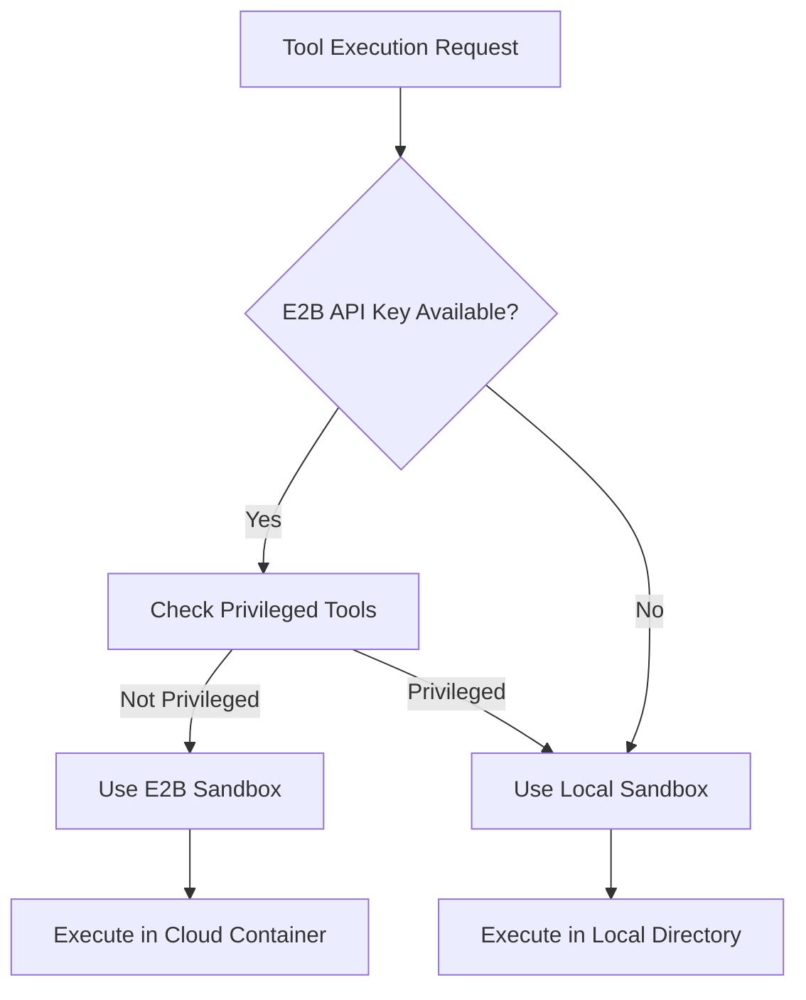
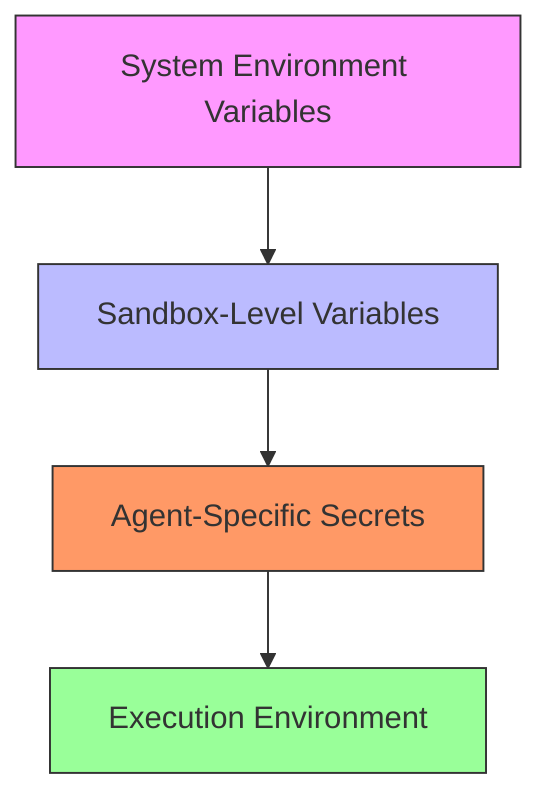
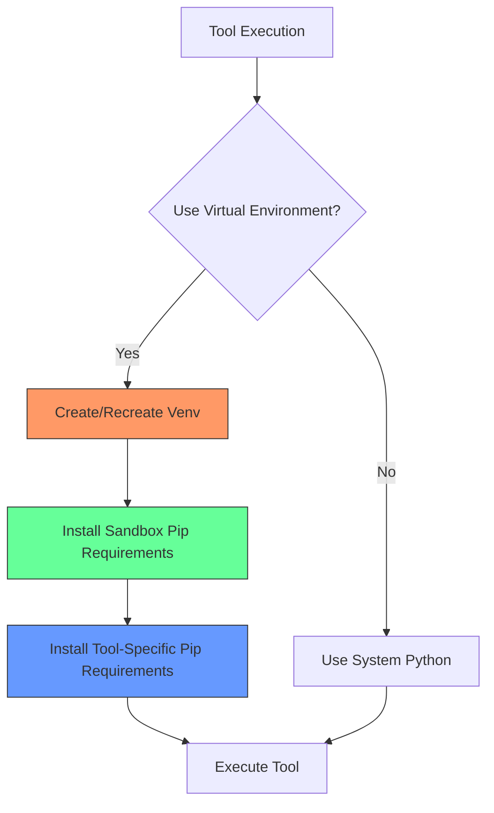
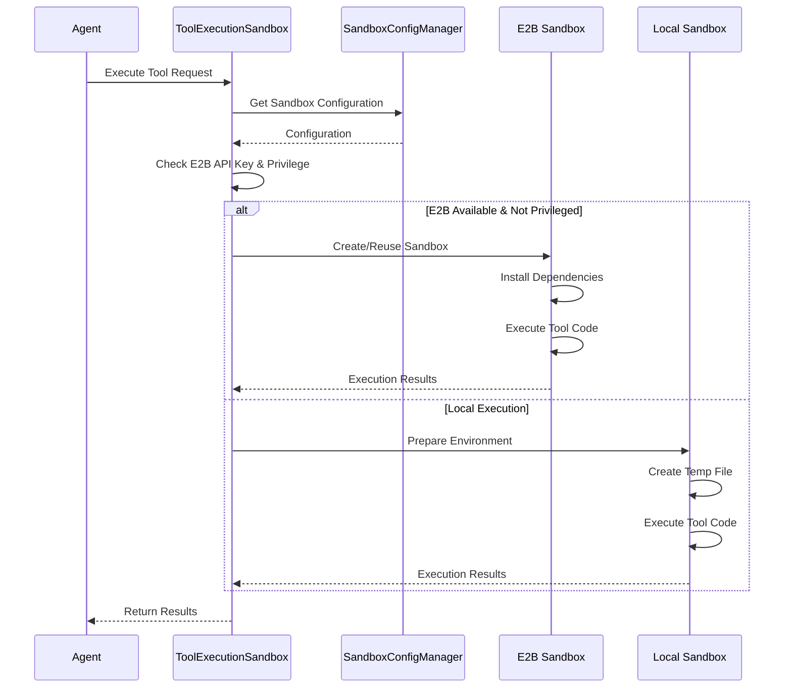
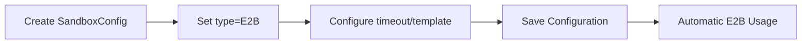
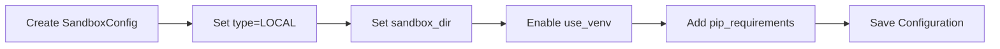
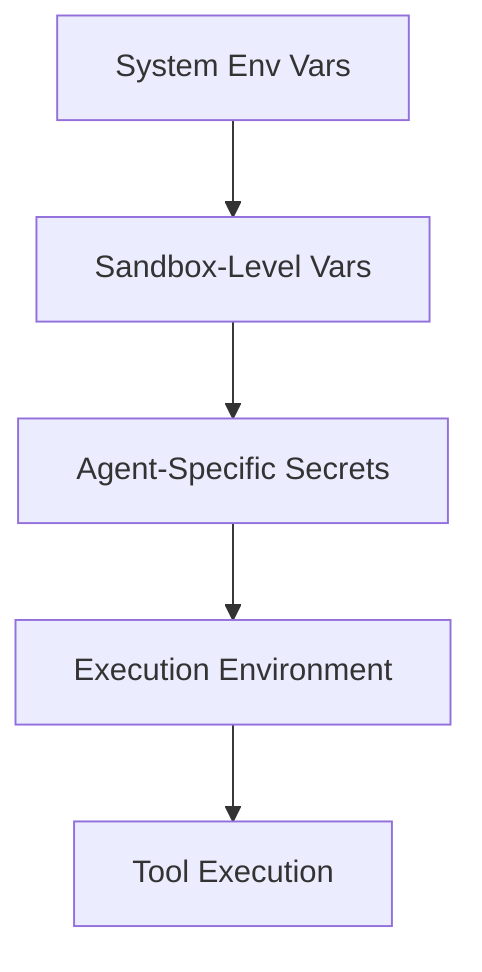
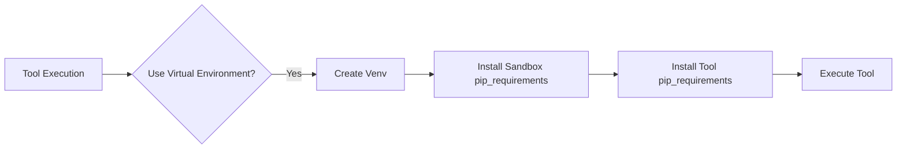

# Tool Sandboxes

<cite>
**Referenced Files in This Document**   
- [tool_execution_sandbox.py](file://letta/services/tool_executor/tool_execution_sandbox.py)
- [sandbox_config_manager.py](file://letta/services/sandbox_config_manager.py)
- [e2b_sandbox.py](file://letta/services/tool_sandbox/e2b_sandbox.py)
- [local_sandbox.py](file://letta/services/tool_sandbox/local_sandbox.py)
- [sandbox_config.py](file://letta/schemas/sandbox_config.py)
- [pip_requirement.py](file://letta/schemas/pip_requirement.py)
- [npm_requirement.py](file://letta/schemas/npm_requirement.py)
</cite>

## Table of Contents
1. [Introduction](#introduction)
2. [Sandbox Types](#sandbox-types)
3. [Configuration System](#configuration-system)
4. [Environment Variable Hierarchy](#environment-variable-hierarchy)
5. [Dependency Management](#dependency-management)
6. [Execution Flow](#execution-flow)
7. [Security Considerations](#security-considerations)
8. [Configuration Examples](#configuration-examples)

## Introduction
Tool Sandboxes in Letta provide secure, isolated execution environments for agent tools, enabling controlled code execution with restricted resource access. The system is designed to balance functionality with safety by offering multiple sandbox types with varying levels of isolation and security. Sandboxes execute tool code in isolated environments, preventing potential security risks while allowing agents to perform complex operations. The architecture supports both cloud-based isolated environments through E2B and local execution in controlled directories, giving administrators flexibility in deployment options based on their security requirements and infrastructure constraints.

**Section sources**
- [tool_execution_sandbox.py](file://letta/services/tool_executor/tool_execution_sandbox.py#L37-L597)

## Sandbox Types
Letta supports two primary sandbox types for executing agent tools: E2B for cloud-based isolated environments and Local for direct execution in a controlled directory. The E2B sandbox type leverages cloud infrastructure to provide complete isolation, running tool code in ephemeral containers that are destroyed after execution. This approach offers the highest security level by ensuring no persistent state remains between executions and preventing any potential access to the host system. The Local sandbox type executes tools directly on the host machine within a designated directory, providing faster execution at the cost of reduced isolation. This type is suitable for trusted environments where performance is prioritized over maximum security. The system automatically selects the appropriate sandbox type based on the availability of an E2B API key and the tool's privilege level, ensuring optimal execution while maintaining security boundaries.

**Diagram sources**
- [tool_execution_sandbox.py](file://letta/services/tool_executor/tool_execution_sandbox.py#L92-L97)

**Section sources**
- [tool_execution_sandbox.py](file://letta/services/tool_executor/tool_execution_sandbox.py#L92-L97)
- [e2b_sandbox.py](file://letta/services/tool_sandbox/e2b_sandbox.py#L26-L264)
- [local_sandbox.py](file://letta/services/tool_sandbox/local_sandbox.py#L31-L276)

## Configuration System
The SandboxConfigManager class manages sandbox settings through a comprehensive configuration system that handles directory paths, environment variables, and dependency requirements. This system provides a centralized interface for configuring both E2B and Local sandbox types, allowing administrators to define execution parameters that are persisted in the database. For Local sandboxes, configuration includes the sandbox directory path, virtual environment settings, and pip requirements. For E2B sandboxes, configuration covers timeout settings, template IDs, and cloud-specific parameters. The manager implements CRUD operations for sandbox configurations and environment variables, supporting asynchronous operations for improved performance. Default configurations are automatically created when none exist, ensuring consistent behavior across different organizations. The system also supports multiple sandbox configurations per organization, enabling different execution environments for various use cases.

**Section sources**
- [sandbox_config_manager.py](file://letta/services/sandbox_config_manager.py#L28-L353)
- [sandbox_config.py](file://letta/schemas/sandbox_config.py#L97-L144)

## Environment Variable Hierarchy
The environment variable system implements a hierarchical override mechanism where agent-specific secrets take precedence over sandbox-level variables, which in turn override system environment variables. This layered approach provides fine-grained control over configuration while maintaining security best practices. At the base level, system environment variables provide default values accessible to all sandboxes. Sandbox-level environment variables, configured through the SandboxConfigManager, offer organization-specific settings that can be shared across multiple agents. The highest priority layer consists of agent-specific secrets, which are injected at runtime and can override any lower-level variables with the same key. This hierarchy ensures that sensitive credentials and configuration values can be securely managed at the appropriate scope, preventing accidental exposure while allowing necessary customization for individual agents. The system automatically merges these layers during tool execution, with later layers taking precedence over earlier ones.

**Diagram sources**
- [tool_execution_sandbox.py](file://letta/services/tool_executor/tool_execution_sandbox.py#L128-L139)
- [local_sandbox.py](file://letta/services/tool_sandbox/local_sandbox.py#L67-L81)

**Section sources**
- [tool_execution_sandbox.py](file://letta/services/tool_executor/tool_execution_sandbox.py#L128-L139)
- [local_sandbox.py](file://letta/services/tool_sandbox/local_sandbox.py#L67-L81)
- [sandbox_config_manager.py](file://letta/services/sandbox_config_manager.py#L310-L331)

## Dependency Management
The dependency management system supports both pip and npm requirements installation with optional virtual environment isolation for Python dependencies. For Local sandboxes, the system can create and manage isolated virtual environments using Python's venv module, preventing conflicts between different tool dependencies. Pip requirements can be specified at both the sandbox configuration level and the individual tool level, with tool-specific requirements taking precedence. The system automatically installs these dependencies when a sandbox is created or when configuration changes are detected. For E2B sandboxes, pip requirements are installed in the cloud container during initialization, ensuring consistent environments across executions. The system also supports npm requirements for Node.js-based tools, particularly in Modal sandboxes. Dependency installation is handled with error reporting and logging, providing visibility into installation issues. Virtual environments can be force-recreated when needed, ensuring clean dependency states and preventing corruption from previous installations.

**Diagram sources**
- [local_sandbox.py](file://letta/services/tool_sandbox/local_sandbox.py#L88-L92)
- [tool_execution_sandbox.py](file://letta/services/tool_executor/tool_execution_sandbox.py#L180-L192)
- [tool_execution_helper.py](file://letta/services/helpers/tool_execution_helper.py#L86-L136)

**Section sources**
- [local_sandbox.py](file://letta/services/tool_sandbox/local_sandbox.py#L88-L92)
- [tool_execution_sandbox.py](file://letta/services/tool_executor/tool_execution_sandbox.py#L180-L192)
- [tool_execution_helper.py](file://letta/services/helpers/tool_execution_helper.py#L86-L136)
- [pip_requirement.py](file://letta/schemas/pip_requirement.py#L6-L14)
- [npm_requirement.py](file://letta/schemas/npm_requirement.py#L5-L12)

## Execution Flow
The ToolExecutionSandbox class routes execution to the appropriate sandbox type based on E2B API key availability and tool privilege level, implementing a decision flow that prioritizes security while maintaining functionality. When a tool execution request is received, the system first checks for the presence of an E2B API key. If available and the tool is not privileged, the system uses the E2B sandbox for maximum isolation. If the E2B API key is not available or the tool requires privileged access, the system falls back to the Local sandbox. Before execution, the system gathers environment variables from all levels of the hierarchy, merges them according to the override rules, and prepares the execution environment. For Local sandboxes with virtual environments, the system ensures the venv exists and installs required dependencies. The tool code is then executed in the appropriate environment, with stdout and stderr captured for logging and debugging. After execution, temporary files are cleaned up, and results are returned to the calling agent. The system implements timeout protection and error handling to prevent hanging processes and provide meaningful error messages.

**Diagram sources**
- [tool_execution_sandbox.py](file://letta/services/tool_executor/tool_execution_sandbox.py#L77-L106)
- [e2b_sandbox.py](file://letta/services/tool_sandbox/e2b_sandbox.py#L42-L147)
- [local_sandbox.py](file://letta/services/tool_sandbox/local_sandbox.py#L49-L146)

**Section sources**
- [tool_execution_sandbox.py](file://letta/services/tool_executor/tool_execution_sandbox.py#L77-L106)
- [e2b_sandbox.py](file://letta/services/tool_sandbox/e2b_sandbox.py#L42-L147)
- [local_sandbox.py](file://letta/services/tool_sandbox/local_sandbox.py#L49-L146)

## Security Considerations
The sandbox system addresses code execution security through multiple layers of protection, balancing functionality with safety. The primary security mechanism is the separation between privileged and non-privileged tools, with privileged tools requiring direct access to the host system and bypassing the more secure E2B sandbox. E2B sandboxes provide the highest security level by executing code in ephemeral cloud containers that are destroyed after use, preventing persistence of malicious code and limiting access to the host system. Local sandboxes implement security through directory isolation, restricting tool execution to designated directories and preventing access to sensitive system areas. The environment variable hierarchy ensures that sensitive credentials are scoped appropriately, with agent-specific secrets taking precedence but remaining isolated to their respective agents. Dependency management includes validation of package sources and version constraints to prevent supply chain attacks. The system also implements timeout limits to prevent infinite loops and resource exhaustion, with comprehensive logging for auditing and monitoring. Despite these protections, administrators should carefully evaluate the risks of enabling privileged tools and implement additional security measures as needed for their specific use cases.

**Section sources**
- [tool_execution_sandbox.py](file://letta/services/tool_executor/tool_execution_sandbox.py#L56-L57)
- [tool_execution_sandbox.py](file://letta/services/tool_executor/tool_execution_sandbox.py#L92-L97)
- [local_sandbox.py](file://letta/services/tool_sandbox/local_sandbox.py#L142-L144)

## Configuration Examples
The following examples demonstrate how to configure different sandbox types, set environment variables at multiple levels, and manage dependencies for tool execution. These examples illustrate the practical application of the sandbox system's features and provide guidance for common configuration scenarios.

### Configuring E2B Sandbox
To configure an E2B sandbox, create a sandbox configuration with E2B-specific parameters such as timeout and template ID. The system will automatically use this configuration when an E2B API key is available and the tool is not privileged.

**Section sources**
- [sandbox_config.py](file://letta/schemas/sandbox_config.py#L58-L69)
- [sandbox_config_manager.py](file://letta/services/sandbox_config_manager.py#L69-L102)

### Configuring Local Sandbox with Virtual Environment
To configure a Local sandbox with dependency isolation, specify the sandbox directory and enable the virtual environment feature. This creates an isolated Python environment for the sandbox, preventing conflicts between different tool dependencies.

**Section sources**
- [sandbox_config.py](file://letta/schemas/sandbox_config.py#L26-L45)
- [sandbox_config_manager.py](file://letta/services/sandbox_config_manager.py#L69-L102)

### Setting Environment Variables at Multiple Levels
Environment variables can be set at different levels with a clear override hierarchy. Sandbox-level variables apply to all tools in the sandbox, while agent-specific secrets can override these values for individual agents.

**Section sources**
- [sandbox_config_manager.py](file://letta/services/sandbox_config_manager.py#L184-L214)
- [tool_execution_sandbox.py](file://letta/services/tool_executor/tool_execution_sandbox.py#L128-L139)

### Managing Dependencies for Tool Execution
Dependencies can be managed at both the sandbox and tool levels, allowing for shared dependencies across tools and tool-specific requirements. The system automatically installs these dependencies when the sandbox is prepared for execution.

**Section sources**
- [tool_execution_helper.py](file://letta/services/helpers/tool_execution_helper.py#L86-L136)
- [local_sandbox.py](file://letta/services/tool_sandbox/local_sandbox.py#L174-L179)