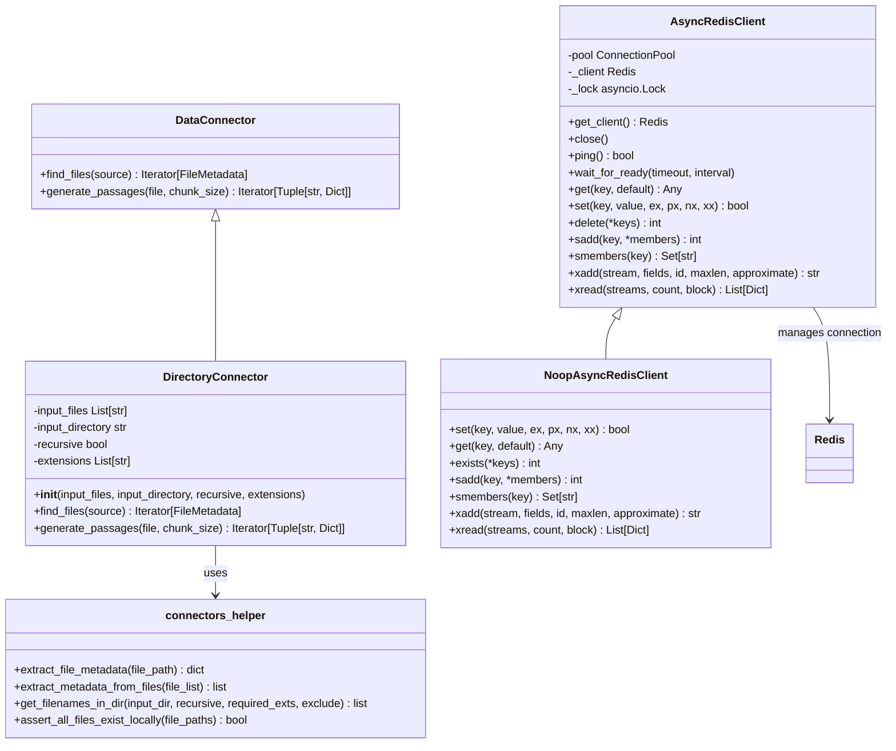
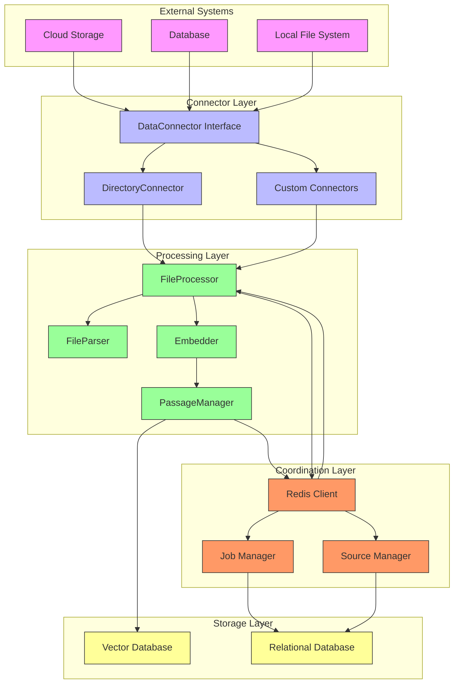
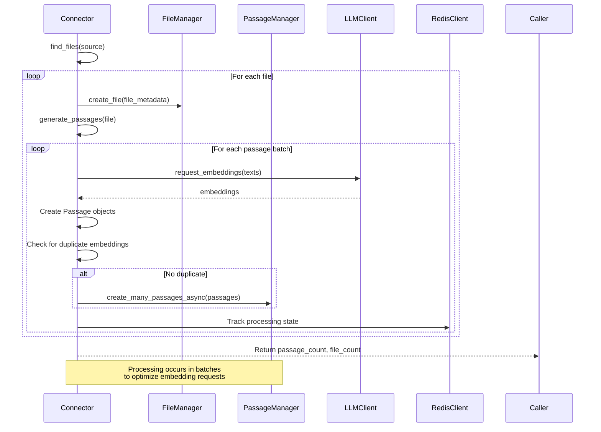
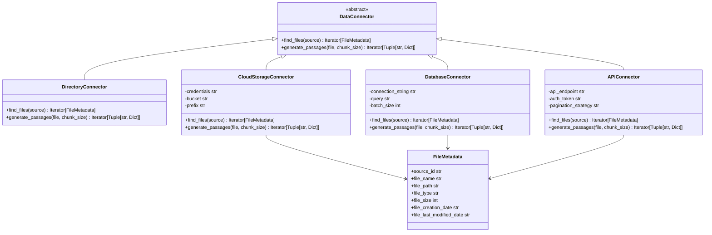
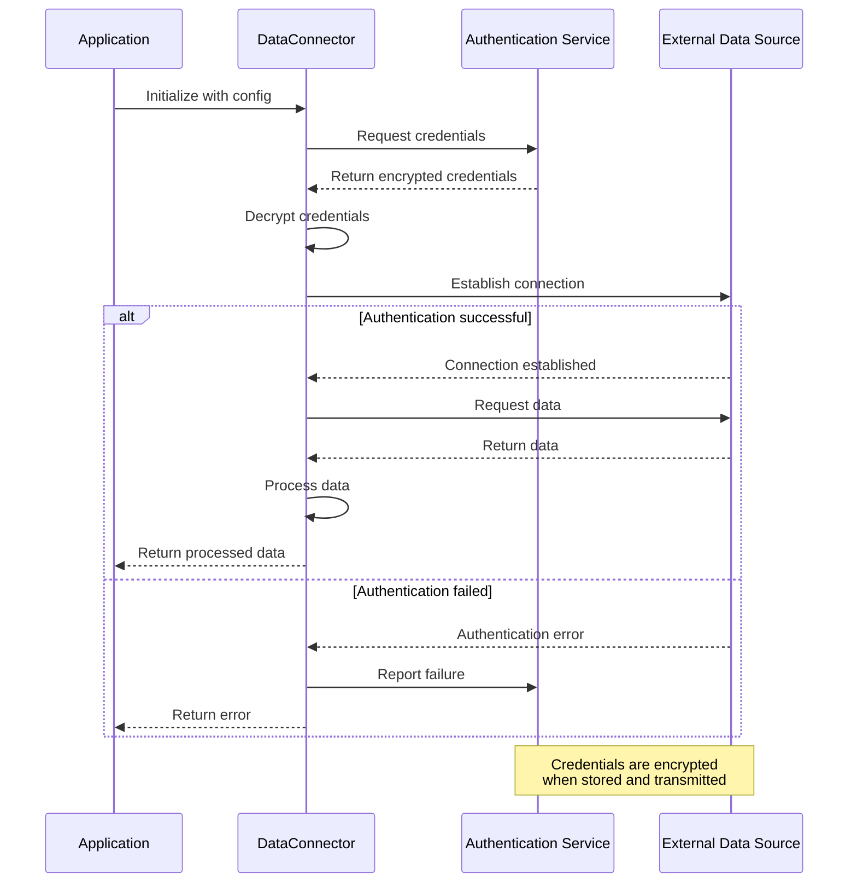
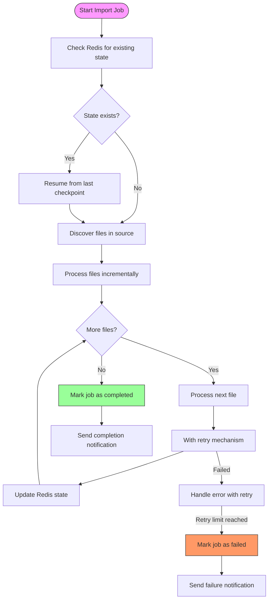
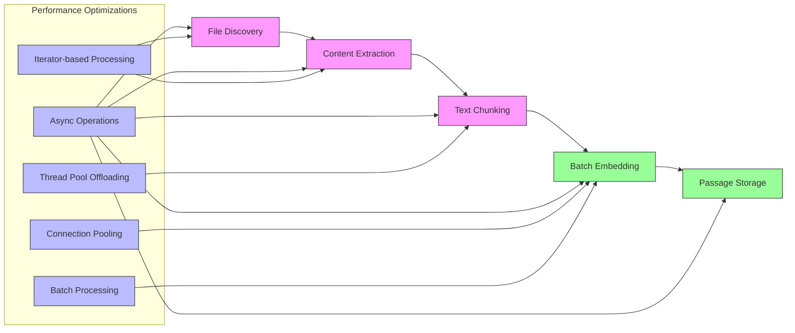

# Data Connectors Integration

<cite>
**Referenced Files in This Document**   
- [connectors.py](file://letta/data_sources/connectors.py)
- [connectors_helper.py](file://letta/data_sources/connectors_helper.py)
- [redis_client.py](file://letta/data_sources/redis_client.py)
- [source.py](file://letta/orm/source.py)
- [source.py](file://letta/schemas/source.py)
- [server.py](file://letta/server/server.py)
- [job_manager.py](file://letta/services/job_manager.py)
- [file_processor.py](file://letta/services/file_processor/file_processor.py)
</cite>

## Table of Contents
1. [Introduction](#introduction)
2. [Core Components](#core-components)
3. [Architecture Overview](#architecture-overview)
4. [Lifecycle of Connector-Initiated Import](#lifecycle-of-connector-initiated-import)
5. [Custom Connector Implementation](#custom-connector-implementation)
6. [Authentication and Security](#authentication-and-security)
7. [Incremental Sync and Error Recovery](#incremental-sync-and-error-recovery)
8. [Configuration Management](#configuration-management)
9. [Performance Considerations](#performance-considerations)
10. [Troubleshooting Guide](#troubleshooting-guide)

## Introduction
The Data Connectors system in Letta enables batch import of files from external systems into the document processing pipeline. This integration framework allows for seamless ingestion of data from various sources such as cloud storage, databases, and local file systems. The connectors.py module serves as the foundation for this functionality, providing a standardized interface for discovering, downloading, preprocessing, and handing off files to the FileProcessor for further processing. This document details the architecture, implementation, and operational aspects of the Data Connectors system, focusing on how it facilitates efficient and reliable data ingestion into Letta's processing workflow.

## Core Components

The Data Connectors system comprises three primary components that work together to enable batch import functionality: connectors.py, connectors_helper.py, and redis_client.py. These components form a cohesive framework for handling data ingestion from external sources into Letta's processing pipeline.

The **connectors.py** module defines the core abstraction for data connectors through the `DataConnector` base class, which establishes the contract for implementing connectors to various data sources. This base class provides two essential methods: `find_files()` for discovering files within a data source and `generate_passages()` for processing those files into passages suitable for embedding. The module also includes the `DirectoryConnector` class as a concrete implementation that demonstrates how to read text data from a directory of files, serving as a reference implementation for custom connectors.

The **connectors_helper.py** module contains utility functions that support the connector framework. Key functions include `extract_file_metadata()` for extracting metadata from individual files, `extract_metadata_from_files()` for processing multiple files, `get_filenames_in_dir()` for recursively scanning directories with filtering capabilities, and `assert_all_files_exist_locally()` for validating file paths. These helper functions provide essential services that connectors can leverage to handle common file operations and metadata extraction tasks.

The **redis_client.py** module implements a robust Redis client for managing state and coordination across distributed processing nodes. The `AsyncRedisClient` class provides connection pooling, error handling, and retry mechanisms to ensure reliable communication with Redis. This component plays a crucial role in maintaining system state, managing distributed locks, and facilitating communication between different processing nodes in a distributed environment.



**Diagram sources**
- [connectors.py](file://letta/data_sources/connectors.py#L14-L205)
- [connectors_helper.py](file://letta/data_sources/connectors_helper.py#L1-L98)
- [redis_client.py](file://letta/data_sources/redis_client.py#L1-L458)

**Section sources**
- [connectors.py](file://letta/data_sources/connectors.py#L1-L205)
- [connectors_helper.py](file://letta/data_sources/connectors_helper.py#L1-L98)
- [redis_client.py](file://letta/data_sources/redis_client.py#L1-L458)

## Architecture Overview

The Data Connectors system follows a modular architecture that separates concerns between data discovery, processing, and state management. This design enables extensibility while maintaining a consistent interface for integrating with Letta's document processing pipeline.

The architecture consists of three main layers: the connector layer, the processing layer, and the coordination layer. The connector layer implements the `DataConnector` interface to discover and access files from various sources. The processing layer handles the transformation of raw files into embedded passages suitable for retrieval. The coordination layer manages state and ensures reliable operation across distributed processing nodes.

The system integrates with Letta's ORM layer through the Source model, which represents a collection of files and passages. When a connector discovers files, it creates `FileMetadata` objects that are associated with a specific source. These files are then processed through the `FileProcessor`, which chunks the content and generates embeddings using the configured embedding model.

Communication between components occurs through well-defined interfaces and asynchronous operations. The `load_data()` function serves as the entry point for the import process, coordinating between the connector, file manager, passage manager, and embedding client. This function processes files in batches to optimize embedding requests and handles duplicate detection to prevent redundant storage.



**Diagram sources**
- [connectors.py](file://letta/data_sources/connectors.py#L1-L205)
- [file_processor.py](file://letta/services/file_processor/file_processor.py#L1-L402)
- [redis_client.py](file://letta/data_sources/redis_client.py#L1-L458)
- [source.py](file://letta/orm/source.py#L1-L40)

**Section sources**
- [connectors.py](file://letta/data_sources/connectors.py#L1-L205)
- [file_processor.py](file://letta/services/file_processor/file_processor.py#L1-L402)
- [redis_client.py](file://letta/data_sources/redis_client.py#L1-L458)
- [source.py](file://letta/orm/source.py#L1-L40)

## Lifecycle of Connector-Initiated Import

The lifecycle of a connector-initiated import in Letta follows a well-defined sequence of stages: discovery, download, preprocessing, and handoff to the FileProcessor. This process ensures reliable and efficient ingestion of data from external sources into the document processing pipeline.

The import lifecycle begins with the **discovery** phase, where the connector identifies files to be imported. The `find_files()` method of the `DataConnector` class is responsible for this stage, generating `FileMetadata` objects for each discovered file. For the `DirectoryConnector`, this involves scanning the specified directory (optionally recursively) and filtering files based on extension and exclusion patterns. The `get_filenames_in_dir()` helper function facilitates this process by applying the required filters and ensuring no overlap between inclusion and exclusion rules.

Following discovery, the **download** phase retrieves the actual file content. While the provided code focuses on local file access, the architecture supports remote sources through appropriate connector implementations. The `assert_all_files_exist_locally()` function validates that all discovered file paths are accessible before proceeding, preventing errors during subsequent processing stages.

The **preprocessing** phase transforms raw files into structured passages suitable for embedding. This stage is handled by the `generate_passages()` method, which uses Llama Index parsers to extract text and metadata from files. Different file types are processed appropriately: PDF files use the `PDFReader` while other formats use the `SimpleDirectoryReader`. The content is then chunked using a `TokenTextSplitter` with a configurable chunk size, balancing between context preservation and embedding efficiency.

Finally, the **handoff** to the `FileProcessor` completes the import process. The `load_data()` function coordinates this stage, processing files in batches to optimize embedding requests. It uses the `LLMClient` to request embeddings for each batch of passages, with duplicate detection to prevent redundant storage. The processed passages are then stored in the passage manager and associated with the appropriate source and file.



**Diagram sources**
- [connectors.py](file://letta/data_sources/connectors.py#L40-L142)
- [file_processor.py](file://letta/services/file_processor/file_processor.py#L1-L402)
- [redis_client.py](file://letta/data_sources/redis_client.py#L1-L458)

**Section sources**
- [connectors.py](file://letta/data_sources/connectors.py#L40-L142)
- [file_processor.py](file://letta/services/file_processor/file_processor.py#L1-L402)
- [redis_client.py](file://letta/data_sources/redis_client.py#L1-L458)

## Custom Connector Implementation

Implementing custom connectors for new data sources in Letta follows a straightforward pattern based on extending the `DataConnector` base class. This approach provides a consistent interface while allowing flexibility to handle the specific requirements of different data sources.

To create a custom connector, developers should extend the `DataConnector` class and implement the two required methods: `find_files()` and `generate_passages()`. The `find_files()` method is responsible for discovering files within the data source and returning an iterator of `FileMetadata` objects. Each `FileMetadata` should include essential information such as file name, path, type, size, and timestamps. For remote sources, the path might represent a URL or identifier rather than a local file system path.

The `generate_passages()` method handles the extraction and processing of content from individual files. This method should return an iterator of tuples containing the passage text and associated metadata. For structured data sources, this might involve converting records or documents into text format. For binary formats, appropriate parsers should be used to extract readable content.

When implementing connectors for remote data sources, several considerations are important. Authentication mechanisms should be handled securely, typically through configuration parameters or environment variables. Pagination support is essential for sources with large numbers of files, allowing incremental processing without memory issues. Rate limiting should be respected to avoid overwhelming the source system.

Error recovery is a critical aspect of custom connector implementation. Long-running connector jobs should include retry logic for transient failures and checkpointing to resume from the last successful state after interruptions. The Redis client can be leveraged to store processing state and progress information across distributed nodes.



**Diagram sources**
- [connectors.py](file://letta/data_sources/connectors.py#L14-L205)
- [connectors_helper.py](file://letta/data_sources/connectors_helper.py#L1-L98)

**Section sources**
- [connectors.py](file://letta/data_sources/connectors.py#L14-L205)
- [connectors_helper.py](file://letta/data_sources/connectors_helper.py#L1-L98)

## Authentication and Security

The Data Connectors system in Letta incorporates robust authentication mechanisms to securely access external data sources while protecting sensitive credentials. The architecture follows security best practices to ensure that authentication information is handled safely throughout the import process.

Authentication is primarily managed through configuration parameters passed to connector instances. For example, the `AsyncRedisClient` class accepts an optional password parameter for Redis authentication, which is used to establish secure connections to the Redis server. This approach allows credentials to be provided at runtime without hardcoding them into the source code.

For external data sources requiring authentication, connectors should implement secure credential handling. This typically involves accepting credentials through constructor parameters or configuration objects, rather than embedding them directly in the code. The system should support various authentication methods including API keys, OAuth tokens, and username/password combinations, depending on the requirements of the target data source.

Credential security is enhanced through integration with Letta's encryption capabilities. Sensitive authentication information can be encrypted before storage and decrypted only when needed for establishing connections. This prevents credentials from being exposed in logs or configuration files. The `CryptoUtils` class mentioned in the test files suggests that the system has built-in encryption capabilities for protecting sensitive data.

The Redis client implementation includes additional security features such as connection pooling with secure configuration and retry mechanisms that avoid exposing authentication details in error messages. The `NoopAsyncRedisClient` provides a safe fallback when Redis is not configured, preventing authentication attempts to non-existent servers.



**Diagram sources**
- [redis_client.py](file://letta/data_sources/redis_client.py#L1-L458)
- [connectors.py](file://letta/data_sources/connectors.py#L1-L205)

**Section sources**
- [redis_client.py](file://letta/data_sources/redis_client.py#L1-L458)
- [connectors.py](file://letta/data_sources/connectors.py#L1-L205)

## Incremental Sync and Error Recovery

The Data Connectors system in Letta supports incremental synchronization and robust error recovery mechanisms to ensure reliable operation during long-running import jobs. These features are essential for maintaining data consistency and enabling resumption of interrupted processes.

Incremental sync is facilitated through the use of file metadata, particularly timestamps and unique identifiers. When scanning data sources, connectors can compare the last modified dates of files against previously processed records to identify changes. This allows the system to process only new or updated files, significantly reducing processing time for subsequent sync operations. The `file_last_modified_date` field in `FileMetadata` serves as a key component for implementing this functionality.

Error recovery is implemented through a combination of transactional operations, state tracking, and retry mechanisms. The `AsyncRedisClient` class includes a retry decorator that automatically retries failed operations with exponential backoff, handling transient network issues and temporary service disruptions. This ensures that temporary failures do not terminate long-running connector jobs prematurely.

State management is critical for error recovery in distributed environments. The Redis client stores processing state, allowing connector jobs to resume from the last successful checkpoint after interruptions. This is particularly important for large data imports that may take hours or days to complete. The system tracks progress at the file level, enabling resumption from the last successfully processed file rather than restarting the entire import.

The job management system complements these features by providing status tracking and completion monitoring. The `JobStatus` enum includes states such as `created`, `running`, `completed`, and `failed`, allowing external systems to monitor the progress of import jobs. Callback mechanisms can be configured to notify external systems when jobs complete or fail, enabling automated recovery procedures.



**Diagram sources**
- [redis_client.py](file://letta/data_sources/redis_client.py#L1-L458)
- [job_manager.py](file://letta/services/job_manager.py#L1-L600)
- [connectors.py](file://letta/data_sources/connectors.py#L1-L205)

**Section sources**
- [redis_client.py](file://letta/data_sources/redis_client.py#L1-L458)
- [job_manager.py](file://letta/services/job_manager.py#L1-L600)
- [connectors.py](file://letta/data_sources/connectors.py#L1-L205)

## Configuration Management

Connector configurations in Letta are managed through a combination of the ORM layer and API endpoints, providing a flexible and accessible administration interface. This system allows for persistent storage of connector settings and easy retrieval through standardized interfaces.

The configuration model is built around the `Source` entity in the ORM layer, which represents a data source and its associated settings. The `Source` class includes fields for name, description, instructions, and embedding configuration, providing a comprehensive structure for storing connector-related information. The `embedding_config` field specifically handles the configuration for text embedding, including the embedding model and chunk size parameters.

Configuration storage is implemented through the SQLAlchemy-based ORM system, with the `Source` model mapping to a database table. This ensures that connector configurations are persisted across system restarts and can be reliably retrieved when needed. The `__table_args__` configuration enforces uniqueness constraints on source names within organizations, preventing naming conflicts.

Administration of connector configurations is exposed through REST API endpoints, allowing external systems to create, read, update, and delete source configurations. The API follows standard CRUD patterns with endpoints for listing sources, creating new sources, modifying existing sources, and deleting sources. These endpoints are authenticated and authorized, ensuring that only permitted users can modify configurations.

The configuration system supports both direct parameter passing and persistent storage. Connectors can be configured with parameters at initialization time, or they can retrieve their configuration from the database based on the source identifier. This flexibility allows for both ad-hoc imports with custom settings and scheduled imports using predefined configurations.

```mermaid
erDiagram
SOURCE {
string id PK
string name
string description
string instructions
json embedding_config
json metadata_
enum vector_db_provider
string organization_id FK
string created_by_id FK
string last_updated_by_id FK
datetime created_at
datetime updated_at
}
FILE_METADATA {
string id PK
string source_id FK
string file_name
string file_path
string file_type
int file_size
string file_creation_date
string file_last_modified_date
}
SOURCE ||--o{ FILE_METADATA : contains
JOB {
string id PK
string user_id FK
string agent_id FK
string source_id FK
enum job_type
enum status
string callback_url
json metadata_
datetime created_at
datetime updated_at
datetime completed_at
}
SOURCE ||--o{ JOB : initiates
SOURCE }o--|| ORGANIZATION : belongs to
SOURCE }o--|| USER : created by
SOURCE }o--|| USER : updated by
```

**Diagram sources**
- [source.py](file://letta/orm/source.py#L1-L40)
- [source.py](file://letta/schemas/source.py#L1-L71)
- [server.py](file://letta/server/server.py#L874-L1014)

**Section sources**
- [source.py](file://letta/orm/source.py#L1-L40)
- [source.py](file://letta/schemas/source.py#L1-L71)
- [server.py](file://letta/server/server.py#L874-L1014)

## Performance Considerations

The Data Connectors system in Letta incorporates several performance optimizations to handle large-scale data imports efficiently. These optimizations address key bottlenecks in the import pipeline, from file discovery to embedding generation.

One of the primary performance features is batch processing of embeddings. The system processes passages in batches defined by the `EMBEDDING_BATCH_SIZE` constant, reducing the number of API calls to the embedding service. This approach significantly improves throughput by amortizing network latency across multiple passages. The `load_data()` function implements this batching logic, accumulating passages until the batch size is reached before requesting embeddings.

Connection pooling is another critical optimization, particularly for the Redis client. The `AsyncRedisClient` uses a connection pool to reuse established connections rather than creating new ones for each operation. This reduces the overhead of connection establishment and improves overall throughput, especially in high-concurrency scenarios.

The system leverages asynchronous operations throughout the import pipeline to maximize resource utilization. File discovery, content extraction, and embedding requests are all implemented as async functions, allowing the system to overlap I/O operations and keep the CPU busy with processing tasks. This asynchronous design enables efficient handling of multiple files concurrently without blocking the event loop.

For CPU-intensive operations like text chunking, the system uses `asyncio.to_thread()` to offload work to a thread pool. This prevents blocking the main event loop during computationally expensive operations, maintaining responsiveness and allowing other tasks to proceed concurrently. The chunking operation in the `FileProcessor` class demonstrates this pattern, running the chunking logic in a separate thread to avoid blocking.

Memory usage is optimized through the use of iterators rather than loading all data into memory at once. Both the `find_files()` and `generate_passages()` methods return iterators, allowing the system to process files one at a time without holding the entire dataset in memory. This enables the processing of large datasets that might not fit in memory.



**Diagram sources**
- [connectors.py](file://letta/data_sources/connectors.py#L40-L142)
- [file_processor.py](file://letta/services/file_processor/file_processor.py#L1-L402)
- [redis_client.py](file://letta/data_sources/redis_client.py#L1-L458)

**Section sources**
- [connectors.py](file://letta/data_sources/connectors.py#L40-L142)
- [file_processor.py](file://letta/services/file_processor/file_processor.py#L1-L402)
- [redis_client.py](file://letta/data_sources/redis_client.py#L1-L458)

## Troubleshooting Guide

When troubleshooting issues with the Data Connectors system in Letta, several common problems and their solutions should be considered. This guide addresses the most frequent issues encountered during connector operation and provides diagnostic steps to resolve them.

**File Discovery Issues**: If the connector fails to discover files, verify that the input directory or file paths are correct and accessible. The `assert_all_files_exist_locally()` function will raise a `FileNotFoundError` if any specified files do not exist. Check file permissions and ensure that the application has read access to the specified locations. For remote sources, verify network connectivity and authentication credentials.

**Authentication Problems**: When connecting to external systems, authentication issues are common. Ensure that credentials are correctly configured and have not expired. For OAuth-based systems, check that the redirect URIs are properly configured and that the authorization flow completes successfully. The Redis client logs authentication failures, which can help diagnose connection issues.

**Rate Limiting and Throttling**: External APIs often impose rate limits that can cause import jobs to fail. Implement appropriate retry logic with exponential backoff to handle rate limiting. Monitor API usage and adjust the import schedule to stay within rate limits. The `with_retry()` decorator in the Redis client provides a foundation for implementing retry logic.

**Memory and Performance Issues**: Large imports can consume significant memory and processing resources. Monitor system resources during import operations and consider processing files in smaller batches. The asynchronous design should prevent blocking, but CPU-intensive operations like text chunking may still impact performance. Adjust the `EMBEDDING_BATCH_SIZE` to balance between throughput and memory usage.

**Duplicate Content**: The system includes duplicate detection based on embedding vectors to prevent redundant storage. If duplicate warnings appear frequently, verify that the source data does not contain duplicates and that the chunking strategy is appropriate for the content. Adjust the chunk size if passages are too similar.

**State Management Problems**: In distributed environments, ensure that Redis is properly configured and accessible to all processing nodes. Check that the Redis client can connect and that the connection pool is correctly sized for the expected load. Monitor Redis memory usage to prevent out-of-memory conditions.

**Error Recovery**: For long-running jobs, implement checkpointing to enable resumption after failures. Use the job status tracking to identify where failures occur and implement appropriate recovery strategies. The job management system provides completion callbacks that can be used to trigger recovery procedures.

**Section sources**
- [connectors.py](file://letta/data_sources/connectors.py#L1-L205)
- [connectors_helper.py](file://letta/data_sources/connectors_helper.py#L1-L98)
- [redis_client.py](file://letta/data_sources/redis_client.py#L1-L458)
- [job_manager.py](file://letta/services/job_manager.py#L1-L600)