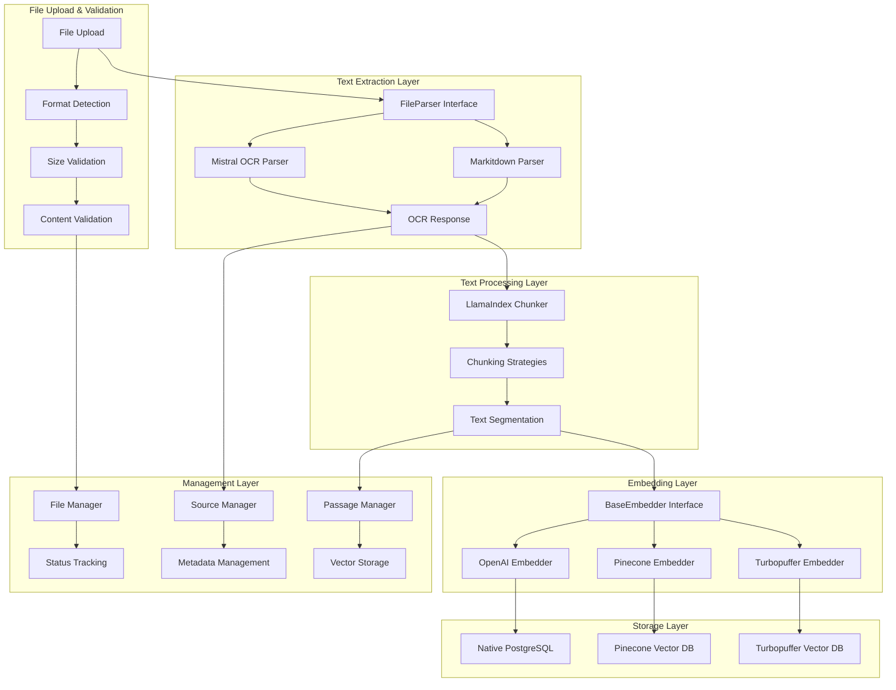
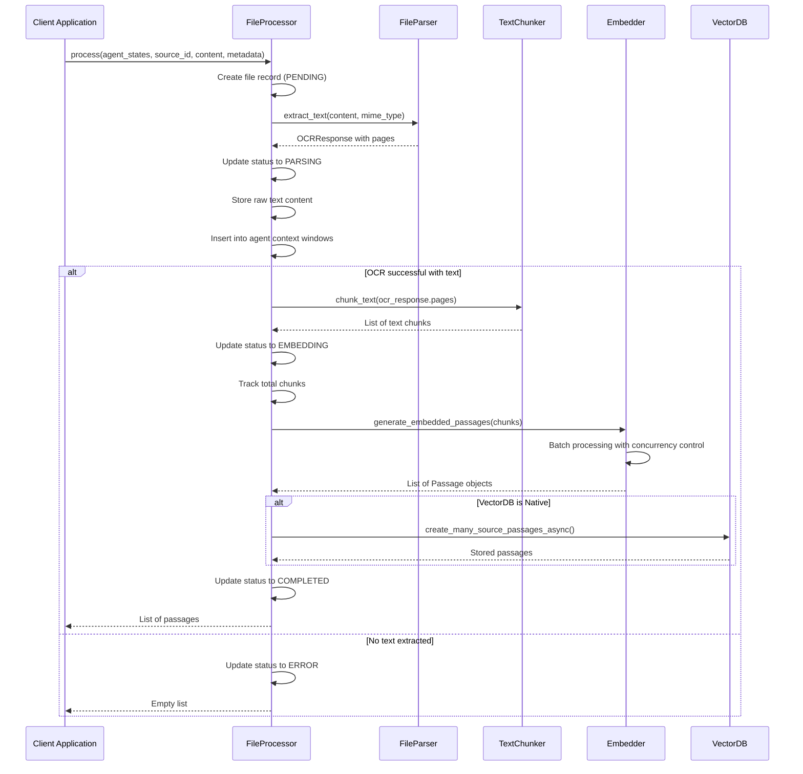
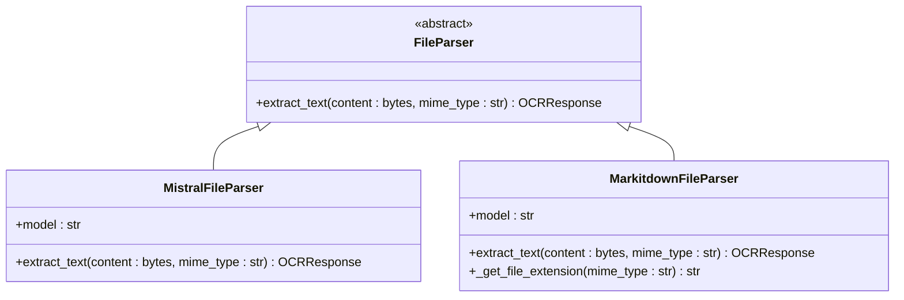
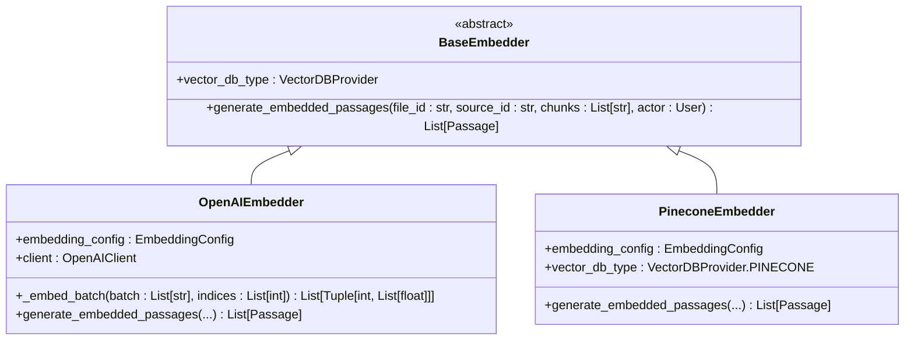
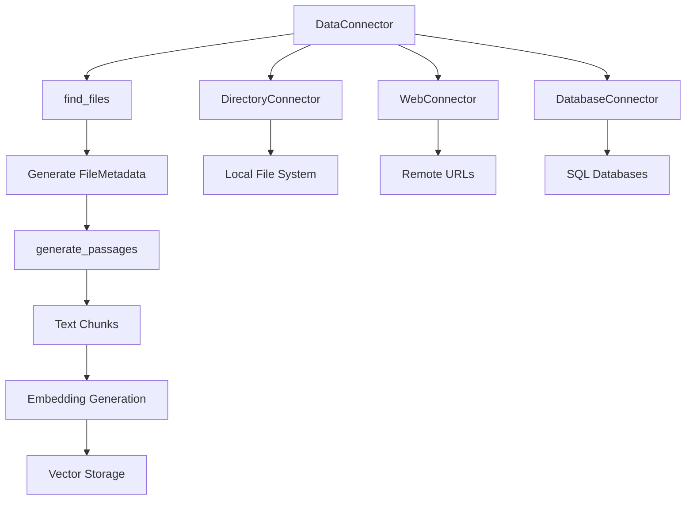
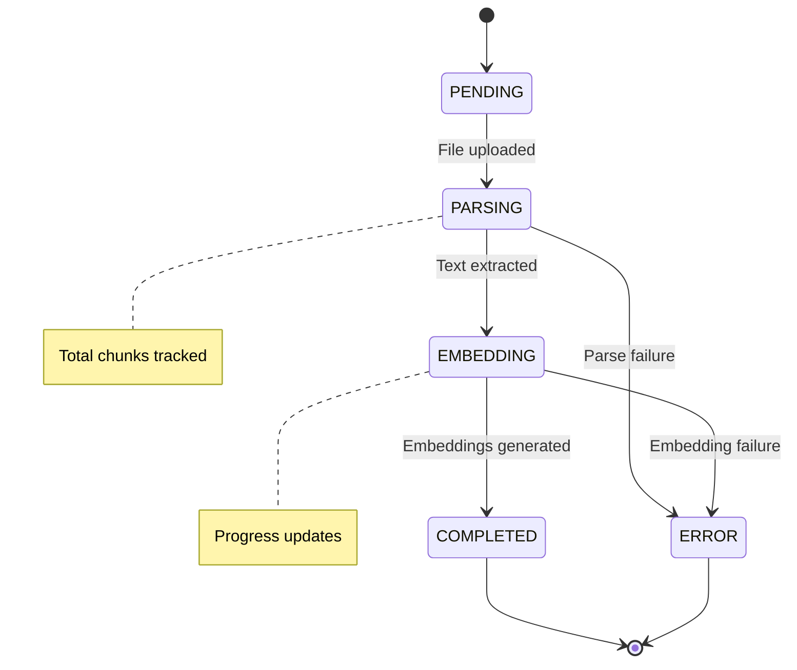

# Document Processing Pipeline

<cite>
**Referenced Files in This Document**
- [file_processor.py](file://letta/services/file_processor/file_processor.py)
- [base_parser.py](file://letta/services/file_processor/parser/base_parser.py)
- [mistral_parser.py](file://letta/services/file_processor/parser/mistral_parser.py)
- [markitdown_parser.py](file://letta/services/file_processor/parser/markitdown_parser.py)
- [llama_index_chunker.py](file://letta/services/file_processor/chunker/llama_index_chunker.py)
- [base_embedder.py](file://letta/services/file_processor/embedder/base_embedder.py)
- [openai_embedder.py](file://letta/services/file_processor/embedder/openai_embedder.py)
- [pinecone_embedder.py](file://letta/services/file_processor/embedder/pinecone_embedder.py)
- [file_types.py](file://letta/services/file_processor/file_types.py)
- [connectors.py](file://letta/data_sources/connectors.py)
- [enums.py](file://letta/schemas/enums.py)
- [embedding_config.py](file://letta/schemas/embedding_config.py)
- [agent_file_manager.py](file://letta/services/agent_file_manager.py)
- [openai_client.py](file://letta/llm_api/openai_client.py)
</cite>

## Table of Contents
1. [Introduction](#introduction)
2. [System Architecture](#system-architecture)
3. [File Processing Workflow](#file-processing-workflow)
4. [Core Components](#core-components)
5. [File Type Support](#file-type-support)
6. [Chunking Strategies](#chunking-strategies)
7. [Embedding Generation](#embedding-generation)
8. [Data Connectors](#data-connectors)
9. [Processing States and Error Handling](#processing-states-and-error-handling)
10. [Performance Optimization](#performance-optimization)
11. [Configuration and Customization](#configuration-and-customization)
12. [Troubleshooting Guide](#troubleshooting-guide)

## Introduction

Letta's Document Processing Pipeline is a sophisticated system designed to handle the complete lifecycle of document ingestion, from file upload to vector storage. The pipeline supports multiple file formats (PDF, DOCX, TXT, JSON, CSV, code files) and employs advanced techniques for text extraction, chunking, and embedding generation.

The system is built around the **FileProcessor** class, which orchestrates the entire workflow while supporting various parsers, chunkers, and embedders. It provides robust error handling, status tracking, and performance optimization features for processing large volumes of documents efficiently.

## System Architecture

The document processing pipeline follows a modular architecture with clear separation of concerns:

**Diagram sources**
- [file_processor.py](file://letta/services/file_processor/file_processor.py#L27-L48)
- [base_parser.py](file://letta/services/file_processor/parser/base_parser.py#L4-L10)
- [base_embedder.py](file://letta/services/file_processor/embedder/base_embedder.py#L12-L22)

## File Processing Workflow

The document processing workflow consists of several distinct stages, each with specific responsibilities and error handling mechanisms:

**Diagram sources**
- [file_processor.py](file://letta/services/file_processor/file_processor.py#L155-L277)
- [file_processor.py](file://letta/services/file_processor/file_processor.py#L318-L401)

**Section sources**
- [file_processor.py](file://letta/services/file_processor/file_processor.py#L155-L277)
- [file_processor.py](file://letta/services/file_processor/file_processor.py#L318-L401)

## Core Components

### FileProcessor Class

The **FileProcessor** class serves as the central orchestrator for the entire document processing pipeline. It coordinates between parsers, chunkers, and embedders while managing file states and error handling.

Key responsibilities:
- **File orchestration**: Manages the complete processing lifecycle from upload to completion
- **Fallback mechanisms**: Implements retry logic with alternative chunking strategies
- **Concurrency control**: Uses thread pools and semaphores to optimize performance
- **Status tracking**: Maintains detailed processing states and progress information
- **Error recovery**: Provides comprehensive error handling and recovery mechanisms

**Section sources**
- [file_processor.py](file://letta/services/file_processor/file_processor/file_processor.py#L27-L48)

### File Parser Interface

The parser system provides format-specific text extraction capabilities:

**Diagram sources**
- [base_parser.py](file://letta/services/file_processor/parser/base_parser.py#L4-L10)
- [mistral_parser.py](file://letta/services/file_processor/parser/mistral_parser.py#L14-L57)
- [markitdown_parser.py](file://letta/services/file_processor/parser/markitdown_parser.py#L22-L95)

**Section sources**
- [base_parser.py](file://letta/services/file_processor/parser/base_parser.py#L4-L10)
- [mistral_parser.py](file://letta/services/file_processor/parser/mistral_parser.py#L14-L57)
- [markitdown_parser.py](file://letta/services/file_processor/parser/markitdown_parser.py#L22-L95)

### Text Chunking System

The chunking system uses LlamaIndex under the hood with intelligent strategy selection based on file type:

**Section sources**
- [llama_index_chunker.py](file://letta/services/file_processor/chunker/llama_index_chunker.py#L12-L170)

### Embedding Generation

Multiple embedding providers are supported with unified interfaces:

**Diagram sources**
- [base_embedder.py](file://letta/services/file_processor/embedder/base_embedder.py#L12-L22)
- [openai_embedder.py](file://letta/services/file_processor/embedder/openai_embedder.py#L23-L227)
- [pinecone_embedder.py](file://letta/services/file_processor/embedder/pinecone_embedder.py#L20-L108)

**Section sources**
- [base_embedder.py](file://letta/services/file_processor/embedder/base_embedder.py#L12-L22)
- [openai_embedder.py](file://letta/services/file_processor/embedder/openai_embedder.py#L23-L227)
- [pinecone_embedder.py](file://letta/services/file_processor/embedder/pinecone_embedder.py#L20-L108)

## File Type Support

Letta supports a comprehensive range of file formats with specialized processing strategies:

| File Extension | MIME Type | Processing Strategy | Chunking Strategy |
|----------------|-----------|-------------------|-------------------|
| `.pdf` | `application/pdf` | OCR extraction | LINE_BASED |
| `.txt` | `text/plain` | Direct text extraction | LINE_BASED |
| `.md`, `.markdown` | `text/markdown` | Markdown parsing | DOCUMENTATION |
| `.json`, `.jsonl` | `application/json` | JSON parsing | STRUCTURED_DATA |
| `.csv` | `text/csv` | CSV parsing | STRUCTURED_DATA |
| `.py` | `text/x-python` | Code parsing | CODE |
| `.js`, `.ts` | `text/javascript` | Code parsing | CODE |
| `.java` | `text/x-java-source` | Code parsing | CODE |
| `.cpp`, `.c`, `.h` | `text/x-c++` | Code parsing | CODE |
| `.html` | `text/html` | HTML parsing | CODE |
| `.css` | `text/css` | CSS parsing | STRUCTURED_DATA |

**Section sources**
- [file_types.py](file://letta/services/file_processor/file_types.py#L44-L101)

## Chunking Strategies

The system employs intelligent chunking strategies based on file type characteristics:

### LINE_BASED Strategy
- **Use case**: General text documents, reports, articles
- **Implementation**: Sentence-based splitting with configurable overlap
- **Optimal chunk size**: 300-512 tokens
- **Overlap**: 50-100 tokens

### DOCUMENTATION Strategy  
- **Use case**: Markdown, HTML, documentation files
- **Implementation**: Paragraph-aware splitting preserving semantic units
- **Optimal chunk size**: 512-1024 tokens
- **Overlap**: 100-200 tokens

### STRUCTURED_DATA Strategy
- **Use case**: JSON, XML, CSV, configuration files
- **Implementation**: Structured element preservation
- **Optimal chunk size**: 256-512 tokens
- **Overlap**: 25-50 tokens

### CODE Strategy
- **Use case**: Source code files
- **Implementation**: Line-based splitting with context preservation
- **Optimal chunk size**: 128-256 tokens
- **Overlap**: 10-25 tokens

**Section sources**
- [llama_index_chunker.py](file://letta/services/file_processor/chunker/llama_index_chunker.py#L31-L86)
- [file_types.py](file://letta/services/file_processor/file_types.py#L14-L21)

## Embedding Generation

The embedding system provides robust generation with multiple optimization techniques:

### Batch Processing
- **Concurrent processing**: Up to 3 simultaneous embedding requests globally
- **Intelligent batching**: Automatic batch size adjustment based on token limits
- **Retry logic**: Fallback to smaller batches when encountering rate limits

### Rate Limiting
- **Global semaphore**: Prevents overwhelming external APIs
- **Adaptive batching**: Reduces batch size automatically when encountering token limits
- **Exponential backoff**: Built-in retry mechanisms for transient failures

### Vector Database Integration
- **Native PostgreSQL**: Stores embeddings locally with vector indexing
- **Pinecone**: Cloud-native vector database support
- **Turbopuffer**: Alternative cloud vector database option

**Section sources**
- [openai_embedder.py](file://letta/services/file_processor/embedder/openai_embedder.py#L17-L227)
- [openai_client.py](file://letta/llm_api/openai_client.py#L773-L858)

## Data Connectors

The data connector system enables batch imports from various sources:

**Diagram sources**
- [connectors.py](file://letta/data_sources/connectors.py#L14-L205)

**Section sources**
- [connectors.py](file://letta/data_sources/connectors.py#L14-L205)

## Processing States and Error Handling

The system implements a comprehensive state machine for tracking processing progress:

**Diagram sources**
- [enums.py](file://letta/schemas/enums.py#L182-L191)

### Error Handling Mechanisms

1. **Fallback Strategies**: Automatic fallback to default chunkers when specialized parsers fail
2. **Retry Logic**: Intelligent retry with exponential backoff for transient failures
3. **Graceful Degradation**: Continue processing with reduced functionality when components fail
4. **Comprehensive Logging**: Detailed event tracking for debugging and monitoring

**Section sources**
- [file_processor.py](file://letta/services/file_processor/file_processor.py#L49-L152)
- [enums.py](file://letta/schemas/enums.py#L182-L191)

## Performance Optimization

### Streaming Processing
- **Thread pool execution**: Offloads CPU-intensive operations from the main event loop
- **Async processing**: Non-blocking operations for I/O and API calls
- **Memory management**: Efficient handling of large documents with streaming approaches

### Concurrency Control
- **Semaphore-based throttling**: Limits concurrent embedding requests to prevent rate limiting
- **Batch optimization**: Intelligent batching reduces API calls and improves throughput
- **Resource pooling**: Shared connections and clients for better resource utilization

### Memory Optimization
- **Lazy loading**: Documents loaded only when needed
- **Garbage collection**: Explicit cleanup of temporary resources
- **Streaming parsers**: Process large files without loading entirely into memory

**Section sources**
- [file_processor.py](file://letta/services/file_processor/file_processor.py#L59-L67)
- [openai_embedder.py](file://letta/services/file_processor/embedder/openai_embedder.py#L173-L182)

## Configuration and Customization

### Embedding Configuration

The system supports extensive customization through the EmbeddingConfig:

| Parameter | Description | Default Value | Range |
|-----------|-------------|---------------|-------|
| `embedding_model` | Model identifier | `text-embedding-3-small` | Model-specific |
| `embedding_dim` | Embedding dimension | 2000 | 1-4096 |
| `embedding_chunk_size` | Chunk size for processing | 300 | 50-2048 |
| `batch_size` | Maximum batch size | 32 | 1-1000 |
| `embedding_endpoint_type` | Provider type | `openai` | Provider-specific |

### Chunking Parameters

Customizable chunking behavior through LlamaIndex integration:

| Parameter | Description | Recommended Values |
|-----------|-------------|-------------------|
| `chunk_size` | Target chunk size in tokens | 300-1024 |
| `chunk_overlap` | Overlap between chunks | 25-200 |
| `strategy` | Chunking strategy | LINE_BASED, DOCUMENTATION, CODE, STRUCTURED_DATA |

**Section sources**
- [embedding_config.py](file://letta/schemas/embedding_config.py#L7-L86)
- [llama_index_chunker.py](file://letta/services/file_processor/chunker/llama_index_chunker.py#L19-L26)

## Troubleshooting Guide

### Common Issues and Solutions

#### File Size Limit Exceeded
**Symptom**: `ValueError: PDF size exceeds maximum allowed size`
**Solution**: Increase `max_file_size` parameter or split large files

#### OCR Extraction Failures
**Symptom**: `No text extracted from PDF` error
**Cause**: Images-only PDFs or corrupted content
**Solution**: Ensure PDF contains text layer or use alternative extraction methods

#### Embedding Generation Timeouts
**Symptom**: Long processing times or timeouts
**Solution**: Adjust batch size, increase timeout values, or switch to local embedding models

#### Memory Issues with Large Files
**Symptom**: Out of memory errors during processing
**Solution**: Enable streaming processing, reduce chunk size, or increase system memory

#### Vector Database Connection Issues
**Symptom**: Connection failures or authentication errors
**Solution**: Verify credentials, check network connectivity, and validate database configuration

### Monitoring and Debugging

Enable detailed logging for troubleshooting:
- Set log level to DEBUG for comprehensive processing information
- Monitor embedding API usage and rate limits
- Track processing times for performance optimization
- Review error logs for failed operations and retry attempts

**Section sources**
- [file_processor.py](file://letta/services/file_processor/file_processor.py#L186-L191)
- [openai_embedder.py](file://letta/services/file_processor/embedder/openai_embedder.py#L60-L92)