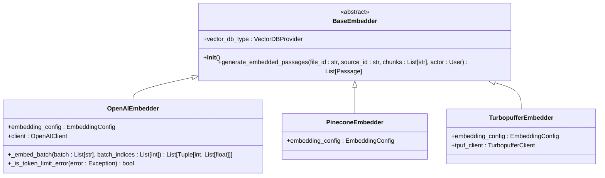
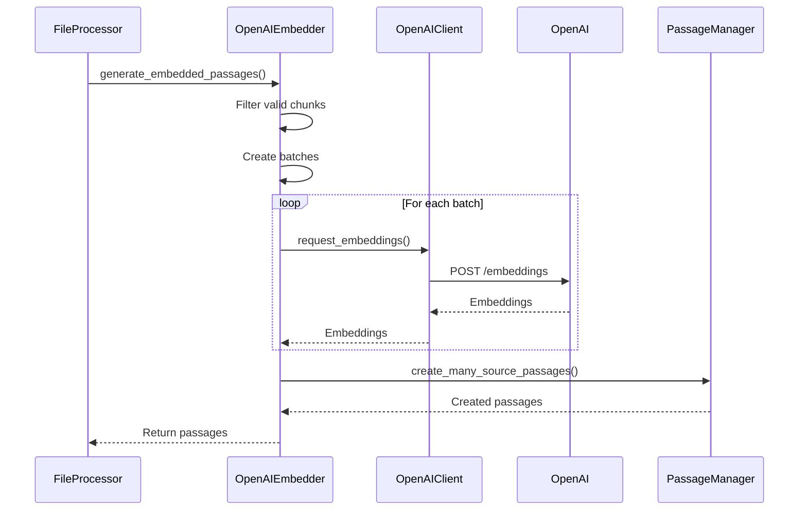
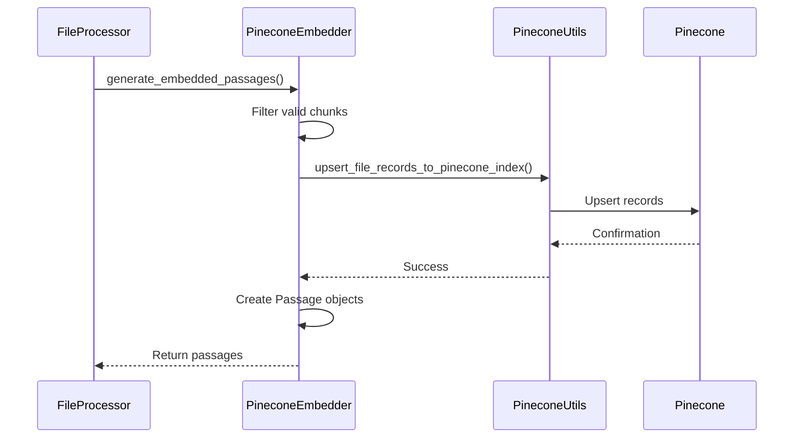
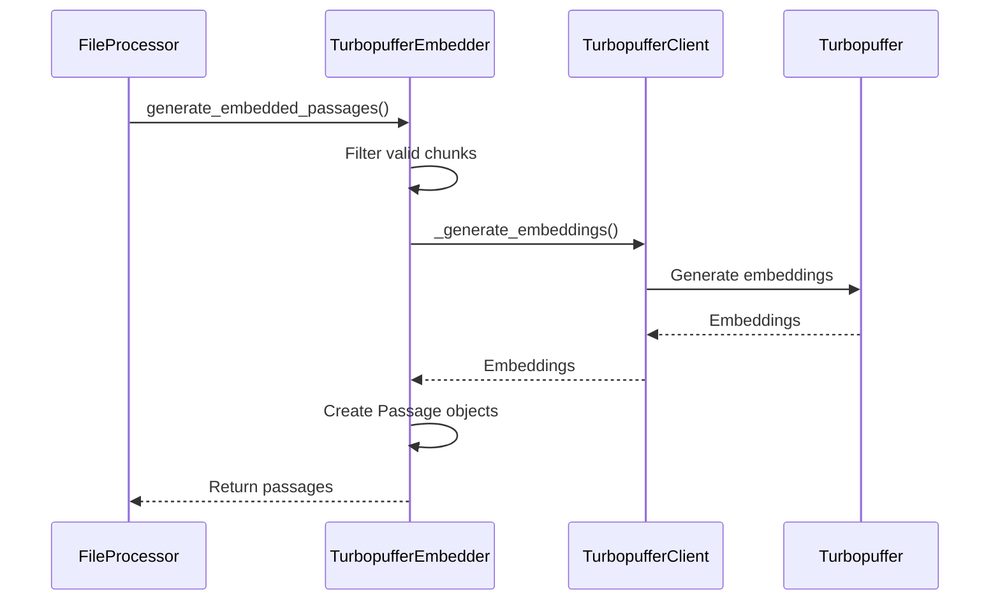
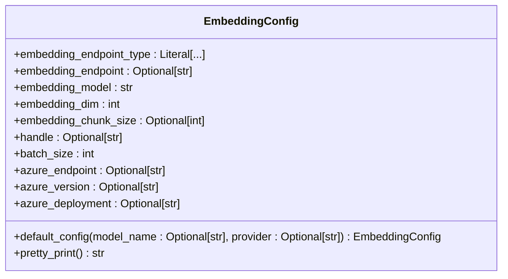
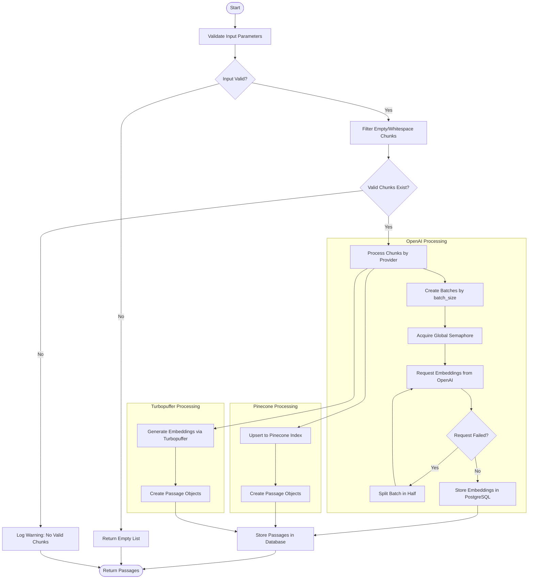
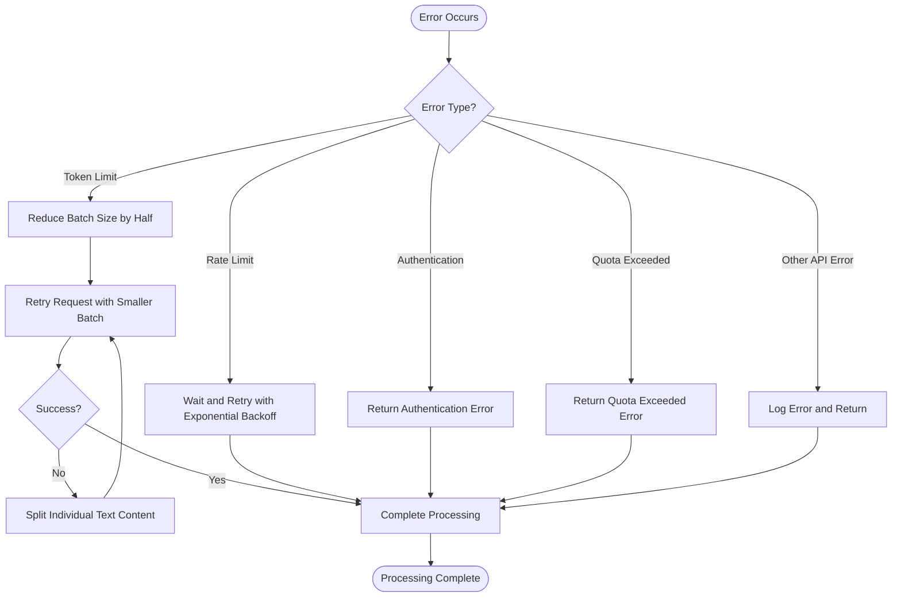
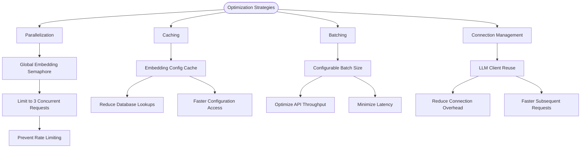
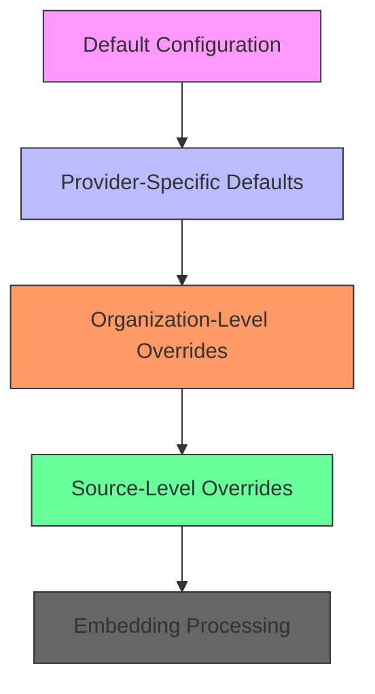
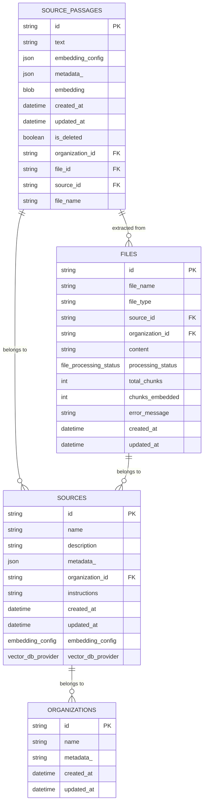

# Embedding Generation

<cite>
**Referenced Files in This Document**   
- [embedding_config.py](file://letta/schemas/embedding_config.py)
- [base_embedder.py](file://letta/services/file_processor/embedder/base_embedder.py)
- [openai_embedder.py](file://letta/services/file_processor/embedder/openai_embedder.py)
- [pinecone_embedder.py](file://letta/services/file_processor/embedder/pinecone_embedder.py)
- [turbopuffer_embedder.py](file://letta/services/file_processor/embedder/turbopuffer_embedder.py)
- [file_processor.py](file://letta/services/file_processor/file_processor.py)
- [passage_manager.py](file://letta/services/passage_manager.py)
- [source.py](file://letta/schemas/source.py)
- [archive.py](file://letta/schemas/archive.py)
- [openai_client.py](file://letta/llm_api/openai_client.py)
- [tpuf_client.py](file://letta/helpers/tpuf_client.py)
</cite>

## Table of Contents
1. [Introduction](#introduction)
2. [Base Embedder Interface](#base-embedder-interface)
3. [Vector Provider Implementations](#vector-provider-implementations)
   - [OpenAI Embedder](#openai-embedder)
   - [Pinecone Embedder](#pinecone-embedder)
   - [Turbopuffer Embedder](#turbopuffer-embedder)
4. [Embedding Configuration](#embedding-configuration)
5. [Embedding Process Flow](#embedding-process-flow)
6. [Error Handling and Retry Logic](#error-handling-and-retry-logic)
7. [Performance Optimization](#performance-optimization)
8. [Configuration Overrides](#configuration-overrides)
9. [Metadata and Storage](#metadata-and-storage)
10. [Conclusion](#conclusion)

## Introduction
The Embedding Generation phase is a critical component of the Document Processing Pipeline, responsible for converting text chunks into vector representations that enable semantic search and retrieval. This document details the architecture, implementation, and configuration options for embedding generation across different vector providers including OpenAI, Pinecone, and Turbopuffer. The system supports flexible configuration of embedding models, API keys, and connection parameters, with robust error handling and performance optimization strategies.

**Section sources**
- [embedding_config.py](file://letta/schemas/embedding_config.py#L1-L88)
- [base_embedder.py](file://letta/services/file_processor/embedder/base_embedder.py#L1-L22)

## Base Embedder Interface
The embedding system is built around an abstract base class that defines the contract for all embedding implementations. This interface ensures consistent behavior across different vector providers while allowing for provider-specific optimizations.

**Diagram sources**
- [base_embedder.py](file://letta/services/file_processor/embedder/base_embedder.py#L12-L22)
- [openai_embedder.py](file://letta/services/file_processor/embedder/openai_embedder.py#L23-L227)
- [pinecone_embedder.py](file://letta/services/file_processor/embedder/pinecone_embedder.py#L20-L108)
- [turbopuffer_embedder.py](file://letta/services/file_processor/embedder/turbopuffer_embedder.py#L16-L34)

**Section sources**
- [base_embedder.py](file://letta/services/file_processor/embedder/base_embedder.py#L1-L22)

## Vector Provider Implementations

### OpenAI Embedder
The OpenAIEmbedder implementation handles embedding generation using OpenAI's embedding models, with comprehensive batching, retry logic, and rate limit management.

**Diagram sources**
- [openai_embedder.py](file://letta/services/file_processor/embedder/openai_embedder.py#L48-L227)
- [openai_client.py](file://letta/llm_api/openai_client.py#L773-L824)

**Section sources**
- [openai_embedder.py](file://letta/services/file_processor/embedder/openai_embedder.py#L23-L227)

### Pinecone Embedder
The PineconeEmbedder implementation delegates embedding generation to Pinecone's managed vector database service, focusing on efficient upsert operations and namespace management.

**Diagram sources**
- [pinecone_embedder.py](file://letta/services/file_processor/embedder/pinecone_embedder.py#L38-L108)
- [helpers/pinecone_utils.py](file://letta/helpers/pinecone_utils.py#L1-L100)

**Section sources**
- [pinecone_embedder.py](file://letta/services/file_processor/embedder/pinecone_embedder.py#L20-L108)

### Turbopuffer Embedder
The TurbopufferEmbedder implementation leverages Turbopuffer's vector database service for embedding generation and storage, with dual-write capabilities for redundancy.

**Diagram sources**
- [turbopuffer_embedder.py](file://letta/services/file_processor/embedder/turbopuffer_embedder.py#L16-L34)
- [helpers/tpuf_client.py](file://letta/helpers/tpuf_client.py#L32-L71)

**Section sources**
- [turbopuffer_embedder.py](file://letta/services/file_processor/embedder/turbopuffer_embedder.py#L16-L34)

## Embedding Configuration
The embedding system uses a comprehensive configuration model that defines all parameters for embedding generation and storage.

The configuration supports multiple providers with specific defaults:
- **OpenAI**: Supports text-embedding-ada-002, text-embedding-3-small, and text-embedding-3-large models
- **Pinecone**: Uses llama-text-embed-v2 model with 1536 dimensions
- **Turbopuffer**: Defaults to text-embedding-3-small model with 1536 dimensions

**Diagram sources**
- [embedding_config.py](file://letta/schemas/embedding_config.py#L8-L88)

**Section sources**
- [embedding_config.py](file://letta/schemas/embedding_config.py#L8-L88)

## Embedding Process Flow
The embedding generation process follows a standardized workflow across all providers, with provider-specific variations in implementation details.

**Diagram sources**
- [file_processor.py](file://letta/services/file_processor/file_processor.py#L49-L277)
- [passage_manager.py](file://letta/services/passage_manager.py#L357-L404)

**Section sources**
- [file_processor.py](file://letta/services/file_processor/file_processor.py#L27-L402)

## Error Handling and Retry Logic
The system implements comprehensive error handling and retry mechanisms to ensure reliability in the face of API failures, rate limits, and other issues.

The OpenAI embedder specifically handles token limit errors by recursively splitting batches in half until the request succeeds or reaches a single item. For single-item failures, it attempts to split the text content itself. The system uses a global semaphore to limit concurrent embedding requests to prevent rate limiting across multiple file processing operations.

**Diagram sources**
- [openai_embedder.py](file://letta/services/file_processor/embedder/openai_embedder.py#L48-L92)
- [openai_client.py](file://letta/llm_api/openai_client.py#L821-L847)

**Section sources**
- [openai_embedder.py](file://letta/services/file_processor/embedder/openai_embedder.py#L48-L92)
- [test_file_processor.py](file://tests/test_file_processor.py#L102-L168)

## Performance Optimization
The embedding system incorporates several performance optimization strategies to maximize throughput and minimize latency.

Key performance features include:
- **Global Semaphore**: Limits concurrent embedding requests to 3 across all file processing operations to prevent rate limiting
- **Configuration Caching**: Caches embedding configurations to reduce database lookups
- **Batch Processing**: Processes text chunks in configurable batches to optimize API throughput
- **Client Reuse**: Reuses LLM client instances to minimize connection overhead

**Diagram sources**
- [openai_embedder.py](file://letta/services/file_processor/embedder/openai_embedder.py#L19-L21)
- [server.py](file://letta/server/server.py#L404-L419)

**Section sources**
- [openai_embedder.py](file://letta/services/file_processor/embedder/openai_embedder.py#L19-L21)
- [server.py](file://letta/server/server.py#L404-L419)

## Configuration Overrides
The system supports hierarchical configuration overrides, allowing customization at different levels of the organization.

Configuration precedence follows this hierarchy:
1. **Default Configuration**: Built-in defaults for each provider
2. **Provider-Specific Defaults**: Provider-specific default settings
3. **Organization-Level Overrides**: Organization-wide customizations
4. **Source-Level Overrides**: Source-specific configurations

This allows organizations to establish default policies while permitting specific sources to use different embedding models or parameters as needed.

**Diagram sources**
- [source.py](file://letta/schemas/source.py#L30-L38)
- [archive.py](file://letta/schemas/archive.py#L20-L21)

**Section sources**
- [source.py](file://letta/schemas/source.py#L1-L71)
- [archive.py](file://letta/schemas/archive.py#L1-L41)

## Metadata and Storage
The system stores embedding metadata and vectors with comprehensive linking to source files and passages.

Embeddings are stored in the source_passages table with metadata linking to:
- **Source**: The document collection the passage belongs to
- **File**: The specific file from which the passage was extracted
- **Organization**: The organization that owns the data
- **Embedding Configuration**: The specific configuration used to generate the embedding

For PostgreSQL storage, embeddings are padded to a fixed dimension (4096) to ensure compatibility with the vector database. External vector databases like Pinecone and Turbopuffer handle storage internally.

**Diagram sources**
- [source_passages.sql](file://alembic/versions/54dec07619c4_divide_passage_table_into_.py#L54-L78)
- [passage_manager.py](file://letta/services/passage_manager.py#L217-L399)

**Section sources**
- [passage_manager.py](file://letta/services/passage_manager.py#L1-L800)
- [source.py](file://letta/schemas/source.py#L1-L71)

## Conclusion
The Embedding Generation phase of the Document Processing Pipeline provides a robust, flexible framework for converting text into vector representations. The system supports multiple vector providers through a consistent interface, with comprehensive configuration options, error handling, and performance optimizations. By implementing hierarchical configuration overrides and efficient storage strategies, the system balances flexibility with reliability, enabling organizations to customize embedding generation while maintaining consistent performance and data integrity.