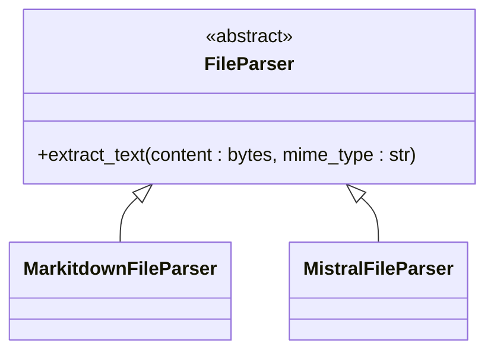
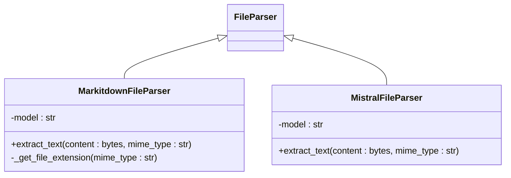
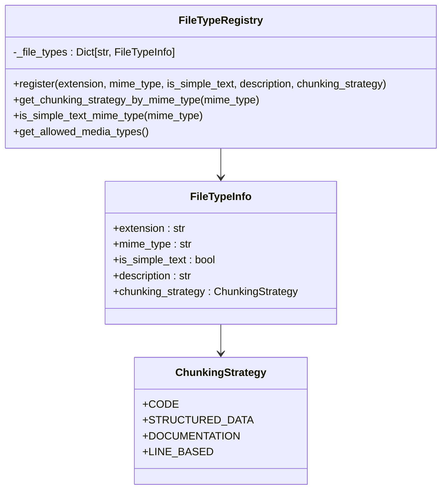
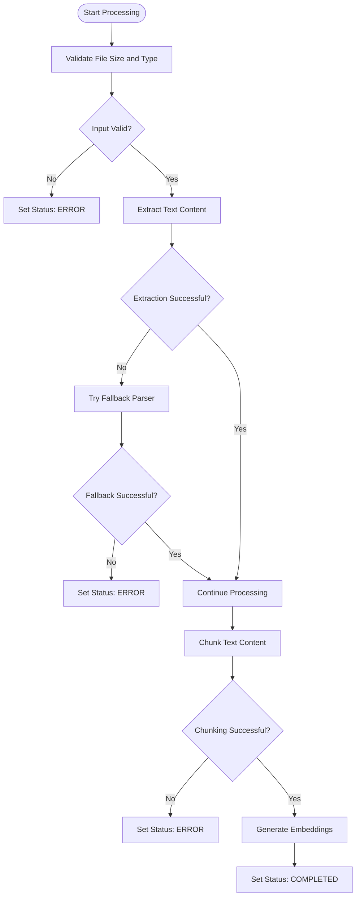
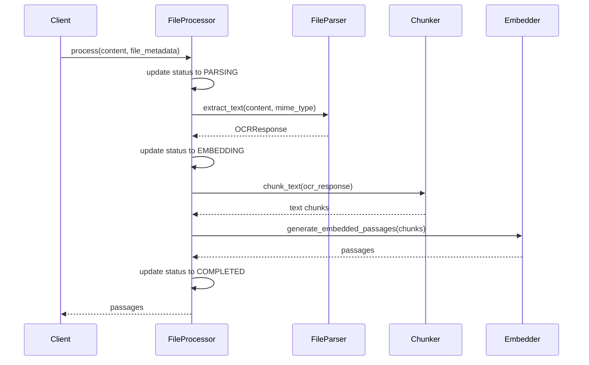

# File Parsing Mechanism

<cite>
**Referenced Files in This Document**   
- [file_processor.py](file://letta/services/file_processor/file_processor.py)
- [file_types.py](file://letta/services/file_processor/file_types.py)
- [base_parser.py](file://letta/services/file_processor/parser/base_parser.py)
- [markitdown_parser.py](file://letta/services/file_processor/parser/markitdown_parser.py)
- [mistral_parser.py](file://letta/services/file_processor/parser/mistral_parser.py)
- [llama_index_chunker.py](file://letta/services/file_processor/chunker/llama_index_chunker.py)
- [line_chunker.py](file://letta/services/file_processor/chunker/line_chunker.py)
- [base_embedder.py](file://letta/services/file_processor/embedder/base_embedder.py)
- [file_manager.py](file://letta/services/file_manager.py)
</cite>

## Table of Contents
1. [Introduction](#introduction)
2. [Base Parser Interface](#base-parser-interface)
3. [Concrete Parser Implementations](#concrete-parser-implementations)
4. [File Type Detection and MIME Handling](#file-type-detection-and-mime-handling)
5. [Parser Registration and Extension](#parser-registration-and-extension)
6. [Error Recovery and Corrupted File Handling](#error-recovery-and-corrupted-file-handling)
7. [Timeout Strategies](#timeout-strategies)
8. [Integration with FileProcessor Orchestrator](#integration-with-fileprocessor-orchestrator)
9. [Data Connectors and Batch Ingestion](#data-connectors-and-batch-ingestion)
10. [Performance Implications](#performance-implications)
11. [Memory Usage Patterns](#memory-usage-patterns)

## Introduction
The File Parsing Mechanism is a core component of the Document Processing Pipeline responsible for extracting structured text from various file formats. This system employs a modular architecture with a base parser interface that defines a contract for format-specific implementations. The mechanism supports a wide range of file types including PDF, DOCX, TXT, Markdown, and various code and data formats. The parsing process is integrated with chunking and embedding workflows to prepare content for downstream processing by AI agents. The system handles file type detection, MIME type validation, error recovery, and performance optimization to ensure reliable processing of diverse document types.

**Section sources**
- [file_processor.py](file://letta/services/file_processor/file_processor.py#L27-L402)
- [file_types.py](file://letta/services/file_processor/file_types.py#L1-L305)

## Base Parser Interface
The File Parsing Mechanism is built around an abstract base class that defines the contract for all parser implementations. The `FileParser` abstract base class in `base_parser.py` establishes the interface that all concrete parsers must implement. This interface-centered design enables polymorphic behavior and easy extension of the system with new file format support.

The base parser defines a single abstract method `extract_text` that takes file content as bytes and a MIME type string, returning structured text output. This method signature ensures consistency across all parser implementations while allowing each concrete parser to handle format-specific extraction logic. The interface abstraction allows the orchestrating `FileProcessor` to interact with any parser without knowledge of the underlying implementation details.

**Diagram sources **
- [base_parser.py](file://letta/services/file_processor/parser/base_parser.py#L4-L9)

**Section sources**
- [base_parser.py](file://letta/services/file_processor/parser/base_parser.py#L1-L10)

## Concrete Parser Implementations
The system implements two primary concrete parsers: MarkitDown and Mistral, each optimized for different file processing scenarios. These parsers inherit from the `FileParser` base class and provide specialized implementations for text extraction from various document formats.

### MarkitDown Parser
The `MarkitdownFileParser` leverages the MarkItDown library to extract text from documents. This parser is particularly effective for structured documents like PDFs, DOCX, and PPTX files. It handles simple text files directly by decoding the content, while using the MarkItDown library for more complex document formats. The parser creates temporary files to interface with the MarkItDown library and ensures proper cleanup after processing.

### Mistral Parser
The `MistralFileParser` utilizes the Mistral OCR service for text extraction, particularly for image-based documents and complex layouts. This parser converts file content to base64 encoding and sends it to the Mistral OCR API for processing. It includes special handling for simple text files, bypassing OCR processing when unnecessary. The parser uses the Mistral API key from the application settings to authenticate requests.

Both parsers return a standardized `OCRResponse` object containing the extracted text in markdown format, ensuring consistent output regardless of the underlying extraction method.

**Diagram sources **
- [markitdown_parser.py](file://letta/services/file_processor/parser/markitdown_parser.py#L22-L96)
- [mistral_parser.py](file://letta/services/file_processor/parser/mistral_parser.py#L14-L58)

**Section sources**
- [markitdown_parser.py](file://letta/services/file_processor/parser/markitdown_parser.py#L1-L96)
- [mistral_parser.py](file://letta/services/file_processor/parser/mistral_parser.py#L1-L58)

## File Type Detection and MIME Handling
The file type detection system is centralized in the `file_types.py` module, which provides a comprehensive registry of supported file formats. The `FileTypeRegistry` class maintains a dictionary of `FileTypeInfo` objects, each containing metadata about a specific file type including extension, MIME type, description, and chunking strategy.

The system uses multiple approaches for file type detection:
1. **MIME Type Detection**: The primary method uses MIME types to identify file formats and determine appropriate processing strategies.
2. **Extension Mapping**: A fallback mechanism that maps file extensions to MIME types when the MIME type is not explicitly provided.
3. **Content Analysis**: For certain file types, the system can infer the format based on content characteristics.

The `is_simple_text_mime_type` function determines whether a file can be processed as plain text, allowing direct content extraction without specialized parsing. This optimization improves performance for text-based formats like TXT, JSON, and CSV files. The registry also defines chunking strategies for different file types, enabling format-appropriate text segmentation.

**Diagram sources **
- [file_types.py](file://letta/services/file_processor/file_types.py#L34-L305)

**Section sources**
- [file_types.py](file://letta/services/file_processor/file_types.py#L1-L305)

## Parser Registration and Extension
The system supports extensible parser registration through the `FileTypeRegistry` class, which allows for dynamic addition of new file types and processing capabilities. Custom parsers can be integrated by creating new classes that inherit from the `FileParser` base class and implementing the required `extract_text` method.

To extend the system with a custom format, developers can register new file types using the `register` method of the `FileTypeRegistry`, specifying the file extension, MIME type, and appropriate chunking strategy. The registry's modular design allows for easy integration of new parsers without modifying existing code. This extensibility enables the system to support domain-specific file formats and adapt to evolving document processing requirements.

The chunking strategy system further enhances extensibility by allowing custom chunking behaviors for new file types. When a new file type is registered, it can be associated with an existing chunking strategy or a new strategy can be defined to handle format-specific text segmentation requirements.

**Section sources**
- [file_types.py](file://letta/services/file_processor/file_types.py#L102-L130)

## Error Recovery and Corrupted File Handling
The File Parsing Mechanism implements comprehensive error recovery strategies to handle corrupted files and processing failures. The system follows a multi-layered approach to error handling, with specific mechanisms at each stage of the parsing pipeline.

When processing fails, the system updates the file status to ERROR through the `update_file_status` method in the `FileManager` class, storing detailed error messages for debugging and user feedback. The `FileProcessor` class includes try-catch blocks around critical operations, ensuring that failures in one processing stage do not cascade to subsequent stages.

For corrupted files, the system attempts multiple recovery strategies:
1. **Fallback Parsing**: When specialized parsing fails, the system falls back to basic text extraction methods.
2. **Partial Processing**: For files with recoverable content, the system processes available sections while skipping corrupted portions.
3. **Content Validation**: Input validation checks file size limits and content integrity before processing begins.

The error handling system also includes detailed logging and event tracing to facilitate debugging and monitoring of processing failures.

**Diagram sources **
- [file_processor.py](file://letta/services/file_processor/file_processor.py#L155-L297)
- [file_manager.py](file://letta/services/file_manager.py#L141-L200)

**Section sources**
- [file_processor.py](file://letta/services/file_processor/file_processor.py#L155-L297)
- [file_manager.py](file://letta/services/file_manager.py#L141-L200)

## Timeout Strategies
The system implements timeout strategies through asynchronous processing and non-blocking operations to prevent long-running tasks from impacting overall system performance. The parsing operations are designed as async methods, allowing the event loop to handle other tasks while waiting for I/O operations to complete.

For CPU-intensive operations like text chunking, the system uses `asyncio.to_thread` to run these operations in a thread pool, preventing the main event loop from being blocked. This approach ensures that even complex parsing tasks do not cause timeouts or degrade responsiveness for other system components.

The system also includes monitoring for slow operations, with warnings logged when chunking or embedding operations exceed predefined thresholds. These monitoring capabilities help identify performance bottlenecks and inform optimization efforts.

**Section sources**
- [file_processor.py](file://letta/services/file_processor/file_processor.py#L60-L67)

## Integration with FileProcessor Orchestrator
The File Parsing Mechanism integrates with the `FileProcessor` orchestrator class, which coordinates the complete document processing pipeline. The `FileProcessor` acts as the central controller, managing the flow from file ingestion through parsing, chunking, and embedding.

The orchestrator follows a state machine pattern, updating the file processing status through distinct phases: PARSING, EMBEDDING, and COMPLETED. This state management ensures proper sequencing of operations and provides visibility into processing progress. The orchestrator handles error transitions, allowing any non-terminal state to transition to ERROR when failures occur.

The integration between the parser and orchestrator is dependency-injected, with the `FileProcessor` accepting a `FileParser` instance through its constructor. This design enables easy substitution of different parser implementations based on configuration or file type requirements.

**Diagram sources **
- [file_processor.py](file://letta/services/file_processor/file_processor.py#L155-L277)

**Section sources**
- [file_processor.py](file://letta/services/file_processor/file_processor.py#L27-L402)

## Data Connectors and Batch Ingestion
The File Parsing Mechanism integrates with data connectors for batch ingestion workflows through the agent serialization manager. When files are associated with sources, background tasks are created to process each file asynchronously. This batch processing capability enables efficient handling of multiple documents without blocking the main application flow.

The system supports both immediate processing and deferred processing based on the vector database provider. For Pinecone, processing status is updated to EMBEDDING with chunk counts, while completion status is updated later when chunks are confirmed embedded. For other vector databases, the status transitions directly to COMPLETED upon successful processing.

The batch ingestion workflow includes error handling and retry mechanisms to ensure reliable processing of large document sets. Failed files are marked with appropriate error messages, allowing for targeted reprocessing without affecting the entire batch.

**Section sources**
- [agent_serialization_manager.py](file://letta/services/agent_serialization_manager.py#L634-L651)

## Performance Implications
The File Parsing Mechanism employs several strategies to optimize performance across different parsing approaches. The choice of parser (MarkitDown vs. Mistral) has significant performance implications based on file type and content complexity.

For simple text files, the system bypasses OCR processing entirely, providing near-instantaneous text extraction. For complex documents, the system balances accuracy and performance by selecting the most appropriate parser based on file characteristics.

The chunking strategy selection directly impacts processing performance and downstream AI performance. Code files use line-based chunking for precise code segment extraction, while documentation files use sentence or paragraph-based chunking to preserve context. The system's fallback mechanisms ensure that processing continues even when optimal chunking strategies fail, maintaining reliability at the cost of some performance.

Memory usage is optimized through streaming operations and efficient data structures, minimizing the memory footprint during processing. The system also includes performance monitoring to identify and address bottlenecks in the parsing pipeline.

**Section sources**
- [llama_index_chunker.py](file://letta/services/file_processor/chunker/llama_index_chunker.py#L12-L170)
- [line_chunker.py](file://letta/services/file_processor/chunker/line_chunker.py#L11-L188)

## Memory Usage Patterns
The File Parsing Mechanism follows memory-efficient patterns to handle large documents without excessive memory consumption. The system processes files in chunks rather than loading entire documents into memory, reducing peak memory usage.

For large documents, the system uses temporary files to store intermediate processing results, preventing memory overflow. The asynchronous design allows for efficient memory management by releasing resources as soon as they are no longer needed.

The embedding process is particularly memory-intensive, so the system implements batching and streaming to manage memory usage. When generating embeddings, the system processes chunks in batches, limiting the number of embeddings held in memory simultaneously.

The system also includes memory monitoring and conservative defaults for chunk sizes to prevent out-of-memory errors when processing exceptionally large documents. These memory management strategies ensure reliable processing across a wide range of document sizes and complexities.

**Section sources**
- [llama_index_chunker.py](file://letta/services/file_processor/chunker/llama_index_chunker.py#L148-L170)
- [file_processor.py](file://letta/services/file_processor/file_processor.py#L49-L140)