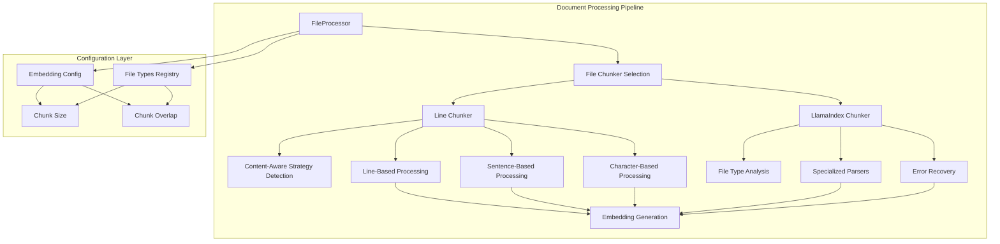
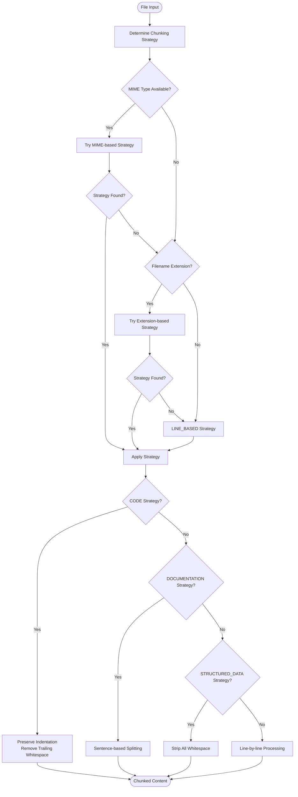
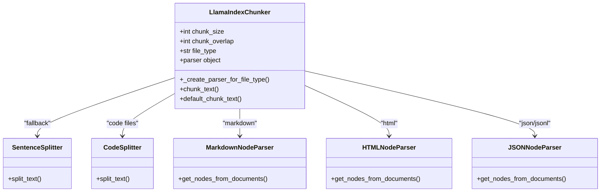
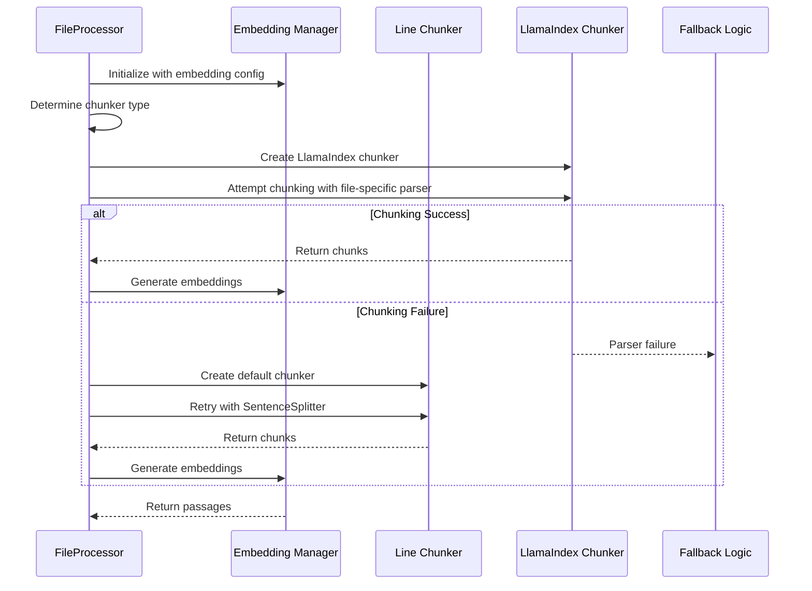
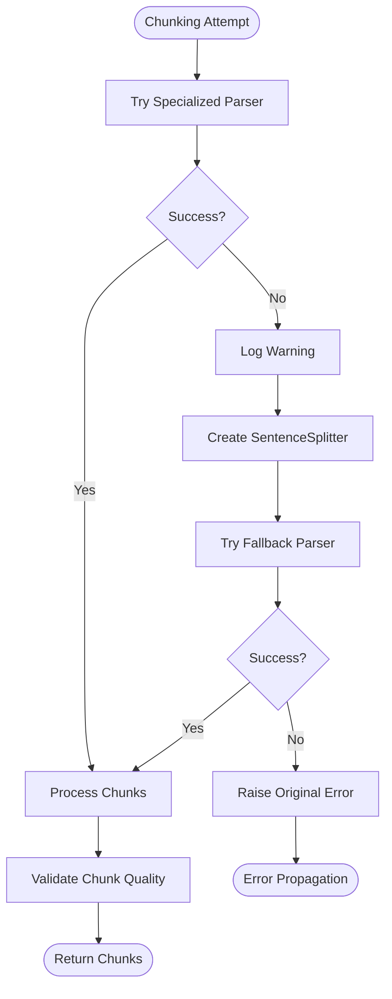
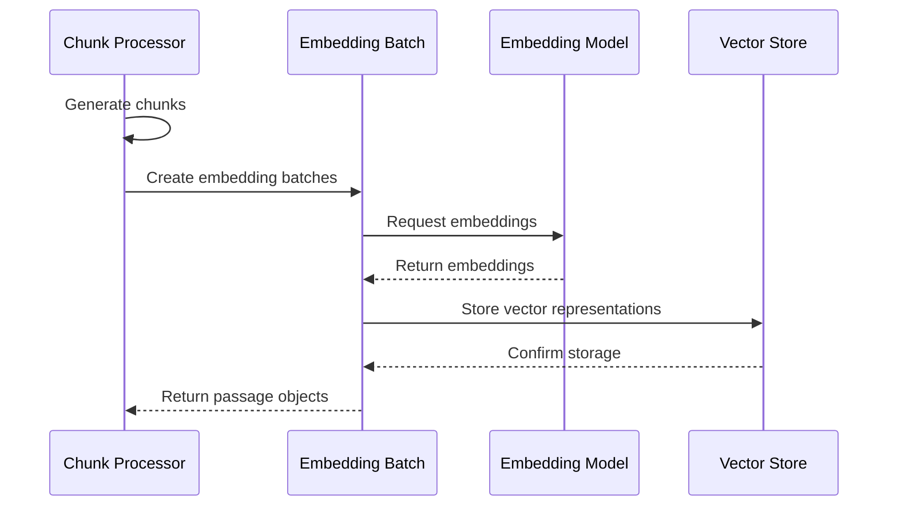

# Text Chunking Strategies

<cite>
**Referenced Files in This Document**
- [line_chunker.py](file://letta/services/file_processor/chunker/line_chunker.py)
- [llama_index_chunker.py](file://letta/services/file_processor/chunker/llama_index_chunker.py)
- [file_processor.py](file://letta/services/file_processor/file_processor.py)
- [file_types.py](file://letta/services/file_processor/file_types.py)
- [embedding_config.py](file://letta/schemas/embedding_config.py)
- [openai_embedder.py](file://letta/services/file_processor/embedder/openai_embedder.py)
- [test_file_processor.py](file://tests/test_file_processor.py)
- [test_utils.py](file://tests/test_utils.py)
</cite>

## Table of Contents
1. [Introduction](#introduction)
2. [Architecture Overview](#architecture-overview)
3. [Line-Based Chunker](#line-based-chunker)
4. [LlamaIndex-Powered Semantic Chunker](#llamaindex-powered-semantic-chunker)
5. [FileProcessor Selection Logic](#fileprocessor-selection-logic)
6. [Configuration Parameters](#configuration-parameters)
7. [Use Cases and Best Practices](#use-cases-and-best-practices)
8. [Error Handling and Memory Management](#error-handling-and-memory-management)
9. [Integration with Embedding Processes](#integration-with-embedding-processes)
10. [Performance Tuning Guidelines](#performance-tuning-guidelines)
11. [Troubleshooting Guide](#troubleshooting-guide)
12. [Conclusion](#conclusion)

## Introduction

Text chunking is a critical component of the Document Processing Pipeline in Letta, responsible for breaking down large documents into manageable pieces that can be efficiently processed by downstream systems. The system employs two distinct chunking strategies, each optimized for different types of content and use cases.

The chunking strategies serve as the bridge between raw document content and the embedding generation process, ensuring that text segments maintain semantic coherence while respecting computational constraints. This dual-strategy approach allows the system to handle everything from structured code files to natural language documentation effectively.

## Architecture Overview

The text chunking system follows a modular architecture with clear separation of concerns:

**Diagram sources**
- [file_processor.py](file://letta/services/file_processor/file_processor.py#L27-L48)
- [line_chunker.py](file://letta/services/file_processor/chunker/line_chunker.py#L11-L188)
- [llama_index_chunker.py](file://letta/services/file_processor/chunker/llama_index_chunker.py#L12-L170)

**Section sources**
- [file_processor.py](file://letta/services/file_processor/file_processor.py#L27-L48)
- [file_types.py](file://letta/services/file_processor/file_types.py#L14-L21)

## Line-Based Chunker

The Line Chunker represents the traditional approach to text segmentation, focusing on structural awareness and content preservation. It adapts its strategy based on the file type, applying different parsing rules for code, documentation, and structured data.

### Algorithm Implementation

The Line Chunker employs a content-aware strategy determination mechanism:

**Diagram sources**
- [line_chunker.py](file://letta/services/file_processor/chunker/line_chunker.py#L17-L39)
- [line_chunker.py](file://letta/services/file_processor/chunker/line_chunker.py#L41-L111)

### Strategy-Specific Processing

#### Code File Processing
For programming languages and structured code, the Line Chunker preserves indentation and removes trailing whitespace:

- **Indentation Preservation**: Leading whitespace is maintained to preserve code structure
- **Trailing Whitespace Removal**: Extra spaces at the end of lines are stripped
- **Empty Line Filtering**: Completely blank lines are excluded from chunks

#### Documentation Processing
Natural language documents receive sentence-aware processing:

- **Sentence Boundary Detection**: Uses regex pattern `(?<=[.!?])\s+(?=[A-Z])` for reliable sentence splitting
- **Whitespace Normalization**: Multiple spaces are collapsed to single spaces
- **Empty Sentence Removal**: Blank sentences are filtered out

#### Structured Data Processing
Configuration files and data formats undergo uniform whitespace treatment:

- **Uniform Stripping**: All leading and trailing whitespace is removed
- **Consistent Formatting**: Ensures predictable chunk boundaries
- **Minimal Processing**: Preserves data integrity while removing noise

**Section sources**
- [line_chunker.py](file://letta/services/file_processor/chunker/line_chunker.py#L41-L111)

## LlamaIndex-Powered Semantic Chunker

The LlamaIndex Chunker leverages the advanced capabilities of the LlamaIndex library to provide intelligent, context-aware text segmentation. This approach prioritizes semantic coherence over strict structural boundaries.

### Parser Selection Strategy

The LlamaIndex Chunker automatically selects the most appropriate parser based on file type:

**Diagram sources**
- [llama_index_chunker.py](file://letta/services/file_processor/chunker/llama_index_chunker.py#L31-L85)

### Advanced Processing Capabilities

#### Intelligent Content Analysis
The LlamaIndex Chunker performs sophisticated content analysis:

- **File Type Detection**: Automatically identifies document structure from MIME types
- **Content Pattern Recognition**: Adapts splitting strategies based on content characteristics
- **Fallback Mechanisms**: Gracefully degrades to simpler strategies when specialized parsers fail

#### Error Recovery and Resilience
Robust error handling ensures reliable processing:

- **Parser Failure Recovery**: Falls back to SentenceSplitter when specialized parsers fail
- **Content Validation**: Validates chunk sizes and prevents oversized segments
- **Graceful Degradation**: Maintains functionality even with malformed content

#### Flexible Input Processing
Supports multiple content formats:

- **OCR Page Objects**: Handles structured OCR output with markdown content
- **Raw Strings**: Processes plain text content directly
- **Mixed Formats**: Adapts to various input types seamlessly

**Section sources**
- [llama_index_chunker.py](file://letta/services/file_processor/chunker/llama_index_chunker.py#L31-L169)

## FileProcessor Selection Logic

The FileProcessor orchestrates the chunking strategy selection based on system configuration and content characteristics:

**Diagram sources**
- [file_processor.py](file://letta/services/file_processor/file_processor.py#L49-L151)

### Selection Criteria

The FileProcessor follows a hierarchical selection process:

1. **Primary Strategy**: Uses LlamaIndex Chunker with file-type-specific parsers
2. **Fallback Strategy**: Reverts to Line Chunker with conservative defaults
3. **Emergency Fallback**: Employs SentenceSplitter with minimal configuration

**Section sources**
- [file_processor.py](file://letta/services/file_processor/file_processor.py#L49-L151)

## Configuration Parameters

Both chunking strategies support configurable parameters that impact performance and quality:

### Core Parameters

| Parameter | Line Chunker | LlamaIndex Chunker | Description |
|-----------|--------------|-------------------|-------------|
| `chunk_size` | N/A | ✓ | Maximum characters per chunk |
| `chunk_overlap` | N/A | ✓ | Characters overlapping between adjacent chunks |
| `preserve_indentation` | ✓ | N/A | Whether to maintain code indentation |
| `target_line_length` | ✓ | N/A | Character limit for prose wrapping |

### Default Values

| Strategy | Default Chunk Size | Default Overlap | Purpose |
|----------|-------------------|-----------------|---------|
| Line Chunker | Variable (file-dependent) | N/A | Structural preservation |
| LlamaIndex Chunker | 512 | 50 | Balanced semantic coherence |
| Conservative Fallback | 384 | 25 | Safe processing for unknown content |

### File Type Registry Configuration

The system maintains comprehensive file type mappings:

| File Extension | MIME Type | Strategy | Description |
|----------------|-----------|----------|-------------|
| `.py`, `.js`, `.java` | Various | CODE | Source code preservation |
| `.md`, `.html`, `.xml` | Various | DOCUMENTATION | Semantic content |
| `.json`, `.csv`, `.yaml` | Various | STRUCTURED_DATA | Data format processing |
| `.txt`, `.pdf` | Various | LINE_BASED | General text processing |

**Section sources**
- [file_types.py](file://letta/services/file_processor/file_types.py#L44-L100)
- [embedding_config.py](file://letta/schemas/embedding_config.py#L35)

## Use Cases and Best Practices

### When to Use Line Chunking

**Ideal Scenarios:**
- **Source Code Files**: JavaScript, Python, Java, C++, TypeScript
- **Configuration Files**: JSON, YAML, XML, INI, TOML
- **Structured Logs**: Application logs, system events, debug output
- **Technical Specifications**: API documentation, design documents

**Benefits:**
- **Structure Preservation**: Maintains code indentation and formatting
- **Semantic Integrity**: Keeps related lines together
- **Predictable Boundaries**: Consistent chunk sizes for code review
- **Debugging Support**: Easy identification of problematic sections

### When to Use Semantic Chunking

**Ideal Scenarios:**
- **Natural Language Documents**: Articles, reports, books, manuals
- **Web Content**: HTML pages, markdown documents, blog posts
- **API Documentation**: REST APIs, SDK documentation
- **Educational Materials**: Tutorials, guides, learning resources

**Benefits:**
- **Context Preservation**: Maintains semantic relationships
- **Improved Retrieval**: Better matching for semantic search
- **Intelligent Boundaries**: Natural sentence and paragraph breaks
- **Adaptive Processing**: Handles varying content complexity

### Hybrid Approach Recommendations

For optimal results, consider:

1. **Content-Aware Selection**: Use Line Chunker for code, LlamaIndex for docs
2. **Parameter Tuning**: Adjust chunk sizes based on embedding model capabilities
3. **Overlap Configuration**: Use 10-20% overlap for critical semantic continuity
4. **Monitoring**: Track chunk quality metrics and adjust parameters

**Section sources**
- [line_chunker.py](file://letta/services/file_processor/chunker/line_chunker.py#L121-L188)
- [llama_index_chunker.py](file://letta/services/file_processor/chunker/llama_index_chunker.py#L88-L169)

## Error Handling and Memory Management

### Robust Error Recovery

The chunking system implements comprehensive error handling:

**Diagram sources**
- [llama_index_chunker.py](file://letta/services/file_processor/chunker/llama_index_chunker.py#L128-L146)

### Memory Management Strategies

#### Large Text Handling
For very large documents, the system employs several optimization techniques:

- **Streaming Processing**: Processes text in manageable chunks
- **Memory Monitoring**: Tracks memory usage during processing
- **Graceful Degradation**: Reduces chunk sizes when memory pressure increases
- **Async Operations**: Uses asyncio for non-blocking processing

#### Resource Cleanup
Proper resource management ensures system stability:

- **Parser Disposal**: Cleans up specialized parsers after use
- **Memory Pooling**: Reuses objects where possible
- **Exception Safety**: Ensures cleanup occurs even during failures

**Section sources**
- [llama_index_chunker.py](file://letta/services/file_processor/chunker/llama_index_chunker.py#L128-L146)
- [file_processor.py](file://letta/services/file_processor/file_processor.py#L50-L151)

## Integration with Embedding Processes

### Vector Representation Quality

The choice of chunking strategy directly impacts vector representation quality:

#### Line Chunker Impact
- **Pros**: Predictable boundaries, good for code search
- **Cons**: May break semantic units, less context preservation
- **Best For**: Code repositories, technical documentation

#### LlamaIndex Chunker Impact
- **Pros**: Semantic coherence, better retrieval accuracy
- **Cons**: More computationally intensive, potential fragmentation
- **Best For**: Natural language documents, research papers

### Embedding Batch Optimization

The chunking process integrates with embedding generation:

**Diagram sources**
- [openai_embedder.py](file://letta/services/file_processor/embedder/openai_embedder.py#L142-L170)

### Chunk Boundary Effects

Understanding how chunk boundaries affect vector quality:

| Boundary Type | Semantic Impact | Retrieval Quality | Computational Cost |
|---------------|-----------------|-------------------|-------------------|
| Line-based | Moderate | Good for code | Low |
| Sentence-based | High | Excellent for docs | Medium |
| Paragraph-based | Very High | Excellent for articles | Medium-High |
| Semantic | Highest | Optimal for search | High |

**Section sources**
- [openai_embedder.py](file://letta/services/file_processor/embedder/openai_embedder.py#L142-L170)
- [file_processor.py](file://letta/services/file_processor/file_processor.py#L88-L93)

## Performance Tuning Guidelines

### Parameter Optimization

#### Chunk Size Tuning
Optimal chunk sizes depend on multiple factors:

- **Embedding Model Limits**: Most models have maximum token limits
- **Semantic Completeness**: Larger chunks preserve more context
- **Memory Constraints**: Smaller chunks reduce memory usage
- **Retrieval Accuracy**: Balance between precision and recall

#### Overlap Configuration
Overlap improves retrieval quality:

- **Code Files**: 0-10% overlap (minimal benefit)
- **Documentation**: 10-20% overlap (good balance)
- **Research Papers**: 20-30% overlap (maximum context)
- **Conversational**: 5-15% overlap (natural flow)

### Performance Monitoring

Key metrics to track:

- **Processing Time**: Time per document chunk
- **Memory Usage**: Peak memory consumption
- **Chunk Quality**: Semantic coherence scores
- **Error Rate**: Failure percentage across strategies

### Scaling Considerations

For large-scale deployments:

- **Parallel Processing**: Use asyncio for concurrent chunking
- **Batch Optimization**: Group similar file types for efficient processing
- **Resource Allocation**: Monitor CPU and memory usage
- **Caching Strategies**: Cache frequently processed content types

**Section sources**
- [file_processor.py](file://letta/services/file_processor/file_processor.py#L50-L151)
- [embedding_config.py](file://letta/schemas/embedding_config.py#L35)

## Troubleshooting Guide

### Common Issues and Solutions

#### Chunking Failures
**Problem**: Chunking process fails with specific file types
**Solution**: 
- Check file type registration in `file_type_registry`
- Verify MIME type detection
- Enable fallback mechanisms
- Review parser compatibility

#### Memory Issues
**Problem**: Out of memory errors with large documents
**Solution**:
- Reduce chunk sizes
- Implement streaming processing
- Increase system memory allocation
- Use pagination for large files

#### Poor Retrieval Quality
**Problem**: Search results are irrelevant or incomplete
**Solution**:
- Adjust chunk overlap parameters
- Switch to semantic chunking for documentation
- Fine-tune embedding model parameters
- Review chunk boundary alignment

#### Performance Problems
**Problem**: Slow chunking and embedding generation
**Solution**:
- Profile chunking bottlenecks
- Optimize embedding batch sizes
- Use asynchronous processing
- Consider hardware acceleration

### Debugging Techniques

#### Logging and Monitoring
Enable detailed logging for troubleshooting:

- **Chunker Selection**: Log which strategy is chosen
- **Processing Metrics**: Track timing and memory usage
- **Error Details**: Capture specific failure reasons
- **Fallback Triggers**: Monitor when fallbacks occur

#### Testing Strategies
Systematic testing approaches:

- **Unit Tests**: Test individual chunking strategies
- **Integration Tests**: Verify end-to-end processing
- **Performance Tests**: Measure scalability limits
- **Regression Tests**: Ensure consistent behavior

**Section sources**
- [test_file_processor.py](file://tests/test_file_processor.py#L1-L200)
- [test_utils.py](file://tests/test_utils.py#L422-L502)

## Conclusion

The Text Chunking Strategies in Letta's Document Processing Pipeline represent a sophisticated approach to handling diverse content types. The dual-strategy architecture, combining traditional line-based processing with modern semantic chunking, provides flexibility and robustness for real-world applications.

The Line Chunker excels in preserving structural integrity for code and configuration files, while the LlamaIndex Chunker delivers superior semantic coherence for natural language content. The intelligent selection logic ensures optimal strategy application based on file characteristics, with comprehensive fallback mechanisms for reliability.

Key benefits of this approach include:

- **Content-Aware Processing**: Automatic adaptation to file types
- **Robust Error Handling**: Graceful degradation under adverse conditions
- **Performance Optimization**: Efficient resource utilization
- **Quality Assurance**: Maintained vector representation quality
- **Scalability**: Support for large-scale document processing

Future enhancements may include machine learning-based strategy selection, adaptive parameter tuning, and enhanced cross-strategy collaboration for optimal results across all content types.