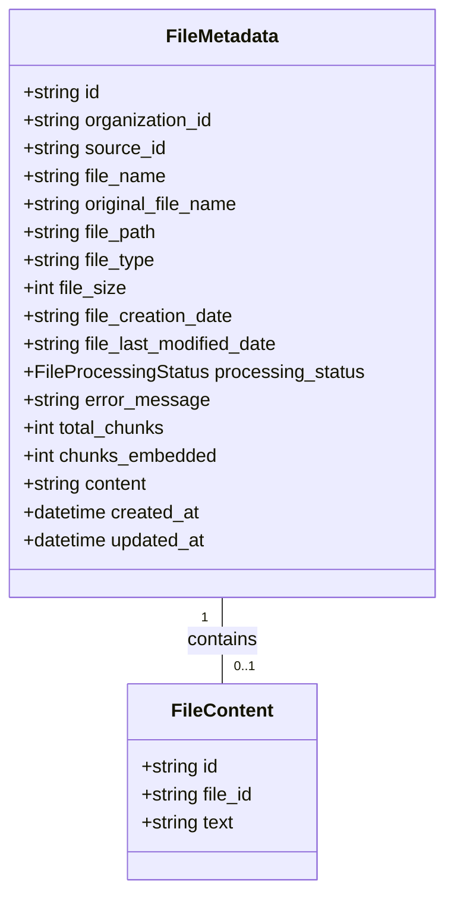
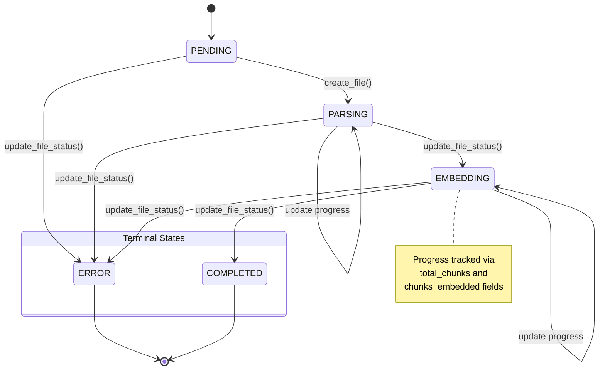

# File Management

<cite>
**Referenced Files in This Document**   
- [file_manager.py](file://letta/services/file_manager.py)
- [file.py](file://letta/orm/file.py)
- [file.py](file://letta/schemas/file.py)
- [files_agents_manager.py](file://letta/services/files_agents_manager.py)
- [v1/sources.py](file://letta/server/rest_api/routers/v1/sources.py)
- [v1/folders.py](file://letta/server/rest_api/routers/v1/folders.py)
</cite>

## Table of Contents
1. [File Management](#file-management)
2. [File Metadata Model](#file-metadata-model)
3. [CRUD Operations](#crud-operations)
4. [File Status Lifecycle](#file-status-lifecycle)
5. [File Listing and Retrieval](#file-listing-and-retrieval)
6. [Security and Access Control](#security-and-access-control)

## File Management

The FileManager service in Letta provides comprehensive file lifecycle management operations for handling files within the system. The service enables creation, retrieval, listing, and deletion of files while maintaining metadata, processing status, and organization scoping. Files are associated with sources (folders) and can be attached to agents for processing. The system implements soft deletion through an `is_deleted` flag rather than permanent removal, ensuring data integrity while allowing for potential recovery.

The FileManager service operates in conjunction with the FileAgentManager to manage the relationship between files and agents, enabling agents to open, view, and interact with specific files. File content is stored separately from metadata in a dedicated `file_contents` table, with cascading deletes ensuring data consistency. The service also integrates with external vector databases like Pinecone and Turbopuffer for embedding management, automatically cleaning up associated records when files are deleted.

**Section sources**
- [file_manager.py](file://letta/services/file_manager.py#L39-L707)
- [files_agents_manager.py](file://letta/services/files_agents_manager.py#L18-L731)

## File Metadata Model

The file metadata model defines the core properties and relationships for file management in Letta. Each file is represented by a `FileMetadata` object that contains essential information for identification, processing, and access. The model includes both technical metadata and processing state information, enabling comprehensive file tracking and management.

The primary properties of the file metadata model include:
- **file_id**: Unique identifier for the file, following the "file-" prefix convention
- **original_file_name**: The original filename as uploaded by the user
- **file_name**: The system-generated unique filename, incorporating the source name and potential numeric suffix
- **file_size**: Size of the file in bytes
- **processing_status**: Current state in the file processing lifecycle (PENDING, PARSING, EMBEDDING, COMPLETED, ERROR)
- **source_id**: Identifier of the source (folder) to which the file belongs
- **organization_id**: Identifier of the organization that owns the file, enabling multi-tenancy
- **total_chunks**: Total number of text chunks generated during processing
- **chunks_embedded**: Number of chunks that have been successfully embedded
- **error_message**: Description of any error encountered during processing
- **created_at** and **updated_at**: Timestamps for creation and last modification

Files are organization-scoped, ensuring data isolation between different organizations. The model also includes technical metadata such as file path, file type (MIME type), and system timestamps. The `original_file_name` field preserves the user-provided filename, while the `file_name` field contains the system-generated unique identifier that incorporates the source name as a prefix.

**Diagram sources **
- [file.py](file://letta/orm/file.py#L37-L108)
- [file.py](file://letta/schemas/file.py#L20-L138)

**Section sources**
- [file.py](file://letta/orm/file.py#L48-L61)
- [file.py](file://letta/schemas/file.py#L26-L47)

## CRUD Operations

The FileManager service provides comprehensive CRUD (Create, Retrieve, Update, Delete) operations for managing files throughout their lifecycle. These operations are designed to be atomic, secure, and consistent with the system's organization scoping and data integrity requirements.

### File Creation
Files are created through the `create_file` method, which accepts a `PydanticFileMetadata` object and an actor (user) parameter. The system first checks if a file with the same ID already exists, returning the existing file if found (idempotent behavior). When creating a new file, the service generates a unique filename using the `generate_unique_filename` method, which incorporates the source name as a prefix and adds a numeric suffix if duplicates exist. File content can be provided during creation through the optional `text` parameter, which is stored in the separate `file_contents` table with cascading delete relationships.

### File Retrieval
Files can be retrieved by ID using the `get_file_by_id` method, with an option to include content via the `include_content` parameter. The service also provides `get_file_by_original_name_and_source` for retrieving files by their original filename and source ID. These methods enforce organization-level access control, ensuring users can only access files within their organization.

### File Deletion
File deletion is implemented as a soft delete operation through the `delete_file` method. When a file is deleted, the `is_deleted` flag is set to true, and the file is removed from agent context windows. The operation also triggers cleanup of associated records in external vector databases (Pinecone or Turbopuffer) and cascades to delete the corresponding file content record. The REST API exposes file deletion through DELETE endpoints at `/sources/{source_id}/{file_id}` and `/folders/{folder_id}/{file_id}`.

**Section sources**
- [file_manager.py](file://letta/services/file_manager.py#L56-L92)
- [file_manager.py](file://letta/services/file_manager.py#L104-L136)
- [file_manager.py](file://letta/services/file_manager.py#L463-L472)
- [v1/sources.py](file://letta/server/rest_api/routers/v1/sources.py#L439-L463)
- [v1/folders.py](file://letta/server/rest_api/routers/v1/folders.py#L524-L550)

## File Status Lifecycle

The file processing system implements a strict state machine for managing file status transitions, ensuring data consistency and preventing invalid state changes. The lifecycle follows a sequential progression from initial upload through processing to completion or error states, with validation rules enforced at each transition.

### Status States
The file processing status is defined by the `FileProcessingStatus` enum with the following states:
- **PENDING**: Initial state when a file is created; processing has not yet begun
- **PARSING**: File is being parsed and text is being extracted
- **EMBEDDING**: Text chunks are being processed and embeddings are being generated
- **COMPLETED**: Processing is complete and the file is ready for use
- **ERROR**: An error occurred during processing

### State Transitions
The system enforces specific transition rules to maintain data integrity:
- PENDING → PARSING: Valid transition when parsing begins
- PARSING → EMBEDDING: Valid transition when chunking and embedding begins
- EMBEDDING → COMPLETED: Valid transition when all chunks are embedded
- Any non-terminal state → ERROR: Valid transition when an error occurs
- Same-state transitions: Allowed to prevent race conditions (e.g., EMBEDDING → EMBEDDING)

Terminal states (COMPLETED and ERROR) cannot transition to any other state, preventing modification of processed files. The PENDING state can only be set during initial creation and cannot be reverted to once processing has begun. Invalid transitions such as PENDING → EMBEDDING (skipping PARSING) or PARSING → COMPLETED (skipping EMBEDDING) are blocked by the system.

### Progress Tracking
During the EMBEDDING state, the system tracks processing progress through the `total_chunks` and `chunks_embedded` fields. These values are updated during processing to reflect the number of chunks generated and successfully embedded. The `update_file_status` method allows updating these progress indicators without changing the processing status, enabling real-time progress monitoring.

**Diagram sources **
- [file_manager.py](file://letta/services/file_manager.py#L155-L159)
- [file.py](file://letta/orm/file.py#L55-L57)

**Section sources**
- [file_manager.py](file://letta/services/file_manager.py#L141-L281)
- [file.py](file://letta/orm/file.py#L55-L57)

## File Listing and Retrieval

The FileManager service provides robust file listing capabilities through the `list_files` method, enabling retrieval of files with optional pagination, filtering, and status checking. This operation supports efficient querying of files within a specific source while maintaining organization-level access control.

The `list_files` method accepts several parameters to customize the query:
- **source_id**: Required parameter to specify the source (folder) from which to list files
- **actor**: User performing the request, used for access control and organization scoping
- **before/after**: Pagination cursors for navigating through large result sets
- **limit**: Maximum number of files to return (default behavior varies by implementation)
- **ascending**: Sort order for results (true for ascending, false for descending)
- **include_content**: Flag to include file content in the response (defaults to false for performance)
- **strip_directory_prefix**: Option to remove directory prefix from filenames in the response
- **check_status_updates**: Flag to automatically check and update file status for timeouts and embedding completion

By default, the `include_content` parameter is false, returning only metadata to optimize performance. When content is needed, clients can make a separate request with `include_content=true` or retrieve specific files by ID. The method supports pagination through cursor-based navigation, allowing clients to efficiently retrieve large collections of files in manageable chunks.

The service also provides specialized methods for retrieving multiple files, such as `get_files_by_ids_async` for fetching files by their IDs in a single query, and `get_files_for_agents_async` for retrieving all files associated with specific agents. These methods optimize database queries by using batch operations and eager loading to minimize round trips.

**Section sources**
- [file_manager.py](file://letta/services/file_manager.py#L405-L458)
- [file_manager.py](file://letta/services/file_manager.py#L632-L663)
- [file_manager.py](file://letta/services/file_manager.py#L667-L708)

## Security and Access Control

The file management system implements comprehensive security measures to protect data integrity and ensure proper access control. All file operations are scoped to the organization level, preventing cross-organization data access. The system uses actor-based authorization, where each operation requires a valid actor (user) parameter that determines access permissions.

Organization-level scoping is enforced through the `organization_id` field in all file-related queries. When retrieving, updating, or deleting files, the system verifies that the file belongs to the same organization as the actor performing the operation. This ensures that users can only access files within their own organization, supporting multi-tenancy requirements.

The system also implements rate limiting and input validation to prevent abuse and ensure data quality. File operations include validation of file sizes, types, and names to prevent malicious uploads. The `generate_unique_filename` method ensures filename uniqueness within a source by adding numeric suffixes to duplicates, preventing naming conflicts while preserving the original filename for reference.

When files are deleted, the system performs comprehensive cleanup, removing associated records from external vector databases (Pinecone or Turbopuffer) in addition to the database records. This ensures data consistency across the entire system and prevents orphaned records in external services.

**Section sources**
- [file_manager.py](file://letta/services/file_manager.py#L117-L124)
- [file_manager.py](file://letta/services/file_manager.py#L202-L203)
- [file_manager.py](file://letta/services/file_manager.py#L450-L454)
- [v1/sources.py](file://letta/server/rest_api/routers/v1/sources.py#L449-L463)
- [v1/folders.py](file://letta/server/rest_api/routers/v1/folders.py#L534-L550)