# File Search and Retrieval

<cite>
**Referenced Files in This Document**
- [passage_manager.py](file://letta/services/passage_manager.py)
- [file_processor.py](file://letta/services/file_processor/file_processor.py)
- [base_embedder.py](file://letta/services/file_processor/embedder/base_embedder.py)
- [llama_index_chunker.py](file://letta/services/file_processor/chunker/llama_index_chunker.py)
- [files_tool_executor.py](file://letta/services/tool_executor/files_tool_executor.py)
- [tpuf_client.py](file://letta/helpers/tpuf_client.py)
- [pinecone_embedder.py](file://letta/services/file_processor/embedder/pinecone_embedder.py)
- [turbopuffer_embedder.py](file://letta/services/file_processor/embedder/turbopuffer_embedder.py)
- [passage.py](file://letta/schemas/passage.py)
- [file_types.py](file://letta/services/file_processor/file_types.py)
- [agent_manager_helper.py](file://letta/services/helpers/agent_manager_helper.py)
- [openai_client.py](file://letta/llm_api/openai_client.py)
- [source_manager.py](file://letta/services/source_manager.py)
- [agent_manager.py](file://letta/services/agent_manager.py)
</cite>

## Table of Contents
1. [Introduction](#introduction)
2. [System Architecture](#system-architecture)
3. [Passage Management](#passage-management)
4. [File Processing Pipeline](#file-processing-pipeline)
5. [Vector Database Integration](#vector-database-integration)
6. [Search Capabilities](#search-capabilities)
7. [Agent Tools for File Search](#agent-tools-for-file-search)
8. [Performance Optimization](#performance-optimization)
9. [Troubleshooting Guide](#troubleshooting-guide)
10. [Best Practices](#best-practices)

## Introduction

Letta's file search and retrieval system provides sophisticated capabilities for querying document contents across large collections of files. The system combines semantic search with traditional text search to deliver relevant results with high precision. It supports multiple vector database providers, intelligent chunking strategies, and comprehensive metadata filtering.

The core functionality revolves around the PassageManager service, which handles the creation, storage, and retrieval of document passages. These passages are embedded representations of text chunks that enable semantic similarity search across millions of documents.

## System Architecture

The file search and retrieval system follows a layered architecture that separates concerns between file processing, passage management, and search execution.

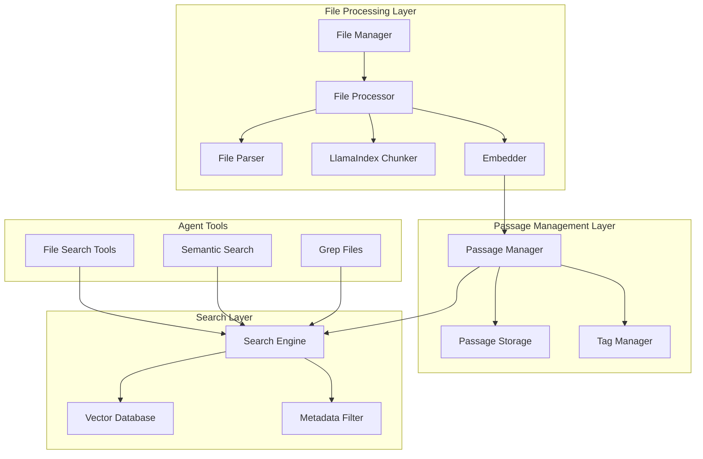

**Diagram sources**
- [file_processor.py](file://letta/services/file_processor/file_processor.py#L27-L48)
- [passage_manager.py](file://letta/services/passage_manager.py#L51-L56)
- [files_tool_executor.py](file://letta/services/tool_executor/files_tool_executor.py#L308-L728)

**Section sources**
- [file_processor.py](file://letta/services/file_processor/file_processor.py#L24-L139)
- [passage_manager.py](file://letta/services/passage_manager.py#L51-L56)

## Passage Management

The PassageManager service serves as the central hub for all passage-related operations, handling both archival passages (agent memory) and source passages (file content).

### Core Passage Types

The system distinguishes between two primary passage types:

**Archival Passages**: Stored in agent archives for long-term memory retention. These passages are managed by the PassageManager and support dual storage in both SQL databases and vector databases.

**Source Passages**: Created during file processing and stored in vector databases for search purposes. These passages maintain associations with their source files and metadata.

### Passage Creation Workflow

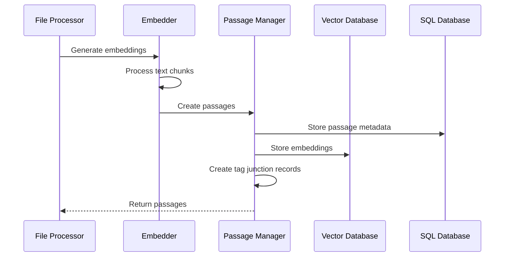

**Diagram sources**
- [file_processor.py](file://letta/services/file_processor/file_processor.py#L49-L139)
- [passage_manager.py](file://letta/services/passage_manager.py#L141-L251)

### Passage Schema and Features

Passages contain rich metadata and support advanced features:

| Field | Type | Description | Purpose |
|-------|------|-------------|---------|
| id | String | Unique passage identifier | Primary key for retrieval |
| text | String | Original passage text | Content storage |
| embedding | Array[float] | Vector representation | Semantic search |
| embedding_config | EmbeddingConfig | Embedding parameters | Configuration reference |
| organization_id | String | Organization association | Multi-tenancy |
| source_id | String | Source file reference | File provenance |
| file_id | String | File association | File tracking |
| tags | Array[string] | Classification tags | Filtering and categorization |
| metadata | Object | Additional metadata | Extended attributes |

**Section sources**
- [passage.py](file://letta/schemas/passage.py#L14-L95)
- [passage_manager.py](file://letta/services/passage_manager.py#L141-L251)

## File Processing Pipeline

The file processing pipeline transforms raw documents into searchable passages through a sophisticated multi-stage process.

### Processing Stages

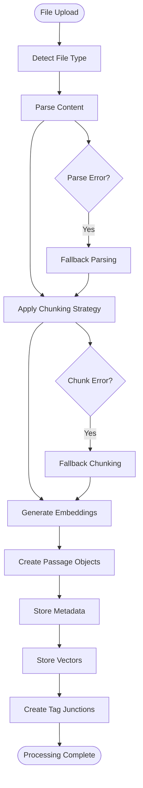

**Diagram sources**
- [file_processor.py](file://letta/services/file_processor/file_processor.py#L49-L139)
- [llama_index_chunker.py](file://letta/services/file_processor/chunker/llama_index_chunker.py#L88-L170)

### File Type Detection and Chunking Strategies

The system supports intelligent chunking based on file type characteristics:

| File Type Category | Chunking Strategy | Description | Use Case |
|-------------------|------------------|-------------|----------|
| Code Files | CODE | Line-based with syntax awareness | Source code analysis |
| Documentation | DOCUMENTATION | Paragraph-aware with structure preservation | Markdown, HTML, documentation |
| Structured Data | STRUCTURED_DATA | JSON/XML node parsing | Configuration files, APIs |
| Prose Documents | LINE_BASED | Sentence-aware splitting | Articles, reports |

### Embedding Generation and Batching

The embedding system employs sophisticated batching and retry mechanisms:

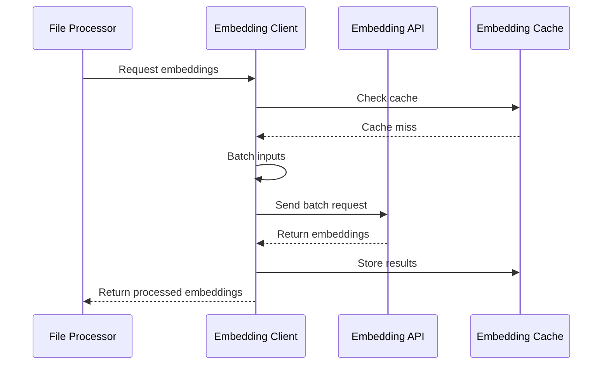

**Diagram sources**
- [openai_client.py](file://letta/llm_api/openai_client.py#L744-L824)
- [base_embedder.py](file://letta/services/file_processor/embedder/base_embedder.py#L19-L22)

**Section sources**
- [file_processor.py](file://letta/services/file_processor/file_processor.py#L49-L139)
- [llama_index_chunker.py](file://letta/services/file_processor/chunker/llama_index_chunker.py#L12-L170)
- [base_embedder.py](file://letta/services/file_processor/embedder/base_embedder.py#L12-L22)

## Vector Database Integration

Letta supports multiple vector database providers, each optimized for different use cases and scale requirements.

### Supported Providers

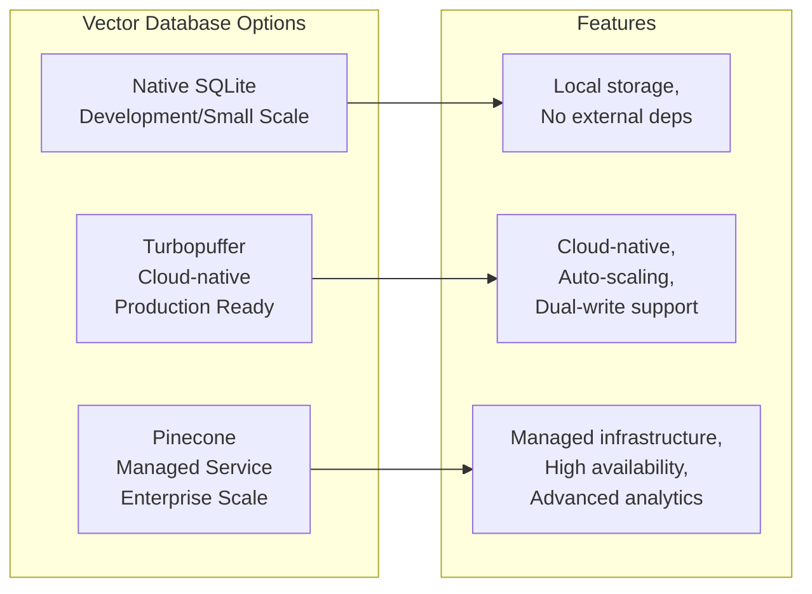

**Diagram sources**
- [tpuf_client.py](file://letta/helpers/tpuf_client.py#L22-L30)
- [pinecone_embedder.py](file://letta/services/file_processor/embedder/pinecone_embedder.py#L20-L35)
- [turbopuffer_embedder.py](file://letta/services/file_processor/embedder/turbopuffer_embedder.py#L16-L34)

### Provider Configuration and Selection

The system automatically selects the appropriate provider based on configuration and availability:

| Provider | Configuration | Use Case | Performance |
|----------|---------------|----------|-------------|
| TPUF | `use_tpuf=true` + API key | Production deployments | High throughput, auto-scaling |
| PINECONE | Pinecone credentials | Enterprise environments | Managed scalability |
| NATIVE | Default SQLite | Development/testing | Local performance |

### Dual-Write Architecture

For production deployments, the system supports dual-write to both SQL and vector databases:

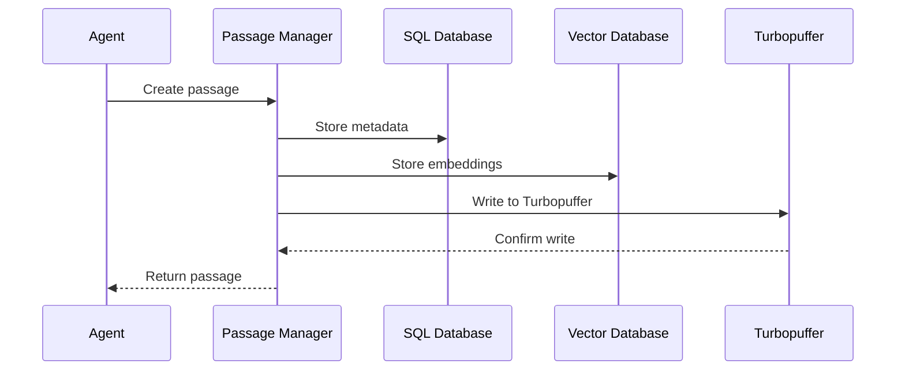

**Diagram sources**
- [passage_manager.py](file://letta/services/passage_manager.py#L517-L542)
- [tpuf_client.py](file://letta/helpers/tpuf_client.py#L201-L225)

**Section sources**
- [tpuf_client.py](file://letta/helpers/tpuf_client.py#L22-L30)
- [pinecone_embedder.py](file://letta/services/file_processor/embedder/pinecone_embedder.py#L20-L35)
- [turbopuffer_embedder.py](file://letta/services/file_processor/embedder/turbopuffer_embedder.py#L16-L34)

## Search Capabilities

The search system provides multiple search modes and sophisticated filtering capabilities.

### Search Modes

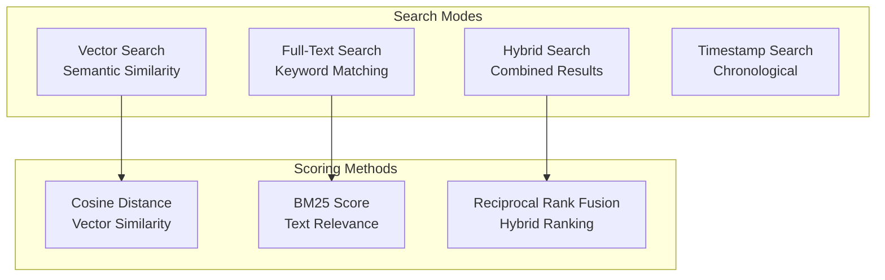

**Diagram sources**
- [tpuf_client.py](file://letta/helpers/tpuf_client.py#L421-L442)
- [tpuf_client.py](file://letta/helpers/tpuf_client.py#L573-L590)

### Semantic Search Implementation

Semantic search uses vector similarity to find conceptually related content:

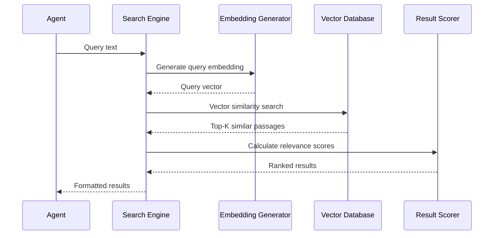

**Diagram sources**
- [tpuf_client.py](file://letta/helpers/tpuf_client.py#L486-L506)
- [agent_manager_helper.py](file://letta/services/helpers/agent_manager_helper.py#L985-L992)

### Metadata Filtering and Tagging

The system supports comprehensive filtering using metadata and tags:

| Filter Type | Description | Example Usage |
|-------------|-------------|---------------|
| Source ID | Filter by source origin | `source_id: "source_123"` |
| File ID | Filter by specific file | `file_id: "file_456"` |
| Date Range | Temporal filtering | `created_at >= "2024-01-01"` |
| Tags | Content classification | `tags: ["important", "finance"]` |
| Organization | Multi-tenancy isolation | `organization_id: "org_789"` |

### Hybrid Search with Reciprocal Rank Fusion

For optimal results, the system combines vector and text search using Reciprocal Rank Fusion (RRF):

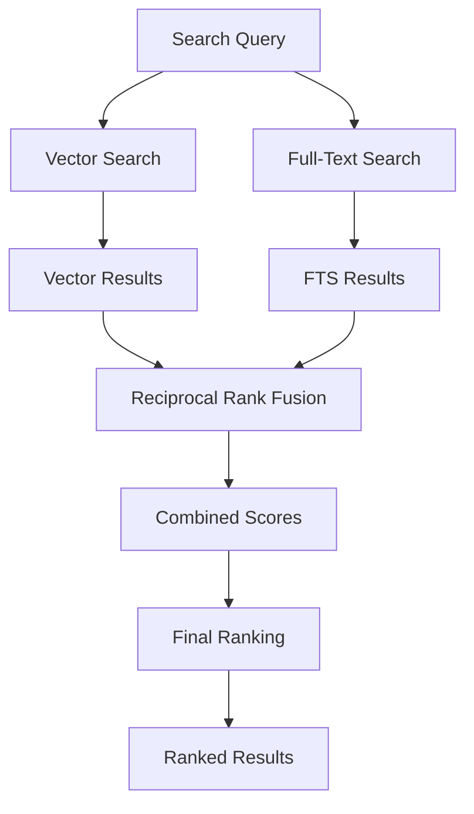

**Diagram sources**
- [tpuf_client.py](file://letta/helpers/tpuf_client.py#L573-L589)

**Section sources**
- [tpuf_client.py](file://letta/helpers/tpuf_client.py#L421-L590)
- [agent_manager_helper.py](file://letta/services/helpers/agent_manager_helper.py#L962-L1091)

## Agent Tools for File Search

Agents can interact with the file search system through specialized tools that provide natural language interfaces to search capabilities.

### Available Search Tools

The file search tools provide comprehensive search functionality:

| Tool | Parameters | Description | Use Case |
|------|------------|-------------|----------|
| `grep_files` | `pattern`, `include`, `context_lines`, `offset` | Regex-based file search | Pattern matching across files |
| `semantic_search_files` | `query`, `limit` | Semantic similarity search | Finding conceptually related content |
| `search_files` | `query`, `limit`, `filters` | General file search | Flexible search with multiple criteria |

### Search Tool Parameters

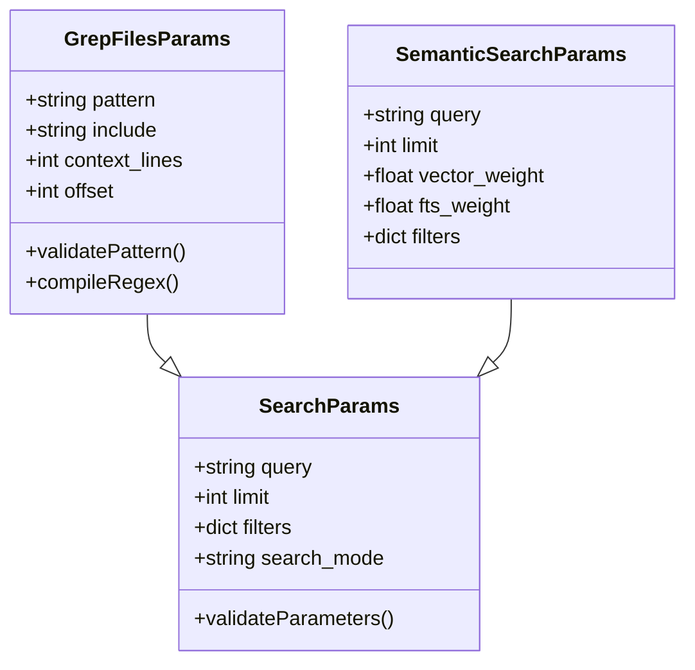

**Diagram sources**
- [files_tool_executor.py](file://letta/services/tool_executor/files_tool_executor.py#L311-L330)
- [files_tool_executor.py](file://letta/services/tool_executor/files_tool_executor.py#L539-L542)

### Search Examples

**Semantic Search Example**:
```python
# Agent searches for financial documents
results = await semantic_search_files(
    agent_state=agent,
    query="financial statements and revenue analysis",
    limit=5
)
```

**Pattern Search Example**:
```python
# Agent searches for specific patterns across files
results = await grep_files(
    agent_state=agent,
    pattern=r"ERROR \d{3}:.*",
    include="*.log",
    context_lines=2
)
```

**Section sources**
- [files_tool_executor.py](file://letta/services/tool_executor/files_tool_executor.py#L308-L728)

## Performance Optimization

The system implements several performance optimization strategies for handling large document collections efficiently.

### Indexing Strategies

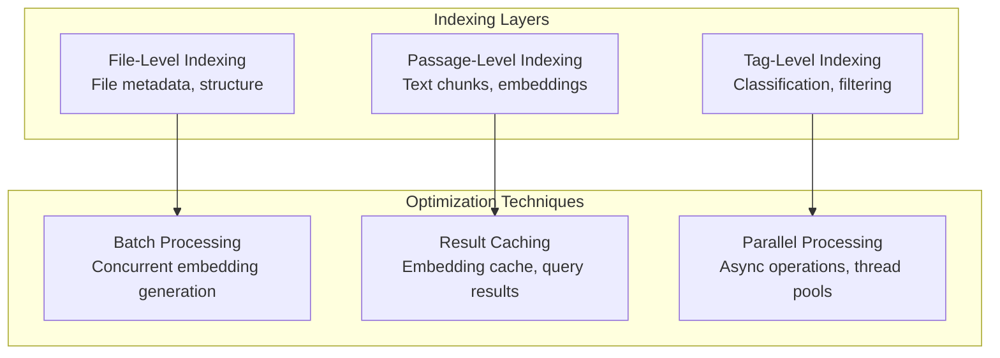

**Diagram sources**
- [file_processor.py](file://letta/services/file_processor/file_processor.py#L49-L139)
- [tpuf_client.py](file://letta/helpers/tpuf_client.py#L18-L20)

### Caching Mechanisms

The system employs multiple caching layers:

| Cache Level | Technology | Purpose | Duration |
|-------------|------------|---------|----------|
| Embedding Cache | Redis/LRU | Prevent redundant embeddings | Session-based |
| Query Cache | Application | Store search results | Configurable |
| File Content Cache | Memory | Reduce file I/O | Runtime |
| Vector Cache | Vector DB | Optimize similarity queries | Persistent |

### Concurrency and Throttling

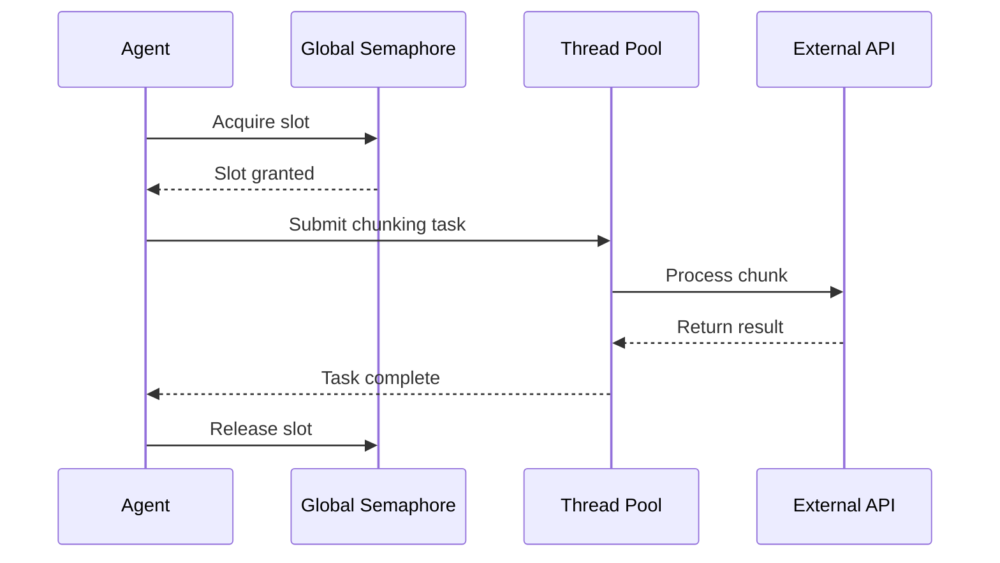

**Diagram sources**
- [tpuf_client.py](file://letta/helpers/tpuf_client.py#L18-L20)
- [openai_client.py](file://letta/llm_api/openai_client.py#L744-L824)

### Large Collection Handling

For large document collections, the system implements:

- **Streaming Processing**: Process files in chunks to manage memory usage
- **Progressive Loading**: Load file contents on-demand for agents
- **Lazy Evaluation**: Defer expensive operations until needed
- **Resource Limits**: Configurable limits on concurrent operations

**Section sources**
- [tpuf_client.py](file://letta/helpers/tpuf_client.py#L18-L20)
- [openai_client.py](file://letta/llm_api/openai_client.py#L744-L824)
- [file_processor.py](file://letta/services/file_processor/file_processor.py#L49-L139)

## Troubleshooting Guide

Common issues and their solutions when working with file search and retrieval.

### Embedding Quality Issues

**Problem**: Poor search relevance despite good content
**Symptoms**: 
- Irrelevant results for semantic queries
- Low similarity scores
- Inconsistent search behavior

**Solutions**:
1. **Verify Embedding Model**: Ensure the embedding model matches your content type
2. **Check Text Preprocessing**: Validate that text cleaning removes noise
3. **Review Chunk Size**: Adjust chunk size for optimal granularity
4. **Monitor Embedding Dimensions**: Verify embeddings match expected dimensions

### Search Relevance Problems

**Problem**: Search results don't match expectations
**Symptoms**:
- Missing relevant documents
- Too many irrelevant results
- Slow search performance

**Diagnostic Steps**:
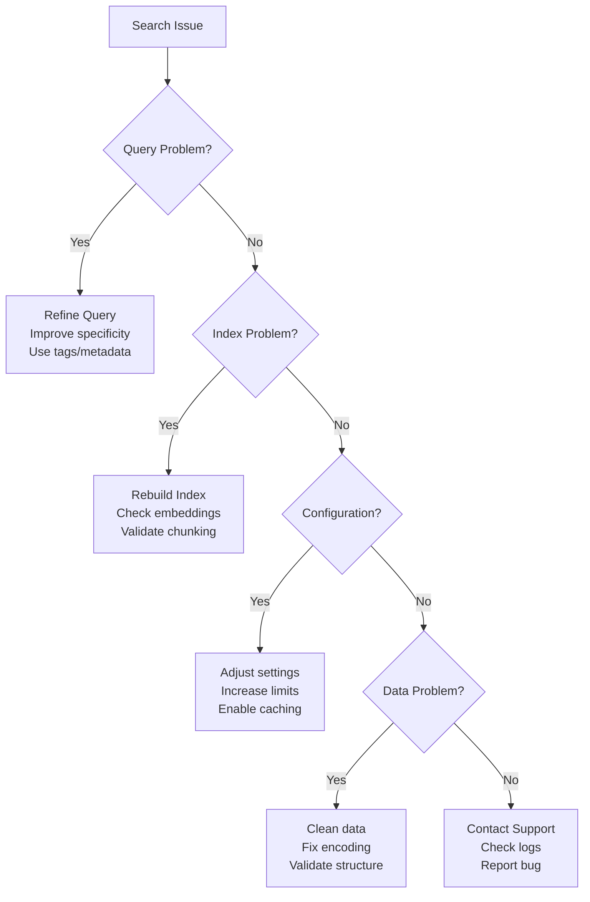

### Vector Database Issues

**Connection Problems**:
- Verify API keys and credentials
- Check network connectivity
- Validate database configuration

**Performance Issues**:
- Monitor embedding generation rates
- Check vector database capacity
- Review query complexity

**Data Integrity Issues**:
- Verify passage counts match expectations
- Check for duplicate embeddings
- Validate metadata consistency

### File Processing Failures

**Common Failure Points**:
1. **Unsupported File Types**: Verify file type registration
2. **Large File Handling**: Check memory limits and timeouts
3. **Encoding Issues**: Validate character encoding
4. **Parsing Errors**: Review fallback mechanisms

**Section sources**
- [openai_client.py](file://letta/llm_api/openai_client.py#L744-L824)
- [file_processor.py](file://letta/services/file_processor/file_processor.py#L49-L139)

## Best Practices

### File Organization and Naming

- Use descriptive file names that reflect content
- Organize files in logical directory structures
- Maintain consistent naming conventions
- Include version information in file names

### Embedding Configuration

- Choose embedding models appropriate for your content type
- Configure chunk sizes based on document nature
- Monitor embedding quality metrics
- Implement embedding validation checks

### Search Strategy

- Combine semantic and keyword search for best results
- Use tags for content classification and filtering
- Implement progressive refinement for complex queries
- Cache frequently accessed search results

### Performance Tuning

- Monitor embedding generation rates and optimize batch sizes
- Implement appropriate caching strategies
- Use vector database indexes effectively
- Configure resource limits based on workload

### Monitoring and Maintenance

- Track passage creation and search performance metrics
- Monitor embedding quality and relevance scores
- Regular index maintenance and optimization
- Implement alerting for system failures