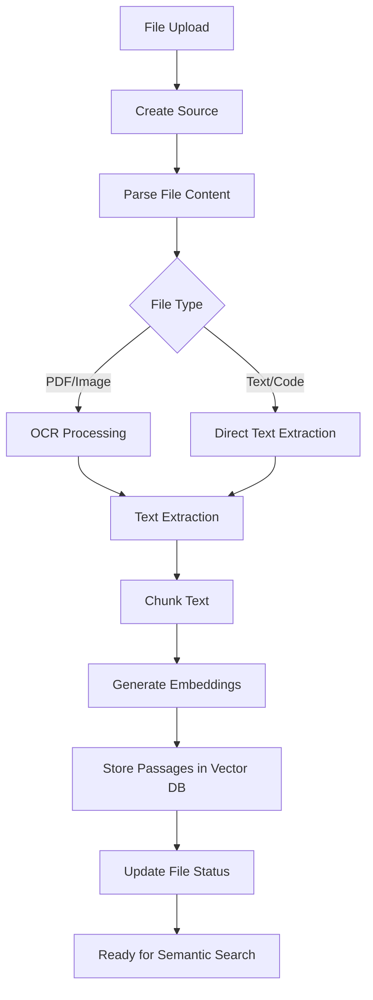
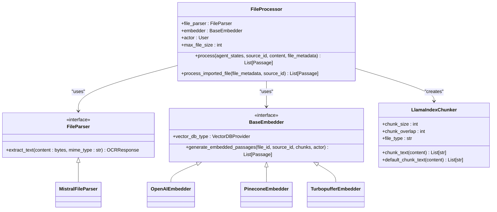
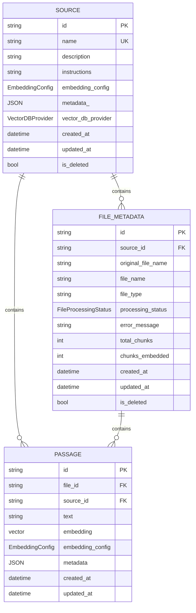
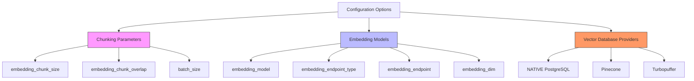
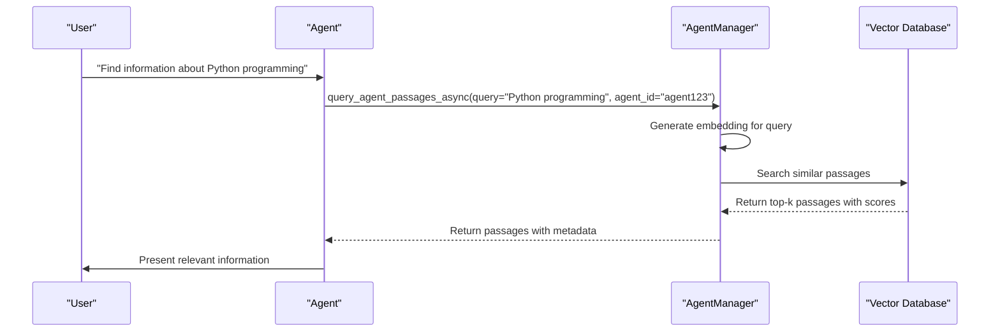

# File System Integration

<cite>
**Referenced Files in This Document**   
- [file_processor.py](file://letta/services/file_processor/file_processor.py)
- [file_types.py](file://letta/services/file_processor/file_types.py)
- [llama_index_chunker.py](file://letta/services/file_processor/chunker/llama_index_chunker.py)
- [base_embedder.py](file://letta/services/file_processor/embedder/base_embedder.py)
- [openai_embedder.py](file://letta/services/file_processor/embedder/openai_embedder.py)
- [pinecone_embedder.py](file://letta/services/file_processor/embedder/pinecone_embedder.py)
- [mistral_parser.py](file://letta/services/file_processor/parser/mistral_parser.py)
- [source_manager.py](file://letta/services/source_manager.py)
- [file_manager.py](file://letta/services/file_manager.py)
- [embedding_config.py](file://letta/schemas/embedding_config.py)
- [source.py](file://letta/orm/source.py)
</cite>

## Table of Contents
1. [Introduction](#introduction)
2. [File Processing Workflow](#file-processing-workflow)
3. [Supported File Types](#supported-file-types)
4. [File Processor Pipeline Components](#file-processor-pipeline-components)
5. [Source and Passage Management](#source-and-passage-management)
6. [Configuration Options](#configuration-options)
7. [Querying File Contents](#querying-file-contents)
8. [Performance Considerations](#performance-considerations)

## Introduction
Letta's document processing system provides a comprehensive solution for integrating file-based content into AI agents through semantic search capabilities. The system handles the complete workflow from file upload to queryable knowledge, processing various document formats through a pipeline of parsing, chunking, and embedding. This documentation details the architecture, components, and configuration options for Letta's file system integration, focusing on how documents are transformed into searchable knowledge sources for AI agents.

## File Processing Workflow
The document processing workflow in Letta follows a structured sequence from file upload to semantic search readiness. When a file is uploaded, it is first associated with a source, which acts as a container for related documents and their metadata. The file processing begins with parsing, where the raw file content is extracted into plain text. For complex formats like PDFs, this involves OCR (Optical Character Recognition) processing, while simple text files are read directly.

After parsing, the text undergoes chunking, where it is divided into smaller segments according to the file type and configured chunking strategy. These chunks are then processed by the embedder component, which generates vector embeddings using the configured embedding model. The resulting passages, containing both the text and its embedding, are stored in the vector database associated with the source. Throughout this process, the system maintains detailed status tracking, with files progressing through states like PARSING, EMBEDDING, and COMPLETED.

The workflow is orchestrated by the FileProcessor class, which coordinates the parser, chunker, and embedder components. Error handling is built into each stage, with fallback mechanisms such as retrying with default chunking strategies when file-specific processing fails. The system also implements rate limiting and batching for embedding operations to prevent overwhelming external APIs, particularly important when processing large document collections.

**Diagram sources**
- [file_processor.py](file://letta/services/file_processor/file_processor.py#L155-L277)
- [mistral_parser.py](file://letta/services/file_processor/parser/mistral_parser.py#L22-L57)

**Section sources**
- [file_processor.py](file://letta/services/file_processor/file_processor.py#L27-L402)
- [file_manager.py](file://letta/services/file_manager.py#L141-L176)

## Supported File Types
Letta supports a wide range of file formats through its centralized file type configuration system. The supported formats are categorized and managed by the FileTypeRegistry, which maintains information about each file type including its extension, MIME type, and appropriate processing strategy. The system distinguishes between simple text files that can be read directly and complex formats that require specialized parsing.

Document formats such as PDF (.pdf), Markdown (.md, .markdown), and plain text (.txt) are fully supported, with PDFs processed through OCR to extract text content. Programming languages including Python (.py), JavaScript (.js), TypeScript (.ts), Java (.java), C++ (.cpp, .cxx), and many others are supported with code-aware chunking strategies that preserve syntactic structure. Web technologies like HTML (.html, .htm), CSS (.css), and various frontend frameworks (.vue, .jsx, .tsx) are also supported.

Data and configuration formats include JSON (.json, .jsonl), CSV (.csv), XML (.xml), and various configuration formats like YAML (.yaml, .yml), TOML (.toml), and INI (.ini, .cfg). Scripting languages such as Shell (.sh, .bash), PowerShell (.ps1), and batch files (.bat, .cmd) are supported, along with specialized files like Dockerfiles (.dockerfile) and SQL scripts (.sql). Each file type is associated with a specific chunking strategy based on its content characteristics, ensuring optimal processing for different document types.

```mermaid
graph TD
A[Document Formats] --> A1[PDF]
A --> A2[Markdown]
A --> A3[Plain Text]
B[Programming Languages] --> B1[Python]
B --> B2[JavaScript/TypeScript]
B --> B3[Java]
B --> B4[C/C++]
B --> B5[C#]
B --> B6[Go]
B --> B7[Rust]
B --> B8[PHP]
B --> B9[Ruby]
C[Web Technologies] --> C1[HTML]
C --> C2[CSS/SCSS]
C --> C3[Vue.js]
C --> C4[React]
D[Data & Config] --> D1[JSON/JSONL]
D --> D2[CSV]
D --> D3[XML]
D --> D4[YAML/TOML]
D --> D5[INI/CFG]
E[Scripts & SQL] --> E1[Shell/Bash]
E --> E2[PowerShell]
E --> E3[Batch]
E --> E4[Dockerfile]
E --> E5[SQL]
```

**Diagram sources**
- [file_types.py](file://letta/services/file_processor/file_types.py#L45-L101)

**Section sources**
- [file_types.py](file://letta/services/file_processor/file_types.py#L8-L305)

## File Processor Pipeline Components
The file processing pipeline in Letta consists of three main components: parsers, chunkers, and embedders, each responsible for a specific stage of document processing. These components work together through the FileProcessor orchestrator to transform raw files into searchable knowledge.

### Parsers
The parser component is responsible for extracting text content from uploaded files. Letta implements a pluggable parser architecture with the base FileParser abstract class defining the interface. The MistralFileParser is the primary implementation, using Mistral's OCR capabilities to extract text from PDFs and other document formats. For simple text files, the parser bypasses OCR and reads the content directly, significantly improving processing speed for formats like JSON, CSV, and code files. The parser returns structured OCRResponse objects containing the extracted text, which are then passed to the chunking stage.

### Chunkers
The chunking component divides extracted text into smaller, manageable segments for embedding. Letta uses the LlamaIndexChunker, which leverages LlamaIndex's node parsers to implement file-type-specific chunking strategies. Different file types receive appropriate chunking approaches: code files use CodeSplitter to preserve function and class boundaries, Markdown files use MarkdownNodeParser to respect heading hierarchies, JSON files use JSONNodeParser to maintain object structure, and general text uses SentenceSplitter for paragraph-aware chunking. The chunker is configurable with parameters like chunk_size and chunk_overlap, allowing optimization for different use cases and embedding models.

### Embedders
The embedder component generates vector embeddings for text chunks using specified embedding models. Letta supports multiple embedder implementations, including OpenAIEmbedder for OpenAI's embedding models, PineconeEmbedder for Pinecone-managed vectors, and TurbopufferEmbedder for Turbopuffer-hosted vectors. The embedders handle batching and rate limiting to efficiently process large numbers of chunks while respecting API constraints. They also implement retry logic for handling transient errors and token limit issues, ensuring robust processing even with large documents.

**Diagram sources**
- [file_processor.py](file://letta/services/file_processor/file_processor.py#L27-L402)
- [llama_index_chunker.py](file://letta/services/file_processor/chunker/llama_index_chunker.py#L12-L170)
- [base_embedder.py](file://letta/services/file_processor/embedder/base_embedder.py#L12-L22)

**Section sources**
- [file_processor.py](file://letta/services/file_processor/file_processor.py#L27-L402)
- [llama_index_chunker.py](file://letta/services/file_processor/chunker/llama_index_chunker.py#L12-L170)
- [openai_embedder.py](file://letta/services/file_processor/embedder/openai_embedder.py#L23-L227)

## Source and Passage Management
Sources in Letta serve as containers for related documents and their associated metadata, providing a way to organize and manage document collections for AI agents. Each source is linked to a vector database provider, which can be NATIVE (PostgreSQL with pgvector), PINECONE, or TPUF (Turbopuffer). The SourceManager handles the creation and management of sources, automatically determining the appropriate vector database provider based on system configuration, with Turbopuffer taking precedence when available.

When files are processed, they are associated with a source and broken down into passages, which are the fundamental units of searchable content. Each passage contains the text chunk, its vector embedding, and metadata linking it to the original file and source. The PassageManager handles the storage and retrieval of passages, supporting both direct database storage for NATIVE vector databases and external storage for Pinecone and Turbopuffer. The system maintains relationships between files, sources, and passages, allowing for efficient querying and filtering.

The file processing status is tracked through a state machine with defined transitions: PENDING → PARSING → EMBEDDING → COMPLETED for successful processing, or transitions to ERROR for failed processing. This state tracking enables monitoring of processing progress and identification of issues. The FileManager provides methods to update file status, including tracking metrics like total_chunks and chunks_embedded, which are essential for monitoring large-scale document processing operations.

**Diagram sources**
- [source.py](file://letta/orm/source.py#L17-L40)
- [file_manager.py](file://letta/services/file_manager.py#L40-L709)
- [source_manager.py](file://letta/services/source_manager.py#L22-L551)

**Section sources**
- [source_manager.py](file://letta/services/source_manager.py#L22-L551)
- [file_manager.py](file://letta/services/file_manager.py#L40-L709)

## Configuration Options
Letta provides extensive configuration options for customizing the document processing pipeline, particularly for chunking parameters, embedding models, and vector database providers. These configurations allow users to optimize processing for their specific use cases, balancing factors like search accuracy, processing speed, and cost.

### Chunking Configuration
Chunking parameters can be customized through the embedding_config object, specifically the embedding_chunk_size and embedding_chunk_overlap properties. The default chunk size is typically 300 tokens, but this can be adjusted based on the use case. Larger chunk sizes preserve more context but may reduce search precision, while smaller chunks increase precision but might miss broader context. The chunk overlap parameter controls how much adjacent chunks overlap, helping to preserve context across chunk boundaries. Different file types may benefit from different chunking strategies, with code files often requiring smaller chunks to maintain syntactic integrity.

### Embedding Model Configuration
The embedding model is configured through the EmbeddingConfig object, which specifies the embedding_model, embedding_endpoint_type, and other parameters. Letta supports multiple embedding providers including OpenAI, Azure, Google Vertex, and local models. The default configuration includes presets for popular models like "text-embedding-3-small" and "text-embedding-ada-002" from OpenAI, as well as configurations for Pinecone and local embedding services. Users can specify custom endpoints for self-hosted embedding models, enabling integration with private or specialized embedding services.

### Vector Database Providers
Letta supports multiple vector database providers, with the choice determined by system configuration. The NATIVE provider uses PostgreSQL with the pgvector extension for vector storage, providing a self-contained solution. Pinecone offers a managed vector database service with automatic scaling and optimization. Turbopuffer (TPUF) provides another managed option with specific performance characteristics. The system automatically selects the appropriate provider based on availability, with Turbopuffer taking precedence when configured. Each provider has specific configuration requirements, such as API keys and endpoint URLs, which are managed through the system's settings.

**Diagram sources**
- [embedding_config.py](file://letta/schemas/embedding_config.py#L8-L88)
- [source_manager.py](file://letta/services/source_manager.py#L22-L551)

**Section sources**
- [embedding_config.py](file://letta/schemas/embedding_config.py#L8-L88)
- [source_manager.py](file://letta/services/source_manager.py#L22-L551)

## Querying File Contents
Querying file contents in Letta is performed through semantic search, which uses vector similarity to find relevant passages based on a text query. The search process begins with generating an embedding for the query text using the same embedding model that was used for the document passages. This query embedding is then compared against the embeddings of stored passages to find the most similar ones, typically returning the top-k most relevant results.

The AgentManager provides the query_agent_passages_async method for performing semantic searches against agent-associated passages. This method supports various filtering options, including date ranges, file IDs, and source IDs, allowing for targeted searches within specific document collections. The search results include not only the matching passages but also relevance scores and metadata, providing context for the matches. For sources using external vector databases like Pinecone or Turbopuffer, the search is delegated to the respective service, while NATIVE sources use PostgreSQL's pgvector similarity search capabilities.

Passage tagging provides an additional dimension for filtering search results. Tags can be applied to passages during processing or added later, and searches can be filtered to include only passages with specific tags. The system supports different tag matching modes, such as ANY (match if any specified tag is present) and ALL (match only if all specified tags are present), enabling flexible filtering strategies. This tagging system, combined with metadata filtering, allows for sophisticated search queries that can target very specific subsets of the document collection.

**Diagram sources**
- [agent_manager.py](file://letta/services/agent_manager.py#L2168-L2266)
- [helpers/agent_manager_helper.py](file://letta/services/helpers/agent_manager_helper.py#L852-L1091)

**Section sources**
- [agent_manager.py](file://letta/services/agent_manager.py#L2168-L2266)
- [helpers/agent_manager_helper.py](file://letta/services/helpers/agent_manager_helper.py#L852-L1091)

## Performance Considerations
Processing large document collections in Letta requires careful consideration of performance factors to ensure efficient operation and optimal search quality. The system implements several optimization techniques to handle large-scale document processing, including batching, parallel processing, and resource management.

For large document collections, the embedding generation process can be a significant bottleneck, particularly when using external APIs with rate limits. Letta addresses this through batching of embedding requests and global rate limiting via a semaphore that controls concurrent embedding operations across the entire system. This prevents overwhelming external services like OpenAI's embedding API, even when processing multiple files simultaneously. The batch_size parameter in the embedding configuration allows tuning of this batching behavior to balance between throughput and memory usage.

Passage tagging and metadata filtering provide performance benefits by reducing the search space for queries. By tagging passages with relevant categories or topics, searches can be scoped to only examine potentially relevant subsets of the document collection, significantly improving search speed for large collections. Similarly, metadata filtering allows queries to target specific time periods, document types, or other attributes, further narrowing the search scope.

For very large document collections, the choice of vector database provider becomes critical. While the NATIVE PostgreSQL option provides a self-contained solution, managed services like Pinecone and Turbopuffer offer automatic scaling and optimization for large-scale vector search. The system's architecture allows seamless switching between these providers, enabling users to start with the NATIVE option for smaller collections and migrate to managed services as their needs grow. Monitoring tools and logging provide insights into processing performance, helping identify bottlenecks and optimize configuration parameters.

**Section sources**
- [openai_embedder.py](file://letta/services/file_processor/embedder/openai_embedder.py#L23-L227)
- [file_processor.py](file://letta/services/file_processor/file_processor.py#L27-L402)