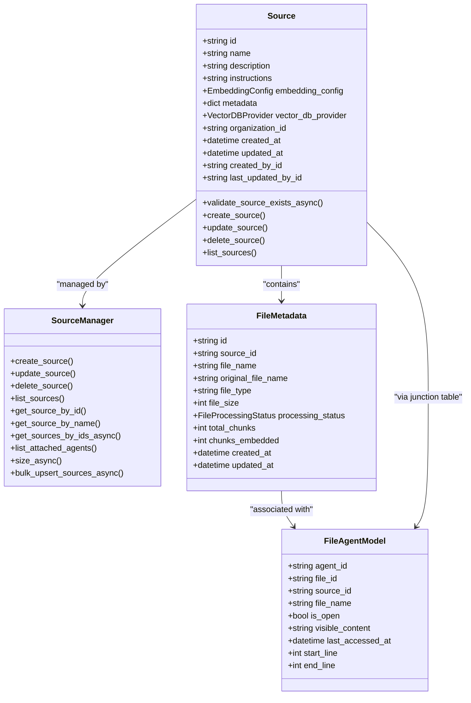
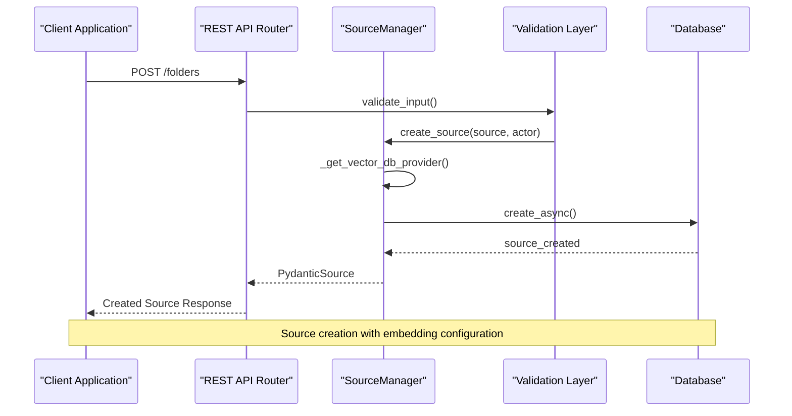
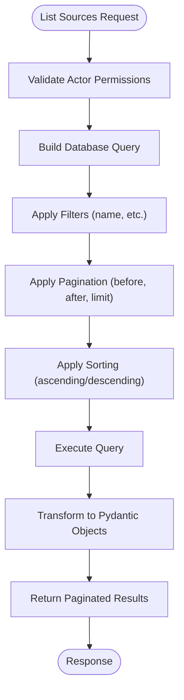
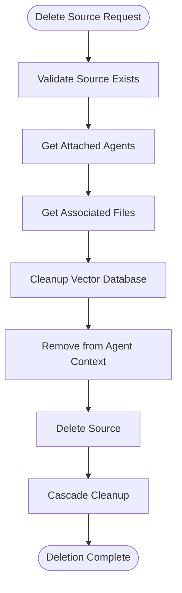
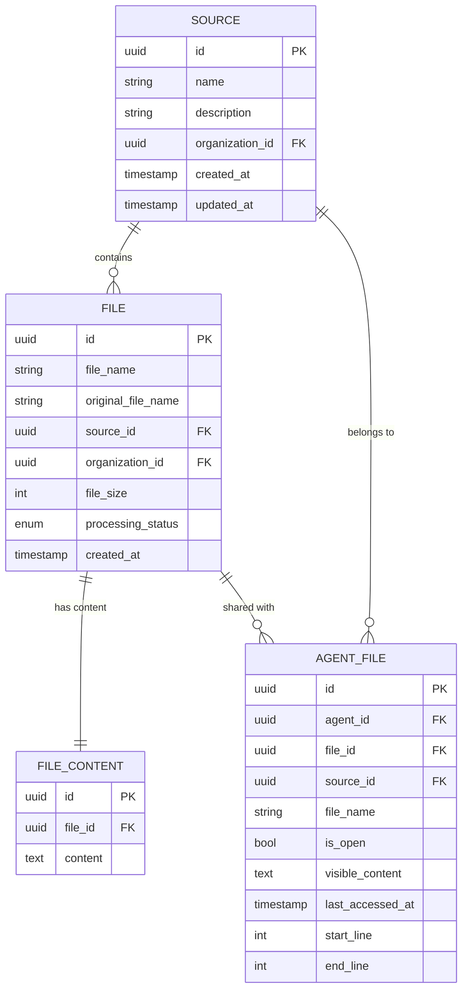
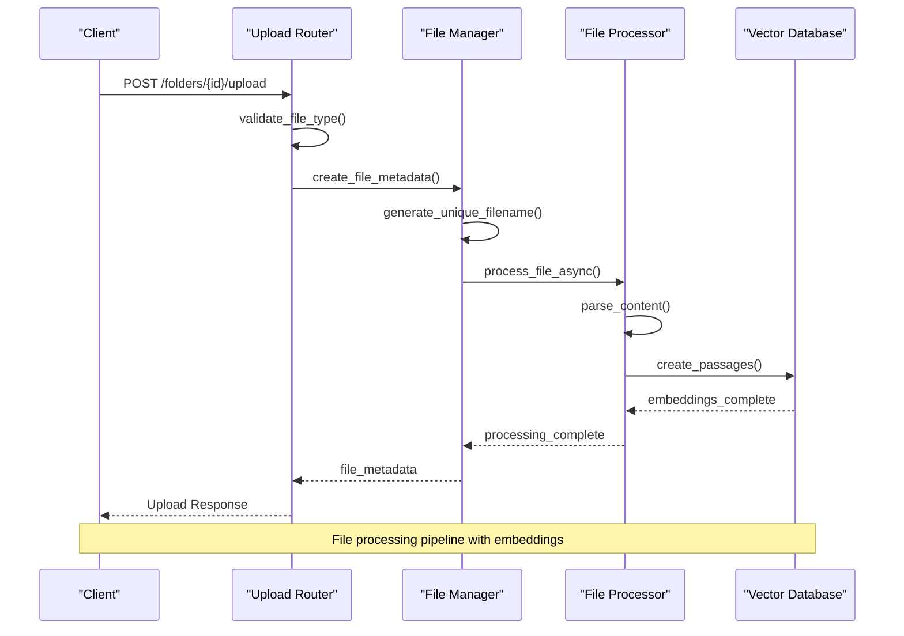
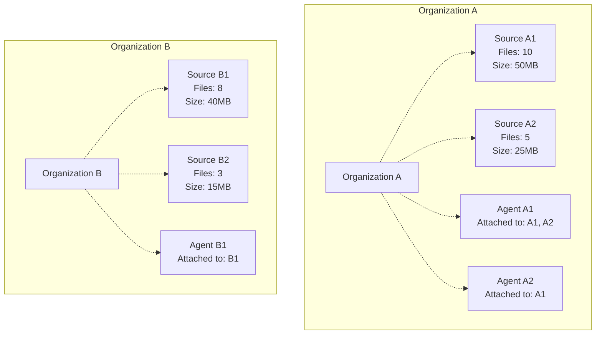
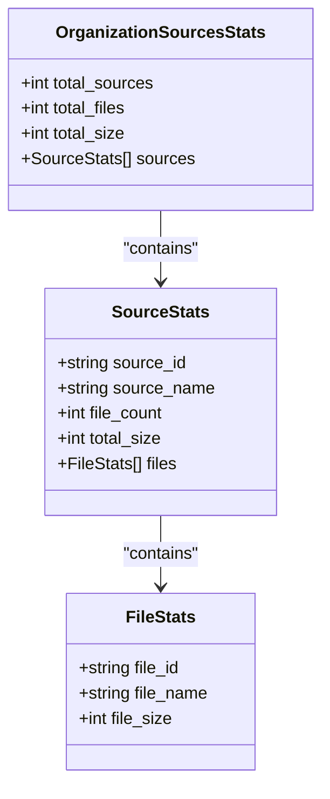
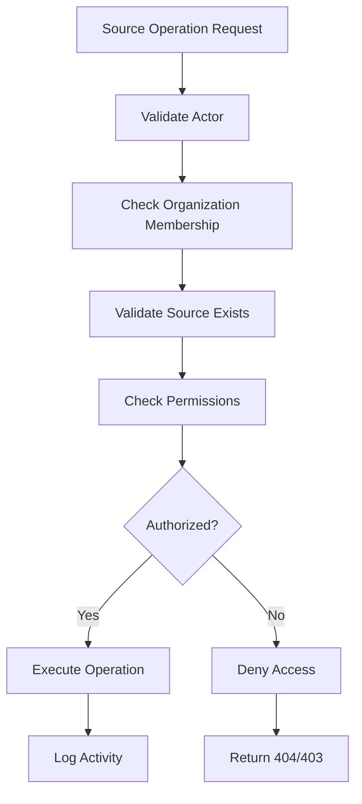
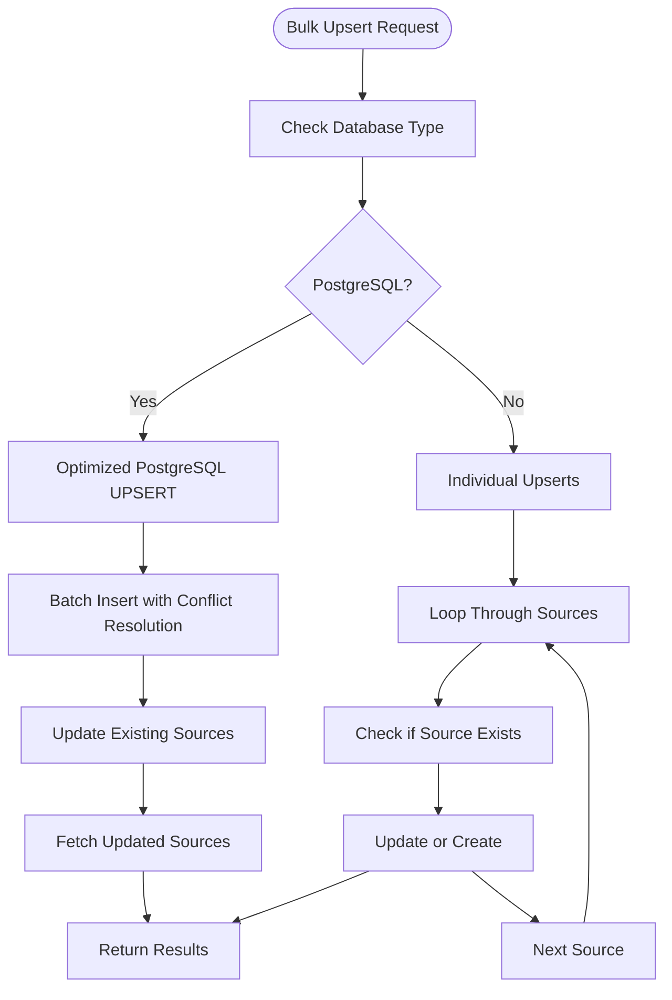

# Folder and Source Management

<cite>
**Referenced Files in This Document**
- [letta/orm/source.py](file://letta/orm/source.py)
- [letta/schemas/source.py](file://letta/schemas/source.py)
- [letta/services/source_manager.py](file://letta/services/source_manager.py)
- [letta/orm/file.py](file://letta/orm/file.py)
- [letta/schemas/file.py](file://letta/schemas/file.py)
- [letta/schemas/source_metadata.py](file://letta/schemas/source_metadata.py)
- [letta/server/rest_api/routers/v1/folders.py](file://letta/server/rest_api/routers/v1/folders.py)
- [letta/server/rest_api/routers/v1/sources.py](file://letta/server/rest_api/routers/v1/sources.py)
- [letta/services/file_manager.py](file://letta/services/file_manager.py)
- [letta/services/files_agents_manager.py](file://letta/services/files_agents_manager.py)
- [tests/managers/test_source_manager.py](file://tests/managers/test_source_manager.py)
</cite>

## Table of Contents
1. [Introduction](#introduction)
2. [Source Model Architecture](#source-model-architecture)
3. [CRUD Operations](#crud-operations)
4. [File Management and Associations](#file-management-and-associations)
5. [Organization-Level Management](#organization-level-management)
6. [Statistics and Metadata](#statistics-and-metadata)
7. [Access Control and Security](#access-control-and-security)
8. [Bulk Operations](#bulk-operations)
9. [Use Cases and Examples](#use-cases-and-examples)
10. [Performance Considerations](#performance-considerations)

## Introduction

Folder and Source Management in Letta provides a sophisticated system for organizing files into logical collections. Sources serve as containers that group related files together, similar to traditional folders, but with enhanced capabilities for AI-powered content management, embedding storage, and agent access control.

The system is built around the concept of **Sources** as the primary organizational unit, which can contain multiple files and be associated with multiple agents. This architecture enables powerful use cases including document categorization, access control, and intelligent content retrieval.

## Source Model Architecture

### Core Source Properties

The Source model represents a collection of files with embedded content, serving as the foundation for the folder management system.

**Diagram sources**
- [letta/orm/source.py](file://letta/orm/source.py#L17-L40)
- [letta/services/source_manager.py](file://letta/services/source_manager.py#L22-L551)
- [letta/orm/file.py](file://letta/orm/file.py#L37-L108)

### Source Schema Definition

The Source model includes several key properties that define its behavior and capabilities:

| Property | Type | Description | Constraints |
|----------|------|-------------|-------------|
| `id` | string | Unique identifier for the source | Auto-generated UUID |
| `name` | string | Human-readable name of the source | Required, unique per organization |
| `description` | string | Detailed description of the source's purpose | Optional |
| `instructions` | string | Usage instructions for the source | Optional |
| `embedding_config` | EmbeddingConfig | Configuration for text embeddings | Required |
| `metadata` | dict | Additional metadata about the source | Optional |
| `vector_db_provider` | VectorDBProvider | Vector database backend | Defaults to NATIVE |
| `organization_id` | string | Organization that owns the source | Required |

**Section sources**
- [letta/orm/source.py](file://letta/orm/source.py#L29-L39)
- [letta/schemas/source.py](file://letta/schemas/source.py#L26-L42)

## CRUD Operations

### Creating Sources

Sources can be created through multiple interfaces, with automatic validation and organization scoping.

**Diagram sources**
- [letta/services/source_manager.py](file://letta/services/source_manager.py#L63-L81)
- [letta/server/rest_api/routers/v1/folders.py](file://letta/server/rest_api/routers/v1/folders.py#L144-L176)

The creation process includes automatic vector database provider selection and organization-scoped validation.

**Section sources**
- [letta/services/source_manager.py](file://letta/services/source_manager.py#L63-L81)
- [letta/server/rest_api/routers/v1/folders.py](file://letta/server/rest_api/routers/v1/folders.py#L144-L176)

### Listing Sources

Sources support comprehensive listing with pagination, filtering, and sorting capabilities.

**Diagram sources**
- [letta/services/source_manager.py](file://letta/services/source_manager.py#L239-L261)
- [letta/server/rest_api/routers/v1/folders.py](file://letta/server/rest_api/routers/v1/folders.py#L118-L141)

**Section sources**
- [letta/services/source_manager.py](file://letta/services/source_manager.py#L239-L261)
- [letta/server/rest_api/routers/v1/folders.py](file://letta/server/rest_api/routers/v1/folders.py#L118-L141)

### Updating Sources

Source updates support partial modifications with change detection and validation.

**Section sources**
- [letta/services/source_manager.py](file://letta/services/source_manager.py#L205-L226)
- [letta/server/rest_api/routers/v1/folders.py](file://letta/server/rest_api/routers/v1/folders.py#L179-L192)

### Deleting Sources

Source deletion includes cascading cleanup of associated files, passages, and agent associations.

**Diagram sources**
- [letta/services/source_manager.py](file://letta/services/source_manager.py#L228-L236)
- [letta/server/rest_api/routers/v1/folders.py](file://letta/server/rest_api/routers/v1/folders.py#L195-L227)

**Section sources**
- [letta/services/source_manager.py](file://letta/services/source_manager.py#L228-L236)
- [letta/server/rest_api/routers/v1/folders.py](file://letta/server/rest_api/routers/v1/folders.py#L195-L227)

## File Management and Associations

### File-Source Relationship

Files are organized within sources through a many-to-many relationship managed by the system.

**Diagram sources**
- [letta/orm/file.py](file://letta/orm/file.py#L37-L108)
- [letta/services/files_agents_manager.py](file://letta/services/files_agents_manager.py#L93-L593)

### File Upload and Processing

File uploads to sources involve multiple stages of processing and validation.

**Diagram sources**
- [letta/server/rest_api/routers/v1/folders.py](file://letta/server/rest_api/routers/v1/folders.py#L230-L368)

**Section sources**
- [letta/server/rest_api/routers/v1/folders.py](file://letta/server/rest_api/routers/v1/folders.py#L230-L368)

### File Association Management

The system manages file-agent associations for context-aware content access.

**Section sources**
- [letta/services/files_agents_manager.py](file://letta/services/files_agents_manager.py#L93-L593)

## Organization-Level Management

### Organization Scoping

All source operations are scoped to organizations, ensuring data isolation and access control.

### Cross-Organization Access Control

The system enforces strict access controls at the organization level, preventing unauthorized access between organizations.

**Section sources**
- [letta/services/source_manager.py](file://letta/services/source_manager.py#L38-L60)

## Statistics and Metadata

### Aggregated Statistics

The system provides comprehensive statistics about source usage and file distribution.

**Diagram sources**
- [letta/schemas/source_metadata.py](file://letta/schemas/source_metadata.py#L26-L33)

### Metadata Retrieval

Sources support detailed metadata retrieval with optional per-source breakdowns.

**Section sources**
- [letta/services/file_manager.py](file://letta/services/file_manager.py#L565-L622)
- [letta/server/rest_api/routers/v1/folders.py](file://letta/server/rest_api/routers/v1/folders.py#L89-L115)

## Access Control and Security

### Permission Validation

The system implements comprehensive permission validation for all source operations.

**Diagram sources**
- [letta/services/source_manager.py](file://letta/services/source_manager.py#L38-L60)

### Security Features

- **Organization Isolation**: All operations are scoped to the requesting user's organization
- **Permission Validation**: Every operation validates actor permissions against source ownership
- **Audit Logging**: All source operations are logged for security auditing
- **Resource Cleanup**: Automatic cleanup of associated resources during deletion

**Section sources**
- [letta/services/source_manager.py](file://letta/services/source_manager.py#L38-L60)

## Bulk Operations

### Bulk Source Upsert

The system supports efficient bulk operations for creating or updating multiple sources simultaneously.

**Diagram sources**
- [letta/services/source_manager.py](file://letta/services/source_manager.py#L85-L132)

### Bulk File Operations

File operations support bulk processing for improved performance with large datasets.

**Section sources**
- [letta/services/source_manager.py](file://letta/services/source_manager.py#L85-L132)

## Use Cases and Examples

### Document Categorization

Sources excel at organizing documents by category, enabling specialized content management:

**Example Categories:**
- **Documentation Sources**: API documentation, user manuals, technical specs
- **Research Sources**: Academic papers, research articles, whitepapers  
- **Project Sources**: Project plans, meeting notes, task lists
- **Reference Sources**: Style guides, coding standards, templates

### Agent-Based Organization

Different agents can access different subsets of sources based on their roles and responsibilities.

**Example Scenarios:**
- **Customer Support Agent**: Access to FAQ documents and product documentation
- **Development Agent**: Access to code repositories and technical specifications
- **Executive Assistant**: Access to meeting notes and strategic documents

### Content Migration

Sources enable systematic migration of content between systems while maintaining organization and context.

### Multi-Tenant Isolation

Each organization maintains complete isolation of their sources and associated content, ensuring data security and compliance.

## Performance Considerations

### Database Optimization

The system employs several optimization strategies for large-scale source management:

- **Indexing**: Strategic indexing on organization_id, created_at, and name fields
- **Batch Operations**: Optimized bulk operations for PostgreSQL environments
- **Lazy Loading**: Efficient relationship loading to minimize memory usage
- **Pagination**: Cursor-based pagination for large result sets

### Scalability Patterns

- **Horizontal Scaling**: Organization-based partitioning enables horizontal scaling
- **Connection Pooling**: Database connection pooling for high-concurrency scenarios
- **Async Operations**: Fully asynchronous operations for optimal throughput

### Memory Management

- **Streaming Processing**: Large file processing uses streaming to minimize memory footprint
- **Lazy Evaluation**: File content is loaded on-demand to reduce memory usage
- **Garbage Collection**: Automatic cleanup of temporary resources

**Section sources**
- [letta/services/source_manager.py](file://letta/services/source_manager.py#L22-L34)
- [letta/services/file_manager.py](file://letta/services/file_manager.py#L565-L622)