# Asynchronous Execution Patterns

<cite>
**Referenced Files in This Document**
- [scheduler.py](file://letta/jobs/scheduler.py)
- [job_manager.py](file://letta/services/job_manager.py)
- [types.py](file://letta/jobs/types.py)
- [llm_batch_job_polling.py](file://letta/jobs/llm_batch_job_polling.py)
- [utils.py](file://letta/utils.py)
- [sleeptime_multi_agent.py](file://letta/groups/sleeptime_multi_agent.py)
- [job.py](file://letta/schemas/job.py)
- [job.py](file://letta/orm/job.py)
- [settings.py](file://letta/settings.py)
- [messages.py](file://letta/server/rest_api/routers/v1/messages.py)
- [interface.py](file://letta/server/rest_api/interface.py)
</cite>

## Table of Contents
1. [Introduction](#introduction)
2. [System Architecture Overview](#system-architecture-overview)
3. [The Scheduler Class](#the-scheduler-class)
4. [Job Status Management](#job-status-management)
5. [Background Execution Patterns](#background-execution-patterns)
6. [Thread Safety and Resource Management](#thread-safety-and-resource-management)
7. [CPU-Intensive vs I/O-Bound Operations](#cpu-intensive-vs-io-bound-operations)
8. [Configuration and Limits](#configuration-and-limits)
9. [Troubleshooting Guide](#troubleshooting-guide)
10. [Best Practices](#best-practices)

## Introduction

Letta implements a sophisticated asynchronous execution framework designed to handle both CPU-intensive operations and I/O-bound tasks efficiently. The system leverages Python's asyncio capabilities along with traditional threading to provide non-blocking job execution while maintaining thread safety and resource limits.

The asynchronous execution patterns in Letta are built around several key components:
- **Scheduler**: Manages background job queues and execution cycles
- **Job Manager**: Handles job lifecycle and status transitions
- **Background Task Executors**: Provides thread pool and async task management
- **Resource Monitoring**: Tracks worker exhaustion and prevents system overload

## System Architecture Overview

Letta's asynchronous execution system follows a multi-layered architecture that separates concerns between scheduling, execution, and monitoring:

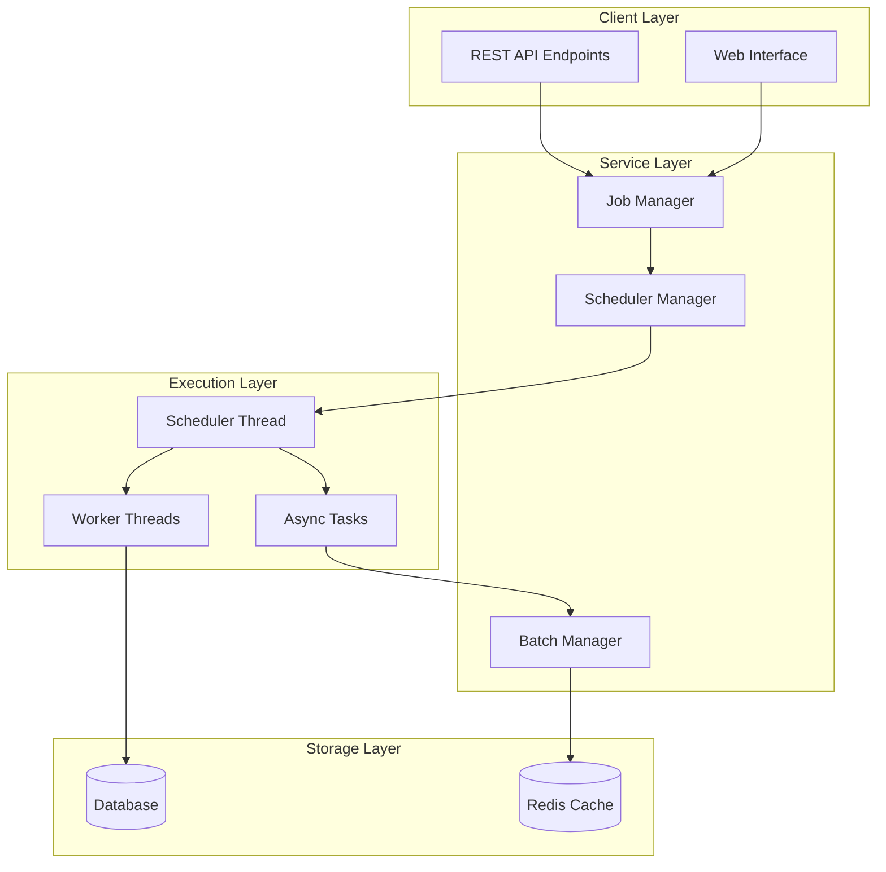
```mermaid
graph TB
subgraph "Client Layer"
API[REST API Endpoints]
WebUI[Web Interface]
end
subgraph "Service Layer"
JM[Job Manager]
SM[Scheduler Manager]
BM[Batch Manager]
end
subgraph "Execution Layer"
ST[Scheduler Thread]
WT[Worker Threads]
AT[Async Tasks]
end
subgraph "Storage Layer"
DB[(Database)]
Redis[(Redis Cache)]
end
API --> JM
WebUI --> JM
JM --> SM
SM --> ST
ST --> WT
ST --> AT
WT --> DB
AT --> BM
BM --> Redis
```

**Diagram sources**
- [scheduler.py](file://letta/jobs/scheduler.py#L16-L229)
- [job_manager.py](file://letta/services/job_manager.py#L34-L600)

**Section sources**
- [scheduler.py](file://letta/jobs/scheduler.py#L1-L229)
- [job_manager.py](file://letta/services/job_manager.py#L1-L600)

## The Scheduler Class

The Scheduler class serves as the central coordinator for all background job execution in Letta. It manages a queue of pending jobs and executes them in background worker threads, providing both synchronous and asynchronous execution modes.

### Core Scheduler Components

The scheduler maintains several critical global states:

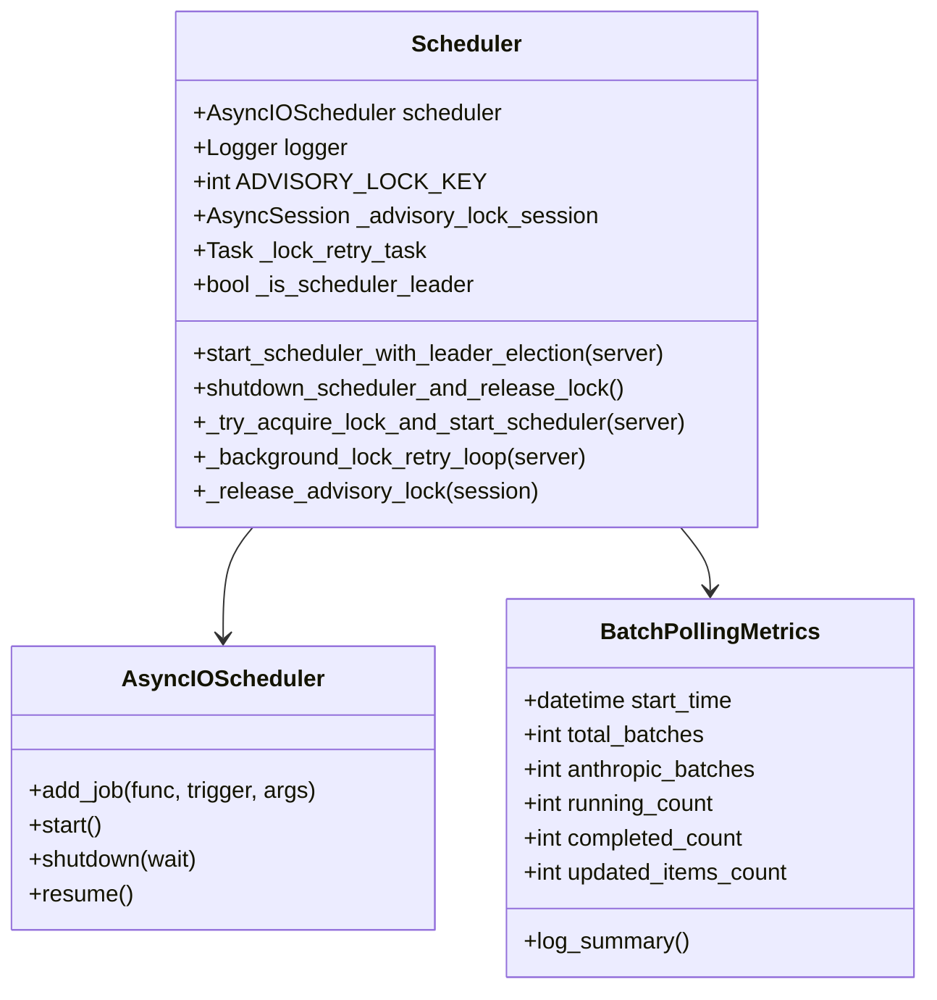
```mermaid
classDiagram
class Scheduler {
+AsyncIOScheduler scheduler
+Logger logger
+int ADVISORY_LOCK_KEY
+AsyncSession _advisory_lock_session
+Task _lock_retry_task
+bool _is_scheduler_leader
+start_scheduler_with_leader_election(server)
+shutdown_scheduler_and_release_lock()
+_try_acquire_lock_and_start_scheduler(server)
+_background_lock_retry_loop(server)
+_release_advisory_lock(session)
}
class AsyncIOScheduler {
+add_job(func, trigger, args)
+start()
+shutdown(wait)
+resume()
}
class BatchPollingMetrics {
+datetime start_time
+int total_batches
+int anthropic_batches
+int running_count
+int completed_count
+int updated_items_count
+log_summary()
}
Scheduler --> AsyncIOScheduler
Scheduler --> BatchPollingMetrics
```

**Diagram sources**
- [scheduler.py](file://letta/jobs/scheduler.py#L15-L229)

### Leader Election and Lock Management

The scheduler implements a PostgreSQL advisory lock mechanism to ensure only one instance runs the scheduler in a distributed environment:

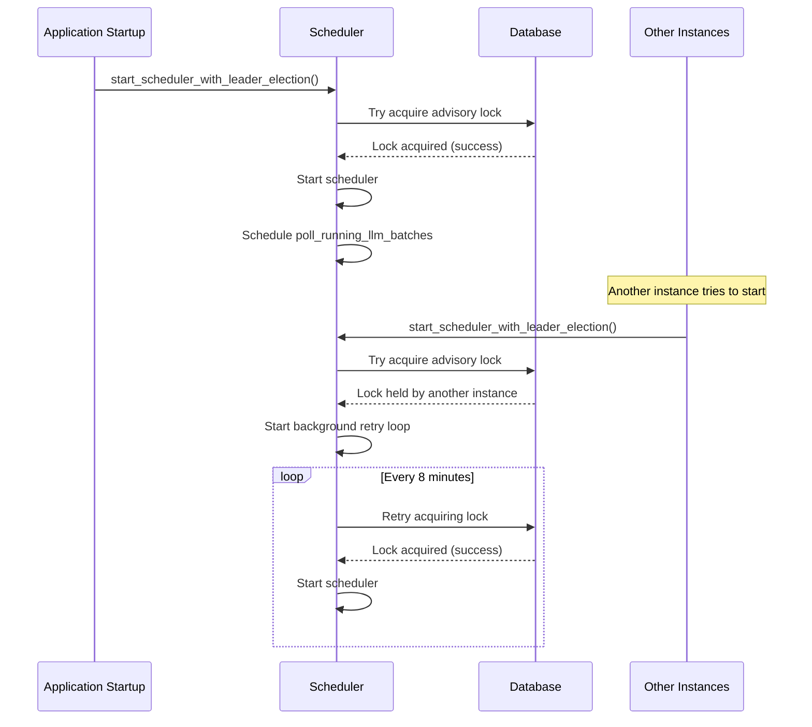
```mermaid
sequenceDiagram
participant App as Application Startup
participant Scheduler as Scheduler
participant DB as Database
participant Other as Other Instances
App->>Scheduler : start_scheduler_with_leader_election()
Scheduler->>DB : Try acquire advisory lock
DB-->>Scheduler : Lock acquired (success)
Scheduler->>Scheduler : Start scheduler
Scheduler->>Scheduler : Schedule poll_running_llm_batches
Note over Other : Another instance tries to start
Other->>Scheduler : start_scheduler_with_leader_election()
Scheduler->>DB : Try acquire advisory lock
DB-->>Scheduler : Lock held by another instance
Scheduler->>Scheduler : Start background retry loop
loop Every 8 minutes
Scheduler->>DB : Retry acquiring lock
DB-->>Scheduler : Lock acquired (success)
Scheduler->>Scheduler : Start scheduler
end
```

**Diagram sources**
- [scheduler.py](file://letta/jobs/scheduler.py#L25-L182)

### Job Polling and Status Updates

The scheduler continuously monitors running LLM batch jobs and updates their statuses:

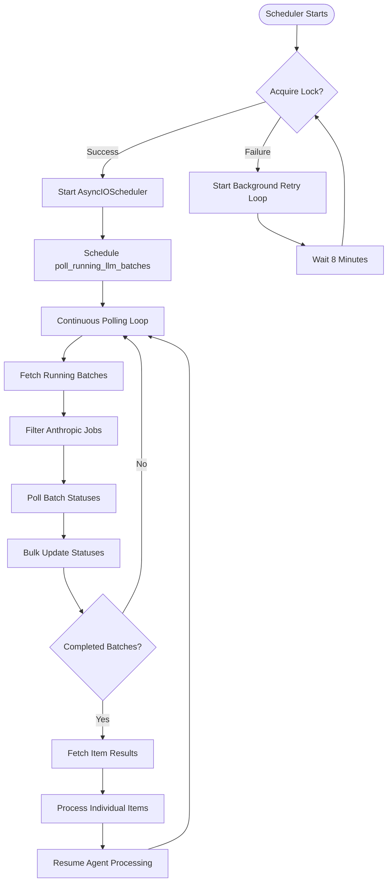
```mermaid
flowchart TD
Start([Scheduler Starts]) --> CheckLock{Acquire Lock?}
CheckLock --> |Success| StartScheduler[Start AsyncIOScheduler]
CheckLock --> |Failure| RetryLoop[Start Background Retry Loop]
StartScheduler --> SchedulePolling[Schedule poll_running_llm_batches]
SchedulePolling --> PollLoop[Continuous Polling Loop]
PollLoop --> FetchBatches[Fetch Running Batches]
FetchBatches --> FilterAnthropic[Filter Anthropic Jobs]
FilterAnthropic --> PollStatuses[Poll Batch Statuses]
PollStatuses --> BulkUpdate[Bulk Update Statuses]
BulkUpdate --> CheckComplete{Completed Batches?}
CheckComplete --> |Yes| FetchResults[Fetch Item Results]
CheckComplete --> |No| PollLoop
FetchResults --> ProcessItems[Process Individual Items]
ProcessItems --> ResumeAgents[Resume Agent Processing]
ResumeAgents --> PollLoop
RetryLoop --> WaitRetry[Wait 8 Minutes]
WaitRetry --> CheckLock
```

**Diagram sources**
- [scheduler.py](file://letta/jobs/scheduler.py#L163-L229)
- [llm_batch_job_polling.py](file://letta/jobs/llm_batch_job_polling.py#L169-L248)

**Section sources**
- [scheduler.py](file://letta/jobs/scheduler.py#L25-L229)
- [llm_batch_job_polling.py](file://letta/jobs/llm_batch_job_polling.py#L169-L248)

## Job Status Management

Letta implements a robust job status management system with strict state transitions to ensure data consistency and prevent race conditions.

### Job Status Lifecycle

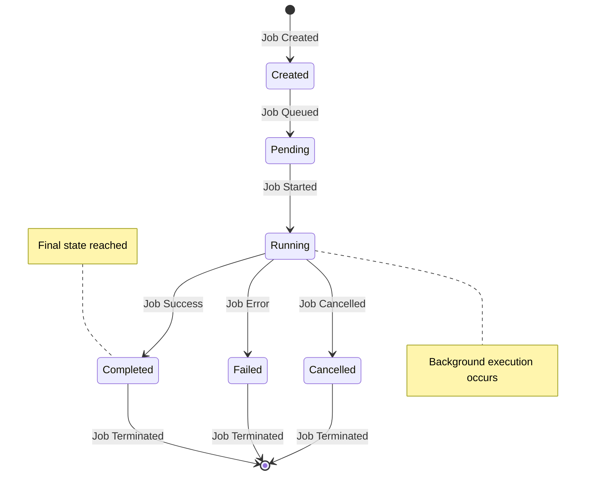
```mermaid
stateDiagram-v2
[*] --> Created : Job Created
Created --> Pending : Job Queued
Pending --> Running : Job Started
Running --> Completed : Job Success
Running --> Failed : Job Error
Running --> Cancelled : Job Cancelled
Completed --> [*] : Job Terminated
Failed --> [*] : Job Terminated
Cancelled --> [*] : Job Terminated
note right of Running : Background execution occurs
note left of Completed : Final state reached
```

### Status Transition Guards

The JobManager enforces strict state transitions to prevent invalid operations:

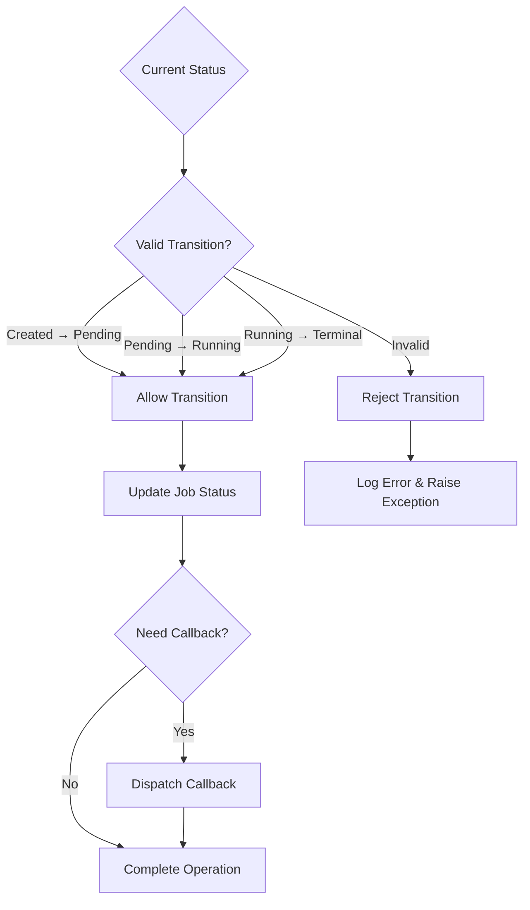
```mermaid
flowchart TD
CurrentStatus{Current Status} --> CheckTransition{Valid Transition?}
CheckTransition --> |Created → Pending| AllowTransition[Allow Transition]
CheckTransition --> |Pending → Running| AllowTransition
CheckTransition --> |Running → Terminal| AllowTransition
CheckTransition --> |Invalid| RejectTransition[Reject Transition]
AllowTransition --> UpdateStatus[Update Job Status]
UpdateStatus --> CheckCallback{Need Callback?}
CheckCallback --> |Yes| DispatchCallback[Dispatch Callback]
CheckCallback --> |No| Complete[Complete Operation]
DispatchCallback --> Complete
RejectTransition --> LogError[Log Error & Raise Exception]
```

**Diagram sources**
- [job_manager.py](file://letta/services/job_manager.py#L85-L106)

**Section sources**
- [job_manager.py](file://letta/services/job_manager.py#L85-L182)

## Background Execution Patterns

Letta provides multiple patterns for executing jobs asynchronously, each optimized for different types of workloads.

### Thread-Based Background Execution

For CPU-intensive operations, Letta creates dedicated worker threads:

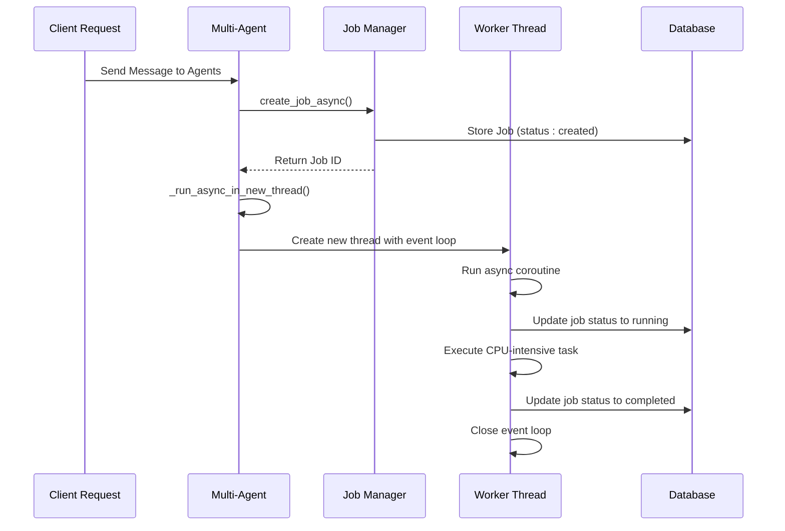
```mermaid
sequenceDiagram
participant Client as Client Request
participant Agent as Multi-Agent
participant JobMgr as Job Manager
participant Worker as Worker Thread
participant DB as Database
Client->>Agent : Send Message to Agents
Agent->>JobMgr : create_job_async()
JobMgr->>DB : Store Job (status : created)
JobMgr-->>Agent : Return Job ID
Agent->>Agent : _run_async_in_new_thread()
Agent->>Worker : Create new thread with event loop
Worker->>Worker : Run async coroutine
Worker->>DB : Update job status to running
Worker->>Worker : Execute CPU-intensive task
Worker->>DB : Update job status to completed
Worker->>Worker : Close event loop
```

**Diagram sources**
- [sleeptime_multi_agent.py](file://letta/groups/sleeptime_multi_agent.py#L47-L62)

### Async Task Creation Patterns

For I/O-bound operations, Letta uses asyncio task creation with proper error handling:

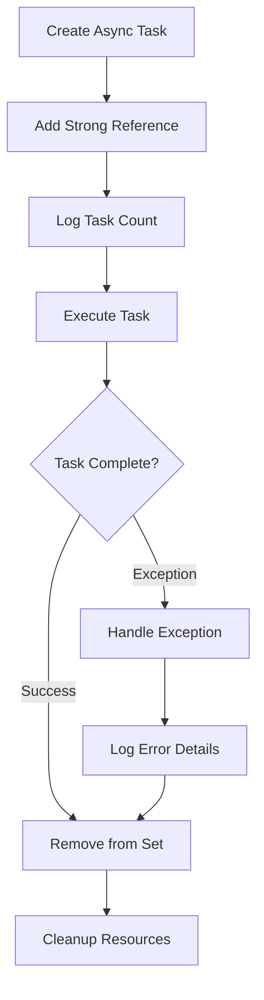
```mermaid
flowchart TD
CreateTask[Create Async Task] --> AddRef[Add Strong Reference]
AddRef --> LogCount[Log Task Count]
LogCount --> ExecuteTask[Execute Task]
ExecuteTask --> TaskComplete{Task Complete?}
TaskComplete --> |Success| RemoveRef[Remove from Set]
TaskComplete --> |Exception| HandleError[Handle Exception]
HandleError --> LogError[Log Error Details]
LogError --> RemoveRef
RemoveRef --> Cleanup[Cleanup Resources]
```

**Diagram sources**
- [utils.py](file://letta/utils.py#L1132-L1158)

### Shielded Background Tasks

For critical operations that must complete even if parent operations are cancelled:

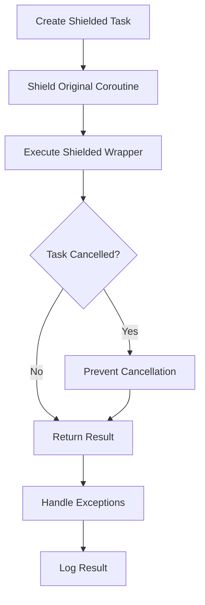
```mermaid
flowchart TD
CreateShielded[Create Shielded Task] --> ShieldCoroutine[Shield Original Coroutine]
ShieldCoroutine --> ExecuteShielded[Execute Shielded Wrapper]
ExecuteShielded --> CheckCancellation{Task Cancelled?}
CheckCancellation --> |Yes| PreventCancel[Prevent Cancellation]
CheckCancellation --> |No| ReturnResult[Return Result]
PreventCancel --> ReturnResult
ReturnResult --> HandleExceptions[Handle Exceptions]
HandleExceptions --> LogResult[Log Result]
```

**Diagram sources**
- [utils.py](file://letta/utils.py#L1184-L1201)

**Section sources**
- [sleeptime_multi_agent.py](file://letta/groups/sleeptime_multi_agent.py#L47-L98)
- [utils.py](file://letta/utils.py#L1132-L1201)

## Thread Safety and Resource Management

Letta implements comprehensive thread safety measures and resource limits to prevent worker exhaustion and system overload.

### Background Task Tracking

The system maintains a global set of background tasks to prevent memory leaks:

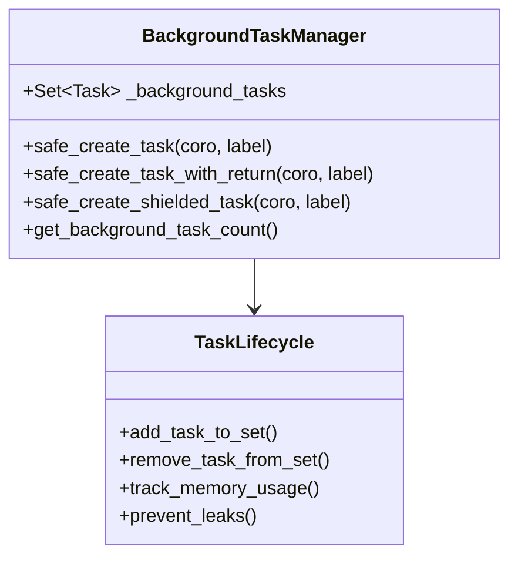
```mermaid
classDiagram
class BackgroundTaskManager {
+Set~Task~ _background_tasks
+safe_create_task(coro, label)
+safe_create_task_with_return(coro, label)
+safe_create_shielded_task(coro, label)
+get_background_task_count()
}
class TaskLifecycle {
+add_task_to_set()
+remove_task_from_set()
+track_memory_usage()
+prevent_leaks()
}
BackgroundTaskManager --> TaskLifecycle
```

**Diagram sources**
- [utils.py](file://letta/utils.py#L1132-L1201)

### Resource Limiting Strategies

Letta employs multiple strategies to prevent resource exhaustion:

| Resource Type | Limiting Strategy | Configuration |
|---------------|-------------------|---------------|
| Database Connections | Connection Pooling | `pg_pool_size: 25`, `pg_max_overflow: 10` |
| Event Loop Workers | Thread Pool Size | `event_loop_threadpool_max_workers: 43` |
| Background Tasks | Task Set Tracking | Automatic cleanup via `add_done_callback()` |
| Memory Usage | Queue Size Limits | `maxsize=1` for streaming queues |
| Timeout Handling | Request Timeouts | `llm_request_timeout_seconds: 60.0` |

### Deadlock Prevention

The system implements several deadlock prevention mechanisms:

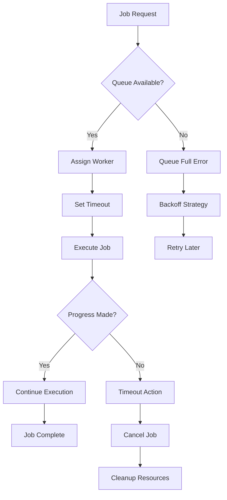
```mermaid
flowchart TD
Request[Job Request] --> CheckQueue{Queue Available?}
CheckQueue --> |Yes| AssignWorker[Assign Worker]
CheckQueue --> |No| QueueFull[Queue Full Error]
AssignWorker --> SetTimeout[Set Timeout]
SetTimeout --> ExecuteJob[Execute Job]
ExecuteJob --> CheckProgress{Progress Made?}
CheckProgress --> |Yes| ContinueExecution[Continue Execution]
CheckProgress --> |No| TimeoutAction[Timeout Action]
ContinueExecution --> JobComplete[Job Complete]
TimeoutAction --> CancelJob[Cancel Job]
CancelJob --> CleanupResources[Cleanup Resources]
QueueFull --> BackoffStrategy[Backoff Strategy]
BackoffStrategy --> RetryLater[Retry Later]
```

**Section sources**
- [utils.py](file://letta/utils.py#L1132-L1201)
- [settings.py](file://letta/settings.py#L298-L317)

## CPU-Intensive vs I/O-Bound Operations

Letta optimizes execution patterns based on the nature of the workload, distinguishing between CPU-intensive operations and I/O-bound tasks.

### CPU-Intensive Operations

CPU-intensive operations are executed in dedicated worker threads to prevent blocking the main event loop:

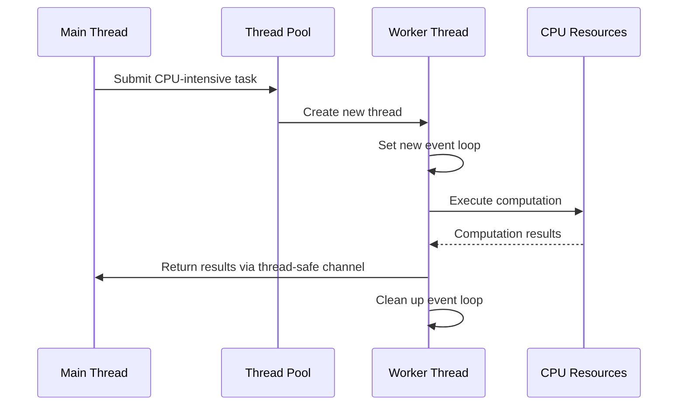
```mermaid
sequenceDiagram
participant Main as Main Thread
participant ThreadPool as Thread Pool
participant Worker as Worker Thread
participant CPU as CPU Resources
Main->>ThreadPool : Submit CPU-intensive task
ThreadPool->>Worker : Create new thread
Worker->>Worker : Set new event loop
Worker->>CPU : Execute computation
CPU-->>Worker : Computation results
Worker->>Main : Return results via thread-safe channel
Worker->>Worker : Clean up event loop
```

**Examples of CPU-Intensive Operations:**
- Large-scale data processing
- Mathematical computations
- Machine learning model inference
- Image/video processing
- Text analysis and parsing

### I/O-Bound Operations

I/O-bound operations leverage asyncio for non-blocking execution:

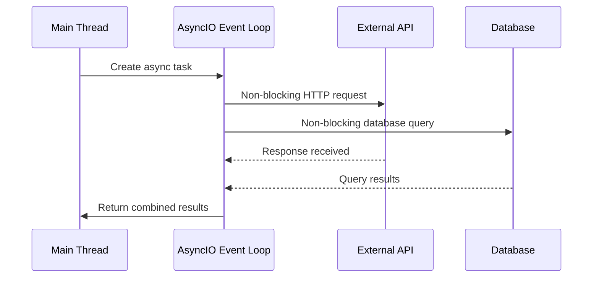
```mermaid
sequenceDiagram
participant Main as Main Thread
participant AsyncIO as AsyncIO Event Loop
participant Network as External API
participant Database as Database
Main->>AsyncIO : Create async task
AsyncIO->>Network : Non-blocking HTTP request
AsyncIO->>Database : Non-blocking database query
Network-->>AsyncIO : Response received
Database-->>AsyncIO : Query results
AsyncIO->>Main : Return combined results
```

**Examples of I/O-Bound Operations:**
- External API calls (Anthropic, OpenAI, etc.)
- Database queries and updates
- File system operations
- Network communications
- Webhook notifications

### Mixed Workload Optimization

For mixed workloads, Letta dynamically selects the appropriate execution pattern:

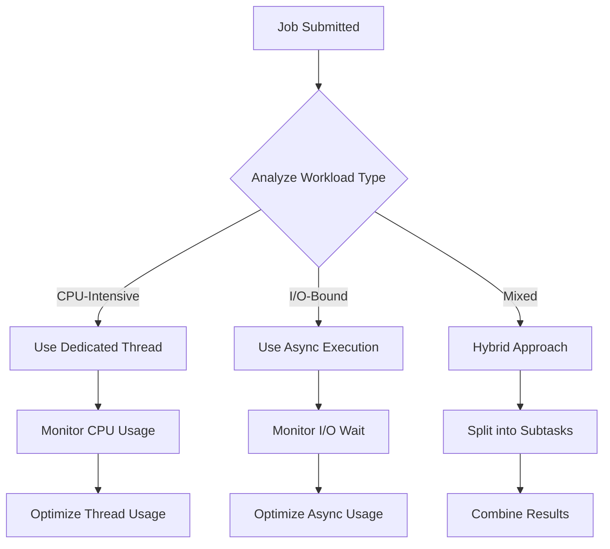
```mermaid
flowchart TD
JobSubmitted[Job Submitted] --> AnalyzeWorkload{Analyze Workload Type}
AnalyzeWorkload --> |CPU-Intensive| DedicatedThread[Use Dedicated Thread]
AnalyzeWorkload --> |I/O-Bound| AsyncExecution[Use Async Execution]
AnalyzeWorkload --> |Mixed| HybridApproach[Hybrid Approach]
DedicatedThread --> MonitorCPU[Monitor CPU Usage]
AsyncExecution --> MonitorIO[Monitor I/O Wait]
HybridApproach --> SplitTasks[Split into Subtasks]
MonitorCPU --> OptimizeThread[Optimize Thread Usage]
MonitorIO --> OptimizeAsync[Optimize Async Usage]
SplitTasks --> CombineResults[Combine Results]
```

**Section sources**
- [sleeptime_multi_agent.py](file://letta/groups/sleeptime_multi_agent.py#L47-L98)
- [llm_batch_job_polling.py](file://letta/jobs/llm_batch_job_polling.py#L169-L248)

## Configuration and Limits

Letta provides extensive configuration options for controlling asynchronous execution behavior and preventing system overload.

### Core Configuration Options

| Setting | Default Value | Description | Impact |
|---------|---------------|-------------|---------|
| `enable_batch_job_polling` | `False` | Enable/disable batch job polling | Controls background job processing |
| `poll_running_llm_batches_interval_seconds` | `300` | Polling interval in seconds | Frequency of status checks |
| `batch_job_polling_lookback_weeks` | `2` | Lookback period for polling | Determines historical job coverage |
| `batch_job_polling_batch_size` | `None` | Batch size for polling operations | Controls memory usage per poll |
| `poll_lock_retry_interval_seconds` | `480` | Retry interval for leader election | Recovery from lock failures |

### Database Connection Limits

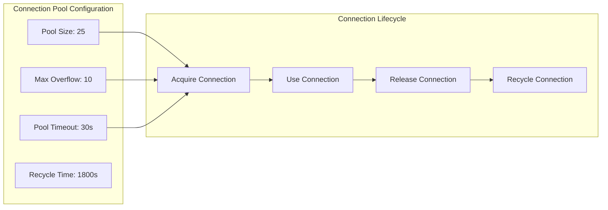
```mermaid
graph LR
subgraph "Connection Pool Configuration"
PoolSize[Pool Size: 25]
MaxOverflow[Max Overflow: 10]
PoolTimeout[Pool Timeout: 30s]
RecycleTime[Recycle Time: 1800s]
end
subgraph "Connection Lifecycle"
Acquire[Acquire Connection]
Use[Use Connection]
Release[Release Connection]
Recycle[Recycle Connection]
end
PoolSize --> Acquire
MaxOverflow --> Acquire
PoolTimeout --> Acquire
Acquire --> Use
Use --> Release
Release --> Recycle
```

**Diagram sources**
- [settings.py](file://letta/settings.py#L256-L264)

### Event Loop Configuration

The system uses a configurable thread pool for event loop management:

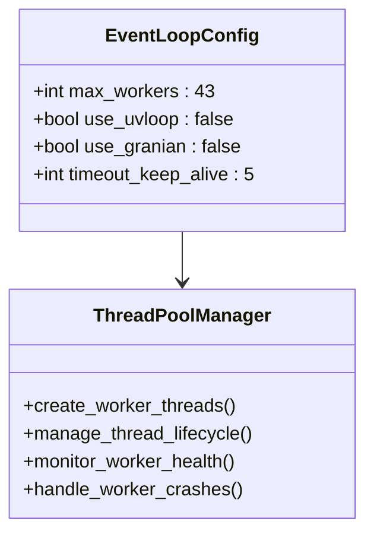
```mermaid
classDiagram
class EventLoopConfig {
+int max_workers : 43
+bool use_uvloop : false
+bool use_granian : false
+int timeout_keep_alive : 5
}
class ThreadPoolManager {
+create_worker_threads()
+manage_thread_lifecycle()
+monitor_worker_health()
+handle_worker_crashes()
}
EventLoopConfig --> ThreadPoolManager
```

**Diagram sources**
- [settings.py](file://letta/settings.py#L298-L300)

### Queue and Buffer Limits

Letta implements various queue and buffer limits to prevent memory exhaustion:

| Component | Limit | Purpose |
|-----------|-------|---------|
| Streaming Queue | `maxsize=1` | Prevents unbounded memory growth |
| Database Pool | `pg_pool_size=25` | Controls concurrent connections |
| Background Tasks | Automatic cleanup | Prevents task accumulation |
| Request Size | `256MB` | Prevents oversized requests |

**Section sources**
- [settings.py](file://letta/settings.py#L311-L317)
- [messages.py](file://letta/server/rest_api/routers/v1/messages.py#L97-L124)

## Troubleshooting Guide

This section provides comprehensive guidance for diagnosing and resolving common issues with asynchronous execution.

### Common Issues and Solutions

#### Deadlocked Jobs

**Symptoms:**
- Jobs remain in "running" status indefinitely
- No progress updates
- System appears unresponsive

**Diagnosis:**
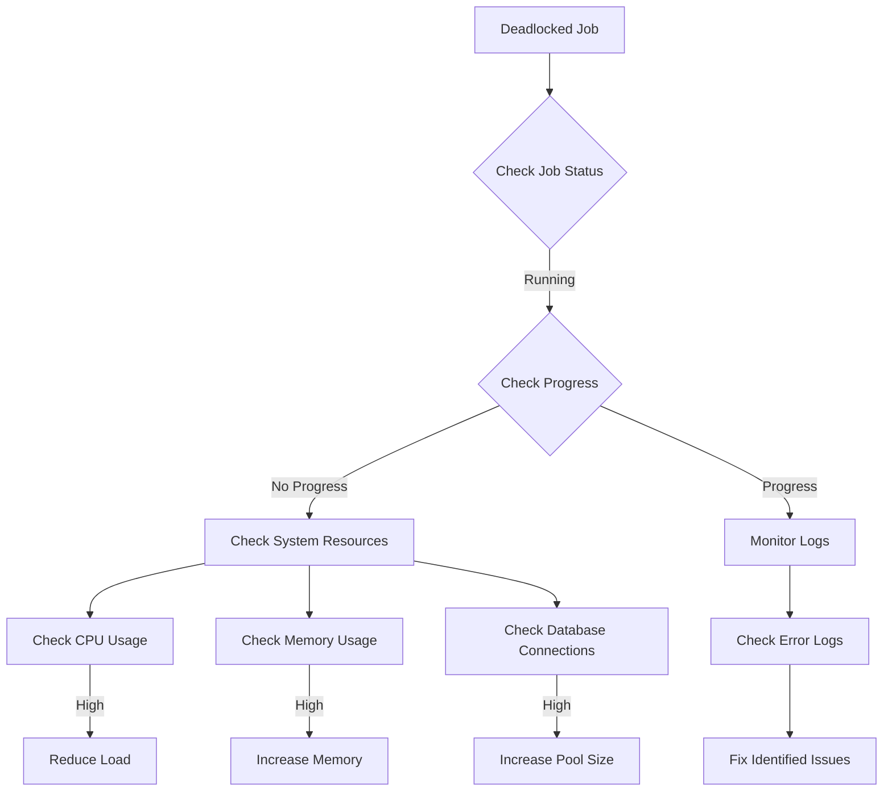
```mermaid
flowchart TD
Problem[Deadlocked Job] --> CheckStatus{Check Job Status}
CheckStatus --> |Running| CheckProgress{Check Progress}
CheckProgress --> |No Progress| CheckResources[Check System Resources]
CheckProgress --> |Progress| MonitorLogs[Monitor Logs]
CheckResources --> CheckCPU[Check CPU Usage]
CheckResources --> CheckMemory[Check Memory Usage]
CheckResources --> CheckConnections[Check Database Connections]
CheckCPU --> |High| ReduceLoad[Reduce Load]
CheckMemory --> |High| IncreaseMemory[Increase Memory]
CheckConnections --> |High| IncreasePool[Increase Pool Size]
MonitorLogs --> CheckErrors[Check Error Logs]
CheckErrors --> FixIssues[Fix Identified Issues]
```

**Resolution Steps:**
1. Check job status in database
2. Review system resource utilization
3. Examine error logs for exceptions
4. Verify database connection health
5. Restart scheduler if necessary

#### Unresponsive Jobs

**Symptoms:**
- Jobs appear stuck but haven't failed
- No error messages in logs
- System performance degradation

**Diagnostic Approach:**
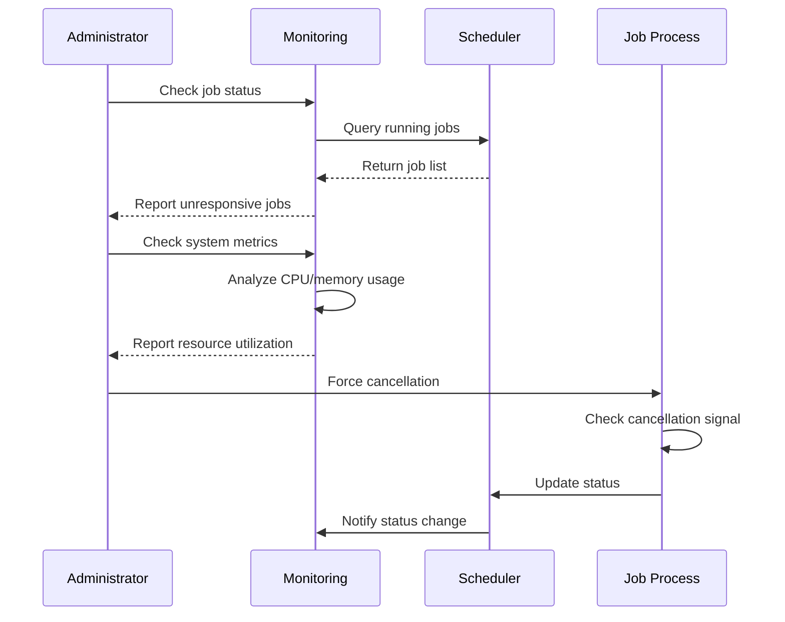
```mermaid
sequenceDiagram
participant Admin as Administrator
participant Monitor as Monitoring
participant Scheduler as Scheduler
participant Job as Job Process
Admin->>Monitor : Check job status
Monitor->>Scheduler : Query running jobs
Scheduler-->>Monitor : Return job list
Monitor-->>Admin : Report unresponsive jobs
Admin->>Monitor : Check system metrics
Monitor->>Monitor : Analyze CPU/memory usage
Monitor-->>Admin : Report resource utilization
Admin->>Job : Force cancellation
Job->>Job : Check cancellation signal
Job->>Scheduler : Update status
Scheduler->>Monitor : Notify status change
```

#### Worker Exhaustion

**Symptoms:**
- New jobs fail to start
- Queue backlog grows rapidly
- System becomes unresponsive

**Prevention and Resolution:**
1. Monitor background task count
2. Implement graceful degradation
3. Increase worker pool size if needed
4. Implement job prioritization
5. Use circuit breaker patterns

### Debugging Tools and Techniques

#### Logging Configuration

Letta provides comprehensive logging for debugging asynchronous operations:

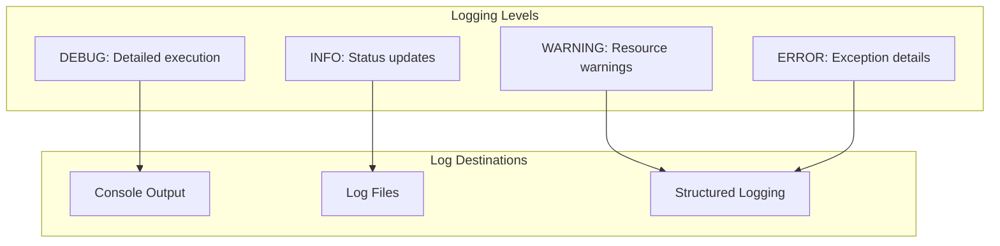
```mermaid
graph TB
subgraph "Logging Levels"
DEBUG[DEBUG: Detailed execution]
INFO[INFO: Status updates]
WARNING[WARNING: Resource warnings]
ERROR[ERROR: Exception details]
end
subgraph "Log Destinations"
Console[Console Output]
File[Log Files]
Structured[Structured Logging]
end
DEBUG --> Console
INFO --> File
WARNING --> Structured
ERROR --> Structured
```

#### Performance Monitoring

Key metrics to monitor for asynchronous execution health:

| Metric | Threshold | Action |
|--------|-----------|---------|
| Active Background Tasks | > 100 | Investigate task accumulation |
| Database Connection Usage | > 80% | Increase pool size |
| CPU Utilization | > 90% | Reduce load |
| Memory Usage | > 85% | Increase memory allocation |
| Job Queue Length | > 1000 | Implement backpressure |

**Section sources**
- [utils.py](file://letta/utils.py#L1270-L1310)
- [scheduler.py](file://letta/jobs/scheduler.py#L25-L106)

## Best Practices

### Design Principles

1. **Separation of Concerns**: Keep synchronous and asynchronous code separate
2. **Resource Management**: Always clean up resources and prevent leaks
3. **Error Handling**: Implement comprehensive error handling and recovery
4. **Monitoring**: Track all asynchronous operations for debugging and optimization
5. **Testing**: Test both happy path and failure scenarios

### Implementation Guidelines

#### Creating Background Jobs

```python
# Recommended pattern for background jobs
async def create_background_job():
    # 1. Create job with initial status
    job = await job_manager.create_job_async(pydantic_job, actor)
    
    # 2. Use appropriate execution pattern
    if is_cpu_intensive:
        await execute_in_worker_thread(coroutine)
    else:
        await execute_async(coroutine)
    
    return job.id
```

#### Error Handling Patterns

```python
# Robust error handling for async operations
async def safe_async_operation():
    try:
        result = await risky_operation()
        return result
    except Exception as e:
        logger.error(f"Operation failed: {e}")
        # Update job status to failed
        await job_manager.safe_update_job_status_async(
            job_id, JobStatus.failed, actor, 
            stop_reason=StopReasonType.ERROR, 
            metadata={"error": str(e)}
        )
        raise
```

#### Resource Cleanup

```python
# Proper resource cleanup pattern
async def managed_async_operation():
    task = None
    try:
        task = safe_create_task(async_coroutine, "operation")
        result = await task
        return result
    except Exception as e:
        # Error handling automatically cleans up
        raise
    finally:
        # Additional cleanup if needed
        if task and not task.done():
            task.cancel()
```

### Performance Optimization

1. **Batch Processing**: Group related operations into batches
2. **Connection Pooling**: Reuse database connections efficiently
3. **Caching**: Cache frequently accessed data
4. **Prioritization**: Implement job prioritization for critical operations
5. **Scaling**: Monitor and scale resources based on load

### Security Considerations

1. **Input Validation**: Validate all inputs before processing
2. **Resource Limits**: Enforce limits on resource consumption
3. **Access Control**: Implement proper authorization checks
4. **Audit Logging**: Log all job operations for security auditing
5. **Timeout Protection**: Implement timeouts for all operations