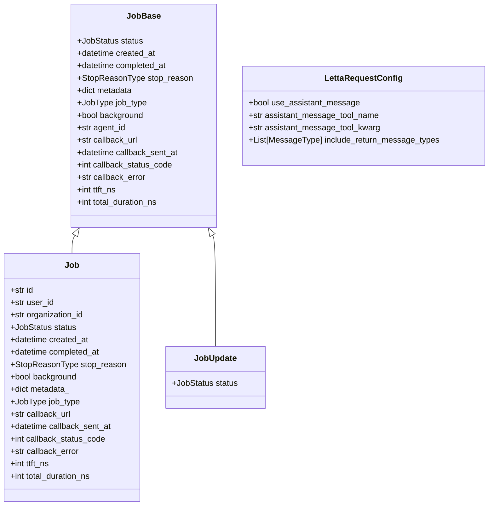
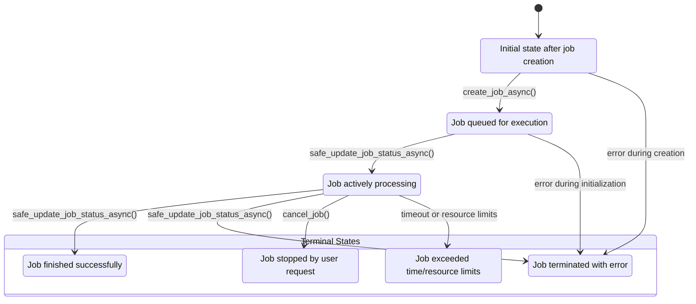
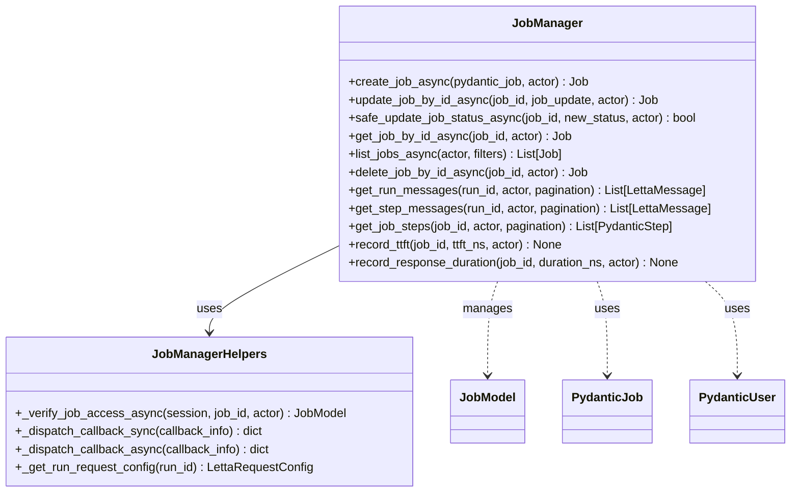
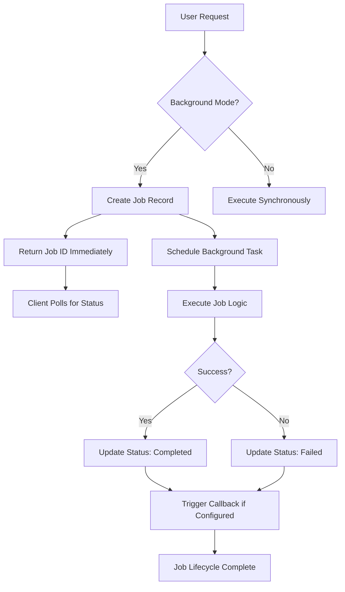
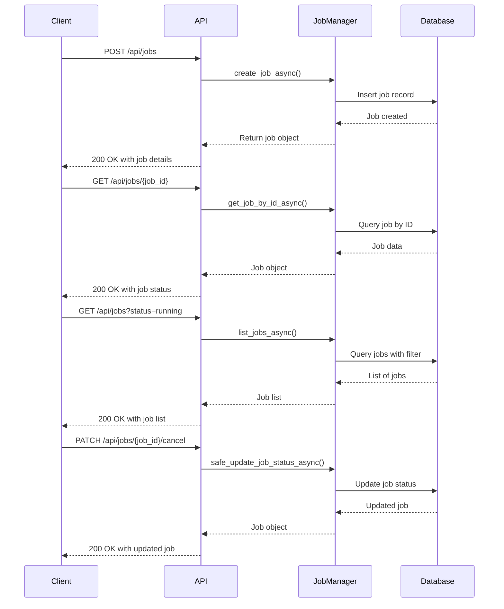
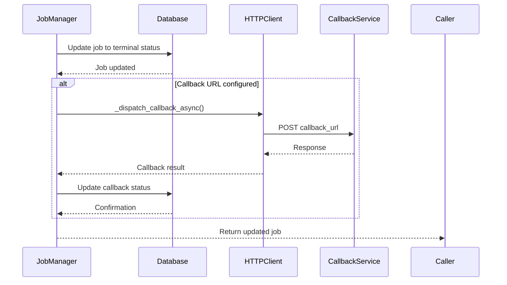
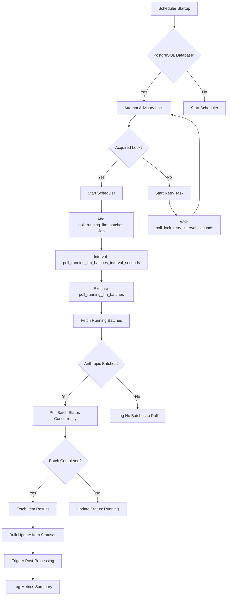

# Background Processing

<cite>
**Referenced Files in This Document**   
- [job_manager.py](file://letta/services/job_manager.py)
- [job.py](file://letta/orm/job.py)
- [job.py](file://letta/schemas/job.py)
- [scheduler.py](file://letta/jobs/scheduler.py)
- [jobs.py](file://letta/server/rest_api/routers/v1/jobs.py)
- [enums.py](file://letta/schemas/enums.py)
- [llm_batch_job_polling.py](file://letta/jobs/llm_batch_job_polling.py)
- [helpers.py](file://letta/jobs/helpers.py)
</cite>

## Table of Contents
1. [Introduction](#introduction)
2. [Job Model and Schema](#job-model-and-schema)
3. [Job Status Lifecycle](#job-status-lifecycle)
4. [JobManager Class Implementation](#jobmanager-class-implementation)
5. [Background Execution Mode](#background-execution-mode)
6. [REST API for Job Management](#rest-api-for-job-management)
7. [Callback Mechanism](#callback-mechanism)
8. [Scheduler and Background Polling](#scheduler-and-background-polling)
9. [Error Handling and Retry Mechanisms](#error-handling-and-retry-mechanisms)
10. [Performance Considerations](#performance-considerations)

## Introduction

Letta's background processing system enables asynchronous job execution for long-running operations such as data processing, model training, and complex tool executions. This architecture allows these operations to run independently of user requests, improving system responsiveness and scalability. The core of this system is the JobManager class, which handles the complete lifecycle of background jobs from creation to completion. Jobs are associated with users and organizations, and their execution status can be monitored through a comprehensive REST API. The system supports both immediate and background execution modes, with configurable callback URLs for notification upon job completion.

## Job Model and Schema

The job model in Letta defines the structure and metadata for background jobs. Each job is associated with a user and organization, and contains status information, timing metrics, and optional callback configuration. The schema supports different job types including standard jobs, runs, and batch jobs.

**Diagram sources**
- [job.py](file://letta/orm/job.py#L18-L66)
- [job.py](file://letta/schemas/job.py#L19-L120)

**Section sources**
- [job.py](file://letta/orm/job.py#L18-L66)
- [job.py](file://letta/schemas/job.py#L19-L120)

## Job Status Lifecycle

Jobs in Letta follow a well-defined state transition pattern from creation to completion. The status transitions ensure that jobs progress through a controlled lifecycle, preventing invalid state changes. The valid transitions are: created → pending → running → completed/failed/cancelled/expired.

**Diagram sources**
- [enums.py](file://letta/schemas/enums.py#L115-L132)
- [job_manager.py](file://letta/services/job_manager.py#L85-L96)

**Section sources**
- [enums.py](file://letta/schemas/enums.py#L115-L132)
- [job_manager.py](file://letta/services/job_manager.py#L85-L96)

## JobManager Class Implementation

The JobManager class is the central component for handling business logic related to jobs. It provides methods for creating, updating, retrieving, and deleting jobs, with proper access control and validation. The class ensures data consistency through database transactions and handles callback dispatching when jobs reach terminal states.

**Diagram sources**
- [job_manager.py](file://letta/services/job_manager.py#L34-L600)

**Section sources**
- [job_manager.py](file://letta/services/job_manager.py#L34-L600)

## Background Execution Mode

The background flag in job creation determines whether a job executes in asynchronous mode. When set to true, the job runs independently of the user request thread, allowing long-running operations without blocking the API response. This mode is essential for operations that may take minutes or hours to complete, such as large data processing tasks or complex model training.

The background execution system uses Python's asyncio framework to manage concurrent job processing. Background tasks are created using safe_create_task utilities that handle exception logging and task lifecycle management. The system maintains a global set of background tasks to prevent memory leaks and ensure proper cleanup.

**Diagram sources**
- [job_manager.py](file://letta/services/job_manager.py#L43-L64)
- [utils.py](file://letta/utils.py#L1132-L1268)

**Section sources**
- [job_manager.py](file://letta/services/job_manager.py#L43-L64)
- [utils.py](file://letta/utils.py#L1132-L1268)

## REST API for Job Management

Letta provides a comprehensive REST API for managing background jobs through the jobs router. The API supports creating, retrieving, listing, updating, and deleting jobs, with pagination and filtering capabilities. Clients can monitor job progress by polling the job status endpoint or by configuring callback URLs for push notifications.

**Diagram sources**
- [jobs.py](file://letta/server/rest_api/routers/v1/jobs.py#L1-L143)
- [job_manager.py](file://letta/services/job_manager.py#L39-L64)

**Section sources**
- [jobs.py](file://letta/server/rest_api/routers/v1/jobs.py#L1-L143)

## Callback Mechanism

The callback mechanism in Letta's background processing system provides a way to notify external services when a job reaches a terminal state. When a job is created with a callback_url, the system automatically sends an HTTP POST request to this URL upon job completion, failure, or cancellation. This enables integration with external workflows and monitoring systems.

The callback payload includes the job ID, final status, completion timestamp, and any associated metadata. The system records the callback attempt in the job record, including the response status code and any error messages. Callbacks are dispatched asynchronously to avoid blocking the job completion process, and failed callbacks do not affect the job's final state.

**Diagram sources**
- [job_manager.py](file://letta/services/job_manager.py#L74-L147)
- [test_job_manager.py](file://tests/managers/test_job_manager.py#L387-L407)

**Section sources**
- [job_manager.py](file://letta/services/job_manager.py#L74-L147)

## Scheduler and Background Polling

The background job scheduler in Letta uses APScheduler to manage periodic tasks, particularly for polling external services about batch job status. The scheduler implements leader election using PostgreSQL advisory locks to ensure only one instance runs the scheduler in distributed deployments. This prevents duplicate polling and maintains consistency across multiple server instances.

The primary scheduled task, poll_running_llm_batches, periodically checks the status of running LLM batch jobs with external providers like Anthropic. It retrieves updated status information, processes completed batches, and triggers post-processing workflows. The scheduler is configurable with settings for polling intervals and lookback periods.

**Diagram sources**
- [scheduler.py](file://letta/jobs/scheduler.py#L1-L229)
- [llm_batch_job_polling.py](file://letta/jobs/llm_batch_job_polling.py#L1-L248)

**Section sources**
- [scheduler.py](file://letta/jobs/scheduler.py#L1-L229)

## Error Handling and Retry Mechanisms

Letta's background processing system implements comprehensive error handling to ensure reliability and resilience. The JobManager class uses safe_update_job_status_async to prevent invalid state transitions, with guards that validate status changes according to the defined lifecycle. When errors occur during job processing, they are logged with full context, and the job status is updated to 'failed' with an appropriate stop reason.

For external service interactions, the system implements retry mechanisms with jitter to prevent thundering herd problems. The background task utilities handle exceptions gracefully, logging errors without crashing the main application. Callback dispatching is designed to be fire-and-forget, where callback failures do not affect the job's final state but are recorded for debugging purposes.

The system also includes resource isolation through the use of separate database sessions for different operations, preventing transaction conflicts and ensuring data consistency. Background tasks are shielded from cancellation when performing critical operations, ensuring that important cleanup steps complete even if the parent operation is cancelled.

**Section sources**
- [job_manager.py](file://letta/services/job_manager.py#L168-L189)
- [utils.py](file://letta/utils.py#L1132-L1268)
- [llm_batch_job_polling.py](file://letta/jobs/llm_batch_job_polling.py#L243-L247)

## Performance Considerations

Managing large numbers of concurrent background jobs requires careful performance optimization. Letta's system is designed with several performance considerations in mind:

1. **Database Optimization**: The job table includes indexes on user_id, created_at, and status fields to support efficient querying. Cursor-based pagination is used for listing jobs to avoid performance degradation with large datasets.

2. **Concurrent Processing**: The system leverages asyncio to handle multiple jobs concurrently, maximizing resource utilization. Batch operations use bulk database updates to minimize round trips.

3. **Memory Management**: Background tasks are tracked in a global set with proper cleanup callbacks to prevent memory leaks. The system limits the number of concurrent batch polling operations through configurable batch_size settings.

4. **Scalability**: The leader election mechanism allows horizontal scaling of server instances while ensuring only one instance runs resource-intensive polling tasks.

5. **Monitoring**: Comprehensive metrics are collected for batch polling operations, including timing, success rates, and item counts, enabling performance analysis and optimization.

6. **Resource Isolation**: Jobs are executed in isolated contexts to prevent resource contention and ensure predictable performance.

These performance considerations enable Letta to efficiently manage thousands of concurrent background jobs while maintaining system stability and responsiveness.

**Section sources**
- [job_manager.py](file://letta/services/job_manager.py#L218-L304)
- [scheduler.py](file://letta/jobs/scheduler.py#L60-L72)
- [llm_batch_job_polling.py](file://letta/jobs/llm_batch_job_polling.py#L189-L192)