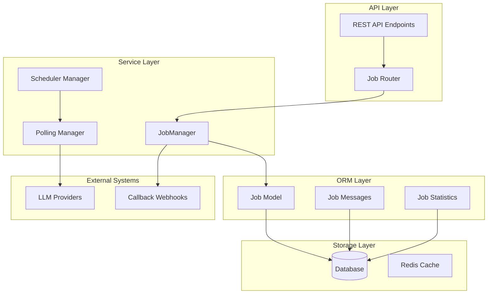
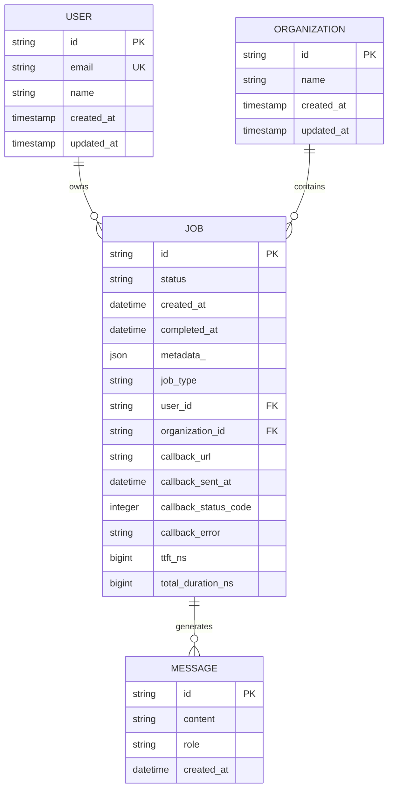
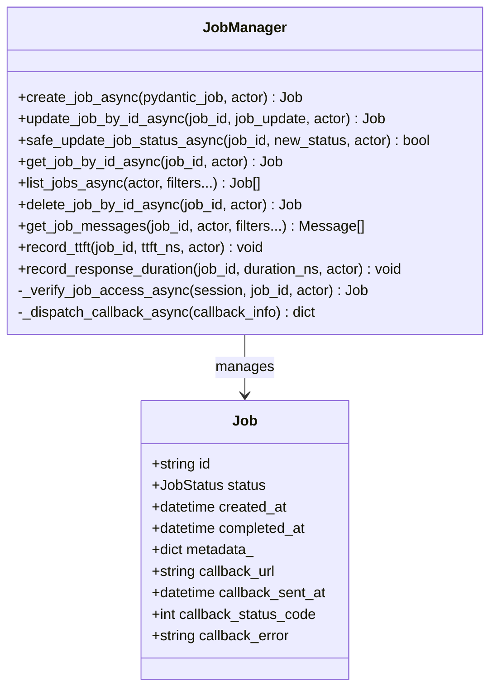
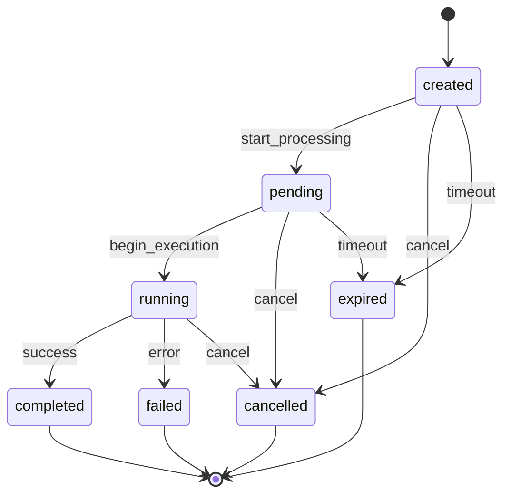
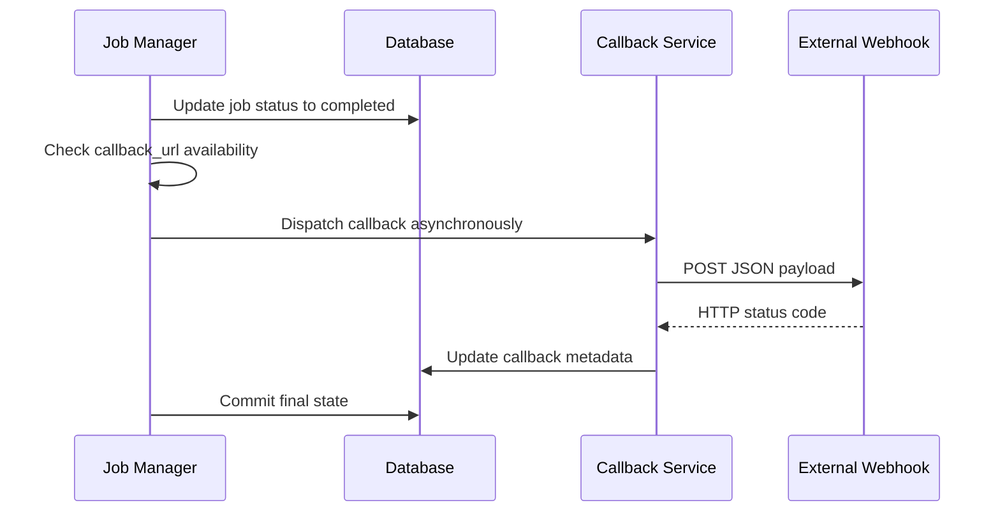
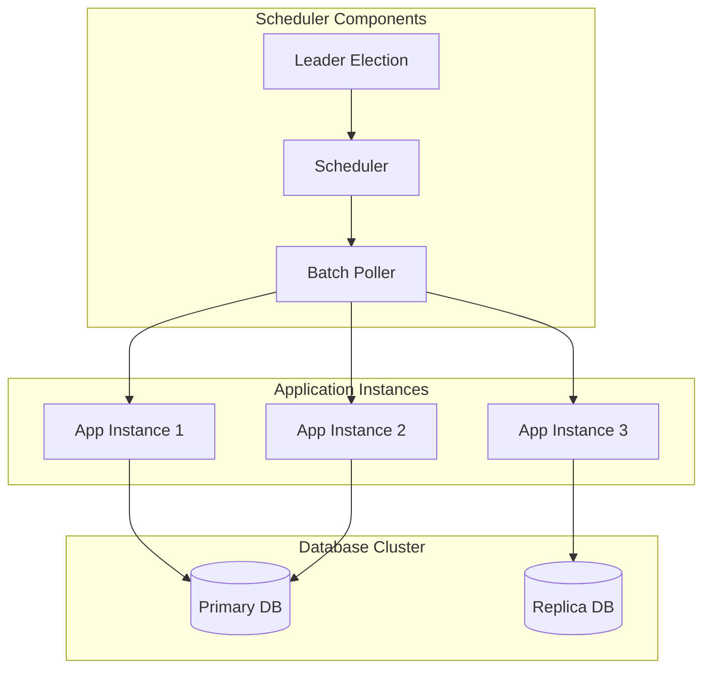

# Job Lifecycle Management

<cite>
**Referenced Files in This Document**
- [job_manager.py](file://letta/services/job_manager.py)
- [job.py](file://letta/orm/job.py)
- [schemas/job.py](file://letta/schemas/job.py)
- [schemas/enums.py](file://letta/schemas/enums.py)
- [scheduler.py](file://letta/jobs/scheduler.py)
- [llm_batch_job_polling.py](file://letta/jobs/llm_batch_job_polling.py)
- [helpers.py](file://letta/jobs/helpers.py)
- [jobs.py](file://letta/server/rest_api/routers/v1/jobs.py)
- [test_job_manager.py](file://tests/managers/test_job_manager.py)
</cite>

## Table of Contents
1. [Introduction](#introduction)
2. [System Architecture](#system-architecture)
3. [Job Model Schema](#job-model-schema)
4. [JobManager Class Implementation](#jobmanager-class-implementation)
5. [State Machine Pattern](#state-machine-pattern)
6. [Job Creation and API Integration](#job-creation-and-api-integration)
7. [Status Updates and Lifecycle Transitions](#status-updates-and-lifecycle-transitions)
8. [Callback System and Webhooks](#callback-system-and-webhooks)
9. [Error Handling and Retry Logic](#error-handling-and-retry-logic)
10. [Scheduler and Background Processing](#scheduler-and-background-processing)
11. [Debugging and Troubleshooting](#debugging-and-troubleshooting)
12. [Best Practices](#best-practices)

## Introduction

Letta's Job Lifecycle Management system provides comprehensive orchestration for background tasks and asynchronous operations. The system manages the complete lifecycle of jobs from creation through completion, including status tracking, callback notifications, error handling, and cleanup operations. This documentation covers the implementation details of the JobManager class, job schema design, state machine patterns, and operational procedures.

The job system supports various types of background operations including data processing, batch operations, agent executions, and file processing tasks. Each job maintains detailed metadata, timing information, and status tracking to enable robust monitoring and debugging capabilities.

## System Architecture

The job lifecycle management system follows a layered architecture with clear separation of concerns:



**Diagram sources**
- [job_manager.py](file://letta/services/job_manager.py#L34-L600)
- [scheduler.py](file://letta/jobs/scheduler.py#L1-L229)
- [llm_batch_job_polling.py](file://letta/jobs/llm_batch_job_polling.py#L1-L248)

**Section sources**
- [job_manager.py](file://letta/services/job_manager.py#L34-L600)
- [scheduler.py](file://letta/jobs/scheduler.py#L1-L229)

## Job Model Schema

The Job model defines the core data structure for background operations with comprehensive field definitions and relationships.

### Core Fields

| Field | Type | Description | Constraints |
|-------|------|-------------|-------------|
| `id` | String | Unique job identifier with 'job-' prefix | Primary Key |
| `status` | JobStatus | Current job execution status | Default: 'created' |
| `created_at` | DateTime | Job creation timestamp | Auto-generated |
| `completed_at` | DateTime | Completion timestamp | Nullable |
| `last_updated_at` | DateTime | Last modification timestamp | Auto-updated |
| `user_id` | String | Associated user identifier | Foreign Key |
| `organization_id` | String | Associated organization identifier | Foreign Key |
| `metadata_` | JSON | Job-specific metadata storage | Nullable |

### Status and Type Fields

| Field | Type | Description | Default Value |
|-------|------|-------------|---------------|
| `job_type` | JobType | Job classification (JOB/BATCH) | 'job' |
| `background` | Boolean | Background execution flag | False |
| `stop_reason` | StopReasonType | Reason for job termination | Nullable |

### Callback and Monitoring Fields

| Field | Type | Description | Purpose |
|-------|------|-------------|---------|
| `callback_url` | String | Webhook endpoint URL | Notification delivery |
| `callback_sent_at` | DateTime | Last callback attempt timestamp | Retry tracking |
| `callback_status_code` | Integer | HTTP status from callback | Success/failure tracking |
| `callback_error` | String | Error message from callback | Debug information |

### Performance Metrics

| Field | Type | Description | Precision |
|-------|------|-------------|-----------|
| `ttft_ns` | BigInteger | Time to first token (nanoseconds) | Nanosecond precision |
| `total_duration_ns` | BigInteger | Total execution duration (nanoseconds) | Nanosecond precision |

### Relationship Model



**Diagram sources**
- [job.py](file://letta/orm/job.py#L19-L66)
- [schemas/job.py](file://letta/schemas/job.py#L19-L120)

**Section sources**
- [job.py](file://letta/orm/job.py#L19-L66)
- [schemas/job.py](file://letta/schemas/job.py#L19-L120)

## JobManager Class Implementation

The JobManager class serves as the central orchestrator for job lifecycle operations, providing comprehensive CRUD functionality with safety guards and business logic enforcement.

### Core Methods Overview



**Diagram sources**
- [job_manager.py](file://letta/services/job_manager.py#L34-L600)

### Job Creation Method

The `create_job_async` method handles job instantiation with comprehensive validation and association logic:

**Key Features:**
- User association and organization assignment
- Agent existence validation for run-type jobs
- Metadata preservation and field mapping
- Atomic database operations with rollback support

**Implementation Details:**
- Validates agent existence before job creation
- Associates jobs with user and organization contexts
- Handles agent_id field removal for ORM compatibility
- Provides atomic transaction boundaries

### Status Update Method

The `update_job_by_id_async` method implements sophisticated status transition logic with safety guards:

**Safety Mechanisms:**
- State transition validation using the state machine pattern
- Terminal state protection against invalid reversions
- Callback notification coordination
- Timestamp management and timezone handling

**Transaction Flow:**
1. Access verification and job retrieval
2. Safe update validation with transition guards
3. Callback preparation for terminal states
4. Database persistence with conflict resolution
5. Asynchronous callback dispatch

**Section sources**
- [job_manager.py](file://letta/services/job_manager.py#L34-L600)

## State Machine Pattern

The job system implements a strict state machine pattern to ensure predictable and controlled lifecycle progression.

### Valid State Transitions



**Diagram sources**
- [schemas/enums.py](file://letta/schemas/enums.py#L115-L132)

### Transition Validation Logic

The system enforces strict transition rules through the `safe_update_job_status_async` method:

**Transition Guards:**
- Terminal states cannot be reverted to non-terminal states
- Created state can only transition to pending or cancelled
- Pending state can only transition to running or cancelled
- Running state can transition to any terminal state

**Validation Implementation:**
```python
# Example validation logic from the codebase
if not any(
    (
        job_update.status.is_terminal and not current_status.is_terminal,
        current_status == JobStatus.created and job_update.status != JobStatus.created,
        current_status == JobStatus.pending and job_update.status == JobStatus.running,
    )
):
    raise ValueError(f"Invalid job status transition from {current_status} to {job_update.status}")
```

### Status Properties

The JobStatus enum provides utility properties for state evaluation:

**Terminal State Detection:**
- `is_terminal`: Returns True for completed, failed, cancelled, or expired states
- Enables automatic completion timestamp setting
- Facilitates cleanup and notification logic

**Section sources**
- [job_manager.py](file://letta/services/job_manager.py#L85-L182)
- [schemas/enums.py](file://letta/schemas/enums.py#L115-L132)

## Job Creation and API Integration

The job creation system supports both programmatic and API-driven job instantiation with flexible metadata attachment and callback configuration.

### Programmatic Job Creation

**Basic Job Creation:**
```python
# Example job creation pattern
job_data = PydanticJob(
    status=JobStatus.created,
    metadata={"type": "file_processing", "source_id": "source-123"},
    callback_url="https://webhook.example.com/jobs"
)
created_job = await server.job_manager.create_job_async(pydantic_job=job_data, actor=user)
```

**Advanced Job Configuration:**
- Metadata dictionary for custom job attributes
- Callback URL for webhook notifications
- Agent association for run-type jobs
- Request configuration for specialized processing

### API Endpoint Integration

The REST API provides comprehensive job management endpoints:

**Endpoint Specifications:**

| Endpoint | Method | Purpose | Parameters |
|----------|--------|---------|------------|
| `/jobs` | GET | List jobs with filtering | `source_id`, `before`, `after`, `limit`, `order` |
| `/jobs/{job_id}` | GET | Retrieve job details | `job_id` (path parameter) |
| `/jobs/{job_id}/cancel` | PATCH | Cancel running job | `job_id` (path parameter) |
| `/jobs/{job_id}` | DELETE | Delete job permanently | `job_id` (path parameter) |

**Pagination and Filtering:**
- Cursor-based pagination using `before` and `after` parameters
- Status-based filtering with `active` parameter
- Metadata-based filtering with `source_id` parameter
- Sort order control with `order` and `ascending` parameters

### Metadata and Callback Attachment

**Metadata Structure:**
- Flexible JSON-compatible dictionary storage
- Source identification and processing context
- Custom attributes for job-specific requirements
- Nested structure support for complex configurations

**Callback Configuration:**
- HTTP POST webhook delivery
- Automatic payload construction with job details
- Retry logic with exponential backoff
- Error tracking and notification

**Section sources**
- [jobs.py](file://letta/server/rest_api/routers/v1/jobs.py#L1-L143)
- [test_job_manager.py](file://tests/managers/test_job_manager.py#L109-L200)

## Status Updates and Lifecycle Transitions

The status update system provides robust mechanisms for job state management with comprehensive error handling and notification capabilities.

### Safe Status Updates

The `safe_update_job_status_async` method implements controlled status transitions:

**Update Process:**
1. Status validation against state machine rules
2. Metadata merging for incremental updates
3. Terminal state detection and timestamp setting
4. Database persistence with conflict resolution
5. Success/failure reporting

**Metadata Management:**
- Incremental metadata updates preserving existing data
- Automatic metadata merging for complex job states
- Preservation of original metadata during updates

### Terminal State Handling

**Completion Processing:**
- Automatic `completed_at` timestamp setting
- Terminal state validation and protection
- Resource cleanup coordination
- Notification delivery preparation

**Failure Recovery:**
- Error state isolation and containment
- Partial progress preservation
- Retry mechanism coordination
- Debug information capture

### Lifecycle Event Coordination

**Event Triggers:**
- Status change notifications
- Callback webhook dispatch
- Related resource updates
- Monitoring system alerts

**Coordination Mechanisms:**
- Atomic transaction boundaries
- Event ordering guarantees
- Failure rollback capabilities
- Idempotent operation support

**Section sources**
- [job_manager.py](file://letta/services/job_manager.py#L153-L189)

## Callback System and Webhooks

The callback system enables external notification delivery for job completion events with robust error handling and retry logic.

### Callback Architecture



**Diagram sources**
- [job_manager.py](file://letta/services/job_manager.py#L483-L537)

### Callback Payload Structure

**Standard Callback Format:**
```json
{
    "job_id": "job-12345",
    "status": "completed",
    "completed_at": "2024-01-15T10:30:00Z",
    "metadata": {
        "source_id": "source-67890",
        "processing_time": 1250,
        "result_count": 42
    }
}
```

### Asynchronous Delivery

**Delivery Mechanism:**
- Non-blocking callback dispatch
- Separate transaction boundary
- Automatic retry with exponential backoff
- Error isolation and logging

**Timeout Configuration:**
- 5-second timeout for callback delivery
- Non-blocking nature prevents job blocking
- Immediate success/failure reporting

### Error Handling and Logging

**Error Scenarios:**
- Network connectivity issues
- HTTP timeout errors
- Invalid webhook endpoints
- Authentication failures

**Logging Strategy:**
- Comprehensive error capture and storage
- Debug information preservation
- Retry attempt tracking
- Performance metrics collection

**Section sources**
- [job_manager.py](file://letta/services/job_manager.py#L483-L537)

## Error Handling and Retry Logic

The job system implements comprehensive error handling with graceful degradation and recovery mechanisms.

### Exception Capture and Propagation

**Error Categories:**
- Database connectivity issues
- Network communication failures
- Invalid job state transitions
- Resource exhaustion scenarios

**Error Classification:**
- Recoverable errors with automatic retry
- Transient errors requiring exponential backoff
- Permanent errors with failure reporting
- System-level errors with circuit breaker protection

### Retry Logic Implementation

**Retry Strategy:**
- Exponential backoff with jitter
- Maximum retry limits
- Circuit breaker pattern
- Graceful degradation

**Retry Configuration:**
- Initial delay: 1 second
- Maximum delay: 30 seconds
- Maximum retries: 5 attempts
- Jitter factor: ±25%

### Error Recovery Patterns

**Graceful Degradation:**
- Fallback to cached results
- Reduced functionality modes
- Alternative processing paths
- User notification systems

**Recovery Mechanisms:**
- Automatic job resumption
- State checkpoint restoration
- Resource cleanup and recycling
- Health monitoring and alerting

### Monitoring and Alerting

**Error Tracking:**
- Structured error logging
- Performance metrics collection
- Alert threshold configuration
- Incident response automation

**Debug Information:**
- Stack trace preservation
- Context information capture
- Timing data collection
- Resource utilization monitoring

**Section sources**
- [job_manager.py](file://letta/services/job_manager.py#L483-L537)
- [llm_batch_job_polling.py](file://letta/jobs/llm_batch_job_polling.py#L1-L248)

## Scheduler and Background Processing

The scheduler system coordinates background job processing with distributed coordination and leader election capabilities.

### Distributed Leadership



**Diagram sources**
- [scheduler.py](file://letta/jobs/scheduler.py#L1-L229)

### Leader Election System

**PostgreSQL Advisory Locks:**
- Exclusive lock acquisition for leadership
- Automatic lock release on failure
- Background retry mechanism
- Cross-instance coordination

**SQLite Compatibility:**
- Fallback to single-instance operation
- Warning logs for unsupported configurations
- Graceful degradation of distributed features

### Batch Job Polling

**Polling Strategy:**
- Configurable interval scheduling
- Concurrent processing of multiple jobs
- Intelligent backoff for failed requests
- Metrics collection and reporting

**Processing Pipeline:**
1. Job discovery and filtering
2. Provider-specific status retrieval
3. Status comparison and updates
4. Item-level result processing
5. Post-processing coordination

### Background Task Coordination

**Task Types:**
- Periodic status polling
- Completion result processing
- Cleanup and maintenance
- Monitoring and alerting

**Coordination Mechanisms:**
- APScheduler integration
- Database advisory locks
- Graceful shutdown handling
- Resource cleanup coordination

**Section sources**
- [scheduler.py](file://letta/jobs/scheduler.py#L1-L229)
- [llm_batch_job_polling.py](file://letta/jobs/llm_batch_job_polling.py#L1-L248)

## Debugging and Troubleshooting

This section provides comprehensive guidance for diagnosing and resolving job lifecycle issues.

### Common Failure Patterns

**Stuck Jobs:**
- Symptoms: Jobs remain in running state indefinitely
- Diagnosis: Check scheduler logs and database status
- Resolution: Manual cancellation or system restart

**Callback Failures:**
- Symptoms: Jobs complete but callbacks never received
- Diagnosis: Review callback error logs and network connectivity
- Resolution: Retry configuration adjustment

**State Transition Errors:**
- Symptoms: Invalid status transitions rejected
- Diagnosis: Verify job state consistency
- Resolution: Reset to valid intermediate state

### Diagnostic Tools

**Database Queries:**
```sql
-- Find stuck running jobs
SELECT id, status, created_at, completed_at 
FROM jobs 
WHERE status = 'running' AND created_at < NOW() - INTERVAL '1 hour';

-- Check callback delivery history
SELECT id, callback_url, callback_status_code, callback_error 
FROM jobs 
WHERE callback_url IS NOT NULL;
```

**Log Analysis:**
- Job creation timestamps and user context
- Status transition audit trails
- Callback delivery success/failure rates
- Error message correlation

### Performance Monitoring

**Key Metrics:**
- Job completion rate
- Average processing time
- Callback delivery latency
- Error rate by category

**Monitoring Dashboard:**
- Real-time job status visualization
- Historical trend analysis
- Alert threshold configuration
- Capacity planning indicators

### Troubleshooting Procedures

**Step-by-Step Diagnosis:**
1. Verify job existence and ownership
2. Check status transition validity
3. Review callback configuration
4. Analyze error logs and stack traces
5. Validate external dependencies

**Resolution Strategies:**
- Manual intervention for stuck jobs
- Configuration adjustments for recurring issues
- System scaling for capacity problems
- Process restart for service interruptions

**Section sources**
- [job_manager.py](file://letta/services/job_manager.py#L85-L182)
- [llm_batch_job_polling.py](file://letta/jobs/llm_batch_job_polling.py#L20-L40)

## Best Practices

### Job Design Guidelines

**Resource Management:**
- Define clear job boundaries and responsibilities
- Implement proper resource cleanup and disposal
- Monitor memory and CPU utilization
- Set appropriate timeout values

**Error Handling:**
- Implement comprehensive exception handling
- Provide meaningful error messages and context
- Design for graceful degradation
- Enable automatic retry with backoff

**Performance Optimization:**
- Minimize database round trips
- Implement efficient pagination for large datasets
- Use connection pooling and caching
- Optimize query performance and indexing

### Operational Excellence

**Monitoring and Observability:**
- Implement comprehensive logging and metrics
- Set up alerting for critical job failures
- Monitor system health and resource utilization
- Track job success rates and performance trends

**Security Considerations:**
- Validate job metadata and parameters
- Implement proper access controls and authentication
- Secure callback endpoints and webhook delivery
- Audit job creation and modification activities

**Scalability Planning:**
- Design for horizontal scaling and load distribution
- Implement queue-based processing for high-volume jobs
- Configure appropriate resource limits and quotas
- Plan for peak load scenarios and capacity expansion

### Development Guidelines

**Code Quality:**
- Follow established coding standards and conventions
- Implement comprehensive unit and integration testing
- Use type hints and documentation for clarity
- Maintain backward compatibility for APIs

**Testing Strategies:**
- Test job lifecycle transitions and state machines
- Validate error handling and recovery mechanisms
- Simulate network failures and system interruptions
- Perform load testing and performance benchmarking