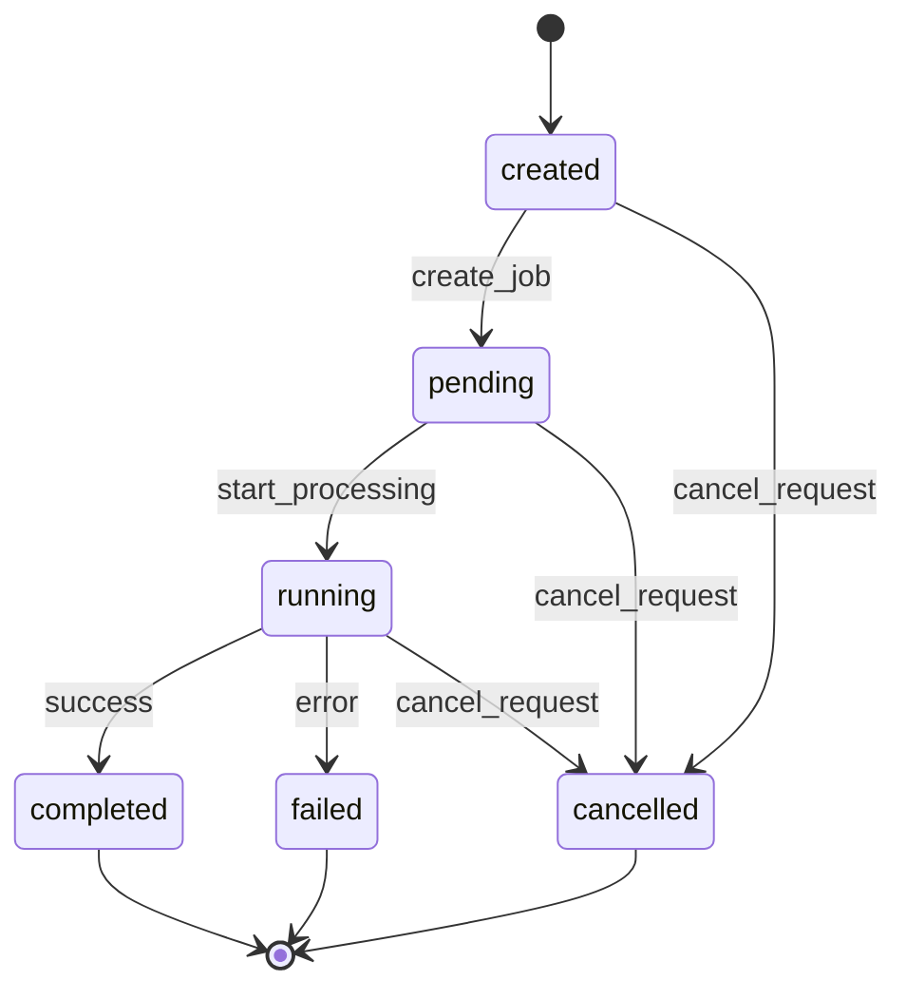
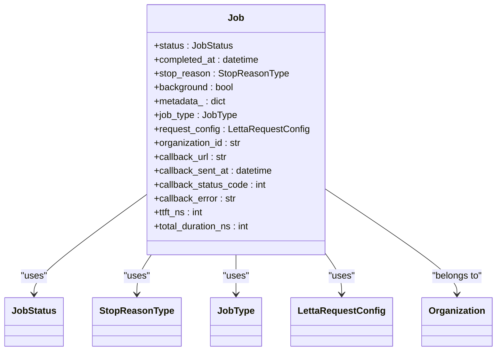
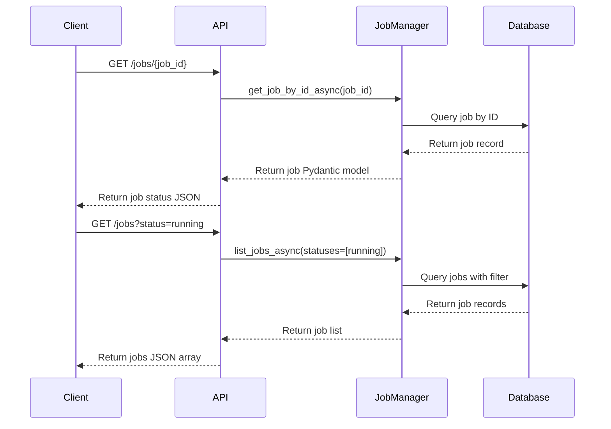
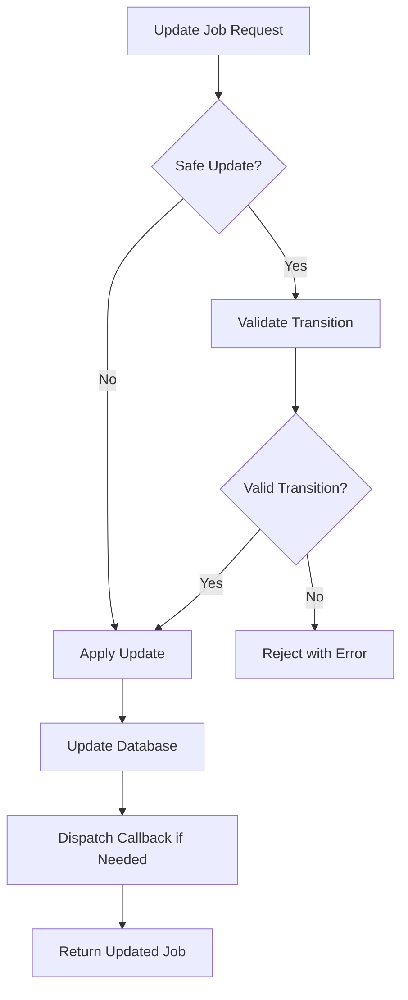
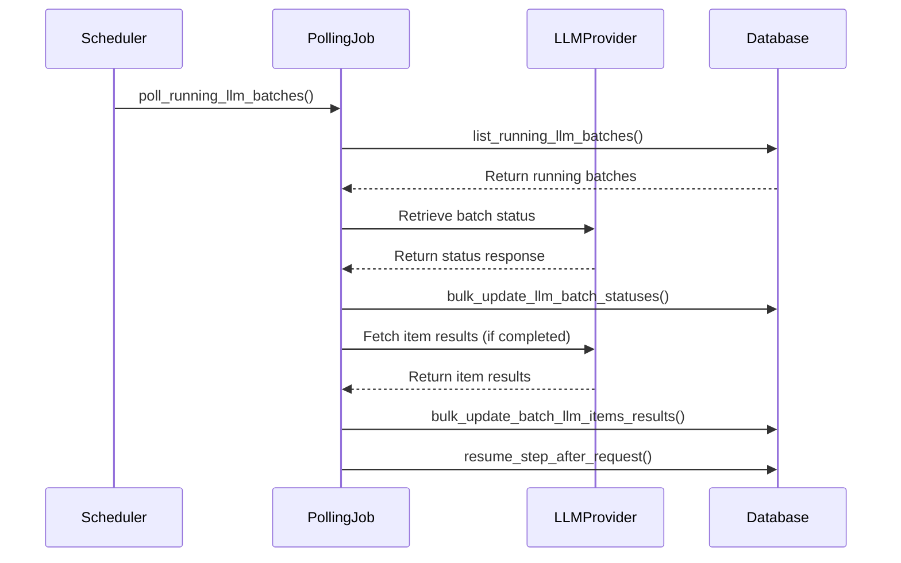
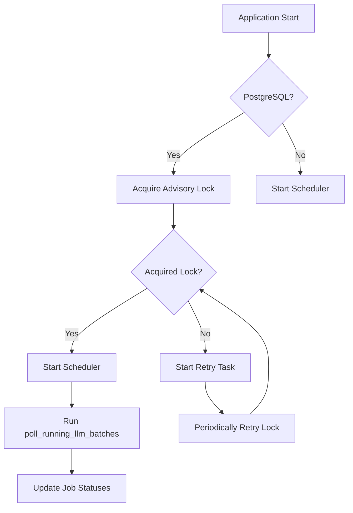

# Job Status Tracking

<cite>
**Referenced Files in This Document**   
- [job.py](file://letta/orm/job.py)
- [job_manager.py](file://letta/services/job_manager.py)
- [jobs.py](file://letta/server/rest_api/routers/v1/jobs.py)
- [helpers.py](file://letta/jobs/helpers.py)
- [enums.py](file://letta/schemas/enums.py)
- [job.py](file://letta/schemas/job.py)
- [scheduler.py](file://letta/jobs/scheduler.py)
- [llm_batch_job_polling.py](file://letta/jobs/llm_batch_job_polling.py)
</cite>

## Table of Contents
1. [Introduction](#introduction)
2. [Job Status Lifecycle](#job-status-lifecycle)
3. [Job Model Structure](#job-model-structure)
4. [REST API Endpoints](#rest-api-endpoints)
5. [Status Transition Validation](#status-transition-validation)
6. [Callback Mechanism](#callback-mechanism)
7. [Batch Job Status Tracking](#batch-job-status-tracking)
8. [Scheduler and Background Processing](#scheduler-and-background-processing)
9. [Best Practices](#best-practices)
10. [Troubleshooting](#troubleshooting)

## Introduction

Job status tracking in Letta provides a comprehensive system for monitoring the progress of background jobs, particularly those involving data processing, agent execution, and batch operations. The system is designed to provide granular visibility into job progression through well-defined status states and additional metadata fields that track progress metrics. This documentation explains how the Job model's status field tracks progression through states from creation to completion or failure, and how the REST API enables clients to monitor job status effectively.

The job tracking system is central to Letta's architecture, enabling asynchronous processing of long-running operations while providing clients with real-time updates on job progress. This is particularly important for operations like data source processing, agent execution loops, and batch API calls to LLM providers.

**Section sources**
- [job.py](file://letta/orm/job.py#L1-L66)
- [enums.py](file://letta/schemas/enums.py#L115-L132)

## Job Status Lifecycle

The JobStatus enum defines the progression states that a job can traverse during its lifecycle. Jobs follow a state machine pattern with defined transitions between states, ensuring consistency and preventing invalid state changes.



**Diagram sources**
- [enums.py](file://letta/schemas/enums.py#L115-L132)
- [job_manager.py](file://letta/services/job_manager.py#L85-L97)

The job status lifecycle begins with the `created` state when a job is first instantiated. It then progresses to `pending` when the job is queued for processing, followed by `running` when active processing begins. From the running state, the job can transition to one of three terminal states: `completed` for successful execution, `failed` for execution errors, or `cancelled` when explicitly terminated.

The JobStatus class includes an `is_terminal` property that identifies terminal states (completed, failed, cancelled, expired), which is used by the system to determine if a job can be further updated or if it has reached its final state.

**Section sources**
- [enums.py](file://letta/schemas/enums.py#L115-L132)
- [job_manager.py](file://letta/services/job_manager.py#L85-L97)

## Job Model Structure

The Job model in Letta's ORM contains several fields that provide detailed information about job execution and progress. Beyond the core status field, the model includes additional fields that offer granular visibility into job progression.



**Diagram sources**
- [job.py](file://letta/orm/job.py#L1-L66)
- [job.py](file://letta/schemas/job.py#L1-L120)

The Job model includes several key fields for tracking job progress:

- **status**: The current status of the job, following the state progression defined in JobStatus
- **completed_at**: Timestamp when the job was completed (set automatically when transitioning to terminal states)
- **stop_reason**: The reason why the job was stopped, providing additional context for terminal states
- **metadata_**: A JSON field for storing arbitrary metadata about the job execution
- **ttft_ns** and **total_duration_ns**: Timing metrics in nanoseconds for performance monitoring
- **callback_url** and related fields: For asynchronous notification when jobs complete

The model also includes the `request_config` field which stores configuration for the job request, allowing for consistent processing parameters across job execution.

**Section sources**
- [job.py](file://letta/orm/job.py#L1-L66)
- [job.py](file://letta/schemas/job.py#L1-L120)

## REST API Endpoints

Letta provides REST API endpoints for retrieving job status and listing jobs with filtering capabilities. These endpoints are implemented in the jobs.py router and provide programmatic access to job tracking information.



**Diagram sources**
- [jobs.py](file://letta/server/rest_api/routers/v1/jobs.py#L1-L143)
- [job_manager.py](file://letta/services/job_manager.py#L194-L200)

The primary endpoints for job status tracking are:

- **GET /jobs/{job_id}**: Retrieves the status of a specific job by its ID. This endpoint returns the complete job object with all status and metadata fields.
- **GET /jobs**: Lists jobs with optional filtering by status, organization, and other criteria. Supports pagination via before/after cursors and limit parameters.
- **GET /jobs/active**: Deprecated endpoint that lists only active jobs (created or running states).
- **PATCH /jobs/{job_id}/cancel**: Cancels a job by updating its status to cancelled.

The list_jobs endpoint supports filtering by job status, allowing clients to retrieve jobs in specific states. For example, a client can retrieve all running jobs by setting the active parameter to true or by filtering with specific status values.

**Section sources**
- [jobs.py](file://letta/server/rest_api/routers/v1/jobs.py#L1-L143)

## Status Transition Validation

The JobManager class implements strict validation for job status transitions to ensure data consistency and prevent invalid state changes. This validation is performed in the update_job_by_id_async method, which includes state transition guards that enforce the proper progression of job states.



**Diagram sources**
- [job_manager.py](file://letta/services/job_manager.py#L85-L97)
- [job_manager.py](file://letta/services/job_manager.py#L98-L103)

The safe_update_job_status_async method enforces the following state transition rules:
- Jobs can only transition from created to pending or cancelled
- Jobs can only transition from pending to running or cancelled
- Jobs can transition from running to completed, failed, or cancelled
- Once in a terminal state (completed, failed, cancelled, expired), jobs cannot change state

These rules are implemented in the safe_update parameter of the update_job_by_id_async method, which performs validation before allowing status changes. The validation checks ensure that only valid transitions are permitted, raising a ValueError if an invalid transition is attempted.

The system also automatically sets the completed_at timestamp when a job transitions to a terminal state, ensuring consistent recording of completion times.

**Section sources**
- [job_manager.py](file://letta/services/job_manager.py#L85-L189)

## Callback Mechanism

Letta's job system includes a callback mechanism that allows external systems to be notified when jobs complete. This asynchronous notification system is implemented through the callback_url field in the Job model and the associated callback dispatch functionality in the JobManager.

When a job transitions to a terminal state (completed or failed) and has a callback_url set, the system automatically dispatches an HTTP POST request to the specified URL. The payload includes key information about the job:

```json
{
  "job_id": "job-123",
  "status": "completed",
  "completed_at": "2025-01-15T10:30:00Z",
  "metadata": {
    "source_id": "source-456",
    "agent_id": "agent-789"
  }
}
```

The callback system is implemented asynchronously to avoid blocking job completion. After updating the job status in the database, the system dispatches the callback in a separate transaction. The JobManager records the result of the callback attempt, including the HTTP status code and any error messages, in the callback_status_code and callback_error fields of the job record.

This mechanism allows client applications to implement event-driven architectures where they can perform additional processing when jobs complete without needing to poll the API continuously.

**Section sources**
- [job_manager.py](file://letta/services/job_manager.py#L98-L147)
- [job.py](file://letta/orm/job.py#L45-L51)

## Batch Job Status Tracking

For batch operations, particularly those involving LLM API batch jobs, Letta provides specialized status tracking through the llm_batch_job_polling module. This system periodically polls external providers (currently Anthropic) for updates on batch job status and synchronizes this information with the internal job tracking system.



**Diagram sources**
- [llm_batch_job_polling.py](file://letta/jobs/llm_batch_job_polling.py#L1-L248)
- [scheduler.py](file://letta/jobs/scheduler.py#L1-L229)

The batch job polling system works as follows:
1. The poll_running_llm_batches function is scheduled to run at regular intervals
2. It retrieves all currently running LLM batch jobs from the database
3. For each batch job, it queries the external provider (e.g., Anthropic) for the current status
4. It updates the internal job status based on the provider's response
5. For completed batches, it fetches individual item results and updates the corresponding records
6. It triggers post-processing for completed batches

The helpers.py module contains functions that map external provider status values to Letta's internal JobStatus enum, ensuring consistent status tracking across different provider APIs.

**Section sources**
- [llm_batch_job_polling.py](file://letta/jobs/llm_batch_job_polling.py#L1-L248)
- [helpers.py](file://letta/jobs/helpers.py#L1-L26)

## Scheduler and Background Processing

The job status tracking system relies on a scheduler to handle periodic tasks such as polling external APIs for batch job updates. The scheduler is implemented using APScheduler and includes leader election logic to ensure that only one instance runs the scheduled tasks in distributed deployments.



**Diagram sources**
- [scheduler.py](file://letta/jobs/scheduler.py#L1-L229)
- [llm_batch_job_polling.py](file://letta/jobs/llm_batch_job_polling.py#L170-L248)

The scheduler system uses PostgreSQL advisory locks to implement leader election. When multiple instances of Letta are running, only the instance that successfully acquires the advisory lock will run the scheduled tasks. Other instances will periodically attempt to acquire the lock in case the leader fails.

The primary scheduled task is poll_running_llm_batches, which runs at intervals defined by the poll_running_llm_batches_interval_seconds setting. This task is responsible for updating the status of running LLM batch jobs by polling external providers and synchronizing the results with the internal database.

During shutdown, the scheduler properly releases the advisory lock and shuts down the scheduled tasks to ensure clean termination.

**Section sources**
- [scheduler.py](file://letta/jobs/scheduler.py#L1-L229)

## Best Practices

When implementing job status tracking in Letta, consider the following best practices:

### Setting Meaningful Progress Indicators
For custom job types, include relevant metadata in the job's metadata_ field to provide context about the job's purpose and progress. For example, when processing a data source, include the source_id and file information:

```python
job_update = JobUpdate(
    status=JobStatus.running,
    metadata={
        "source_id": source_id,
        "file_name": file_name,
        "total_files": total_files,
        "processed_files": processed_files
    }
)
```

### Handling Real-time Updates
Client applications should implement efficient polling strategies to monitor job status:

```python
import time
import requests

def poll_job_status(job_id, base_url, max_wait=300):
    url = f"{base_url}/jobs/{job_id}"
    start_time = time.time()
    
    while time.time() - start_time < max_wait:
        response = requests.get(url)
        job = response.json()
        
        if job["status"] in ["completed", "failed", "cancelled"]:
            return job
            
        time.sleep(5)  # Wait 5 seconds before next poll
    
    raise TimeoutError(f"Job {job_id} did not complete within {max_wait} seconds")
```

### Using Callbacks Effectively
When possible, use the callback mechanism instead of polling to reduce API load and receive immediate notifications of job completion. Set the callback_url to an endpoint in your application that can handle the job completion event.

### Error Handling
Always handle potential errors when updating job status, particularly when the safe_update parameter is used, as invalid state transitions will raise ValueError exceptions.

## Troubleshooting

When encountering issues with job status tracking, consider the following common problems and solutions:

### Status Mismatches Between Components
If you observe status mismatches between system components, verify that all services are using the same version of the JobStatus enum and that there are no caching issues. Ensure that the job_manager's safe_update_job_status_async method is being used consistently across all components.

### Callback Delivery Issues
If callbacks are not being delivered, check the callback_error and callback_status_code fields in the job record. Common issues include:
- Network connectivity problems to the callback URL
- Invalid HTTP status codes from the callback endpoint
- Timeouts in the callback request (limited to 5 seconds)

### Stuck Jobs
Jobs that remain in running state longer than expected may be stuck due to:
- External API rate limiting
- Resource constraints on the server
- Bugs in the job processing logic

Check the job's metadata and logs for error messages, and consider implementing timeout logic in your job processing code.

### Race Conditions in Status Updates
The job system uses database transactions to ensure consistency during status updates. However, in high-concurrency scenarios, you may encounter race conditions. The JobManager's update methods use database-level locking and the safe_update parameter to prevent invalid state transitions, but applications should still handle potential conflicts gracefully.

**Section sources**
- [job_manager.py](file://letta/services/job_manager.py#L85-L189)
- [job.py](file://letta/orm/job.py#L45-L51)
- [jobs.py](file://letta/server/rest_api/routers/v1/jobs.py#L1-L143)