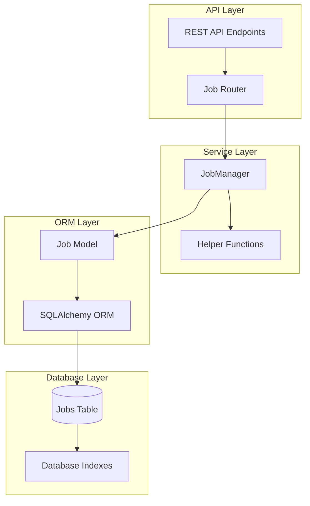
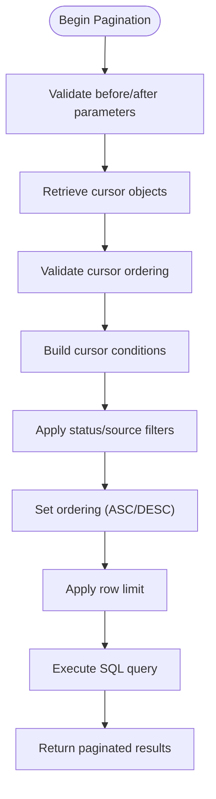
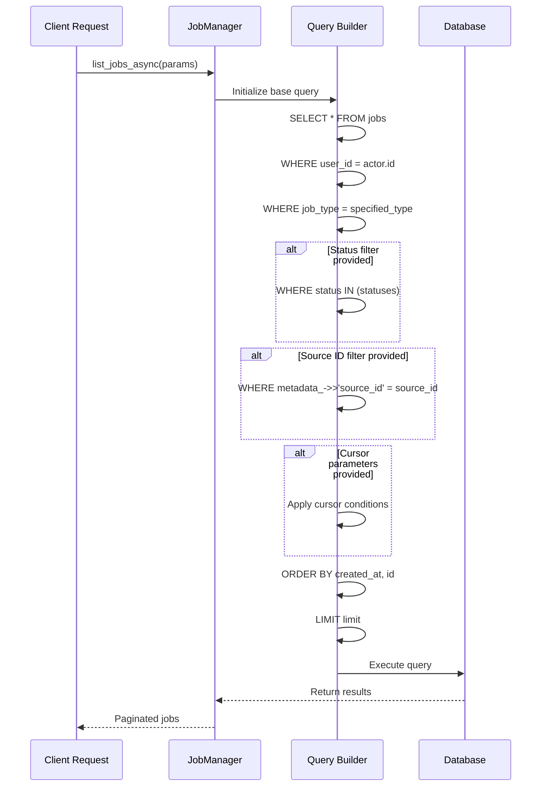
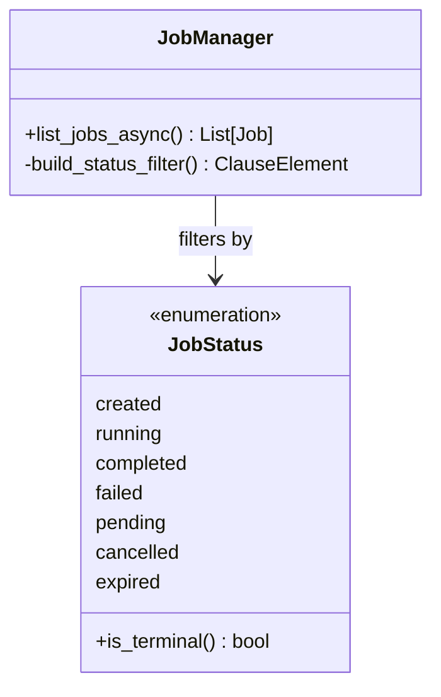
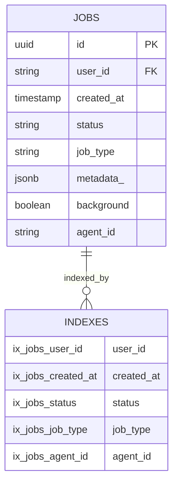
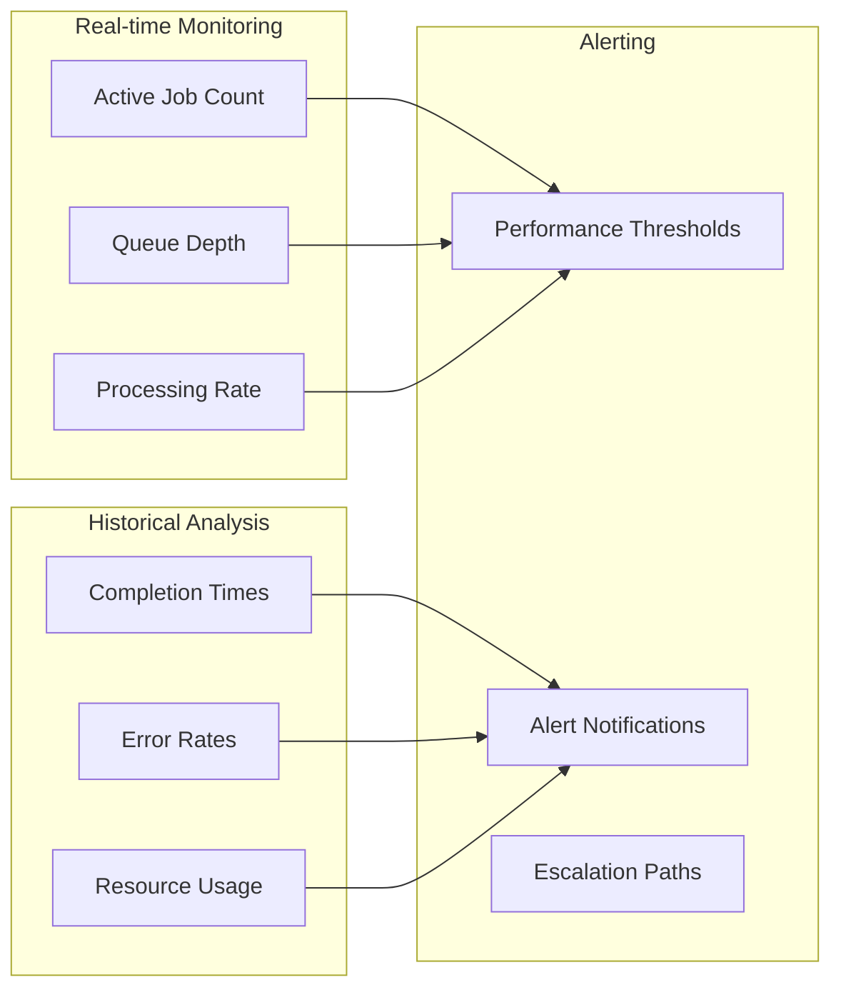
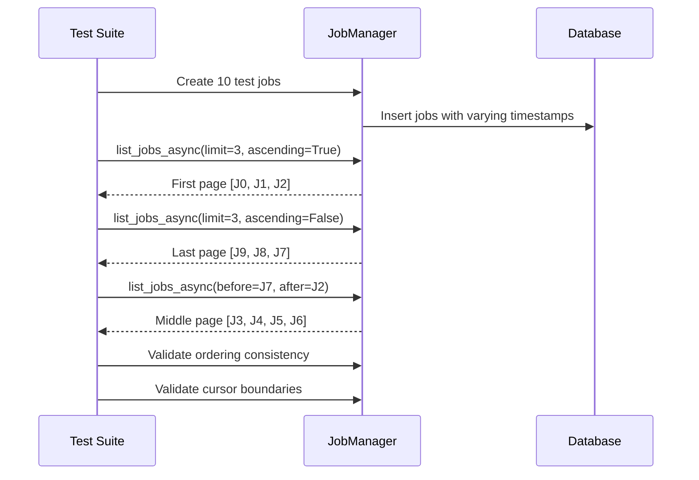
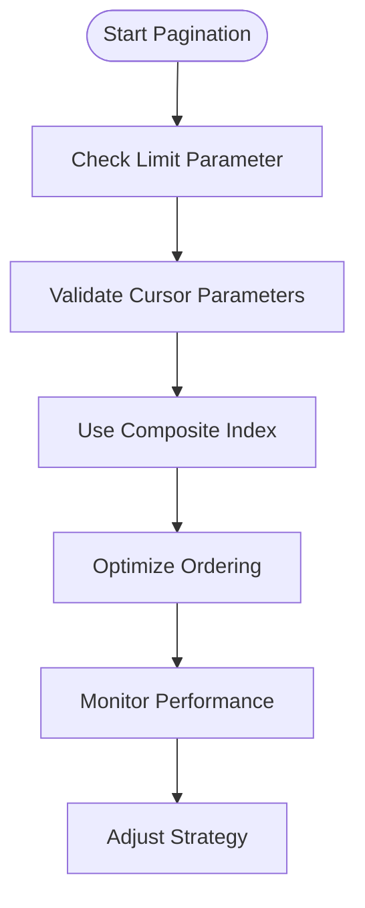

# Job Queue Querying

<cite>
**Referenced Files in This Document**
- [job_manager.py](file://letta/services/job_manager.py)
- [test_job_manager.py](file://tests/managers/test_job_manager.py)
- [job.py](file://letta/orm/job.py)
- [enums.py](file://letta/schemas/enums.py)
- [job.py](file://letta/schemas/job.py)
- [jobs.py](file://letta/server/rest_api\routers\v1\jobs.py)
- [2c059cad97cc_create_sqlite_baseline_schema.py](file://alembic\versions\2c059cad97cc_create_sqlite_baseline_schema.py)
- [5973fd8b8c60_add_agents_runs_table.py](file://alembic\versions\5973fd8b8c60_add_agents_runs_table.py)
</cite>

## Table of Contents
1. [Introduction](#introduction)
2. [Architecture Overview](#architecture-overview)
3. [Cursor-Based Pagination Implementation](#cursor-based-pagination-implementation)
4. [Dynamic SQL Query Construction](#dynamic-sql-query-construction)
5. [Filtering Capabilities](#filtering-capabilities)
6. [Performance Considerations](#performance-considerations)
7. [Monitoring Large Job Queues](#monitoring-large-job-queues)
8. [Test Cases and Validation](#test-cases-and-validation)
9. [Best Practices](#best-practices)
10. [Troubleshooting Guide](#troubleshooting-guide)

## Introduction

Letta's job queue querying system provides efficient mechanisms for retrieving and managing background jobs through sophisticated cursor-based pagination and dynamic filtering capabilities. The system is built around the `JobManager` class, which handles asynchronous job operations including listing, filtering, and pagination using PostgreSQL's advanced query capabilities.

The job queue system supports three primary job types: regular jobs (`JOB`), run jobs (`RUN`), and batch jobs (`BATCH`). Each job type serves different use cases in Letta's architecture, from data processing tasks to agent execution runs and bulk operations.

## Architecture Overview

The job queue querying system follows a layered architecture with clear separation of concerns:



**Diagram sources**
- [job_manager.py](file://letta/services/job_manager.py#L34-L600)
- [job.py](file://letta/orm/job.py#L19-L66)

The system leverages SQLAlchemy's ORM capabilities to provide type-safe database operations while maintaining flexibility for complex query scenarios. The `JobManager` class serves as the central orchestrator for all job-related operations.

**Section sources**
- [job_manager.py](file://letta/services/job_manager.py#L34-L600)
- [job.py](file://letta/orm/job.py#L19-L66)

## Cursor-Based Pagination Implementation

Letta implements cursor-based pagination using a combination of `created_at` timestamps and unique `id` fields to ensure consistent and reliable pagination without the pitfalls of offset-based approaches.

### Core Pagination Mechanism

The `list_jobs_async` method implements sophisticated cursor-based pagination with the following key components:



**Diagram sources**
- [job_manager.py](file://letta/services/job_manager.py#L243-L298)

### Cursor Condition Logic

The system implements precise cursor condition logic to handle edge cases:

| Scenario | Condition | SQL Logic |
|----------|-----------|-----------|
| Before cursor | Records older than cursor | `created_at < before_timestamp OR (created_at = before_timestamp AND id < before_obj.id)` |
| After cursor | Records newer than cursor | `created_at > after_timestamp OR (created_at = after_timestamp AND id > after_obj.id)` |
| Both cursors | Records between cursors | Combined conditions with AND |

### Ordering Strategy

The pagination system supports bidirectional ordering:

- **Ascending Order**: Oldest jobs first (`created_at ASC, id ASC`)
- **Descending Order**: Newest jobs first (`created_at DESC, id DESC`)

This dual-field ordering ensures consistent results even when multiple jobs share the same timestamp.

**Section sources**
- [job_manager.py](file://letta/services/job_manager.py#L243-L298)

## Dynamic SQL Query Construction

The `list_jobs_async` method dynamically constructs SQL queries based on provided parameters, enabling flexible filtering and pagination.

### Base Query Structure



**Diagram sources**
- [job_manager.py](file://letta/services/job_manager.py#L221-L304)

### Parameter-Based Filtering

The system supports comprehensive filtering through various parameters:

| Parameter | Type | Purpose | SQL Implementation |
|-----------|------|---------|-------------------|
| `statuses` | List[JobStatus] | Filter by job status | `WHERE status IN (statuses)` |
| `source_id` | str | Filter by source ID | `WHERE metadata_->>'source_id' = source_id` |
| `stop_reason` | StopReasonType | Filter by stop reason | `WHERE stop_reason = stop_reason` |
| `background` | bool | Filter by background mode | `WHERE background = background` |
| `agent_ids` | List[str] | Filter by agent IDs | `WHERE agent_id IN (agent_ids)` |

### Metadata Field Queries

The system uses PostgreSQL's JSONB operators for metadata field access:

```sql
-- Example metadata query
WHERE metadata_->>'source_id' = 'specific-source-id'
```

This approach enables efficient querying of structured metadata without requiring schema modifications.

**Section sources**
- [job_manager.py](file://letta/services/job_manager.py#L221-L304)

## Filtering Capabilities

Letta's job queue querying system provides extensive filtering capabilities to help users efficiently locate specific jobs within large datasets.

### Status-Based Filtering

The system supports filtering by job status with support for multiple status values:



**Diagram sources**
- [enums.py](file://letta/schemas/enums.py#L115-L131)
- [job_manager.py](file://letta/services/job_manager.py#L226-L227)

### Type-Based Filtering

Jobs can be filtered by their type, supporting the three primary job categories:

- **JOB**: Regular processing jobs
- **RUN**: Agent execution runs  
- **BATCH**: Bulk processing operations

### Advanced Filtering Options

| Filter Type | Use Case | Example |
|-------------|----------|---------|
| Source ID | Filter by data source | `source_id="data-source-123"` |
| Stop Reason | Filter by termination reason | `stop_reason="timeout"` |
| Background Mode | Filter by execution mode | `background=True` |
| Agent Association | Filter by agent | `agent_ids=["agent-1", "agent-2"]` |

**Section sources**
- [job_manager.py](file://letta/services/job_manager.py#L226-L242)

## Performance Considerations

Letta's job queue querying system is optimized for performance through strategic database indexing and query optimization techniques.

### Database Indexing Strategy

The system relies on several key indexes for optimal performance:



**Diagram sources**
- [job.py](file://letta/orm/job.py#L26-L26)
- [2c059cad97cc_create_sqlite_baseline_schema.py](file://alembic\versions\2c059cad97cc_create_sqlite_baseline_schema.py#L719-L733)

### Index Usage Patterns

| Query Pattern | Required Index | Performance Impact |
|---------------|----------------|-------------------|
| User-scoped listing | `ix_jobs_user_id` | O(1) user lookup |
| Time-based pagination | Composite `(created_at, id)` | Efficient cursor navigation |
| Status filtering | `ix_jobs_status` | Fast status-based queries |
| Type filtering | `ix_jobs_job_type` | Quick type-based segregation |

### Query Optimization Techniques

1. **Composite Indexing**: The `(created_at, id)` composite index optimizes cursor-based pagination
2. **Selective Column Loading**: Only required columns are selected in queries
3. **Parameterized Queries**: Prevents SQL injection and enables query plan caching
4. **Connection Pooling**: Asynchronous sessions minimize connection overhead

### Memory Management

The system implements efficient memory usage patterns:

- **Streaming Results**: Large result sets are processed in chunks
- **Lazy Loading**: Related objects are loaded on-demand
- **Connection Lifecycle**: Sessions are properly managed and closed

**Section sources**
- [job.py](file://letta/orm/job.py#L26-L26)

## Monitoring Large Job Queues

Letta provides comprehensive monitoring capabilities for large job queues, enabling administrators to track job performance and identify bottlenecks.

### Performance Metrics

The system tracks several key performance indicators:

| Metric | Unit | Purpose |
|--------|------|---------|
| TTFT (Time to First Token) | Nanoseconds | Measure initial response latency |
| Total Duration | Nanoseconds | Track complete job execution time |
| Callback Status | HTTP Code | Monitor external service integrations |
| Job Count | Integer | Track queue depth and throughput |

### Monitoring Strategies



### Scalability Considerations

For large-scale deployments, the system supports:

- **Horizontal Partitioning**: Jobs can be distributed across multiple database instances
- **Asynchronous Processing**: Non-blocking operations prevent queue blocking
- **Caching Layers**: Frequently accessed job data can be cached
- **Load Balancing**: Multiple job processors can distribute workload

**Section sources**
- [job_manager.py](file://letta/services/job_manager.py#L458-L479)

## Test Cases and Validation

Letta includes comprehensive test coverage for job queue querying functionality, ensuring reliability and correctness across various scenarios.

### Pagination Testing

The test suite validates cursor-based pagination with multiple scenarios:



**Diagram sources**
- [test_job_manager.py](file://tests/managers/test_job_manager.py#L264-L317)

### Status Filtering Tests

The system includes extensive testing for status-based filtering:

| Test Scenario | Expected Behavior | Validation |
|---------------|-------------------|------------|
| Single status filter | Returns only matching jobs | Status equality check |
| Multiple status filter | Returns union of status sets | Set membership validation |
| Empty status list | Returns all user jobs | Full dataset comparison |
| Terminal status filter | Excludes non-terminal jobs | State transition validation |

### Edge Case Testing

The test suite covers critical edge cases:

- **Empty Result Sets**: Handles scenarios with no matching jobs
- **Boundary Conditions**: Validates cursor boundary behavior
- **Invalid Cursors**: Tests error handling for non-existent job IDs
- **Mixed Timestamps**: Ensures proper tie-breaking with ID fields

**Section sources**
- [test_job_manager.py](file://tests/managers/test_job_manager.py#L264-L317)
- [test_job_manager.py](file://tests/managers/test_job_manager.py#L302-L337)

## Best Practices

### Query Optimization Guidelines

1. **Use Appropriate Limits**: Set reasonable limits to prevent memory exhaustion
2. **Leverage Indexes**: Ensure proper indexing on frequently queried fields
3. **Minimize Data Transfer**: Select only necessary columns in queries
4. **Batch Operations**: Group related operations to reduce database round-trips

### Pagination Best Practices



### Error Handling Strategies

- **Graceful Degradation**: Handle database connectivity issues gracefully
- **Retry Logic**: Implement exponential backoff for transient failures
- **Validation**: Validate input parameters before query execution
- **Logging**: Comprehensive logging for debugging and monitoring

### Security Considerations

- **Access Control**: Ensure proper user isolation in queries
- **Input Sanitization**: Validate all user-provided parameters
- **Rate Limiting**: Implement rate limiting for API endpoints
- **Audit Logging**: Log all job queue operations for compliance

## Troubleshooting Guide

### Common Issues and Solutions

| Issue | Symptoms | Solution |
|-------|----------|----------|
| Slow Pagination | Long response times | Add composite index on (created_at, id) |
| Missing Results | Inconsistent pagination | Verify cursor ordering constraints |
| Memory Issues | Out of memory errors | Reduce query limits and implement streaming |
| Permission Errors | Access denied exceptions | Check user_id filtering and permissions |

### Performance Debugging

1. **Query Analysis**: Use EXPLAIN plans to analyze query performance
2. **Index Verification**: Ensure required indexes are in place
3. **Connection Monitoring**: Check connection pool utilization
4. **Memory Profiling**: Monitor memory usage during large queries

### Monitoring and Alerting

Implement monitoring for:
- Query execution times
- Database connection pool usage
- Error rates and patterns
- Queue depths and processing rates

**Section sources**
- [job_manager.py](file://letta/services/job_manager.py#L250-L264)