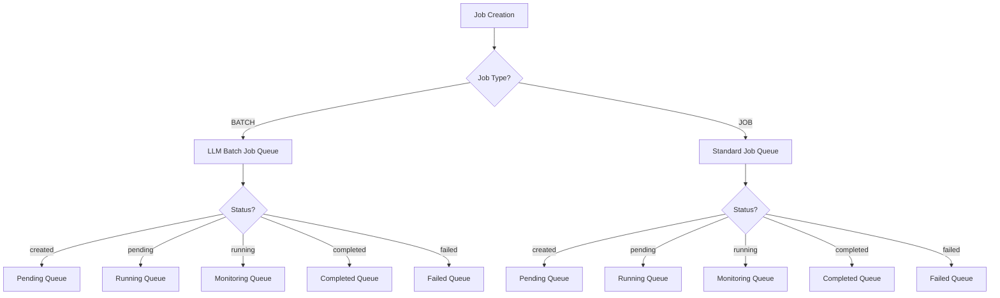
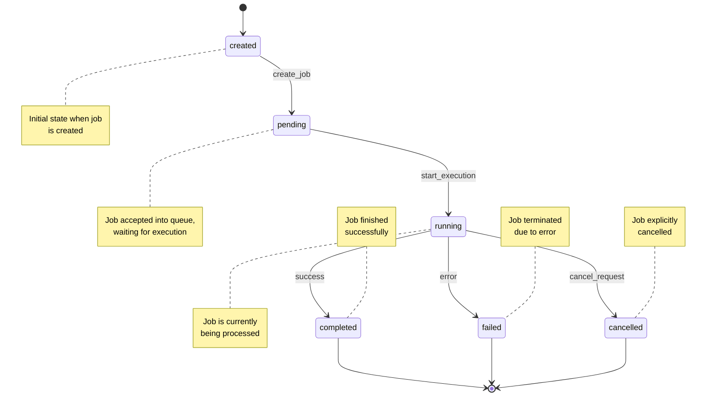
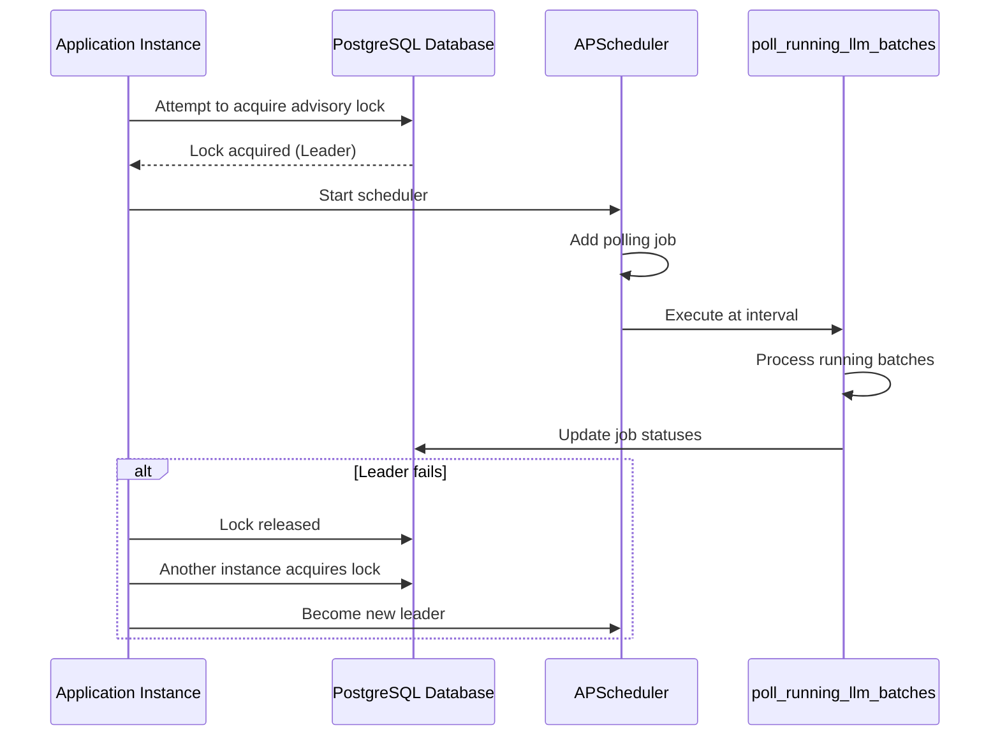
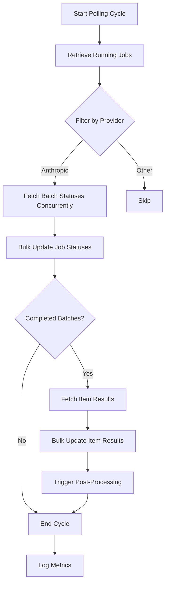
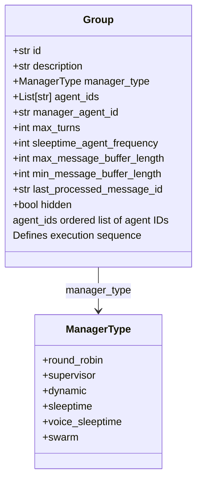
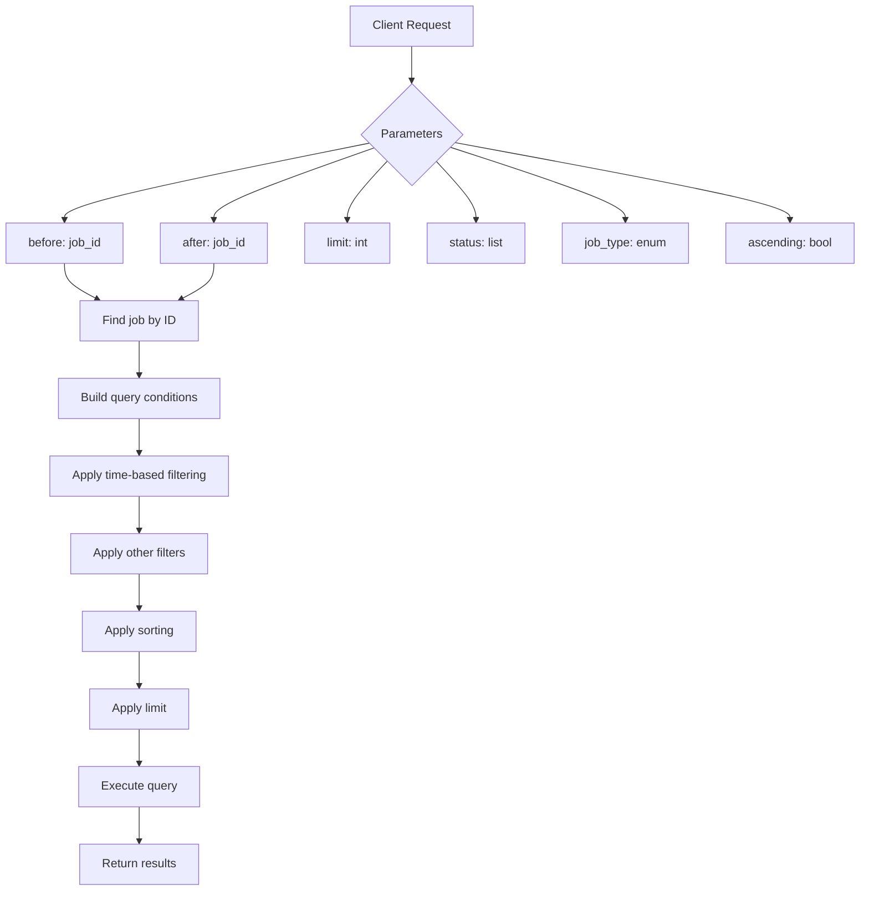
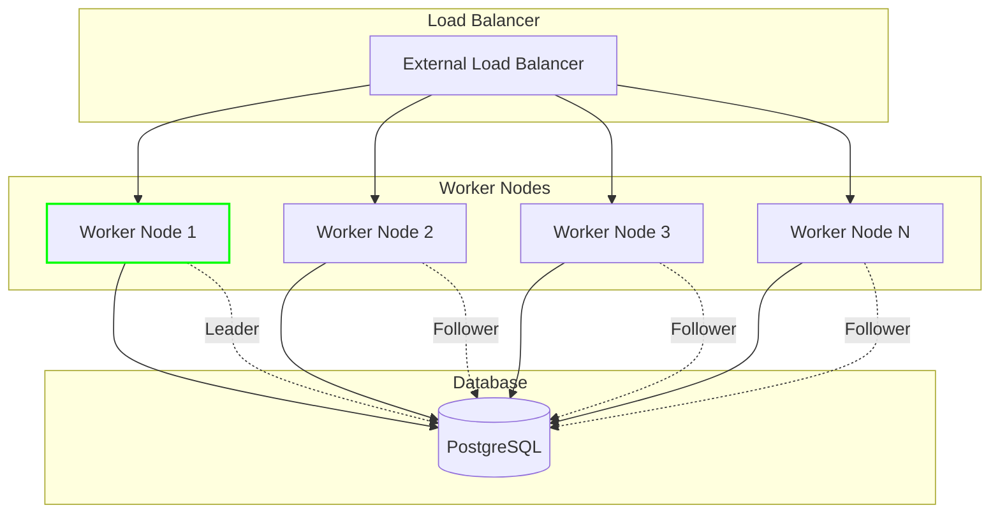

# Job Queuing and Scheduling

<cite>
**Referenced Files in This Document**   
- [scheduler.py](file://letta/jobs/scheduler.py)
- [llm_batch_job_polling.py](file://letta/jobs/llm_batch_job_polling.py)
- [types.py](file://letta/jobs/types.py)
- [helpers.py](file://letta/jobs/helpers.py)
- [job_manager.py](file://letta/services/job_manager.py)
- [job.py](file://letta/orm/job.py)
- [group.py](file://letta/orm/group.py)
- [group.py](file://letta/schemas/group.py)
- [settings.py](file://letta/settings.py)
</cite>

## Table of Contents
1. [Introduction](#introduction)
2. [Job Queue Organization](#job-queue-organization)
3. [Job Status Lifecycle](#job-status-lifecycle)
4. [Scheduler Implementation](#scheduler-implementation)
5. [Polling Mechanism](#polling-mechanism)
6. [Job Dependencies and Ordering](#job-dependencies-and-ordering)
7. [Querying Job Queues](#querying-job-queues)
8. [Scalability and Load Balancing](#scalability-and-load-balancing)
9. [Conclusion](#conclusion)

## Introduction

Letta's job orchestration system provides a robust framework for managing asynchronous operations, particularly focused on LLM batch processing and multi-agent workflows. The system is designed to handle job queuing, scheduling, execution monitoring, and status tracking with high reliability and scalability. This document details the architecture and implementation of Letta's job queuing and scheduling system, covering how jobs are organized in queues, how the scheduler manages execution order, the job status lifecycle, polling mechanisms, dependency management, and strategies for handling high-volume job processing.

The core components of the system include a distributed scheduler with leader election, a job status management system with strict state transitions, cursor-based pagination for efficient job listing, and group-based coordination for multi-agent workflows. The system is built to handle various job types, resource requirements, and execution modes while ensuring data consistency and preventing resource contention in distributed environments.

**Section sources**
- [scheduler.py](file://letta/jobs/scheduler.py#L1-L229)
- [llm_batch_job_polling.py](file://letta/jobs/llm_batch_job_polling.py#L1-L248)

## Job Queue Organization

Jobs in Letta are organized in queues based on their priority, resource requirements, and execution mode. The system uses a combination of database queries and application logic to manage job queues efficiently. Jobs are stored in the `jobs` table with various attributes that determine their placement and processing order within queues.

The primary organizational dimensions for job queues are:

- **Job Type**: Jobs are categorized by type (e.g., JOB, BATCH) which determines their processing requirements and execution mode. The `job_type` field in the job model allows for filtering and routing jobs to appropriate processing pipelines.

- **Status**: Jobs are organized by their current status (created, pending, running, completed, failed, cancelled), which determines their position in the execution queue. The system processes jobs in a specific order based on status transitions.

- **Resource Requirements**: Jobs can have different resource requirements based on their complexity and the agents involved. The system considers these requirements when scheduling jobs to ensure optimal resource utilization.

- **Execution Mode**: Jobs can be created in background mode (indicated by the `background` field), which affects their priority and processing characteristics.

The job queue organization is implemented through the `list_jobs_async` method in the `JobManager` class, which supports filtering by status, job type, and other criteria. This allows clients to query specific subsets of jobs based on their needs.

**Diagram sources **
- [job.py](file://letta/orm/job.py#L28-L38)
- [job_manager.py](file://letta/services/job_manager.py#L203-L304)

**Section sources**
- [job.py](file://letta/orm/job.py#L1-L66)
- [job_manager.py](file://letta/services/job_manager.py#L203-L304)

## Job Status Lifecycle

The job status lifecycle in Letta follows a strict state transition model to ensure data consistency and prevent invalid state changes. Jobs progress through a series of states from creation to completion, with well-defined transitions between each state.

The primary job status states are:
- **created**: The initial state when a job is created but not yet processed
- **pending**: The job has been accepted into the queue and is waiting for execution
- **running**: The job is currently being executed
- **completed**: The job has finished successfully
- **failed**: The job has terminated due to an error
- **cancelled**: The job was explicitly cancelled

The system enforces strict state transition rules to prevent invalid transitions. The valid transitions are:
- created → pending
- pending → running
- running → completed
- running → failed
- running → cancelled
- any state → failed (in case of system errors)

These transitions are enforced in the `safe_update_job_status_async` method of the `JobManager` class, which validates that status changes follow the allowed transition paths. When a job reaches a terminal state (completed, failed, or cancelled), the `completed_at` timestamp is automatically set.

**Diagram sources **
- [job_manager.py](file://letta/services/job_manager.py#L153-L189)
- [job.py](file://letta/orm/job.py#L28-L30)

**Section sources**
- [job_manager.py](file://letta/services/job_manager.py#L153-L189)
- [job.py](file://letta/orm/job.py#L28-L30)

## Scheduler Implementation

The scheduler implementation in Letta is designed to manage job execution order, handle concurrency limits, and prevent resource contention in distributed environments. The core scheduler is implemented in the `scheduler.py` file using the APScheduler library with leader election to ensure only one instance runs the scheduler in a clustered environment.

The scheduler uses PostgreSQL advisory locks for leader election when running on PostgreSQL databases. When multiple instances of the application are running, only one instance acquires the advisory lock and becomes the scheduler leader, while other instances periodically attempt to acquire the lock if the leader fails. For non-PostgreSQL databases like SQLite, the leader election is skipped, and all instances run the scheduler (which is acceptable for development and single-instance deployments).

The scheduler is configured with an interval trigger that polls for running LLM batch jobs at regular intervals. The polling interval is configurable through the `poll_running_llm_batches_interval_seconds` setting. The scheduler adds a job to the APScheduler instance that calls the `poll_running_llm_batches` function at the specified interval.

**Diagram sources **
- [scheduler.py](file://letta/jobs/scheduler.py#L25-L229)
- [llm_batch_job_polling.py](file://letta/jobs/llm_batch_job_polling.py#L170-L248)

**Section sources**
- [scheduler.py](file://letta/jobs/scheduler.py#L25-L229)

## Polling Mechanism

The polling mechanism in Letta is responsible for monitoring the progress of running jobs, particularly LLM batch jobs. The system uses a periodic polling approach to check the status of jobs and update their state in the database. This mechanism is implemented in the `llm_batch_job_polling.py` file and is triggered by the scheduler at regular intervals.

The polling process follows these steps:
1. Retrieve currently running batch jobs from the database
2. Filter jobs by provider (currently only Anthropic is supported)
3. Concurrently fetch updated status information for all batch jobs
4. Bulk update job statuses in the database
5. For completed batches, fetch individual item results
6. Bulk update item-level results in the database
7. Trigger post-processing for completed batches

The polling mechanism uses cursor-based pagination for efficient querying of running jobs, with configurable lookback period and batch size through the `batch_job_polling_lookback_weeks` and `batch_job_polling_batch_size` settings. This prevents loading excessive data into memory and allows the system to scale to high job volumes.

The system also implements metrics tracking through the `BatchPollingMetrics` class, which collects information about the number of batches processed, completion rates, and processing time. This telemetry data is logged at the end of each polling cycle for monitoring and debugging purposes.

**Diagram sources **
- [llm_batch_job_polling.py](file://letta/jobs/llm_batch_job_polling.py#L170-L248)
- [scheduler.py](file://letta/jobs/scheduler.py#L60-L72)

**Section sources**
- [llm_batch_job_polling.py](file://letta/jobs/llm_batch_job_polling.py#L170-L248)

## Job Dependencies and Ordering

Job dependencies and ordering in Letta are managed through the group system, specifically using the `ordered_agent_ids` field in the `groups` table. This field stores an ordered list of agent IDs that defines the execution sequence for multi-agent workflows.

The group system supports different coordination patterns through various manager types:
- **round_robin**: Agents take turns in a circular fashion
- **supervisor**: A designated manager agent coordinates other agents
- **dynamic**: Agents are dynamically selected based on context
- **sleeptime**: Agents execute with specific timing patterns
- **voice_sleeptime**: Specialized for voice-based interactions

The `agent_ids` field in the `Group` model is stored as JSON and contains the ordered list of agent IDs. This ordering determines the sequence in which agents are invoked in multi-agent workflows. The system ensures that dependencies are respected by following this order when routing messages and tasks between agents.

When a group is created or modified, the system validates the agent relationships and ensures that the ordering is preserved. The `create_group_async` and `modify_group_async` methods in the `GroupManager` class handle these operations, including processing the agent relationships and updating the database accordingly.

**Diagram sources **
- [group.py](file://letta/orm/group.py#L16-L38)
- [group.py](file://letta/schemas/group.py#L27-L198)

**Section sources**
- [group.py](file://letta/orm/group.py#L16-L38)
- [group.py](file://letta/schemas/group.py#L27-L198)

## Querying Job Queues

Querying job queues in Letta is performed through the `list_jobs_async` method of the `JobManager` class, which supports comprehensive filtering and pagination options. The system uses cursor-based pagination with `before` and `after` parameters to efficiently navigate through large result sets without performance degradation.

The query interface supports filtering by:
- **Status**: Filter jobs by their current status (created, pending, running, etc.)
- **Job Type**: Filter by job type (JOB, BATCH)
- **Agent IDs**: Filter jobs associated with specific agents
- **Background mode**: Filter by whether jobs were created in background mode
- **Stop reason**: Filter by the reason jobs were stopped
- **Source ID**: Filter by metadata source ID

Cursor-based pagination works by using job creation timestamps and IDs as cursors. The `before` parameter returns jobs created before the specified job, while the `after` parameter returns jobs created after the specified job. This approach is more efficient than offset-based pagination, especially for large datasets, as it doesn't require counting rows.

The system also supports ascending and descending order sorting, with the default being ascending order by creation time. This allows clients to retrieve jobs in chronological order or reverse chronological order based on their needs.

**Diagram sources **
- [job_manager.py](file://letta/services/job_manager.py#L203-L304)
- [job.py](file://letta/orm/job.py#L24-L26)

**Section sources**
- [job_manager.py](file://letta/services/job_manager.py#L203-L304)

## Scalability and Load Balancing

Letta's job queuing and scheduling system is designed with scalability and load balancing in mind, particularly for high-volume job processing. The system employs several strategies to ensure it can handle large workloads efficiently and distribute processing across multiple worker nodes.

Key scalability features include:

- **Distributed Scheduler with Leader Election**: The use of PostgreSQL advisory locks ensures that only one instance runs the scheduler in a clustered environment, preventing duplicate processing while allowing for high availability. If the leader instance fails, another instance automatically takes over.

- **Bulk Operations**: The system uses bulk database operations for updating job statuses and results, reducing the number of database round-trips and improving performance. Methods like `bulk_update_llm_batch_statuses_async` and `bulk_update_batch_llm_items_results_by_agent_async` handle multiple updates in a single operation.

- **Concurrent Processing**: The polling mechanism uses `asyncio.gather` to process multiple batch jobs concurrently, maximizing throughput and minimizing idle time.

- **Configurable Polling Intervals**: The system allows configuration of polling intervals and batch sizes through settings like `poll_running_llm_batches_interval_seconds`, `batch_job_polling_lookback_weeks`, and `batch_job_polling_batch_size`, enabling tuning for different workload patterns.

- **Cursor-Based Pagination**: This approach allows efficient navigation of large job lists without the performance penalties of offset-based pagination, making it suitable for systems with high job volumes.

- **Modular Architecture**: The separation of concerns between the scheduler, job manager, and polling components allows for independent scaling of different system components based on workload characteristics.

For load balancing across worker nodes, the system relies on external load balancers to distribute incoming requests, while the internal job queuing system ensures that background processing is distributed efficiently. The leader election mechanism naturally balances the scheduling load by ensuring only one node performs scheduling operations, while other nodes can focus on request processing.

**Diagram sources **
- [scheduler.py](file://letta/jobs/scheduler.py#L18-L22)
- [settings.py](file://letta/settings.py#L1-L200)

**Section sources**
- [scheduler.py](file://letta/jobs/scheduler.py#L18-L22)
- [settings.py](file://letta/settings.py#L1-L200)

## Conclusion

Letta's job queuing and scheduling system provides a comprehensive solution for managing asynchronous operations in a multi-agent environment. The system combines a distributed scheduler with leader election, a robust job status lifecycle, efficient polling mechanisms, and sophisticated dependency management through group-based coordination.

Key strengths of the system include its scalability through bulk operations and cursor-based pagination, its reliability through strict state transition enforcement, and its flexibility in handling different job types and execution patterns. The use of PostgreSQL advisory locks for leader election ensures high availability in clustered environments, while the modular architecture allows for independent scaling of different components.

The system is well-suited for high-volume job processing, with configurable parameters that allow tuning for specific workload patterns. The integration with LLM batch processing and multi-agent workflows makes it particularly effective for AI-driven applications that require coordinated execution of multiple tasks.

Future enhancements could include support for additional LLM providers beyond Anthropic, more sophisticated scheduling algorithms that consider resource constraints, and enhanced monitoring and alerting capabilities for job processing.

**Section sources**
- [scheduler.py](file://letta/jobs/scheduler.py#L1-L229)
- [llm_batch_job_polling.py](file://letta/jobs/llm_batch_job_polling.py#L1-L248)
- [job_manager.py](file://letta/services/job_manager.py#L1-L600)