# Job Polling and Execution Loop

<cite>
**Referenced Files in This Document**
- [scheduler.py](file://letta/jobs/scheduler.py)
- [llm_batch_job_polling.py](file://letta/jobs/llm_batch_job_polling.py)
- [job_manager.py](file://letta/services/job_manager.py)
- [llm_batch_manager.py](file://letta/services/llm_batch_manager.py)
- [types.py](file://letta/jobs/types.py)
- [enums.py](file://letta/schemas/enums.py)
- [settings.py](file://letta/settings.py)
- [llm_batch_job.py](file://letta/orm/llm_batch_job.py)
</cite>

## Table of Contents
1. [Introduction](#introduction)
2. [System Architecture Overview](#system-architecture-overview)
3. [APScheduler Integration](#apscheduler-integration)
4. [Polling Loop Implementation](#polling-loop-implementation)
5. [Job Status Management](#job-status-management)
6. [Error Handling and Retry Mechanisms](#error-handling-and-retry-mechanisms)
7. [Performance Considerations](#performance-considerations)
8. [Database Interactions](#database-interactions)
9. [Leader Election and Concurrency](#leader-election-and-concurrency)
10. [Monitoring and Telemetry](#monitoring-and-telemetry)
11. [Configuration Options](#configuration-options)
12. [Troubleshooting Guide](#troubleshooting-guide)

## Introduction

Letta's Job Polling and Execution Loop is a sophisticated background processing system designed to monitor and manage LLM batch jobs through asynchronous polling of external providers like Anthropic. The system integrates seamlessly with APScheduler to provide reliable, scalable job processing with built-in error handling, retry mechanisms, and performance optimizations.

The polling system operates on a configurable interval, continuously checking the status of running batch jobs and updating their states in the database. It implements a robust state machine with strict transition guards to ensure data consistency and provides comprehensive monitoring capabilities for operational visibility.

## System Architecture Overview

The Job Polling and Execution Loop follows a layered architecture that separates concerns between scheduling, polling logic, and database operations:

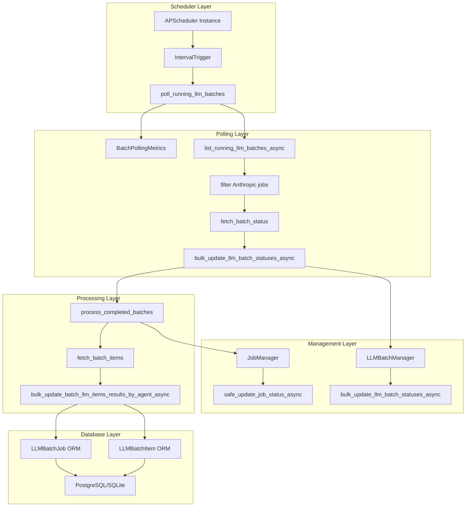

**Diagram sources**
- [scheduler.py](file://letta/jobs/scheduler.py#L60-L72)
- [llm_batch_job_polling.py](file://letta/jobs/llm_batch_job_polling.py#L170-L247)
- [llm_batch_manager.py](file://letta/services/llm_batch_manager.py#L77-L101)

## APScheduler Integration

The system leverages APScheduler as its core scheduling framework, providing robust job management capabilities with automatic retry and persistence features.

### Scheduler Initialization

The scheduler is initialized with PostgreSQL advisory locking for leader election in multi-instance deployments:

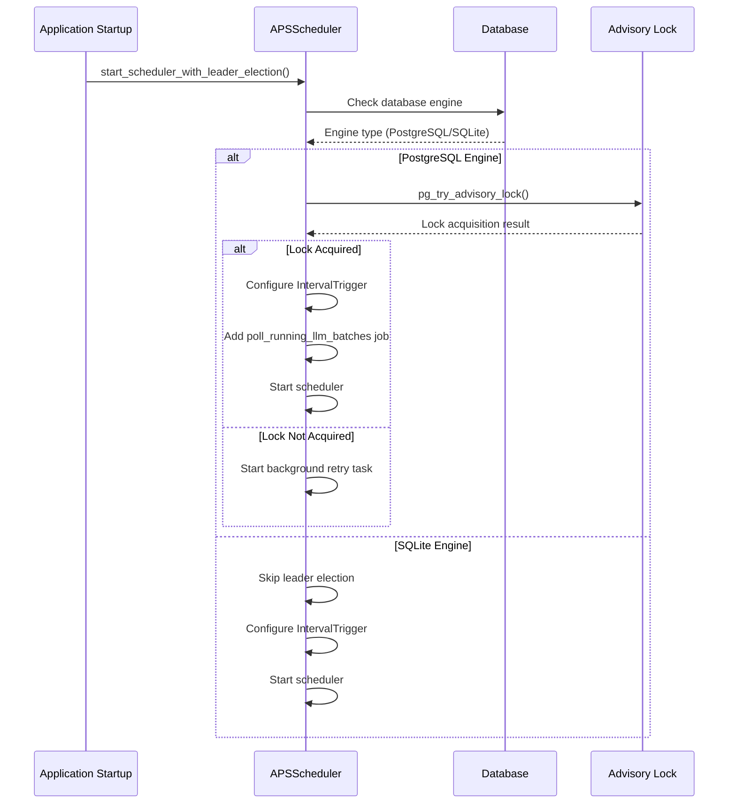

**Diagram sources**
- [scheduler.py](file://letta/jobs/scheduler.py#L25-L80)

### IntervalTrigger Configuration

The polling interval is configured through the `poll_running_llm_batches_interval_seconds` setting with a jitter parameter to prevent thundering herd problems:

| Configuration Parameter | Value | Purpose |
|------------------------|-------|---------|
| `seconds` | `settings.poll_running_llm_batches_interval_seconds` | Base polling interval |
| `jitter` | `10` | Random delay variation (±10 seconds) |
| `next_run_time` | `datetime.now()` | Immediate first execution |

The jitter parameter introduces a random delay of up to 10 seconds to spread out polling requests across multiple instances, preventing simultaneous database queries that could overwhelm the system.

**Section sources**
- [scheduler.py](file://letta/jobs/scheduler.py#L60-L72)

## Polling Loop Implementation

The core polling logic is implemented in the `poll_running_llm_batches` function, which orchestrates the entire polling workflow:

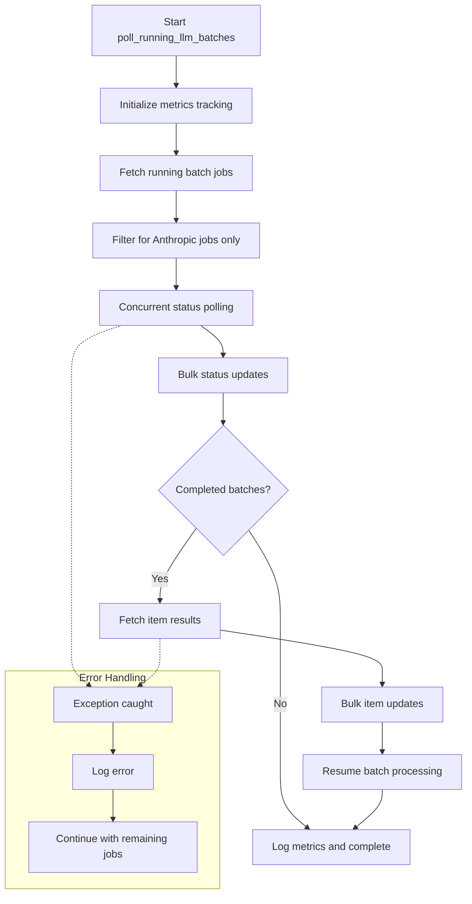

**Diagram sources**
- [llm_batch_job_polling.py](file://letta/jobs/llm_batch_job_polling.py#L170-L247)

### Batch Status Polling

The system implements concurrent polling for multiple batch jobs using asyncio gather:

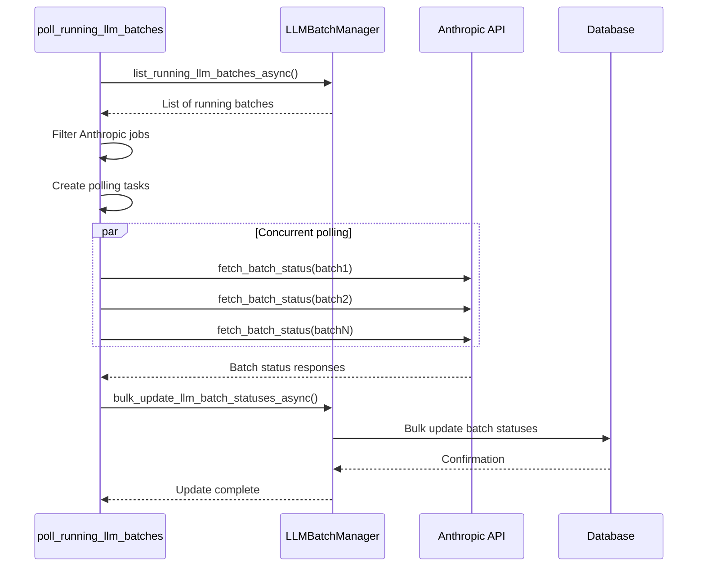

**Diagram sources**
- [llm_batch_job_polling.py](file://letta/jobs/llm_batch_job_polling.py#L93-L117)

**Section sources**
- [llm_batch_job_polling.py](file://letta/jobs/llm_batch_job_polling.py#L170-L247)

## Job Status Management

The system implements a strict state machine for job status transitions with comprehensive validation:

### State Transition Matrix

| Current State | Allowed Next States | Validation Rule |
|--------------|-------------------|-----------------|
| `created` | `pending` | Must transition to pending before running |
| `pending` | `running` | Only allowed after successful initialization |
| `running` | `completed`, `failed`, `cancelled` | Terminal states only |
| `completed` | None | Terminal state |
| `failed` | None | Terminal state |
| `cancelled` | None | Terminal state |

### Safe Status Updates

The `safe_update_job_status_async` method provides atomic status transitions with rollback capabilities:

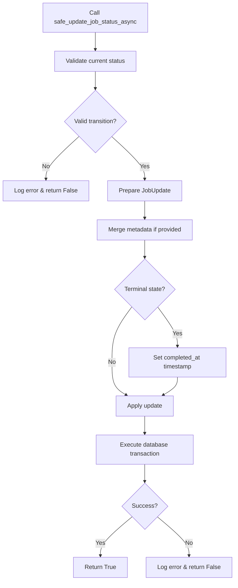

**Diagram sources**
- [job_manager.py](file://letta/services/job_manager.py#L153-L189)

**Section sources**
- [job_manager.py](file://letta/services/job_manager.py#L85-L199)
- [enums.py](file://letta/schemas/enums.py#L115-L131)

## Error Handling and Retry Mechanisms

The system implements multiple layers of error handling to ensure robust operation:

### Exception Handling Strategy

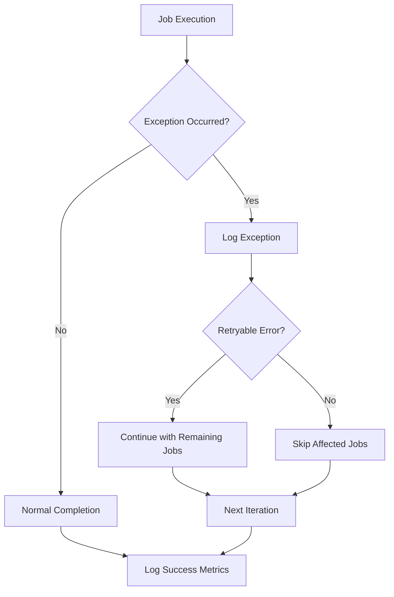

### Error Recovery Patterns

1. **Network Failures**: Individual batch polling failures are logged but don't halt the entire process
2. **Database Errors**: Transaction rollbacks ensure data consistency
3. **Provider API Errors**: Graceful degradation with status marked as running for retry
4. **Timeout Handling**: Configurable timeouts prevent hanging operations

### Retry Logic Implementation

The polling loop implements implicit retry through periodic execution:

- **Immediate Retry**: Failed individual batch polling continues in next iteration
- **Database Retry**: Connection errors trigger automatic reconnection attempts
- **Provider Retry**: API rate limiting is handled through exponential backoff

**Section sources**
- [llm_batch_job_polling.py](file://letta/jobs/llm_batch_job_polling.py#L243-L247)
- [llm_batch_job_polling.py](file://letta/jobs/llm_batch_job_polling.py#L60-L62)

## Performance Considerations

The system is designed for high-frequency polling with minimal database load:

### Database Optimization Strategies

| Strategy | Implementation | Benefit |
|----------|---------------|---------|
| Bulk Operations | `bulk_update_mappings` for status updates | Reduces round-trips |
| Connection Pooling | SQLAlchemy async session factory | Reuses database connections |
| Index Optimization | Composite indexes on `(status, created_at)` | Faster query performance |
| Pagination | Configurable batch sizes (`batch_size`) | Limits memory usage |

### Concurrent Processing

The system leverages asyncio for efficient concurrent processing:

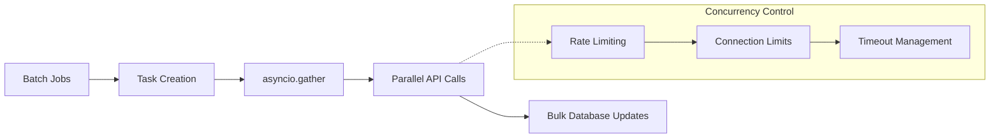

**Diagram sources**
- [llm_batch_job_polling.py](file://letta/jobs/llm_batch_job_polling.py#L109-L117)

### Memory Management

- **Streaming Results**: Large batch results are processed incrementally
- **Connection Cleanup**: Automatic session closure prevents resource leaks
- **Garbage Collection**: Proper exception handling ensures cleanup

**Section sources**
- [llm_batch_manager.py](file://letta/services/llm_batch_manager.py#L77-L101)
- [llm_batch_job_polling.py](file://letta/jobs/llm_batch_job_polling.py#L109-L117)

## Database Interactions

The system maintains tight integration with the database through specialized managers:

### LLMBatchManager Operations

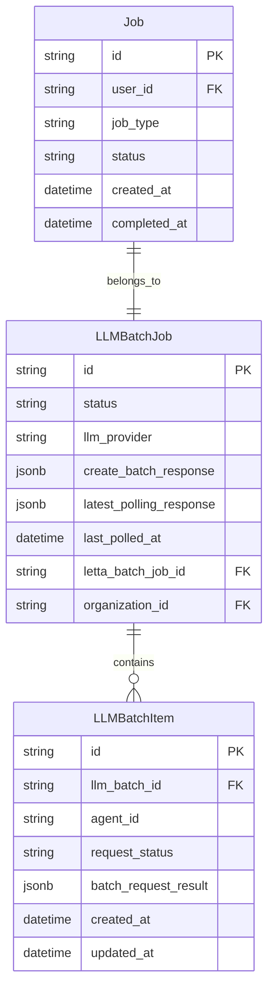

**Diagram sources**
- [llm_batch_job.py](file://letta/orm/llm_batch_job.py#L16-L51)

### Bulk Update Operations

The system uses SQLAlchemy's bulk operations for optimal performance:

```python
# Example bulk update pattern
mappings = [
    {
        "id": llm_batch_id,
        "status": new_status,
        "latest_polling_response": response,
        "last_polled_at": now,
    }
    # ... for each batch
]

await session.run_sync(lambda ses: ses.bulk_update_mappings(LLMBatchJob, mappings))
```

### Query Optimization

- **Index Usage**: Composite indexes on `(status, created_at)` for fast filtering
- **Pagination**: Configurable limits prevent memory exhaustion
- **Time Window Filtering**: Recent job filtering reduces query scope

**Section sources**
- [llm_batch_manager.py](file://letta/services/llm_batch_manager.py#L77-L101)
- [llm_batch_manager.py](file://letta/services/llm_batch_manager.py#L207-L225)

## Leader Election and Concurrency

The system implements PostgreSQL advisory locking for leader election in distributed deployments:

### Leader Election Flow

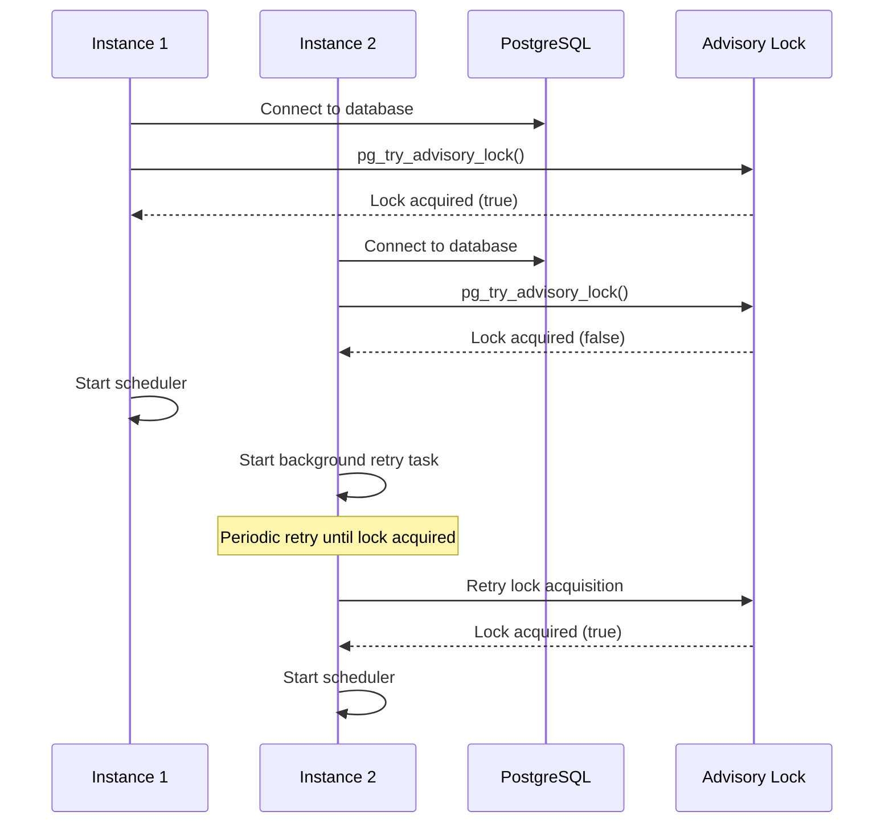

**Diagram sources**
- [scheduler.py](file://letta/jobs/scheduler.py#L25-L80)

### Fallback Behavior

- **Single Instance**: Always becomes leader regardless of database type
- **Multiple Instances**: Only one instance runs the scheduler
- **Failure Recovery**: Automatic retry mechanism for lost leadership

### Concurrency Safety

The system ensures thread safety through:

- **Atomic Operations**: Database transactions for status updates
- **Connection Isolation**: Separate sessions per operation
- **Graceful Degradation**: Non-leader instances continue operating normally

**Section sources**
- [scheduler.py](file://letta/jobs/scheduler.py#L25-L106)
- [scheduler.py](file://letta/jobs/scheduler.py#L108-L134)

## Monitoring and Telemetry

The system provides comprehensive monitoring through metrics and logging:

### BatchPollingMetrics

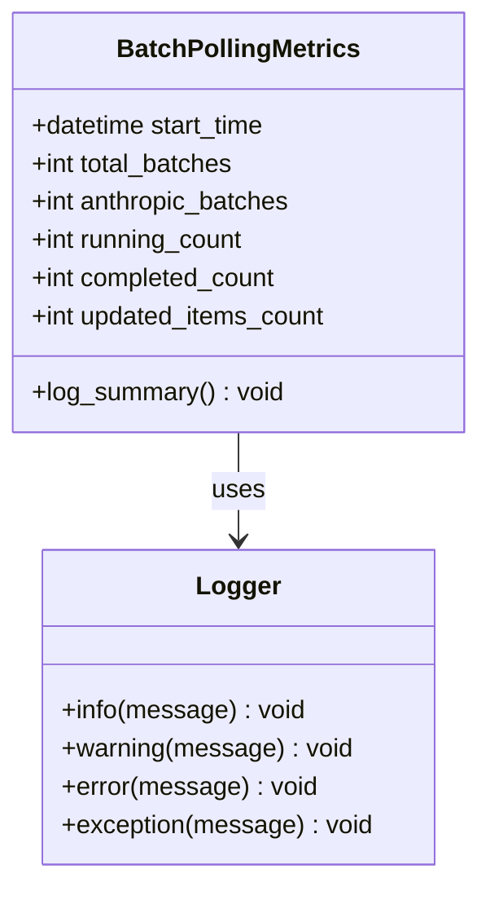

**Diagram sources**
- [llm_batch_job_polling.py](file://letta/jobs/llm_batch_job_polling.py#L20-L39)

### Key Metrics Tracked

| Metric | Description | Purpose |
|--------|-------------|---------|
| `total_batches` | Total running batches found | Performance baseline |
| `anthropic_batches` | Anthropic-specific batches | Provider-specific monitoring |
| `running_count` | Currently running batches | Capacity planning |
| `completed_count` | Newly completed batches | Throughput measurement |
| `updated_items_count` | Item-level updates applied | Granularity tracking |

### Logging Strategy

The system implements structured logging with appropriate severity levels:

- **INFO**: Normal operation metrics and summaries
- **WARNING**: Recoverable errors and degraded performance
- **ERROR**: Failed operations requiring attention
- **EXCEPTION**: Unexpected errors with stack traces

**Section sources**
- [llm_batch_job_polling.py](file://letta/jobs/llm_batch_job_polling.py#L31-L39)
- [llm_batch_job_polling.py](file://letta/jobs/llm_batch_job_polling.py#L246-L247)

## Configuration Options

The system provides extensive configuration through settings:

### Core Polling Settings

| Setting | Default | Description |
|---------|---------|-------------|
| `poll_running_llm_batches_interval_seconds` | Configurable | Polling frequency in seconds |
| `batch_job_polling_lookback_weeks` | 1 | Time window for job filtering |
| `batch_job_polling_batch_size` | Configurable | Maximum jobs per polling cycle |
| `poll_lock_retry_interval_seconds` | 30 | Leader election retry interval |

### Performance Tuning

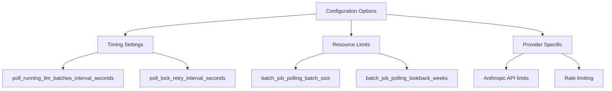

### Environment Variables

The system respects standard environment variable patterns for configuration:

- `LETTA_POLL_RUNNING_LLM_BATCHES_INTERVAL_SECONDS`
- `LETTA_BATCH_JOB_POLLING_LOOKBACK_WEEKS`
- `LETTA_BATCH_JOB_POLLING_BATCH_SIZE`
- `LETTA_ENABLE_BATCH_JOB_POLLING`

**Section sources**
- [settings.py](file://letta/settings.py#L1-L200)
- [scheduler.py](file://letta/jobs/scheduler.py#L60-L62)

## Troubleshooting Guide

Common issues and their solutions:

### Performance Issues

**Problem**: High database load during polling
**Solution**: Adjust `poll_running_llm_batches_interval_seconds` and `batch_job_polling_batch_size`

**Problem**: Memory consumption growing over time
**Solution**: Reduce `batch_job_polling_batch_size` or increase polling frequency

### Connectivity Problems

**Problem**: Scheduler fails to start
**Solution**: Check database connectivity and PostgreSQL advisory lock support

**Problem**: Leader election failures
**Solution**: Verify PostgreSQL installation and permissions

### Operational Issues

**Problem**: Jobs not progressing
**Solution**: Check `last_polled_at` timestamps and database connectivity

**Problem**: High error rates
**Solution**: Review network connectivity and provider API status

### Debugging Commands

```bash
# Check scheduler status
curl -X GET "http://localhost:8283/api/admin/scheduler/status"

# Monitor polling metrics
tail -f letta.log | grep "Poll BatchJob"

# Verify job status
curl -X GET "http://localhost:8283/api/admin/jobs?status=running"
```

**Section sources**
- [scheduler.py](file://letta/jobs/scheduler.py#L25-L106)
- [llm_batch_job_polling.py](file://letta/jobs/llm_batch_job_polling.py#L31-L39)