# Job Scheduler Implementation

<cite>
**Referenced Files in This Document**
- [scheduler.py](file://letta/jobs/scheduler.py)
- [llm_batch_job_polling.py](file://letta/jobs/llm_batch_job_polling.py)
- [types.py](file://letta/jobs/types.py)
- [helpers.py](file://letta/jobs/helpers.py)
- [job_manager.py](file://letta/services/job_manager.py)
- [app.py](file://letta/server/rest_api/app.py)
- [enums.py](file://letta/schemas/enums.py)
- [settings.py](file://letta/settings.py)
</cite>

## Table of Contents
1. [Introduction](#introduction)
2. [System Architecture](#system-architecture)
3. [Core Components](#core-components)
4. [Leadership Election Mechanism](#leadership-election-mechanism)
5. [Job Status Management](#job-status-management)
6. [Concurrency Control](#concurrency-control)
7. [Failure Recovery](#failure-recovery)
8. [At-Least-Once Delivery Semantics](#at-least-once-delivery-semantics)
9. [Performance Considerations](#performance-considerations)
10. [Troubleshooting Guide](#troubleshooting-guide)
11. [Conclusion](#conclusion)

## Introduction

Letta's job scheduler implementation provides a robust asynchronous job orchestration engine designed to handle LLM batch processing operations in distributed environments. The system leverages APScheduler with PostgreSQL advisory locks to ensure only one instance processes jobs in clustered deployments, maintaining data consistency and preventing duplicate executions.

The scheduler orchestrates the polling of LLM batch jobs from external providers like Anthropic, managing job status transitions from creation through completion while ensuring reliable delivery semantics for critical operations.

## System Architecture

The job scheduler follows a distributed architecture pattern with leadership election capabilities:

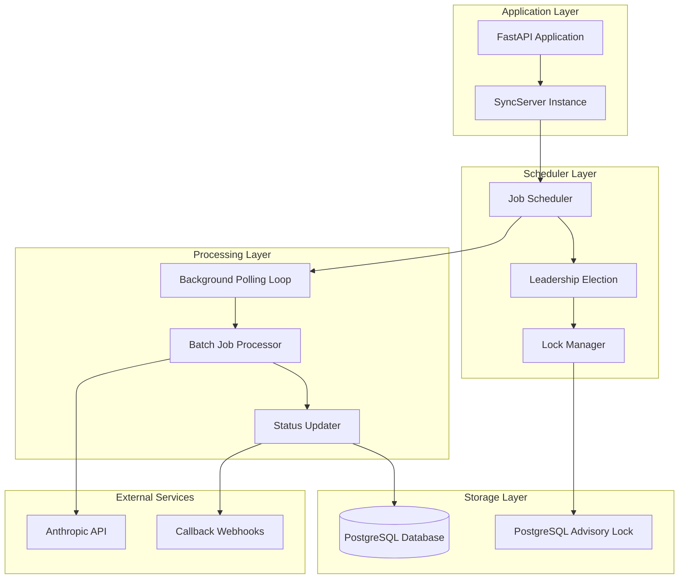

**Diagram sources**
- [scheduler.py](file://letta/jobs/scheduler.py#L16-L229)
- [app.py](file://letta/server/rest_api/app.py#L163-L227)

**Section sources**
- [scheduler.py](file://letta/jobs/scheduler.py#L1-L229)
- [app.py](file://letta/server/rest_api/app.py#L163-L227)

## Core Components

### Scheduler Engine

The scheduler engine is built around APScheduler, providing a robust framework for job scheduling and execution:

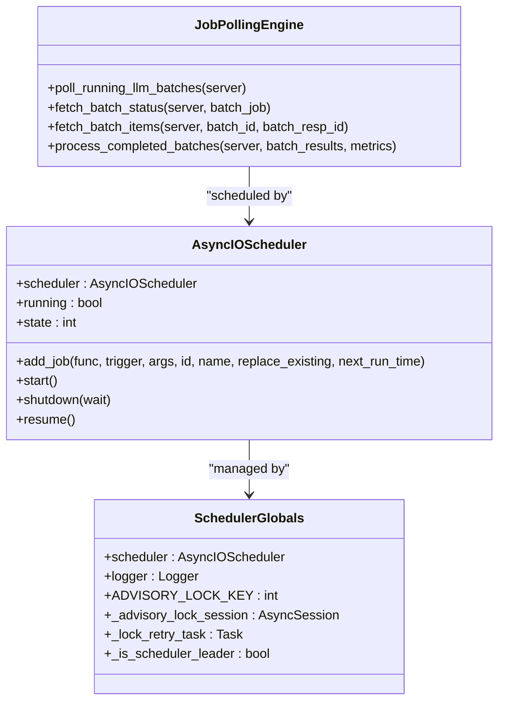

**Diagram sources**
- [scheduler.py](file://letta/jobs/scheduler.py#L15-L23)
- [llm_batch_job_polling.py](file://letta/jobs/llm_batch_job_polling.py#L170-L248)

### Leadership Election System

The leadership election mechanism ensures only one scheduler instance operates at a time in clustered environments:

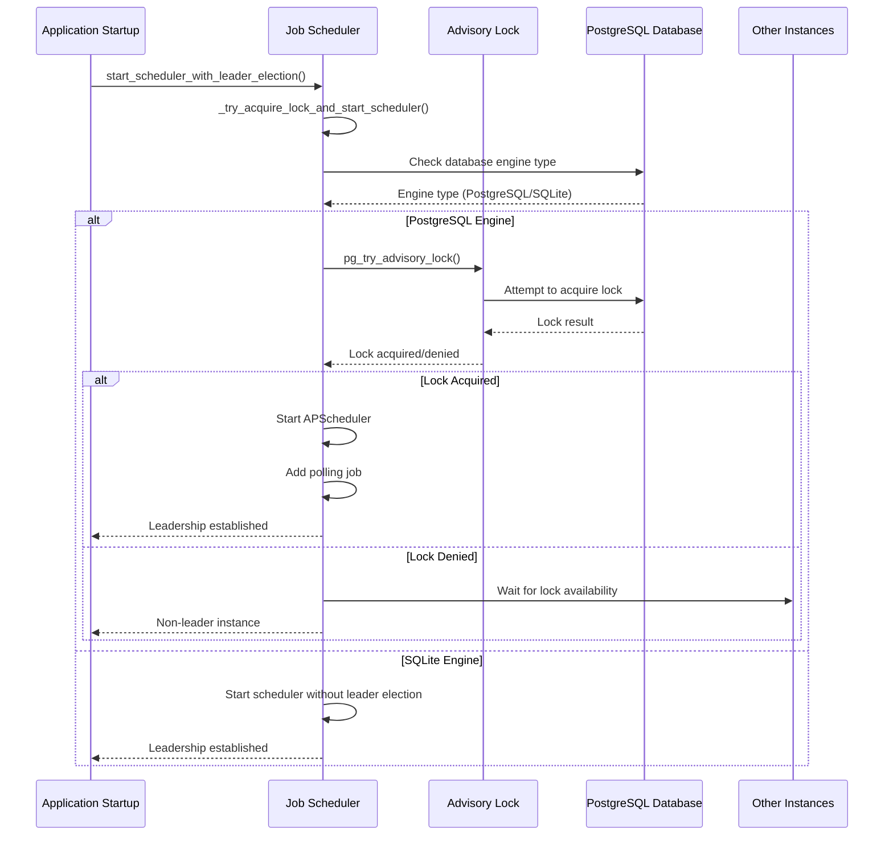

**Diagram sources**
- [scheduler.py](file://letta/jobs/scheduler.py#L25-L106)
- [scheduler.py](file://letta/jobs/scheduler.py#L163-L183)

**Section sources**
- [scheduler.py](file://letta/jobs/scheduler.py#L25-L106)
- [scheduler.py](file://letta/jobs/scheduler.py#L163-L183)

## Leadership Election Mechanism

### _try_acquire_lock_and_start_scheduler Function

The `_try_acquire_lock_and_start_scheduler` function serves as the core leadership election mechanism:

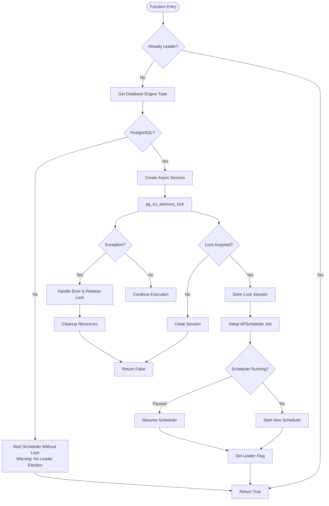

**Diagram sources**
- [scheduler.py](file://letta/jobs/scheduler.py#L25-L106)

### Background Lock Retry Mechanism

When initial lock acquisition fails, the system employs a background retry mechanism:

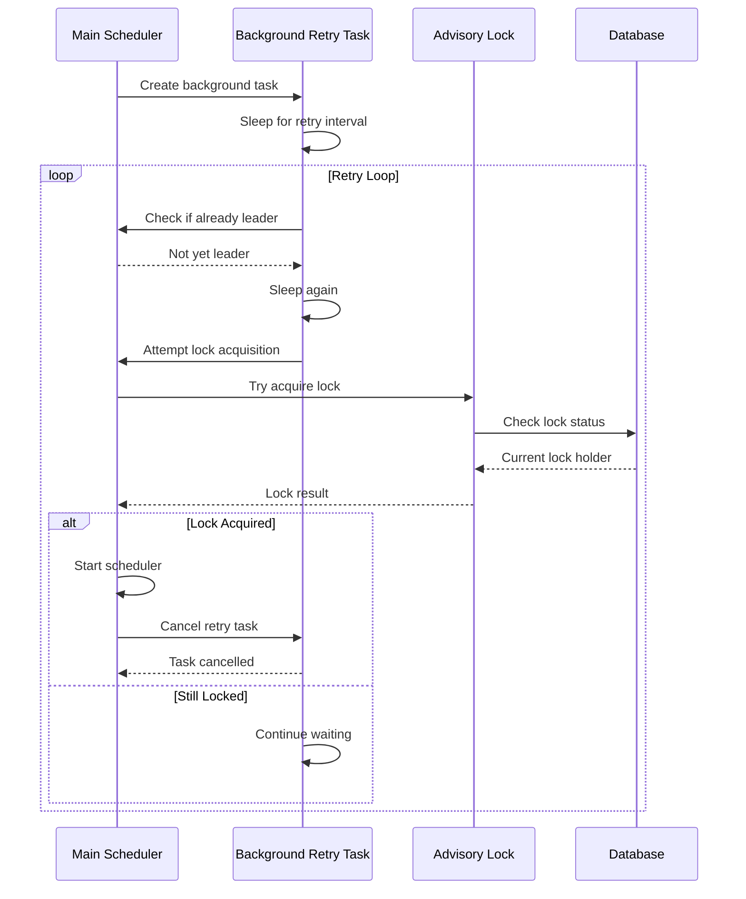

**Diagram sources**
- [scheduler.py](file://letta/jobs/scheduler.py#L108-L134)

**Section sources**
- [scheduler.py](file://letta/jobs/scheduler.py#L25-L106)
- [scheduler.py](file://letta/jobs/scheduler.py#L108-L134)

## Job Status Management

### Status Transition Guards

The job manager implements strict state transition guards to maintain data integrity:

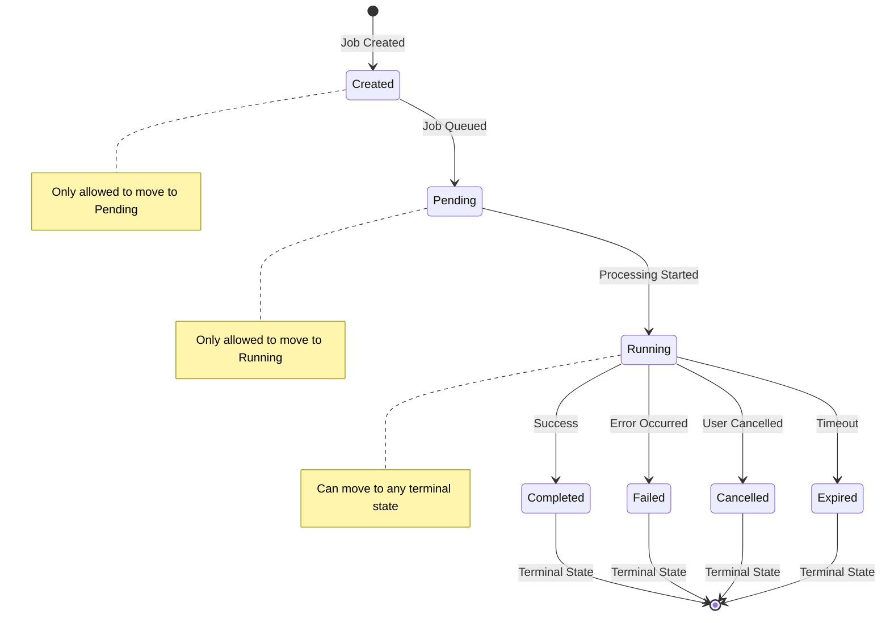

**Diagram sources**
- [job_manager.py](file://letta/services/job_manager.py#L85-L96)
- [enums.py](file://letta/schemas/enums.py#L114-L130)

### Job Status Types and Transitions

The system defines comprehensive job status types with specific transition rules:

| Current Status | Allowed Next Statuses | Description |
|----------------|----------------------|-------------|
| `created` | `pending` | Job queued for processing |
| `pending` | `running` | Processing has begun |
| `running` | `completed`, `failed`, `cancelled`, `expired` | Terminal states |
| `completed` | None | Final state - job succeeded |
| `failed` | None | Final state - job failed |
| `cancelled` | None | Final state - job cancelled |
| `expired` | None | Final state - job timed out |

### Status Update Mechanisms

The scheduler handles job status transitions through multiple pathways:

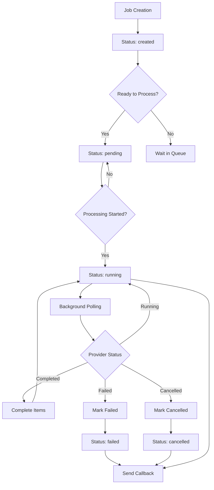

**Diagram sources**
- [job_manager.py](file://letta/services/job_manager.py#L85-L148)
- [llm_batch_job_polling.py](file://letta/jobs/llm_batch_job_polling.py#L120-L167)

**Section sources**
- [job_manager.py](file://letta/services/job_manager.py#L85-L148)
- [enums.py](file://letta/schemas/enums.py#L114-L130)

## Concurrency Control

### Distributed Locking Strategy

The system employs PostgreSQL advisory locks for distributed coordination:

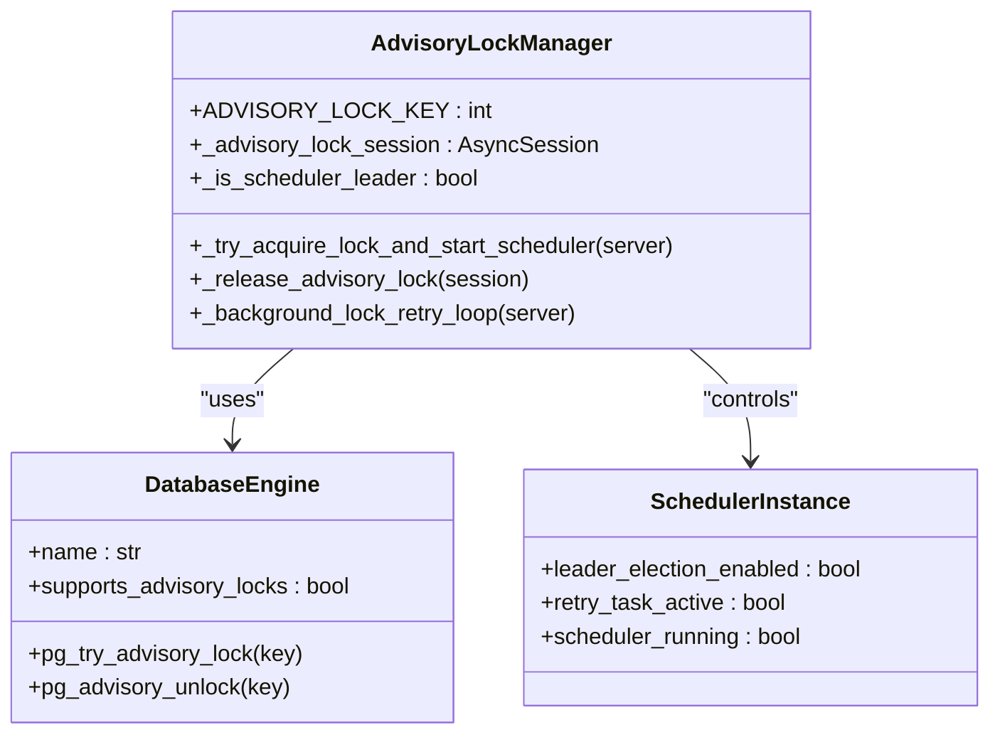

**Diagram sources**
- [scheduler.py](file://letta/jobs/scheduler.py#L18-L23)
- [scheduler.py](file://letta/jobs/scheduler.py#L32-L59)

### Lock Acquisition Process

The lock acquisition process follows a structured approach:

1. **Engine Detection**: Determines database capabilities
2. **Session Management**: Creates dedicated database session for locking
3. **Lock Attempt**: Uses `pg_try_advisory_lock()` for non-blocking acquisition
4. **Resource Management**: Proper session and connection handling
5. **Fallback Strategy**: Graceful degradation for unsupported databases

### Concurrent Job Processing

Multiple scheduler instances can coexist with coordinated job processing:

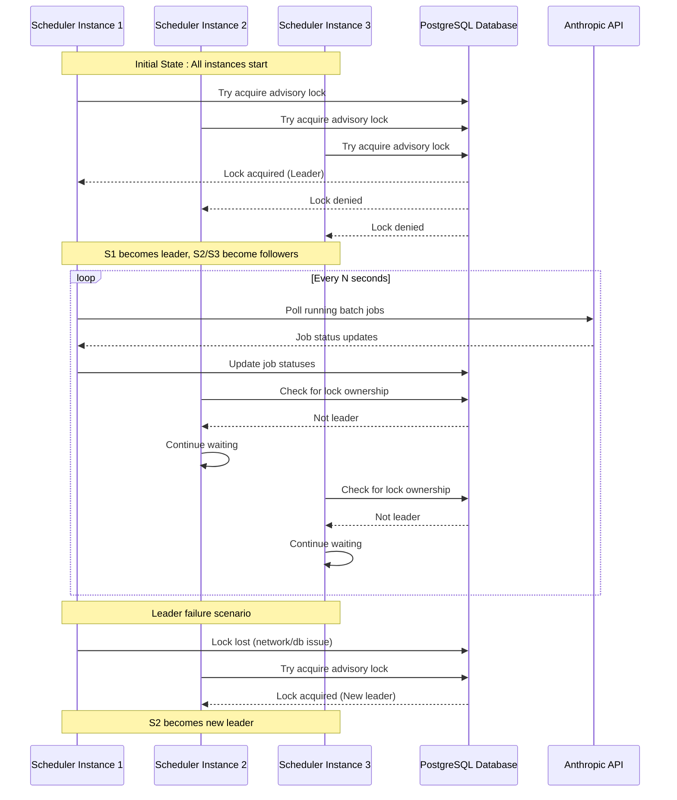

**Diagram sources**
- [scheduler.py](file://letta/jobs/scheduler.py#L108-L134)
- [scheduler.py](file://letta/jobs/scheduler.py#L25-L106)

**Section sources**
- [scheduler.py](file://letta/jobs/scheduler.py#L18-L23)
- [scheduler.py](file://letta/jobs/scheduler.py#L25-L106)
- [scheduler.py](file://letta/jobs/scheduler.py#L108-L134)

## Failure Recovery

### Graceful Shutdown Mechanism

The scheduler implements comprehensive shutdown procedures:

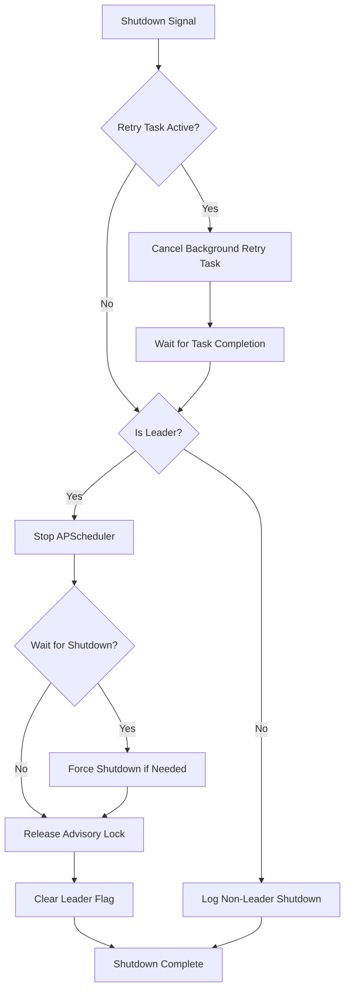

**Diagram sources**
- [scheduler.py](file://letta/jobs/scheduler.py#L185-L229)

### Error Handling Strategies

The system implements multiple layers of error handling:

1. **Lock Acquisition Errors**: Automatic cleanup and retry
2. **Scheduler Startup Failures**: Graceful degradation
3. **Database Connection Issues**: Session management and cleanup
4. **External API Failures**: Retrying and fallback mechanisms

### Recovery Mechanisms

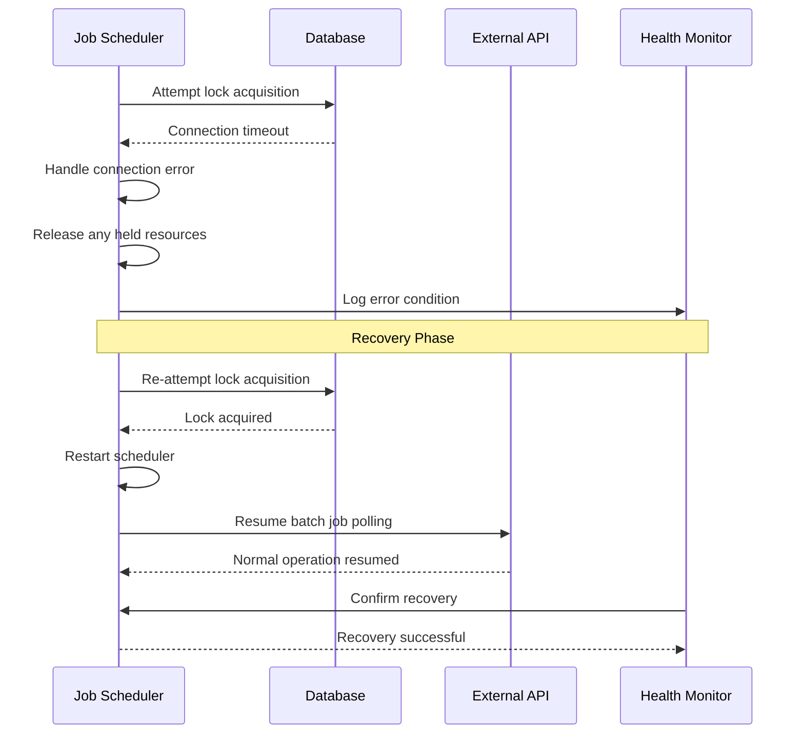

**Diagram sources**
- [scheduler.py](file://letta/jobs/scheduler.py#L82-L106)
- [scheduler.py](file://letta/jobs/scheduler.py#L185-L229)

**Section sources**
- [scheduler.py](file://letta/jobs/scheduler.py#L185-L229)
- [scheduler.py](file://letta/jobs/scheduler.py#L82-L106)

## At-Least-Once Delivery Semantics

### Job Processing Pipeline

The scheduler ensures at-least-once delivery through a robust processing pipeline:

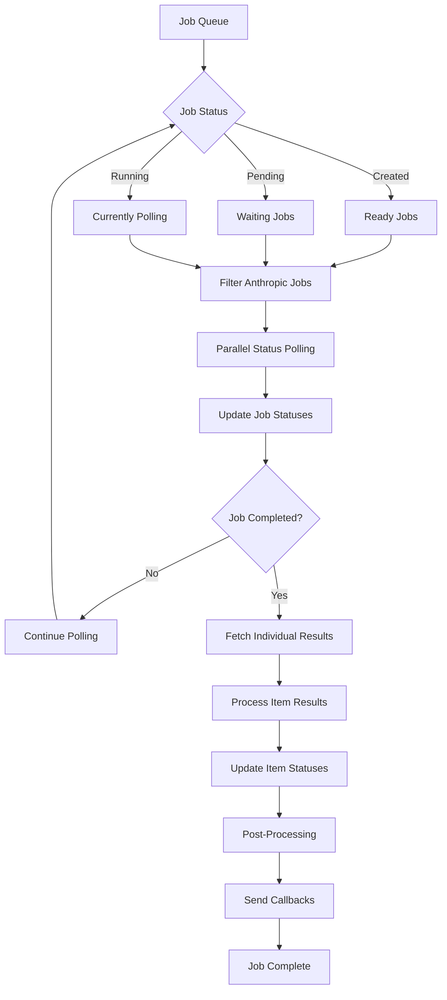

**Diagram sources**
- [llm_batch_job_polling.py](file://letta/jobs/llm_batch_job_polling.py#L170-L248)

### Delivery Guarantees

The system provides several guarantees for reliable job processing:

1. **Idempotent Operations**: Status updates are safe to retry
2. **Transaction Safety**: Database operations use transactions
3. **Error Propagation**: Failed jobs are marked appropriately
4. **Callback Mechanism**: External notifications for completion

### Retry Logic

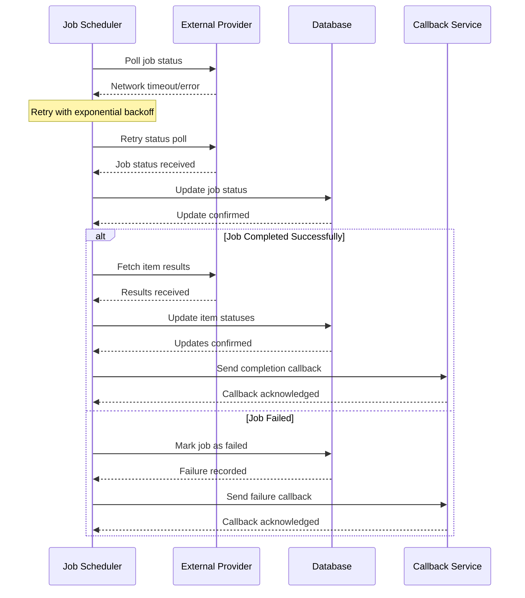

**Diagram sources**
- [llm_batch_job_polling.py](file://letta/jobs/llm_batch_job_polling.py#L41-L62)
- [llm_batch_job_polling.py](file://letta/jobs/llm_batch_job_polling.py#L65-L90)

**Section sources**
- [llm_batch_job_polling.py](file://letta/jobs/llm_batch_job_polling.py#L170-L248)
- [llm_batch_job_polling.py](file://letta/jobs/llm_batch_job_polling.py#L41-L62)

## Performance Considerations

### Polling Optimization

The scheduler implements several performance optimizations:

1. **Interval-Based Polling**: Configurable polling intervals to balance responsiveness and resource usage
2. **Concurrent Processing**: Parallel status checking for multiple jobs
3. **Batch Operations**: Bulk updates for improved database efficiency
4. **Jitter Addition**: Random delays to prevent thundering herd problems

### Resource Management

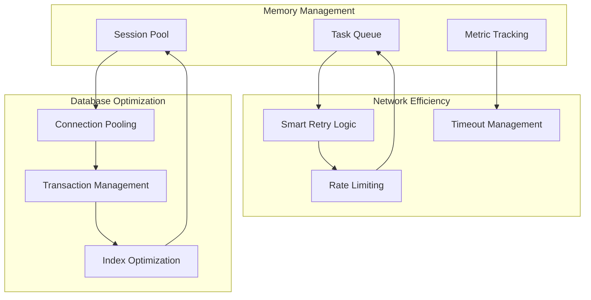

### Scalability Features

- **Horizontal Scaling**: Multiple scheduler instances can operate simultaneously
- **Load Distribution**: Automatic load balancing through leadership election
- **Resource Isolation**: Separate database sessions for lock management
- **Graceful Degradation**: Fallback mechanisms for unsupported databases

**Section sources**
- [scheduler.py](file://letta/jobs/scheduler.py#L60-L72)
- [llm_batch_job_polling.py](file://letta/jobs/llm_batch_job_polling.py#L20-L40)

## Troubleshooting Guide

### Common Issues and Solutions

#### Leadership Election Problems

**Issue**: Scheduler fails to acquire leadership lock
**Symptoms**: 
- "Scheduler lock held by another instance" messages
- Multiple instances claiming leadership
- Jobs not processing consistently

**Solution**:
1. Verify PostgreSQL advisory locks support
2. Check database connection stability
3. Review network connectivity between instances
4. Monitor lock contention patterns

#### Job Status Stuck in Running

**Issue**: Jobs remain in "running" state indefinitely
**Symptoms**:
- Jobs never complete
- Polling loops continue without progress
- Status updates not occurring

**Solution**:
1. Check external API connectivity
2. Verify database write permissions
3. Review error logs for specific failures
4. Implement manual intervention procedures

#### Memory and Resource Leaks

**Issue**: Scheduler consumes increasing resources over time
**Symptoms**:
- Growing memory usage
- Database connection pool exhaustion
- Slow response times

**Solution**:
1. Monitor database connection lifecycle
2. Implement proper resource cleanup
3. Review task cancellation mechanisms
4. Optimize polling intervals

### Monitoring and Diagnostics

Key metrics to monitor:

| Metric | Description | Alert Threshold |
|--------|-------------|-----------------|
| Scheduler Leadership | Current leader status | Single leader instance |
| Job Processing Rate | Jobs processed per minute | Decrease > 20% |
| Polling Success Rate | Percentage of successful polls | Below 95% |
| Database Connection Pool | Active vs. available connections | > 80% utilization |
| Lock Acquisition Time | Time to acquire advisory lock | > 5 seconds |

### Debugging Procedures

1. **Enable Debug Logging**: Set log level to DEBUG for detailed scheduler operations
2. **Database Monitoring**: Track advisory lock usage and contention
3. **Network Analysis**: Monitor external API response times
4. **Performance Profiling**: Measure scheduler overhead and impact

**Section sources**
- [scheduler.py](file://letta/jobs/scheduler.py#L82-L106)
- [scheduler.py](file://letta/jobs/scheduler.py#L185-L229)

## Conclusion

Letta's job scheduler implementation provides a robust, scalable solution for asynchronous job orchestration in distributed environments. The system successfully addresses key challenges through:

- **Distributed Leadership Election**: Ensures single-point-of-execution in clustered deployments
- **Reliable Status Management**: Maintains data integrity through strict state transition guards
- **Failure Resilience**: Implements comprehensive error handling and recovery mechanisms
- **Delivery Semantics**: Provides at-least-once guarantees for critical job processing
- **Performance Optimization**: Balances responsiveness with resource efficiency

The architecture demonstrates best practices for building reliable distributed systems, with clear separation of concerns, comprehensive error handling, and graceful degradation capabilities. The modular design allows for easy extension and customization while maintaining system reliability and performance.

Future enhancements could include additional external provider integrations, enhanced monitoring capabilities, and further optimization of polling strategies based on workload characteristics.