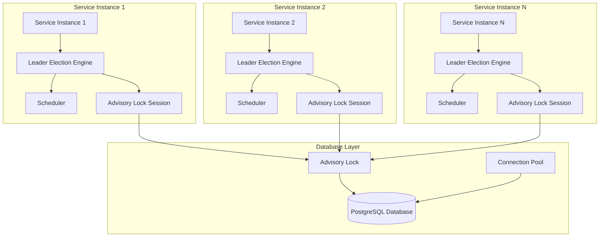
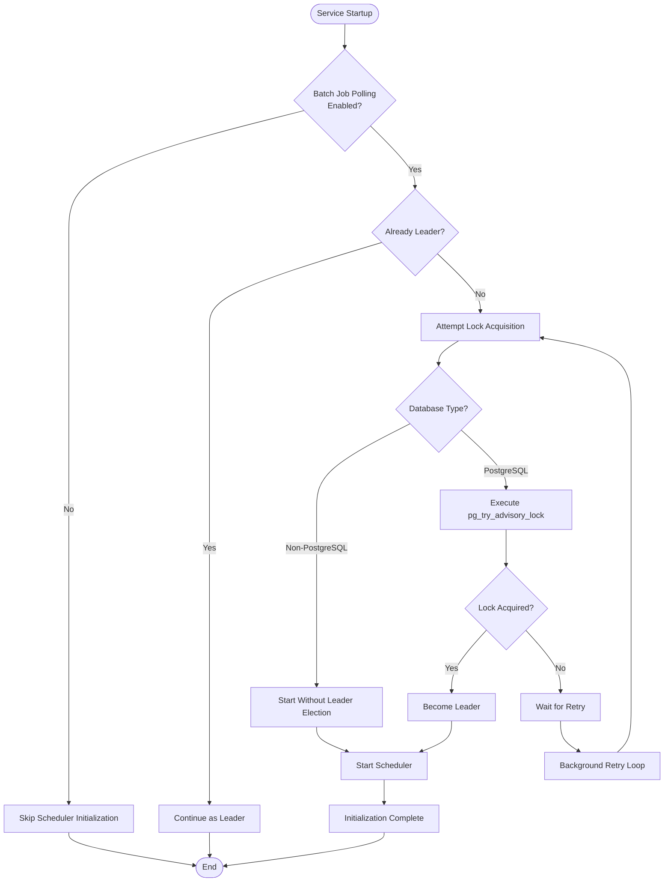
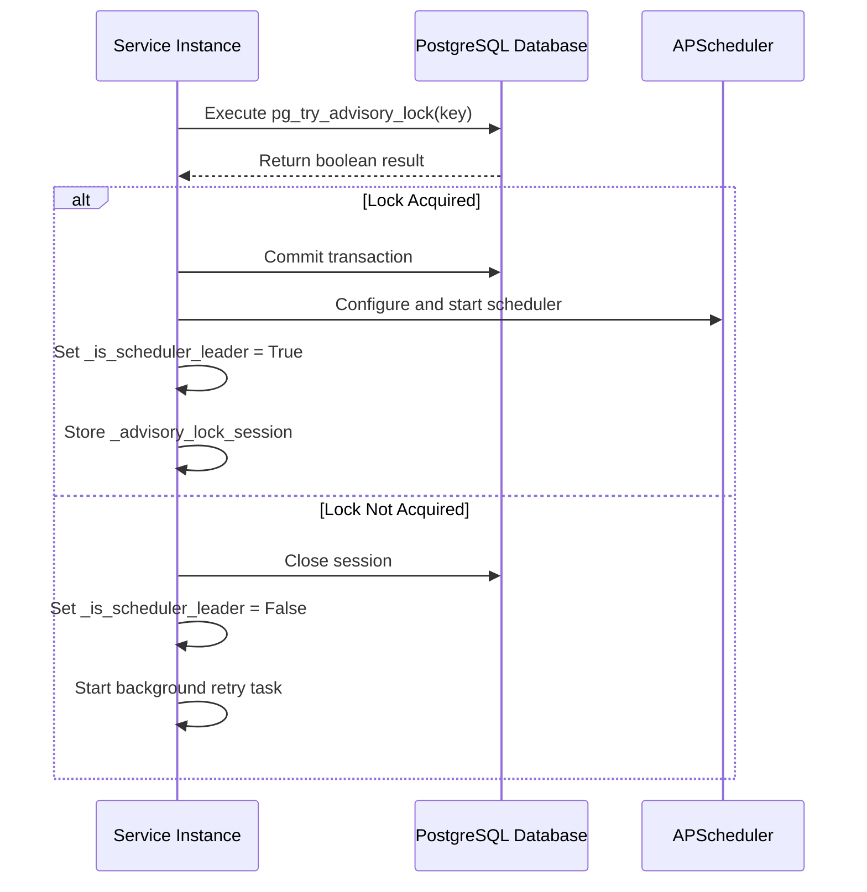
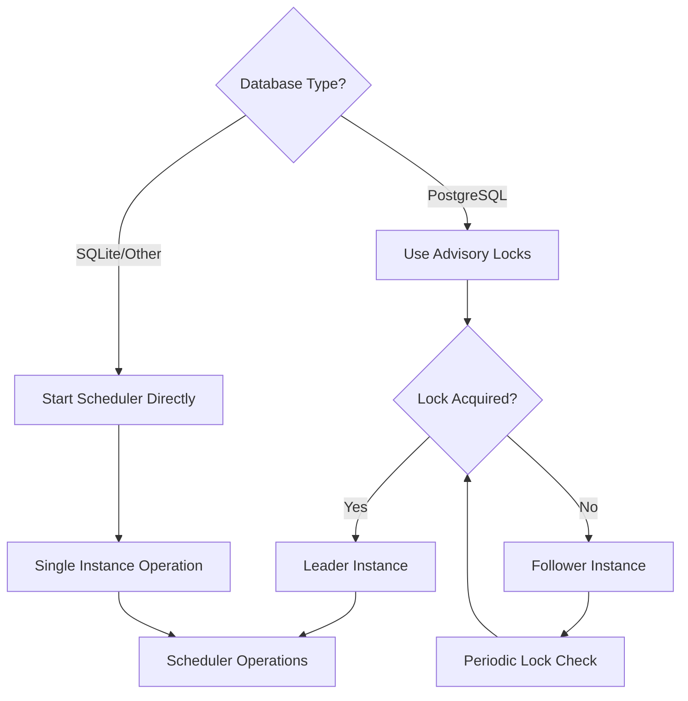
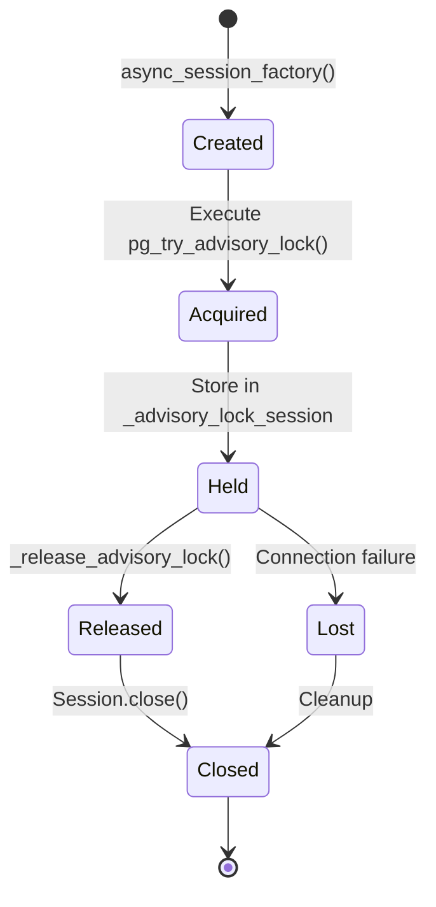
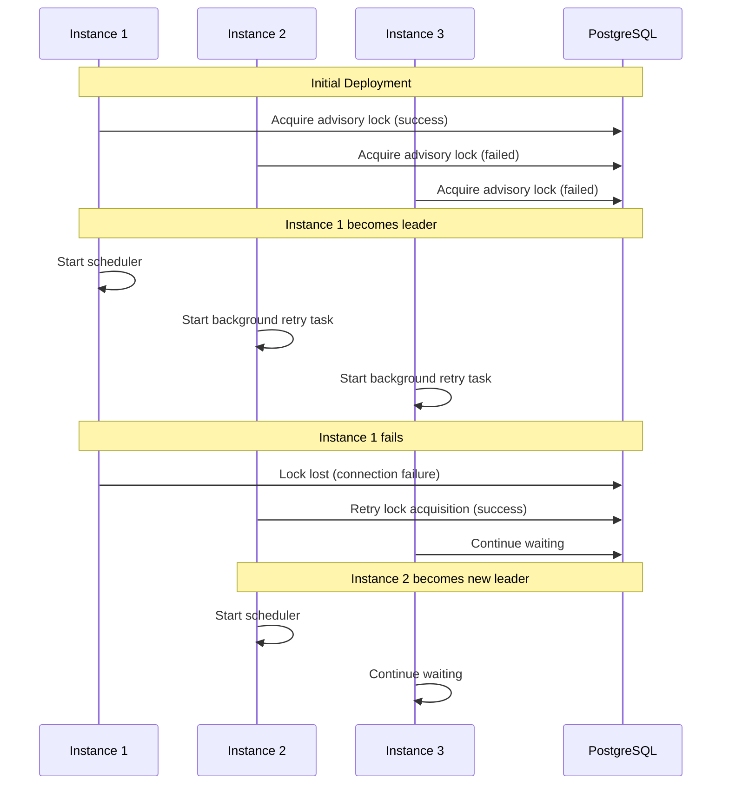
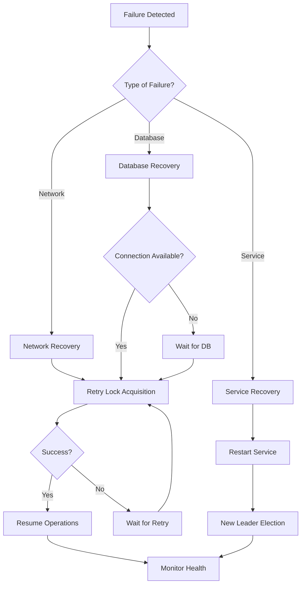

# Leadership Election and Distributed Locking

<cite>
**Referenced Files in This Document**
- [scheduler.py](file://letta/jobs/scheduler.py)
- [llm_batch_job_polling.py](file://letta/jobs/llm_batch_job_polling.py)
- [settings.py](file://letta/settings.py)
- [app.py](file://letta/server/rest_api/app.py)
- [db.py](file://letta/server/db.py)
- [server.py](file://letta/server/server.py)
- [integration_test_batch_api_cron_jobs.py](file://tests/integration_test_batch_api_cron_jobs.py)
</cite>

## Table of Contents
1. [Introduction](#introduction)
2. [System Architecture](#system-architecture)
3. [Core Components](#core-components)
4. [Leadership Election Mechanism](#leadership-election-mechanism)
5. [PostgreSQL Advisory Locks](#postgresql-advisory-locks)
6. [Fallback Behavior](#fallback-behavior)
7. [Session Management](#session-management)
8. [Coordination Between Instances](#coordination-between-instances)
9. [Failure Scenarios and Recovery](#failure-scenarios-and-recovery)
10. [Performance Considerations](#performance-considerations)
11. [Troubleshooting Guide](#troubleshooting-guide)
12. [Best Practices](#best-practices)

## Introduction

Letta's Leadership Election and Distributed Locking sub-system ensures that only one instance of the service runs the scheduler at any given time, preventing job duplication and maintaining system consistency. This critical infrastructure component leverages PostgreSQL advisory locks for reliable leader election while providing graceful fallback mechanisms for non-PostgreSQL databases.

The system operates as a global semaphore mechanism using the `ADVISORY_LOCK_KEY` (0x12345678ABCDEF00) to coordinate scheduler execution across multiple service instances. When multiple instances are deployed, only one becomes the "leader" responsible for running the scheduler, while others remain as followers that periodically attempt to acquire leadership.

## System Architecture

The leadership election system consists of several interconnected components that work together to ensure distributed coordination:



**Diagram sources**
- [scheduler.py](file://letta/jobs/scheduler.py#L16-L22)
- [db.py](file://letta/server/db.py#L48-L58)

## Core Components

### Global State Management

The system maintains three critical global state variables that control leadership and coordination:

| Variable | Type | Purpose | Scope |
|----------|------|---------|-------|
| `_advisory_lock_session` | `Optional[AsyncSession]` | Stores the database session holding the advisory lock | Cross-instance coordination |
| `_is_scheduler_leader` | `bool` | Indicates if current instance is the scheduler leader | Instance-local |
| `_lock_retry_task` | `Optional[asyncio.Task]` | Background task for periodic lock retry attempts | Instance-local |

### Key Constants

The system defines two essential constants for coordination:

| Constant | Value | Purpose |
|----------|-------|---------|
| `ADVISORY_LOCK_KEY` | `0x12345678ABCDEF00` | Global semaphore key for scheduler coordination |
| `scheduler` | `AsyncIOScheduler()` | APScheduler instance for job scheduling |

**Section sources**
- [scheduler.py](file://letta/jobs/scheduler.py#L16-L22)

## Leadership Election Mechanism

The leadership election process follows a deterministic algorithm that ensures only one instance becomes the scheduler leader:



**Diagram sources**
- [scheduler.py](file://letta/jobs/scheduler.py#L25-L106)
- [scheduler.py](file://letta/jobs/scheduler.py#L163-L183)

### Leadership Election Process

The `_try_acquire_lock_and_start_scheduler` function implements the core leadership election logic:

1. **Initial Check**: Verifies if the current instance is already the leader
2. **Database Detection**: Determines the database type to decide on leadership approach
3. **Lock Attempt**: For PostgreSQL databases, executes `pg_try_advisory_lock`
4. **Scheduler Initialization**: Configures and starts the APScheduler with appropriate triggers
5. **State Update**: Sets leadership flags and stores the advisory lock session

**Section sources**
- [scheduler.py](file://letta/jobs/scheduler.py#L25-L106)

## PostgreSQL Advisory Locks

### Advisory Lock Implementation

PostgreSQL advisory locks provide a reliable mechanism for inter-process coordination. Letta uses the `pg_try_advisory_lock` function with the predefined `ADVISORY_LOCK_KEY`:

```sql
SELECT pg_try_advisory_lock(CAST(:lock_key AS bigint))
```

The advisory lock key `0x12345678ABCDEF00` serves as a global semaphore that all service instances monitor. When an instance successfully acquires this lock, it becomes the scheduler leader.

### Lock Acquisition Process



**Diagram sources**
- [scheduler.py](file://letta/jobs/scheduler.py#L45-L58)

### Advisory Lock Session Management

The advisory lock session is critical for maintaining lock ownership:

- **Session Persistence**: The session must remain open while the instance holds the lock
- **Connection Pooling**: Uses the configured database connection pool for efficient session management
- **Automatic Release**: Sessions are automatically released when the instance shuts down

**Section sources**
- [scheduler.py](file://letta/jobs/scheduler.py#L45-L58)
- [db.py](file://letta/server/db.py#L48-L58)

## Fallback Behavior

### Non-PostgreSQL Databases

When the database is not PostgreSQL, the system falls back to a simpler approach:



**Diagram sources**
- [scheduler.py](file://letta/jobs/scheduler.py#L41-L43)

### Fallback Characteristics

- **No Leader Election**: All instances operate independently
- **Potential Duplication**: Multiple instances may run the scheduler simultaneously
- **Graceful Degradation**: System continues functioning without coordination overhead

**Section sources**
- [scheduler.py](file://letta/jobs/scheduler.py#L41-L43)

## Session Management

### Connection Persistence Requirements

Proper session management is crucial for advisory lock validity:

| Aspect | Requirement | Rationale |
|--------|-------------|-----------|
| Session Lifetime | Match advisory lock lifetime | Prevents premature lock release |
| Connection Pooling | Use configured pool settings | Ensures connection availability |
| Error Handling | Proper session cleanup | Prevents connection leaks |
| Timeout Management | Respect database timeouts | Handles network issues |

### Session Lifecycle



**Diagram sources**
- [scheduler.py](file://letta/jobs/scheduler.py#L136-L161)

### Session Cleanup Strategies

The system implements robust session cleanup through multiple mechanisms:

1. **Normal Shutdown**: Graceful release during service termination
2. **Error Handling**: Automatic cleanup during exception scenarios
3. **Connection Pooling**: Automatic connection recycling
4. **Timeout Management**: Prevents indefinite lock holding

**Section sources**
- [scheduler.py](file://letta/jobs/scheduler.py#L136-L161)
- [scheduler.py](file://letta/jobs/scheduler.py#L85-L92)

## Coordination Between Instances

### Multi-Instance Coordination Pattern

When multiple Letta service instances are deployed, they coordinate through the following pattern:



**Diagram sources**
- [scheduler.py](file://letta/jobs/scheduler.py#L108-L134)
- [scheduler.py](file://letta/jobs/scheduler.py#L163-L183)

### Background Retry Mechanism

Instances that fail to acquire the advisory lock immediately start a background retry task:

1. **Task Creation**: Creates an asyncio task for periodic retry attempts
2. **Interval Configuration**: Uses `poll_lock_retry_interval_seconds` setting
3. **Continuous Monitoring**: Periodically attempts lock acquisition
4. **Leadership Transfer**: Takes over leadership when current leader fails

**Section sources**
- [scheduler.py](file://letta/jobs/scheduler.py#L108-L134)
- [settings.py](file://letta/settings.py#L313-L314)

## Failure Scenarios and Recovery

### Common Failure Scenarios

The system handles various failure scenarios gracefully:

| Scenario | Impact | Recovery Strategy |
|----------|--------|-------------------|
| Network Partition | Lock acquisition fails | Automatic retry with exponential backoff |
| Database Connection Loss | Advisory lock lost | Session cleanup and retry |
| Service Crash | Unexpected shutdown | Automatic lock release on restart |
| Configuration Change | Database type change | Dynamic adaptation to new database |

### Failure Recovery Process



**Diagram sources**
- [scheduler.py](file://letta/jobs/scheduler.py#L82-L106)
- [scheduler.py](file://letta/jobs/scheduler.py#L130-L134)

### Error Handling Strategies

The system implements comprehensive error handling:

1. **Exception Propagation**: Critical errors are logged and propagated appropriately
2. **Resource Cleanup**: Automatic cleanup of database sessions and scheduler resources
3. **State Restoration**: Maintains system consistency during error recovery
4. **Monitoring Integration**: Comprehensive logging for operational visibility

**Section sources**
- [scheduler.py](file://letta/jobs/scheduler.py#L82-L106)

## Performance Considerations

### Lock Contention Optimization

The system optimizes for minimal lock contention:

| Optimization | Implementation | Benefit |
|--------------|----------------|---------|
| Immediate Acquisition | First-come-first-served locking | Reduces unnecessary retries |
| Background Retry | Asynchronous retry mechanism | Minimizes blocking operations |
| Connection Pooling | Efficient database connection reuse | Reduces connection overhead |
| Jittered Intervals | Randomized retry intervals | Prevents thundering herd problem |

### Scheduler Performance

The scheduler itself is optimized for high-throughput batch job processing:

- **Concurrent Processing**: Parallel execution of batch status checks
- **Bulk Operations**: Efficient bulk updates for batch status changes
- **Connection Reuse**: Shared HTTP client for Anthropic API calls
- **Caching**: Intelligent caching of frequently accessed data

**Section sources**
- [llm_batch_job_polling.py](file://letta/jobs/llm_batch_job_polling.py#L109-L117)
- [settings.py](file://letta/settings.py#L312-L314)

## Troubleshooting Guide

### Common Issues and Solutions

| Issue | Symptoms | Solution |
|-------|----------|----------|
| Multiple Leaders | Duplicate scheduler execution | Check advisory lock key uniqueness |
| Lock Acquisition Failures | Frequent leader transitions | Verify database connectivity and permissions |
| Connection Pool Exhaustion | Timeout errors during lock acquisition | Adjust connection pool settings |
| Background Task Stuck | Retry task not progressing | Check for asyncio task cancellation |

### Diagnostic Commands

Key diagnostic information can be obtained through:

1. **Database Queries**: Check advisory lock status
2. **Log Analysis**: Review leadership election logs
3. **Connection Monitoring**: Monitor database connection pool usage
4. **Performance Metrics**: Track scheduler execution times

### Debugging Tools

The system provides several debugging capabilities:

- **Verbose Logging**: Detailed logs for leadership election events
- **Metrics Collection**: Performance metrics for scheduler operations
- **Health Checks**: Built-in health monitoring for distributed coordination

**Section sources**
- [scheduler.py](file://letta/jobs/scheduler.py#L82-L106)
- [llm_batch_job_polling.py](file://letta/jobs/llm_batch_job_polling.py#L31-L39)

## Best Practices

### Deployment Recommendations

1. **Database Configuration**: Use PostgreSQL with proper connection pooling
2. **Connection Limits**: Configure appropriate connection pool sizes
3. **Monitoring Setup**: Implement comprehensive monitoring for leadership changes
4. **Backup Strategy**: Ensure database backups include advisory lock state

### Operational Guidelines

1. **Graceful Shutdown**: Always use proper shutdown procedures
2. **Configuration Management**: Maintain consistent configuration across instances
3. **Testing Procedures**: Test leadership election scenarios regularly
4. **Documentation**: Keep operational procedures updated

### Security Considerations

1. **Database Permissions**: Limit advisory lock permissions appropriately
2. **Network Security**: Secure database communication channels
3. **Access Control**: Implement proper access controls for database connections
4. **Audit Logging**: Maintain audit trails for leadership changes

The Leadership Election and Distributed Locking system in Letta provides a robust foundation for coordinating scheduler operations across multiple service instances. By leveraging PostgreSQL advisory locks and implementing comprehensive fallback mechanisms, the system ensures reliable operation while maintaining flexibility for different deployment scenarios.