# Scheduler Lifecycle Management

<cite>
**Referenced Files in This Document**
- [app.py](file://letta/server/rest_api/app.py)
- [scheduler.py](file://letta/jobs/scheduler.py)
- [llm_batch_job_polling.py](file://letta/jobs/llm_batch_job_polling.py)
- [settings.py](file://letta/settings.py)
</cite>

## Table of Contents
1. [Introduction](#introduction)
2. [System Architecture Overview](#system-architecture-overview)
3. [Startup Lifecycle Management](#startup-lifecycle-management)
4. [Shutdown Lifecycle Management](#shutdown-lifecycle-management)
5. [Leader Election Mechanism](#leader-election-mechanism)
6. [Background Retry System](#background-retry-system)
7. [Global State Management](#global-state-management)
8. [Integration with Application Server](#integration-with-application-server)
9. [Error Handling and Edge Cases](#error-handling-and-edge-cases)
10. [Performance Considerations](#performance-considerations)
11. [Troubleshooting Guide](#troubleshooting-guide)
12. [Best Practices](#best-practices)

## Introduction

Letta's scheduler lifecycle management system provides robust coordination for distributed batch job processing through a sophisticated leader election mechanism. The system ensures that only one instance of the application runs the scheduler at any given time, preventing duplicate job processing while maintaining high availability and fault tolerance.

The scheduler manages periodic polling of LLM batch jobs, particularly focusing on Anthropic API batch processing. It employs PostgreSQL advisory locks for leader election and implements a two-phase startup approach with immediate lock acquisition followed by background retry mechanisms.

## System Architecture Overview

The scheduler lifecycle management system consists of several interconnected components that work together to provide reliable distributed scheduling capabilities:

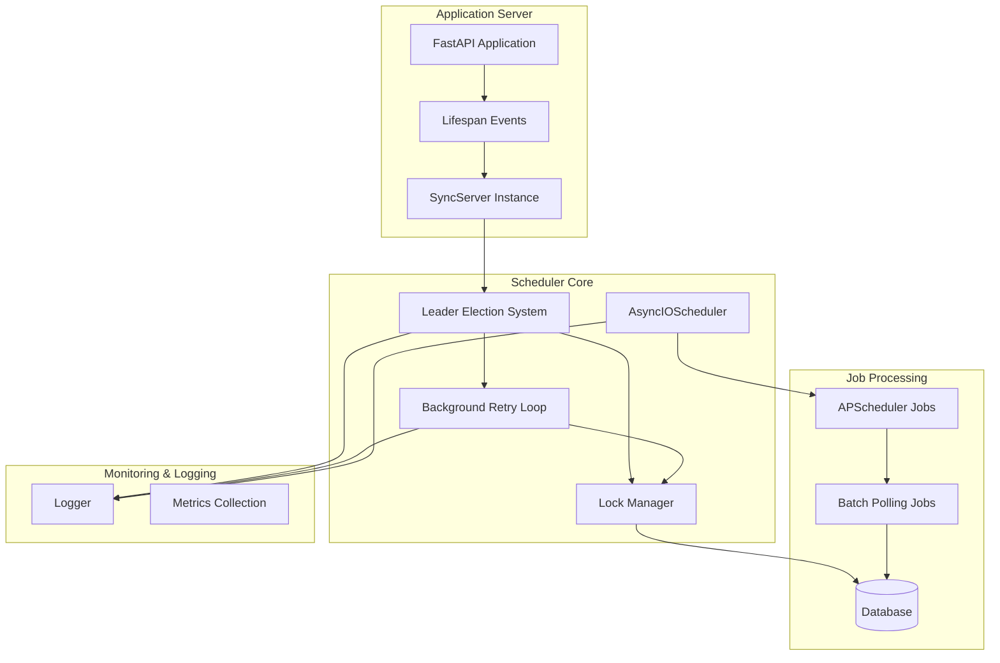

**Diagram sources**
- [app.py](file://letta/server/rest_api/app.py#L163-L196)
- [scheduler.py](file://letta/jobs/scheduler.py#L16-L22)

**Section sources**
- [scheduler.py](file://letta/jobs/scheduler.py#L1-L229)
- [app.py](file://letta/server/rest_api/app.py#L163-L196)

## Startup Lifecycle Management

### start_scheduler_with_leader_election Function

The `start_scheduler_with_leader_election` function serves as the primary entry point for initializing the scheduler with leader election capabilities. This function must be called from the FastAPI application's startup event handler.

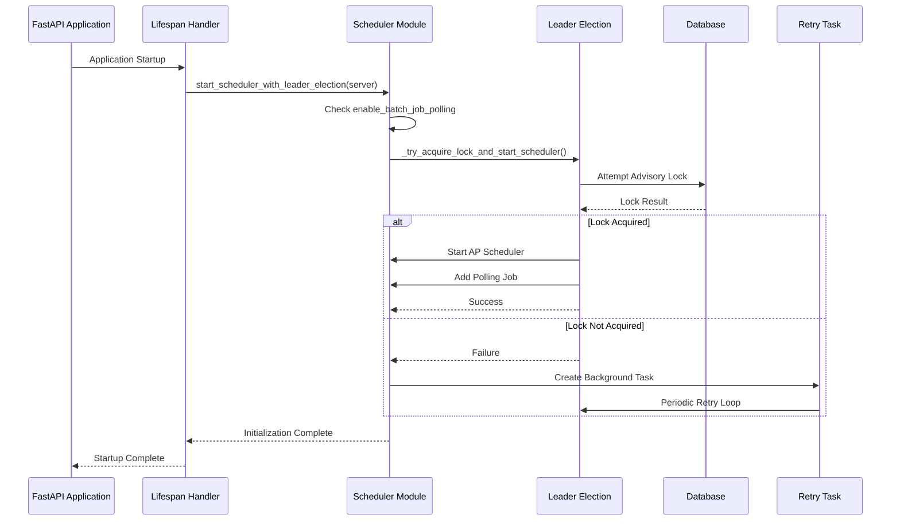

**Diagram sources**
- [scheduler.py](file://letta/jobs/scheduler.py#L163-L183)
- [app.py](file://letta/server/rest_api/app.py#L178-L183)

The function implements a two-phase approach:

1. **Immediate Lock Acquisition Phase**: Attempts to acquire the PostgreSQL advisory lock immediately upon startup
2. **Background Retry Phase**: If initial acquisition fails, creates a background task to periodically retry lock acquisition

**Key Features:**
- **Configuration Validation**: Checks `settings.enable_batch_job_polling` before proceeding
- **Idempotent Operation**: Prevents multiple simultaneous scheduler startups
- **Graceful Degradation**: Continues operation without leader election for non-PostgreSQL databases
- **Resource Management**: Properly handles database sessions and cleanup

**Section sources**
- [scheduler.py](file://letta/jobs/scheduler.py#L163-L183)

### Two-Phase Startup Process

The startup process follows a carefully orchestrated two-phase approach:

#### Phase 1: Immediate Lock Acquisition
The system first attempts to acquire the advisory lock synchronously:

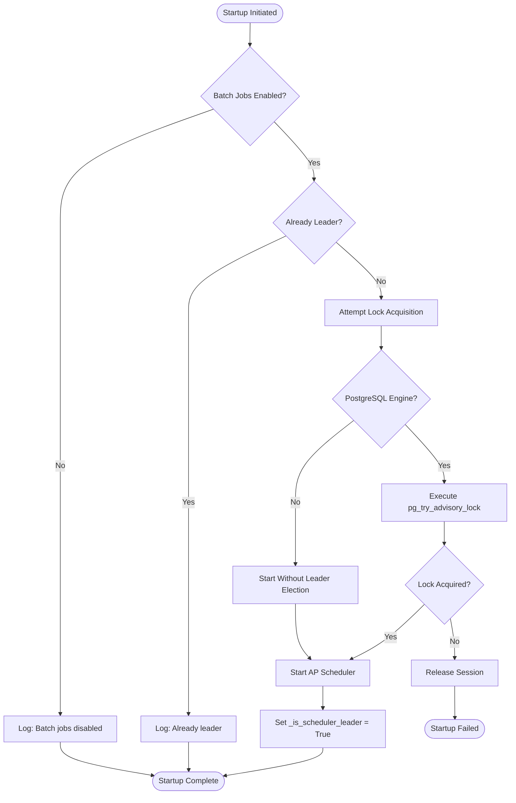

**Diagram sources**
- [scheduler.py](file://letta/jobs/scheduler.py#L25-L80)

#### Phase 2: Background Retry Mechanism
If immediate lock acquisition fails, the system initiates a background retry mechanism:

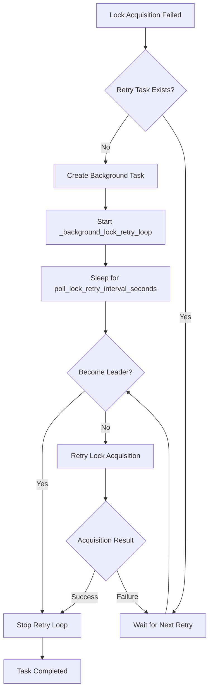

**Diagram sources**
- [scheduler.py](file://letta/jobs/scheduler.py#L108-L134)

**Section sources**
- [scheduler.py](file://letta/jobs/scheduler.py#L108-L134)

## Shutdown Lifecycle Management

### shutdown_scheduler_and_release_lock Function

The `shutdown_scheduler_and_release_lock` function provides comprehensive cleanup for the scheduler during application shutdown. This function must be called from the FastAPI application's shutdown event handler.

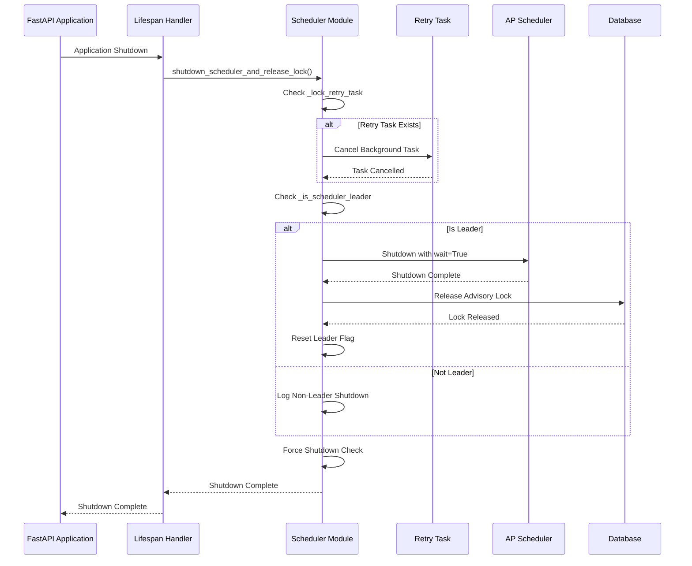

**Diagram sources**
- [scheduler.py](file://letta/jobs/scheduler.py#L185-L228)
- [app.py](file://letta/server/rest_api/app.py#L192-L196)

### Graceful Shutdown Process

The shutdown process implements a careful sequence to ensure proper resource cleanup:

#### Phase 1: Background Task Cleanup
The system first cancels any ongoing background retry tasks:

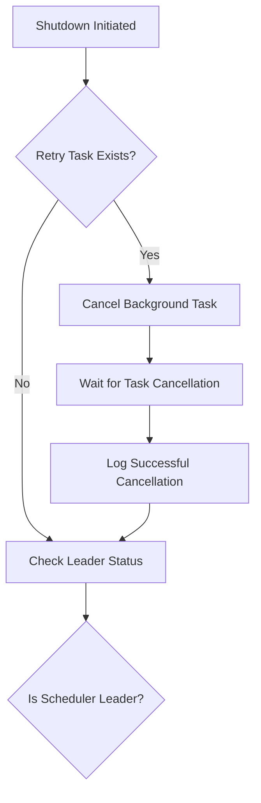

**Diagram sources**
- [scheduler.py](file://letta/jobs/scheduler.py#L192-L202)

#### Phase 2: Scheduler Shutdown
Depending on whether the instance is a leader or follower, different shutdown procedures are executed:

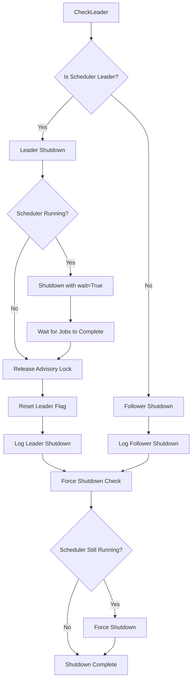

**Diagram sources**
- [scheduler.py](file://letta/jobs/scheduler.py#L204-L228)

**Key Features:**
- **Wait Parameter Importance**: The `wait=True` parameter during scheduler shutdown allows in-progress jobs to complete naturally
- **Resource Cleanup**: Properly closes database sessions and releases advisory locks
- **Idempotent Operations**: Safe to call multiple times without adverse effects
- **Error Resilience**: Handles various failure scenarios gracefully

**Section sources**
- [scheduler.py](file://letta/jobs/scheduler.py#L185-L228)

## Leader Election Mechanism

### PostgreSQL Advisory Lock Implementation

The leader election system relies on PostgreSQL's advisory locks for distributed coordination. This approach provides strong consistency guarantees while maintaining simplicity.

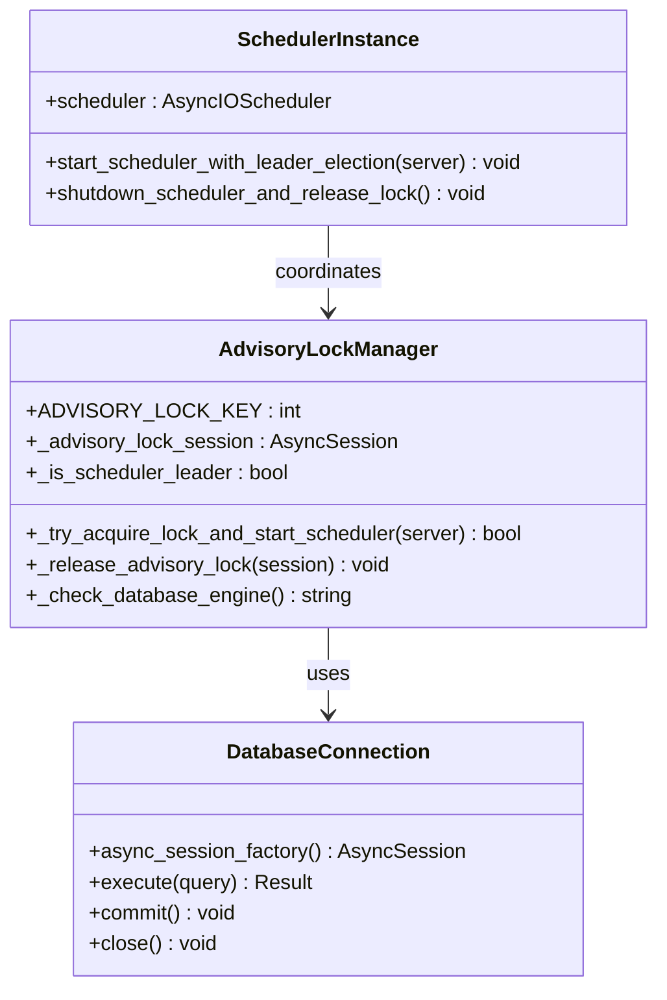

**Diagram sources**
- [scheduler.py](file://letta/jobs/scheduler.py#L16-L22)

### Lock Acquisition Process

The lock acquisition process follows a specific sequence to ensure reliability:

1. **Database Engine Detection**: Determines if PostgreSQL is being used
2. **Session Creation**: Establishes a dedicated database session for lock operations
3. **Lock Attempt**: Executes `pg_try_advisory_lock()` with the predefined lock key
4. **Commit Confirmation**: Commits the transaction to ensure lock persistence
5. **Session Management**: Maintains the session for lock release operations

**Lock Key Details:**
- **Value**: `0x12345678ABCDEF00` (hexadecimal advisory lock key)
- **Purpose**: Unique identifier for Letta's scheduler leadership
- **Persistence**: Held until explicit release or session closure

**Section sources**
- [scheduler.py](file://letta/jobs/scheduler.py#L25-L80)

### Fallback Mechanisms

The system implements intelligent fallback mechanisms for different database scenarios:

#### PostgreSQL Database
- **Full Feature Support**: Advisory locks, leader election, and background retry
- **Strong Consistency**: ACID-compliant lock management
- **Automatic Cleanup**: Sessions automatically closed on application exit

#### Non-PostgreSQL Databases
- **Graceful Degradation**: Starts scheduler without leader election
- **Warning Logging**: Logs database type and degradation notice
- **Continued Operation**: Functional without distributed coordination

**Section sources**
- [scheduler.py](file://letta/jobs/scheduler.py#L41-L44)

## Background Retry System

### _background_lock_retry_loop Implementation

The background retry system provides continuous monitoring for scheduler leadership opportunities. This system operates independently of the main application flow and ensures eventual leadership acquisition.

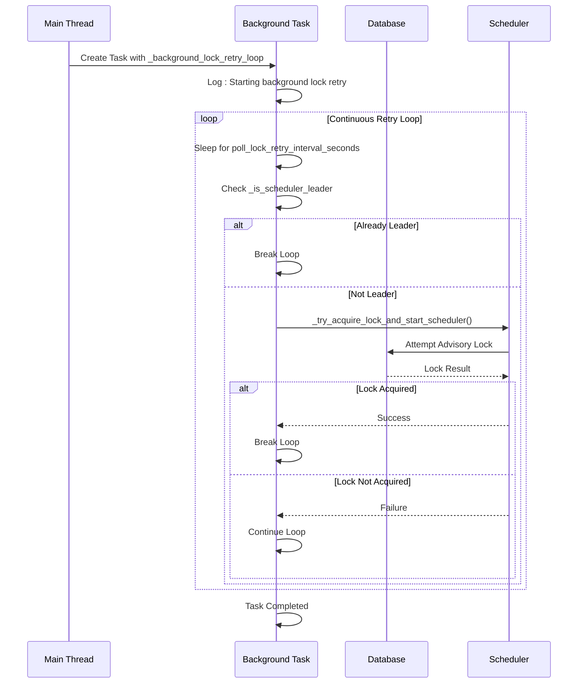

**Diagram sources**
- [scheduler.py](file://letta/jobs/scheduler.py#L108-L134)

### Retry Configuration

The retry system uses configurable timing parameters:

| Parameter | Value | Purpose |
|-----------|-------|---------|
| `poll_lock_retry_interval_seconds` | 480 seconds (8 minutes) | Interval between retry attempts |
| `poll_running_llm_batches_interval_seconds` | 300 seconds (5 minutes) | Job polling frequency |

### Task Lifecycle Management

The background retry task follows a specific lifecycle:

1. **Creation**: Task created during failed initial lock acquisition
2. **Execution**: Runs continuously until leadership acquired or explicitly cancelled
3. **Cancellation**: Gracefully cancelled during application shutdown
4. **Cleanup**: Automatic cleanup on task completion or cancellation

**Section sources**
- [scheduler.py](file://letta/jobs/scheduler.py#L108-L134)

## Global State Management

### Shared State Variables

The scheduler maintains several global state variables to coordinate leadership and lifecycle management:

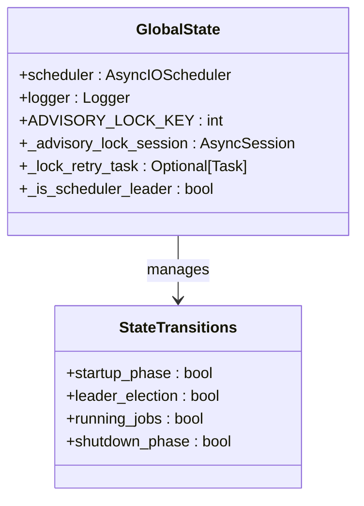

**Diagram sources**
- [scheduler.py](file://letta/jobs/scheduler.py#L16-L22)

### State Variable Descriptions

| Variable | Type | Purpose | Initial Value |
|----------|------|---------|---------------|
| `scheduler` | `AsyncIOScheduler` | Main scheduler instance | Initialized but not started |
| `_advisory_lock_session` | `Optional[AsyncSession]` | Database session for lock | `None` |
| `_lock_retry_task` | `Optional[Task]` | Background retry task handle | `None` |
| `_is_scheduler_leader` | `bool` | Leadership status flag | `False` |

### State Transition Management

The system carefully manages state transitions to prevent race conditions and ensure consistency:

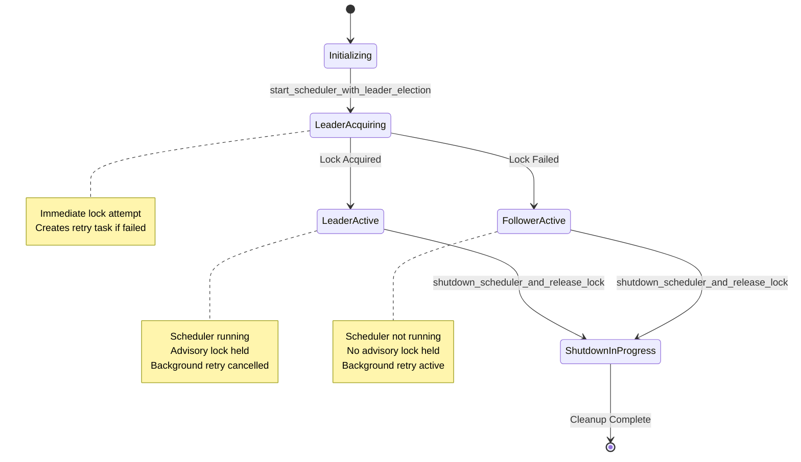

**Diagram sources**
- [scheduler.py](file://letta/jobs/scheduler.py#L163-L228)

**Section sources**
- [scheduler.py](file://letta/jobs/scheduler.py#L16-L22)

## Integration with Application Server

### FastAPI Lifespan Integration

The scheduler lifecycle management integrates seamlessly with FastAPI's lifespan events, ensuring proper coordination with the application server's lifecycle.

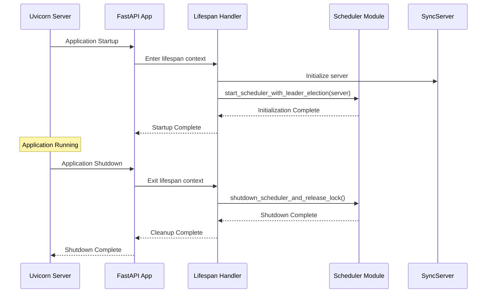

**Diagram sources**
- [app.py](file://letta/server/rest_api/app.py#L163-L196)

### Server Initialization Coordination

The integration ensures proper server initialization before scheduler startup:

1. **Server Initialization**: `server.init_async()` completes successfully
2. **Scheduler Startup**: `start_scheduler_with_leader_election(server)` called
3. **Health Monitoring**: Scheduler startup logged and monitored
4. **Graceful Recovery**: Error handling during startup prevents application crash

### Error Handling Integration

The system integrates with the broader error handling framework:

- **Exception Logging**: Comprehensive error logging with stack traces
- **Graceful Degradation**: Non-fatal errors allow continued operation
- **Monitoring Integration**: Errors reported to monitoring systems
- **Debug Information**: Detailed context provided for troubleshooting

**Section sources**
- [app.py](file://letta/server/rest_api/app.py#L163-L196)

## Error Handling and Edge Cases

### Common Error Scenarios

The scheduler lifecycle management handles various error scenarios gracefully:

#### Database Connection Issues
- **Detection**: Database engine type verification during startup
- **Fallback**: Graceful degradation for non-PostgreSQL databases
- **Logging**: Detailed error reporting with context
- **Recovery**: Automatic retry mechanisms where appropriate

#### Lock Acquisition Failures
- **Immediate Failure**: Clean shutdown of partially initialized components
- **Background Retry**: Automatic retry with exponential backoff
- **Resource Cleanup**: Proper cleanup of database sessions and tasks
- **State Consistency**: Maintains consistent global state

#### Scheduler Startup Failures
- **Partial Initialization**: Cleanup of partially established components
- **Rollback Operations**: Reversal of successful initialization steps
- **Error Propagation**: Appropriate error reporting to application
- **Recovery Strategies**: Multiple recovery approaches for different failure modes

### Edge Case Handling

#### Forced Shutdown Scenarios
The system handles various forced shutdown situations:

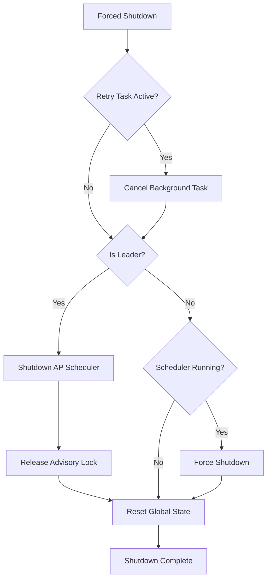

**Diagram sources**
- [scheduler.py](file://letta/jobs/scheduler.py#L192-L228)

#### Concurrent Access Scenarios
- **Race Conditions**: Proper locking prevents concurrent modifications
- **State Inconsistencies**: Atomic state updates prevent inconsistencies
- **Deadlock Prevention**: Careful ordering of operations prevents deadlocks
- **Recovery Mechanisms**: Automatic recovery from inconsistent states

**Section sources**
- [scheduler.py](file://letta/jobs/scheduler.py#L82-L99)

## Performance Considerations

### Timing Configuration

The scheduler uses carefully tuned timing parameters for optimal performance:

| Operation | Default Interval | Rationale |
|-----------|------------------|-----------|
| Lock Retry | 8 minutes | Balances responsiveness with resource usage |
| Job Polling | 5 minutes | Efficient for typical batch job completion times |
| Shutdown Wait | 0.1 seconds | Minimal delay for cleanup operations |

### Resource Management

The system implements efficient resource management strategies:

#### Memory Usage
- **Minimal Footprint**: Background tasks use minimal memory
- **Efficient Logging**: Structured logging minimizes memory overhead
- **Garbage Collection**: Proper cleanup enables efficient GC

#### Database Connections
- **Connection Pooling**: Uses SQLAlchemy's connection pooling
- **Session Management**: Proper session lifecycle management
- **Connection Limits**: Respects database connection limits

#### CPU Usage
- **Asynchronous Operations**: Non-blocking I/O operations
- **Efficient Polling**: Configurable polling intervals
- **Background Processing**: Offloads heavy operations to background tasks

### Scalability Considerations

The system scales effectively across different deployment scenarios:

- **Single Instance**: Full functionality with leader election
- **Multiple Instances**: Automatic leader selection and coordination
- **High Load**: Efficient resource utilization under load
- **Network Partitioning**: Graceful handling of network issues

## Troubleshooting Guide

### Common Issues and Solutions

#### Scheduler Not Starting
**Symptoms**: Scheduler logs indicate startup failure
**Causes**: 
- Database connectivity issues
- Missing PostgreSQL advisory lock support
- Configuration problems

**Solutions**:
1. Verify database connectivity and PostgreSQL installation
2. Check `settings.enable_batch_job_polling` configuration
3. Review database permissions and advisory lock support

#### Leader Election Failures
**Symptoms**: Multiple instances claiming leadership
**Causes**:
- Database connection issues
- Advisory lock conflicts
- Network partitioning

**Solutions**:
1. Check database connectivity and stability
2. Verify PostgreSQL advisory lock support
3. Review network configuration and firewall settings

#### Background Retry Issues
**Symptoms**: Scheduler fails to acquire leadership after startup
**Causes**:
- Database connection timeouts
- Lock contention issues
- Configuration drift

**Solutions**:
1. Monitor database connection health
2. Check for lock contention patterns
3. Verify configuration consistency

### Diagnostic Commands

#### Database Health Check
```sql
-- Check advisory lock support
SELECT pg_try_advisory_lock(CAST('0x12345678ABCDEF00' AS bigint));

-- Check current locks
SELECT * FROM pg_locks WHERE locktype = 'advisory';
```

#### Scheduler Status Check
Monitor application logs for scheduler-related messages:
- Startup initialization messages
- Leader election attempts
- Background retry activity
- Shutdown cleanup operations

### Monitoring and Alerting

Recommended monitoring metrics:
- Scheduler startup success rate
- Leader election timing
- Background retry frequency
- Database connection health
- Job polling success rate

## Best Practices

### Configuration Guidelines

#### Production Deployment
1. **Enable Batch Job Polling**: Set `enable_batch_job_polling = True`
2. **Configure Database**: Use PostgreSQL with advisory lock support
3. **Set Appropriate Intervals**: Adjust polling intervals based on workload
4. **Monitor Resources**: Track memory and CPU usage

#### Development Environment
1. **Disable Batch Jobs**: Set `enable_batch_job_polling = False`
2. **Use SQLite**: Simplifies development setup
3. **Reduce Polling Frequency**: Increase intervals for testing
4. **Enable Debug Logging**: Use detailed logging for troubleshooting

### Operational Procedures

#### Deployment Checklist
- [ ] Verify database connectivity and advisory lock support
- [ ] Confirm `enable_batch_job_polling` configuration
- [ ] Test leader election mechanism
- [ ] Validate background retry functionality
- [ ] Monitor startup and shutdown logs

#### Maintenance Tasks
- Regular monitoring of scheduler health
- Review of error logs and metrics
- Database maintenance and optimization
- Configuration updates and validation

### Security Considerations

#### Database Security
- Use dedicated database user for scheduler operations
- Implement proper database permissions
- Enable SSL/TLS for database connections
- Regular security audits and updates

#### Network Security
- Secure database network access
- Implement proper firewall rules
- Monitor network connectivity
- Use VPN or private networks for database access

**Section sources**
- [scheduler.py](file://letta/jobs/scheduler.py#L163-L228)
- [settings.py](file://letta/settings.py#L312-L316)