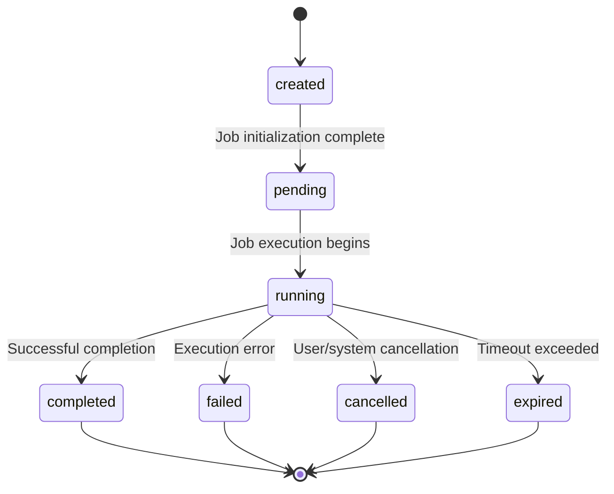
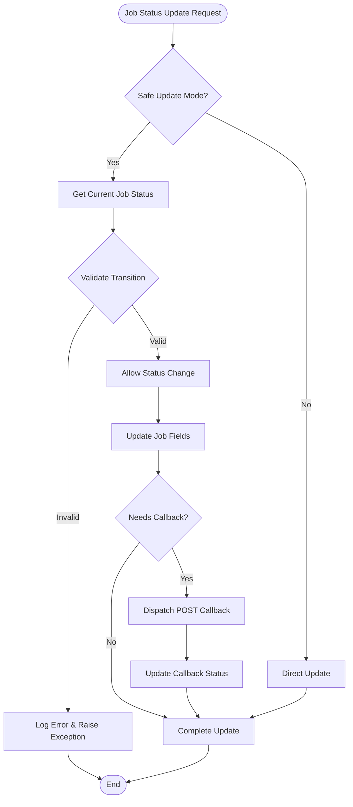
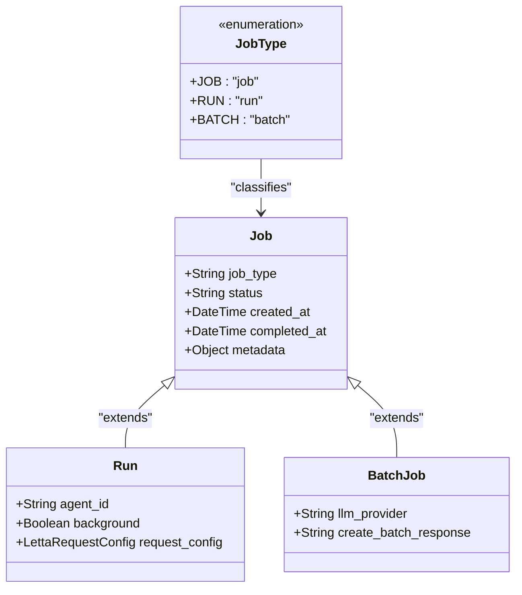
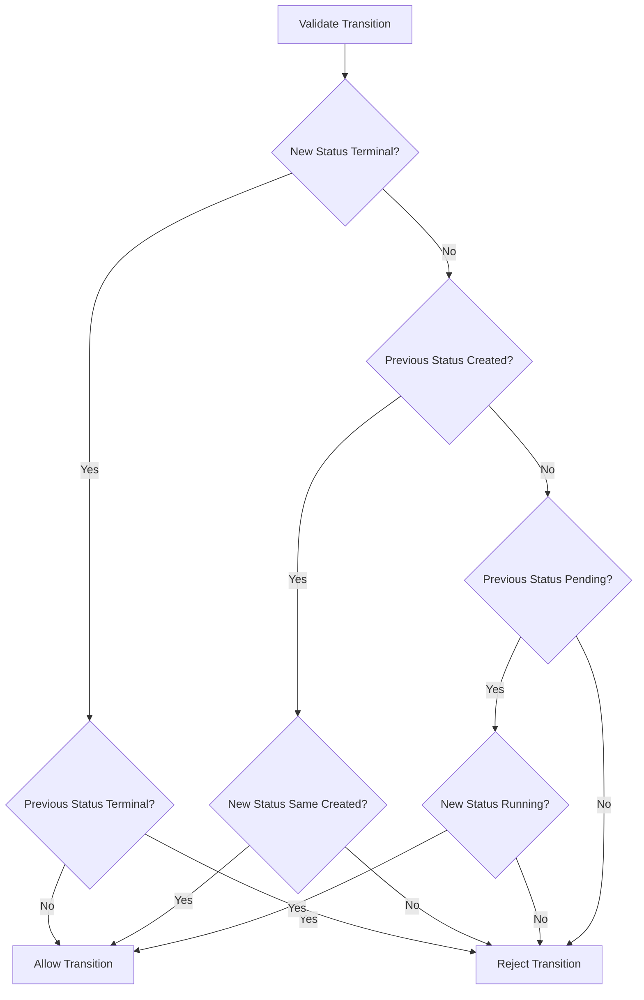
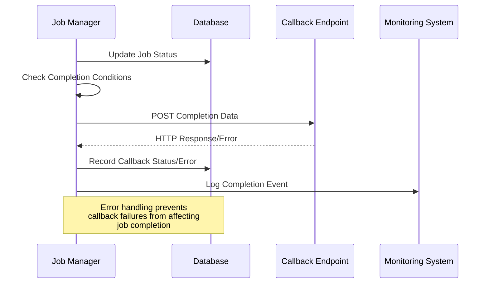
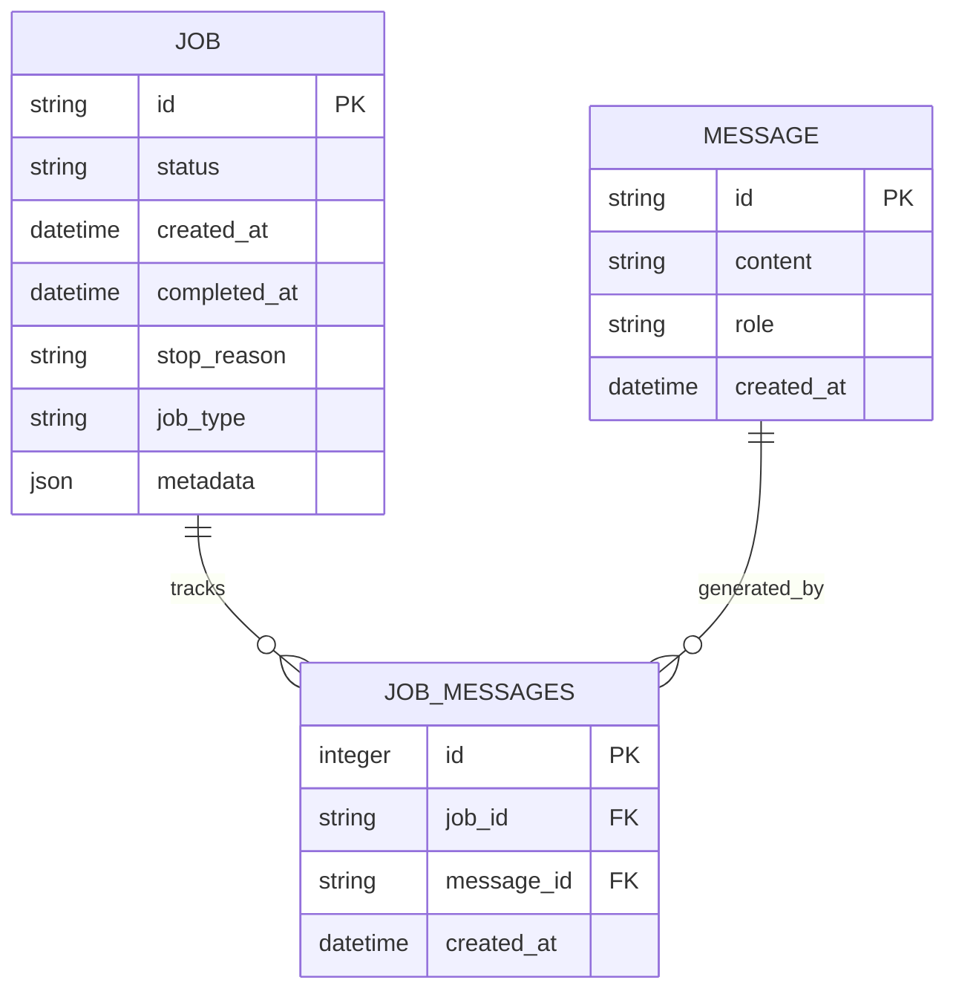
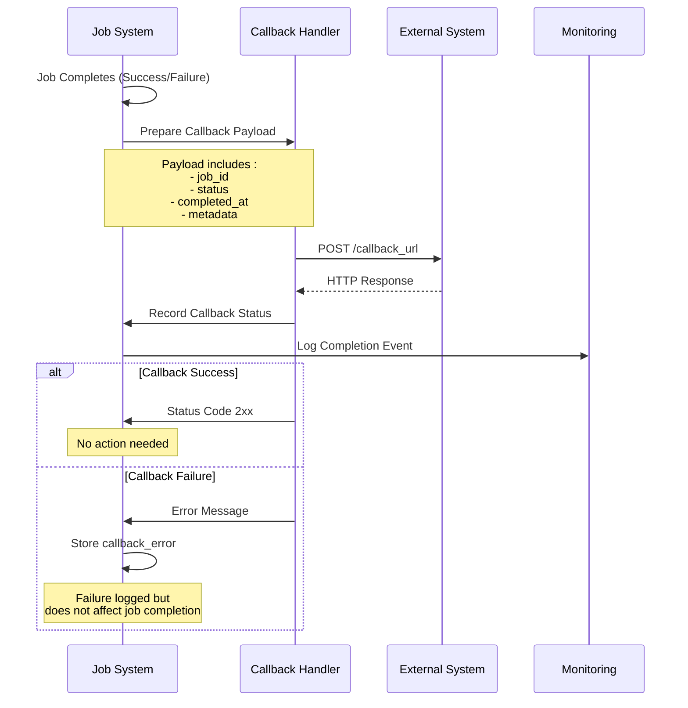
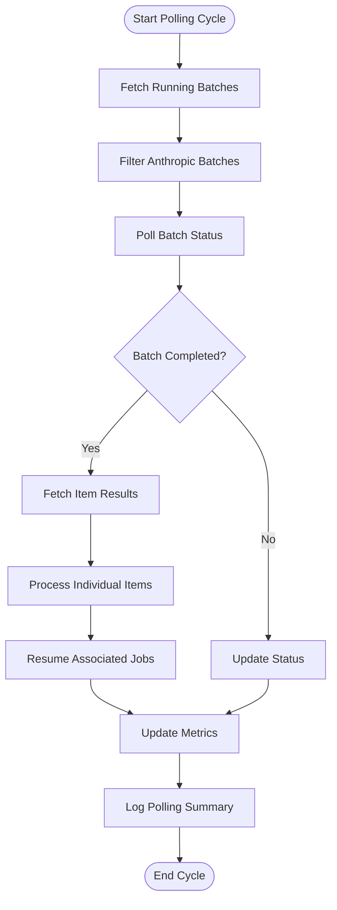
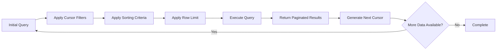
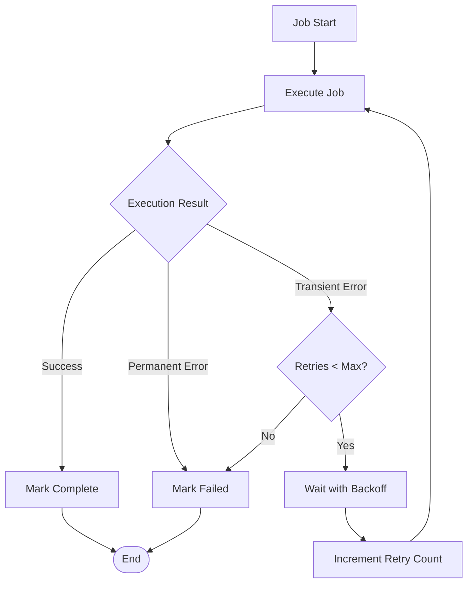

# Job Status Lifecycle

<cite>
**Referenced Files in This Document**
- [letta/orm/job.py](file://letta/orm/job.py)
- [letta/services/job_manager.py](file://letta/services/job_manager.py)
- [letta/schemas/job.py](file://letta/schemas/job.py)
- [letta/schemas/enums.py](file://letta/schemas/enums.py)
- [letta/jobs/types.py](file://letta/jobs/types.py)
- [letta/jobs/llm_batch_job_polling.py](file://letta/jobs/llm_batch_job_polling.py)
- [letta/orm/job_messages.py](file://letta/orm/job_messages.py)
- [alembic/versions/88f9432739a9_add_jobtype_to_job_table.py](file://alembic/versions/88f9432739a9_add_jobtype_to_job_table.py)
- [alembic/versions/8d70372ad130_adding_jobmessages_table.py](file://alembic/versions/8d70372ad130_adding_jobmessages_table.py)
- [alembic/versions/90fd814d0cda_add_callback_error_field_to_jobs.py](file://alembic/versions/90fd814d0cda_add_callback_error_field_to_jobs.py)
- [alembic/versions/7f7933666957_add_stop_reason_to_jobs_table.py](file://alembic/versions/7f7933666957_add_stop_reason_to_jobs_table.py)
- [tests/managers/test_job_manager.py](file://tests/managers/test_job_manager.py)
</cite>

## Table of Contents
1. [Introduction](#introduction)
2. [Job Status Lifecycle Overview](#job-status-lifecycle-overview)
3. [State Machine Architecture](#state-machine-architecture)
4. [Job Types and Classification](#job-types-and-classification)
5. [Status Transition Validation](#status-transition-validation)
6. [Failure Handling and Error Capture](#failure-handling-and-error-capture)
7. [Audit Trail and Message Tracking](#audit-trail-and-message-tracking)
8. [Callback System and Notifications](#callback-system-and-notifications)
9. [Batch Job Processing](#batch-job-processing)
10. [Querying and Monitoring Job Status](#querying-and-monitoring-job-status)
11. [Retry Policies and Timeout Management](#retry-policies-and-timeout-management)
12. [Best Practices and Implementation Guidelines](#best-practices-and-implementation-guidelines)

## Introduction

The Letta job status lifecycle system governs the execution state management of background jobs, runs, and batch operations within the Letta platform. This comprehensive system ensures reliable job processing through a well-defined state machine, robust error handling, and detailed audit trails. The job lifecycle encompasses three primary job types: standard jobs for data processing, runs for agent conversations, and batch jobs for large-scale LLM operations.

## Job Status Lifecycle Overview

The job status lifecycle follows a deterministic state machine with four primary states and two special terminal states. The progression adheres to strict business logic rules designed to prevent invalid state transitions and ensure system reliability.



**Diagram sources**
- [letta/schemas/enums.py](file://letta/schemas/enums.py#L115-L131)
- [letta/services/job_manager.py](file://letta/services/job_manager.py#L85-L182)

### Core Status Definitions

The job status system defines seven distinct states, each serving specific operational purposes:

| Status | Description | Terminal State | Business Logic |
|--------|-------------|----------------|----------------|
| `created` | Job initialized but not yet processed | No | Initial state after job creation |
| `pending` | Job queued and awaiting execution | No | Resource allocation and preparation phase |
| `running` | Active execution in progress | No | Primary processing state |
| `completed` | Successful job completion | Yes | Final successful termination |
| `failed` | Job execution terminated due to error | Yes | Error condition reached |
| `cancelled` | Job manually terminated by user/system | Yes | User-initiated or system intervention |
| `expired` | Job timed out or exceeded limits | Yes | Automatic termination due to timeout |

**Section sources**
- [letta/schemas/enums.py](file://letta/schemas/enums.py#L115-L131)

## State Machine Architecture

The job state machine implements strict transition validation to prevent invalid state changes and maintain system integrity. The architecture enforces business rules through comprehensive validation logic.

### Transition Validation Logic

The job manager implements sophisticated state transition guards that validate each status change against business requirements:



**Diagram sources**
- [letta/services/job_manager.py](file://letta/services/job_manager.py#L85-L182)

### Terminal State Detection

The system distinguishes between transient and terminal states using the `is_terminal` property, enabling appropriate business logic for completion handling:

**Section sources**
- [letta/services/job_manager.py](file://letta/services/job_manager.py#L85-L182)

## Job Types and Classification

The job_type field introduced in migration 88f9432739a9 differentiates between three distinct job categories, each requiring specialized handling and state management approaches.

### Job Type Enumeration



**Diagram sources**
- [letta/schemas/enums.py](file://letta/schemas/enums.py#L209-L213)
- [letta/schemas/job.py](file://letta/schemas/job.py#L46-L91)

### Job Type Characteristics

| Job Type | Purpose | Special Features | State Handling |
|----------|---------|------------------|----------------|
| `JOB` | General data processing | Standard job processing | Full lifecycle support |
| `RUN` | Agent conversation sessions | Agent association, background mode | Enhanced messaging support |
| `BATCH` | Large-scale LLM operations | Provider-specific processing, batch polling | Advanced completion detection |

**Section sources**
- [letta/schemas/job.py](file://letta/schemas/job.py#L53-L91)
- [alembic/versions/88f9432739a9_add_jobtype_to_job_table.py](file://alembic/versions/88f9432739a9_add_jobtype_to_job_table.py#L28-L35)

## Status Transition Validation

The job status transition system implements comprehensive validation to prevent invalid state changes and maintain system consistency. The validation logic operates in two modes: safe updates with strict validation and direct updates for administrative purposes.

### Safe Update Validation

Safe updates enforce strict business rules through multi-condition validation:



**Diagram sources**
- [letta/services/job_manager.py](file://letta/services/job_manager.py#L88-L96)

### Validation Rules

The system enforces the following transition rules:

1. **Terminal State Restriction**: Only non-terminal states can transition to terminal states
2. **Created State Preservation**: Once a job enters any state other than 'created', it cannot return to 'created'
3. **Pending to Running Transition**: Only 'pending' jobs can transition to 'running'
4. **Sequential Progression**: States must progress in logical order (created → pending → running)

**Section sources**
- [letta/services/job_manager.py](file://letta/services/job_manager.py#L85-L96)

## Failure Handling and Error Capture

The job system implements comprehensive error handling through the stop_reason and callback_error fields, providing detailed failure context for debugging and monitoring.

### Stop Reason Classification

The stop_reason field captures the specific reason for job termination, enabling precise failure analysis:

| Stop Reason | Description | Common Causes |
|-------------|-------------|---------------|
| `user_cancelled` | User manually cancelled the job | Manual intervention |
| `timeout_exceeded` | Job exceeded configured timeout | Resource constraints |
| `resource_limit_exceeded` | System resource limitations | Memory/CPU exhaustion |
| `validation_error` | Input validation failed | Invalid parameters |
| `provider_error` | External service failure | API errors, network issues |
| `internal_error` | System internal failure | Code bugs, unexpected conditions |

### Error Field Management

The callback_error field specifically captures HTTP callback-related failures, ensuring notification system reliability:



**Diagram sources**
- [letta/services/job_manager.py](file://letta/services/job_manager.py#L483-L536)
- [alembic/versions/90fd814d0cda_add_callback_error_field_to_jobs.py](file://alembic/versions/90fd814d0cda_add_callback_error_field_to_jobs.py#L28-L30)

**Section sources**
- [letta/services/job_manager.py](file://letta/services/job_manager.py#L483-L536)
- [alembic/versions/7f7933666957_add_stop_reason_to_jobs_table.py](file://alembic/versions/7f7933666957_add_stop_reason_to_jobs_table.py#L24-L25)

## Audit Trail and Message Tracking

The job_messages table provides comprehensive audit trails by linking job execution events with the messages generated during processing. This relationship enables detailed analysis of job behavior and debugging capabilities.

### Job Messages Relationship



**Diagram sources**
- [letta/orm/job_messages.py](file://letta/orm/job_messages.py#L13-L34)
- [alembic/versions/8d70372ad130_adding_jobmessages_table.py](file://alembic/versions/8d70372ad130_adding_jobmessages_table.py#L28-L42)

### Audit Trail Benefits

The job_messages relationship provides several critical benefits:

1. **Execution Traceability**: Complete visibility into which messages were generated by each job
2. **Performance Analysis**: Correlation between job execution and message processing
3. **Debugging Support**: Detailed reconstruction of job execution flow
4. **Compliance Reporting**: Comprehensive audit trails for regulatory requirements

**Section sources**
- [letta/orm/job_messages.py](file://letta/orm/job_messages.py#L13-L34)
- [alembic/versions/8d70372ad130_adding_jobmessages_table.py](file://alembic/versions/8d70372ad130_adding_jobmessages_table.py#L28-L42)

## Callback System and Notifications

The callback system enables external notification of job completion through HTTP POST requests, supporting asynchronous job processing workflows and integration with external systems.

### Callback Architecture



**Diagram sources**
- [letta/services/job_manager.py](file://letta/services/job_manager.py#L483-L536)

### Callback Data Structure

The callback payload includes comprehensive job information for external processing:

```json
{
  "job_id": "job-uuid-here",
  "status": "completed",
  "completed_at": "2024-01-15T10:30:00Z",
  "metadata": {
    "source_id": "source-123",
    "processing_time": 120.5,
    "message_count": 42
  }
}
```

### Callback Error Handling

The system implements resilient callback handling that prevents notification failures from affecting job completion:

**Section sources**
- [letta/services/job_manager.py](file://letta/services/job_manager.py#L483-L536)
- [alembic/versions/90fd814d0cda_add_callback_error_field_to_jobs.py](file://alembic/versions/90fd814d0cda_add_callback_error_field_to_jobs.py#L28-L30)

## Batch Job Processing

Batch job processing introduces sophisticated polling mechanisms for managing large-scale LLM operations, particularly with providers like Anthropic that offer batch processing capabilities.

### Batch Polling Architecture



**Diagram sources**
- [letta/jobs/llm_batch_job_polling.py](file://letta/jobs/llm_batch_job_polling.py#L170-L248)

### Batch Processing Features

The batch job system provides advanced capabilities for managing large-scale operations:

1. **Concurrent Polling**: Multiple batch jobs polled simultaneously for efficiency
2. **Item-Level Results**: Individual processing results for each batch item
3. **Automatic Resumption**: Seamless continuation of dependent jobs
4. **Metrics Tracking**: Comprehensive performance monitoring

**Section sources**
- [letta/jobs/llm_batch_job_polling.py](file://letta/jobs/llm_batch_job_polling.py#L170-L248)

## Querying and Monitoring Job Status

The job system provides comprehensive querying capabilities through the JobManager, supporting various filtering, sorting, and pagination options for effective monitoring and management.

### Query Capabilities

The JobManager supports sophisticated job querying with multiple filtering criteria:

| Filter Parameter | Type | Purpose | Example Usage |
|------------------|------|---------|---------------|
| `statuses` | List[JobStatus] | Filter by specific status values | `[JobStatus.completed, JobStatus.failed]` |
| `job_type` | JobType | Filter by job category | `JobType.BATCH` |
| `source_id` | String | Filter by source association | `"source-123"` |
| `stop_reason` | StopReasonType | Filter by completion reason | `"timeout_exceeded"` |
| `background` | Boolean | Filter by execution mode | `True` for background jobs |
| `agent_ids` | List[String] | Filter by agent association | `["agent-123", "agent-456"]` |

### Pagination and Sorting

The system supports cursor-based pagination for efficient large dataset navigation:



**Diagram sources**
- [letta/services/job_manager.py](file://letta/services/job_manager.py#L203-L304)

**Section sources**
- [letta/services/job_manager.py](file://letta/services/job_manager.py#L203-L304)

## Retry Policies and Timeout Management

The job system implements robust retry mechanisms and timeout management to handle transient failures and ensure reliable job processing under various conditions.

### Retry Strategy Implementation



### Timeout Configuration

The system supports multiple timeout mechanisms:

1. **Job-Level Timeout**: Total execution time limit
2. **Polling Interval**: Batch job polling frequency
3. **Callback Timeout**: External notification timeout
4. **Connection Timeout**: Network operation timeouts

### Error Recovery Patterns

The job system implements several error recovery patterns:

- **Exponential Backoff**: Increasing delays between retry attempts
- **Circuit Breaker**: Temporary suspension of failing operations
- **Graceful Degradation**: Reduced functionality during partial failures
- **Fallback Mechanisms**: Alternative processing paths

**Section sources**
- [letta/jobs/llm_batch_job_polling.py](file://letta/jobs/llm_batch_job_polling.py#L41-L62)

## Best Practices and Implementation Guidelines

### Job Creation and Initialization

When creating new jobs, follow these best practices:

1. **Set Appropriate Job Types**: Choose the correct job type based on operation requirements
2. **Provide Meaningful Metadata**: Include relevant contextual information
3. **Configure Callbacks Wisely**: Use callbacks only when necessary for external integration
4. **Set Reasonable Timeouts**: Configure timeouts based on expected processing duration

### Status Monitoring and Management

Effective job monitoring requires:

1. **Regular Status Checks**: Implement periodic status polling for long-running jobs
2. **Error Pattern Recognition**: Establish patterns for common failure scenarios
3. **Performance Metrics**: Track completion times and success rates
4. **Alert Configuration**: Set up notifications for failed or delayed jobs

### Batch Job Optimization

For optimal batch job performance:

1. **Size Optimization**: Balance batch sizes for throughput vs. latency
2. **Parallel Processing**: Leverage concurrent batch processing where possible
3. **Resource Planning**: Allocate sufficient resources for batch operations
4. **Monitoring Integration**: Integrate batch metrics with overall system monitoring

### Error Handling Strategies

Implement comprehensive error handling:

1. **Graceful Degradation**: Maintain system functionality during partial failures
2. **Detailed Logging**: Capture comprehensive error context for debugging
3. **User Communication**: Provide meaningful error messages to users
4. **Recovery Procedures**: Implement automated recovery where possible

**Section sources**
- [tests/managers/test_job_manager.py](file://tests/managers/test_job_manager.py#L109-L200)