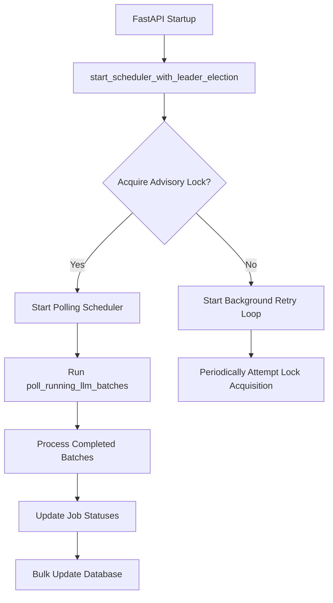
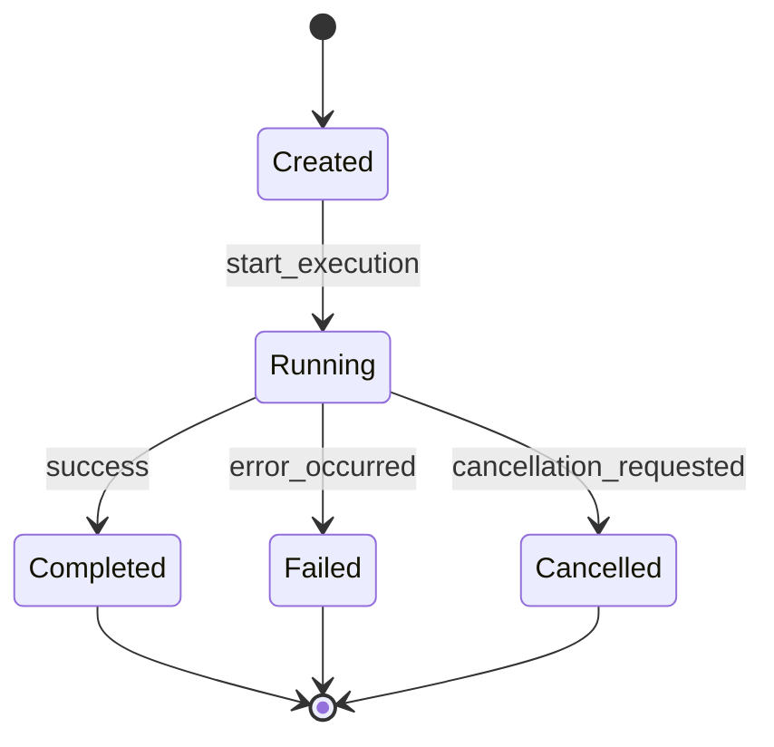
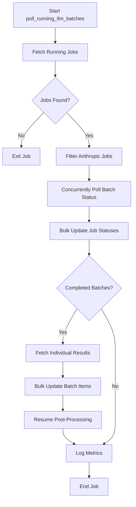
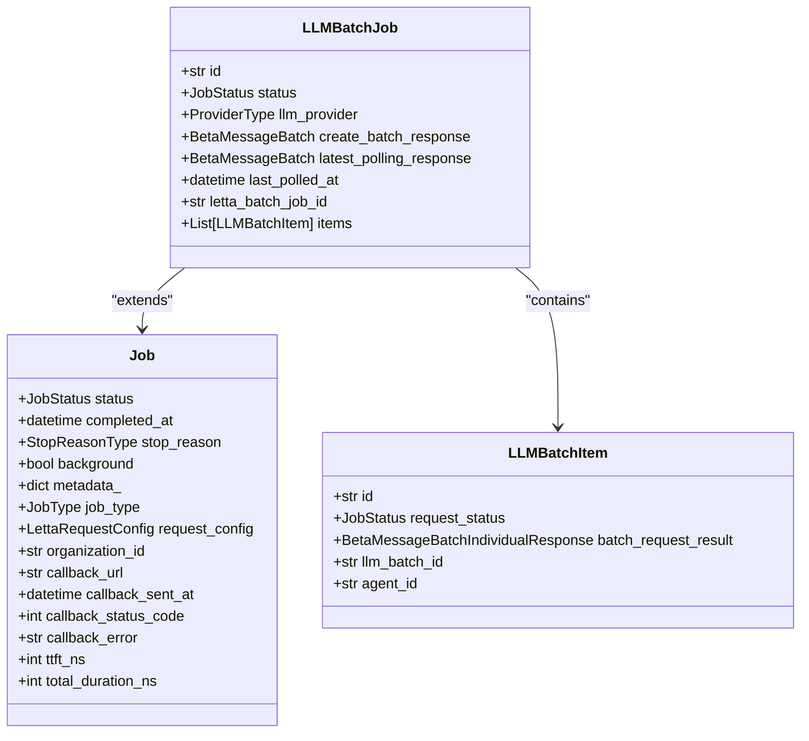
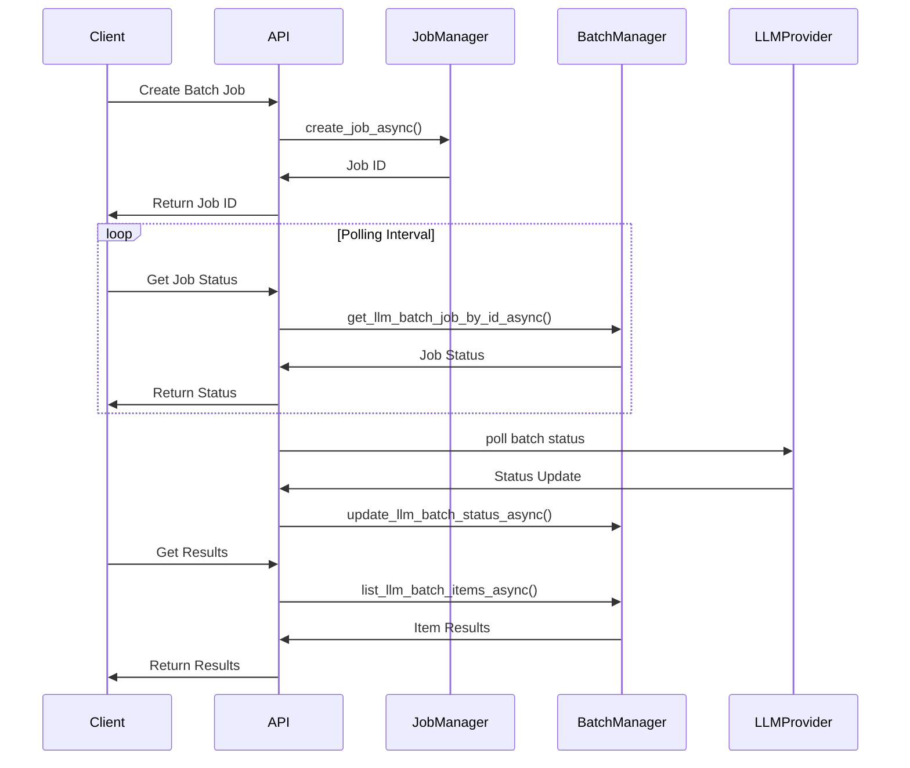
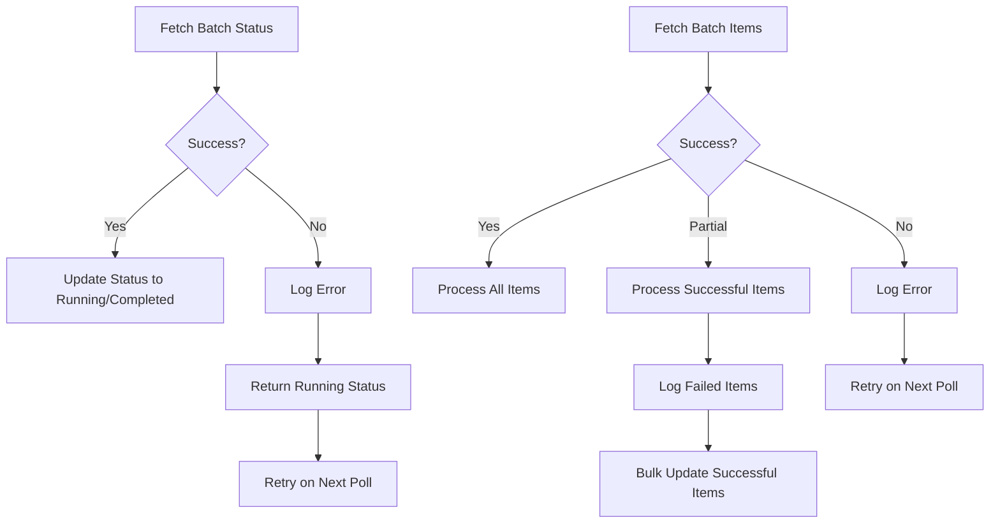
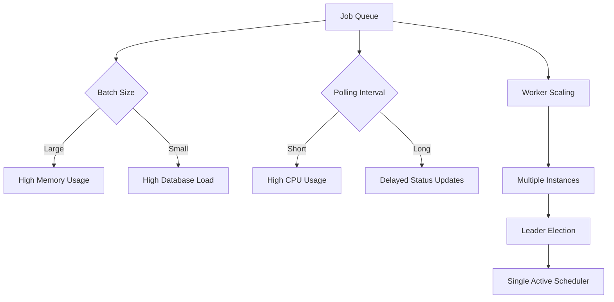

# Long-Running Operations

<cite>
**Referenced Files in This Document**   
- [llm_batch_job_polling.py](file://letta/jobs/llm_batch_job_polling.py)
- [scheduler.py](file://letta/jobs/scheduler.py)
- [llm_batch_manager.py](file://letta/services/llm_batch_manager.py)
- [llm_batch_job.py](file://letta/orm/llm_batch_job.py)
- [job.py](file://letta/orm/job.py)
- [job_manager.py](file://letta/services/job_manager.py)
- [types.py](file://letta/jobs/types.py)
- [helpers.py](file://letta/jobs/helpers.py)
- [letta_agent_batch.py](file://letta/agents/letta_agent_batch.py)
- [integration_test_batch_api_cron_jobs.py](file://tests/integration_test_batch_api_cron_jobs.py)
- [integration_test_batch_sdk.py](file://tests/integration_test_batch_sdk.py)
- [test_letta_agent_batch.py](file://tests/test_letta_agent_batch.py)
</cite>

## Table of Contents
1. [Introduction](#introduction)
2. [Job Scheduling System](#job-scheduling-system)
3. [Job Lifecycle Management](#job-lifecycle-management)
4. [Polling Mechanism for Job Monitoring](#polling-mechanism-for-job-monitoring)
5. [LLM Batch Job Implementation](#llm-batch-job-implementation)
6. [API and SDK Integration](#api-and-sdk-integration)
7. [Error Handling and Retry Strategies](#error-handling-and-retry-strategies)
8. [Resource Management and Performance](#resource-management-and-performance)
9. [Conclusion](#conclusion)

## Introduction

Letta's background processing capabilities are designed to handle long-running operations that exceed typical request timeouts. This system enables asynchronous execution of resource-intensive tasks such as batch LLM processing, large file ingestion, and complex tool executions. The architecture is built around a robust job scheduling framework that ensures reliable execution, status tracking, and result retrieval for background operations. This document provides a comprehensive overview of the long-running operations system, detailing the job lifecycle, monitoring mechanisms, implementation specifics, and integration patterns.

## Job Scheduling System

The job scheduling system in Letta is responsible for managing background operations through a distributed, fault-tolerant architecture. At its core, the system uses APScheduler with PostgreSQL advisory locks to ensure leader election in multi-instance deployments, preventing duplicate job execution.

**Diagram sources**
- [scheduler.py](file://letta/jobs/scheduler.py#L1-L229)

The scheduler is configured through settings that control polling intervals and lookback windows. It operates on a fixed interval defined by `poll_running_llm_batches_interval_seconds` with jitter to prevent thundering herd problems. For non-PostgreSQL databases, the system gracefully degrades to single-instance operation without leader election.

**Section sources**
- [scheduler.py](file://letta/jobs/scheduler.py#L1-L229)

## Job Lifecycle Management

The job lifecycle in Letta follows a well-defined state transition pattern from creation to completion, with comprehensive tracking at each stage. Jobs progress through several states: created, running, completed, failed, or cancelled.

**Diagram sources**
- [job.py](file://letta/orm/job.py#L1-L66)
- [llm_batch_job.py](file://letta/orm/llm_batch_job.py#L1-L52)

Each job is represented by a `Job` entity that contains metadata about the operation, including status, timestamps, and callback configurations. LLM batch jobs are specialized jobs that inherit from the base job model and include additional fields for provider-specific responses and polling information.

The lifecycle begins with job creation through the `create_job_async` method in the `JobManager`, which validates access and persists the job to the database. As the job progresses, its status is updated through the `update_job_by_id_async` method, which enforces state transition rules to prevent invalid status changes.

**Section sources**
- [job_manager.py](file://letta/services/job_manager.py#L1-L600)
- [llm_batch_manager.py](file://letta/services/llm_batch_manager.py#L1-L86)

## Polling Mechanism for Job Monitoring

Letta implements a sophisticated polling mechanism for monitoring the progress of long-running operations, particularly LLM batch jobs. The system periodically checks the status of running jobs and updates their state accordingly.

**Diagram sources**
- [llm_batch_job_polling.py](file://letta/jobs/llm_batch_job_polling.py#L1-L248)

The polling process is orchestrated by the `poll_running_llm_batches` function, which follows these steps:
1. Retrieve all running LLM batch jobs within the configured lookback period
2. Filter jobs by provider (currently Anthropic)
3. Concurrently fetch updated status for all batch jobs
4. Bulk update job statuses in the database
5. For completed batches, retrieve individual item results
6. Bulk update batch item results
7. Resume post-processing for completed batches

The system uses `BatchPollingMetrics` to track performance metrics such as processing time, batch counts, and item updates. This ensures visibility into the polling operation's efficiency and helps identify potential bottlenecks.

**Section sources**
- [llm_batch_job_polling.py](file://letta/jobs/llm_batch_job_polling.py#L1-L248)
- [types.py](file://letta/jobs/types.py#L1-L31)

## LLM Batch Job Implementation

LLM batch jobs are implemented as a specialized type of background operation that handles the processing of multiple LLM requests efficiently. The implementation is centered around the `LLMBatchJob` and `LLMBatchItem` entities that track the status of batch operations at both the aggregate and individual levels.

**Diagram sources**
- [llm_batch_job.py](file://letta/orm/llm_batch_job.py#L1-L52)
- [llm_batch_items.py](file://letta/orm/llm_batch_items.py)
- [job.py](file://letta/orm/job.py#L1-L66)

The batch job implementation includes several key components:
- **Batch creation**: Jobs are created through the `create_llm_batch_job_async` method, which initializes the job with provider-specific configuration
- **Status mapping**: The `map_anthropic_batch_job_status_to_job_status` function translates provider-specific statuses to Letta's internal job status enumeration
- **Item-level tracking**: Individual batch items are tracked separately, allowing for partial success scenarios where some items complete successfully while others fail
- **Idempotent processing**: The system ensures that completed jobs are not reprocessed, maintaining data consistency across polling cycles

**Section sources**
- [llm_batch_manager.py](file://letta/services/llm_batch_manager.py#L1-L86)
- [helpers.py](file://letta/jobs/helpers.py#L1-L26)

## API and SDK Integration

Letta provides both REST API and SDK interfaces for initiating and monitoring long-running tasks. The integration allows clients to create batch jobs, check their status, and retrieve results asynchronously.

**Diagram sources**
- [job_manager.py](file://letta/services/job_manager.py#L1-L600)
- [llm_batch_manager.py](file://letta/services/llm_batch_manager.py#L1-L86)
- [integration_test_batch_sdk.py](file://tests/integration_test_batch_sdk.py)
- [integration_test_batch_api_cron_jobs.py](file://tests/integration_test_batch_api_cron_jobs.py)

Clients can initiate batch jobs through the API, which returns immediately with a job identifier. This identifier can then be used to poll for status updates or retrieve final results. The SDK provides a higher-level interface that abstracts the polling mechanism, offering convenience methods for waiting on job completion.

The system supports callback URLs, allowing clients to receive notifications when jobs complete. This webhook mechanism is implemented in the `JobManager`'s `_dispatch_callback_async` method, which sends a POST request to the registered callback URL with job status and metadata.

**Section sources**
- [job_manager.py](file://letta/services/job_manager.py#L1-L600)
- [integration_test_batch_sdk.py](file://tests/integration_test_batch_sdk.py)
- [test_letta_agent_batch.py](file://tests/test_letta_agent_batch.py)

## Error Handling and Retry Strategies

The long-running operations system implements comprehensive error handling and retry strategies to ensure reliability in the face of transient failures. The architecture is designed to gracefully handle network issues, provider errors, and system failures.

When polling for batch status, transient errors are treated as "still running" to ensure the job remains in the polling queue for subsequent attempts. This approach prevents premature job failure due to temporary connectivity issues. The system uses `asyncio.gather` with `return_exceptions=True` when processing multiple batch items, allowing partial success scenarios where some items can be processed even if others fail.

**Diagram sources**
- [llm_batch_job_polling.py](file://letta/jobs/llm_batch_job_polling.py#L1-L248)
- [helpers.py](file://letta/jobs/helpers.py#L1-L26)

The system also implements callback retry logic, where failed webhook deliveries are recorded in the job metadata but do not affect the job's completion status. This ensures that external notification failures do not impact the core operation.

For database operations, the system uses transactional updates with proper error handling, ensuring data consistency even in failure scenarios. The bulk update operations are designed to be idempotent, preventing duplicate processing of completed jobs.

**Section sources**
- [llm_batch_job_polling.py](file://letta/jobs/llm_batch_job_polling.py#L1-L248)
- [job_manager.py](file://letta/services/job_manager.py#L1-L600)

## Resource Management and Performance

The long-running operations system is optimized for efficient resource utilization and high performance, particularly in job queue management and worker scaling scenarios.

The polling mechanism uses bulk operations to minimize database round trips, with `bulk_update_llm_batch_statuses_async` and `bulk_update_batch_llm_items_results_by_agent_async` methods that update multiple records in a single transaction. This reduces database load and improves throughput.

**Diagram sources**
- [scheduler.py](file://letta/jobs/scheduler.py#L1-L229)
- [llm_batch_manager.py](file://letta/services/llm_batch_manager.py#L1-L86)

The system is configured with several performance-related settings:
- `batch_job_polling_batch_size`: Controls the number of jobs processed in each polling cycle
- `batch_job_polling_lookback_weeks`: Determines how far back to look for running jobs
- `poll_running_llm_batches_interval_seconds`: Sets the frequency of polling operations

These parameters allow administrators to tune the system based on their specific workload characteristics and resource constraints. The use of PostgreSQL advisory locks enables horizontal scaling of the application while ensuring only one instance runs the scheduler, preventing resource contention.

**Section sources**
- [scheduler.py](file://letta/jobs/scheduler.py#L1-L229)
- [llm_batch_manager.py](file://letta/services/llm_batch_manager.py#L1-L86)

## Conclusion

Letta's long-running operations system provides a robust foundation for handling background processing tasks that exceed typical request timeouts. The architecture combines reliable job scheduling, comprehensive lifecycle management, and efficient polling mechanisms to ensure dependable execution of batch LLM processing, large file ingestion, and complex tool executions.

Key strengths of the system include its fault-tolerant design with leader election, idempotent processing to prevent duplicate work, and comprehensive error handling that gracefully manages transient failures. The integration of both REST API and SDK interfaces makes it accessible to a wide range of clients, while the callback mechanism enables event-driven architectures.

The system's performance characteristics are optimized through bulk database operations and configurable polling parameters, allowing it to scale effectively with increasing workloads. As the platform evolves, the architecture provides a solid foundation for adding support for additional LLM providers and expanding the range of supported long-running operations.