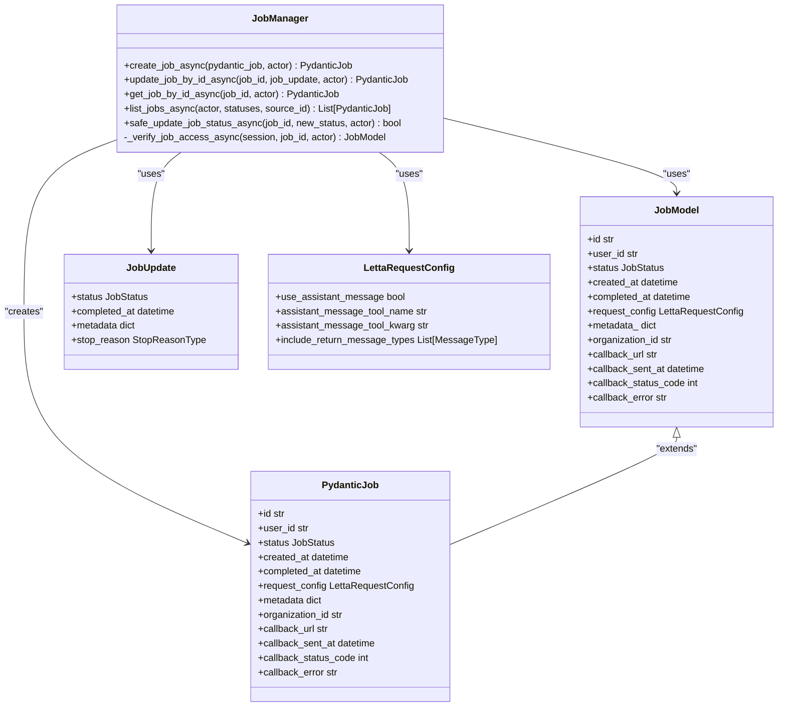
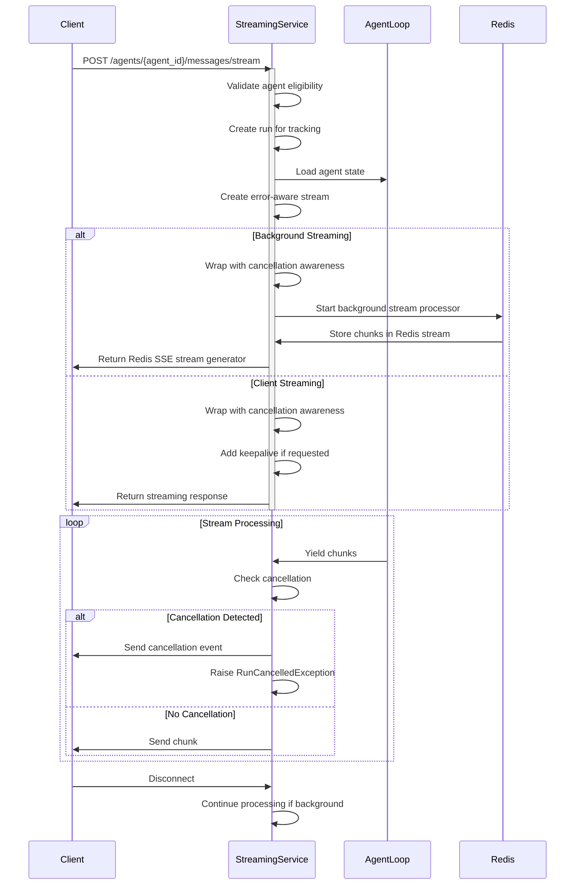
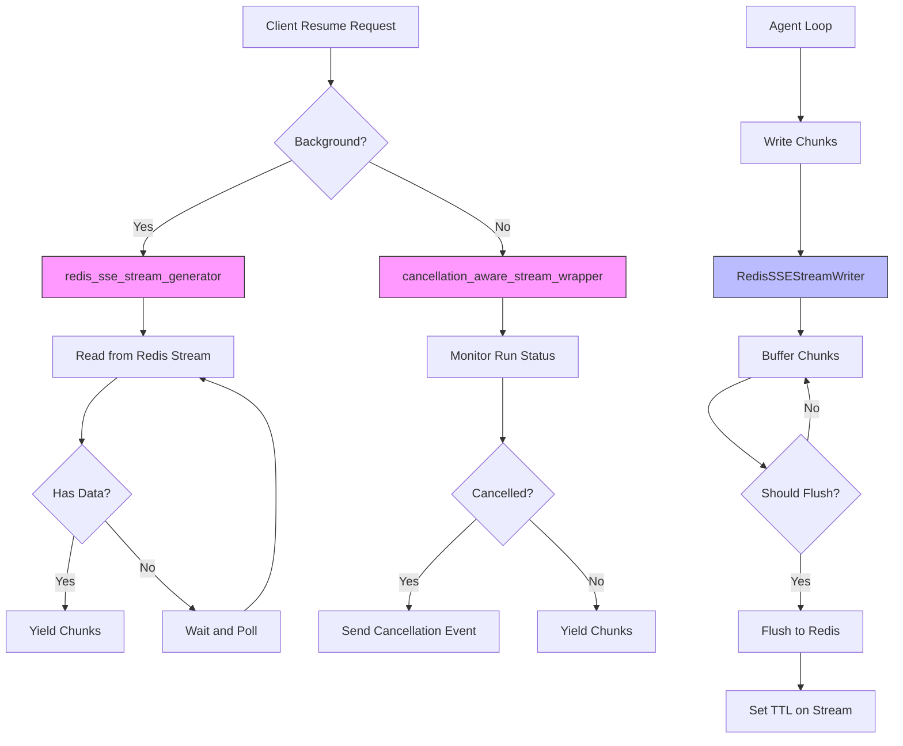
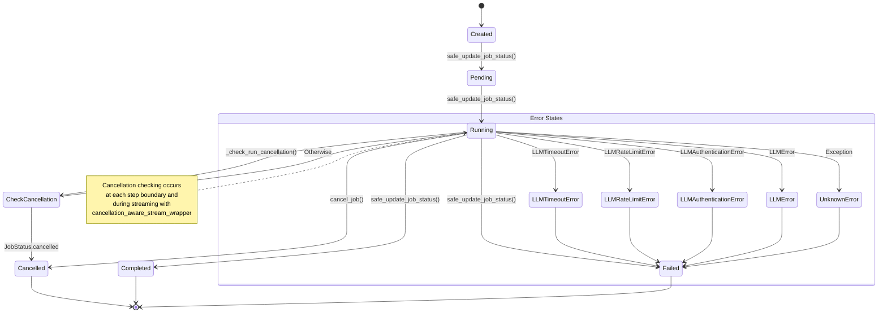
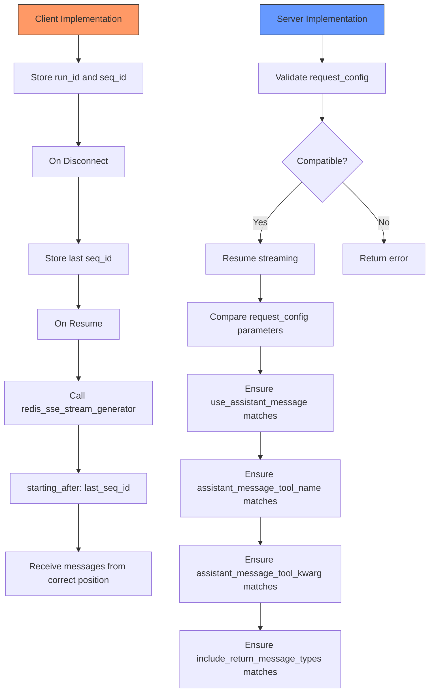

# Connection Resumption Protocol

<cite>
**Referenced Files in This Document**   
- [jobs.py](file://letta/server/rest_api/routers/v1/jobs.py)
- [job_manager.py](file://letta/services/job_manager.py)
- [streaming_service.py](file://letta/services/streaming_service.py)
- [redis_stream_manager.py](file://letta/server/rest_api/redis_stream_manager.py)
- [streaming_response.py](file://letta/server/rest_api/streaming_response.py)
- [letta_agent.py](file://letta/agents/letta_agent.py)
- [types.py](file://letta/schemas/job.py)
</cite>

## Table of Contents
1. [Introduction](#introduction)
2. [Job Management and Resume Request Handling](#job-management-and-resume-request-handling)
3. [Streaming Service and Session Reconnection](#streaming-service-and-session-reconnection)
4. [Redis-Based Message Streaming](#redis-based-message-streaming)
5. [Error Handling and Session States](#error-handling-and-session-states)
6. [Protocol Implementation Guidance](#protocol-implementation-guidance)

## Introduction
The Connection Resumption Protocol in Letta's resumable streaming feature enables clients to reconnect to ongoing or interrupted streaming sessions. This protocol ensures continuity of message streaming by validating job identifiers and client credentials, rehydrating agent state, and resuming message delivery from the correct position. The system leverages Redis for message persistence and implements robust error handling for scenarios such as expired sessions, configuration mismatches, and concurrent resume attempts.

## Job Management and Resume Request Handling

The REST API in jobs.py handles resume requests through a comprehensive job management system that validates job IDs and client credentials before re-establishing streaming sessions. The protocol begins with job validation and status checking to ensure the requested job exists and is in a resumable state.

The job manager validates agent existence before creating or resuming jobs, ensuring proper access control and resource availability. When a resume request is received, the system verifies the job's status and ensures it is not in a terminal state before proceeding with session reconnection.

**Diagram sources**
- [job_manager.py](file://letta/services/job_manager.py#L34-L600)
- [types.py](file://letta/schemas/job.py#L1-L31)

**Section sources**
- [jobs.py](file://letta/server/rest_api/routers/v1/jobs.py#L1-L143)
- [job_manager.py](file://letta/services/job_manager.py#L34-L600)

## Streaming Service and Session Reconnection

The streaming service manages agent streaming responses and handles the reconnection process when clients resume sessions. The protocol establishes a handshake between client and server by comparing request_config parameters to ensure compatibility between original and resumed requests.

When a streaming request is initiated, the system creates a run for tracking execution and associates it with the agent. The request configuration is stored in the job metadata, allowing subsequent resume requests to validate compatibility. The streaming service wraps the agent loop stream with cancellation awareness, enabling real-time monitoring of job status during streaming.

**Diagram sources**
- [streaming_service.py](file://letta/services/streaming_service.py#L53-L690)
- [redis_stream_manager.py](file://letta/server/rest_api/redis_stream_manager.py#L23-L446)

**Section sources**
- [streaming_service.py](file://letta/services/streaming_service.py#L53-L690)

## Redis-Based Message Streaming

The resumption protocol relies on Redis to persist streaming messages and enable session recovery. The RedisSSEStreamWriter buffers chunks and flushes them to Redis streams with batching and TTL management, ensuring efficient storage and retrieval of streaming data.

When a client resumes a session, the redis_sse_stream_generator reads chunks from the Redis stream starting from a specific sequence ID, allowing the client to resume from the correct position. The system tracks sequential IDs for cursor-based recovery and automatically sets/refreshes TTL on streams to manage storage efficiently.

**Diagram sources**
- [redis_stream_manager.py](file://letta/server/rest_api/redis_stream_manager.py#L23-L446)
- [streaming_response.py](file://letta/server/rest_api/streaming_response.py#L114-L178)

**Section sources**
- [redis_stream_manager.py](file://letta/server/rest_api/redis_stream_manager.py#L23-L446)

## Error Handling and Session States

The protocol implements comprehensive error handling for various failure scenarios, including expired sessions, mismatched client configurations, and concurrent resume attempts. The system uses a state transition model to manage job status, ensuring that invalid transitions are prevented.

When a job is cancelled, the system sends a cancellation event to the client and properly terminates the stream. For client timeouts, the system distinguishes between explicit cancellations and unexpected terminations, handling each appropriately. The protocol also handles LLM-related errors such as timeouts, rate limits, and authentication failures, ensuring graceful degradation.

**Diagram sources**
- [job_manager.py](file://letta/services/job_manager.py#L72-L190)
- [streaming_service.py](file://letta/services/streaming_service.py#L279-L428)

**Section sources**
- [job_manager.py](file://letta/services/job_manager.py#L72-L190)
- [streaming_service.py](file://letta/services/streaming_service.py#L279-L428)

## Protocol Implementation Guidance

To implement idempotent resume operations, clients should store the run ID and sequence ID of the last received message. When resuming, the client can use these values to request messages starting from the correct position, ensuring no messages are missed or duplicated.

For handling partial message delivery at the protocol level, the system uses the RedisSSEStreamWriter's sequence ID tracking to ensure messages are delivered in order. The background stream processor ensures that even if a client disconnects, messages continue to be processed and stored in Redis, allowing for reliable resumption.

The protocol supports concurrent resume attempts through proper locking and state management. When multiple clients attempt to resume the same session, the job manager's access verification ensures that only authorized clients can resume, and the run status prevents invalid state transitions.

**Diagram sources**
- [streaming_service.py](file://letta/services/streaming_service.py#L470-L483)
- [redis_stream_manager.py](file://letta/server/rest_api/redis_stream_manager.py#L382-L446)

**Section sources**
- [streaming_service.py](file://letta/services/streaming_service.py#L470-L483)
- [redis_stream_manager.py](file://letta/server/rest_api/redis_stream_manager.py#L382-L446)