# Performance Monitoring and Metrics

<cite>
**Referenced Files in This Document**
- [job_manager.py](file://letta/services/job_manager.py)
- [job.py](file://letta/orm/job.py)
- [letta_agent.py](file://letta/agents/letta_agent.py)
- [step_manager.py](file://letta/services/step_manager.py)
- [step_metrics.py](file://letta/orm/step_metrics.py)
- [metric_registry.py](file://letta/otel/metric_registry.py)
- [metrics.py](file://letta/otel/metrics.py)
- [streaming.py](file://letta/client/streaming.py)
- [redis_stream_manager.py](file://letta/server/rest_api/redis_stream_manager.py)
- [telemetry_manager.py](file://letta/services/telemetry_manager.py)
- [telemetry.py](file://letta/server/rest_api/routers/v1/telemetry.py)
- [05c3bc564286_add_metrics_to_agent_loop_runs.py](file://alembic/versions/05c3bc564286_add_metrics_to_agent_loop_runs.py)
- [750dd87faa12_add_build_request_latency_to_step_.py](file://alembic/versions/750dd87faa12_add_build_request_latency_to_step_.py)
</cite>

## Table of Contents
1. [Introduction](#introduction)
2. [System Architecture Overview](#system-architecture-overview)
3. [Job Model and Core Metrics](#job-model-and-core-metrics)
4. [Performance Data Collection](#performance-data-collection)
5. [Streaming Performance Tracking](#streaming-performance-tracking)
6. [Metrics Aggregation and Analysis](#metrics-aggregation-and-analysis)
7. [Resumable Streaming System](#resumable-streaming-system)
8. [System Observability](#system-observability)
9. [Optimization Strategies](#optimization-strategies)
10. [Best Practices and Recommendations](#best-practices-and-recommendations)

## Introduction

Letta's performance monitoring and metrics system provides comprehensive tracking of streaming performance across resumable connection sessions. The system captures latency and throughput metrics through specialized fields in the Job model, including `ttft_ns` (time-to-first-token) and `total_duration_ns`, enabling sophisticated analysis of agent response strategies and informing client-side timeout configurations.

The architecture supports distributed monitoring with OpenTelemetry integration, providing both low-level timing data and high-level performance indicators. This enables real-time optimization of agent interactions while maintaining system observability across potentially interrupted streaming sessions.

## System Architecture Overview

The performance monitoring system consists of several interconnected components that work together to provide comprehensive visibility into streaming performance:

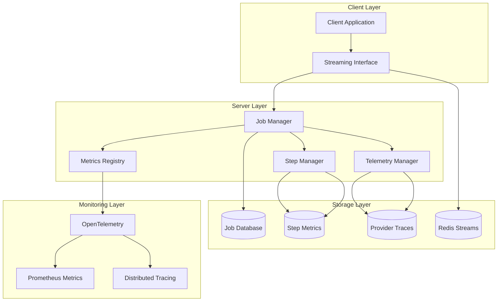

**Diagram sources**
- [job_manager.py](file://letta/services/job_manager.py#L34-L600)
- [step_manager.py](file://letta/services/step_manager.py#L34-L683)
- [metric_registry.py](file://letta/otel/metric_registry.py#L1-L275)

## Job Model and Core Metrics

The Job model serves as the central repository for performance metrics in Letta's streaming system, featuring specialized fields for tracking streaming performance across multiple connection sessions.

### Core Performance Fields

The Job model includes two primary performance indicators:

| Field | Type | Description | Precision |
|-------|------|-------------|-----------|
| `ttft_ns` | BigInteger | Time to First Token in nanoseconds | Nanosecond precision |
| `total_duration_ns` | BigInteger | Total run duration in nanoseconds | Nanosecond precision |

These fields enable precise measurement of streaming performance characteristics, capturing both initial response latency and overall completion times.

### Database Schema Evolution

The performance metrics infrastructure evolved through several database migrations:

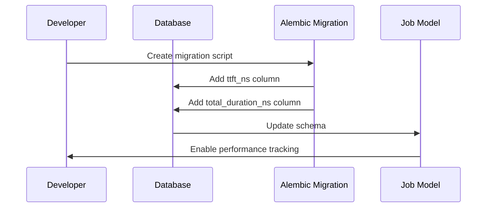

**Diagram sources**
- [05c3bc564286_add_metrics_to_agent_loop_runs.py](file://alembic/versions/05c3bc564286_add_metrics_to_agent_loop_runs.py#L22-L33)

**Section sources**
- [job.py](file://letta/orm/job.py#L53-L56)
- [05c3bc564286_add_metrics_to_agent_loop_runs.py](file://alembic/versions/05c3bc564286_add_metrics_to_agent_loop_runs.py#L1-L33)

## Performance Data Collection

Letta's performance monitoring system collects metrics at multiple granularities, from individual streaming segments to complete agent interactions.

### TTFT (Time to First Token) Measurement

The system captures TTFT through multiple mechanisms:

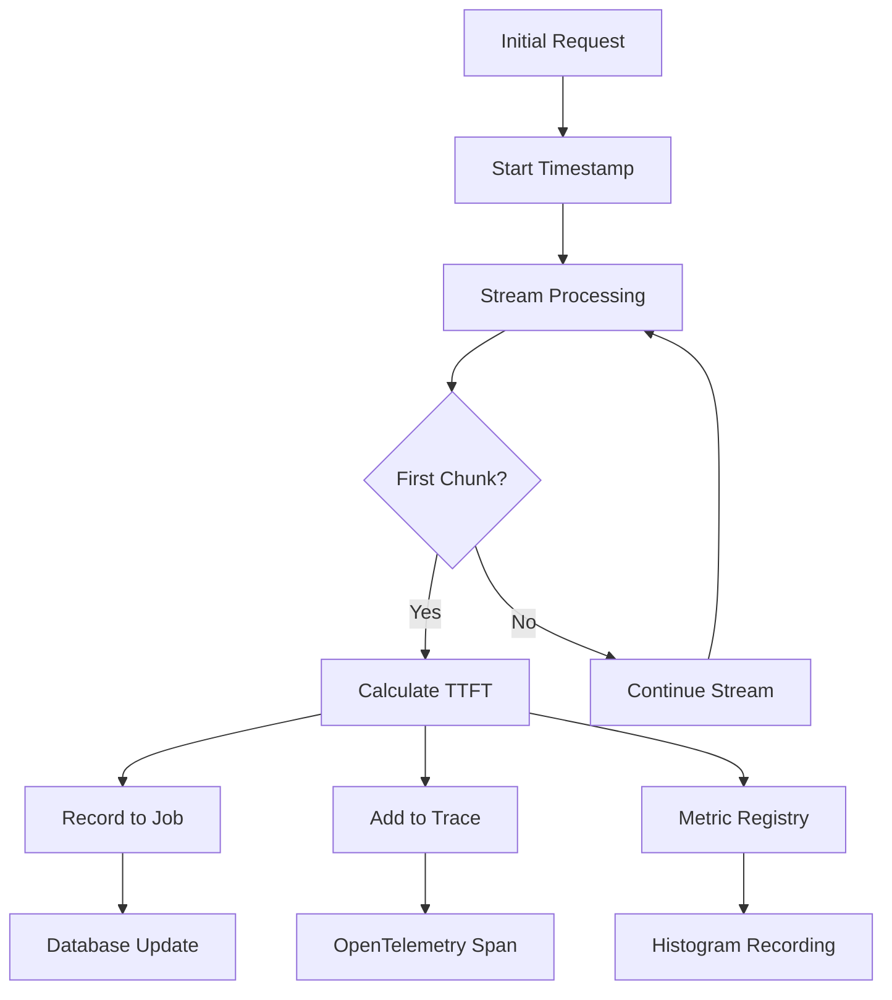

**Diagram sources**
- [letta_agent.py](file://letta/agents/letta_agent.py#L1047-L1061)

### Step-Level Metrics Collection

Each step in the agent loop generates detailed performance metrics:

| Metric | Description | Collection Point |
|--------|-------------|------------------|
| `llm_request_ns` | Time spent on LLM requests | After stream completion |
| `tool_execution_ns` | Time spent on tool execution | During tool processing |
| `step_ns` | Total step execution time | At step completion |
| `step_start_ns` | Step start timestamp | At step initiation |
| `llm_request_start_ns` | LLM request start timestamp | At LLM call initiation |

### Multi-Phase Timing Capture

The system captures timing data across different phases of agent processing:

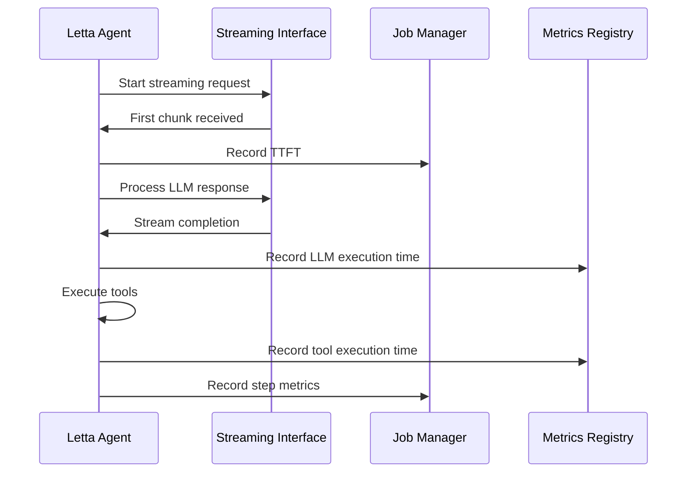

**Diagram sources**
- [letta_agent.py](file://letta/agents/letta_agent.py#L1043-L1239)
- [step_manager.py](file://letta/services/step_manager.py#L467-L530)

**Section sources**
- [letta_agent.py](file://letta/agents/letta_agent.py#L1043-L1239)
- [step_manager.py](file://letta/services/step_manager.py#L467-L530)

## Streaming Performance Tracking

Letta's streaming performance tracking system provides comprehensive visibility into the entire streaming pipeline, from initial request to final response delivery.

### Streaming Interface Integration

The streaming system integrates with multiple interface types to capture performance data:

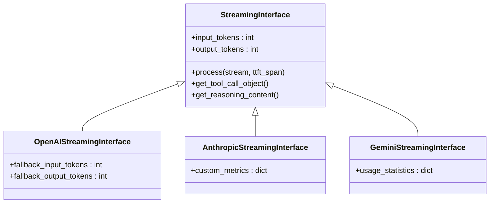

**Diagram sources**
- [letta_agent.py](file://letta/agents/letta_agent.py#L1043-L1080)

### Real-Time Metrics Recording

The system records metrics in real-time during streaming operations:

| Event | Metric Collected | Storage Location |
|-------|------------------|------------------|
| First chunk received | TTFT (nanoseconds) | Job.ttft_ns |
| LLM request completion | LLM execution time | StepMetrics.llm_request_ns |
| Tool execution start | Tool execution start timestamp | StepMetrics.tool_execution_start_ns |
| Step completion | Total step time | StepMetrics.step_ns |
| Stream end | Total duration | Job.total_duration_ns |

### Error Handling and Recovery

The streaming system includes robust error handling for performance data collection:

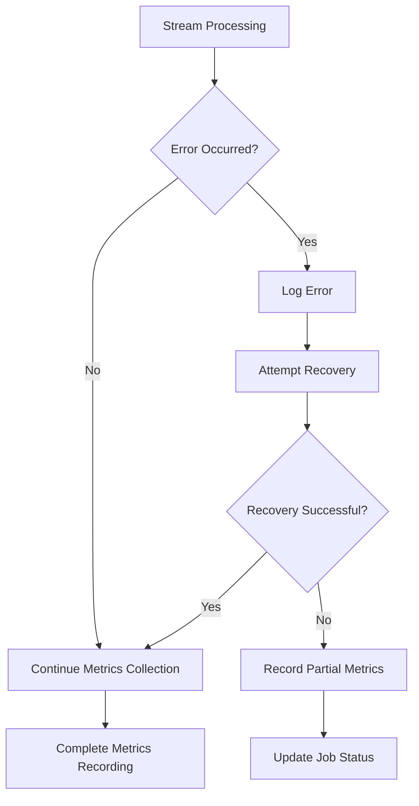

**Section sources**
- [letta_agent.py](file://letta/agents/letta_agent.py#L1043-L1239)
- [streaming.py](file://letta/client/streaming.py#L1-L96)

## Metrics Aggregation and Analysis

Letta's metrics aggregation system provides sophisticated analysis capabilities for performance data collected across streaming sessions.

### Job-Level Aggregation

The Job Manager handles aggregation of timing data from individual streaming segments:

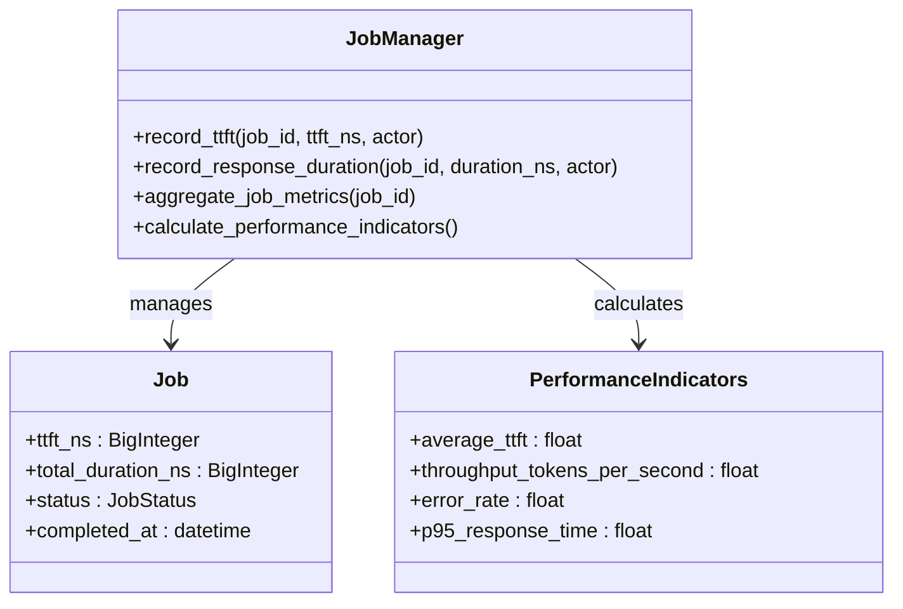

**Diagram sources**
- [job_manager.py](file://letta/services/job_manager.py#L458-L480)

### Step Metrics Aggregation

Step-level metrics provide granular insights into agent performance:

| Aggregated Metric | Calculation Method | Use Case |
|-------------------|-------------------|----------|
| Average LLM Request Time | Mean of all llm_request_ns | LLM performance optimization |
| Tool Execution Efficiency | Sum of tool_execution_ns / total_steps | Tool performance analysis |
| Step Completion Rate | Successful steps / total steps | Reliability monitoring |
| Memory Usage Patterns | Peak memory during steps | Resource optimization |

### Real-Time Performance Analytics

The system provides real-time analytics capabilities:

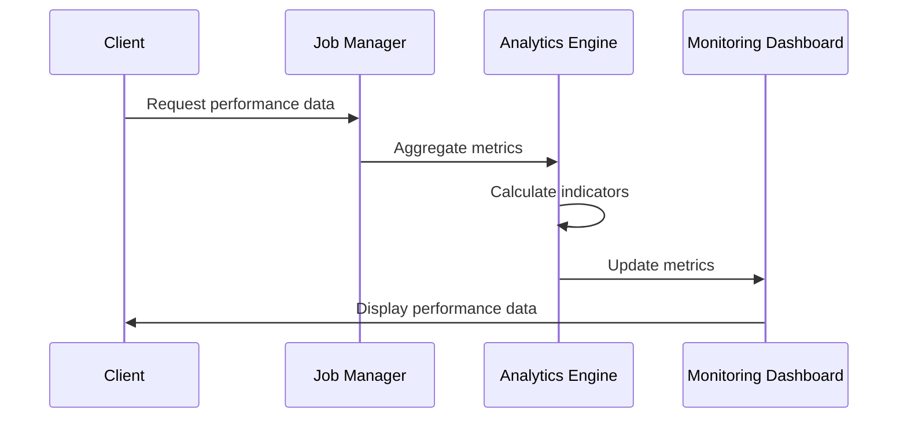

**Section sources**
- [job_manager.py](file://letta/services/job_manager.py#L458-L480)
- [step_manager.py](file://letta/services/step_manager.py#L467-L530)

## Resumable Streaming System

Letta's resumable streaming system maintains performance metrics continuity across connection interruptions and session suspensions.

### Suspend/Resume Cycle Preservation

The system preserves metrics across suspend/resume cycles through multiple mechanisms:

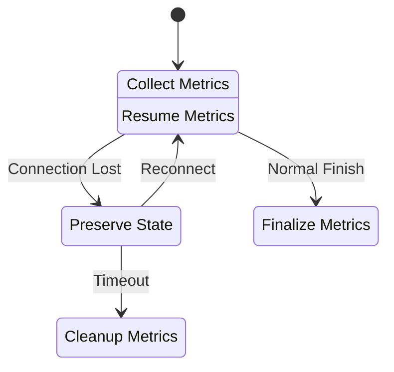

### Redis-Based Buffering

The Redis Stream Manager provides persistent buffering for streaming data:

| Feature | Implementation | Benefit |
|---------|---------------|---------|
| Chunk Persistence | Redis XADD with TTL | Prevents data loss |
| Sequence Tracking | Monotonic sequence IDs | Ensures order preservation |
| Automatic Cleanup | TTL expiration | Prevents storage bloat |
| Background Processing | Async flush tasks | Minimizes impact on streaming |

### Connection Session Management

The system manages multiple connection sessions while maintaining performance continuity:

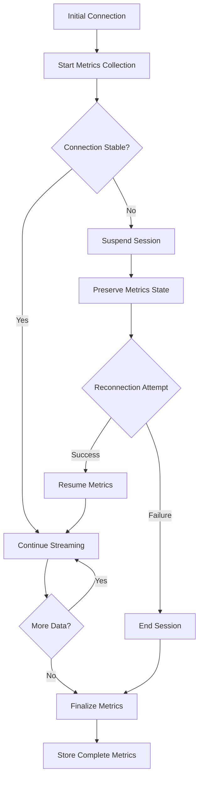

**Diagram sources**
- [redis_stream_manager.py](file://letta/server/rest_api/redis_stream_manager.py#L124-L166)

**Section sources**
- [redis_stream_manager.py](file://letta/server/rest_api/redis_stream_manager.py#L124-L166)
- [streaming.py](file://letta/client/streaming.py#L1-L96)

## System Observability

Letta's observability system provides comprehensive monitoring and alerting capabilities for performance metrics.

### OpenTelemetry Integration

The system integrates with OpenTelemetry for distributed tracing and metrics collection:

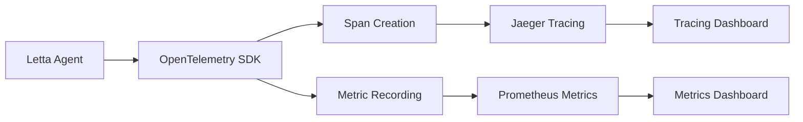

**Diagram sources**
- [metric_registry.py](file://letta/otel/metric_registry.py#L83-L119)

### Provider Trace System

The Provider Trace system captures detailed information about LLM provider interactions:

| Trace Component | Data Captured | Purpose |
|----------------|---------------|---------|
| Request JSON | Full request payload | Debugging and optimization |
| Response JSON | Full response payload | Performance analysis |
| Timing Information | Request/response timestamps | Latency analysis |
| Error Details | Exception information | Reliability monitoring |

### Alerting and Monitoring

The observability system supports various alerting scenarios:

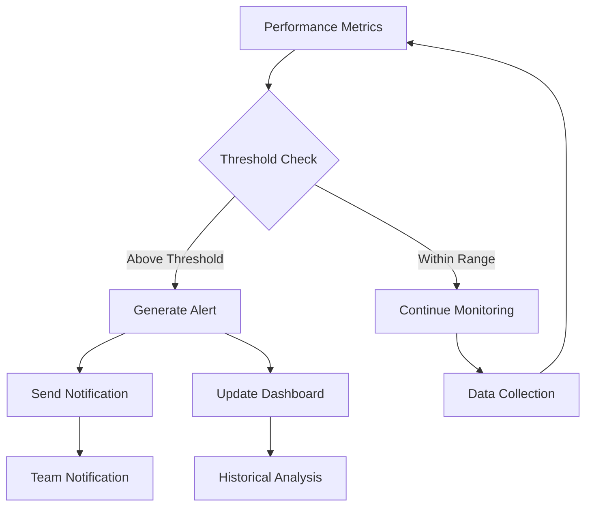

**Section sources**
- [metric_registry.py](file://letta/otel/metric_registry.py#L83-L119)
- [telemetry_manager.py](file://letta/services/telemetry_manager.py#L1-L56)
- [telemetry.py](file://letta/server/rest_api/routers/v1/telemetry.py#L1-L33)

## Optimization Strategies

Letta's performance monitoring system enables various optimization strategies for agent response times and system efficiency.

### Adaptive Timeout Configuration

The system provides data-driven timeout recommendations:

| Metric | Optimization Target | Recommendation Formula |
|--------|-------------------|----------------------|
| P95 TTFT | Reduce initial latency | `recommended_timeout = p95_ttft * 1.5` |
| Average Step Duration | Optimize processing time | `step_timeout = avg_step_duration * 2` |
| Throughput Patterns | Scale resources appropriately | `resource_scale = target_throughput / current_throughput` |

### Agent Response Strategy Optimization

Performance data informs agent behavior optimization:

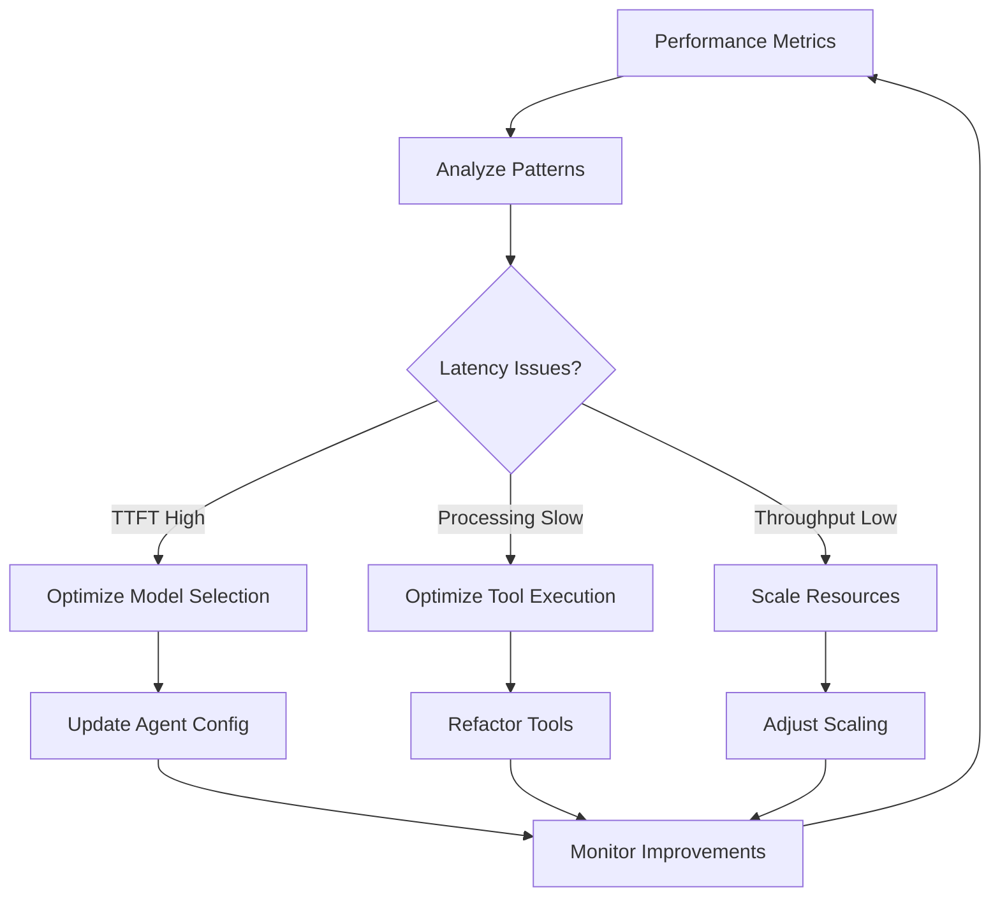

### Client-Side Timeout Adaptation

The system enables intelligent client-side timeout adaptation:

| Scenario | Timeout Strategy | Implementation |
|----------|------------------|----------------|
| High-latency network | Exponential backoff | `timeout = base_timeout * (2^retry_count)` |
| Predictable performance | Fixed timeout | Based on historical P95 values |
| Variable load | Dynamic adjustment | Real-time performance monitoring |
| Critical operations | Conservative timeout | Higher safety margin |

**Section sources**
- [letta_agent.py](file://letta/agents/letta_agent.py#L1043-L1239)
- [step_manager.py](file://letta/services/step_manager.py#L467-L530)

## Best Practices and Recommendations

Based on extensive performance monitoring experience, several best practices emerge for optimal system performance.

### Setting Realistic SLAs

Performance monitoring data enables realistic Service Level Agreement (SLA) establishment:

| SLA Tier | TTFT Target | Throughput Target | Availability Target |
|----------|-------------|------------------|-------------------|
| Premium | < 2 seconds | > 100 tokens/sec | 99.9% |
| Standard | < 5 seconds | > 50 tokens/sec | 99.5% |
| Basic | < 10 seconds | > 20 tokens/sec | 99.0% |

### Interpreting Performance Data

Understanding performance metrics in context of interrupted streams:

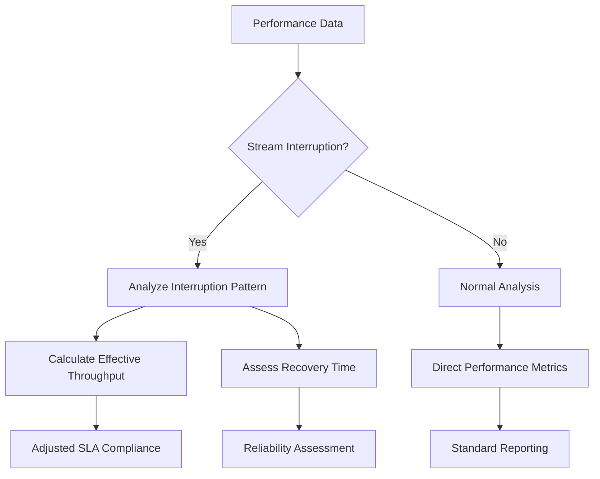

### Monitoring Best Practices

Key recommendations for effective performance monitoring:

1. **Granular Metric Collection**: Capture metrics at multiple levels (job, step, segment)
2. **Context-Aware Analysis**: Consider environmental factors affecting performance
3. **Proactive Alerting**: Set thresholds based on historical percentiles
4. **Continuous Optimization**: Use performance data to drive iterative improvements
5. **Cross-System Correlation**: Monitor relationships between different system components

### Troubleshooting Performance Issues

Common performance issues and diagnostic approaches:

| Issue Category | Symptoms | Diagnostic Approach | Resolution Strategy |
|---------------|----------|-------------------|-------------------|
| Network Latency | High TTFT, intermittent delays | Network trace analysis | CDN optimization, regional deployment |
| Model Performance | Consistently slow processing | Model benchmarking | Model selection, caching |
| Resource Contention | Variable performance, timeouts | Resource utilization analysis | Scaling, resource allocation |
| Code Bottlenecks | Specific step delays | Profiling and tracing | Algorithm optimization, parallelization |

### Performance Benchmarking

Establishing performance baselines and tracking improvements:

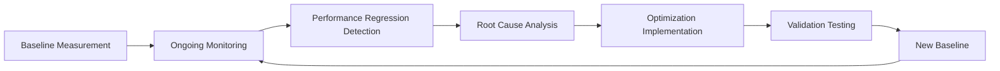

This comprehensive performance monitoring and metrics system enables Letta to maintain high-quality streaming performance while providing the visibility needed for continuous optimization and reliability assurance.