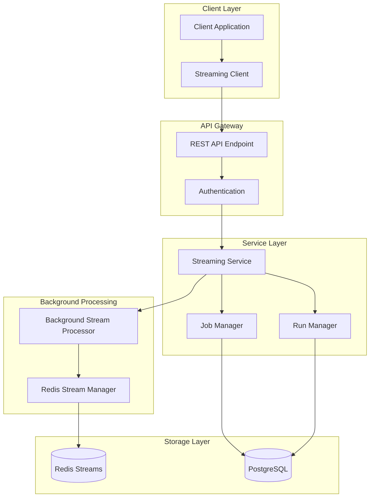
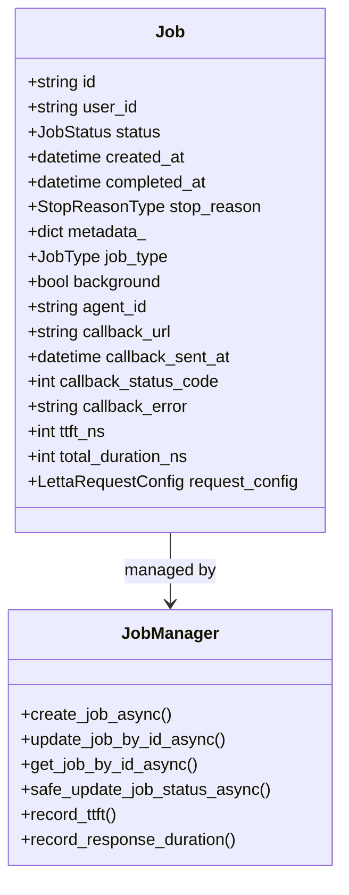
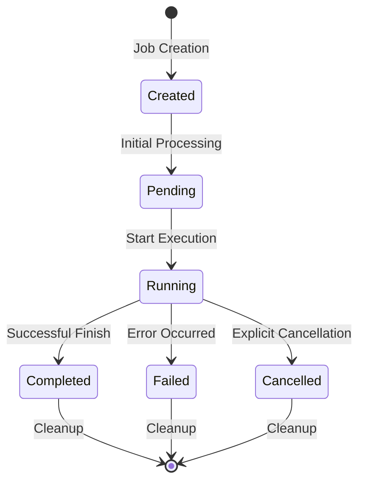
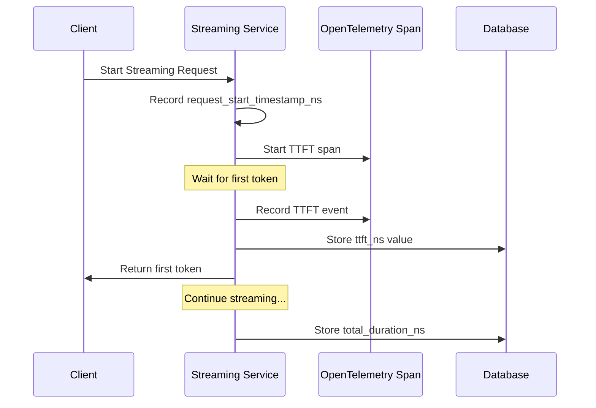
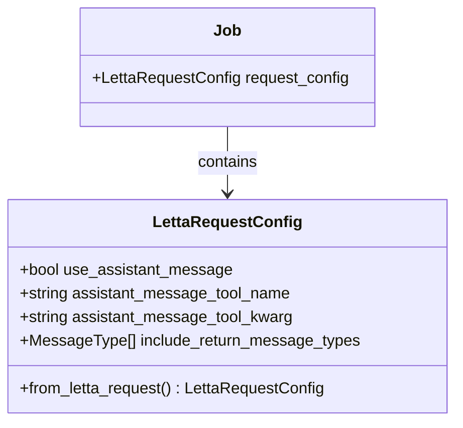
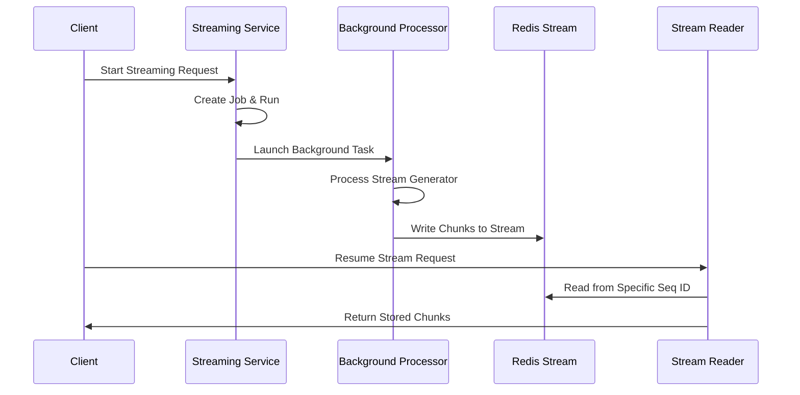
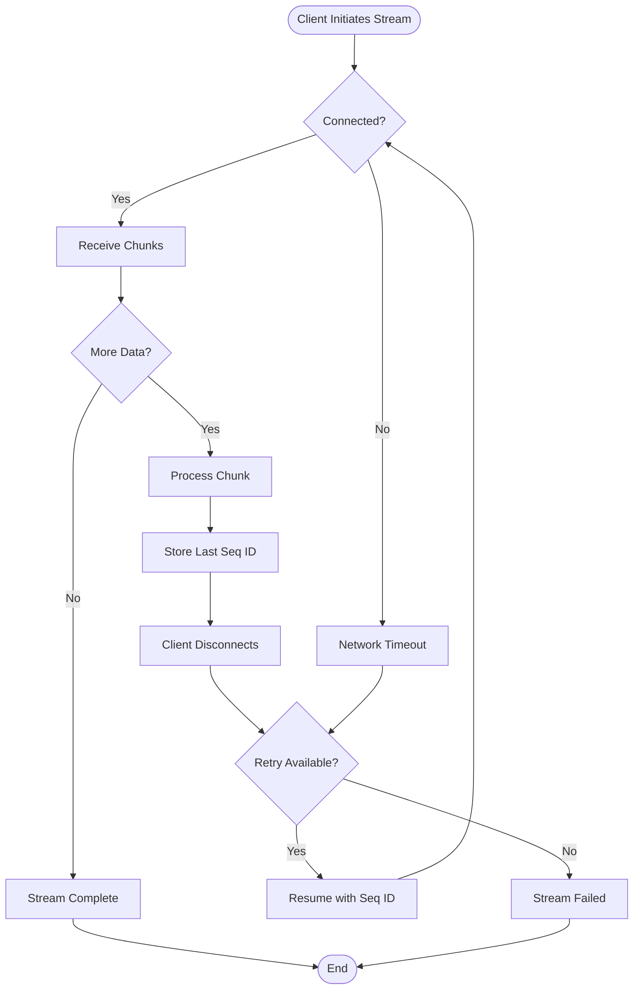
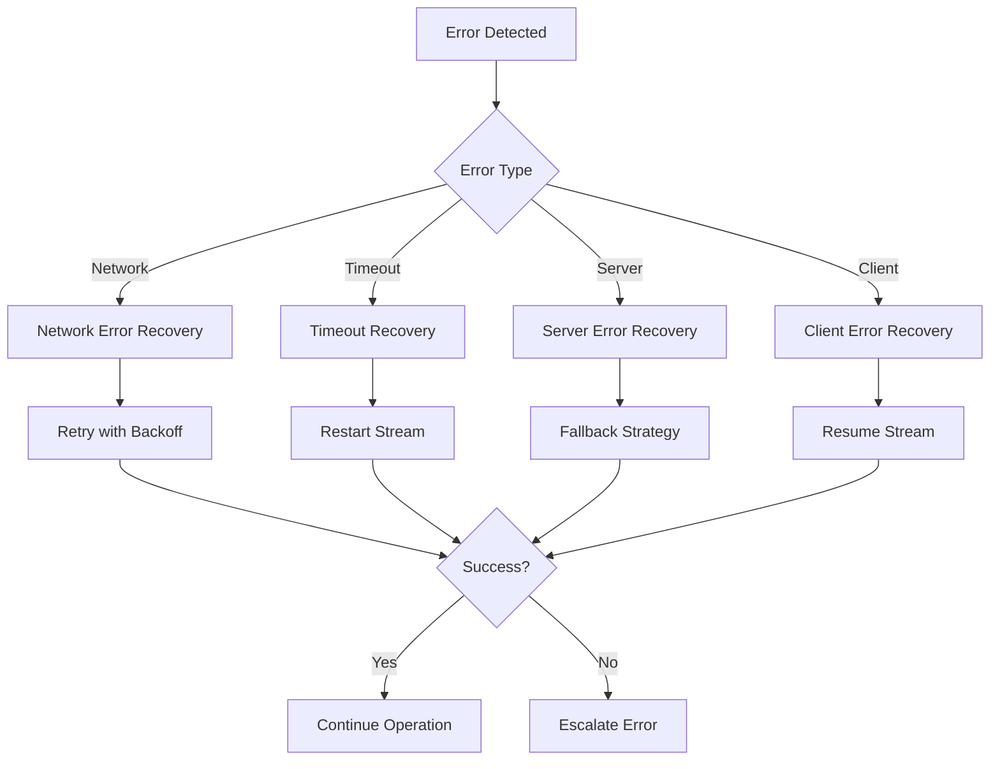

# Resumable Streaming

<cite>
**Referenced Files in This Document**
- [job.py](file://letta/orm/job.py)
- [job_manager.py](file://letta/services/job_manager.py)
- [streaming_service.py](file://letta/services/streaming_service.py)
- [job.py](file://letta/schemas/job.py)
- [redis_stream_manager.py](file://letta/server/rest_api/redis_stream_manager.py)
- [streaming_response.py](file://letta/server/rest_api/streaming_response.py)
- [streaming.py](file://letta/client/streaming.py)
- [letta_agent.py](file://letta/agents/letta_agent.py)
- [letta_agent_v2.py](file://letta/agents/letta_agent_v2.py)
- [utils.py](file://letta/server/rest_api/utils.py)
- [metric_registry.py](file://letta/otel/metric_registry.py)
- [05c3bc564286_add_metrics_to_agent_loop_runs.py](file://alembic/versions/05c3bc564286_add_metrics_to_agent_loop_runs.py)
</cite>

## Table of Contents
1. [Introduction](#introduction)
2. [System Architecture](#system-architecture)
3. [Job State Persistence](#job-state-persistence)
4. [Time-to-First-Token Tracking](#time-to-first-token-tracking)
5. [Request Configuration Management](#request-configuration-management)
6. [Background Streaming Implementation](#background-streaming-implementation)
7. [Client-Side Resumption](#client-side-resumption)
8. [Error Handling and Recovery](#error-handling-and-recovery)
9. [Best Practices](#best-practices)
10. [Troubleshooting Guide](#troubleshooting-guide)

## Introduction

Letta's resumable streaming system enables long-running operations to survive network interruptions and client disconnections while preserving intermediate results and execution context. This capability allows clients to resume streaming sessions from the point of interruption rather than restarting from the beginning, significantly improving reliability for extended conversations and data processing tasks.

The system achieves resumability through several key mechanisms:
- **Job-based state persistence**: All streaming operations are tracked as background jobs with comprehensive state management
- **Redis-based streaming storage**: Intermediate chunks are stored in Redis streams with TTL management
- **Cursor-based recovery**: Clients can resume from specific sequence points using incremental identifiers
- **Automatic cleanup**: Stale sessions are automatically cleaned up to prevent resource leaks

## System Architecture

The resumable streaming architecture consists of multiple interconnected components working together to provide reliable, persistent streaming capabilities.



**Diagram sources**
- [streaming_service.py](file://letta/services/streaming_service.py#L53-L690)
- [job_manager.py](file://letta/services/job_manager.py#L34-L600)
- [redis_stream_manager.py](file://letta/server/rest_api/redis_stream_manager.py#L23-L446)

### Core Components

**Streaming Service**: The primary orchestrator that manages the entire streaming lifecycle, from job creation to response delivery.

**Job Manager**: Handles job state persistence, status transitions, and metadata management for all streaming operations.

**Redis Stream Manager**: Provides efficient storage and retrieval of streaming chunks with TTL management and cursor-based pagination.

**Background Stream Processor**: Processes streaming data in the background, storing chunks to Redis while maintaining the original stream flow.

**Section sources**
- [streaming_service.py](file://letta/services/streaming_service.py#L53-L100)
- [job_manager.py](file://letta/services/job_manager.py#L34-L80)

## Job State Persistence

The job system serves as the foundation for resumable streaming, providing comprehensive state management for all streaming operations.

### Job Schema and Fields



**Diagram sources**
- [job.py](file://letta/orm/job.py#L19-L66)
- [job_manager.py](file://letta/services/job_manager.py#L34-L100)

### State Preservation Mechanisms

The job system preserves streaming state through several mechanisms:

**Status Tracking**: Jobs maintain comprehensive status information including creation, pending, running, completed, and failed states.

**Metadata Storage**: All streaming parameters, client preferences, and execution context are stored in the job's metadata field.

**Timing Metrics**: TTFT (Time to First Token) and total duration are captured as nanosecond timestamps for precise performance tracking.

**Request Configuration**: The `request_config` field stores client preferences and streaming parameters for proper resumption.

### Job Lifecycle Management



**Section sources**
- [job.py](file://letta/orm/job.py#L28-L35)
- [job_manager.py](file://letta/services/job_manager.py#L150-L200)

## Time-to-First-Token Tracking

Letta implements comprehensive TTFT (Time to First Token) and total response duration tracking for performance monitoring and optimization.

### TTFT Implementation

The system tracks TTFT through multiple layers:

**Timestamp Measurement**: TTFT is measured from request start to first token generation using nanosecond precision.

**Database Storage**: TTFT values are stored in the `ttft_ns` field as integer nanoseconds.

**Metric Collection**: TTFT data is exported to OpenTelemetry histograms for monitoring and alerting.

**Span Tracing**: TTFT events are recorded as OpenTelemetry spans for distributed tracing.

### Duration Tracking

Total response duration tracking complements TTFT measurements:

**End-to-End Timing**: Measures the complete duration from request initiation to stream termination.

**Nanosecond Precision**: Uses nanosecond timestamps for accurate measurement across different time scales.

**Storage Integration**: Duration data is stored in the `total_duration_ns` field alongside TTFT data.

### Implementation Details



**Diagram sources**
- [letta_agent.py](file://letta/agents/letta_agent.py#L1043-L1066)
- [letta_agent_v2.py](file://letta/agents/letta_agent_v2.py#L781-L794)
- [utils.py](file://letta/server/rest_api/utils.py#L83-L113)

### Database Schema Changes

The TTFT and duration tracking required database schema modifications:

**Migration File**: The `05c3bc564286_add_metrics_to_agent_loop_runs.py` migration adds two new fields to the jobs table:
- `ttft_ns`: Integer field for time-to-first-token in nanoseconds
- `total_duration_ns`: Integer field for total response duration in nanoseconds

**Section sources**
- [05c3bc564286_add_metrics_to_agent_loop_runs.py](file://alembic/versions/05c3bc564286_add_metrics_to_agent_loop_runs.py#L22-L33)
- [job.py](file://letta/orm/job.py#L53-L55)

## Request Configuration Management

The `request_config` field in jobs stores streaming parameters and client preferences essential for proper resumption and state restoration.

### Configuration Structure



**Diagram sources**
- [job.py](file://letta/schemas/job.py#L94-L120)

### Configuration Fields

**use_assistant_message**: Controls whether specific tool call arguments are parsed as `AssistantMessage` objects.

**assistant_message_tool_name**: Specifies the name of the designated message tool for assistant messages.

**assistant_message_tool_kwarg**: Defines the argument name for message content in the designated message tool.

**include_return_message_types**: Filters returned message types, allowing clients to specify which message types to receive.

### Dynamic Configuration Updates

The system supports dynamic configuration updates during streaming operations:

**Runtime Modification**: Configuration can be updated during job execution through the job manager's update mechanisms.

**Validation**: Configuration updates are validated against existing job state to prevent incompatible changes.

**Persistence**: All configuration changes are persisted to the database for future resumption.

**Section sources**
- [job.py](file://letta/schemas/job.py#L94-L120)
- [job_manager.py](file://letta/services/job_manager.py#L586-L600)

## Background Streaming Implementation

Letta's background streaming system enables long-running operations to continue independently of client connections while maintaining state persistence.

### Redis Stream Architecture

```mermaid
graph TB
subgraph "Redis Stream Storage"
Stream[sse:run:{run_id}]
Stream --> Chunk1[Chunk 1<br/>seq_id: 1]
Stream --> Chunk2[Chunk 2<br/>seq_id: 2]
Stream --> Chunk3[Chunk 3<br/>seq_id: 3]
Stream --> Complete[Complete Flag]
end
subgraph "Stream Writer"
Writer[RedisSSEStreamWriter]
Writer --> Buffer[Buffer per Run]
Writer --> Pipeline[Redis Pipeline]
Writer --> TTL[TTL Management]
end
subgraph "Stream Reader"
Reader[redis_sse_stream_generator]
Reader --> Cursor[Cursor-based Pagination]
Reader --> Polling[Periodic Polling]
end
Writer --> Stream
Reader --> Stream
```

**Diagram sources**
- [redis_stream_manager.py](file://letta/server/rest_api/redis_stream_manager.py#L23-L100)

### Stream Writer Implementation

The `RedisSSEStreamWriter` provides efficient chunk storage with several key features:

**Batch Processing**: Chunks are buffered and written in batches using Redis pipelines for optimal performance.

**TTL Management**: Streams automatically expire after a configurable timeout (default: 3 hours).

**Sequence Tracking**: Each chunk receives a unique sequential ID for cursor-based recovery.

**Automatic Flushing**: Supports both size-based and time-based automatic flushing triggers.

### Background Processing Workflow



**Diagram sources**
- [redis_stream_manager.py](file://letta/server/rest_api/redis_stream_manager.py#L196-L320)
- [streaming_service.py](file://letta/services/streaming_service.py#L138-L170)

### Stream Reader Implementation

The stream reader provides cursor-based pagination for resuming streams:

**Sequential ID Tracking**: Readers use sequence IDs to resume from specific points in the stream.

**Polling Mechanism**: Implements periodic polling to detect new chunks when no immediate data is available.

**Batch Processing**: Reads chunks in configurable batch sizes for optimal performance.

**Automatic Cleanup**: Removes completed streams from Redis after TTL expiration.

**Section sources**
- [redis_stream_manager.py](file://letta/server/rest_api/redis_stream_manager.py#L382-L446)

## Client-Side Resumption

Client applications can resume streaming sessions from the point of interruption using cursor-based pagination and proper error handling.

### Resumption Workflow



### Client Implementation Patterns

**Connection Retry Logic**: Implement exponential backoff for reconnect attempts with proper error handling.

**State Persistence**: Store the last received sequence ID locally to enable precise resumption points.

**Progress Monitoring**: Track progress indicators to inform users about resumption status.

**Fallback Strategies**: Provide alternative approaches when resumption fails, such as restarting from the beginning.

### Error Handling Strategies

**Network Interruptions**: Gracefully handle temporary network issues with automatic retry mechanisms.

**Server Timeouts**: Detect server-side timeouts and implement appropriate client-side recovery.

**Stream Corruption**: Validate stream integrity and provide fallback options when corruption is detected.

**Section sources**
- [streaming.py](file://letta/client/streaming.py#L19-L96)
- [streaming_response.py](file://letta/server/rest_api/streaming_response.py#L104-L312)

## Error Handling and Recovery

Letta implements comprehensive error handling and recovery mechanisms to ensure robust resumable streaming.

### Cancellation Awareness

The system provides real-time cancellation detection:

**Periodic Checks**: Stream processors periodically check for run cancellation requests.

**Immediate Termination**: Cancellation requests are processed immediately without waiting for natural stream completion.

**Graceful Cleanup**: Proper cleanup occurs regardless of whether cancellation is initiated by client or server.

### Timeout Management

Multiple timeout mechanisms protect against resource exhaustion:

**Client Timeout Detection**: Automatic detection of client disconnections with proper cleanup.

**Server Timeout Control**: Configurable timeouts prevent indefinite resource consumption.

**Background Task Cleanup**: Background processing tasks are properly cleaned up on timeout.

### Resource Cleanup

**Automatic Cleanup**: Stale sessions are automatically cleaned up based on TTL settings.

**Manual Cleanup**: Administrative cleanup processes handle orphaned resources.

**Resource Limits**: Configurable limits prevent resource exhaustion during cleanup operations.

### Error Recovery Patterns



**Section sources**
- [streaming_response.py](file://letta/server/rest_api/streaming_response.py#L104-L312)
- [redis_stream_manager.py](file://letta/server/rest_api/redis_stream_manager.py#L291-L380)

## Best Practices

### Server-Side Implementation

**Enable Background Streaming**: Configure Redis for background streaming support with proper TTL settings.

**Monitor Resource Usage**: Implement monitoring for Redis stream sizes and TTL expiration rates.

**Configure Appropriate Timeouts**: Set reasonable timeout values based on expected streaming durations.

**Implement Health Checks**: Monitor Redis connectivity and stream processor health.

### Client-Side Implementation

**Implement Retry Logic**: Use exponential backoff for retry attempts with maximum retry limits.

**Track Progress**: Maintain progress indicators and provide user feedback during resumption.

**Handle Edge Cases**: Implement proper error handling for network interruptions, server timeouts, and stream corruption.

**Validate State**: Verify stream integrity before resuming to prevent data loss.

### Operational Considerations

**Capacity Planning**: Plan Redis capacity based on expected concurrent streams and retention periods.

**Monitoring Setup**: Implement comprehensive monitoring for stream creation, completion, and cleanup events.

**Alerting Configuration**: Set up alerts for high error rates, resource exhaustion, and performance degradation.

**Backup Strategies**: Implement backup strategies for critical streaming data and configurations.

## Troubleshooting Guide

### Common Issues and Solutions

**Stale Sessions**: Sessions remain active longer than expected due to TTL misconfiguration.

*Solution*: Verify Redis TTL settings and implement proper cleanup policies.

**High Memory Usage**: Redis streams consume excessive memory due to large retention periods.

*Solution*: Reduce TTL values and implement aggressive cleanup policies.

**Connection Failures**: Clients cannot establish connections to streaming endpoints.

*Solution*: Verify Redis connectivity, network configuration, and authentication settings.

**Incomplete Resumption**: Streams fail to resume from the expected position.

*Solution*: Check sequence ID tracking and ensure proper cursor-based pagination.

### Diagnostic Commands

**Redis Stream Inspection**:
```bash
# Check stream length
XLEN sse:run:{run_id}

# Inspect recent entries
XRANGE sse:run:{run_id} - +

# Check stream info
XINFO STREAM sse:run:{run_id}
```

**Job Status Verification**:
```python
# Check job status
await job_manager.get_job_by_id_async(job_id, actor)

# Verify run metadata
run = await run_manager.get_run_by_id_async(run_id, actor)
```

### Performance Optimization

**Stream Size Tuning**: Adjust batch sizes and flush intervals based on throughput requirements.

**TTL Optimization**: Balance retention needs with memory usage by tuning TTL values.

**Connection Pooling**: Implement connection pooling for Redis clients to improve performance.

**Monitoring Integration**: Integrate with monitoring systems to track key performance metrics.

**Section sources**
- [redis_stream_manager.py](file://letta/server/rest_api/redis_stream_manager.py#L313-L339)
- [job_manager.py](file://letta/services/job_manager.py#L191-L220)