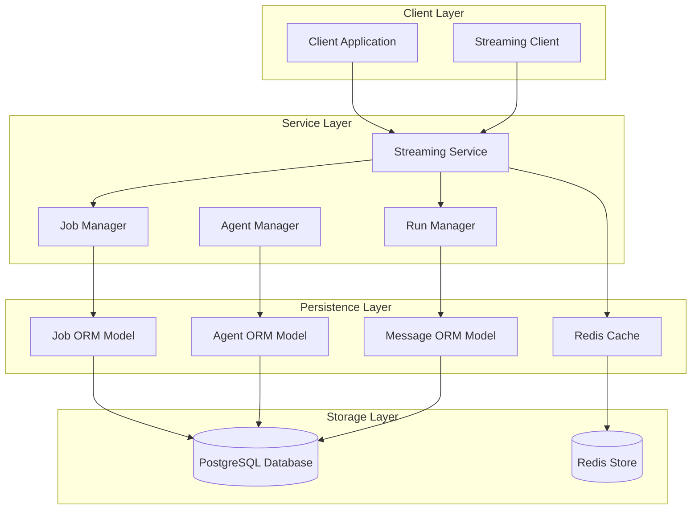
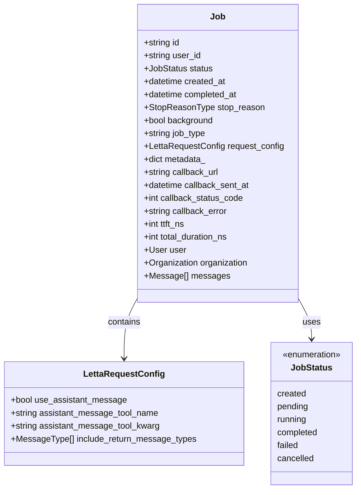
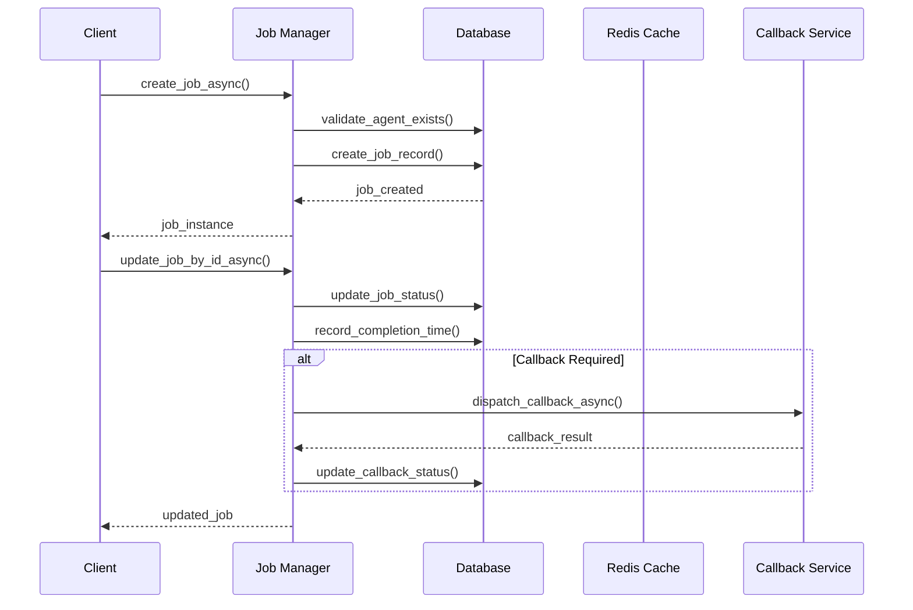
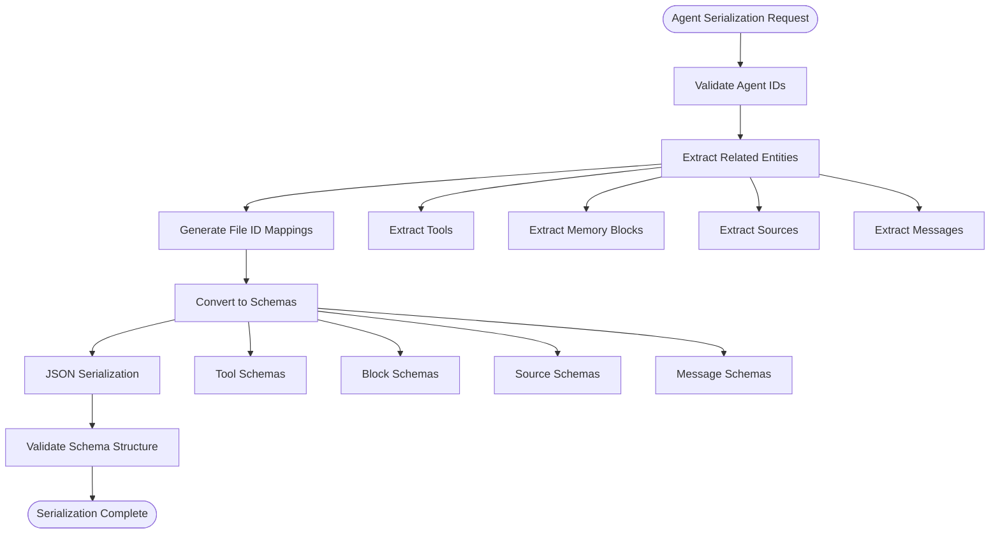
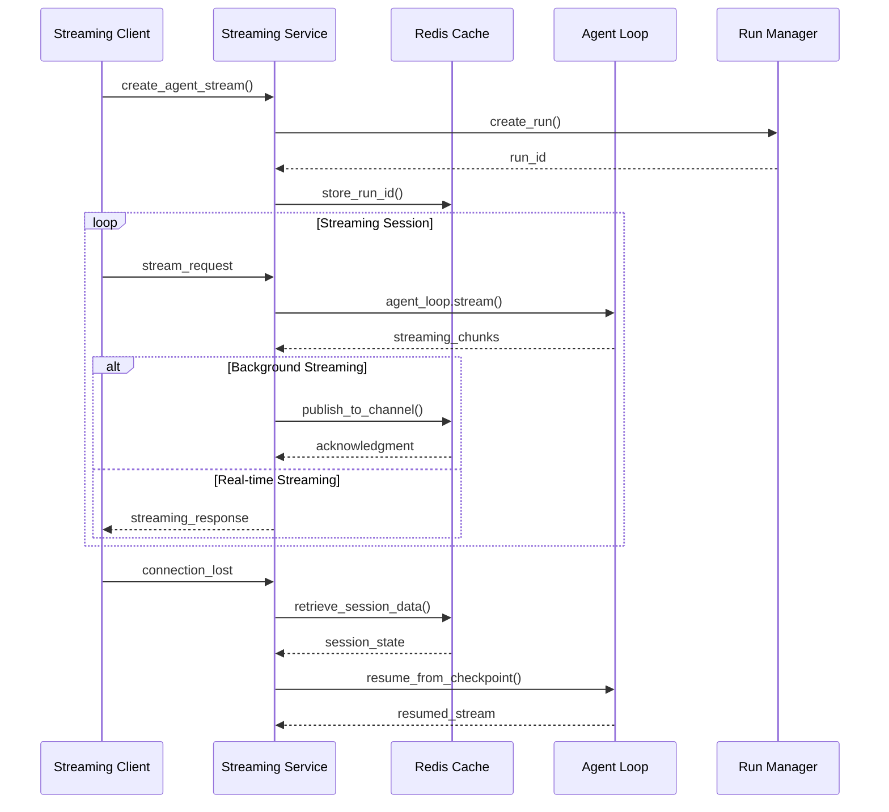
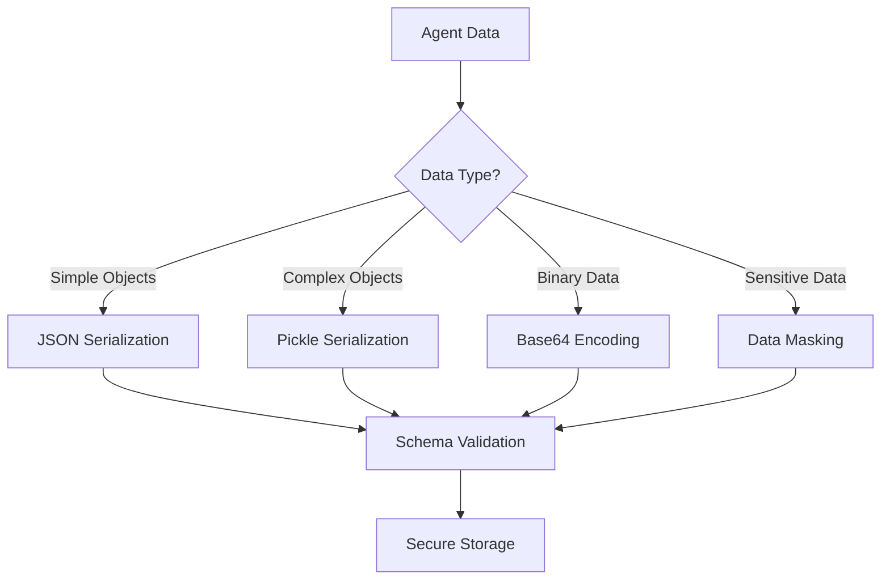
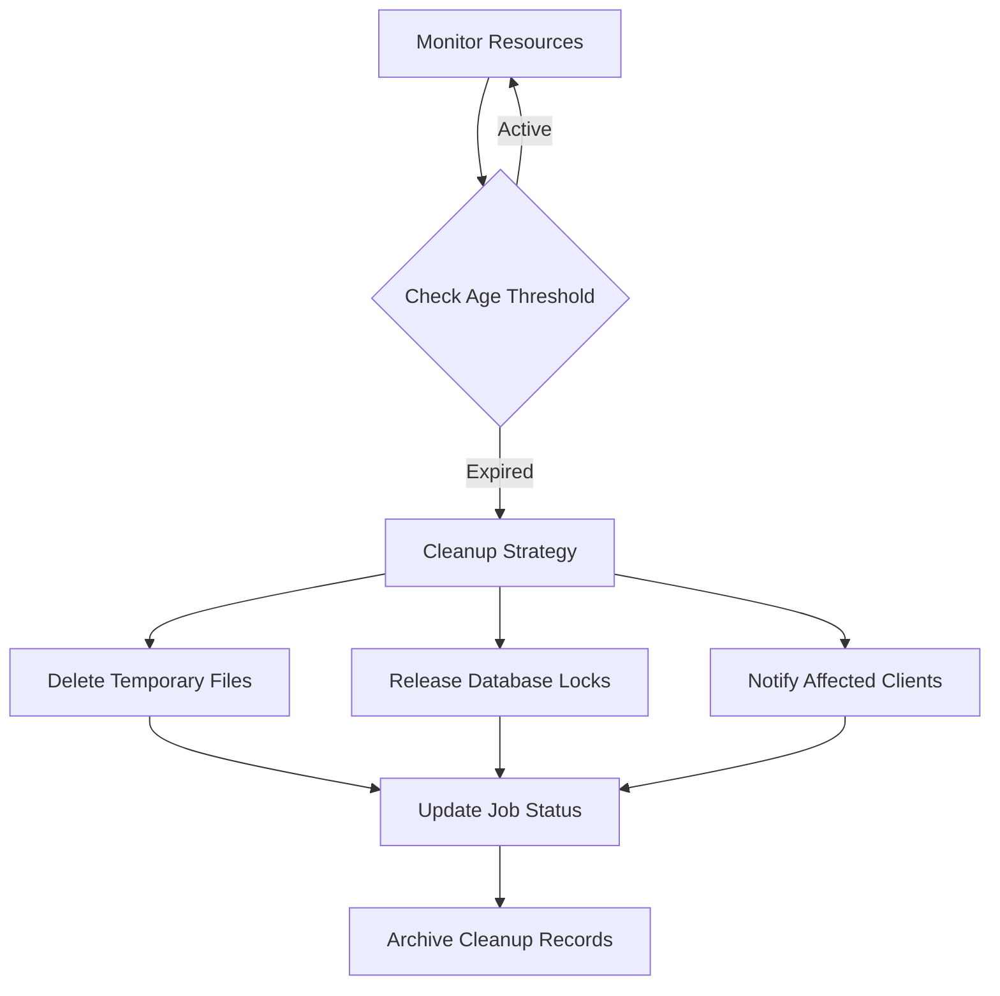

# State Persistence Mechanism

<cite>
**Referenced Files in This Document**
- [letta/orm/job.py](file://letta/orm/job.py)
- [letta/services/job_manager.py](file://letta/services/job_manager.py)
- [letta/agents/letta_agent.py](file://letta/agents/letta_agent.py)
- [letta/client/streaming.py](file://letta/client/streaming.py)
- [letta/schemas/job.py](file://letta/schemas/job.py)
- [letta/agents/base_agent.py](file://letta/agents/base_agent.py)
- [letta/services/agent_serialization_manager.py](file://letta/services/agent_serialization_manager.py)
- [letta/services/streaming_service.py](file://letta/services/streaming_service.py)
- [letta/server/rest_api/auth_token.py](file://letta/server/rest_api/auth_token.py)
</cite>

## Table of Contents
1. [Introduction](#introduction)
2. [System Architecture Overview](#system-architecture-overview)
3. [Job Model and State Capture](#job-model-and-state-capture)
4. [Job Manager and Serialization](#job-manager-and-serialization)
5. [Agent State Persistence](#agent-state-persistence)
6. [Streaming Session Management](#streaming-session-management)
7. [JSON Serialization and Data Integrity](#json-serialization-and-data-integrity)
8. [Garbage Collection and Cleanup](#garbage-collection-and-cleanup)
9. [Best Practices and Optimization](#best-practices-and-optimization)
10. [Troubleshooting and Monitoring](#troubleshooting-and-monitoring)

## Introduction

Letta's state persistence mechanism enables seamless resumable streaming operations through sophisticated job management, agent state serialization, and session continuity features. The system captures execution state through structured data models, maintains intermediate results during long-running operations, and provides robust recovery capabilities after disconnections or interruptions.

The persistence system operates on multiple levels: job-level state tracking for background operations, agent-level memory preservation for conversational continuity, and streaming session management for real-time communication. This multi-layered approach ensures data consistency while minimizing storage overhead and maximizing resumability.

## System Architecture Overview

The state persistence system in Letta follows a hierarchical architecture that manages state at different granularities:



**Diagram sources**
- [letta/services/streaming_service.py](file://letta/services/streaming_service.py#L53-L690)
- [letta/services/job_manager.py](file://letta/services/job_manager.py#L34-L600)
- [letta/orm/job.py](file://letta/orm/job.py#L19-L66)

The architecture implements a separation of concerns where the streaming service manages real-time communication, the job manager handles background operations, and the ORM models provide data persistence. Redis serves as a high-performance cache for frequently accessed session data.

**Section sources**
- [letta/services/streaming_service.py](file://letta/services/streaming_service.py#L53-L100)
- [letta/services/job_manager.py](file://letta/services/job_manager.py#L34-L80)

## Job Model and State Capture

### Job Model Structure

The Job model serves as the central state container for long-running operations, capturing essential execution metadata and configuration:



**Diagram sources**
- [letta/orm/job.py](file://letta/orm/job.py#L19-L66)
- [letta/schemas/job.py](file://letta/schemas/job.py#L94-L120)

### State Fields and Their Roles

The Job model captures comprehensive execution state through several key fields:

| Field | Type | Purpose | Persistence Level |
|-------|------|---------|-------------------|
| `request_config` | LettaRequestConfig | Streaming configuration and message formatting preferences | High |
| `status` | JobStatus | Current execution state with lifecycle tracking | Medium |
| `callback_data` | dict | Metadata for external notifications and webhooks | Low |
| `ttft_ns` | int | Time-to-first-token measurement in nanoseconds | Performance |
| `total_duration_ns` | int | Complete execution duration tracking | Performance |

### Request Configuration Management

The `request_config` field encapsulates streaming preferences and message formatting rules:

```python
# Example configuration structure
{
    "use_assistant_message": True,
    "assistant_message_tool_name": "send_message",
    "assistant_message_tool_kwarg": "message",
    "include_return_message_types": ["assistant_message", "tool_call"]
}
```

This configuration enables clients to customize message delivery formats and control which message types are included in streaming responses, ensuring compatibility across different client implementations.

**Section sources**
- [letta/orm/job.py](file://letta/orm/job.py#L40-L42)
- [letta/schemas/job.py](file://letta/schemas/job.py#L94-L120)

## Job Manager and Serialization

### Job Lifecycle Management

The Job Manager orchestrates job state transitions and provides robust serialization capabilities:



**Diagram sources**
- [letta/services/job_manager.py](file://letta/services/job_manager.py#L39-L148)

### State Transition Guards

The Job Manager implements strict state transition validation to prevent invalid state changes:

```python
# Valid state transitions
VALID_TRANSITIONS = {
    JobStatus.created: [JobStatus.pending, JobStatus.cancelled],
    JobStatus.pending: [JobStatus.running, JobStatus.failed],
    JobStatus.running: [JobStatus.completed, JobStatus.failed, JobStatus.cancelled]
}
```

These guards ensure that jobs progress through valid states only, preventing race conditions and maintaining data integrity during concurrent operations.

### Background Job Processing

The system supports background job execution with automatic callback notifications:

```python
# Background job configuration
background_job = PydanticJob(
    status=JobStatus.created,
    background=True,
    callback_url="https://webhook.example.com/notifications",
    metadata={"operation": "file_processing", "file_count": 5}
)
```

**Section sources**
- [letta/services/job_manager.py](file://letta/services/job_manager.py#L76-L148)
- [letta/services/job_manager.py](file://letta/services/job_manager.py#L128-L147)

## Agent State Persistence

### Agent Serialization Architecture

The Agent Serialization Manager provides comprehensive state preservation through structured serialization:



**Diagram sources**
- [letta/services/agent_serialization_manager.py](file://letta/services/agent_serialization_manager.py#L361-L445)

### Memory Block Preservation

Agent memory blocks represent the core state persistence mechanism:

```python
# Memory block structure for state preservation
memory_blocks = [
    {
        "label": "core_memory",
        "value": "Human: {{human}}\nAI: {{ai}}",
        "limit": 2048
    },
    {
        "label": "conversation_summary",
        "value": "Summary of previous conversation...",
        "limit": 1024
    }
]
```

These blocks maintain contextual information across serialization boundaries, ensuring that agent personality and conversation history remain intact during state restoration.

### Message History Management

The system preserves complete message histories with intelligent ID remapping:

```python
# Message preservation with ID mapping
original_message = {
    "id": "msg-123",
    "role": "user",
    "content": "Hello, how are you?",
    "agent_id": "agent-456"
}

# During serialization, IDs are remapped to maintain referential integrity
serialized_message = {
    "id": "msg-file-1",
    "role": "user",
    "content": "Hello, how are you?",
    "agent_id": "agent-file-2"
}
```

**Section sources**
- [letta/services/agent_serialization_manager.py](file://letta/services/agent_serialization_manager.py#L190-L265)
- [letta/services/agent_serialization_manager.py](file://letta/services/agent_serialization_manager.py#L701-L730)

## Streaming Session Management

### Resumable Streaming Architecture

The streaming service enables continuous communication despite network interruptions:



**Diagram sources**
- [letta/services/streaming_service.py](file://letta/services/streaming_service.py#L69-L220)
- [letta/services/streaming_service.py](file://letta/services/streaming_service.py#L298-L439)

### Session Continuity Features

The streaming system maintains session continuity through multiple mechanisms:

| Feature | Implementation | Purpose |
|---------|----------------|---------|
| Run Tracking | Redis-based session storage | Enables connection recovery |
| Checkpointing | Agent state snapshots | Allows partial execution restart |
| Cancellation Awareness | Graceful interruption handling | Prevents orphaned sessions |
| Keep-alive Mechanisms | Periodic heartbeat signals | Maintains connection stability |

### Error Recovery and Resumption

The system implements comprehensive error recovery:

```python
# Error recovery flow
try:
    stream = agent_loop.stream(input_messages, max_steps=100)
    async for chunk in stream:
        yield chunk
except ConnectionError:
    # Attempt to resume from last checkpoint
    resume_state = await self._get_checkpoint_state(run_id)
    if resume_state:
        await agent_loop.resume(resume_state)
        # Continue streaming from checkpoint
```

**Section sources**
- [letta/services/streaming_service.py](file://letta/services/streaming_service.py#L111-L177)
- [letta/services/streaming_service.py](file://letta/services/streaming_service.py#L298-L439)

## JSON Serialization and Data Integrity

### Serialization Strategies

The system employs multiple serialization approaches based on data characteristics:



**Diagram sources**
- [letta/services/agent_serialization_manager.py](file://letta/services/agent_serialization_manager.py#L190-L265)

### Data Integrity Measures

Several mechanisms ensure data integrity during serialization:

1. **Checksum Validation**: Each serialized payload includes integrity checksums
2. **Schema Validation**: Pre/post-serialization schema verification
3. **Version Compatibility**: Backward compatibility checks for schema evolution
4. **Encryption**: Sensitive data encryption using AES-256

### Transient vs Persistent State

The system distinguishes between transient and persistent state:

| State Type | Characteristics | Persistence Strategy |
|------------|-----------------|---------------------|
| Transient | Runtime-only, recreated as needed | Discarded after use |
| Persistent | Long-term storage, restored on demand | Serialized to disk/DB |
| Cached | Frequently accessed, short-lived | Redis cache with TTL |

**Section sources**
- [letta/services/agent_serialization_manager.py](file://letta/services/agent_serialization_manager.py#L227-L232)
- [letta/services/agent_serialization_manager.py](file://letta/services/agent_serialization_manager.py#L494-L523)

## Garbage Collection and Cleanup

### Abandoned Job Detection

The system implements automated detection and cleanup of abandoned jobs:

```python
# Job cleanup criteria
ABANDONED_JOB_THRESHOLD = timedelta(hours=24)
MAX_RETRY_ATTEMPTS = 3

async def cleanup_abandoned_jobs():
    """Clean up jobs that haven't made progress for threshold period."""
    abandoned_jobs = await job_manager.find_abandoned_jobs(
        threshold=ABANDONED_JOB_THRESHOLD,
        max_attempts=MAX_RETRY_ATTEMPTS
    )
    
    for job in abandoned_jobs:
        await job_manager.cleanup_abandoned_job(job)
```

### Resource Cleanup Strategies

Multiple cleanup strategies address different resource types:



**Diagram sources**
- [letta/services/job_manager.py](file://letta/services/job_manager.py#L308-L315)

### Memory Management

The system implements intelligent memory management:

1. **Lazy Loading**: Load agent state only when needed
2. **Caching Policies**: Configure cache expiration and eviction
3. **Memory Pressure Handling**: Reduce memory usage under pressure
4. **Garbage Collection Hooks**: Automatic cleanup triggers

**Section sources**
- [letta/services/job_manager.py](file://letta/services/job_manager.py#L308-L315)

## Best Practices and Optimization

### Storage Optimization

To minimize storage overhead while maintaining resumability:

1. **Incremental Snapshots**: Capture only changed state portions
2. **Compression**: Use gzip compression for serialized data
3. **TTL Management**: Set appropriate expiration times for temporary data
4. **Partitioning**: Distribute data across multiple storage tiers

### Performance Considerations

Key performance optimization strategies:

| Optimization | Implementation | Impact |
|--------------|----------------|--------|
| Connection Pooling | Database connection reuse | Reduced latency |
| Async Operations | Non-blocking I/O operations | Improved throughput |
| Batch Processing | Group related operations | Lower overhead |
| Caching Layers | Multi-level caching strategy | Faster access |

### Data Consistency Patterns

The system employs several consistency patterns:

```python
# Atomic state updates
async def update_agent_state_atomic(agent_id: str, updates: dict):
    """Ensure atomic state updates with rollback capability."""
    async with db.transaction():
        agent = await agent_manager.get_agent_by_id(agent_id)
        agent.update(updates)
        await agent_manager.save_agent(agent)
        # If validation fails, transaction rolls back automatically
```

### Monitoring and Observability

Comprehensive monitoring ensures system reliability:

```python
# Key metrics to monitor
metrics = {
    "serialization_time": histogram("agent_serialization_duration"),
    "deserialization_errors": counter("agent_deserialization_failures"),
    "job_completion_rate": gauge("job_completion_rate"),
    "session_recovery_rate": gauge("session_recovery_rate")
}
```

**Section sources**
- [letta/services/agent_serialization_manager.py](file://letta/services/agent_serialization_manager.py#L361-L445)
- [letta/services/streaming_service.py](file://letta/services/streaming_service.py#L53-L100)

## Troubleshooting and Monitoring

### Common Issues and Solutions

| Issue | Symptoms | Solution |
|-------|----------|----------|
| Serialization Failures | JSON decode errors | Validate schema before serialization |
| Memory Leaks | Increasing memory usage | Implement proper cleanup hooks |
| Connection Timeouts | Streaming interruptions | Configure appropriate timeouts |
| State Corruption | Inconsistent agent behavior | Add integrity validation |

### Diagnostic Tools

The system provides several diagnostic capabilities:

```python
# State validation utility
def validate_agent_state(state: AgentState) -> ValidationResult:
    """Validate agent state integrity."""
    validator = StateValidator()
    return validator.validate(state)
```

### Logging and Debugging

Comprehensive logging supports troubleshooting:

```python
# Structured logging for state operations
logger.info(
    "Agent state serialized",
    extra={
        "agent_id": agent_id,
        "size_bytes": len(serialized_data),
        "serialization_time_ms": duration_ms,
        "schema_version": SCHEMA_VERSION
    }
)
```

### Health Checks

Regular health checks ensure system reliability:

```python
# Health check implementation
async def check_state_persistence_health() -> HealthStatus:
    """Check state persistence system health."""
    checks = {
        "database_connection": await db.ping(),
        "redis_connection": await redis.ping(),
        "serialization_performance": await check_serialization_speed(),
        "cleanup_operations": await check_cleanup_health()
    }
    
    return HealthStatus.from_checks(checks)
```

**Section sources**
- [letta/services/agent_serialization_manager.py](file://letta/services/agent_serialization_manager.py#L446-L449)
- [letta/services/streaming_service.py](file://letta/services/streaming_service.py#L298-L439)